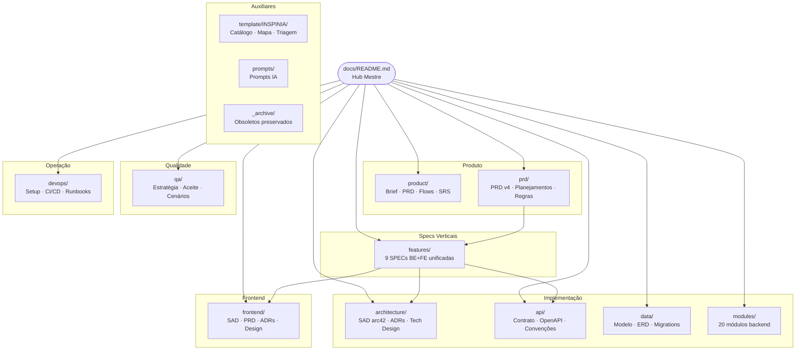

# Portal ArtFinal v2 — Hub da Documentação

> Plataforma de Gestão de Formaturas. Documentação **única**, versionada junto ao código, navegável via Docsify.

---

## Arquitetura da Documentação



---

## Mapa de Seções

| Pasta                | Propósito                                                              | Audiência                      | Entrada                                                                |
| -------------------- | ---------------------------------------------------------------------- | ------------------------------ | ---------------------------------------------------------------------- |
| `product/`           | Visão de produto — o quê e para quem                                   | PO, stakeholders, UX           | [product/README.md](product/README.md)                                 |
| `prd/`               | Fontes primárias: PRD v4, planejamentos executáveis, regras de negócio | Todos                          | [prd/README.md](prd/README.md)                                         |
| `architecture/`      | SAD arc42, ADRs, technical designs de módulos críticos                 | Arquitetos, dev backend        | [architecture/SAD-arc42.md](architecture/SAD-arc42.md)                 |
| `api/`               | Contrato REST completo, OpenAPI, convenções, changelog                 | Backend, frontend, integrações | [api/api-contract.md](api/api-contract.md)                             |
| `data/`              | Modelo de dados, ERD, plano de migrations, glossário                   | Backend, DBA                   | [data/data-model.md](data/data-model.md)                               |
| `features/`          | **9 SPECs verticais BE+FE** — o elo entre backend e frontend           | Todos que implementam          | [features/README.md](features/README.md)                               |
| `modules/`           | Documentação per-módulo do backend Laravel (20 módulos)                | Dev backend                    | [modules/README.md](modules/README.md)                                 |
| `frontend/`          | SAD, PRD, ADRs e technical design do SPA React                         | Dev frontend                   | [frontend/00-README-INDEX.md](frontend/00-README-INDEX.md)             |
| `qa/`                | Estratégia, critérios de aceite BDD, cenários críticos, NFRs           | QA, dev líderes                | [qa/qa-strategy.md](qa/qa-strategy.md)                                 |
| `devops/`            | Dev setup, padrões, CI/CD, runbooks, monitoramento, segurança          | DevOps, SRE, on-call           | [devops/dev-setup.md](devops/dev-setup.md)                             |
| `template/INSPINIA/` | Catálogo de componentes Blade, mapa tela→componente, triagem           | Dev frontend admin             | [template/INSPINIA/template-map.md](template/INSPINIA/template-map.md) |
| `_archive/`          | Docs obsoletos preservados por rastreabilidade                         | Histórico                      | [\_archive/README.md](_archive/README.md)                              |

---

## Rotas de Leitura por Persona

### Novo dev backend

```
prd/README.md → prd/PLANEJAMENTO_BACKEND_APIV1.md
→ architecture/SAD-arc42.md → data/data-model.md
→ api/api-contract.md → features/README.md → modules/README.md
→ devops/dev-setup.md → devops/conventions.md
```

### Novo dev frontend

```
prd/PLANEJAMENTO_FRONTEND_REACT.md
→ frontend/00-README-INDEX.md → frontend/05-FRONTEND-SAD.md
→ api/api-contract.md → features/README.md
→ frontend/09-TECHNICAL-DESIGN-CRITICAL-MODULES.md
→ devops/dev-setup.md
```

### QA

```
qa/qa-strategy.md → qa/acceptance-criteria.md
→ features/README.md → [SPEC relevante]
→ api/api-contract.md → qa/critical-scenarios.md
```

### DevOps / SRE / On-call

```
devops/dev-setup.md → devops/engineering-standards.md
→ devops/ci-cd.md → devops/runbook-deploy.md
→ devops/runbook-operations.md → devops/monitoring-alerts.md
→ data/migrations-plan.md → devops/infra.md
```

### Stakeholder / PO

```
product/README.md → product/PROJECT_BRIEF.md
→ prd/PRD_v4.md → product/user-flows.md
→ prd/ROADMAP.md
```

---

## Princípios Não Negociáveis

_(fonte: [prd/PLANEJAMENTO_BACKEND_APIV1.md §0](prd/PLANEJAMENTO_BACKEND_APIV1.md))_

1. **Monólito modular Laravel 13.** Sem microservices no MVP.
2. **API-first obrigatória.** `api/v1` é a interface oficial para React web e React Native.
3. **Core independente da camada HTTP.** Toda regra vive em `Actions/`, `Services/`, `Data/`, `Enums/` e `Models/`.
4. **Idempotência obrigatória** em pagamentos, reservas e webhooks (`X-Idempotency-Key`).
5. **Concorrência is first-class concern** em seating e pagamentos (`FOR UPDATE SKIP LOCKED`).
6. **Snapshots imutáveis** em adesão concluída, pagamento, convite emitido, reserva confirmada.
7. **`declare(strict_types=1)`** em 100% dos arquivos PHP.
8. **ULID público, BIGINT interno.** IDs sequenciais nunca aparecem em URL, token ou API.
9. **Auditoria append-only** via `spatie/laravel-activitylog`.
10. **Nenhum dado de cartão armazenado.** Apenas tokens do provedor.

---

## Servir Localmente

```bash
npx docsify-cli serve docs --port 3000
```

Acesse `http://localhost:3000`. Detalhes em [site/README.md](site/README.md).

---

## Convenção de Idioma

- **Conteúdo de negócio:** PT-BR (`$formando`, `$parcela`, `StatusParcela::PAGO`)
- **Código, namespaces, tipos técnicos:** inglês (PSR-12, Laravel conventions)

Ver [devops/conventions.md](devops/conventions.md) para a regra completa.
