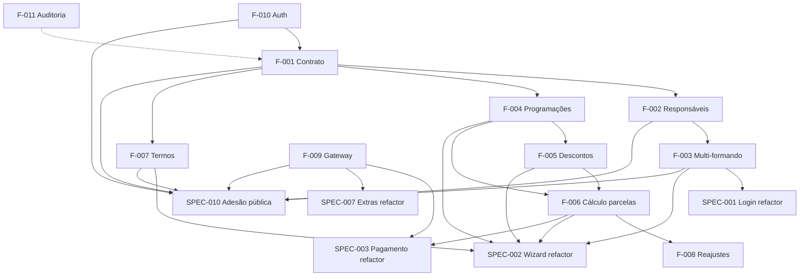

# Plano de Reorganização de SPECs

> Documento umbrella. Mapeia toda a rede de especificações do Portal ArtFinal, suas dependências e o estado de cada uma. Fonte de verdade para navegar entre PRD v4, Foundation SPECs, SPECs existentes e SPECs novos.
> Origem: `docs/superpowers/specs/2026-04-19-reorganizacao-specs-adesao-publica-design.md`.

---

## 1. Motivação

A transição do PRD v3.1.0 para o PRD v4 converteu o PRD em documento de **visão estratégica** e perdeu a camada de **especificação funcional**. Conceitos de negócio governantes sumiram (Contrato como entidade, responsáveis, multi-formando, programações de valor, descontos, cálculo de parcelas, termos versionados). Os SPECs 001–009 foram escritos sobre essa base incompleta e replicam os mesmos buracos.

Este plano:

1. Recupera os conceitos via **Foundation SPECs** (Camada 1)
2. Atualiza os SPECs existentes para consumir a Foundation (Camada 2)
3. Cria SPECs novos (incluindo adesão pública via código da turma — Camada 3)
4. Arquiva o que saiu do v1 (Seating, Enquetes)

---

## 2. Mapa da rede de SPECs

### 2.1 Camada 1 — Foundation SPECs

Cobrem conceitos de domínio. Devem ser escritos/revisados antes de qualquer implementação de feature dependente.

| ID                                                             | Título                               | Status |     SP | Depende      | Recupera de v3 |
| -------------------------------------------------------------- | ------------------------------------ | ------ | -----: | ------------ | -------------- |
| [F-001](features/foundation/SPEC-F-001-contrato-e-turma.md)    | Contrato e Turma                     | draft  |      5 | —            | §4             |
| [F-002](features/foundation/SPEC-F-002-responsaveis.md)        | Responsáveis (cadastro + financeiro) | stub   |      3 | F-001        | §4, §11        |
| [F-003](features/foundation/SPEC-F-003-multi-formando.md)      | Multi-formando                       | stub   |      5 | F-002        | §11            |
| [F-004](features/foundation/SPEC-F-004-programacoes-valor.md)  | Programações de valor                | stub   |      5 | F-001        | §6             |
| [F-005](features/foundation/SPEC-F-005-descontos-condicoes.md) | Descontos e condições de pagamento   | stub   |      5 | F-004        | §7             |
| [F-006](features/foundation/SPEC-F-006-calculo-parcelas.md)    | Cálculo dinâmico de parcelas         | stub   |      8 | F-004, F-005 | §9             |
| [F-007](features/foundation/SPEC-F-007-termos-versionados.md)  | Termos versionados                   | stub   |      5 | F-001        | §10            |
| [F-008](features/foundation/SPEC-F-008-reajustes.md)           | Reajustes contratuais                | stub   |      3 | F-006        | §14.16         |
| [F-009](features/foundation/SPEC-F-009-gateway-pagamento.md)   | Gateway de pagamento (infra)         | stub   |      8 | —            | §15            |
| [F-010](features/foundation/SPEC-F-010-auth-authz.md)          | Auth & Authorization base            | draft  |      3 | —            | §11            |
| [F-011](features/foundation/SPEC-F-011-auditoria.md)           | Auditoria append-only                | stub   |      2 | —            | §14.22         |
|                                                                | **Total Foundation**                 |        | **52** |              |                |

### 2.2 Camada 2 — Refactor dos SPECs existentes

Absorvem os conceitos da Foundation. Cada refactor é um pequeno projeto de migração documental.

| ID                                                    | Título                      | Mudança                                                                                                    | Status           |     SP |
| ----------------------------------------------------- | --------------------------- | ---------------------------------------------------------------------------------------------------------- | ---------------- | -----: |
| [SPEC-001](features/SPEC-001-login.md)                | Login                       | `/me` → `formandos[]`, expõe responsáveis                                                                  | refactor-pending |      2 |
| [SPEC-002](features/SPEC-002-wizard-adesao.md)        | Wizard de adesão            | `evento_ulid → contrato_ulid`; 2 responsáveis; programações; descontos; termo versionado; seletor formando | refactor-pending |     13 |
| [SPEC-003](features/SPEC-003-financeiro-pagamento.md) | Financeiro + Pagamento      | Cálculo dinâmico; reajustes; depender de F-009                                                             | refactor-pending |      5 |
| [SPEC-004](features/SPEC-004-convites-cotas.md)       | Convites e cotas            | `contrato.evento_id` em vez de adesão direto                                                               | refactor-pending |      2 |
| [SPEC-005](features/SPEC-005-rsvp-publico.md)         | RSVP público                | Context formando ativo                                                                                     | refactor-pending |      2 |
| ~~SPEC-006~~                                          | ~~Seating / Mapa de Mesas~~ | **Arquivado v1** — ver [BACKLOG_FUTURO.md](roadmap/BACKLOG_FUTURO.md)                                      | archived         |      — |
| [SPEC-007](features/SPEC-007-extras.md)               | Extras                      | Depender de F-009                                                                                          | refactor-pending |      2 |
| ~~SPEC-008~~                                          | ~~Enquetes~~                | **Arquivado v1** — ver [BACKLOG_FUTURO.md](roadmap/BACKLOG_FUTURO.md)                                      | archived         |      — |
| [SPEC-009](features/SPEC-009-perfil.md)               | Perfil                      | Responsáveis separados; múltiplos formandos                                                                | refactor-pending |      3 |
|                                                       | **Total refactor**          |                                                                                                            |                  | **29** |

### 2.3 Camada 3 — SPECs novos

| ID                                                              | Título                                | Status     |  SP | Depende                                                       |
| --------------------------------------------------------------- | ------------------------------------- | ---------- | --: | ------------------------------------------------------------- |
| [SPEC-010](features/SPEC-010-adesao-publica-codigo-contrato.md) | Adesão pública via código do contrato | plan-ready |  52 | F-001, F-002, F-003, F-004, F-005, F-006, F-007, F-009, F-010 |

> SPEC-010 v2.0.0 (2026-04-23): código público agora em `contratos.codigo_acesso`; inversão `Contrato hasMany Turmas`; pacotes com `categoria` enum; wizard ganha etapas de "escolher curso+período" e "escolher pacote formatura". Plano de implementação atualizado em [docs/superpowers/plans/2026-04-19-adesao-publica-codigo-contrato-plan.md](superpowers/plans/2026-04-19-adesao-publica-codigo-contrato-plan.md).

| SPEC-011 | Admin: gestão de Contratos e Turmas | backlog | 8 | F-001 |
| SPEC-012 | Admin: Pacotes, Programações, Descontos | backlog | 8 | F-004, F-005 |
| SPEC-013 | Admin: gestão de Termos | backlog | 5 | F-007 |
| SPEC-014 | Admin: Formandos e Responsáveis | backlog | 5 | F-003 |
| SPEC-015 | E-mails transacionais | backlog | 5 | — |
| | **Total novos** | | **44** | |

### 2.4 Totais

| Camada     | SP de documentação |
| ---------- | -----------------: |
| Foundation |                 52 |
| Refactor   |                 29 |
| Novos      |                 44 |
| **Total**  |         **125 SP** |

---

## 3. Dependências entre camadas



---

## 4. Ordem sugerida de execução

### 4.1 Fase documental (antes de código novo)

1. ✅ Design doc (`docs/superpowers/specs/2026-04-19-*.md`)
2. ✅ SPEC-RESTRUCTURE-PLAN.md (este documento)
3. ✅ BACKLOG_FUTURO.md
4. ✅ Archive: SPEC-006 e SPEC-008 para `_archive/future/`
5. 🔄 Foundation stubs (F-001 a F-011) — em curso
6. 🔄 SPEC-010 completa — em curso

### 4.2 Expansão de stubs por fase de implementação

| Fase          | Foundation a expandir             | SPECs refactor     | SPECs novos a implementar    |
| ------------- | --------------------------------- | ------------------ | ---------------------------- |
| F1 (em curso) | F-010, F-011                      | —                  | —                            |
| F2            | F-001, F-002, F-009               | —                  | SPEC-011                     |
| F3            | F-003, F-004, F-005, F-006, F-007 | SPEC-001, SPEC-002 | SPEC-010, SPEC-015           |
| F4            | —                                 | SPEC-003, SPEC-004 | —                            |
| F6            | F-008 (ou arquivar)               | SPEC-007           | SPEC-012, SPEC-013, SPEC-014 |
| F7            | —                                 | SPEC-005, SPEC-009 | —                            |

### 4.3 Atualizações cruzadas necessárias

Esses documentos precisam ser atualizados em lote quando as Foundation SPECs forem expandidas:

- `docs/prd/PRD_v4.md` §1.4 (Fora do core inicial — adicionar enquetes + seating)
- `docs/prd/PRD_v4.md` §3.4 (Seating bounded context — deprecar)
- `docs/prd/PRD_v4.md` §3.5 (Engajamento bounded context — deprecar)
- `docs/prd/PRD_v4.md` §5.1 (ER — remover entidades deferidas)
- `docs/prd/PRD_v4.md` §6.4, §6.6 (regras de negócio — remover)
- `docs/prd/PLANEJAMENTO_BACKEND_APIV1.md` (remover controllers/routes/migrations de seating + enquetes)
- `docs/prd/PLANEJAMENTO_FRONTEND_REACT.md` (remover routes/stores de seating + enquetes)
- `docs/prd/ROADMAP.md` F5 (seating) deletar; F6 renomear sem "enquetes"
- `docs/modules/` expandir placeholders quando sprint correspondente chegar

---

## 5. Convenções

### 5.1 Nomenclatura

- **Foundation SPECs**: `SPEC-F-NNN-<kebab>.md` em `docs/features/foundation/`
- **SPECs de feature**: `SPEC-NNN-<kebab>.md` em `docs/features/`
- **SPECs arquivados**: `docs/_archive/future/SPEC-NNN-<kebab>.md` (mesma numeração original)

### 5.2 Frontmatter padrão

```yaml
---
title: <título legível>
version: <semver>
date: <YYYY-MM-DD>
status: <draft | active | refactor-pending | archived | stub>
feature_id: <SPEC-NNN ou SPEC-F-NNN>
fase: <F1..F8 ou foundation>
story_points: <int>
depends_on: [<lista de SPEC-IDs>]
unlocks: [<lista de SPEC-IDs>]
---
```

### 5.3 Status de SPEC

| Status             | Significado                                      |
| ------------------ | ------------------------------------------------ |
| `stub`             | Estrutura criada, conteúdo mínimo (placeholder)  |
| `draft`            | Conteúdo escrito, aguardando revisão             |
| `active`           | Revisado, fonte de verdade para implementação    |
| `refactor-pending` | Escrito mas requer atualização contra Foundation |
| `archived`         | Movido para `_archive/`, referência histórica    |

---

## 6. Referências cruzadas

- **Design doc original:** [`docs/superpowers/specs/2026-04-19-reorganizacao-specs-adesao-publica-design.md`](superpowers/specs/2026-04-19-reorganizacao-specs-adesao-publica-design.md)
- **Backlog futuro:** [`docs/roadmap/BACKLOG_FUTURO.md`](roadmap/BACKLOG_FUTURO.md)
- **PRD v4 (ativo):** [`docs/prd/PRD_v4.md`](prd/PRD_v4.md)
- **PRD v3.1.0 (arquivado, referência histórica):** [`docs/_archive/PRD_Sistema_Formatura_v3.1.0.md`](_archive/PRD_Sistema_Formatura_v3.1.0.md)
- **Planejamento Backend API v1:** [`docs/prd/PLANEJAMENTO_BACKEND_APIV1.md`](prd/PLANEJAMENTO_BACKEND_APIV1.md)
- **Planejamento Frontend React:** [`docs/prd/PLANEJAMENTO_FRONTEND_REACT.md`](prd/PLANEJAMENTO_FRONTEND_REACT.md)
- **Roadmap:** [`docs/prd/ROADMAP.md`](prd/ROADMAP.md)

---

_Manutenção: atualizar este documento sempre que uma SPEC mudar de status, for criada, ou arquivada. Este é o único lugar que lista todas elas._

---

## 7. Estado atual por camada

> Snapshot em 2026-04-20 — após conclusão do planejamento do SPEC-010.

### Camada 1 — Foundation SPECs

| ID                                                            | Status  |
| ------------------------------------------------------------- | ------- |
| F-001                                                         | `draft` |
| F-010                                                         | `draft` |
| F-002, F-003, F-004, F-005, F-006, F-007, F-008, F-009, F-011 | `stub`  |

### Camada 2 — SPECs de feature (refactor)

Todos com status `refactor-pending`.

Mudança crítica a destacar:

- **SPEC-002** (`needs-rewrite` desde 2026-04-23): `evento_ulid → contrato_ulid` em todas as rotas, DTOs e FormRequests; adição de `turma_ulid` e `pacote_ulid` no payload; novas etapas "Escolher curso + período" e "Escolher pacote formatura" (`categoria='formatura'`) antes dos dados pessoais. Migration necessária no plano SPEC-010 v2. Também inclui: `adesoes.portal_user_id` nullable, novos campos `draft_token_hash` e `origem_adesao` (enum: `autenticada` | `publica_codigo_contrato`), 2 responsáveis separados (SPEC-F-002), e inversão `Contrato hasMany Turmas` (SPEC-F-001 v0.3.0).

### Camada 3 — SPECs novos

| ID                                               | Status                                                                                                                                                                      |
| ------------------------------------------------ | --------------------------------------------------------------------------------------------------------------------------------------------------------------------------- |
| SPEC-010                                         | `plan-ready` — plano completo em [superpowers/plans/2026-04-19-adesao-publica-codigo-contrato-plan.md](superpowers/plans/2026-04-19-adesao-publica-codigo-contrato-plan.md) |
| SPEC-011, SPEC-012, SPEC-013, SPEC-014, SPEC-015 | `backlog`                                                                                                                                                                   |
