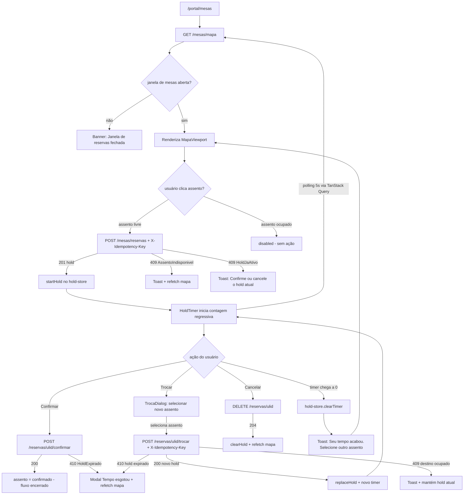
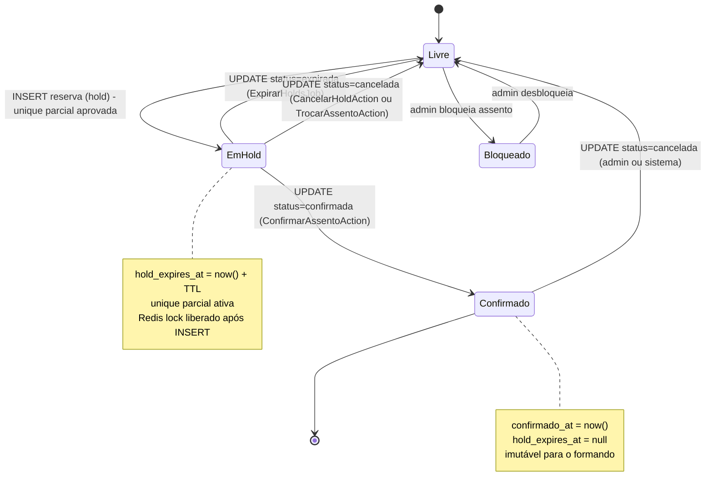
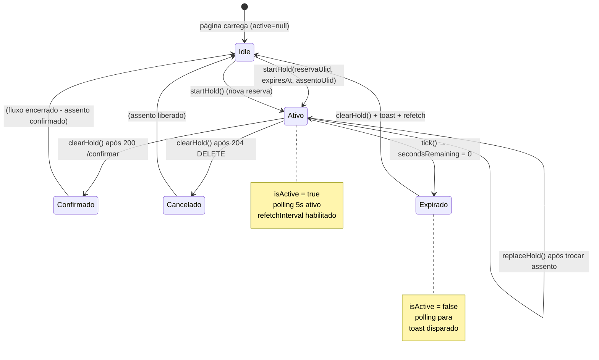

# SPEC-006 — Mapa de Mesas (hold 5min + concorrência)

> **Spec unificada backend + frontend.** Esta é a feature mais crítica do Portal ArtFinal em termos de concorrência e UX. Formandos competem em tempo real por assentos; uma falha aqui gera dupla alocação, litígio e dano de reputação.
> Fontes: [api-contract.md §6](../api/api-contract.md) · [09-TECHNICAL-DESIGN-CRITICAL-MODULES.md §4](../frontend/09-TECHNICAL-DESIGN-CRITICAL-MODULES.md) · [ADR-0006](../architecture/adrs/ADR-0006-concorrencia-seating.md) · [technical-design-seating.md](../architecture/technical-design-seating.md)

---

## 0. Resumo executivo

O formando acessa `/portal/mesas`, visualiza um mapa interativo (setores → mesas → assentos) colorido por disponibilidade em tempo real (via polling de 5s com TanStack Query). Ao clicar em um assento livre, o SPA chama `POST /eventos/{ulid}/mesas/reservas` com `X-Idempotency-Key`; o backend adquire Redis lock de 10s, executa `DB::transaction` com `lockForUpdate`, insere a reserva com `status=hold` e `hold_expires_at = now() + 300s`, e retorna 201. O frontend inicia o `hold-store` com contagem regressiva reconciliada contra o `hold_expires_at` do servidor (fonte de verdade absoluta — nunca timer local puro). O formando tem até 5 minutos para confirmar o assento; pode também trocar (operação atômica) ou cancelar antes do prazo. Ao expirar, o job `ExpirarHoldsJob` (Horizon, `everyMinute`) marca `status=expirada` e libera o assento. SLA: 0% de conflito em 1.000 tentativas simultâneas; P95 ≤ 700ms.

---

## 1. Visão da feature

### 1.1 Jornada macro



### 1.2 Atores

| Ator                  | Ação                                                                                |
| --------------------- | ----------------------------------------------------------------------------------- |
| Formando autenticado  | Reserva, confirma, troca e cancela assentos. Jornada primária.                      |
| Comissão              | Reserva em nome de formandos (campo `origem=comissao`). Fora do escopo do SPA.      |
| Job `ExpirarHoldsJob` | Libera holds vencidos a cada 60s (ator sistêmico, sem interação humana).            |
| Admin                 | Bloqueia assentos individualmente (`status=bloqueada`). Via backoffice, não portal. |
| Mobile F8 (futuro)    | Consome os mesmos endpoints REST com bearer token.                                  |

### 1.3 Valor

- Garante alocação justa de assentos sem conflito (invariante DB + Redis + lockForUpdate).
- UX fluida com feedback visual imediato via polling (sem WebSocket no MVP).
- Idempotência previne dupla reserva por retry de rede ou clique duplo.
- Reconciliação de timer com servidor previne inconsistências de relógio entre cliente e servidor.

### 1.4 Escopo

**In:** mapa snapshot + delta, criar hold, confirmar, cancelar, trocar assento, job de expiração, hold-store com timer reconciliado, polling 5s, toast/alertas de tempo.
**Out:** WebSocket/Reverb real-time (F7), edição do layout do mapa (admin), bloqueio de assento por admin via SPA, múltiplos assentos por reserva, fila de espera.

---

## 2. Contrato da API

### 2.1 `GET /api/v1/eventos/{ulid}/mesas/mapa`

- **Route name:** `api.v1.seating.mapa`
- **Middlewares:** `auth:sanctum`, `throttle:api`
- **Auth:** `auth:sanctum`
- **Cache:** 5 min por evento via `Cache::tags(["evento:{id}", "mapa"])`; invalidado por `AssentoReservado`, `AssentoConfirmado`, `HoldExpirado`, `AssentoLiberado`
- **Idempotência:** não exigida (GET)

**Query params:**

- `since` — ISO 8601. Quando presente, retorna apenas deltas (`updated_at > since`).

**Response 200 (snapshot completo):**

```json
{
    "data": {
        "mapa": { "id": "01J...", "nome": "Salão Principal" },
        "setores": [
            {
                "id": "01J...",
                "nome": "Setor A",
                "mesas": [
                    {
                        "id": "01J...",
                        "numero": "12",
                        "capacidade": 8,
                        "assentos": [
                            { "id": "01J...", "numero": 1, "status_runtime": "livre" },
                            {
                                "id": "01J...",
                                "numero": 2,
                                "status_runtime": "hold",
                                "hold_expires_at": "2026-11-10T14:35:22-03:00"
                            },
                            { "id": "01J...", "numero": 3, "status_runtime": "confirmada", "reserva_id": "01J..." }
                        ]
                    }
                ]
            }
        ],
        "meu_hold": {
            "reserva_id": "01J...",
            "assento_id": "01J...",
            "hold_expires_at": "2026-11-10T14:35:22-03:00"
        },
        "atualizado_em": "2026-11-10T14:30:22-03:00",
        "links": {
            "self": "https://api.portalartfinal.com.br/api/v1/eventos/01J.../mesas/mapa",
            "reservar": "https://api.portalartfinal.com.br/api/v1/eventos/01J.../mesas/reservas"
        }
    }
}
```

**Response 200 (delta via `?since`):**

```json
{
    "data": {
        "deltas": [
            { "assento_id": "01J...", "status_runtime": "hold", "hold_expires_at": "2026-11-10T14:35:22-03:00" },
            { "assento_id": "01J...", "status_runtime": "confirmada", "reserva_id": "01J..." }
        ],
        "atualizado_em": "2026-11-10T14:30:22-03:00"
    }
}
```

**Erros:**

- `401 Unauthenticated` — não autenticado.
- `403 Forbidden` — sem vínculo com o evento.
- `404 NotFound` — evento não existe.

### 2.2 `POST /api/v1/eventos/{ulid}/mesas/reservas`

- **Route name:** `api.v1.seating.reservas.store`
- **Middlewares:** `auth:sanctum`, `idempotent`, `throttle.actor:seating` (5/min/user)
- **Policy:** `ReservaAssentoPolicy::reservar(user, evento)`
- **Idempotência:** `X-Idempotency-Key` obrigatório (ULID/UUID/hash ≤ 80 chars)

**Request:**

```json
{
    "assento_ulid": "01J...",
    "convite_ulid": "01J...",
    "origem": "formando",
    "observacao": "Próximo à família"
}
```

**Validação:**

- `assento_ulid` → `required|string|size:26`
- `convite_ulid` → `nullable|string|size:26`
- `origem` → `required|in:formando,comissao,admin,operacao`
- `observacao` → `nullable|string|max:500`

**Response 201 + `Location`:**

```json
{
    "data": {
        "id": "01J...",
        "status": "hold",
        "mesa": { "id": "01J...", "numero": "12" },
        "assento": { "id": "01J...", "numero": 2 },
        "hold_expires_at": "2026-11-10T14:35:22-03:00",
        "confirmado_at": null,
        "links": {
            "self": "https://api.portalartfinal.com.br/api/v1/eventos/01J.../mesas/reservas/01J...",
            "confirmar": "https://api.portalartfinal.com.br/api/v1/eventos/01J.../mesas/reservas/01J.../confirmar",
            "cancelar": "https://api.portalartfinal.com.br/api/v1/eventos/01J.../mesas/reservas/01J...",
            "trocar": "https://api.portalartfinal.com.br/api/v1/eventos/01J.../mesas/reservas/01J.../trocar"
        }
    }
}
```

**Erros:**

- `409 AssentoIndisponivel` — assento já em hold ou confirmado.
- `409 HoldJaAtivo` — formando já tem hold ativo (deve confirmar ou cancelar primeiro).
- `403 Forbidden` — janela de mesas fechada ou sem vínculo com evento.
- `422 ValidationError` — payload inválido.
- `429 RateLimitExceeded` — mais de 5/min.

### 2.3 `POST /api/v1/eventos/{ulid}/mesas/reservas/{ulid}/confirmar`

- **Route name:** `api.v1.seating.reservas.confirmar`
- **Middlewares:** `auth:sanctum`, `idempotent`
- **Policy:** `ReservaAssentoPolicy::confirmar(user, reserva)` (deve ser dono)

**Request:** sem body.

**Response 200:**

```json
{
    "data": {
        "id": "01J...",
        "status": "confirmada",
        "hold_expires_at": null,
        "confirmado_at": "2026-11-10T14:33:48-03:00",
        "links": {
            "self": "...",
            "confirmar": null,
            "cancelar": "...",
            "trocar": "..."
        }
    }
}
```

**Erros:**

- `410 HoldExpirado` — hold passou dos 5 minutos.
- `409 InvariantViolation` — status atual não é `hold`.

### 2.4 `DELETE /api/v1/eventos/{ulid}/mesas/reservas/{ulid}`

- **Route name:** `api.v1.seating.reservas.destroy`
- **Middlewares:** `auth:sanctum`
- **Policy:** `ReservaAssentoPolicy::delete(user, reserva)`

**Query params:** `?motivo=<string opcional>`

**Response:** `204 No Content`

**Erros:**

- `403 Forbidden` — reserva de outro usuário.
- `409 InvariantViolation` — reserva já em estado final (cancelada/confirmada/expirada).

### 2.5 `POST /api/v1/eventos/{ulid}/mesas/reservas/{ulid}/trocar`

- **Route name:** `api.v1.seating.reservas.trocar`
- **Middlewares:** `auth:sanctum`, `idempotent`, `throttle.actor:seating`
- **Idempotência:** `X-Idempotency-Key` obrigatório

**Request:**

```json
{
    "assento_destino_ulid": "01J...",
    "origem": "formando"
}
```

**Response 200:**

```json
{
    "data": {
        "id": "01J...",
        "status": "hold",
        "mesa": { "id": "01J...", "numero": "14" },
        "assento": { "id": "01J...", "numero": 5 },
        "hold_expires_at": "2026-11-10T14:40:22-03:00",
        "links": { "confirmar": "...", "cancelar": "...", "trocar": "..." }
    }
}
```

**Erros:**

- `409 AssentoIndisponivel` — destino já ocupado.
- `410 HoldExpirado` — hold atual expirou antes da troca.

### 2.6 Headers obrigatórios

| Header              | Direção | Uso                                               |
| ------------------- | ------- | ------------------------------------------------- |
| `X-Request-Id`      | req/res | Correlação de logs (ULID). Gerado pelo cliente.   |
| `X-XSRF-TOKEN`      | req     | Lido do cookie `XSRF-TOKEN` (Axios automático).   |
| `X-Idempotency-Key` | req     | Obrigatório em POST reservar, confirmar e trocar. |
| `Content-Type`      | req     | `application/json`                                |
| `Accept`            | req     | `application/json`                                |

---

## 3. Backend — Laravel 13

### 3.1 Arquivos a criar/modificar

| Arquivo                                                       | Ação      | Responsabilidade                                                                  |
| ------------------------------------------------------------- | --------- | --------------------------------------------------------------------------------- |
| `routes/api/v1.php`                                           | Modificar | Registrar grupo `mesas/*` com prefixo e middlewares.                              |
| `app/Http/Controllers/Api/V1/SeatingController.php`           | Criar     | `mapa()`, `store()`, `confirmar()`, `destroy()`, `trocar()`.                      |
| `app/Http/Requests/Api/V1/Seating/CriarHoldRequest.php`       | Criar     | Validação de `assento_ulid`, `convite_ulid`, `origem`.                            |
| `app/Http/Requests/Api/V1/Seating/TrocarAssentoRequest.php`   | Criar     | Validação de `assento_destino_ulid`, `origem`.                                    |
| `app/Actions/Seating/ReservarAssentoAction.php`               | Criar     | 4 camadas: idempotência + Redis lock + lockForUpdate + unique parcial.            |
| `app/Actions/Seating/ConfirmarReservaAction.php`              | Criar     | Hold → Confirmada, com validação de `hold_expires_at`.                            |
| `app/Actions/Seating/CancelarHoldAction.php`                  | Criar     | Cancela hold/confirmada (marca `status=cancelada`).                               |
| `app/Actions/Seating/TrocarAssentoAction.php`                 | Criar     | Libera atual + reserva destino em transação única.                                |
| `app/Actions/Seating/ExpirarHoldAssentoAction.php`            | Criar     | Expiração de item único; invocada em lote pelo job.                               |
| `app/Services/Seating/HoldService.php`                        | Criar     | TTL, config por evento (`config.hold_ttl_seconds`).                               |
| `app/Services/Seating/DisponibilidadeService.php`             | Criar     | `estaLivre(Assento): bool` (usa unique parcial, bypass cache).                    |
| `app/Jobs/Seating/ExpirarHoldsJob.php`                        | Criar     | Scheduled `everyMinute`, fila `critical-seating`, lote 500.                       |
| `app/Jobs/Seating/PublicarAtualizacaoMapaJob.php`             | Criar     | Publica delta via cache invalidation (Reverb em F7).                              |
| `app/Events/Seating/AssentoReservado.php`                     | Criar     | Dispara após INSERT do hold.                                                      |
| `app/Events/Seating/AssentoConfirmado.php`                    | Criar     | Dispara após confirmação.                                                         |
| `app/Events/Seating/AssentoLiberado.php`                      | Criar     | Dispara após cancelamento.                                                        |
| `app/Events/Seating/HoldExpirado.php`                         | Criar     | Dispara após expiração pelo job.                                                  |
| `app/Listeners/Seating/InvalidarCacheMapaAoReservar.php`      | Criar     | Flush `Cache::tags(["evento:{id}", "mapa"])`.                                     |
| `app/Exceptions/Seating/AssentoIndisponivelException.php`     | Criar     | Mapeada para HTTP 409.                                                            |
| `app/Exceptions/Seating/HoldExpiradoException.php`            | Criar     | Mapeada para HTTP 410.                                                            |
| `app/Http/Resources/V1/Seating/MapaSeatingResource.php`       | Criar     | Serialização completa do mapa.                                                    |
| `app/Http/Resources/V1/Seating/ReservaAssentoResource.php`    | Criar     | Serialização de `ReservaAssento`.                                                 |
| `app/Policies/ReservaAssentoPolicy.php`                       | Criar     | `reservar`, `confirmar`, `delete`.                                                |
| `app/DTOs/Seating/ReservaRequestData.php`                     | Criar     | DTO de entrada para `ReservarAssentoAction`.                                      |
| `app/DTOs/Seating/ReservaResultData.php`                      | Criar     | DTO de saída com `toArray()`.                                                     |
| `database/migrations/xxxx_create_reservas_assentos_table.php` | Criar     | Unique parcial, CHECKs, FKs.                                                      |
| `tests/Feature/Api/V1/Seating/MapaTest.php`                   | Criar     | 3 cenários: snapshot, delta, janela fechada.                                      |
| `tests/Feature/Api/V1/Seating/ReservarAssentoTest.php`        | Criar     | 6 cenários: hold ok, 409, 409 hold ativo, idempotência, concorrência, rate limit. |
| `tests/Feature/Api/V1/Seating/ConfirmarReservaTest.php`       | Criar     | 3 cenários: confirmar ok, hold expirado, hold de outro user.                      |
| `tests/Feature/Api/V1/Seating/CancelarHoldTest.php`           | Criar     | 2 cenários: cancelar ok, cancelar de outro user.                                  |
| `tests/Feature/Api/V1/Seating/TrocarAssentoTest.php`          | Criar     | 3 cenários: trocar ok, destino ocupado, hold expirado.                            |
| `tests/Feature/Api/V1/Seating/ExpirarHoldsJobTest.php`        | Criar     | 3 cenários: expira vencidos, não expira válidos, policy janela.                   |

### 3.2 `ReservarAssentoAction` — 4 camadas (ADR-0006)

```php
<?php
declare(strict_types=1);

namespace App\Actions\Seating;

use App\DTOs\Seating\ReservaRequestData;
use App\DTOs\Seating\ReservaResultData;
use App\Exceptions\Seating\AssentoIndisponivelException;
use App\Models\Assento;
use App\Models\ReservaAssento;
use App\Events\Seating\AssentoReservado;
use App\Services\Seating\HoldService;
use Illuminate\Support\Facades\Cache;
use Illuminate\Support\Facades\DB;

final class ReservarAssentoAction
{
    public function __construct(
        private readonly HoldService $holdService,
    ) {}

    public function execute(ReservaRequestData $data): ReservaResultData
    {
        // Camada 1 — Idempotência (middleware IdempotencyKeyGuard garante antes de chegar aqui)
        // Verifica se já existe reserva com mesma idempotency_key
        $existente = ReservaAssento::where('idempotency_key', $data->idempotencyKey)->first();
        if ($existente !== null) {
            return ReservaResultData::fromModel($existente);
        }

        // Camada 2 — Redis Lock (serializa concorrentes no mesmo assento)
        $lock = Cache::lock("seating:assento:{$data->assentoUlid}", 10);

        return $lock->block(3, function () use ($data): ReservaResultData {
            // Camada 3 — DB Transaction + lockForUpdate
            return DB::transaction(function () use ($data): ReservaResultData {
                /** @var Assento $assento */
                $assento = Assento::where('ulid', $data->assentoUlid)
                    ->lockForUpdate()
                    ->firstOrFail();

                // Validar disponibilidade dentro da transação (nunca usar cache aqui)
                $reservaAtiva = ReservaAssento::where('assento_id', $assento->id)
                    ->whereIn('status', ['hold', 'confirmada'])
                    ->lockForUpdate()
                    ->first();

                if ($reservaAtiva !== null) {
                    throw new AssentoIndisponivelException(
                        "Assento {$assento->ulid} já está reservado.",
                        $assento->ulid,
                    );
                }

                $holdExpiresAt = now()->addSeconds(
                    $this->holdService->getTtl($data->eventoId)
                );

                try {
                    // Camada 4 — Unique parcial (proteção final no DB)
                    $reserva = ReservaAssento::create([
                        'ulid'             => \Str::ulid(),
                        'evento_id'        => $data->eventoId,
                        'mesa_id'          => $assento->mesa_id,
                        'assento_id'       => $assento->id,
                        'convite_id'       => $data->conviteId,
                        'formando_id'      => $data->formandoId,
                        'status'           => 'hold',
                        'origem'           => $data->origem,
                        'idempotency_key'  => $data->idempotencyKey,
                        'hold_expires_at'  => $holdExpiresAt,
                        'observacao'       => $data->observacao,
                        'correlation_id'   => $data->correlationId,
                    ]);
                } catch (\Illuminate\Database\QueryException $e) {
                    // SQLSTATE 23505 = unique_violation (unique parcial ativada)
                    if (str_contains($e->getMessage(), '23505')) {
                        throw new AssentoIndisponivelException(
                            "Conflito de unique parcial no assento {$assento->ulid}.",
                            $assento->ulid,
                        );
                    }
                    throw $e;
                }

                AssentoReservado::dispatch($reserva->id);

                return ReservaResultData::fromModel($reserva);
            });
        });
    }
}
```

### 3.3 `ConfirmarReservaAction`

```php
<?php
declare(strict_types=1);

namespace App\Actions\Seating;

use App\Exceptions\Seating\HoldExpiradoException;
use App\Models\ReservaAssento;
use App\Events\Seating\AssentoConfirmado;
use Illuminate\Support\Facades\DB;

final class ConfirmarReservaAction
{
    public function execute(ReservaAssento $reserva): ReservaAssento
    {
        return DB::transaction(function () use ($reserva): ReservaAssento {
            // lockForUpdate para garantir leitura consistente
            /** @var ReservaAssento $reservaFresh */
            $reservaFresh = ReservaAssento::where('id', $reserva->id)
                ->lockForUpdate()
                ->firstOrFail();

            if ($reservaFresh->status !== 'hold') {
                throw new \DomainException('ReservaAssento não está em hold.');
            }

            if ($reservaFresh->hold_expires_at === null
                || $reservaFresh->hold_expires_at->isPast()) {
                throw new HoldExpiradoException(
                    "Hold da reserva {$reservaFresh->ulid} já expirou.",
                    $reservaFresh->ulid,
                );
            }

            $reservaFresh->update([
                'status'          => 'confirmada',
                'confirmado_at'   => now(),
                'hold_expires_at' => null,
            ]);

            AssentoConfirmado::dispatch($reservaFresh->id);

            return $reservaFresh->fresh();
        });
    }
}
```

### 3.4 `ExpirarHoldsJob` — Horizon, fila `critical-seating`

```php
<?php
declare(strict_types=1);

namespace App\Jobs\Seating;

use App\Models\ReservaAssento;
use App\Events\Seating\HoldExpirado;
use Illuminate\Contracts\Queue\ShouldQueue;
use Illuminate\Foundation\Queue\Queueable;
use Illuminate\Support\Facades\DB;

final class ExpirarHoldsJob implements ShouldQueue
{
    use Queueable;

    public int $tries = 1;
    public int $timeout = 30;

    public function handle(): void
    {
        $vencidos = ReservaAssento::where('status', 'hold')
            ->where('hold_expires_at', '<', now())
            ->limit(500)
            ->pluck('id');

        if ($vencidos->isEmpty()) {
            return;
        }

        DB::transaction(function () use ($vencidos): void {
            ReservaAssento::whereIn('id', $vencidos)
                ->update([
                    'status'          => 'expirada',
                    'hold_expires_at' => null,
                    'updated_at'      => now(),
                ]);
        });

        foreach ($vencidos as $id) {
            HoldExpirado::dispatch($id);
        }
    }
}
```

**Registro no scheduler (`console.php`):**

```php
Schedule::job(ExpirarHoldsJob::class, 'critical-seating')
    ->everyMinute()
    ->onOneServer()
    ->withoutOverlapping(minutes: 5)
    ->name('seating:expirar-holds');
```

### 3.5 `SeatingController` — esqueleto

```php
<?php
declare(strict_types=1);

namespace App\Http\Controllers\Api\V1;

use App\Actions\Seating\ReservarAssentoAction;
use App\Actions\Seating\ConfirmarReservaAction;
use App\Actions\Seating\CancelarHoldAction;
use App\Actions\Seating\TrocarAssentoAction;
use App\DTOs\Seating\ReservaRequestData;
use App\Http\Controllers\Controller;
use App\Http\Requests\Api\V1\Seating\CriarHoldRequest;
use App\Http\Requests\Api\V1\Seating\TrocarAssentoRequest;
use App\Http\Resources\V1\Seating\MapaSeatingResource;
use App\Http\Resources\V1\Seating\ReservaAssentoResource;
use App\Models\Evento;
use App\Models\ReservaAssento;
use App\Services\Seating\DisponibilidadeService;
use Illuminate\Http\Request;
use Illuminate\Http\Response;

final class SeatingController extends Controller
{
    public function mapa(Request $request, Evento $evento): MapaSeatingResource
    {
        $since = $request->query('since');
        $mapa = app(DisponibilidadeService::class)->snapshot($evento, $since);
        return new MapaSeatingResource($mapa);
    }

    public function store(CriarHoldRequest $request, Evento $evento): ReservaAssentoResource
    {
        $this->authorize('reservar', [$evento]);
        $data = ReservaRequestData::fromRequest($request, $evento);
        $resultado = app(ReservarAssentoAction::class)->execute($data);
        return (new ReservaAssentoResource($resultado))
            ->response()
            ->setStatusCode(201)
            ->header('Location', route('api.v1.seating.reservas.show', $resultado->ulid));
    }

    public function confirmar(Request $request, Evento $evento, ReservaAssento $reserva): ReservaAssentoResource
    {
        $this->authorize('confirmar', $reserva);
        $reservaConfirmada = app(ConfirmarReservaAction::class)->execute($reserva);
        return new ReservaAssentoResource($reservaConfirmada);
    }

    public function destroy(Evento $evento, ReservaAssento $reserva): Response
    {
        $this->authorize('delete', $reserva);
        app(CancelarHoldAction::class)->execute($reserva, request()->query('motivo'));
        return response()->noContent();
    }

    public function trocar(TrocarAssentoRequest $request, Evento $evento, ReservaAssento $reserva): ReservaAssentoResource
    {
        $this->authorize('delete', $reserva);
        $novaReserva = app(TrocarAssentoAction::class)->execute($reserva, $request->validated());
        return new ReservaAssentoResource($novaReserva);
    }
}
```

### 3.6 `CriarHoldRequest`

```php
<?php
declare(strict_types=1);

namespace App\Http\Requests\Api\V1\Seating;

use Illuminate\Foundation\Http\FormRequest;

final class CriarHoldRequest extends FormRequest
{
    public function authorize(): bool { return true; }

    public function rules(): array
    {
        return [
            'assento_ulid' => ['required', 'string', 'size:26'],
            'convite_ulid' => ['nullable', 'string', 'size:26'],
            'origem'       => ['required', 'in:formando,comissao,admin,operacao'],
            'observacao'   => ['nullable', 'string', 'max:500'],
        ];
    }

    public function messages(): array
    {
        return [
            'assento_ulid.required' => 'Informe o assento desejado.',
            'assento_ulid.size'     => 'Identificador de assento inválido.',
            'origem.in'             => 'Origem de reserva inválida.',
        ];
    }
}
```

### 3.7 Enums (ADR-0010)

```php
enum StatusReserva: string
{
    case Hold       = 'hold';
    case Confirmada = 'confirmada';
    case Cancelada  = 'cancelada';
    case Expirada   = 'expirada';
    case Bloqueada  = 'bloqueada';

    public function label(): string
    {
        return match($this) {
            self::Hold       => 'Em reserva temporária',
            self::Confirmada => 'Confirmado',
            self::Cancelada  => 'Cancelado',
            self::Expirada   => 'Expirado',
            self::Bloqueada  => 'Bloqueado',
        };
    }

    public function isAtivo(): bool
    {
        return match($this) {
            self::Hold, self::Confirmada => true,
            default                      => false,
        };
    }
}

enum OrigemReserva: string
{
    case Formando = 'formando';
    case Comissao = 'comissao';
    case Admin    = 'admin';
    case Operacao = 'operacao';
}
```

### 3.8 Migration `reservas_assentos` — pontos críticos

```php
// O mais importante — unique parcial e CHECK constraints
$table->unique(['assento_id'], 'uniq_assento_ativo');
// Unique parcial real exige raw SQL:
DB::statement("
    CREATE UNIQUE INDEX uniq_assento_ativo
    ON reservas_assentos (assento_id)
    WHERE status IN ('hold', 'confirmada')
");

DB::statement("
    ALTER TABLE reservas_assentos
    ADD CONSTRAINT hold_consistente
    CHECK (
        (status = 'hold' AND hold_expires_at IS NOT NULL) OR
        (status = 'confirmada' AND confirmado_at IS NOT NULL) OR
        (status NOT IN ('hold', 'confirmada'))
    )
");

DB::statement("
    ALTER TABLE reservas_assentos
    ADD CONSTRAINT status_valido
    CHECK (status IN ('hold', 'confirmada', 'cancelada', 'expirada', 'bloqueada'))
");
```

### 3.9 Rate limiter `seating`

Em `RateLimiterServiceProvider::boot()`:

```php
RateLimiter::for('seating', function (Request $request) {
    $key = 'seating|' . $request->user()?->id . '|' . $request->ip();
    return Limit::perMinute(5)->by($key)->response(function () {
        return response()->json([
            'error'      => 'RateLimitExceeded',
            'message'    => 'Limite de tentativas de reserva excedido. Aguarde.',
            'details'    => null,
            'request_id' => request()->header('X-Request-Id'),
            'timestamp'  => now()->toIso8601String(),
        ], 429);
    });
});
```

### 3.10 Testes Pest (mínimo obrigatório — 14 cenários)

```php
// tests/Feature/Api/V1/Seating/ReservarAssentoTest.php

it('cria hold com status 201 e retorna hold_expires_at', function () {
    $formando = Formando::factory()->create();
    $assento  = Assento::factory()->livre()->create();

    $response = $this->actingAs($formando)
        ->postJson("/api/v1/eventos/{$assento->evento->ulid}/mesas/reservas", [
            'assento_ulid' => $assento->ulid,
            'origem'       => 'formando',
        ], ['X-Idempotency-Key' => \Str::ulid()]);

    $response->assertCreated()
        ->assertJsonPath('data.status', 'hold')
        ->assertJsonStructure(['data' => ['hold_expires_at', 'id', 'links']]);

    expect(ReservaAssento::where('assento_id', $assento->id)->where('status', 'hold')->exists())
        ->toBeTrue();
});

it('retorna 409 AssentoIndisponivel quando assento já em hold por outro formando', function () {
    $formando1 = Formando::factory()->create();
    $formando2 = Formando::factory()->create();
    $assento   = Assento::factory()->comHold()->create();

    $response = $this->actingAs($formando2)
        ->postJson("/api/v1/eventos/{$assento->evento->ulid}/mesas/reservas", [
            'assento_ulid' => $assento->ulid,
            'origem'       => 'formando',
        ], ['X-Idempotency-Key' => \Str::ulid()]);

    $response->assertConflict()
        ->assertJsonPath('error', 'AssentoIndisponivel');
});

it('é idempotente: mesma X-Idempotency-Key retorna o mesmo hold', function () {
    $formando  = Formando::factory()->create();
    $assento   = Assento::factory()->livre()->create();
    $key       = \Str::ulid();

    $r1 = $this->actingAs($formando)
        ->postJson("/api/v1/eventos/{$assento->evento->ulid}/mesas/reservas",
            ['assento_ulid' => $assento->ulid, 'origem' => 'formando'],
            ['X-Idempotency-Key' => $key]);

    $r2 = $this->actingAs($formando)
        ->postJson("/api/v1/eventos/{$assento->evento->ulid}/mesas/reservas",
            ['assento_ulid' => $assento->ulid, 'origem' => 'formando'],
            ['X-Idempotency-Key' => $key]);

    expect($r1->json('data.id'))->toBe($r2->json('data.id'));
    expect(ReservaAssento::where('assento_id', $assento->id)->count())->toBe(1);
});

it('confirmar hold retorna 200 com status confirmada', function () {
    $formando = Formando::factory()->create();
    $reserva  = ReservaAssento::factory()->hold()->forFormando($formando)->create();

    $response = $this->actingAs($formando)
        ->postJson("/api/v1/eventos/{$reserva->evento->ulid}/mesas/reservas/{$reserva->ulid}/confirmar");

    $response->assertOk()
        ->assertJsonPath('data.status', 'confirmada')
        ->assertJsonPath('data.hold_expires_at', null);
});

it('confirmar hold expirado retorna 410 HoldExpirado', function () {
    $formando = Formando::factory()->create();
    $reserva  = ReservaAssento::factory()->holdExpirado()->forFormando($formando)->create();

    $response = $this->actingAs($formando)
        ->postJson("/api/v1/eventos/{$reserva->evento->ulid}/mesas/reservas/{$reserva->ulid}/confirmar");

    $response->assertStatus(410)
        ->assertJsonPath('error', 'HoldExpirado');
});

it('ExpirarHoldsJob expira apenas holds vencidos', function () {
    $holdValido   = ReservaAssento::factory()->hold()->create(['hold_expires_at' => now()->addMinutes(3)]);
    $holdVencido  = ReservaAssento::factory()->hold()->create(['hold_expires_at' => now()->subMinutes(1)]);
    $confirmada   = ReservaAssento::factory()->confirmada()->create();

    (new ExpirarHoldsJob())->handle();

    expect($holdValido->fresh()->status)->toBe('hold');
    expect($holdVencido->fresh()->status)->toBe('expirada');
    expect($confirmada->fresh()->status)->toBe('confirmada');
});

it('trocar assento retorna novo hold e libera o anterior', function () { /* ... */ });
it('trocar para assento ocupado retorna 409 e mantém hold atual', function () { /* ... */ });
it('cancelar hold retorna 204 e libera o assento', function () { /* ... */ });
it('mapa retorna snapshot com status corretos por assento', function () { /* ... */ });
it('mapa com ?since retorna apenas deltas atualizados', function () { /* ... */ });
it('retorna 403 quando janela de mesas está fechada', function () { /* ... */ });
it('retorna 429 após 5 tentativas de reserva por minuto', function () { /* ... */ });
it('ReservarAssentoAction não importa Illuminate Http classes (arch test)', function () {
    expect('App\Actions\Seating\ReservarAssentoAction')
        ->not->toUse('Illuminate\Http\Request');
});
```

---

## 4. Frontend — React 19 SPA

### 4.1 Arquivos a criar/modificar

| Arquivo                                                      | Ação  | Responsabilidade                                                                                  |
| ------------------------------------------------------------ | ----- | ------------------------------------------------------------------------------------------------- |
| `resources/spa/src/stores/hold-store.ts`                     | Criar | Zustand store: `active`, `secondsRemaining`, `tick`, `startHold`, `clearHold`, `replaceHold`.     |
| `resources/spa/src/api/hooks/use-seating.ts`                 | Criar | `useMapa`, `useReservarAssento`, `useConfirmarReserva`, `useCancelarReserva`, `useTrocarAssento`. |
| `resources/spa/src/routes/portal/mesas.tsx`                  | Criar | Rota `/portal/mesas` com guard de autenticação e `eventoUlid`.                                    |
| `resources/spa/src/components/seating/seating-map.tsx`       | Criar | Wrapper do mapa: renderiza `SetorGroup[]`.                                                        |
| `resources/spa/src/components/seating/assento-button.tsx`    | Criar | Botão de assento com cor por status e handler de clique.                                          |
| `resources/spa/src/components/seating/hold-timer.tsx`        | Criar | Contagem regressiva visual + toasts em 60s e 10s restantes.                                       |
| `resources/spa/src/components/seating/confirmacao-panel.tsx` | Criar | Painel lateral: assento selecionado + convite + botão confirmar.                                  |
| `resources/spa/src/components/seating/troca-dialog.tsx`      | Criar | Dialog de seleção de novo assento para troca.                                                     |
| `resources/spa/src/lib/idempotency.ts`                       | Criar | `getIdempotencyKey(scope)` e `clearIdempotencyKey(scope)`.                                        |
| `resources/spa/tests/unit/hold-store.test.ts`                | Criar | 6 testes: tick, startHold, clearHold, replaceHold, expiração.                                     |
| `resources/spa/tests/integration/use-seating.test.ts`        | Criar | 4 testes com MSW: reservar ok, 409, confirmar, polling.                                           |
| `resources/spa/tests/e2e/seating.spec.ts`                    | Criar | 3 cenários Playwright: reservar+confirmar, expirar, trocar.                                       |

### 4.2 `stores/hold-store.ts` — completo

```typescript
// resources/spa/src/stores/hold-store.ts
import { create } from 'zustand';

interface Hold {
    reservaUlid: string;
    assentoUlid: string;
    holdExpiresAt: string; // ISO 8601 do servidor — fonte de verdade
}

interface HoldState {
    active: Hold | null;
    secondsRemaining: number;
    isActive: boolean;
    reservasDoUsuario: Set<string>; // assentoUlids com hold do usuário (colorização)
    // Ações
    startHold: (reservaUlid: string, holdExpiresAtIso: string, assentoUlid: string) => void;
    replaceHold: (reservaUlid: string, novoExpiresAtIso: string) => void;
    clearHold: (reservaUlid: string) => void;
    tick: () => void; // chamado a cada 1s pelo setInterval global
    reconcile: () => void; // chamado pelo refetch do mapa para reconciliar com servidor
}

export const useHoldStore = create<HoldState>((set, get) => ({
    active: null,
    secondsRemaining: 0,
    isActive: false,
    reservasDoUsuario: new Set(),

    startHold: (reservaUlid, iso, assentoUlid) => {
        const expiresMs = new Date(iso).getTime();
        const seconds = Math.max(0, Math.floor((expiresMs - Date.now()) / 1000));
        set({
            active: { reservaUlid, assentoUlid, holdExpiresAt: iso },
            secondsRemaining: seconds,
            isActive: seconds > 0,
            reservasDoUsuario: new Set([...get().reservasDoUsuario, assentoUlid]),
        });
    },

    replaceHold: (reservaUlid, novoIso) => {
        const current = get().active;
        if (!current || current.reservaUlid !== reservaUlid) return;
        const expiresMs = new Date(novoIso).getTime();
        const seconds = Math.max(0, Math.floor((expiresMs - Date.now()) / 1000));
        // Remove o assento antigo do Set, adiciona o novo (pode ter mudado)
        const novoSet = new Set(get().reservasDoUsuario);
        novoSet.delete(current.assentoUlid);
        novoSet.add(current.assentoUlid); // mantém; a troca atualiza o assentoUlid via onSuccess
        set({
            active: { ...current, holdExpiresAt: novoIso },
            secondsRemaining: seconds,
            isActive: seconds > 0,
            reservasDoUsuario: novoSet,
        });
    },

    clearHold: (reservaUlid) => {
        const current = get().active;
        if (!current || current.reservaUlid !== reservaUlid) return;
        const next = new Set(get().reservasDoUsuario);
        next.delete(current.assentoUlid);
        set({ active: null, secondsRemaining: 0, isActive: false, reservasDoUsuario: next });
    },

    tick: () => {
        const { active } = get();
        if (!active) return;
        const expiresMs = new Date(active.holdExpiresAt).getTime();
        const seconds = Math.max(0, Math.floor((expiresMs - Date.now()) / 1000));
        set({ secondsRemaining: seconds, isActive: seconds > 0 });
    },

    reconcile: () => {
        // Re-executa tick para alinhar com tempo atual (chamado após refetch do mapa)
        get().tick();
    },
}));

// Timer global de 1s — reconcilia a cada tick com hold_expires_at do servidor
if (typeof window !== 'undefined') {
    setInterval(() => useHoldStore.getState().tick(), 1_000);
}
```

### 4.3 `api/hooks/use-seating.ts` — polling e mutações

```typescript
// resources/spa/src/api/hooks/use-seating.ts
import { useMutation, useQuery, useQueryClient } from '@tanstack/react-query';
import { api } from '../client';
import { useHoldStore } from '@/stores/hold-store';
import { getIdempotencyKey, clearIdempotencyKey } from '@/lib/idempotency';
import type { MapaMesasDto, ReservaAssentoDto } from '../types.gen';

export const seatingKeys = {
    mapa: (eventoUlid: string) => ['mesas', 'mapa', eventoUlid] as const,
};

// --- GET /mesas/mapa com polling durante hold ---
export function useMapa(eventoUlid: string) {
    const hold = useHoldStore();

    return useQuery({
        queryKey: seatingKeys.mapa(eventoUlid),
        queryFn: async () => {
            const { data } = await api.get<{ data: MapaMesasDto }>(`/eventos/${eventoUlid}/mesas/mapa`);
            // Reconcilia timer com fonte de verdade do servidor
            if (data.data.meu_hold) {
                hold.reconcile();
            }
            return data.data;
        },
        // Polling apenas quando há hold ativo — evita requisições desnecessárias
        refetchInterval: hold.isActive ? 5_000 : false,
        staleTime: 0, // sempre pegar versão mais recente do mapa
    });
}

// --- POST /mesas/reservas (criar hold) ---
export function useReservarAssento(eventoUlid: string) {
    const qc = useQueryClient();
    const hold = useHoldStore();

    return useMutation({
        mutationFn: async (input: { assentoUlid: string; conviteUlid?: string }) => {
            const scope = `seating:${eventoUlid}:${input.assentoUlid}`;
            const key = getIdempotencyKey(scope);
            const { data } = await api.post<{ data: ReservaAssentoDto }>(
                `/eventos/${eventoUlid}/mesas/reservas`,
                {
                    assento_ulid: input.assentoUlid,
                    convite_ulid: input.conviteUlid ?? null,
                    origem: 'formando',
                },
                { headers: { 'X-Idempotency-Key': key } },
            );
            return data.data;
        },
        onSuccess: (reserva) => {
            hold.startHold(reserva.id, reserva.hold_expires_at!, reserva.assento.id);
            qc.invalidateQueries({ queryKey: seatingKeys.mapa(eventoUlid) });
        },
        onError: () => {
            // Em caso de erro, invalida mapa para refletir estado real
            qc.invalidateQueries({ queryKey: seatingKeys.mapa(eventoUlid) });
        },
    });
}

// --- POST /reservas/:ulid/confirmar ---
export function useConfirmarReserva(eventoUlid: string) {
    const qc = useQueryClient();
    const hold = useHoldStore();

    return useMutation({
        mutationFn: async (reservaUlid: string) => {
            const scope = `seating-confirm:${reservaUlid}`;
            const key = getIdempotencyKey(scope);
            const { data } = await api.post<{ data: ReservaAssentoDto }>(
                `/eventos/${eventoUlid}/mesas/reservas/${reservaUlid}/confirmar`,
                {},
                { headers: { 'X-Idempotency-Key': key } },
            );
            clearIdempotencyKey(scope);
            return data.data;
        },
        onSuccess: (reserva) => {
            hold.clearHold(reserva.id);
            qc.invalidateQueries({ queryKey: seatingKeys.mapa(eventoUlid) });
        },
    });
}

// --- DELETE /reservas/:ulid (cancelar hold) ---
export function useCancelarReserva(eventoUlid: string) {
    const qc = useQueryClient();
    const hold = useHoldStore();

    return useMutation({
        mutationFn: async (reservaUlid: string) => {
            await api.delete(`/eventos/${eventoUlid}/mesas/reservas/${reservaUlid}`);
            return reservaUlid;
        },
        onSuccess: (reservaUlid) => {
            hold.clearHold(reservaUlid);
            qc.invalidateQueries({ queryKey: seatingKeys.mapa(eventoUlid) });
        },
    });
}

// --- POST /reservas/:ulid/trocar ---
export function useTrocarAssento(eventoUlid: string) {
    const qc = useQueryClient();
    const hold = useHoldStore();

    return useMutation({
        mutationFn: async (input: { reservaUlid: string; destinoAssentoUlid: string }) => {
            const scope = `seating-trocar:${input.reservaUlid}:${input.destinoAssentoUlid}`;
            const key = getIdempotencyKey(scope);
            const { data } = await api.post<{ data: ReservaAssentoDto }>(
                `/eventos/${eventoUlid}/mesas/reservas/${input.reservaUlid}/trocar`,
                { assento_destino_ulid: input.destinoAssentoUlid, origem: 'formando' },
                { headers: { 'X-Idempotency-Key': key } },
            );
            clearIdempotencyKey(scope);
            return data.data;
        },
        onSuccess: (novaReserva) => {
            hold.replaceHold(novaReserva.id, novaReserva.hold_expires_at!);
            qc.invalidateQueries({ queryKey: seatingKeys.mapa(eventoUlid) });
        },
        onError: () => {
            // Mantém hold ativo; mapa refazendo para refletir estado real
            qc.invalidateQueries({ queryKey: seatingKeys.mapa(eventoUlid) });
        },
    });
}
```

### 4.4 `routes/portal/mesas.tsx`

```typescript
// resources/spa/src/routes/portal/mesas.tsx
import { createFileRoute, redirect } from '@tanstack/react-router'
import { useAuthStore } from '@/stores/auth-store'
import { MesasPage } from '@/components/seating/mesas-page'

export const Route = createFileRoute('/portal/mesas')({
  beforeLoad: () => {
    const user = useAuthStore.getState().user
    if (!user?.eventoPrincipalUlid) {
      throw redirect({ to: '/portal/home' })
    }
  },
  component: MesasRoute,
})

function MesasRoute() {
  const eventoUlid = useAuthStore((s) => s.user?.eventoPrincipalUlid)
  if (!eventoUlid) return null
  return <MesasPage eventoUlid={eventoUlid} />
}
```

### 4.5 Colorização por status de assento

```typescript
// Mapeamento de status para classes Tailwind
const statusColor: Record<string, string> = {
    livre: 'bg-green-500 hover:bg-green-600 cursor-pointer',
    hold_own: 'bg-yellow-400 ring-2 ring-yellow-600 cursor-pointer', // hold do próprio usuário
    hold_other: 'bg-orange-400 cursor-not-allowed opacity-70', // hold de outro
    confirmada: 'bg-red-500 cursor-not-allowed opacity-80',
    bloqueada: 'bg-gray-400 cursor-not-allowed opacity-50',
};
```

### 4.6 `components/seating/hold-timer.tsx`

```typescript
// resources/spa/src/components/seating/hold-timer.tsx
import { useEffect, useRef } from 'react'
import { useHoldStore } from '@/stores/hold-store'
import { toast } from 'sonner'

export function HoldTimer() {
  const { secondsRemaining, isActive, active, clearHold } = useHoldStore()
  const toasted60Ref = useRef(false)
  const toasted10Ref = useRef(false)

  useEffect(() => {
    if (!isActive) {
      toasted60Ref.current = false
      toasted10Ref.current = false
      return
    }

    if (secondsRemaining <= 60 && !toasted60Ref.current) {
      toasted60Ref.current = true
      toast.warning('Atenção: menos de 1 minuto para confirmar seu assento!')
    }

    if (secondsRemaining <= 10 && !toasted10Ref.current) {
      toasted10Ref.current = true
      toast.error('Apenas 10 segundos restantes! Confirme agora.')
    }

    if (secondsRemaining === 0 && active) {
      clearHold(active.reservaUlid)
      toast.error('Seu tempo acabou. Selecione outro assento.')
    }
  }, [secondsRemaining, isActive, active, clearHold])

  if (!isActive || secondsRemaining <= 0) return null

  const minutos  = Math.floor(secondsRemaining / 60).toString().padStart(2, '0')
  const segundos = (secondsRemaining % 60).toString().padStart(2, '0')

  return (
    <div className="flex items-center gap-2 rounded-lg bg-yellow-50 px-4 py-2 ring-1 ring-yellow-400">
      <span className="text-yellow-700 font-semibold text-sm">Assento reservado por:</span>
      <span className={`font-mono text-lg font-bold ${secondsRemaining <= 60 ? 'text-red-600 animate-pulse' : 'text-yellow-800'}`}>
        {minutos}:{segundos}
      </span>
    </div>
  )
}
```

### 4.7 `lib/idempotency.ts`

```typescript
// resources/spa/src/lib/idempotency.ts
// Persiste chaves de idempotência no sessionStorage para sobreviver recarregamentos
const PREFIX = 'idempotency:';

export function getIdempotencyKey(scope: string): string {
    const stored = sessionStorage.getItem(PREFIX + scope);
    if (stored) return stored;
    const key = crypto.randomUUID();
    sessionStorage.setItem(PREFIX + scope, key);
    return key;
}

export function clearIdempotencyKey(scope: string): void {
    sessionStorage.removeItem(PREFIX + scope);
}
```

### 4.8 Tratamento de erros (por código)

| `ApiError.error`      | HTTP | UX no frontend                                                                         |
| --------------------- | ---- | -------------------------------------------------------------------------------------- |
| `AssentoIndisponivel` | 409  | Toast "Este assento foi reservado agora. Escolha outro." + refetch mapa.               |
| `HoldJaAtivo`         | 409  | Toast "Você já tem um assento reservado. Confirme ou cancele antes de escolher outro." |
| `HoldExpirado`        | 410  | Modal "Tempo esgotou" + clearHold + refetch mapa.                                      |
| `Forbidden`           | 403  | Banner "Janela de reservas está fechada." (sem botão de retry).                        |
| `RateLimitExceeded`   | 429  | Botões desabilitados por `Retry-After` segundos.                                       |
| `InternalServerError` | 5xx  | Toast "Erro interno. ID: {request_id}." + log.                                         |

---

## 5. Ordem de implementação (BE → FE → QA)

### 5.1 Gate A — Fundação backend

1. Migration `reservas_assentos` com unique parcial, CHECK constraints, FKs.
2. Enums `StatusReserva`, `OrigemReserva`.
3. Models `MapaMesa`, `Setor`, `Mesa`, `Assento`, `ReservaAssento` com relacionamentos.
4. `DisponibilidadeService::estaLivre()` e `DisponibilidadeService::snapshot()`.
5. Exceptions tipadas: `AssentoIndisponivelException`, `HoldExpiradoException`.
6. Mapeamento das exceções no handler global (`bootstrap/app.php` ou `Handler.php`).

> **Gate A done quando:** `php artisan migrate` verde e factories funcionam.

### 5.2 Gate B — Actions e Controller

7. DTOs: `ReservaRequestData`, `ReservaResultData`.
8. `HoldService::getTtl()`.
9. Actions: `ReservarAssentoAction`, `ConfirmarReservaAction`, `CancelarHoldAction`, `TrocarAssentoAction`, `ExpirarHoldAssentoAction`.
10. Policy `ReservaAssentoPolicy`.
11. Resources `MapaSeatingResource`, `ReservaAssentoResource`.
12. FormRequests: `CriarHoldRequest`, `TrocarAssentoRequest`.
13. `SeatingController` com 5 métodos.
14. Registrar rotas em `routes/api/v1.php`.
15. Rate limiter `seating` no `RateLimiterServiceProvider`.

> **Gate B done quando:** `php artisan route:list --path=mesas` mostra 5 rotas.

### 5.3 Gate C — Jobs e eventos

16. Events: `AssentoReservado`, `AssentoConfirmado`, `AssentoLiberado`, `HoldExpirado`.
17. Listener `InvalidarCacheMapaAoReservar`.
18. Job `ExpirarHoldsJob` com `everyMinute` no scheduler.
19. Job `PublicarAtualizacaoMapaJob` (placeholder para Reverb em F7).
20. Registrar listeners em `EventServiceProvider`.

> **Gate C done quando:** `php artisan schedule:list` mostra `ExpirarHoldsJob`.

### 5.4 Gate D — Testes backend

21. Escrever os 14 testes Pest (ver §3.10).
22. Rodar `php artisan test --filter=Seating`.

> **Gate D done quando:** 14/14 testes verdes.

### 5.5 Gate E — Frontend

23. `lib/idempotency.ts`.
24. `stores/hold-store.ts` + testes unit.
25. `api/hooks/use-seating.ts` + testes integration com MSW.
26. Componentes: `SeatingMap`, `AssentoButton`, `HoldTimer`, `ConfirmacaoPanel`, `TrocaDialog`.
27. Rota `routes/portal/mesas.tsx`.
28. Smoke test manual: `/portal/mesas` → reservar → timer inicia → confirmar → estado confirmado.

> **Gate E done quando:** smoke manual passa em Chromium, Firefox e WebKit.

### 5.6 Gate F — Testes E2E e carga

29. Testes Playwright: CA-002 (hold ok), CA-004 (concorrência), CA-006 (timer expira).
30. Teste de carga F5: 1.000 tentativas simultâneas → 0 conflito, P95 ≤ 700ms.
31. `npm run quality` + `php artisan test`.

> **Gate F done quando:** CI verde, coverage seating ≥ 80%, carga validada.

---

## 6. Critérios de aceite (Gherkin PT-BR)

### CA-001 — Hold criado com sucesso

```gherkin
Dado que sou um formando autenticado com evento vinculado
E a janela de mesas está aberta
E o assento "Mesa 12 / Lugar 3" está livre
Quando clico no assento no mapa
Então POST /eventos/.../mesas/reservas retorna 201
E o campo "status" no response é "hold"
E "hold_expires_at" é uma data futura em 5 minutos
E o assento muda de cor para amarelo no mapa
E o HoldTimer inicia a contagem regressiva de 05:00
```

### CA-002 — Concorrência: dois formandos no mesmo assento

```gherkin
Dado que os formandos Ana e Bruno acessam o mapa simultaneamente
E o assento "Mesa 5 / Lugar 2" está livre
Quando ambos clicam no assento ao mesmo tempo
Então um deles recebe 201 e o outro recebe 409 AssentoIndisponivel
E apenas UMA reserva com status "hold" existe no banco para aquele assento
E o formando que recebeu 409 vê o toast "Este assento foi reservado agora. Escolha outro."
E o mapa é recarregado mostrando o assento em laranja (hold de outro)
```

### CA-003 — Confirmar hold dentro do prazo

```gherkin
Dado que sou o formando com hold ativo no assento "Mesa 8 / Lugar 1"
E o hold expira em 3 minutos
Quando clico em "Confirmar assento" no ConfirmacaoPanel
Então POST .../confirmar retorna 200
E o campo "status" é "confirmada"
E o HoldTimer desaparece da interface
E o assento muda de cor para vermelho (confirmado)
E nenhum outro formando pode reservar aquele assento
```

### CA-004 — Timer expira antes de confirmar

```gherkin
Dado que sou um formando com hold ativo
E o timer chega a 0 segundos
Então o hold-store executa clearHold
E aparece o toast "Seu tempo acabou. Selecione outro assento."
E o ConfirmacaoPanel fecha automaticamente
E o mapa é recarregado com o assento liberado (verde)
Se eu tentar confirmar após o timer chegar a 0
Então POST .../confirmar retorna 410 HoldExpirado
E o modal "Tempo esgotou" aparece
```

### CA-005 — Trocar assento com sucesso

```gherkin
Dado que sou um formando com hold ativo no assento A
E o assento B está livre
Quando clico em "Trocar" e seleciono o assento B no TrocaDialog
Então POST .../trocar retorna 200
E a nova reserva tem status "hold" no assento B
E o hold_expires_at é renovado (novo prazo de 5 minutos)
E o assento A fica livre (verde) no mapa
E o assento B fica amarelo (hold próprio) no mapa
E o HoldTimer reinicia com o novo prazo
```

### CA-006 — Trocar para assento já ocupado

```gherkin
Dado que sou um formando com hold ativo no assento A
E o assento B foi reservado por outro formando enquanto eu escolhia
Quando clico em "Trocar" e seleciono o assento B
Então POST .../trocar retorna 409 AssentoIndisponivel
E o meu hold no assento A permanece ativo
E o timer não é reiniciado
E apareece o toast "Este assento foi reservado agora. Escolha outro."
```

### CA-007 — Cancelar hold manualmente

```gherkin
Dado que sou um formando com hold ativo no assento A
Quando clico em "Cancelar" no ConfirmacaoPanel
Então DELETE .../reservas/{ulid} retorna 204
E o hold-store é limpo (clearHold)
E o assento A fica verde (livre) no mapa
E o HoldTimer desaparece
```

### CA-008 — Janela de mesas fechada

```gherkin
Dado que a janela de mesas está fechada (fecha_mesas_at no passado)
Quando acesso "/portal/mesas"
Então o mapa é exibido em modo somente leitura
E os assentos não são clicáveis
E aparece o banner "A janela de reservas está fechada."
E POST /mesas/reservas retorna 403 Forbidden
```

---

## 7. Estratégia de testes

| Camada         | Arquivo                                                 | Casos                                                                                                                                          |
| -------------- | ------------------------------------------------------- | ---------------------------------------------------------------------------------------------------------------------------------------------- |
| Unit FE        | `tests/unit/hold-store.test.ts`                         | `startHold` inicia timer; `tick` decrementa; `clearHold` limpa; `replaceHold` atualiza iso; `reconcile` chama tick; expiração zera `isActive`. |
| Unit FE        | `tests/unit/idempotency.test.ts`                        | `getIdempotencyKey` retorna mesmo valor no mesmo scope; `clearIdempotencyKey` remove.                                                          |
| Integration FE | `tests/integration/use-seating.test.ts` + MSW           | 201 → `startHold` chamado; 409 → store inalterado, refetch dispara; 410 → `clearHold`; polling ativo quando `isActive=true`.                   |
| Component FE   | `tests/integration/assento-button.test.tsx`             | Clique em livre chama `onClick`; clique em ocupado não chama; cor correta por status.                                                          |
| Component FE   | `tests/integration/hold-timer.test.tsx`                 | Renderiza mm:ss; zero → não renderiza; toast nos thresholds 60s e 10s.                                                                         |
| Unit BE (Pest) | `tests/Unit/CriarHoldRequestTest.php`                   | Regras por campo: `assento_ulid` required, `size:26`, `origem` enum.                                                                           |
| Feature BE     | `tests/Feature/Api/V1/Seating/ReservarAssentoTest.php`  | hold ok, 409 ocupado, idempotência, hold já ativo, rate limit 429.                                                                             |
| Feature BE     | `tests/Feature/Api/V1/Seating/ConfirmarReservaTest.php` | confirmar ok, 410 expirado, 403 não dono.                                                                                                      |
| Feature BE     | `tests/Feature/Api/V1/Seating/CancelarHoldTest.php`     | cancelar ok, 403 não dono.                                                                                                                     |
| Feature BE     | `tests/Feature/Api/V1/Seating/TrocarAssentoTest.php`    | trocar ok, 409 destino ocupado, 410 hold expirado.                                                                                             |
| Feature BE     | `tests/Feature/Api/V1/Seating/MapaTest.php`             | snapshot completo, delta com `?since`, 403 janela fechada.                                                                                     |
| Feature BE     | `tests/Feature/Api/V1/Seating/ExpirarHoldsJobTest.php`  | expira vencidos, não expira válidos, confirma não expira.                                                                                      |
| Arch BE        | `tests/Arch/SeatingArchTest.php`                        | Actions não importam `Illuminate\Http\*`; Services não retornam responses.                                                                     |
| E2E            | `tests/e2e/seating.spec.ts`                             | CA-002 (reservar+confirmar), CA-004 (expirar), CA-005 (trocar).                                                                                |
| Carga          | F5 acceptance (k6 ou Pest `--parallel`)                 | 1.000 tentativas simultâneas → 0 conflito, P95 ≤ 700ms.                                                                                        |

**Coverage alvo:** `hold-store.ts` 95% · `use-seating.ts` 85% · `ReservarAssentoAction` 100% · `ExpirarHoldsJob` 100% · global ≥ 80%.

---

## 8. Diagramas de estado

### 8.1 Máquina de estados do assento (backend)



### 8.2 Máquina de estados do hold no frontend (hold-store)



---

## 9. Blockers e open questions

### 9.1 Blockers backend

| ID   | Descrição                                                                                     | Impacto                                     | Responsável |
| ---- | --------------------------------------------------------------------------------------------- | ------------------------------------------- | ----------- |
| BS-1 | Redis configurado em HA para lock `seating:assento:{ulid}` com `ttl=10s, block=3s`.           | Bloqueante para Gate B — Action de reserva. | Infra/SRE   |
| BS-2 | Migration `reservas_assentos` com unique parcial via `DB::statement` (Eloquent não suporta).  | Bloqueante para Gate A.                     | Backend     |
| BS-3 | Horizon fila `critical-seating` configurada com `minProcesses=2`, `maxProcesses=8`.           | Bloqueante para Gate C — job de expiração.  | Infra       |
| BS-4 | `ExpirarHoldsJob` deve rodar `onOneServer()` — exige Redis lock do scheduler.                 | Bloqueante para Gate C.                     | Backend     |
| BS-5 | Models `MapaMesa`, `Setor`, `Mesa`, `Assento` devem existir antes das Actions de seating.     | Bloqueante para Gate B.                     | Backend     |
| BS-6 | Middleware `idempotent` (ADR-0005) já implementado — pré-requisito para endpoints de mutação. | Bloqueante para Gate B.                     | Backend     |

### 9.2 Blockers frontend

| ID   | Descrição                                                                                   | Impacto                                                               | Responsável |
| ---- | ------------------------------------------------------------------------------------------- | --------------------------------------------------------------------- | ----------- |
| BF-1 | `getIdempotencyKey` em `lib/idempotency.ts` deve existir antes de qualquer hook de seating. | Bloqueante para Gate E.                                               | Frontend    |
| BF-2 | `useAuthStore.user.eventoPrincipalUlid` deve estar populado (depende de SPEC-001 /me).      | Bloqueante para rota `/portal/mesas`.                                 | Frontend    |
| BF-3 | Timer global `setInterval` pode causar memory leak — verificar cleanup no unmount/SSR.      | Risco de degradação de performance.                                   | Frontend    |
| BF-4 | Recarga de página com hold ativo — `hold-store` não persiste em localStorage por padrão.    | UX: timer some após F5. Proposta: sincronizar com `/me` no bootstrap. | Frontend    |

### 9.3 Blockers de upgrade (pós-MVP)

| ID   | Descrição                                                                             | Fase    |
| ---- | ------------------------------------------------------------------------------------- | ------- |
| BU-1 | WebSocket/Reverb para atualizações em tempo real do mapa (substitui polling de 5s).   | F7      |
| BU-2 | `PublicarAtualizacaoMapaJob` deve enviar deltas via Reverb em F7.                     | F7      |
| BU-3 | Extensão de hold (admin pode estender TTL para formandos específicos).                | Pós-MVP |
| BU-4 | Fila de espera para assento confirmado (formando entra em lista se confirma cancela). | Pós-MVP |

### 9.4 Open questions

| ID   | Questão                                                                      | Proposta                                                                                    |
| ---- | ---------------------------------------------------------------------------- | ------------------------------------------------------------------------------------------- |
| OQ-1 | Hidratação de hold ao recarregar página — deve existir `GET /me/hold-ativo`? | Incluir `meu_hold` no response de `GET /mesas/mapa` (já implementado).                      |
| OQ-2 | Um formando pode ter múltiplos holds (ex: reservar assentos para a família)? | MVP: 1 hold por formando por evento. Config futura `max_holds_per_formando`.                |
| OQ-3 | Extensão de TTL solicitada pelo formando (botão "mais 5 minutos")?           | Fora de escopo MVP. Adicionar endpoint `POST .../reservas/{ulid}/estender` em F6+.          |
| OQ-4 | Assento vinculado a convite específico (`convite_ulid`) é obrigatório?       | Opcional no MVP. Torna-se obrigatório se o evento habilitar config `exige_vinculo_convite`. |

---

## 9. Matriz de rastreabilidade

| RF ([04-SRS](../frontend/04-FRONTEND-SRS.md)) | Endpoint                           | Hook/Componente FE                         | Teste (BE)                              | Teste (FE)                        |
| --------------------------------------------- | ---------------------------------- | ------------------------------------------ | --------------------------------------- | --------------------------------- |
| RF-S01 Visualizar mapa de mesas               | `GET /mesas/mapa`                  | `useMapa` · `SeatingMap`                   | `MapaTest::snapshot`                    | `use-seating.test::snapshot`      |
| RF-S02 Reservar assento com hold              | `POST /mesas/reservas`             | `useReservarAssento` · `AssentoButton`     | `ReservarAssentoTest::hold ok`          | `use-seating.test::201 startHold` |
| RF-S03 Concorrência sem conflito              | `POST /mesas/reservas`             | `useReservarAssento`                       | `ReservarAssentoTest::409 ocupado`      | `seating.spec::concorrência`      |
| RF-S04 Timer reconciliado com servidor        | `GET /mesas/mapa`                  | `useHoldStore.reconcile` · `HoldTimer`     | —                                       | `hold-store.test::reconcile`      |
| RF-S05 Confirmar assento                      | `POST /reservas/{ulid}/confirmar`  | `useConfirmarReserva` · `ConfirmacaoPanel` | `ConfirmarReservaTest::ok`              | `seating.spec::confirmar`         |
| RF-S06 Cancelar hold                          | `DELETE /reservas/{ulid}`          | `useCancelarReserva` · `ConfirmacaoPanel`  | `CancelarHoldTest::ok`                  | `use-seating.test::cancelar`      |
| RF-S07 Trocar assento                         | `POST /reservas/{ulid}/trocar`     | `useTrocarAssento` · `TrocaDialog`         | `TrocarAssentoTest::ok`                 | `seating.spec::trocar`            |
| RF-S08 Expiração automática de hold           | Job `ExpirarHoldsJob`              | `HoldTimer` (clearHold ao chegar a 0)      | `ExpirarHoldsJobTest::expira vencidos`  | `hold-store.test::expiração`      |
| RF-S09 Idempotência em reservas               | `POST /mesas/reservas` (mesma key) | `getIdempotencyKey` · `useReservarAssento` | `ReservarAssentoTest::idempotência`     | `use-seating.test::idempotência`  |
| RF-S10 Janela de mesas fechada                | `GET /mesas/mapa` (policy)         | `mesas.tsx` (banner)                       | `MapaTest::janela fechada 403`          | `seating.spec::janela fechada`    |
| RNF-C01 P95 ≤ 700ms em reserva                | `POST /mesas/reservas`             | —                                          | Teste de carga F5 (k6)                  | —                                 |
| RNF-C02 0% conflito em 1.000 simultâneas      | `POST /mesas/reservas`             | —                                          | Teste de concorrência Pest `--parallel` | —                                 |

---

## 10. Cross-refs

**Backend:**

- [api-contract.md §6 (Seating)](../api/api-contract.md#6-seating)
- [ADR-0006 — Concorrência seating (Redis lock + unique parcial + lockForUpdate)](../architecture/adrs/ADR-0006-concorrencia-seating.md)
- [ADR-0005 — Idempotência](../architecture/adrs/ADR-0005-idempotencia.md)
- [technical-design-seating.md (Actions, Services, Jobs, Events)](../architecture/technical-design-seating.md)
- [PLANEJAMENTO_BACKEND_APIV1.md §3.5, §4.3, §5.1–§5.4, §10.2, §10.3](../prd/PLANEJAMENTO_BACKEND_APIV1.md)
- [error-envelope.md §2-§4](../api/error-envelope.md)

**Frontend:**

- [09-TECHNICAL-DESIGN-CRITICAL-MODULES.md §4 (Módulo Mapa de Mesas)](../frontend/09-TECHNICAL-DESIGN-CRITICAL-MODULES.md)
- [08-API-INTEGRATION-CONTRACT.md §6.5 (use-seating exemplo)](../frontend/08-API-INTEGRATION-CONTRACT.md)
- [14-OPEN-QUESTIONS-AND-BACKEND-BLOCKERS.md](../frontend/14-OPEN-QUESTIONS-AND-BACKEND-BLOCKERS.md)
- [ADR-008 — Sanctum stateful cookie web](../frontend/06-ADR/ADR-008-sanctum-stateful-cookie-web.md)
- [04-FRONTEND-SRS.md (RF-S01 a RF-S10)](../frontend/04-FRONTEND-SRS.md)

**SPECs que esta feature depende:**

- [SPEC-001 — Autenticação (Login/Logout/Me)](./SPEC-001-login.md) — guard de rota e `eventoUlid` do usuário.
- [SPEC-002 — Wizard de Adesão](./SPEC-002-wizard-adesao.md) _(a criar)_ — formando deve ter adesão ativa.
- [SPEC-004 — Convites](./SPEC-004-convites.md) _(a criar)_ — `convite_ulid` pode ser vinculado à reserva.

**Upgrades planejados:**

- **F7** — Substituir polling de 5s por WebSocket (Reverb) para atualizações em tempo real.
- **F7** — `PublicarAtualizacaoMapaJob` ativo com push para canais por evento.
