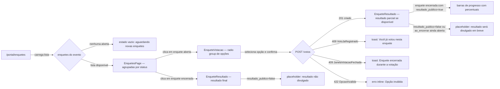
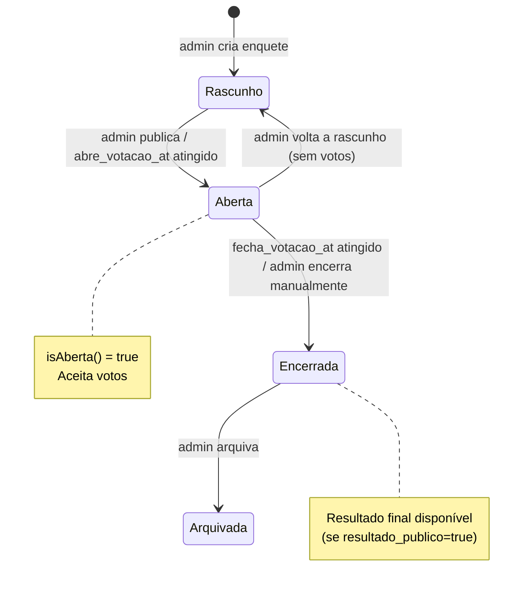
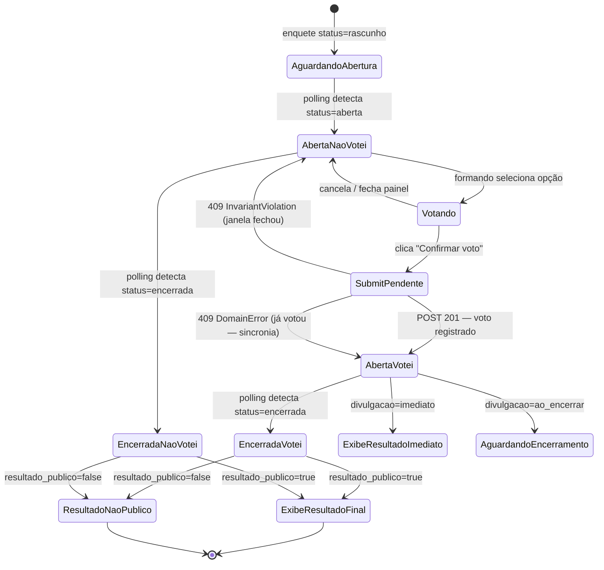

# SPEC-008 — Enquetes (voto com janela temporal)

> **Spec unificada backend + frontend.** Módulo que permite à equipe organizadora coletar votos dos formandos sobre temas da formatura (música, cardápio, fotógrafo etc.) dentro de uma janela de votação configurável. Cada formando vota uma única vez por enquete.
> Fontes: [09-TECHNICAL-DESIGN-CRITICAL-MODULES.md §7](../frontend/09-TECHNICAL-DESIGN-CRITICAL-MODULES.md) · [api-contract.md §9](../api/api-contract.md) · [07-DATA-CONTRACTS-AND-VIEW-MODELS.md §3.12,§4.10](../frontend/07-DATA-CONTRACTS-AND-VIEW-MODELS.md)

---

## 0. Resumo executivo

O formando acessa `/portal/enquetes`, visualiza as enquetes do seu evento agrupadas por status (ativa, aguardando, encerrada) e pode votar nas enquetes dentro da janela temporal definida pela organizadora. O voto é único por enquete (constraint no banco). O resultado pode ser imediato, ao encerrar ou nunca exibido ao formando, conforme configuração da enquete. O frontend usa TanStack Query com `refetchInterval` curto para capturar mudanças de status sem reload completo. Não há store Zustand dedicado — o estado é inteiramente gerenciado pelo cache de queries.

---

## 1. Visão da feature

### 1.1 Jornada macro



### 1.2 Atores

| Ator                   | Ação                                                                   |
| ---------------------- | ---------------------------------------------------------------------- |
| Formando               | Vota em enquetes abertas; visualiza resultado quando divulgado.        |
| Responsável financeiro | Usa as mesmas credenciais do formando; tem o mesmo acesso às enquetes. |
| Equipe organizadora    | Cria e configura enquetes no Admin (fora de escopo desta SPEC).        |
| Mobile F8 (futuro)     | Consome os mesmos endpoints com Bearer token.                          |

### 1.3 Valor

- Aumenta engajamento dos formandos com a organização do evento pós-adesão.
- Substitui formulários externos (Google Forms, WhatsApp) por um fluxo integrado ao portal.
- A janela temporal gera senso de urgência e aumenta a taxa de resposta.
- Resultado configurable (imediato / ao encerrar / nunca) mantém a surpresa quando estratégico.

### 1.4 Escopo

**In:** listar enquetes do evento, detalhe com opções, submissão de voto único (escolha_unica), exibição de resultado conforme configuração, agrupamento por status, badge "já votei", countdown da janela, polling automático para mudanças de status.

**Out:** criação/edição de enquetes (Admin), voto múltiplo MVP (blocker — ver §8), exportação de resultados, notificações push ao abrir enquete, comentários em enquetes.

---

## 2. Contrato da API

### 2.1 `GET /api/v1/eventos/{ulid}/enquetes`

- **Route name:** `api.v1.enquetes.index`
- **Middlewares:** `auth:sanctum`, `throttle:api`
- **Auth:** formando autenticado com acesso ao evento

**Query parameters:**

| Parâmetro        | Tipo   | Valores aceitos                                         | Default            |
| ---------------- | ------ | ------------------------------------------------------- | ------------------ |
| `filter[status]` | string | `rascunho`, `aberta`, `encerrada`, `arquivada`, `todas` | `aberta,encerrada` |
| `cursor`         | string | cursor de paginação opaca                               | null               |
| `per_page`       | int    | 1–50                                                    | 15                 |

**Response 200:**

```json
{
    "data": [
        {
            "id": "01J5K3B5GTYV8E2F1W0M8P2XQA",
            "titulo": "Música de entrada",
            "tipo": "unica",
            "status": "aberta",
            "janela": {
                "abre_at": "2026-10-01T00:00:00-03:00",
                "fecha_at": "2026-10-31T23:59:59-03:00"
            },
            "permite_edicao": false,
            "ja_votei": false,
            "links": {
                "self": "https://api.portalartfinal.com.br/api/v1/eventos/01J.../enquetes/01J...",
                "votar": "https://api.portalartfinal.com.br/api/v1/eventos/01J.../enquetes/01J.../votos"
            }
        }
    ],
    "meta": {
        "next_cursor": "eyJpZCI6IjAxSjU...",
        "prev_cursor": null,
        "per_page": 15
    }
}
```

### 2.2 `GET /api/v1/eventos/{ulid}/enquetes/{ulid}`

- **Route name:** `api.v1.enquetes.show`
- **Middlewares:** `auth:sanctum`, `throttle:api`

**Response 200 — sem voto, enquete aberta:**

```json
{
    "data": {
        "id": "01J5K3B5GTYV8E2F1W0M8P2XQA",
        "titulo": "Música de entrada",
        "descricao": "Escolha a música que tocará na entrada dos formandos.",
        "tipo": "unica",
        "status": "aberta",
        "permite_edicao": false,
        "resultado_publico": false,
        "janela": {
            "abre_at": "2026-10-01T00:00:00-03:00",
            "fecha_at": "2026-10-31T23:59:59-03:00"
        },
        "opcoes": [
            { "id": "01J...", "rotulo": "Canon in D — Pachelbel", "ordem": 1 },
            { "id": "01J...", "rotulo": "A Thousand Years — Christina Perri", "ordem": 2 },
            { "id": "01J...", "rotulo": "Minha Vida — Legião Urbana", "ordem": 3 }
        ],
        "meu_voto": null,
        "resultado": null,
        "ja_votei": false,
        "links": {
            "self": "https://api.portalartfinal.com.br/api/v1/eventos/01J.../enquetes/01J...",
            "votar": "https://api.portalartfinal.com.br/api/v1/eventos/01J.../enquetes/01J.../votos"
        }
    }
}
```

**Response 200 — com voto registrado e resultado imediato:**

```json
{
    "data": {
        "id": "01J...",
        "meu_voto": {
            "opcao_id": "01J...",
            "registrado_at": "2026-10-15T14:00:00-03:00"
        },
        "resultado": [
            { "opcao_id": "01J...", "contagem": 48, "percentual": 62.3 },
            { "opcao_id": "01J...", "contagem": 19, "percentual": 24.7 },
            { "opcao_id": "01J...", "contagem": 10, "percentual": 13.0 }
        ]
    }
}
```

**Response 200 — encerrada com resultado final:**
Idem acima, com `status: "encerrada"` e `resultado` sempre presente quando `resultado_publico=true`.

### 2.3 `POST /api/v1/eventos/{ulid}/enquetes/{ulid}/votos`

- **Route name:** `api.v1.enquetes.votos.store`
- **Middlewares:** `auth:sanctum`, `throttle.actor:voto` (3/min/user)
- **Policy:** `EnquetePolicy::votar(user, enquete)`
- **Idempotência:** não exigida (constraint única no banco garante 1 voto/formando/enquete)

**Request (escolha_unica — MVP):**

```json
{
    "opcao_ulid": "01J5K3B5GTYV8E2F1W0M8P2XQA"
}
```

**Validação:**

- `opcao_ulid` → `required|string|size:26` (quando `enquete.tipo = unica`)
- A opção deve pertencer à enquete (validado na Action, não apenas na FormRequest)

**Response 201:**

```json
{
    "data": {
        "id": "01J...",
        "registrado_at": "2026-10-15T14:00:00-03:00",
        "opcao": {
            "id": "01J...",
            "rotulo": "Canon in D — Pachelbel"
        },
        "resultado_parcial": [{ "opcao_id": "01J...", "contagem": 48, "percentual": 62.3 }],
        "links": {
            "self": "https://api.portalartfinal.com.br/api/v1/eventos/01J.../enquetes/01J.../votos/01J..."
        }
    }
}
```

O campo `resultado_parcial` é `null` quando `resultado_publico=false` ou `divulgacao=ao_encerrar`.

**Erros:**

| Código HTTP | `error`              | Condição                                             |
| ----------- | -------------------- | ---------------------------------------------------- |
| 409         | `DomainError`        | Voto já registrado (quando `permite_edicao=false`)   |
| 409         | `InvariantViolation` | Fora da janela de votação ou enquete não está aberta |
| 422         | `ValidationError`    | `opcao_ulid` ausente ou inválido                     |
| 422         | `OpcaoInvalida`      | opcao_ulid não pertence à enquete                    |
| 429         | `RateLimitExceeded`  | Mais de 3 votos/min do mesmo usuário                 |

### 2.4 Headers obrigatórios

| Header         | Direção | Uso                                            |
| -------------- | ------- | ---------------------------------------------- |
| `X-Request-Id` | req/res | Correlação de logs (ULID gerado pelo cliente). |
| `X-XSRF-TOKEN` | req     | Proteção CSRF em mutações POST.                |
| `Accept`       | req     | `application/json`                             |
| `Content-Type` | req     | `application/json` (em POST)                   |

---

## 3. Backend — Laravel 13

### 3.1 Arquivos a criar/modificar

| Arquivo                                                  | Ação      | Responsabilidade                                             |
| -------------------------------------------------------- | --------- | ------------------------------------------------------------ |
| `app/Http/Controllers/Api/V1/EnqueteController.php`      | Criar     | `index()`, `show()`, `storeVoto()`                           |
| `app/Http/Requests/Api/V1/RegistrarVotoRequest.php`      | Criar     | FormRequest — valida `opcao_ulid` / `opcoes_ulids`           |
| `app/Actions/Enquetes/RegistrarVotoAction.php`           | Criar     | Lógica atômica de registro: valida opção, constraint, evento |
| `app/Http/Resources/V1/EnqueteResource.php`              | Criar     | Serializa enquete (lista e detalhe)                          |
| `app/Http/Resources/V1/OpcaoEnqueteResource.php`         | Criar     | Serializa opção com percentual condicional                   |
| `app/Http/Resources/V1/VotoResource.php`                 | Criar     | Serializa voto registrado + resultado parcial                |
| `app/Policies/EnquetePolicy.php`                         | Criar     | `votar()`, `view()` — verifica elegibilidade do formando     |
| `app/Models/Enquete.php`                                 | Criar     | Model com scopes `aberta()`, `encerrada()`, relações         |
| `app/Models/OpcaoEnquete.php`                            | Criar     | Model filho de Enquete                                       |
| `app/Models/Voto.php`                                    | Criar     | Model com unique constraint `(enquete_id, formando_id)`      |
| `app/Events/VotoRegistrado.php`                          | Criar     | Event disparado após registro de voto                        |
| `database/migrations/*_create_enquetes_table.php`        | Criar     | Tabela `enquetes`                                            |
| `database/migrations/*_create_opcoes_enquetes_table.php` | Criar     | Tabela `opcoes_enquetes`                                     |
| `database/migrations/*_create_votos_table.php`           | Criar     | Tabela `votos` com unique index                              |
| `routes/api/v1.php`                                      | Modificar | Registrar 3 rotas de enquetes aninhadas em eventos           |
| `tests/Feature/Api/V1/Enquetes/EnquetesTest.php`         | Criar     | 10 cenários Pest                                             |

### 3.2 Schema do banco

```sql
-- Tabela: enquetes
CREATE TABLE enquetes (
    id          BIGINT PRIMARY KEY,
    ulid        CHAR(26) NOT NULL UNIQUE,
    evento_id   BIGINT NOT NULL REFERENCES eventos(id),
    titulo      VARCHAR(255) NOT NULL,
    descricao   TEXT,
    tipo        VARCHAR(20) NOT NULL DEFAULT 'unica', -- unica | multipla
    status      VARCHAR(20) NOT NULL DEFAULT 'rascunho',
    divulgacao  VARCHAR(20) NOT NULL DEFAULT 'ao_encerrar', -- imediato | ao_encerrar | nunca
    resultado_publico BOOLEAN GENERATED ALWAYS AS (divulgacao != 'nunca') STORED,
    permite_edicao    BOOLEAN NOT NULL DEFAULT FALSE,
    abre_votacao_at   TIMESTAMPTZ,
    fecha_votacao_at  TIMESTAMPTZ,
    created_at  TIMESTAMPTZ NOT NULL DEFAULT NOW(),
    updated_at  TIMESTAMPTZ NOT NULL DEFAULT NOW(),
    deleted_at  TIMESTAMPTZ
);

-- Tabela: opcoes_enquetes
CREATE TABLE opcoes_enquetes (
    id          BIGINT PRIMARY KEY,
    ulid        CHAR(26) NOT NULL UNIQUE,
    enquete_id  BIGINT NOT NULL REFERENCES enquetes(id) ON DELETE CASCADE,
    rotulo      VARCHAR(255) NOT NULL,
    ordem       SMALLINT NOT NULL DEFAULT 0,
    created_at  TIMESTAMPTZ NOT NULL DEFAULT NOW()
);

-- Tabela: votos
CREATE TABLE votos (
    id           BIGINT PRIMARY KEY,
    ulid         CHAR(26) NOT NULL UNIQUE,
    enquete_id   BIGINT NOT NULL REFERENCES enquetes(id),
    formando_id  BIGINT NOT NULL REFERENCES formandos(id),
    opcao_id     BIGINT NOT NULL REFERENCES opcoes_enquetes(id),
    registrado_at TIMESTAMPTZ NOT NULL DEFAULT NOW(),
    -- Constraint que garante voto único por formando por enquete
    CONSTRAINT votos_formando_enquete_unique UNIQUE (enquete_id, formando_id)
);

CREATE INDEX idx_votos_enquete_id ON votos (enquete_id);
CREATE INDEX idx_enquetes_evento_status ON enquetes (evento_id, status);
```

### 3.3 `EnqueteController` — esqueleto

```php
<?php
declare(strict_types=1);

namespace App\Http\Controllers\Api\V1;

use App\Http\Controllers\Controller;
use App\Http\Requests\Api\V1\RegistrarVotoRequest;
use App\Http\Resources\V1\EnqueteResource;
use App\Http\Resources\V1\VotoResource;
use App\Actions\Enquetes\RegistrarVotoAction;
use App\Models\Enquete;
use App\Models\Evento;
use Illuminate\Http\Request;
use Illuminate\Http\Resources\Json\AnonymousResourceCollection;

final class EnqueteController extends Controller
{
    public function index(Request $request, Evento $evento): AnonymousResourceCollection
    {
        $this->authorize('view', $evento);

        $status = $request->query('filter')['status'] ?? 'aberta,encerrada';
        $statusList = array_filter(explode(',', $status));

        $enquetes = $evento->enquetes()
            ->whereIn('status', $statusList)
            ->with(['opcoes'])
            ->withCount('votos')
            ->cursorPaginate($request->integer('per_page', 15));

        return EnqueteResource::collection($enquetes)->additional([
            'meta' => [
                'next_cursor' => $enquetes->nextCursor()?->encode(),
                'prev_cursor' => $enquetes->previousCursor()?->encode(),
                'per_page'    => $enquetes->perPage(),
            ],
        ]);
    }

    public function show(Request $request, Evento $evento, Enquete $enquete): EnqueteResource
    {
        $this->authorize('view', $enquete);

        $enquete->load(['opcoes']);
        $meuVoto = $enquete->votos()
            ->where('formando_id', $request->user()->formando?->id)
            ->first();

        return new EnqueteResource($enquete, $meuVoto);
    }

    public function storeVoto(
        RegistrarVotoRequest $request,
        Evento $evento,
        Enquete $enquete,
        RegistrarVotoAction $action,
    ): VotoResource {
        $this->authorize('votar', $enquete);

        $voto = $action->execute(
            enquete: $enquete,
            formando: $request->user()->formando,
            opcaoUlid: $request->validated('opcao_ulid'),
        );

        return new VotoResource($voto, $enquete);
    }
}
```

### 3.4 `RegistrarVotoRequest`

```php
<?php
declare(strict_types=1);

namespace App\Http\Requests\Api\V1;

use Illuminate\Foundation\Http\FormRequest;

final class RegistrarVotoRequest extends FormRequest
{
    public function authorize(): bool
    {
        return true; // autorização feita pela Policy no Controller
    }

    public function rules(): array
    {
        /** @var \App\Models\Enquete $enquete */
        $enquete = $this->route('enquete');

        return match ($enquete->tipo) {
            'unica'    => ['opcao_ulid'   => ['required', 'string', 'size:26']],
            'multipla' => ['opcoes_ulids' => ['required', 'array', 'min:1']],
            default    => [],
        };
    }

    public function messages(): array
    {
        return [
            'opcao_ulid.required'    => 'Selecione uma opção antes de votar.',
            'opcao_ulid.size'        => 'Identificador de opção inválido.',
            'opcoes_ulids.required'  => 'Selecione ao menos uma opção.',
            'opcoes_ulids.min'       => 'Selecione ao menos uma opção.',
        ];
    }
}
```

### 3.5 `RegistrarVotoAction`

```php
<?php
declare(strict_types=1);

namespace App\Actions\Enquetes;

use App\Events\VotoRegistrado;
use App\Exceptions\Enquetes\JanelaVotacaoFechadaException;
use App\Exceptions\Enquetes\OpcaoInvalidaException;
use App\Exceptions\Enquetes\VotoJaRegistradoException;
use App\Models\Enquete;
use App\Models\Formando;
use App\Models\Voto;
use Illuminate\Database\UniqueConstraintViolationException;
use Illuminate\Support\Facades\DB;

final class RegistrarVotoAction
{
    public function execute(Enquete $enquete, Formando $formando, string $opcaoUlid): Voto
    {
        // 1. Verificar janela de votação
        if (! $enquete->isAberta()) {
            throw new JanelaVotacaoFechadaException(
                'A janela de votação está fechada para esta enquete.'
            );
        }

        // 2. Verificar se opção pertence à enquete
        $opcao = $enquete->opcoes()->where('ulid', $opcaoUlid)->first();
        if ($opcao === null) {
            throw new OpcaoInvalidaException(
                'A opção selecionada não pertence a esta enquete.'
            );
        }

        // 3. Registrar voto com proteção de concorrência via unique constraint
        try {
            $voto = DB::transaction(function () use ($enquete, $formando, $opcao): Voto {
                $voto = Voto::create([
                    'ulid'        => \Str::ulid(),
                    'enquete_id'  => $enquete->id,
                    'formando_id' => $formando->id,
                    'opcao_id'    => $opcao->id,
                    'registrado_at' => now(),
                ]);

                return $voto->load('opcao');
            });
        } catch (UniqueConstraintViolationException) {
            throw new VotoJaRegistradoException(
                'Você já registrou seu voto nesta enquete.'
            );
        }

        event(new VotoRegistrado($voto, $enquete, $formando));

        return $voto;
    }
}
```

### 3.6 `EnqueteResource` com resultado condicional

```php
<?php
declare(strict_types=1);

namespace App\Http\Resources\V1;

use App\Models\Enquete;
use App\Models\Voto;
use Illuminate\Http\Request;
use Illuminate\Http\Resources\Json\JsonResource;

final class EnqueteResource extends JsonResource
{
    public function __construct(
        Enquete $resource,
        private readonly ?Voto $meuVoto = null,
    ) {
        parent::__construct($resource);
    }

    public function toArray(Request $request): array
    {
        /** @var Enquete $enquete */
        $enquete = $this->resource;
        $formando = $request->user()?->formando;
        $jaVotei = $this->meuVoto !== null;

        return [
            'id'               => $enquete->ulid,
            'titulo'           => $enquete->titulo,
            'descricao'        => $enquete->descricao,
            'tipo'             => $enquete->tipo,
            'status'           => $enquete->status,
            'permite_edicao'   => $enquete->permite_edicao,
            'resultado_publico' => $enquete->resultado_publico,
            'ja_votei'         => $jaVotei,
            'janela'           => [
                'abre_at'   => $enquete->abre_votacao_at?->toIso8601String(),
                'fecha_at'  => $enquete->fecha_votacao_at?->toIso8601String(),
            ],
            'opcoes'  => OpcaoEnqueteResource::collection($enquete->opcoes),
            'meu_voto' => $this->meuVoto ? [
                'opcao_id'     => $this->meuVoto->opcao->ulid,
                'registrado_at' => $this->meuVoto->registrado_at->toIso8601String(),
            ] : null,
            'resultado' => $this->resolverResultado($enquete),
            'links'    => [
                'self'  => route('api.v1.enquetes.show', [$enquete->evento_id, $enquete->ulid]),
                'votar' => $enquete->isAberta()
                    ? route('api.v1.enquetes.votos.store', [$enquete->evento_id, $enquete->ulid])
                    : null,
            ],
        ];
    }

    private function resolverResultado(Enquete $enquete): ?array
    {
        if (! $enquete->resultado_publico) {
            return null;
        }

        $deveExibir = match ($enquete->divulgacao) {
            'imediato'    => true,
            'ao_encerrar' => $enquete->status === 'encerrada',
            default       => false,
        };

        if (! $deveExibir) {
            return null;
        }

        $totalVotos = $enquete->votos()->count();

        return $enquete->opcoes->map(function ($opcao) use ($totalVotos) {
            $contagem = $opcao->votos()->count();
            return [
                'opcao_id'   => $opcao->ulid,
                'contagem'   => $contagem,
                'percentual' => $totalVotos > 0
                    ? round(($contagem / $totalVotos) * 100, 1)
                    : 0.0,
            ];
        })->toArray();
    }
}
```

### 3.7 `EnquetePolicy`

```php
<?php
declare(strict_types=1);

namespace App\Policies;

use App\Models\Enquete;
use App\Models\PortalUser;

final class EnquetePolicy
{
    public function view(PortalUser $user, Enquete $enquete): bool
    {
        // Formando só vê enquetes do seu evento e que não sejam rascunho
        return $user->formando?->evento_id === $enquete->evento_id
            && $enquete->status !== 'rascunho';
    }

    public function votar(PortalUser $user, Enquete $enquete): bool
    {
        return $this->view($user, $enquete) && $enquete->isAberta();
    }
}
```

### 3.8 Model `Enquete` com scopes

```php
<?php
declare(strict_types=1);

namespace App\Models;

use Illuminate\Database\Eloquent\Model;
use Illuminate\Database\Eloquent\Relations\HasMany;
use Illuminate\Database\Eloquent\Relations\BelongsTo;

final class Enquete extends Model
{
    protected $fillable = [
        'ulid', 'evento_id', 'titulo', 'descricao', 'tipo',
        'status', 'divulgacao', 'permite_edicao',
        'abre_votacao_at', 'fecha_votacao_at',
    ];

    protected $casts = [
        'permite_edicao'   => 'boolean',
        'resultado_publico' => 'boolean',
        'abre_votacao_at'  => 'immutable_datetime',
        'fecha_votacao_at' => 'immutable_datetime',
    ];

    public function evento(): BelongsTo
    {
        return $this->belongsTo(Evento::class);
    }

    public function opcoes(): HasMany
    {
        return $this->hasMany(OpcaoEnquete::class)->orderBy('ordem');
    }

    public function votos(): HasMany
    {
        return $this->hasMany(Voto::class);
    }

    public function isAberta(): bool
    {
        return $this->status === 'aberta'
            && ($this->abre_votacao_at === null || $this->abre_votacao_at->isPast())
            && ($this->fecha_votacao_at === null || $this->fecha_votacao_at->isFuture());
    }
}
```

### 3.9 Registro das rotas

```php
// routes/api/v1.php — dentro do grupo auth:sanctum
Route::prefix('eventos/{evento:ulid}')->group(function () {
    Route::get('enquetes', [EnqueteController::class, 'index'])
        ->name('api.v1.enquetes.index');
    Route::get('enquetes/{enquete:ulid}', [EnqueteController::class, 'show'])
        ->name('api.v1.enquetes.show');
    Route::post('enquetes/{enquete:ulid}/votos', [EnqueteController::class, 'storeVoto'])
        ->middleware('throttle:voto')
        ->name('api.v1.enquetes.votos.store');
});
```

### 3.10 Rate limiter `voto`

```php
// AppServiceProvider::boot() ou RateLimiterServiceProvider
RateLimiter::for('voto', function (Request $request) {
    $userId = $request->user()?->id ?? $request->ip();
    return Limit::perMinute(3)->by('voto|'.$userId)->response(function () {
        return response()->json([
            'error'      => 'RateLimitExceeded',
            'message'    => 'Limite de votação excedido. Aguarde um momento.',
            'details'    => null,
            'request_id' => request()->header('X-Request-Id'),
            'timestamp'  => now()->toIso8601String(),
        ], 429);
    });
});
```

### 3.11 Testes Pest (mínimo obrigatório — 10 cenários)

```php
<?php
// tests/Feature/Api/V1/Enquetes/EnquetesTest.php

use App\Models\Enquete;
use App\Models\Formando;
use App\Models\Evento;
use App\Models\OpcaoEnquete;
use App\Models\Voto;

it('lista enquetes abertas do evento', function () {
    $formando = Formando::factory()->comEvento()->create();
    $evento = $formando->evento;
    Enquete::factory()->aberta()->for($evento)->count(3)->create();

    $response = $this->actingAs($formando->portalUser)
        ->getJson("/api/v1/eventos/{$evento->ulid}/enquetes");

    $response->assertOk()
        ->assertJsonCount(3, 'data')
        ->assertJsonStructure(['data' => [['id', 'titulo', 'status', 'janela', 'ja_votei']]]);
});

it('retorna detalhe da enquete sem voto do formando', function () {
    $formando = Formando::factory()->comEvento()->create();
    $enquete = Enquete::factory()->aberta()->for($formando->evento)
        ->has(OpcaoEnquete::factory()->count(3), 'opcoes')
        ->create();

    $response = $this->actingAs($formando->portalUser)
        ->getJson("/api/v1/eventos/{$formando->evento->ulid}/enquetes/{$enquete->ulid}");

    $response->assertOk()
        ->assertJsonPath('data.meu_voto', null)
        ->assertJsonPath('data.resultado', null)
        ->assertJsonCount(3, 'data.opcoes');
});

it('retorna detalhe com voto do formando quando ja votou', function () {
    $formando = Formando::factory()->comEvento()->create();
    $enquete = Enquete::factory()->aberta()->for($formando->evento)
        ->has(OpcaoEnquete::factory()->count(2), 'opcoes')
        ->create(['divulgacao' => 'imediato', 'resultado_publico' => true]);
    $opcao = $enquete->opcoes->first();
    Voto::factory()->create(['enquete_id' => $enquete->id, 'formando_id' => $formando->id, 'opcao_id' => $opcao->id]);

    $response = $this->actingAs($formando->portalUser)
        ->getJson("/api/v1/eventos/{$formando->evento->ulid}/enquetes/{$enquete->ulid}");

    $response->assertOk()
        ->assertJsonPath('data.meu_voto.opcao_id', $opcao->ulid)
        ->assertJsonStructure(['data' => ['resultado' => [['opcao_id', 'contagem', 'percentual']]]]);
});

it('registra voto com sucesso e retorna 201', function () {
    $formando = Formando::factory()->comEvento()->create();
    $enquete = Enquete::factory()->aberta()->for($formando->evento)
        ->has(OpcaoEnquete::factory()->count(3), 'opcoes')
        ->create();
    $opcao = $enquete->opcoes->first();

    $response = $this->actingAs($formando->portalUser)
        ->postJson("/api/v1/eventos/{$formando->evento->ulid}/enquetes/{$enquete->ulid}/votos", [
            'opcao_ulid' => $opcao->ulid,
        ]);

    $response->assertCreated()
        ->assertJsonPath('data.opcao.id', $opcao->ulid);
    $this->assertDatabaseHas('votos', ['formando_id' => $formando->id, 'opcao_id' => $opcao->id]);
});

it('retorna 409 DomainError ao tentar votar duas vezes na mesma enquete', function () {
    $formando = Formando::factory()->comEvento()->create();
    $enquete = Enquete::factory()->aberta()->for($formando->evento)
        ->has(OpcaoEnquete::factory()->count(2), 'opcoes')
        ->create(['permite_edicao' => false]);
    $opcao = $enquete->opcoes->first();
    Voto::factory()->create(['enquete_id' => $enquete->id, 'formando_id' => $formando->id, 'opcao_id' => $opcao->id]);

    $response = $this->actingAs($formando->portalUser)
        ->postJson("/api/v1/eventos/{$formando->evento->ulid}/enquetes/{$enquete->ulid}/votos", [
            'opcao_ulid' => $opcao->ulid,
        ]);

    $response->assertConflict()
        ->assertJsonPath('error', 'DomainError');
});

it('retorna 409 InvariantViolation ao votar fora da janela temporal', function () {
    $formando = Formando::factory()->comEvento()->create();
    $enquete = Enquete::factory()->encerrada()->for($formando->evento)
        ->has(OpcaoEnquete::factory()->count(2), 'opcoes')
        ->create();
    $opcao = $enquete->opcoes->first();

    $response = $this->actingAs($formando->portalUser)
        ->postJson("/api/v1/eventos/{$formando->evento->ulid}/enquetes/{$enquete->ulid}/votos", [
            'opcao_ulid' => $opcao->ulid,
        ]);

    $response->assertConflict()
        ->assertJsonPath('error', 'InvariantViolation');
});

it('retorna 422 quando opcao_ulid nao pertence a enquete', function () {
    $formando = Formando::factory()->comEvento()->create();
    $enquete = Enquete::factory()->aberta()->for($formando->evento)
        ->has(OpcaoEnquete::factory()->count(2), 'opcoes')
        ->create();
    $outraEnquete = Enquete::factory()->aberta()->for($formando->evento)
        ->has(OpcaoEnquete::factory()->count(2), 'opcoes')
        ->create();
    $opcaoDeOutraEnquete = $outraEnquete->opcoes->first();

    $response = $this->actingAs($formando->portalUser)
        ->postJson("/api/v1/eventos/{$formando->evento->ulid}/enquetes/{$enquete->ulid}/votos", [
            'opcao_ulid' => $opcaoDeOutraEnquete->ulid,
        ]);

    $response->assertUnprocessable()
        ->assertJsonPath('error', 'OpcaoInvalida');
});

it('nao exibe resultado parcial quando divulgacao=ao_encerrar e enquete ainda aberta', function () {
    $formando = Formando::factory()->comEvento()->create();
    $enquete = Enquete::factory()->aberta()->for($formando->evento)
        ->has(OpcaoEnquete::factory()->count(2), 'opcoes')
        ->create(['divulgacao' => 'ao_encerrar', 'resultado_publico' => true]);

    $response = $this->actingAs($formando->portalUser)
        ->getJson("/api/v1/eventos/{$formando->evento->ulid}/enquetes/{$enquete->ulid}");

    $response->assertOk()->assertJsonPath('data.resultado', null);
});

it('exibe resultado final quando enquete encerrada e resultado_publico=true', function () {
    $formando = Formando::factory()->comEvento()->create();
    $enquete = Enquete::factory()->encerrada()->for($formando->evento)
        ->has(OpcaoEnquete::factory()->count(3), 'opcoes')
        ->create(['divulgacao' => 'ao_encerrar', 'resultado_publico' => true]);

    $response = $this->actingAs($formando->portalUser)
        ->getJson("/api/v1/eventos/{$formando->evento->ulid}/enquetes/{$enquete->ulid}");

    $response->assertOk()
        ->assertJsonStructure(['data' => ['resultado' => [['opcao_id', 'contagem', 'percentual']]]]);
});

it('filtra enquetes por status usando filter[status]', function () {
    $formando = Formando::factory()->comEvento()->create();
    $evento = $formando->evento;
    Enquete::factory()->aberta()->for($evento)->count(2)->create();
    Enquete::factory()->encerrada()->for($evento)->count(3)->create();

    $response = $this->actingAs($formando->portalUser)
        ->getJson("/api/v1/eventos/{$evento->ulid}/enquetes?filter[status]=encerrada");

    $response->assertOk()->assertJsonCount(3, 'data');
});
```

---

## 4. Frontend — React 19 SPA

### 4.1 Arquivos a criar/modificar

| Arquivo                                                          | Ação  | Responsabilidade                                          |
| ---------------------------------------------------------------- | ----- | --------------------------------------------------------- |
| `resources/spa/src/api/hooks/use-enquetes.ts`                    | Criar | `useEnquetes`, `useEnquete`, `useRegistrarVoto`           |
| `resources/spa/src/api/dto/enquete.ts`                           | Criar | Tipos TypeScript dos DTOs da API                          |
| `resources/spa/src/view-models/enquete.ts`                       | Criar | `toEnqueteListItemViewModel`, `toEnqueteDetalheViewModel` |
| `resources/spa/src/routes/portal/enquetes.tsx`                   | Criar | Rota `/portal/enquetes` (guard herdado do layout)         |
| `resources/spa/src/components/enquetes/enquetes-page.tsx`        | Criar | Container principal: carrega lista + gerencia seleção     |
| `resources/spa/src/components/enquetes/enquete-card.tsx`         | Criar | Card de enquete na listagem                               |
| `resources/spa/src/components/enquetes/enquete-votacao.tsx`      | Criar | Painel de votação com RadioGroup                          |
| `resources/spa/src/components/enquetes/enquete-resultado.tsx`    | Criar | Barras de progresso com percentuais                       |
| `resources/spa/src/components/enquetes/janela-votacao-badge.tsx` | Criar | Badge com countdown até abrir/fechar                      |
| `resources/spa/tests/unit/view-models/enquete.test.ts`           | Criar | Testes unitários dos view-model mappers                   |
| `resources/spa/tests/integration/api-hooks/use-enquetes.test.ts` | Criar | Testes de integração dos hooks com MSW                    |
| `resources/spa/tests/component/enquete-votacao.test.tsx`         | Criar | Testes de componente com RTL                              |
| `resources/spa/tests/e2e/enquetes.spec.ts`                       | Criar | Testes E2E com Playwright                                 |

### 4.2 Tipos TypeScript dos DTOs

```typescript
// resources/spa/src/api/dto/enquete.ts

export type StatusEnquete = 'rascunho' | 'aberta' | 'encerrada' | 'arquivada';
export type TipoEnquete = 'unica' | 'multipla';

export interface OpcaoEnqueteDto {
    id: string;
    rotulo: string;
    ordem: number;
}

export interface EnqueteListItemDto {
    id: string;
    titulo: string;
    tipo: TipoEnquete;
    status: StatusEnquete;
    janela: { abre_at: string | null; fecha_at: string | null };
    permite_edicao: boolean;
    ja_votei: boolean;
    links: { self: string; votar: string | null };
}

export interface EnqueteDetalheDto extends EnqueteListItemDto {
    descricao: string;
    resultado_publico: boolean;
    opcoes: OpcaoEnqueteDto[];
    meu_voto: { opcao_id: string; registrado_at: string } | null;
    resultado: Array<{ opcao_id: string; contagem: number; percentual: number }> | null;
}

export interface VotoDto {
    id: string;
    registrado_at: string;
    opcao: { id: string; rotulo: string };
    resultado_parcial: Array<{ opcao_id: string; contagem: number; percentual: number }> | null;
    links: { self: string };
}
```

### 4.3 `use-enquetes.ts` — hooks TanStack Query

```typescript
// resources/spa/src/api/hooks/use-enquetes.ts

import { useMutation, useQuery, useQueryClient } from '@tanstack/react-query';
import { api } from '../client';
import type { EnqueteDetalheDto, EnqueteListItemDto, VotoDto } from '../dto/enquete';
import { toEnqueteDetalheViewModel, toEnqueteListItemViewModel } from '@/view-models/enquete';

type SingleEnvelope<T> = { data: T };
type CollectionEnvelope<T> = { data: T[]; meta: { next_cursor: string | null } };

// ─── Query Keys ────────────────────────────────────────────────────────────────

export const enqueteQueryKeys = {
    list: (eventoUlid: string, status?: string) => ['enquetes', eventoUlid, status ?? 'todas'] as const,
    detail: (eventoUlid: string, enqueteUlid: string) => ['enquete', eventoUlid, enqueteUlid] as const,
};

// ─── useEnquetes ───────────────────────────────────────────────────────────────

export interface UseEnquetesOptions {
    status?: string;
    perPage?: number;
}

export function useEnquetes(eventoUlid: string, options: UseEnquetesOptions = {}) {
    const { status = 'aberta,encerrada', perPage = 15 } = options;

    return useQuery({
        queryKey: enqueteQueryKeys.list(eventoUlid, status),
        queryFn: async () => {
            const { data } = await api.get<CollectionEnvelope<EnqueteListItemDto>>(`/eventos/${eventoUlid}/enquetes`, {
                params: { 'filter[status]': status, per_page: perPage },
            });
            return data.data.map(toEnqueteListItemViewModel);
        },
        // Refetch mais agressivo para enquetes que podem abrir a qualquer momento
        staleTime: 30_000,
        refetchInterval: 60_000,
    });
}

// ─── useEnquete ────────────────────────────────────────────────────────────────

export function useEnquete(eventoUlid: string, enqueteUlid: string | null) {
    return useQuery({
        queryKey: enqueteQueryKeys.detail(eventoUlid, enqueteUlid ?? ''),
        enabled: !!enqueteUlid,
        queryFn: async () => {
            const { data } = await api.get<SingleEnvelope<EnqueteDetalheDto>>(
                `/eventos/${eventoUlid}/enquetes/${enqueteUlid}`,
            );
            return toEnqueteDetalheViewModel(data.data);
        },
        // Enquete aberta: refetch a cada 30s para capturar mudança de status
        refetchInterval: (query) => {
            const vm = query.state.data;
            return vm?.aberta ? 30_000 : false;
        },
        staleTime: 15_000,
    });
}

// ─── useRegistrarVoto ──────────────────────────────────────────────────────────

export interface RegistrarVotoInput {
    eventoUlid: string;
    enqueteUlid: string;
    opcaoUlid: string;
}

export function useRegistrarVoto() {
    const qc = useQueryClient();

    return useMutation({
        mutationFn: async (input: RegistrarVotoInput): Promise<VotoDto> => {
            const { data } = await api.post<SingleEnvelope<VotoDto>>(
                `/eventos/${input.eventoUlid}/enquetes/${input.enqueteUlid}/votos`,
                { opcao_ulid: input.opcaoUlid },
            );
            return data.data;
        },
        onSuccess: (_data, input) => {
            // Invalida lista e detalhe para forçar re-fetch com estado atualizado
            qc.invalidateQueries({
                queryKey: enqueteQueryKeys.list(input.eventoUlid),
            });
            qc.invalidateQueries({
                queryKey: enqueteQueryKeys.detail(input.eventoUlid, input.enqueteUlid),
            });
        },
    });
}
```

### 4.4 `EnqueteVotacao` — componente com RadioGroup

```typescript
// resources/spa/src/components/enquetes/enquete-votacao.tsx

import { useState } from 'react';
import { useRegistrarVoto } from '@/api/hooks/use-enquetes';
import type { EnqueteDetalheViewModel } from '@/view-models/enquete';
import { ApiError } from '@/api/errors';

interface EnqueteVotacaoProps {
    eventoUlid: string;
    vm: EnqueteDetalheViewModel;
    onVotado?: () => void;
}

export function EnqueteVotacao({ eventoUlid, vm, onVotado }: EnqueteVotacaoProps) {
    const [opcaoSelecionada, setOpcaoSelecionada] = useState<string | null>(
        vm.meuVotoOpcaoId,
    );
    const [erro, setErro] = useState<string | null>(null);
    const { mutate: registrarVoto, isPending } = useRegistrarVoto();

    const handleSubmit = (e: React.FormEvent) => {
        e.preventDefault();
        if (!opcaoSelecionada) return;
        setErro(null);

        registrarVoto(
            { eventoUlid, enqueteUlid: vm.id, opcaoUlid: opcaoSelecionada },
            {
                onSuccess: () => {
                    onVotado?.();
                },
                onError: (err) => {
                    if (err instanceof ApiError) {
                        setErro(mapErrorMessage(err));
                    }
                },
            },
        );
    };

    const jaVotou = vm.meuVotoOpcaoId !== null;

    return (
        <form onSubmit={handleSubmit} aria-label={`Votar na enquete: ${vm.titulo}`}>
            <h2 className="text-lg font-semibold text-gray-900 mb-1">{vm.titulo}</h2>
            {vm.descricao && (
                <p className="text-sm text-gray-600 mb-4">{vm.descricao}</p>
            )}

            <fieldset disabled={isPending || jaVotou} aria-disabled={jaVotou}>
                <legend className="sr-only">Opções de voto</legend>
                <div className="space-y-3">
                    {vm.opcoes.map((opcao) => (
                        <label
                            key={opcao.id}
                            className={[
                                'flex items-center gap-3 rounded-lg border p-3 cursor-pointer transition-colors',
                                opcaoSelecionada === opcao.id
                                    ? 'border-indigo-500 bg-indigo-50'
                                    : 'border-gray-200 hover:border-indigo-300',
                            ].join(' ')}
                        >
                            <input
                                type="radio"
                                name="opcao"
                                value={opcao.id}
                                checked={opcaoSelecionada === opcao.id}
                                onChange={() => setOpcaoSelecionada(opcao.id)}
                                className="text-indigo-600 focus:ring-indigo-500"
                                aria-label={opcao.rotulo}
                            />
                            <span className="text-sm font-medium text-gray-800">
                                {opcao.rotulo}
                            </span>
                        </label>
                    ))}
                </div>
            </fieldset>

            {erro && (
                <p role="alert" className="mt-3 text-sm text-red-600">
                    {erro}
                </p>
            )}

            {!jaVotou && (
                <button
                    type="submit"
                    disabled={!opcaoSelecionada || isPending}
                    className="mt-4 w-full rounded-lg bg-indigo-600 py-2 text-sm font-semibold
                               text-white disabled:opacity-50 disabled:cursor-not-allowed
                               hover:bg-indigo-700 focus:outline-none focus:ring-2 focus:ring-indigo-500"
                    aria-busy={isPending}
                >
                    {isPending ? 'Registrando voto...' : 'Confirmar voto'}
                </button>
            )}

            {jaVotou && (
                <p className="mt-4 text-sm text-green-700 font-medium flex items-center gap-1">
                    <span aria-hidden="true">✓</span> Voto registrado
                </p>
            )}
        </form>
    );
}

function mapErrorMessage(err: ApiError): string {
    switch (err.error) {
        case 'DomainError':
            return 'Você já votou nesta enquete.';
        case 'InvariantViolation':
            return 'A janela de votação foi encerrada. Seu voto não foi contabilizado.';
        case 'OpcaoInvalida':
            return 'A opção selecionada é inválida. Recarregue a página.';
        case 'RateLimitExceeded':
            return 'Limite de tentativas atingido. Aguarde alguns segundos.';
        default:
            return `Erro inesperado (${err.requestId}). Tente novamente.`;
    }
}
```

### 4.5 `EnqueteResultado` — barras de progresso

```typescript
// resources/spa/src/components/enquetes/enquete-resultado.tsx

import type { EnqueteDetalheViewModel } from '@/view-models/enquete';

interface EnqueteResultadoProps {
    vm: EnqueteDetalheViewModel;
}

export function EnqueteResultado({ vm }: EnqueteResultadoProps) {
    if (!vm.temResultadoVisivel) {
        return (
            <div
                className="rounded-lg bg-gray-50 border border-gray-200 p-4 text-center"
                aria-live="polite"
            >
                <p className="text-sm text-gray-500">
                    {vm.status === 'encerrada'
                        ? 'O resultado desta enquete não será divulgado publicamente.'
                        : 'O resultado será divulgado após o encerramento da votação.'}
                </p>
            </div>
        );
    }

    return (
        <div aria-label="Resultado da enquete">
            <h3 className="text-sm font-semibold text-gray-700 mb-3">
                {vm.status === 'encerrada' ? 'Resultado final' : 'Resultado parcial'}
            </h3>
            <ul className="space-y-3">
                {vm.opcoes.map((opcao) => (
                    <li key={opcao.id}>
                        <div className="flex justify-between mb-1">
                            <span
                                className={[
                                    'text-sm font-medium',
                                    vm.meuVotoOpcaoId === opcao.id
                                        ? 'text-indigo-700'
                                        : 'text-gray-700',
                                ].join(' ')}
                            >
                                {opcao.rotulo}
                                {vm.meuVotoOpcaoId === opcao.id && (
                                    <span className="ml-1 text-xs text-indigo-500">(seu voto)</span>
                                )}
                            </span>
                            <span className="text-sm text-gray-500 tabular-nums">
                                {opcao.percentual !== null ? `${opcao.percentual}%` : '—'}
                            </span>
                        </div>
                        <div
                            className="h-2 rounded-full bg-gray-200 overflow-hidden"
                            role="progressbar"
                            aria-valuenow={opcao.percentual ?? 0}
                            aria-valuemin={0}
                            aria-valuemax={100}
                            aria-label={`${opcao.rotulo}: ${opcao.percentual ?? 0}%`}
                        >
                            <div
                                className={[
                                    'h-full rounded-full transition-all duration-500',
                                    vm.meuVotoOpcaoId === opcao.id
                                        ? 'bg-indigo-500'
                                        : 'bg-gray-400',
                                ].join(' ')}
                                style={{ width: `${opcao.percentual ?? 0}%` }}
                            />
                        </div>
                    </li>
                ))}
            </ul>
        </div>
    );
}
```

### 4.6 `EnquetesPage` — container principal

```typescript
// resources/spa/src/components/enquetes/enquetes-page.tsx

import { useState } from 'react';
import { useEnquetes, useEnquete } from '@/api/hooks/use-enquetes';
import { EnqueteCard } from './enquete-card';
import { EnqueteVotacao } from './enquete-votacao';
import { EnqueteResultado } from './enquete-resultado';

interface EnquetesPageProps {
    eventoUlid: string;
}

export function EnquetesPage({ eventoUlid }: EnquetesPageProps) {
    const [selectedId, setSelectedId] = useState<string | null>(null);
    const { data: enquetes, isLoading, error } = useEnquetes(eventoUlid);
    const { data: detalhe } = useEnquete(eventoUlid, selectedId);

    if (isLoading) {
        return <p className="text-sm text-gray-500 p-4">Carregando enquetes...</p>;
    }

    if (error) {
        return (
            <p role="alert" className="text-sm text-red-600 p-4">
                Erro ao carregar enquetes. Tente novamente.
            </p>
        );
    }

    const abertas    = enquetes?.filter((e) => e.aberta) ?? [];
    const aguardando = enquetes?.filter((e) => e.status === 'rascunho') ?? [];
    const encerradas = enquetes?.filter((e) => e.status === 'encerrada') ?? [];

    const pendentesVoto = abertas.filter((e) => !e.jaVotei).length;

    return (
        <div className="grid grid-cols-1 gap-6 lg:grid-cols-3">
            {/* Lista lateral */}
            <aside className="lg:col-span-1 space-y-4">
                {pendentesVoto > 0 && (
                    <div className="rounded-lg bg-amber-50 border border-amber-200 px-3 py-2">
                        <p className="text-sm text-amber-700 font-medium">
                            {pendentesVoto} enquete{pendentesVoto > 1 ? 's' : ''} aguardando seu voto
                        </p>
                    </div>
                )}

                {abertas.length > 0 && (
                    <section aria-label="Enquetes abertas">
                        <h2 className="text-xs font-semibold uppercase tracking-wide text-gray-500 mb-2">
                            Abertas
                        </h2>
                        {abertas.map((e) => (
                            <EnqueteCard
                                key={e.id}
                                vm={e}
                                selected={selectedId === e.id}
                                onSelect={() => setSelectedId(e.id)}
                            />
                        ))}
                    </section>
                )}

                {encerradas.length > 0 && (
                    <section aria-label="Enquetes encerradas">
                        <h2 className="text-xs font-semibold uppercase tracking-wide text-gray-500 mb-2">
                            Encerradas
                        </h2>
                        {encerradas.map((e) => (
                            <EnqueteCard
                                key={e.id}
                                vm={e}
                                selected={selectedId === e.id}
                                onSelect={() => setSelectedId(e.id)}
                            />
                        ))}
                    </section>
                )}

                {enquetes?.length === 0 && (
                    <p className="text-sm text-gray-400 text-center py-8">
                        Nenhuma enquete disponível no momento.
                    </p>
                )}
            </aside>

            {/* Painel de detalhe */}
            <main className="lg:col-span-2">
                {!selectedId && (
                    <div className="rounded-xl border border-dashed border-gray-300 p-8 text-center">
                        <p className="text-sm text-gray-400">
                            Selecione uma enquete para visualizar ou votar.
                        </p>
                    </div>
                )}

                {selectedId && detalhe && (
                    <div className="rounded-xl border border-gray-200 p-6 space-y-6">
                        {detalhe.aberta && !detalhe.jaVotei && (
                            <EnqueteVotacao eventoUlid={eventoUlid} vm={detalhe} />
                        )}
                        {(detalhe.jaVotei || !detalhe.aberta) && (
                            <EnqueteResultado vm={detalhe} />
                        )}
                    </div>
                )}
            </main>
        </div>
    );
}
```

### 4.7 `JanelaVotacaoBadge` — countdown

```typescript
// resources/spa/src/components/enquetes/janela-votacao-badge.tsx

import { useEffect, useState } from 'react';

interface JanelaVotacaoBadgeProps {
    abreAt: Date | null;
    fechaAt: Date | null;
    aberta: boolean;
}

export function JanelaVotacaoBadge({ abreAt, fechaAt, aberta }: JanelaVotacaoBadgeProps) {
    const [label, setLabel] = useState('');

    useEffect(() => {
        const calcular = () => {
            const agora = new Date();
            if (!aberta && abreAt && abreAt > agora) {
                const diff = abreAt.getTime() - agora.getTime();
                setLabel(`Abre em ${formatDuration(diff)}`);
            } else if (aberta && fechaAt && fechaAt > agora) {
                const diff = fechaAt.getTime() - agora.getTime();
                setLabel(`Fecha em ${formatDuration(diff)}`);
            } else if (!aberta) {
                setLabel('Encerrada');
            }
        };

        calcular();
        const interval = setInterval(calcular, 1000);
        return () => clearInterval(interval);
    }, [abreAt, fechaAt, aberta]);

    return (
        <span
            className={[
                'inline-flex items-center rounded-full px-2 py-0.5 text-xs font-medium',
                aberta
                    ? 'bg-green-100 text-green-700'
                    : 'bg-gray-100 text-gray-500',
            ].join(' ')}
            aria-label={label}
        >
            {label}
        </span>
    );
}

function formatDuration(ms: number): string {
    const totalSeconds = Math.floor(ms / 1000);
    const dias    = Math.floor(totalSeconds / 86400);
    const horas   = Math.floor((totalSeconds % 86400) / 3600);
    const minutos = Math.floor((totalSeconds % 3600) / 60);
    const segundos = totalSeconds % 60;

    if (dias > 0) return `${dias}d ${horas}h`;
    if (horas > 0) return `${horas}h ${minutos}min`;
    if (minutos > 0) return `${minutos}min`;
    return `${segundos}s`;
}
```

### 4.8 Rota `/portal/enquetes`

```typescript
// resources/spa/src/routes/portal/enquetes.tsx

import { createFileRoute } from '@tanstack/react-router';
import { EnquetesPage } from '@/components/enquetes/enquetes-page';
import { useAuthStore } from '@/stores/auth-store';

export const Route = createFileRoute('/portal/enquetes')({
    component: EnquetesRoute,
});

function EnquetesRoute() {
    const user = useAuthStore((s) => s.user);
    const eventoUlid = user?.formandos[0]?.evento.id ?? '';

    if (!eventoUlid) {
        return (
            <p className="text-sm text-gray-500 p-4">
                Nenhum evento associado à sua conta.
            </p>
        );
    }

    return (
        <div className="px-4 py-6 max-w-5xl mx-auto">
            <h1 className="text-2xl font-bold text-gray-900 mb-6">Enquetes</h1>
            <EnquetesPage eventoUlid={eventoUlid} />
        </div>
    );
}
```

### 4.9 Tratamento de erros por código

| `ApiError.error`      | HTTP | UX no componente                                                        |
| --------------------- | ---- | ----------------------------------------------------------------------- |
| `DomainError`         | 409  | Mensagem inline: "Você já votou nesta enquete."                         |
| `InvariantViolation`  | 409  | Mensagem inline: "A janela de votação foi encerrada."                   |
| `OpcaoInvalida`       | 422  | Mensagem inline: "A opção selecionada é inválida. Recarregue a página." |
| `ValidationError`     | 422  | Campo com erro: campo `opcao_ulid` inválido                             |
| `RateLimitExceeded`   | 429  | Mensagem inline com `Retry-After`                                       |
| `InternalServerError` | 5xx  | Toast: "Erro interno. ID: {request_id}."                                |

---

## 5. Diagrama de estados

### 5.1 Estados da enquete (servidor)



### 5.2 Estados do voto do formando (cliente)



---

## 6. Ordem de implementação

### 6.1 Gate A — Banco e Models

1. Criar migrations: `enquetes`, `opcoes_enquetes`, `votos`.
2. Criar models `Enquete`, `OpcaoEnquete`, `Voto` com relações e scopes.
3. Criar factories para cada model.
4. Criar `EnquetePolicy` e registrar no `AuthServiceProvider`.

> **Gate A done quando:** `php artisan migrate` sem erros + factories funcionando em tinker.

### 6.2 Gate B — Endpoints backend

5. Criar `RegistrarVotoRequest`.
6. Criar `RegistrarVotoAction` com tratamento de `UniqueConstraintViolationException`.
7. Criar `EnqueteController` com `index()`, `show()`, `storeVoto()`.
8. Criar `EnqueteResource`, `OpcaoEnqueteResource`, `VotoResource`.
9. Criar evento `VotoRegistrado`.
10. Registrar rotas em `routes/api/v1.php`.
11. Registrar rate limiter `voto` em 3/min/user.
12. Escrever os 10 testes Pest.

> **Gate B done quando:** `php artisan test --filter=EnquetesTest` com 10/10 verdes.

### 6.3 Gate C — Tipos e view-models frontend

13. Criar `resources/spa/src/api/dto/enquete.ts`.
14. Criar `resources/spa/src/view-models/enquete.ts`.
15. Escrever testes unitários dos mappers.

> **Gate C done quando:** `npm run typecheck` verde + testes unitários passando.

### 6.4 Gate D — Hooks e componentes

16. Criar `use-enquetes.ts` com `useEnquetes`, `useEnquete`, `useRegistrarVoto`.
17. Criar `EnqueteCard`, `JanelaVotacaoBadge`, `EnqueteVotacao`, `EnqueteResultado`.
18. Criar `EnquetesPage`.
19. Criar rota `/portal/enquetes`.

> **Gate D done quando:** tela carrega em dev + voto manual funciona end-to-end.

### 6.5 Gate E — Testes de integração e E2E

20. Escrever testes de integração dos hooks com MSW.
21. Escrever testes de componente RTL para `EnqueteVotacao`.
22. Escrever testes E2E Playwright (3 cenários mínimos).
23. CI: `npm run quality` + `php artisan test`.

> **Gate E done quando:** todos os testes verdes no CI + cobertura ≥ 70%.

---

## 7. Critérios de aceite (Gherkin PT-BR)

### CA-001 — Votar com sucesso em enquete aberta

```gherkin
Dado que sou um formando autenticado com enquete "Música de entrada" aberta
E a enquete possui 3 opções de escolha
E ainda não votei nesta enquete
Quando acesso "/portal/enquetes"
E seleciono a enquete "Música de entrada"
E escolho a opção "Canon in D — Pachelbel"
E clico em "Confirmar voto"
Então POST /api/v1/eventos/{ulid}/enquetes/{ulid}/votos retorna 201
E vejo a mensagem "Voto registrado"
E o botão "Confirmar voto" desaparece
E o radio group fica desabilitado
```

### CA-002 — Tentativa de voto duplo (sem edição)

```gherkin
Dado que sou um formando que já votou na enquete "Música de entrada"
E a enquete tem "permite_edicao=false"
Quando acesso a enquete e tento votar novamente
Então recebo a mensagem "Você já votou nesta enquete."
E o banco mantém apenas 1 registro de voto para este formando nesta enquete
```

### CA-003 — Voto fora da janela temporal

```gherkin
Dado que sou um formando autenticado
E a enquete "Cardápio" tem "fecha_votacao_at" no passado (status=encerrada)
Quando tento submeter um voto
Então recebo a mensagem "A janela de votação foi encerrada."
E POST /votos retorna 409 InvariantViolation
E nenhum voto é registrado no banco
```

### CA-004 — Resultado divulgado imediatamente após votar

```gherkin
Dado que a enquete "Fotógrafo" tem "divulgacao=imediato" e "resultado_publico=true"
E ainda não votei
Quando voto na opção "Studio Luz"
Então o painel mostra barras de progresso com percentuais de cada opção
E minha opção está destacada em roxo/índigo
E o resultado_parcial é incluído na resposta 201 do POST /votos
```

### CA-005 — Resultado aguardando encerramento

```gherkin
Dado que a enquete "Tema da festa" tem "divulgacao=ao_encerrar" e está aberta
Quando voto e o voto é registrado com sucesso
Então vejo o placeholder "O resultado será divulgado após o encerramento da votação."
E não são exibidas barras de progresso
```

### CA-006 — Enquete encerra enquanto formando está na página

```gherkin
Dado que estou na página "/portal/enquetes" com a enquete "Entrada" aberta
Quando o backend encerra a enquete (fecha_votacao_at passa)
E o refetchInterval de 30s dispara automaticamente
Então a enquete muda para status "encerrada" sem reload da página
E o botão "Confirmar voto" desaparece
E (se resultado_publico=true) as barras de progresso aparecem automaticamente
```

### CA-007 — Badge contando formandos pendentes de voto

```gherkin
Dado que tenho 2 enquetes abertas e ainda não votei em nenhuma
Quando acesso "/portal/enquetes"
Então vejo o aviso "2 enquetes aguardando seu voto"
E as enquetes aparecem na seção "Abertas" com badge de urgência
```

---

## 8. Estratégia de testes

| Camada         | Arquivo                                                  | Casos                                                                                                                     |
| -------------- | -------------------------------------------------------- | ------------------------------------------------------------------------------------------------------------------------- |
| Unit BE (Pest) | `tests/Feature/Api/V1/Enquetes/EnquetesTest.php`         | 10 cenários (ver §3.11).                                                                                                  |
| Unit FE        | `tests/unit/view-models/enquete.test.ts`                 | `toEnqueteListItemViewModel`: statusLabel, aberta, jaVotei. `toEnqueteDetalheViewModel`: percentual, temResultadoVisivel. |
| Integration FE | `tests/integration/api-hooks/use-enquetes.test.ts` + MSW | `useRegistrarVoto` → 201; 409 DomainError; 409 InvariantViolation; invalidação de cache.                                  |
| Component FE   | `tests/component/enquete-votacao.test.tsx` + RTL         | Render sem voto → opções habilitadas. Após 201 → botão desaparece. Error 409 → mensagem inline.                           |
| Component FE   | `tests/component/enquete-resultado.test.tsx` + RTL       | 5 opções → 5 barras. temResultadoVisivel=false → placeholder. Opção votada destacada.                                     |
| E2E            | `tests/e2e/enquetes.spec.ts` (Playwright)                | CA-001 (happy path), CA-002 (duplo voto → mensagem), CA-006 (encerramento via polling).                                   |

**Coverage alvo:** `RegistrarVotoAction` 100% · `EnqueteVotacao` 80% · `useRegistrarVoto` 90% · global ≥ 70%.

---

## 9. Blockers e open questions

### 9.1 Blockers BE

- ❌ **B-ENQ-01** — Migration `votos` deve ter unique index `(enquete_id, formando_id)` — pré-requisito para `RegistrarVotoAction` funcionar sem race condition.
- ❌ **B-ENQ-02** — `EnquetePolicy::votar()` precisa que o model `Formando` tenha relação com `PortalUser` carregada (eager load obrigatório no `AuthController::me()`).
- ❌ **B-ENQ-03** — Rate limiter `voto` (3/min/user) deve ser registrado **antes** das rotas de enquetes (ordem de middleware importa no `bootstrap/app.php`).
- ❌ **B-ENQ-04** — O campo `divulgacao` (`imediato | ao_encerrar | nunca`) não está nos endpoints do PRD original — precisa de alinhamento com o Admin (quem configura este campo na criação da enquete).

### 9.2 Blockers FE

- ❌ **B-ENQ-05** — `useAuthStore` deve expor `eventoUlid` do formando autenticado (derivado de `user.formandos[0].evento.id`) para que `EnquetesPage` funcione sem prop drilling.
- ❌ **B-ENQ-06** — O `refetchInterval` de 30s em enquetes abertas pode gerar carga no backend se muitos formandos estiverem na página simultaneamente — avaliar WebSocket/SSE no pós-MVP.

### 9.3 Open questions

- **❓ OQ-ENQ-01** — **Lógica de divulgação de resultado**: o campo `divulgacao` (`imediato | ao_encerrar | nunca`) está implementado no SPEC mas não está explicitado no contrato original da API (`api-contract.md §9`). O campo `resultado_publico` calculado como `divulgacao != 'nunca'` é suficiente para o frontend? _Proposta:_ expor `divulgacao` no Resource para que o frontend mostre mensagens mais precisas.
- **❓ OQ-ENQ-02** — **Tipos de enquete múltipla**: o `api-contract.md §9.3` define `opcoes_ulids` para tipo `multipla`, mas o MVP está restrito a `unica`. Quando múltipla entrar, o `RegistrarVotoRequest` e o `RegistrarVotoAction` precisarão suportar N opções — revisar a constraint `UNIQUE (enquete_id, formando_id)` pois ela bloqueia completamente a reedição em multipla.
- **❓ OQ-ENQ-03** — **Enquete "aguardando"**: o status `rascunho` é interno ao admin. O frontend deve exibir uma seção "Aguardando abertura" com enquetes cujo `abre_votacao_at` é futuro mas status já é `aberta`? _Proposta:_ calcular no view-model: `aguardandoAbertura = status === 'aberta' && abreAt > now`.
- **❓ OQ-ENQ-04** — **Edição de voto**: quando `permite_edicao=true`, o `POST /votos` deve substituir o voto anterior (UPSERT) ou criar um segundo registro? A constraint `UNIQUE (enquete_id, formando_id)` exige UPSERT — `INSERT ... ON CONFLICT DO UPDATE`. A `RegistrarVotoAction` precisa de branch para este caso.

---

## 10. Matriz de rastreabilidade

| RF (PRD §8.x)                         | Endpoint / Componente                 | Hook FE                           | Teste BE                             | Teste FE                                          |
| ------------------------------------- | ------------------------------------- | --------------------------------- | ------------------------------------ | ------------------------------------------------- |
| RF-ENQ-01 Listar enquetes do evento   | `GET /eventos/{ulid}/enquetes`        | `useEnquetes`                     | `lista enquetes abertas do evento`   | `use-enquetes.test::useEnquetes retorna lista`    |
| RF-ENQ-02 Visualizar detalhe e opções | `GET /eventos/{ulid}/enquetes/{ulid}` | `useEnquete`                      | `detalhe sem voto do formando`       | `enquete-votacao.test::render opções habilitadas` |
| RF-ENQ-03 Registrar voto único        | `POST .../votos`                      | `useRegistrarVoto`                | `registra voto com sucesso 201`      | `use-enquetes.test::voto 201`                     |
| RF-ENQ-04 Prevenir voto duplo         | constraint UNIQUE + Action 409        | `useRegistrarVoto` onError        | `409 DomainError duplo voto`         | `use-enquetes.test::409 DomainError`              |
| RF-ENQ-05 Janela temporal de votação  | `isAberta()` no Model + 409           | `JanelaVotacaoBadge`              | `409 InvariantViolation fora janela` | `enquetes.spec::CA-003`                           |
| RF-ENQ-06 Resultado imediato          | `EnqueteResource::resolverResultado`  | `useEnquete` + `EnqueteResultado` | `resultado imediato após voto`       | `enquete-resultado.test::barras percentuais`      |
| RF-ENQ-07 Resultado ao encerrar       | `divulgacao=ao_encerrar` no Resource  | `useEnquete`                      | `resultado nulo enquete aberta`      | `enquete-resultado.test::placeholder ao_encerrar` |
| RF-ENQ-08 Filtrar por status          | `filter[status]` query param          | `useEnquetes options.status`      | `filtra enquetes por status`         | `use-enquetes.test::filtro status`                |
| RF-ENQ-09 Badge pendentes de voto     | — (computed no client)                | `useEnquetes` + `EnquetesPage`    | —                                    | `enquetes.spec::CA-007`                           |
| RNF-ENQ-01 Rate limit 3/min           | `throttle:voto`                       | error handling 429                | (implícito nos testes de erro)       | `use-enquetes.test::429 RateLimitExceeded`        |
| RNF-ENQ-02 WCAG 2.1 AA                | —                                     | `EnqueteVotacao` (aria-\*)        | —                                    | (acessibilidade nos testes de componente)         |

---

## 11. Cross-refs

**Backend:**

- [api-contract.md §9 — Enquetes](../api/api-contract.md)
- [error-envelope.md §2-§4 — Erros 409, 422, 429](../api/error-envelope.md)
- [PLANEJAMENTO_BACKEND_APIV1.md — Estrutura Actions](../prd/PLANEJAMENTO_BACKEND_APIV1.md)

**Frontend:**

- [09-TECHNICAL-DESIGN-CRITICAL-MODULES.md §7 — Módulo Enquetes](../frontend/09-TECHNICAL-DESIGN-CRITICAL-MODULES.md)
- [07-DATA-CONTRACTS-AND-VIEW-MODELS.md §3.12, §4.10 — DTOs e ViewModels](../frontend/07-DATA-CONTRACTS-AND-VIEW-MODELS.md)
- [08-API-INTEGRATION-CONTRACT.md — client, interceptors](../frontend/08-API-INTEGRATION-CONTRACT.md)

**SPECs que desbloqueiam esta:**

- [SPEC-001 — Autenticação](./SPEC-001-login.md) — guard de rota e `eventoUlid` do formando autenticado
- [SPEC-002 — Wizard de Adesão](./SPEC-002-wizard-adesao.md) _(a criar)_ — formando precisa ter aderido ao evento

**SPECs que esta desbloquearia:**

- Nenhuma na fase atual (módulo de engajamento terminal na F6).
