# Software Architecture Document (arc42) — Portal ArtFinal v2

> Template: **arc42 v8 (PT-BR)**. Este documento descreve a arquitetura do backend API v1 do Portal ArtFinal. Todas as decisões refletem, e não substituem, o Planejamento Técnico (`docs/prd/PLANEJAMENTO_BACKEND_APIV1.md`). Onde houver divergência, o Planejamento é fonte-de-verdade e este SAD deve ser atualizado.

---

## 1. Introdução e objetivos

### 1.1 Visão geral do produto

O **Portal ArtFinal v2** é uma plataforma de gestão ponta-a-ponta de eventos de formatura: cadastro institucional (organizações, instituições, cursos, turmas), adesão comercial (pacotes, produtos, parcelamento, pagamento), emissão de convites nominais/transferíveis, RSVP, seating (mapas de mesas/assentos com hold concorrente), extras, enquetes/votações, relatórios e auditoria. O sistema se materializa em **três faces**:

1. **Admin (backoffice interno)** — Blade + Livewire 3 + Inspinia/Tailwind 4. Servido pelo mesmo monólito.
2. **Portal Web (cliente do formando e comissão)** — SPA React que consome `api/v1` via Sanctum stateful.
3. **App Mobile (formando)** — React Native/Expo que consome `api/v1` via Sanctum tokens.

Existe ainda uma face de **integrações**: webhooks de pagamento (Itaú, mock) e notificações outbound (e-mail, push, SMS).

### 1.2 Objetivos essenciais

| ID  | Objetivo                                                                                                            | Métrica de sucesso                                                            |
| --- | ------------------------------------------------------------------------------------------------------------------- | ----------------------------------------------------------------------------- |
| G1  | **API-first**: contrato estável para React Web e React Native desde F1 (§14 do Planejamento).                       | `api/v1` publicada no fim da F1; OpenAPI disponível em `/docs/api.json`.      |
| G2  | **Zero double-booking** em seating sob carga real.                                                                  | 0% de conflito em 1.000 tentativas simultâneas no mesmo assento (§14 F5).     |
| G3  | **Idempotência forte** em pagamentos e webhooks.                                                                    | 10× replays do mesmo webhook → 1 efeito (§10.4 do Planejamento).              |
| G4  | **Core independente da camada HTTP**.                                                                               | Pest arch tests garantem que `App\Actions` não importa `Illuminate\Http\*`.   |
| G5  | **Snapshots imutáveis** em toda entidade transacional confirmada (adesão, convite, reserva, pedido extra).          | Todo registro confirmado tem `snapshot_*` preenchido e não é mutável por UPD. |
| G6  | **Observabilidade ponta-a-ponta**: reconstrução do fluxo `convite → RSVP → reserva → pagamento` via correlation_id. | Query §12.4 retorna timeline em < 200 ms para qualquer `correlation_id`.      |

### 1.3 Stakeholders

| Papel                    | Expectativa principal                                                                 |
| ------------------------ | ------------------------------------------------------------------------------------- |
| Formando                 | Fluxo de adesão, RSVP, reserva de assento, extras e carteira de convites sem fricção. |
| Comissão de formatura    | Visibilidade e gestão parcial do evento, sem privilégios de admin.                    |
| Equipe comercial (admin) | CRUDs rápidos, relatórios confiáveis, controle financeiro.                            |
| Engenharia / Arquitetura | Código manutenível, testado, com fronteiras de contexto claras.                       |
| SRE / DevOps             | Observabilidade (Horizon, Pulse, Sentry), scaling horizontal, filas sem backlog.      |
| Provedor de pagamento    | Webhooks recebidos com assinatura HMAC e confirmados em ≤ 30 s.                       |

### 1.4 Escopo técnico (IN / OUT)

**IN (MVP):** identidade e acesso, cadastro (organização/instituição/curso/turma/evento), adesão comercial, parcelamento, convites, RSVP, seating (hold 5 min), extras, pagamentos via Itaú, enquetes, relatórios, auditoria, e-mail transacional, push (Expo).

**OUT (roadmap):** GraphQL, multi-tenant real com banco-por-tenant, CDN de mídia por cliente, multi-região ativo-ativo, app mobile com realtime (WS), integração com ERP, SSO externo (Google/Microsoft) para formandos.

---

## 2. Restrições (Constraints)

### 2.1 Restrições técnicas

| Restrição              | Valor / Regra                                                                                                 |
| ---------------------- | ------------------------------------------------------------------------------------------------------------- |
| Linguagem              | **PHP 8.4** — `declare(strict_types=1)` obrigatório em 100% dos arquivos (§0.7 Planejamento, CLAUDE.md §7.7). |
| Framework              | **Laravel 13**.                                                                                               |
| Banco                  | **PostgreSQL 16** (TIMESTAMPTZ, JSONB, unique parcial, CHECK constraints).                                    |
| Cache / Sessão / Filas | **Redis**.                                                                                                    |
| Filas                  | **Horizon 5**.                                                                                                |
| ORM                    | Eloquent. Raw queries só com binding explícito.                                                               |
| ID público             | **ULID CHAR(26)**. BIGINT interno nunca vaza em URL, token ou resposta (§2.7 Planejamento).                   |
| Valores monetários     | **INTEGER centavos**. Nunca float. Exibição via `MoneyFormatter` (CLAUDE.md §7.3).                            |
| Tempo                  | `TIMESTAMPTZ` no banco; ISO 8601 em JSON.                                                                     |
| Versionamento API      | Prefixo **`api/v1`** desde F1. Breaking change → `api/v2` (§2.3).                                             |
| Idempotência           | Header `X-Idempotency-Key` + cache Redis + unique constraint em DB (§2.9 e §5.1).                             |
| Qualidade              | Pint + PHPStan level 6 + Pest + Prettier bloqueando merge.                                                    |
| Docker                 | Laradock no macOS para dev; imagens PHP-FPM + Nginx para prod.                                                |

### 2.2 Restrições organizacionais

- **Equipe pequena** (≤ 5 devs na F1). Monólito modular preferível a microservices (§3.1 ARQUITETURA_DETALHADA).
- **Deploy único**: um pipeline, um processo PHP-FPM, um Horizon, uma base PG.
- **Idioma:** 100% PT-BR em variáveis de negócio, mensagens, documentação (CLAUDE.md §6).
- **Guard rails:** Husky + lint-staged + Pest arch tests bloqueiam violações estruturais.

### 2.3 Restrições políticas

- **LGPD**: coleta mínima de dados de convidado, retenção 90 dias pós-evento, anonimização automática via `AnonimizarDadosPosEventoJob` (§11.10 Planejamento).
- **PCI-DSS (indireto)**: nenhum dado de cartão persiste no sistema; apenas `gateway_reference` do provedor.

---

## 3. Contexto e escopo

### 3.1 Contexto de negócio (C4 Level 1)

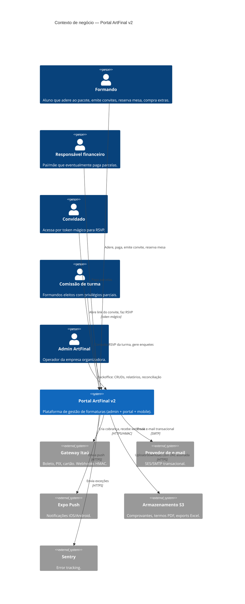

### 3.2 Contexto técnico

| Canal de entrada              | Protocolo                        | Autenticação                                    | Observações                                          |
| ----------------------------- | -------------------------------- | ----------------------------------------------- | ---------------------------------------------------- |
| React Web (SPA)               | HTTPS → `api/v1`                 | **Sanctum stateful** (cookie `laravel_session`) | Mesmo domínio raiz. CSRF via `/sanctum/csrf-cookie`. |
| React Native (Mobile)         | HTTPS → `api/v1`                 | **Sanctum token** (`Authorization: Bearer`)     | `abilities` derivadas de permissions Spatie.         |
| Convidado (público)           | HTTPS → `api/v1/convite/{token}` | Token mágico (middleware `ResolveConviteToken`) | Rate limit por IP (§2.10).                           |
| Admin / Comissão (backoffice) | HTTPS → rotas `web`              | Guards `admin` / `web`                          | Blade + Livewire; compartilha Actions com API.       |
| Webhooks (Itaú, mock)         | HTTPS → `webhooks/*`             | **HMAC-SHA256** de `X-Signature`                | Sem CSRF; idempotência via `webhook_eventos`.        |

---

## 4. Estratégia de solução

### 4.1 Decisões-chave (resumo executivo)

1. **Monólito modular em Laravel 13** com bounded contexts mapeados em namespaces (`App\Actions\<Contexto>`, `App\Models\<Contexto>`). Ver `ADR-0002`.
2. **API-first**: `api/v1` é a interface oficial de todos os clientes externos. Admin Blade compartilha **Actions**, nunca Controllers. Ver `ADR-0001`.
3. **Core independente de HTTP**: Actions recebem DTOs, retornam DTOs/void, emitem Events. Nunca tocam em `Illuminate\Http\*`. Garantido por Pest arch tests.
4. **Dual-mode Sanctum**: SPA (cookie) + token (mobile). Ver `ADR-0003`.
5. **IDs ULID públicos**: `CHAR(26)` em toda entidade exposta. BIGINT sequencial só no banco. Ver `ADR-0004`.
6. **Idempotência 3-camadas**: header `X-Idempotency-Key` + cache Redis 24h + unique constraint em DB. Ver `ADR-0005`.
7. **Concorrência de seating**: Redis lock por `assento_id` + `lockForUpdate` em `assentos` + unique parcial `WHERE status IN ('hold','confirmada')` em `reservas_assentos`. Ver `ADR-0006`.
8. **OpenAPI via Scramble** (`dedoc/scramble`): spec gerada automaticamente de FormRequests e Resources. Ver `ADR-0007`.
9. **Verbos em URL** para transições de state machine (`/reservas/{id}/confirmar`). Ver `ADR-0008`.
10. **Snapshots imutáveis JSONB** em `adesoes`, `convites`, `reservas_assentos` (confirmada), `pedidos_extras` (pago). Ver `ADR-0009`.
11. **Enums backed PHP 8.1+** em 100% dos campos finitos. Ver `ADR-0010`.
12. **Horizon + Redis** para filas segregadas (`default`, `notifications`, `webhooks`, `exports`, `critical-seating`). Ver `ADR-0011`.
13. **Spatie Permission com `guard_name`** explícito por modelo (`sanctum`, `admin`). Ver `ADR-0012`.
14. **Webhook HMAC + `firstOrCreate`** no `webhook_eventos` + processamento em job pós-commit. Ver `ADR-0013`.
15. **Valores monetários INTEGER centavos**. Ver `ADR-0014`.

### 4.2 Abordagens de qualidade

| Qualidade                    | Abordagem                                                                                                |
| ---------------------------- | -------------------------------------------------------------------------------------------------------- |
| **Correção em concorrência** | Defesa em profundidade: lock Redis + `lockForUpdate` + unique parcial DB + idempotency key.              |
| **Segurança**                | Guards isolados, Policies em todo recurso, rate limiting por contexto, HMAC em webhook, token hash only. |
| **Manutenibilidade**         | Bounded contexts, Actions finas, DTOs tipados, arch tests Pest, PHPStan level 6.                         |
| **Observabilidade**          | Logs JSON com `request_id` + `correlation_id`, Pulse para métricas internas, Sentry p/ erros.            |
| **Performance**              | `preventLazyLoading` em dev, eager loading explícito, cache com invalidação por evento.                  |
| **Testabilidade**            | Actions puras (sem Request), factories por Model, states nomeados, feature + arch tests.                 |

### 4.3 Organização técnica

Cada **bounded context** tem:

- Actions em `App\Actions\<Contexto>\*`
- DTOs em `App\Data\<Contexto>\*`
- Enums em `App\Enums\<Contexto>\*`
- Models em `App\Models\<Contexto>\*`
- Events em `App\Events\<Contexto>\*`
- Policies em `App\Policies\*` (namespace flat, mas 1 por recurso)
- Controllers API em `App\Http\Api\V1\Controllers\<Contexto>\*`
- FormRequests em `App\Http\Api\V1\Requests\<Contexto>\*`
- Resources em `App\Http\Api\V1\Resources\<Contexto>\*`
- Controllers Admin em `App\Http\Web\Admin\Controllers\<Area>\*`

Regras de namespace (prevenção de ciclos — §1.2 Planejamento):

- `Actions\*` → pode depender de `Data\*`, `Models\*`, `Services\*`, `Events\*`, `Enums\*`, `Exceptions\*`.
- `Actions\*` → **não pode** depender de `Http\*`, `Livewire\*`, `Jobs\*`.
- `Jobs\*` → depende apenas de `Actions\*` e `Services\*`.
- `Http\Api\V1\Controllers\*` → depende apenas de `Actions\*`, `Data\*`, `Http\*\Requests\*`, `Http\*\Resources\*`, `Policies\*`, `Enums\*`.
- `Models\*` → não importa `Actions\*`.

---

## 5. Blocos de construção (Building Block View)

### 5.1 Whitebox geral (C4 Level 2)

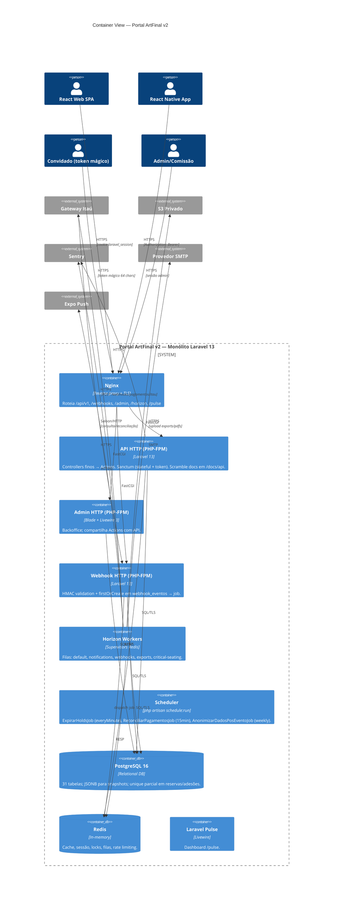

### 5.2 Blocos por bounded context (C4 Level 3)

Cada bloco abaixo é um "container lógico" dentro do monólito. Fronteiras são namespaces, não processos separados.

```mermaid
flowchart LR
    subgraph BC1[Identidade e Acesso]
        AU[AdminUser]
        PU[PortalUser]
        CU[ComissaoUser]
        SP[Spatie Permission<br/>Roles/Permissions]
        CT[ConvidadoAccessToken]
    end

    subgraph BC2[Cadastro]
        ORG[Organizacao]
        INS[Instituicao]
        CUR[Curso]
        TUR[Turma]
        EVT[Evento]
        FOR[Formando]
    end

    subgraph BC3[Comercial / Adesão]
        PAC[Pacote]
        PRD[Produto]
        ADE[Adesao + AdesaoProduto]
        PAR[Parcela]
        PAG[Pagamento]
    end

    subgraph BC4[Convites]
        LOT[LoteConvite]
        CVT[Convite]
        RSV[RsvpHistorico]
        COT[CotaRegra]
    end

    subgraph BC5[Seating]
        MAP[MapaMesa]
        SET[Setor]
        MES[Mesa]
        ASS[Assento]
        RAS[ReservaAssento]
        RAH[ReservaHistorico]
    end

    subgraph BC6[Extras]
        PEX[ProdutoExtra]
        PED[PedidoExtra]
        PEI[PedidoExtraItem]
    end

    subgraph BC7[Engajamento / Enquetes]
        ENQ[Enquete]
        OPC[OpcaoEnquete]
        VOT[Voto]
    end

    subgraph BC8[Comunicação]
        TPL[TemplateNotificacao]
        NOT[Notificacao + Entrega]
    end

    subgraph BC9[Infra externa]
        WHE[WebhookEvento]
        ACL[ActivityLog]
    end

    BC1 --> BC2
    BC2 --> BC3
    BC3 -->|confirmada emite cota| BC4
    BC4 -->|RSVP confirmado habilita| BC5
    BC3 --> BC6
    BC6 -->|pago gera| BC4
    BC2 --> BC7
    BC3 -->|Pagamento| BC9
    BC6 -->|Pagamento| BC9
```

### 5.3 Whitebox: Seating (bounded context mais crítico)

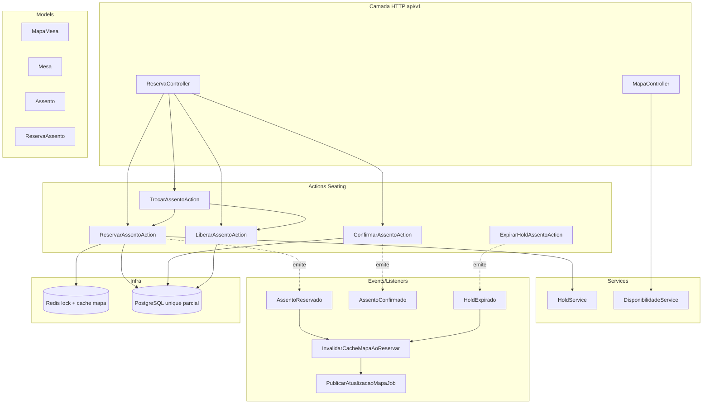

### 5.4 Whitebox: Pagamentos

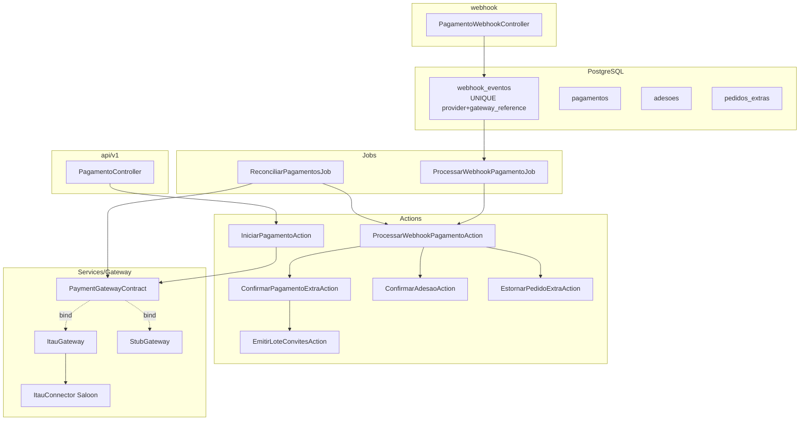

### 5.5 Whitebox: Convites + RSVP

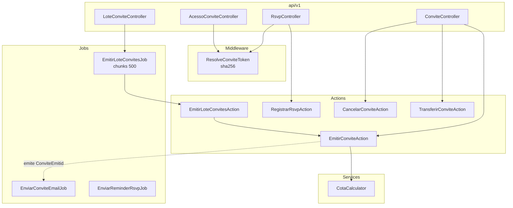

---

## 6. Tempo de execução (Runtime View)

### 6.1 Reserva de assento (caminho feliz)

Referência: §5.1 do Planejamento. Decisão em `ADR-0006`.

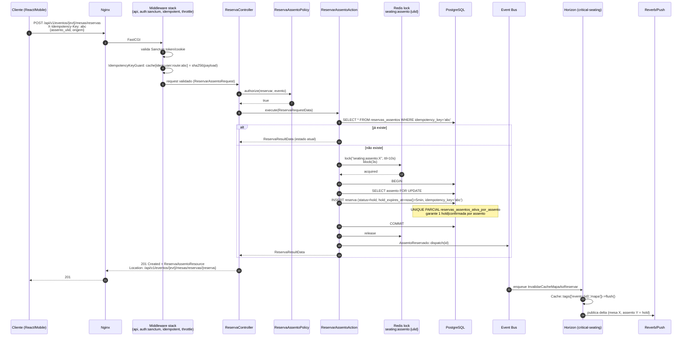

### 6.2 Reserva de assento (caminhos de falha)

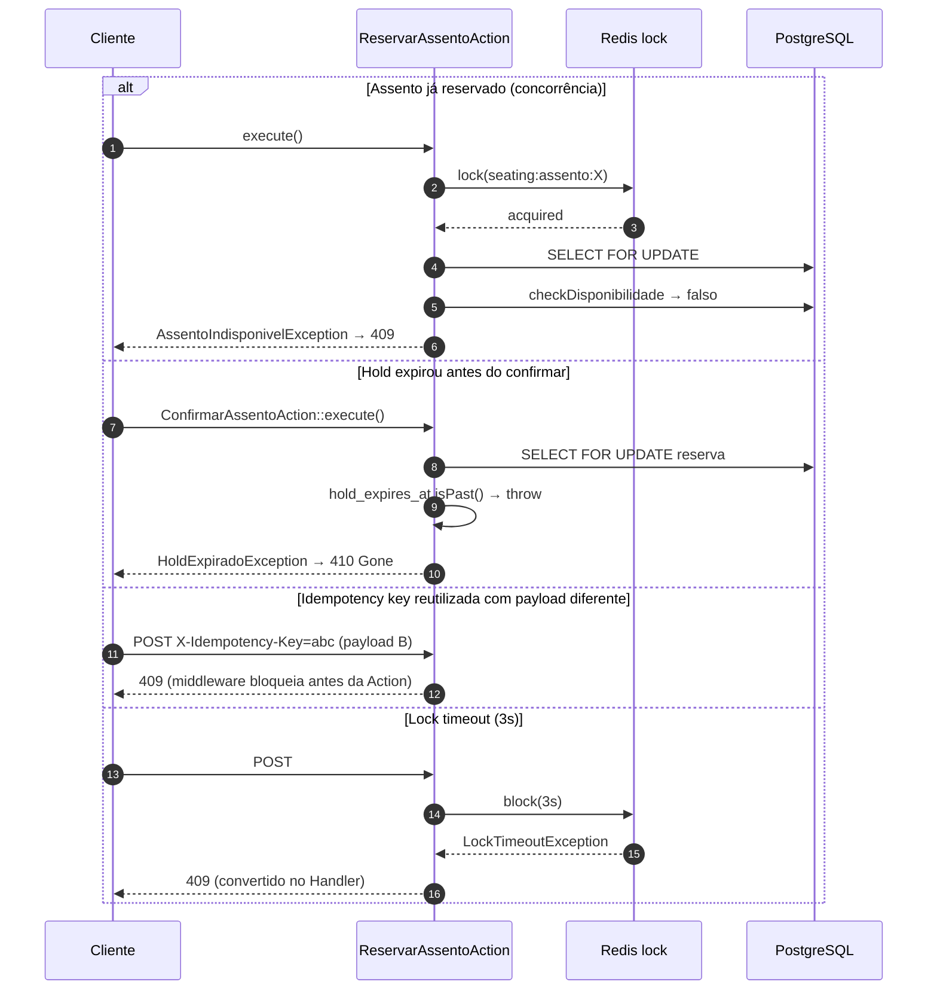

### 6.3 Webhook de pagamento idempotente

Referência: §5.5 do Planejamento. Decisão em `ADR-0013`.

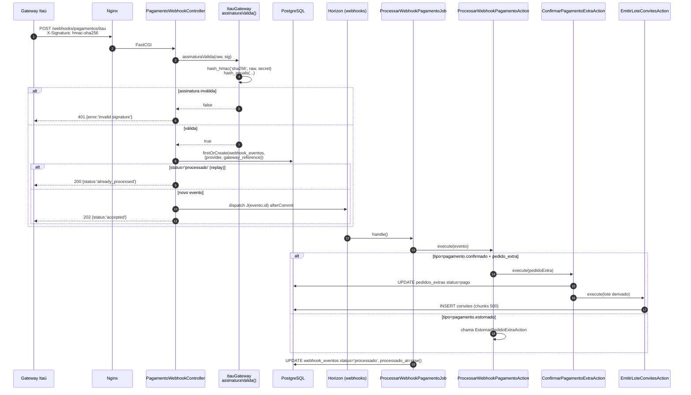

### 6.4 Emissão de lote de convites (assíncrono 202)

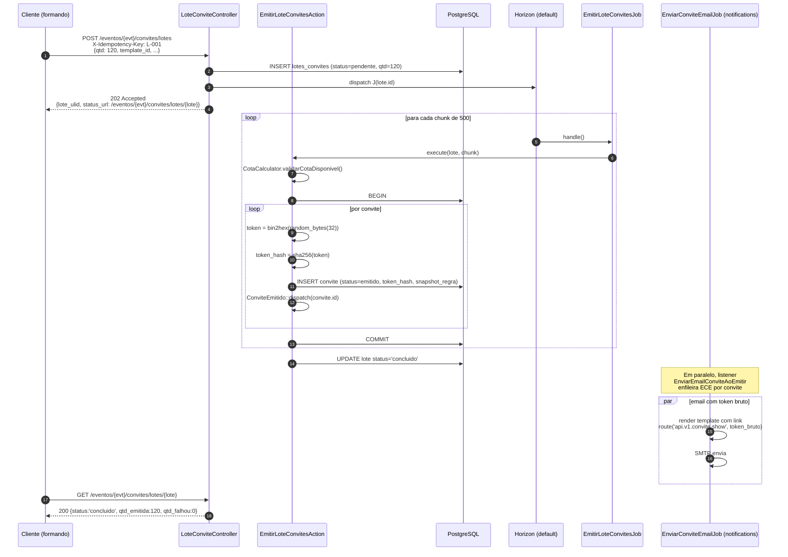

### 6.5 Login SPA vs Mobile

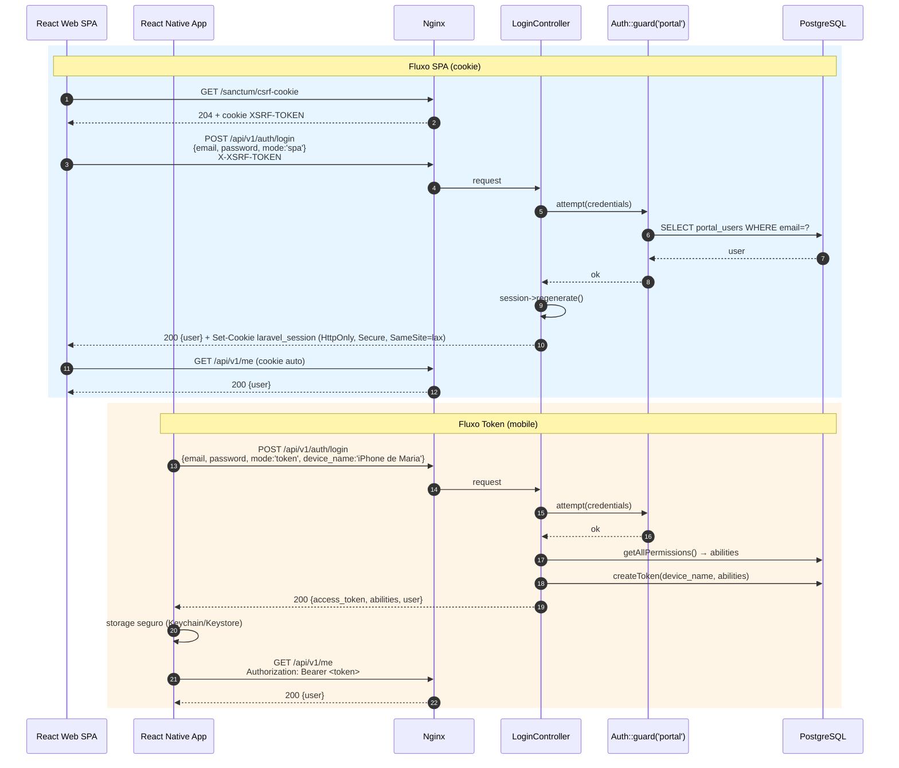

### 6.6 Expiração de hold (scheduled)

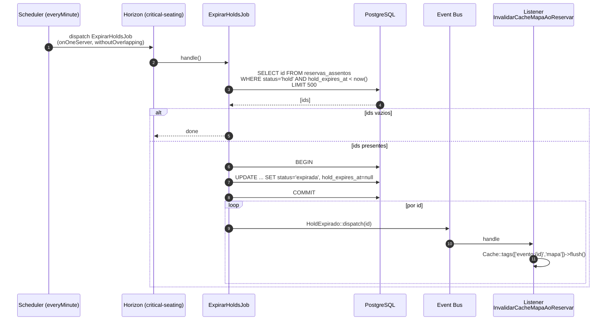

---

## 7. Deployment

### 7.1 Visão de produção

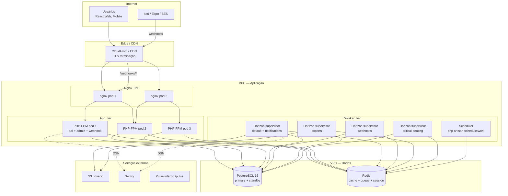

### 7.2 Ambientes

| Ambiente   | Infra                                       | Observações                                                   |
| ---------- | ------------------------------------------- | ------------------------------------------------------------- |
| `local`    | Laradock (docker-compose) no macOS          | PHP 8.4, PG 16, Redis, Mailpit, nginx. `.env.local`.          |
| `staging`  | 1× app, 1× worker, PG single-AZ             | Dados de seed + massa sintética. Deploy por branch `develop`. |
| `producao` | 2–3× app, 4× worker (por supervisor), PG HA | Deploy por tag `v*` após CI verde.                            |

### 7.3 Processo de deploy

1. `git push` → CI (GitHub Actions): Pint, PHPStan level 6, Pest (feature + arch + unit), Prettier.
2. Se verde e branch é `main` + tag: build image PHP-FPM 8.4 + Nginx.
3. `php artisan migrate --force` em pre-hook (baseline blue/green: só migrations backward-compatible).
4. Rolling update de PHP-FPM (2 pods mínimo).
5. Horizon: `php artisan horizon:terminate` → workers reciclam, novos pegam a nova imagem.
6. Scheduler: 1 pod `schedule:work`, ou cron externo chamando `schedule:run` a cada minuto.
7. Smoke test: `GET /up`, `GET /api/v1/auth/login` sem body → 422 esperado, `GET /horizon` autenticado.

### 7.4 Configuração sensível

- Secrets via Vault/SSM (`.env` apenas em dev).
- `SANCTUM_STATEFUL_DOMAINS`, `SESSION_DOMAIN`, `ITAU_WEBHOOK_SECRET`, `SENTRY_LARAVEL_DSN`, `AWS_*` injetados por variável de ambiente.

---

## 8. Conceitos transversais (Crosscutting)

### 8.1 Autenticação

4 guards (§6.1 Planejamento):

| Guard     | Driver  | Provider | Uso                                           |
| --------- | ------- | -------- | --------------------------------------------- |
| `admin`   | session | admins   | Backoffice Blade/Livewire.                    |
| `web`     | session | users    | Legado / fallback.                            |
| `sanctum` | sanctum | portals  | React Web (cookie) + Mobile (token).          |
| `convite` | custom  | —        | Resolve `Convite` por `sha256(token)` em URL. |

Spatie Permission com `guard_name` declarado por modelo. Ver `ADR-0012`.

### 8.2 Autorização

- **Policy por recurso** (§6.4 Planejamento): `EventoPolicy`, `AdesaoPolicy`, `ConvitePolicy`, `MapaMesaPolicy`, `ReservaAssentoPolicy`, `PedidoExtraPolicy`, `EnquetePolicy`, `RelatorioPolicy`.
- **Role `comissao`** nunca herda `admin`. Permissões explícitas `comissao.*` (§6.5).
- **Scope por evento**: policies checam `user->eventosAutorizados()->contains($evento->id)`.
- **FormRequest.authorize()** chama `$this->user()->can(...)` no topo para falhar rápido.

### 8.3 Cache

| Chave                            | TTL                   | Invalidação                                             |
| -------------------------------- | --------------------- | ------------------------------------------------------- |
| `evento:{ulid}:config`           | 30 min                | `EventoAtualizado`                                      |
| `evento:{id}:contadores:rsvp`    | 60 s                  | `RsvpRegistrado`, `ConviteEmitido`, `Cancelado`         |
| `evento:{id}:mapa:leitura`       | 5 min OU event-driven | `AssentoReservado`, `AssentoConfirmado`, `HoldExpirado` |
| `enquete:{id}:resultado:publico` | 1 min                 | `VotoRegistrado`, `EnqueteEncerrada`                    |
| `lookup:produtos:evento:{id}`    | 30 min                | Observer de `Produto`                                   |
| `permissions:user:{id}`          | 10 min                | `PermissaoAlterada` + Spatie cache                      |

**Nunca cachear:** disponibilidade final de assento em disputa; status financeiro pós-`PagamentoConfirmado`; dados sensíveis pessoais em cache compartilhado.

### 8.4 Rate limiting

`RateLimiterServiceProvider` define limiters nomeados (§2.10):

| Limiter   | Regra                                 | Escopo por      |
| --------- | ------------------------------------- | --------------- |
| `api`     | 120/min                               | `user_id` ou IP |
| `login`   | 5/min                                 | `email + IP`    |
| `convite` | 10/min                                | IP              |
| `seating` | 5/min                                 | `user_id` ou IP |
| `voto`    | 3/min                                 | `user_id` ou IP |
| `webhook` | 600/min (HMAC é a proteção principal) | IP              |

### 8.5 Logs

- Formato JSON (Monolog `JsonFormatter`) em `stderr`.
- Processor `CorrelationProcessor` injeta `request_id`, `actor_type`, `actor_id`, `evento_id`, `correlation_id` em todo record.
- Mascaramento (§11.8): tokens → `***`, CPF → `123.***.*89-00`, cartão nunca aparece.
- Nível: `info` para operações de negócio, `warning` para validação, `error` para exceção não tratada.

### 8.6 Snapshots

| Quando tirar                    | O que capturar                                                | Onde                               |
| ------------------------------- | ------------------------------------------------------------- | ---------------------------------- |
| `Adesao` → `ativa`              | preço, desconto, termo, condições, termo_hash                 | `adesoes.snapshot_comercial JSONB` |
| `Convite` → `emitido`           | regra de cota, template, lote                                 | `convites.snapshot_regra JSONB`    |
| `ReservaAssento` → `confirmada` | composição da mesa, setor, assento                            | histórico `reservas_historico`     |
| `PedidoExtra` → `pago`          | catálogo de produtos extras, preço, regra de emissão derivada | `pedidos_extras.snapshot_json`     |

**Propriedades:** imutáveis após confirmação. Nunca consultados por `WHERE`. `termo_hash = sha256(termo_html)` para prova em disputa.

### 8.7 Auditoria

`spatie/laravel-activitylog` com:

- Trait `LogsActivity` em entidades críticas.
- `activity_log` **append-only** — nunca DELETE/UPDATE (`ADR-0009`, §12.3).
- Retenção 2 anos, arquivo em S3 parquet depois.
- Campos adicionais: `request_id`, `actor_type`, `actor_id`, `correlation_id`.

### 8.8 i18n

- Projeto 100% PT-BR (CLAUDE.md §6).
- Validação via `laravellegends/pt-br-validator`.
- Enums têm método `label()` para renderização.
- Futuro: se expandir, adicionar `en` via `trans()` + `lang/en/*.php`.

### 8.9 Envelope de erro unificado

Referência: §2.11 Planejamento. Todo erro sob `api/*` e `webhooks/*` retorna:

```json
{
    "error": "ValidationError",
    "message": "Dados de entrada inválidos.",
    "details": { "fields": { "email": ["O campo email é obrigatório."] } },
    "request_id": "01J5K2N7QMHV1FJZ8H0PR3RV9C",
    "timestamp": "2026-04-17T14:32:11Z"
}
```

Mapeamento completo `Throwable → HTTP code` na §2.11. Handler global registrado em `bootstrap/app.php → ->withExceptions()`.

### 8.10 Concorrência (resumo)

| Operação              | Estratégia                                                                                           |
| --------------------- | ---------------------------------------------------------------------------------------------------- |
| Reserva de assento    | Redis lock + `lockForUpdate` em `assentos` + unique parcial em `reservas_assentos` + idempotency DB. |
| Confirmação de adesão | `DB::transaction` com UPDATE condicional `WHERE status='pendente_pagamento'`.                        |
| Webhook               | `firstOrCreate(webhook_eventos, {provider, gateway_reference})` + `dispatch afterCommit()`.          |
| Emissão em lote       | chunks 500 em `DB::transaction`; rollback parcial OK (idempotency key por convite).                  |
| Voto                  | `unique(enquete_id, ator_tipo, ator_id)` + `upsert` se `permite_edicao=true`.                        |

### 8.11 Observabilidade (consolidado)

- **Pulse** (`/pulse`): slow queries, cache miss ratio, exceptions, slow jobs, slow outgoing.
- **Horizon** (`/horizon`): filas, throughput, failed, waits.
- **Sentry**: 100% das exceções, performance 10%.
- **Alertas** (§12.3): webhook falha massiva, conflito seating, fila travada, 5xx > 1%, rate limit > 100/min.

---

## 9. Decisões arquiteturais (índice de ADRs)

Todos os ADRs seguem formato **MADR** e estão em `docs/architecture/adrs/`. Mudança significativa em qualquer área abaixo deve gerar novo ADR com `supersedes:` apontando para o anterior.

| ID       | Título                                                             | Status   |
| -------- | ------------------------------------------------------------------ | -------- |
| ADR-0001 | API-first + versionamento `api/v1`                                 | Accepted |
| ADR-0002 | Monólito modular vs microservices                                  | Accepted |
| ADR-0003 | Sanctum dual-mode (SPA stateful + token mobile)                    | Accepted |
| ADR-0004 | ULID público, BIGINT interno                                       | Accepted |
| ADR-0005 | Idempotência em 3 camadas (header + cache + DB unique)             | Accepted |
| ADR-0006 | Concorrência seating (Redis lock + unique parcial + lockForUpdate) | Accepted |
| ADR-0007 | OpenAPI via `dedoc/scramble`                                       | Accepted |
| ADR-0008 | Verbos em URL para state-machine transitions                       | Accepted |
| ADR-0009 | Snapshots imutáveis em JSONB                                       | Accepted |
| ADR-0010 | Enums PHP backed vs strings livres                                 | Accepted |
| ADR-0011 | Horizon + Redis para filas                                         | Accepted |
| ADR-0012 | Spatie Permission com `guard_name` por modelo                      | Accepted |
| ADR-0013 | Webhook HMAC + `firstOrCreate` + job pós-commit                    | Accepted |
| ADR-0014 | Valores monetários em INTEGER centavos                             | Accepted |

---

## 10. Requisitos de qualidade

Cenários no estilo **Bass–Clements–Kazman** (ISO 25010 adaptado).

### 10.1 Árvore de utilidade

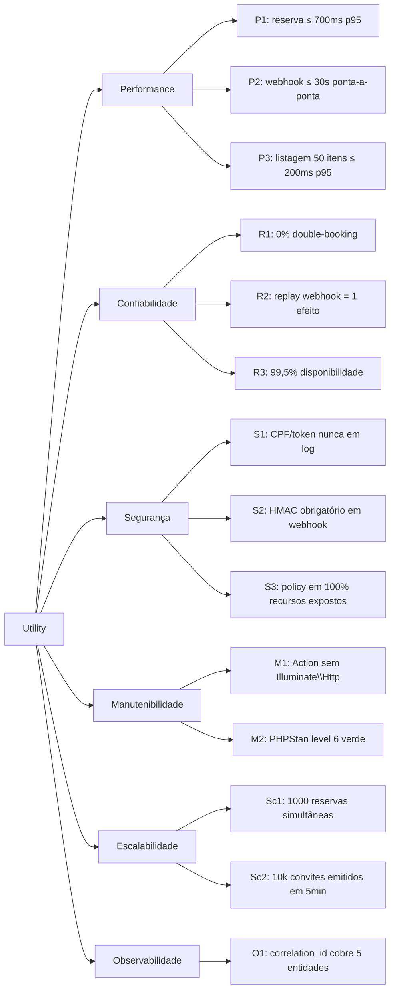

### 10.2 Cenários-chave

**Cenário P1 — Latência de reserva**

- **Fonte:** Cliente mobile autenticado.
- **Estímulo:** POST `/eventos/{evt}/mesas/reservas`.
- **Ambiente:** operação normal, 200 usuários ativos.
- **Artefato:** `ReservarAssentoAction`.
- **Resposta:** 201 + `ReservaAssentoResource`.
- **Medida:** p95 ≤ 700 ms; p99 ≤ 1 500 ms.

**Cenário R1 — Zero double-booking**

- **Fonte:** 1 000 clientes simultâneos.
- **Estímulo:** POST na mesma `/reservas` para o mesmo `assento_ulid`.
- **Ambiente:** produção simulada (load test).
- **Artefato:** `reservas_assentos` unique parcial + Redis lock.
- **Resposta:** 1 × 201, 999 × 409 `AssentoIndisponivel`.
- **Medida:** 0% de `status=hold|confirmada` duplicadas no banco.

**Cenário R2 — Idempotência de webhook**

- **Fonte:** Gateway Itaú (replay).
- **Estímulo:** mesmo `gateway_reference` enviado 10×.
- **Ambiente:** produção.
- **Artefato:** `webhook_eventos` unique + `ProcessarWebhookPagamentoJob`.
- **Resposta:** 1× 202 "accepted", 9× 200 "already_processed".
- **Medida:** `pedidos_extras.status='pago'` aplicado exatamente 1 vez.

**Cenário S1 — Vazamento de CPF**

- **Fonte:** Auditor LGPD lendo logs.
- **Estímulo:** buscar regex CPF em 30 dias de log.
- **Ambiente:** produção.
- **Artefato:** `CorrelationProcessor` + conveção de logging (§11.8).
- **Resposta:** CPF sempre mascarado (`123.***.*89-00`).
- **Medida:** 0 ocorrências de CPF completo em logs.

**Cenário M1 — Refatoração sem quebrar API**

- **Fonte:** Dev backend.
- **Estímulo:** mover uma Action de contexto.
- **Ambiente:** dev.
- **Artefato:** Pest arch tests + PHPStan.
- **Resposta:** CI bloqueia antes do merge se regra de namespace violada.
- **Medida:** 0 violações mergeáveis.

**Cenário Sc2 — Emissão em lote**

- **Fonte:** Formando representante.
- **Estímulo:** POST `/convites/lotes` com `qtd=10000`.
- **Ambiente:** produção.
- **Artefato:** `EmitirLoteConvitesJob` + Horizon.
- **Resposta:** 202 imediato; lote concluído em ≤ 5 min.
- **Medida:** throughput ≥ 33 convites/seg na fila `default`.

**Cenário O1 — Reconstrução de timeline**

- **Fonte:** Suporte investigando reclamação de formando.
- **Estímulo:** query por `correlation_id`.
- **Ambiente:** produção.
- **Artefato:** query UNION (§12.4 Planejamento) + colunas `correlation_id`.
- **Resposta:** timeline `convite → RSVP → reserva → pagamento`.
- **Medida:** ≤ 200 ms e cobre ≥ 5 entidades.

---

## 11. Riscos e dívida técnica

### 11.1 Matriz de riscos

| #   | Risco                                                               | Impacto | Probabilidade | Mitigação                                                                          |
| --- | ------------------------------------------------------------------- | ------- | ------------- | ---------------------------------------------------------------------------------- |
| R01 | Lógica de negócio migra para Blade/Livewire do admin                | Alta    | Média         | Arch tests Pest + PR review checklist + ADR-0001.                                  |
| R02 | Double-booking em seating sob concorrência real                     | Crítico | Baixa         | 3 camadas (lock + lockForUpdate + unique parcial) + testes de carga §10.3.         |
| R03 | Webhook duplicado aplica efeito 2×                                  | Alto    | Baixa         | `firstOrCreate` em `webhook_eventos` + job idempotente + ADR-0013.                 |
| R04 | Token de convite vaza em logs                                       | Alto    | Média         | Só `token_hash` persiste; middleware nunca loga `token`; arch test grep.           |
| R05 | N+1 em listagens de grande evento (10k convites)                    | Médio   | Alta          | `preventLazyLoading` em dev + eager explícito em Resources + Pulse slow query.     |
| R06 | Horizon trava fila `critical-seating` por memory leak               | Alto    | Baixa         | `memory=128`, `timeout=30`, `tries=1`; alerta Pulse + pager.                       |
| R07 | Permissão Spatie cache fica stale após mudança de role              | Médio   | Média         | `PermissaoAlterada` listener flusha Cache tag + ADR-0012.                          |
| R08 | PostgreSQL sem índice em `correlation_id` → query de timeline lenta | Médio   | Média         | Migration adiciona índice BTREE em 5 tabelas; alerta se > 200 ms.                  |
| R09 | Migrations incompatíveis com rolling deploy                         | Alto    | Média         | Regra: migrations aditivas; renomeações em 2 deploys (add col → move code → drop). |
| R10 | LGPD: retenção pós-evento ignorada                                  | Alto    | Média         | `AnonimizarDadosPosEventoJob` scheduled semanal + dashboard Pulse.                 |
| R11 | Coupling implícito entre bounded contexts via Model relations       | Médio   | Alta          | Regra: relation permitida mas regra de negócio cross-context vai via Event.        |
| R12 | Scramble gera spec desatualizada por FormRequest malformado         | Baixo   | Média         | CI roda `php artisan scramble:export` e falha se schema diverge.                   |

### 11.2 Dívida técnica conhecida (no início de F1)

| Item                                                                         | Severidade | Plano                                                               |
| ---------------------------------------------------------------------------- | ---------- | ------------------------------------------------------------------- |
| Guard `portal` legado (apenas session) coexistirá com `sanctum` até F3.      | Baixa      | F3: remover guard `portal` após migração 100% do Livewire.          |
| Admin em Livewire 3 duplica parte do fluxo da API (ex.: tabela de reservas). | Média      | Sempre consumir Actions; se vira gargalo, quebrar para API interna. |
| Falta ADR para escolha de biblioteca React (roteador, query client).         | Baixa      | Criar ADR-0015 quando F3 começar.                                   |
| Sem tracing distribuído real (OpenTelemetry).                                | Baixa      | F7: avaliar custo/benefício; `correlation_id` resolve 80%.          |

---

## 12. Glossário

| Termo                | Definição                                                                                                                |
| -------------------- | ------------------------------------------------------------------------------------------------------------------------ |
| **Action**           | Classe invocável (`execute()`) que encapsula uma operação de domínio. Recebe DTO, retorna DTO. Não conhece HTTP.         |
| **Adesão**           | Contrato formal do formando com a empresa organizadora: pacote, parcelamento, termo aceito.                              |
| **Bounded context**  | Fronteira semântica de um subdomínio (ex.: Convites, Seating). Aqui = namespace e pasta.                                 |
| **Comissão**         | Formandos eleitos com privilégios parciais sobre sua turma. Role Spatie `comissao`.                                      |
| **Correlation ID**   | ID propagado entre request HTTP, job, webhook para reconstruir timeline funcional.                                       |
| **Cota**             | Regra declarativa que determina quantos convites um formando pode emitir.                                                |
| **DTO**              | Data Transfer Object. Aqui: `Spatie\LaravelData\Data`, readonly, com `toArray()`.                                        |
| **Evento (domínio)** | Uma formatura específica: data, local, turmas participantes, mapa de mesas, produtos extras.                             |
| **Evento (Laravel)** | `App\Events\*` disparado por Actions para desacoplar side-effects (notificação, cache flush).                            |
| **FormRequest**      | Classe Laravel que centraliza validação e autorização HTTP. Obrigatória em toda rota de input.                           |
| **Guard**            | Estratégia de autenticação do Laravel: `admin` (session), `web` (session), `sanctum` (token/cookie), `convite` (custom). |
| **HMAC**             | Hash-based Message Authentication Code. Validação de integridade + origem de webhook.                                    |
| **Hold**             | Estado transitório de reserva: 5 minutos para o formando confirmar antes do assento liberar.                             |
| **Idempotency key**  | Header `X-Idempotency-Key` + unique DB que garante que uma operação aconteça no máximo uma vez.                          |
| **JSONB**            | Tipo JSON binário do PostgreSQL. Usado para snapshots e configs.                                                         |
| **Lote de convites** | Agrupamento de convites emitidos juntos (ex.: 120 convites de uma família). Processamento async.                         |
| **MADR**             | Markdown Architectural Decision Records. Formato usado nos ADRs.                                                         |
| **Pacote**           | Oferta comercial (produto) que o formando contrata ao aderir.                                                            |
| **Portal**           | Faces do cliente (React Web + Mobile). Guard `sanctum`.                                                                  |
| **RSVP**             | _Répondez s'il vous plaît_ — confirmação/recusa de presença pelo convidado.                                              |
| **Sanctum stateful** | Modo SPA do Sanctum: cookie `laravel_session` + CSRF + `EnsureFrontendRequestsAreStateful`.                              |
| **Sanctum token**    | Modo mobile: `Authorization: Bearer` + `abilities`.                                                                      |
| **Scramble**         | `dedoc/scramble` — gera OpenAPI 3.x automaticamente de FormRequests/Resources.                                           |
| **Snapshot**         | Cópia imutável de dados comerciais/regulatórios no momento da confirmação de uma entidade transacional.                  |
| **State machine**    | Máquina de estados explícita em Enum backed (ex.: `StatusReserva`). Transições via endpoints com verbo.                  |
| **ULID**             | Identificador 128 bits lexicográficamente ordenado. 26 chars em base32. ID público.                                      |
| **Unique parcial**   | Índice UNIQUE + `WHERE` clause. Ex.: apenas UMA reserva ativa por assento.                                               |
| **Webhook event**    | Registro em `webhook_eventos` que cria idempotência dura por `(provider, gateway_reference)`.                            |

---

**Fim do SAD.** Revisões seguintes devem atualizar `version`, `date` e manter compatibilidade com o Planejamento Técnico como fonte-de-verdade. Novos ADRs são incluídos no índice da §9.
