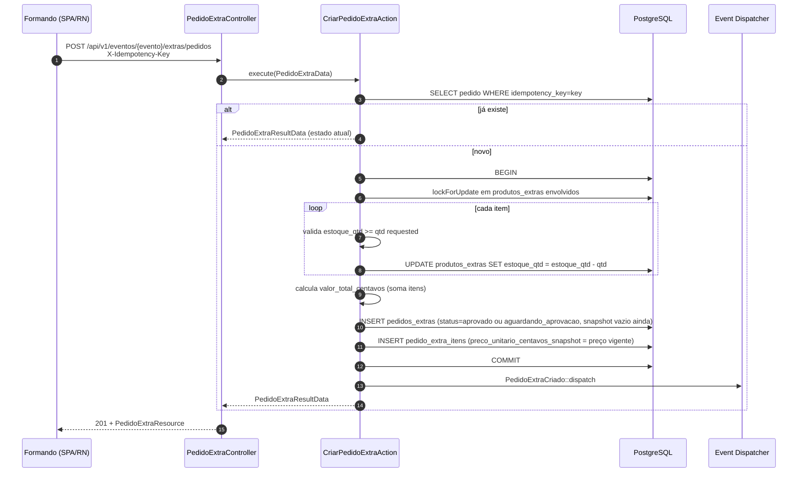
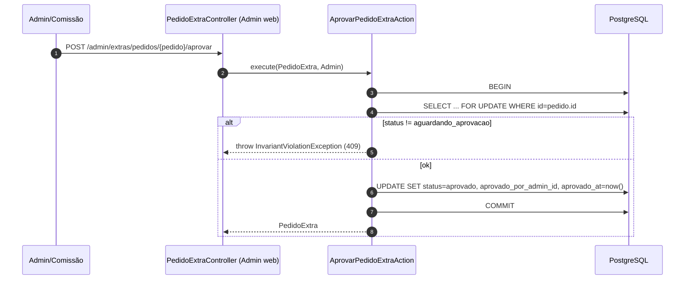
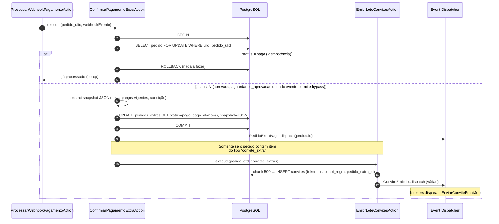
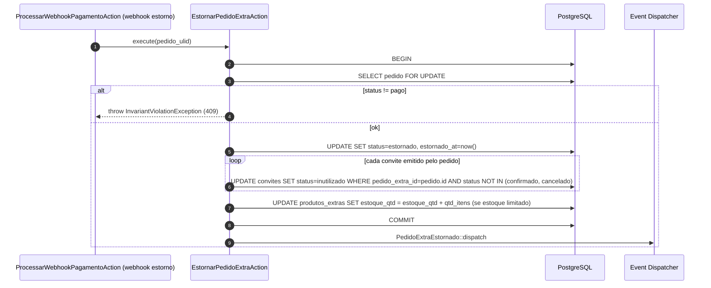
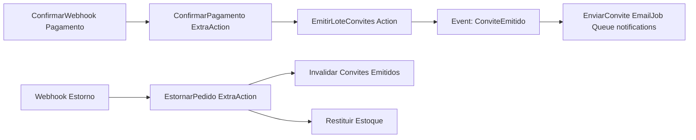

# Technical Design — Extras (Pedido Extra)

**Status:** Accepted | **Data:** 2026-04-18 | **Contexto:** Compra de produtos extras (convites adicionais, upgrades) e emissão derivada de convites após pagamento | **Tags:** extras, pagamento, emissão-derivada, snapshot

> Desenho técnico do bounded context `Extras`. Referencia ADR-0005 (idempotência), ADR-0008 (state-machine), ADR-0009 (snapshot), ADR-0013 (webhook), ADR-0014 (centavos) e §2.2 (rotas), §3.7 (contratos entre actions), §4.2 bloco F, §F6 do PLANEJAMENTO_BACKEND_APIV1.md.

## 1. Objetivo e invariantes

### 1.1 Objetivo

Permitir que formandos comprem produtos extras (convites adicionais acima da cota base, upgrades de mesa, menus premium) com um fluxo de: **pedido → aprovação (opcional) → pagamento → efeito**. Após pagamento confirmado via webhook, o sistema aplica automaticamente efeitos derivados (ex.: emitir N convites extras com snapshot da regra).

### 1.2 Invariantes duras

1. **Valores em `int` centavos** (ADR-0014) em DTO, banco e gateway.
2. **Snapshot imutável** capturado em `pedidos_extras.snapshot` no momento da transição para `pago` (ADR-0009): preço unitário, condição comercial, estoque no momento.
3. **Emissão derivada é idempotente** — `ConfirmarPagamentoExtraAction` só emite convites se `status != pago` antes da transição.
4. **Máquina de estados explícita** (ADR-0008): `rascunho → aguardando_aprovacao? → aprovado → pago | cancelado | estornado`.
5. **Aprovação pelo admin/comissão é opcional** por evento (config §Apêndice B pergunta 2) — default sem aprovação.
6. **Estoque é transacional**: `ProdutoExtra.estoque_qtd` decrementa em transação única com o pedido.

## 2. Modelo de domínio

### 2.1 Entidades

- `ProdutoExtra` (mestre por evento): nome, descrição, preco_unitario_centavos, estoque_tipo (`ilimitado | limitado_por_evento | limitado_por_formando`), estoque_qtd, ativo.
- `PedidoExtra` (transacional): formando, evento, status, valor_total_centavos, aprovado_por?, pago_at?, estornado_at?, snapshot JSONB.
- `PedidoExtraItem` (itens do pedido): produto_extra_id, qtd, preco_unitario_centavos_snapshot.

### 2.2 Enums (ADR-0010)

- `StatusPedidoExtra`: `Rascunho | AguardandoAprovacao | Aprovado | Pago | Cancelado | Estornado`
- `TipoEstoque`: `Ilimitado | LimitadoPorEvento | LimitadoPorFormando`

## 3. Fluxos — Mermaid

### 3.1 Criar pedido (CriarPedidoExtraAction)



### 3.2 Aprovação (opcional — AprovarPedidoExtraAction)



### 3.3 Pagamento (cross-context para Pagamentos)

Formando chama `POST /api/v1/pagamentos/intents` com `referencia=pedido_extra_ulid` (ver technical-design-payments.md §4.1). O gateway dispara webhook de confirmação; `ProcessarWebhookPagamentoAction` decide e chama `ConfirmarPagamentoExtraAction`.

### 3.4 Confirmação de pagamento → emissão derivada (chave do design)



### 3.5 Estorno (EstornarPedidoExtraAction)



## 4. Contrato entre actions (§3.7)



**Regra**: `ConfirmarPagamentoExtraAction` é o único consumidor autorizado a chamar `EmitirLoteConvitesAction` automaticamente. Fluxos manuais (admin emite cortesia) chamam `EmitirConviteAction` direto.

## 5. DTOs

```php
final readonly class PedidoExtraData {
    public function __construct(
        public string $eventoUlid,
        public string $formandoUlid,
        public array  $itens,              // [{produto_extra_ulid, qtd}]
        public string $idempotencyKey,
    ) {}
}

final readonly class PedidoExtraResultData {
    public function __construct(
        public string $pedidoUlid,
        public StatusPedidoExtra $status,
        public int $valorTotalCentavos,     // ADR-0014
        public ?string $pagoAt,
        public ?string $estornadoAt,
    ) {}
}
```

## 6. Snapshot de pedido pago (ADR-0009)

Estrutura capturada em `pedidos_extras.snapshot` no momento `status=pago`:

```json
{
    "itens": [
        {
            "produto_extra_ulid": "01J...",
            "nome_snapshot": "Convite Extra VIP",
            "qtd": 3,
            "preco_unitario_centavos_snapshot": 15000,
            "subtotal_centavos": 45000,
            "politica_reembolso": "7 dias"
        }
    ],
    "valor_total_centavos": 45000,
    "modalidade_pagamento": "pix",
    "gateway_reference": "itau-abc-123",
    "termo_hash": "sha256...",
    "snapshot_at": "2026-04-18T14:32:11Z"
}
```

Nunca alterado depois.

## 7. Segurança e autorização

- Policy `PedidoExtraPolicy`:
    - `criar(PortalUser, Evento)`: formando tem relação com evento + janela aberta.
    - `ver(PortalUser, PedidoExtra)`: dono do pedido.
    - `aprovar(AdminUser|ComissaoUser, PedidoExtra)`: permission `extras.approve` (admin) ou `comissao.extras.approve` (apenas se habilitado, §Apêndice B pergunta 2).
- Rate limit default `api: 120/min`.
- Idempotency obrigatório em `POST pedidos` (middleware `idempotent`).
- **Nunca** expor `gateway_reference` em response pública.

## 8. Observabilidade

- Logs: `extras.pedido.criado`, `extras.pedido.aprovado`, `extras.pedido.pago`, `extras.pedido.estornado`, `extras.emissao_derivada.ok`.
- Métricas Pulse: lag entre `pago_at` e `ConviteEmitido` — aceite F6: ≤ 30s.
- Correlation ID propagado de `pagamentos` → `pedidos_extras` → `convites`.

## 9. Rotas (resumo §2.2)

| Método | Rota                                                 | Auth             | Idempotent |
| ------ | ---------------------------------------------------- | ---------------- | ---------- |
| GET    | `/api/v1/eventos/{evento}/extras/catalogo`           | sanctum          | n/a        |
| POST   | `/api/v1/eventos/{evento}/extras/pedidos`            | sanctum + policy | sim        |
| GET    | `/api/v1/eventos/{evento}/extras/pedidos/{pedido}`   | sanctum + policy | n/a        |
| POST   | `/admin/extras/pedidos/{pedido}/aprovar` (Web Admin) | admin + policy   | via CSRF   |

Ações de aprovação/estorno em admin web seguem ADR-0008 (verbos em URL para transições).

## 10. Testes críticos (§10.7)

1. **Pedido extra pago 1× emite convites derivados em ≤ 30s** (aceite F6).
2. **Webhook reprocessado 10× não dobra efeito** — `ConfirmarPagamentoExtraAction` é idempotente.
3. **Estorno** invalida convites ainda não confirmados.
4. **Estoque limitado** — concorrência de 2 pedidos pelo último item → apenas 1 sucede.
5. **Snapshot congela** — mudar preço do `ProdutoExtra` depois não altera snapshot de pedidos pagos.
6. **Aprovação opcional** — quando evento não exige, pedido vai direto de `aprovado` pro pagamento.

## 11. Ligações

- ADR-0005, ADR-0008, ADR-0009, ADR-0013, ADR-0014
- PLANEJAMENTO_BACKEND_APIV1.md §2.2, §3.7, §4.2 (bloco F), §F6, §10.7, §Apêndice B
- SAD arc42 seções "Extras" e "Integração com Pagamentos"
- technical-design-payments.md (upstream: webhook de pagamento)
- technical-design-invitations.md (downstream: convites emitidos)
