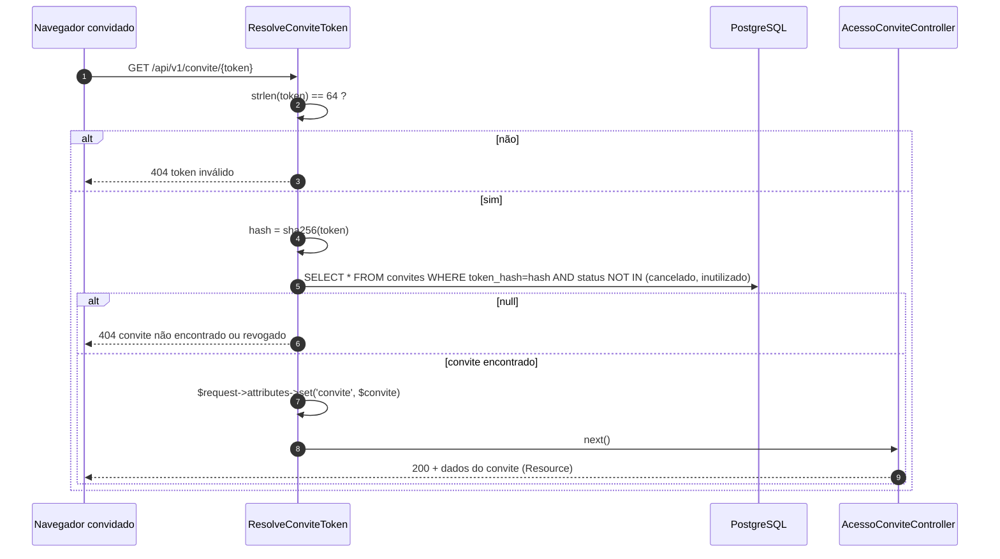
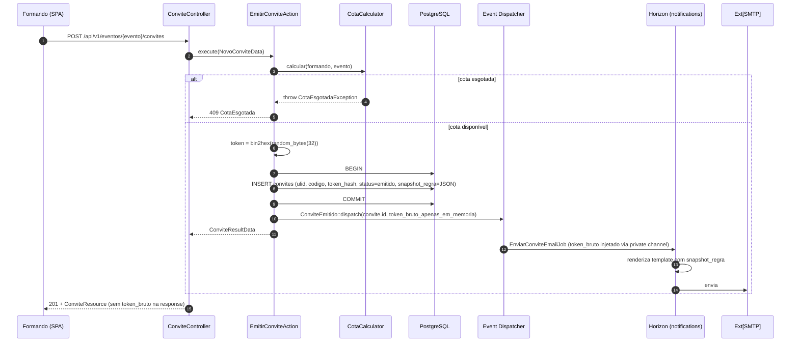
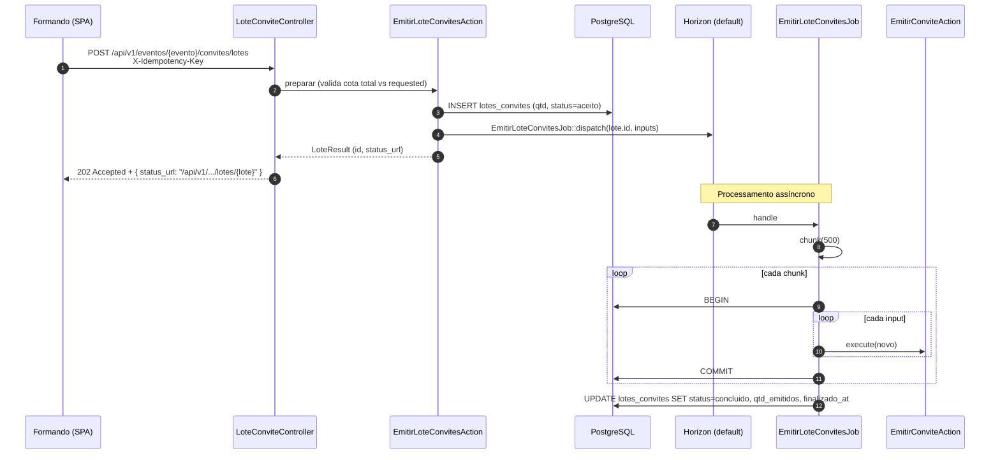
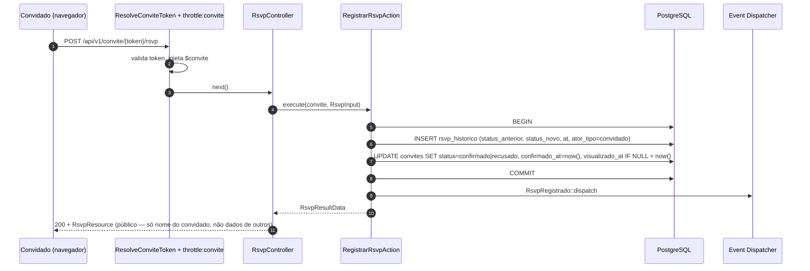
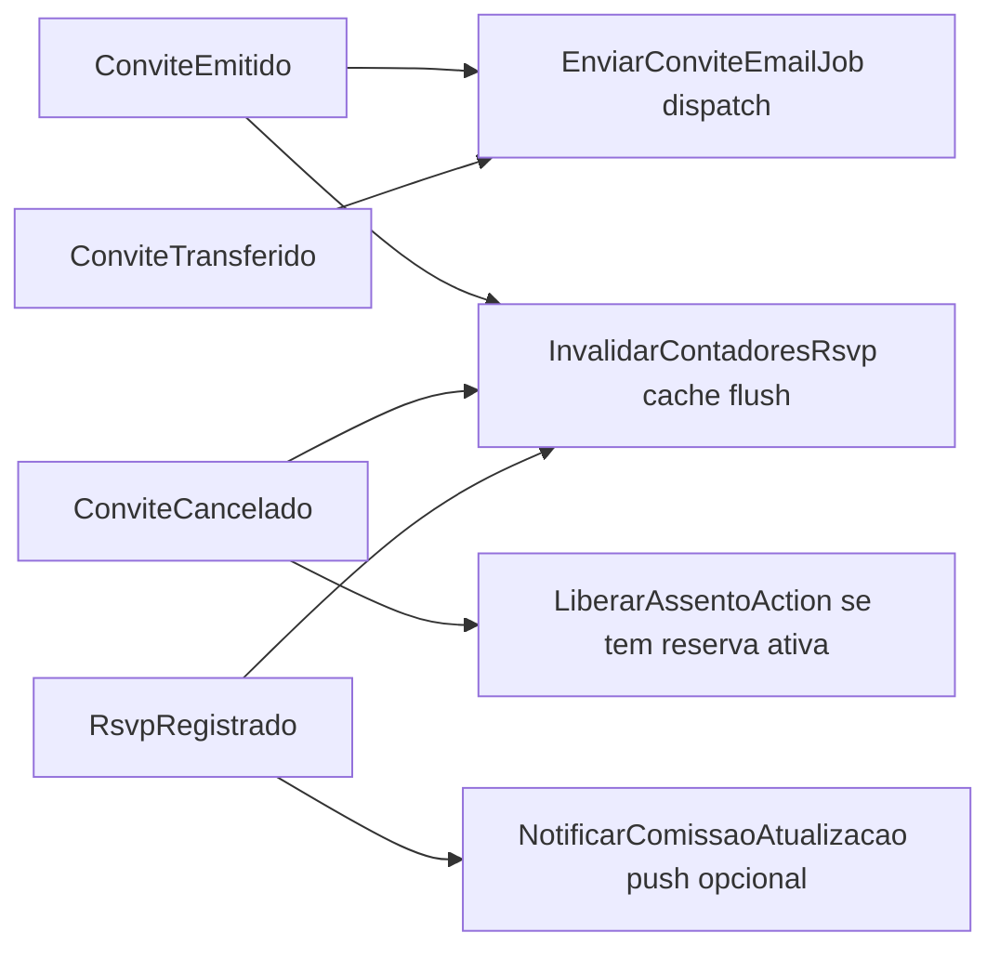

# Technical Design — Convites e RSVP

**Status:** Accepted | **Data:** 2026-04-18 | **Contexto:** Emissão de convites (individual e em lote), token público, RSVP, cotas | **Tags:** convites, token, cota, async, rsvp

> Desenho técnico dos bounded contexts `Convites` e `Rsvp`. Referencia ADR-0004 (ULID), ADR-0005 (idempotência), ADR-0009 (snapshot), ADR-0010 (enums), ADR-0013 (HMAC como referência de padrão de integridade) e §4.4, §6.3, §7.3, §F4 do PLANEJAMENTO_BACKEND_APIV1.md.

## 1. Objetivo e invariantes

### 1.1 Objetivo

Permitir que formandos/comissão emitam convites (individuais e em lote assíncrono), respeitem a cota de cada formando, entreguem link único por e-mail/SMS com token criptográfico, recebam confirmação (RSVP) via rota pública, e mantenham snapshot imutável da regra vigente na emissão.

### 1.2 Invariantes duras

1. **Cada convite tem token único criptograficamente seguro** (`bin2hex(random_bytes(32))` = 64 chars hex = ~256 bits de entropia).
2. **Apenas `sha256(token)` persiste no DB** (`convites.token_hash`). Token bruto só no e-mail (§6.3, §11.6).
3. **Emissão em lote é assíncrona** (job) e retorna `202 Accepted` com `status_url`.
4. **Cota é calculada dinâmico no momento da emissão** via `CotaCalculator` (snapshot congela em `snapshot_regra`).
5. **RSVP por token público** passa pelo middleware `ResolveConviteToken` — nunca expõe `ulid` do convite sem validação de token.
6. **Revogação**: `status IN ('cancelado','inutilizado')` — token fica inválido mesmo que conhecido.
7. **Correlation ID** propagado em `convites`, `rsvp_historico`, e-mails de lote.

## 2. Modelo de domínio

### 2.1 Entidades

- `LoteConvite` (evento, lote_numero, qtd, status, formando_id?) — agrupa emissões.
- `Convite` (evento, formando, lote?, codigo, token_hash, tipo, status, snapshot_regra, dados do convidado).
- `RsvpHistorico` (convite_id, status_anterior, status_novo, at, ator).
- `CotaRegra` (mestre, por evento — quantidade base, extras permitidos, regras declarativas).

### 2.2 Enums (ADR-0010)

- `StatusConvite`: `Rascunho | Emitido | Enviado | Visualizado | Confirmado | Recusado | Cancelado | Inutilizado`
- `TipoConvite`: `Nominal | Transferivel | Cortesia | Staff | Extra`
- `StatusRsvp`: `Pendente | Confirmado | Recusado`

### 2.3 Esquema `convites` (§4.4)

- `id BIGSERIAL`, `ulid CHAR(26) UNIQUE` (ADR-0004)
- `codigo VARCHAR(24) UNIQUE` — legível (`Str::upper(Str::random(10))`)
- `token_hash VARCHAR(64) UNIQUE` — `sha256(token_bruto)`
- `tipo`, `status`, `is_extra`
- `convidado_{nome,email,telefone}`
- `entregue_at`, `visualizado_at`, `confirmado_at`, `cancelado_at`
- `snapshot_regra JSONB` — cota, política, template no momento da emissão (ADR-0009)
- FKs: `evento_id`, `formando_id`, `lote_id?`, `pedido_extra_id?`
- Índices: `(evento_id, status)`, `(formando_id, status)`

## 3. Token criptográfico (ADR-0013 como padrão análogo)

### 3.1 Geração

```php
$tokenBruto = bin2hex(random_bytes(32));   // 64 chars; ~256 bits entropia
$tokenHash  = hash('sha256', $tokenBruto); // 64 chars hex

Convite::create([
    'token_hash' => $tokenHash,
    'codigo'     => Str::upper(Str::random(10)),
    // ...
]);

// $tokenBruto → apenas no e-mail/SMS/link. NUNCA persistido.
$linkConvite = route('api.v1.convite.show', ['token' => $tokenBruto]);
```

### 3.2 Resolução (middleware)



Rate limit `convite: 10/min por IP` para impedir enumeração.

## 4. Fluxos — Mermaid

### 4.1 Emissão individual (EmitirConviteAction)



### 4.2 Emissão em lote (assíncrona — 202 + job)



Polling: `GET /api/v1/eventos/{evento}/convites/lotes/{lote}` retorna `{status, qtd_emitidos, qtd_falhos, percentual}`.

### 4.3 RSVP via token público



Alteração posterior: `AlterarRsvpAction` com mesmo middleware + validação de janela temporal do evento.

## 5. CotaCalculator

### 5.1 Algoritmo

```
cota_disponivel(formando, evento):
    regra = CotaRegra::for(evento)           // mestre
    base = regra.qtd_base                    // ex.: 5 convites inclusos
    extras_comprados = PedidoExtraItem::pagos(formando, evento).sum(qtd)  // via snapshot
    emitidos_ativos = Convite::for(formando, evento).whereIn(status, [emitido, enviado, visualizado, confirmado]).count()
    cancelados_reemitiveis = regra.permite_reemitir ? 0 : emitidos_cancelados
    return (base + extras_comprados) - (emitidos_ativos + cancelados_reemitiveis)
```

`snapshot_regra` capturada no momento da emissão preserva:

- `base_quota_no_momento`
- `extras_comprados_no_momento`
- `politica_reemissao`
- `tipo_convite_default`
- `template_notificacao_id`

### 5.2 Invariantes

- `cota_disponivel >= 1` é pré-condição de emissão.
- Cancelamento de convite libera 1 slot se a regra `permite_reemitir = true`.
- Extras pagos aumentam cota imediatamente após confirmação do webhook (technical-design-extras.md).

## 6. Eventos e listeners



## 7. Entregas por canal (Jobs §7.3)

- `EnviarConviteEmailJob` (fila `notifications`, `tries=5`, backoff exponencial). Template renderizado com `snapshot_regra`.
- `EnviarReminderRsvpJob` scheduled: convites `enviados` há > 3 dias sem RSVP.
- `NotificarPushJob` (Expo) opcional para formando acompanhar.

## 8. Segurança (§6.3, §11.6)

- Token bruto: `bin2hex(random_bytes(32))` — nunca `Str::random` em produção.
- Persistir apenas `sha256(token)`.
- Token revogável via `status=cancelado|inutilizado`.
- **Nunca** aparece em logs, responses, URLs de erro, Sentry breadcrumbs.
- `ResolveConviteToken` retorna 404 sempre que token é inválido/revogado (não vazar existência).

## 9. Observabilidade

- Logs: `convite.emitido`, `convite.lote.iniciado`, `convite.lote.concluido`, `convite.rsvp.registrado`.
- Métricas Pulse: tempo de execução `EmitirLoteConvitesJob` (aceite F4: ≤ 60s para 500 convites).
- Correlation ID propagado do lote original até os e-mails.

## 10. Rotas (resumo §2.2)

| Método | Rota                                             | Auth             | Notas                |
| ------ | ------------------------------------------------ | ---------------- | -------------------- |
| GET    | `/api/v1/convite/{token}`                        | convite token    | throttle: 10/min/IP  |
| POST   | `/api/v1/convite/{token}/rsvp`                   | convite token    | throttle: 10/min/IP  |
| GET    | `/api/v1/eventos/{evento}/convites`              | sanctum          | cursor-paginated     |
| POST   | `/api/v1/eventos/{evento}/convites`              | sanctum + policy | idempotent           |
| PATCH  | `/api/v1/eventos/{evento}/convites/{convite}`    | sanctum + policy | —                    |
| DELETE | `/api/v1/eventos/{evento}/convites/{convite}`    | sanctum + policy | cancela (soft state) |
| POST   | `/api/v1/eventos/{evento}/convites/lotes`        | sanctum + policy | **idempotent + 202** |
| GET    | `/api/v1/eventos/{evento}/convites/lotes/{lote}` | sanctum + policy | status do job        |

## 11. Testes críticos (§10.1, §10.7)

1. **Cota esgotada** — `CotaCalculator` bloqueia a N+1ª emissão.
2. **Emissão de convite extra após pagamento** — `ConfirmarPagamentoExtraAction` dispara emissão (technical-design-extras.md).
3. **RSVP via token inválido** → 404 (não 403, não 401).
4. **Snapshot imutável** — mudar `CotaRegra` depois não altera snapshot de convites antigos.
5. **Lote assíncrono** — 500 convites concluídos em ≤ 60s (F4 aceite).
6. **Revogação** — cancelar convite invalida token mesmo que conhecido.

## 12. Ligações

- ADR-0004, ADR-0005, ADR-0009, ADR-0010, ADR-0013
- PLANEJAMENTO_BACKEND_APIV1.md §4.4, §6.3, §7.3, §10.7, §11.6, §F4
- SAD arc42 seções "Convites" e "Segurança — Tokens públicos"
- technical-design-extras.md (pedido extra pago → emite convites derivados)
- technical-design-seating.md (cancelamento de convite pode liberar reserva)
