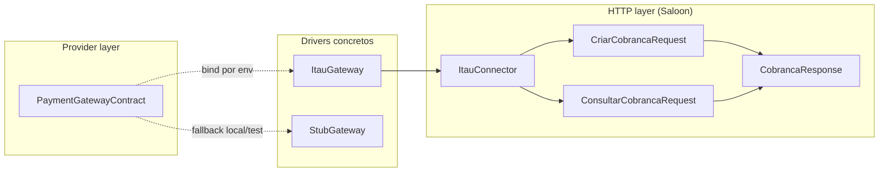
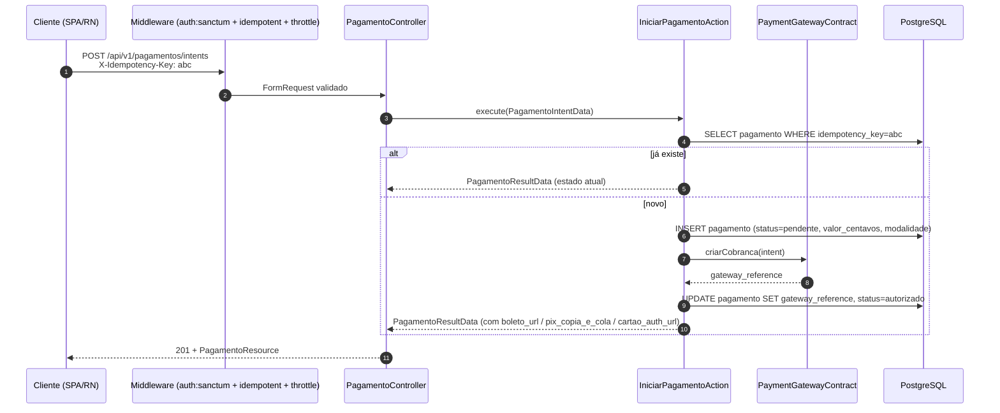
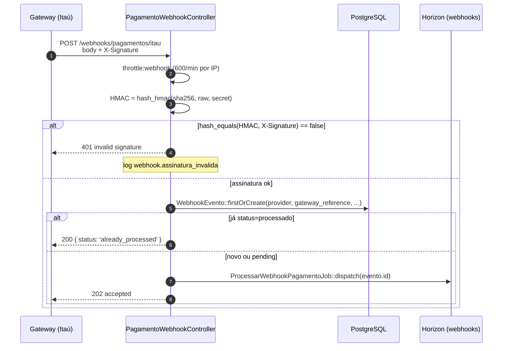
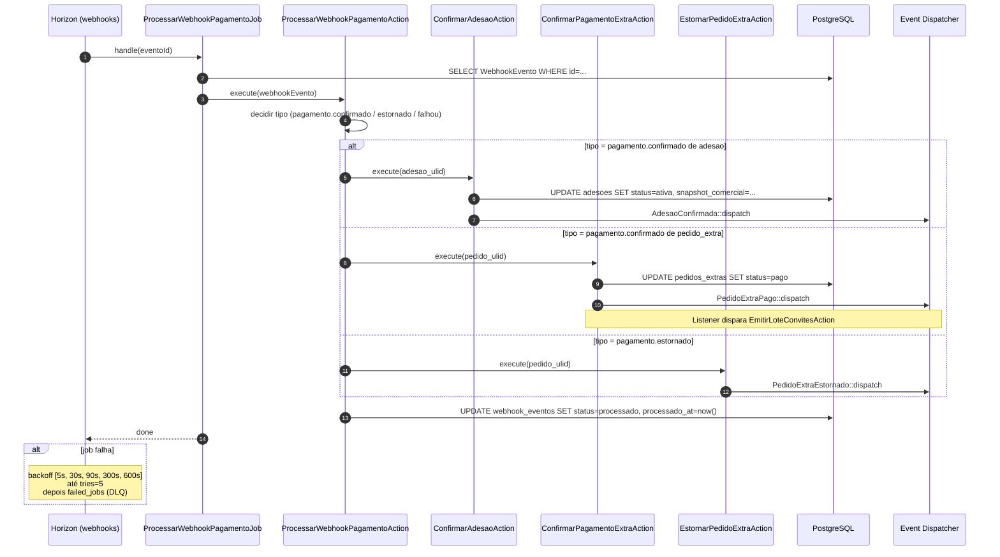
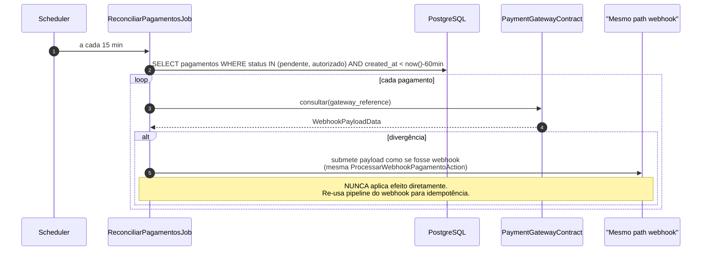

# Technical Design — Pagamentos

**Status:** Accepted | **Data:** 2026-04-18 | **Contexto:** Cobrança, webhooks e reconciliação com Itaú (e outros) | **Tags:** pagamentos, saloon, webhook, idempotencia, driver

> Desenho técnico do bounded context `Pagamentos` (intent + recepção de webhook + processamento assíncrono + reconciliação). Referencia ADR-0013 (webhook HMAC), ADR-0005 (idempotência), ADR-0014 (centavos), ADR-0011 (Horizon) e §5.5, §5.6, §5.7, §8.1–§8.3 do PLANEJAMENTO_BACKEND_APIV1.md.

## 1. Objetivo e invariantes

### 1.1 Objetivo

Permitir que usuários autenticados iniciem uma intenção de pagamento (boleto, PIX, cartão via Itaú no MVP) e que o sistema aplique efeitos do pagamento (confirmação de adesão, confirmação de pedido extra) **no máximo uma vez**, de forma resiliente a replay, timeout e falhas de rede.

### 1.2 Invariantes duras

1. **Nenhum dado de cartão é armazenado** — apenas `gateway_reference` (§0 princípio 10).
2. **Webhook aplica efeito uma única vez** por `(provider, gateway_reference)` — unique composto DB.
3. **Valores monetários em `int` centavos** (ADR-0014) na persistência, DTO e payload de gateway.
4. **Processamento assíncrono** — webhook retorna `202` rapidamente; trabalho pesado é job na fila `webhooks`.
5. **Reconciliação periódica** — `ReconciliarPagamentosJob` a cada 15 min detecta divergências em pagamentos pendentes > 60 min.

## 2. Modelo de domínio

### 2.1 Entidades

- `Pagamento` (transacional): status, provider, gateway_reference, valor_centavos, modalidade.
- `Parcela` (referencia `Pagamento` quando confirmada).
- `WebhookEvento` (append-only): provider, gateway_reference UNIQUE composto, payload JSONB, status, recebido_at, processado_at, tentativas, ultimo_erro.

### 2.2 Enums (ADR-0010)

- `StatusPagamento`: `Pendente | Autorizado | Confirmado | Falhou | Estornado | Cancelado`
- `ModalidadePagamento`: `Boleto | Pix | Cartao`

## 3. Arquitetura — driver pattern

### 3.1 Contract

```php
interface PaymentGatewayContract
{
    public function criarCobranca(PagamentoIntentData $intent): string;       // retorna gateway_reference
    public function consultar(string $gatewayReference): WebhookPayloadData;  // reconciliação
    public function assinaturaValida(string $rawPayload, string $signature): bool;
}
```

### 3.2 Drivers e bind



`GatewayServiceProvider` faz o `bind` dinâmico baseado em `config('gateway.driver')`.

### 3.3 Saloon

- Connector: `ItauConnector(base_url, token)`.
- Requests: `CriarCobrancaRequest(PagamentoIntentData)`, `ConsultarCobrancaRequest($gatewayReference)`.
- Response: `CobrancaResponse` tipado + hidratação em `WebhookPayloadData`.

## 4. Fluxos — Mermaid

### 4.1 Iniciar pagamento (intent)



### 4.2 Recepção de webhook (HMAC + firstOrCreate)



### 4.3 Processamento assíncrono (job)



### 4.4 Reconciliação scheduled



## 5. Segurança (§11.5, §11.6)

- **HMAC obrigatório** antes de qualquer persistência (ADR-0013).
- **Unique composto** `(provider, gateway_reference)` em `webhook_eventos`.
- **Replay protection temporal**: eventos com `recebido_at < now()-24h` descartados.
- **Nunca logar**: raw payload com PII, assinatura completa, gateway_reference em clear.
- **Secret** em vault + rotação auditada.
- **Webhook controller sem CSRF, sem auth:sanctum** — roda em `routes/webhook.php` isolado.

## 6. DTOs

```php
final readonly class PagamentoIntentData {
    public function __construct(
        public int $valorCentavos,             // ADR-0014
        public ModalidadePagamento $modalidade,
        public string $referencia,             // adesao_ulid | pedido_extra_ulid
        public string $atorUlid,
        public ?string $vencimento = null,
        public ?array $metadata = null,
    ) {}
}

final readonly class WebhookPayloadData {
    public function __construct(
        public string $gatewayReference,
        public string $eventoTipo,
        public int $valorCentavos,
        public string $statusGateway,
        public array $raw,
    ) {}
}
```

## 7. Observabilidade (§12)

- **Logs estruturados**: `webhook.recebido`, `webhook.assinatura_invalida`, `webhook.processado`, `webhook.falhou`.
- **Pulse**: dashboard de slow jobs em `webhooks`, taxa de falha por provider.
- **Alertas**:
    - `> 10 falhas de webhook em 5 min no mesmo provider` → Slack + Sentry.
    - `pending em webhooks > 20 por 2 min` → pager.
- **Tracing**: `correlation_id` propagado do intent até o webhook + job.

## 8. Testes críticos (§10.4)

1. **Webhook idempotente**: mesmo `gateway_reference` 10× → efeito aplicado 1×.
2. **Assinatura inválida**: retorna 401 e **não** persiste `WebhookEvento`.
3. **Processamento em job**: pedido extra pago 1× emite convites derivados em ≤ 30s (§F6 aceite).
4. **Reconciliação**: divergência injeta via pipeline do webhook, sem duplicar efeito.
5. **Retry exponencial**: job falha 4×, sucede no 5×, efeito aplicado 1×.

## 9. Rotas (resumo §2.2)

| Método | Rota                                  | Auth           | Idempotent |
| ------ | ------------------------------------- | -------------- | ---------- |
| POST   | `/api/v1/pagamentos/intents`          | sanctum        | sim        |
| GET    | `/api/v1/pagamentos/{pagamento:ulid}` | sanctum        | n/a        |
| POST   | `/webhooks/pagamentos/{provider}`     | HMAC signature | DB unique  |

## 10. Ligações

- ADR-0005, ADR-0011, ADR-0013, ADR-0014
- PLANEJAMENTO_BACKEND_APIV1.md §4.5, §4.6, §5.5, §5.6, §5.7, §7.3, §8.1, §8.2, §8.3, §10.4, §11.5, §11.6
- SAD arc42 seções "Integrações externas — Gateway" e "Runtime — Webhooks"
- technical-design-extras.md (consumidor: pedido extra pago → emite convites)
