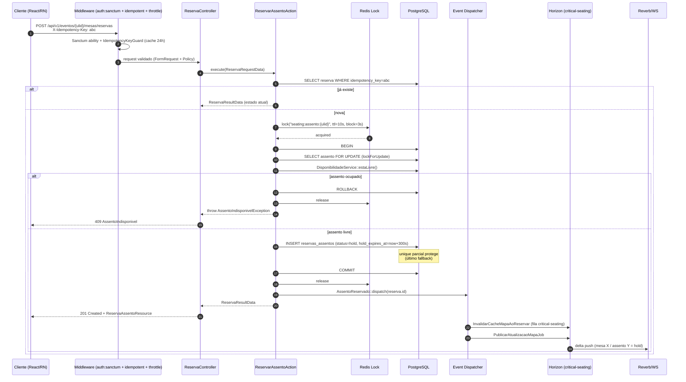
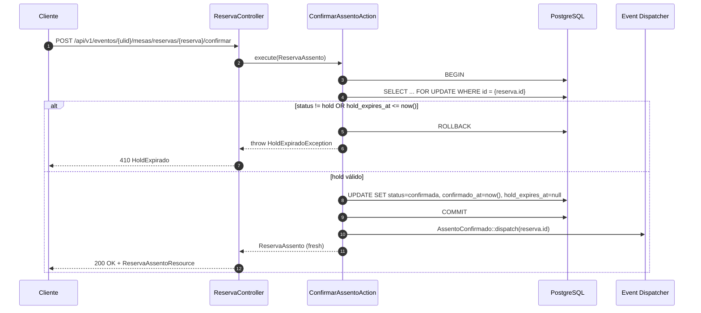
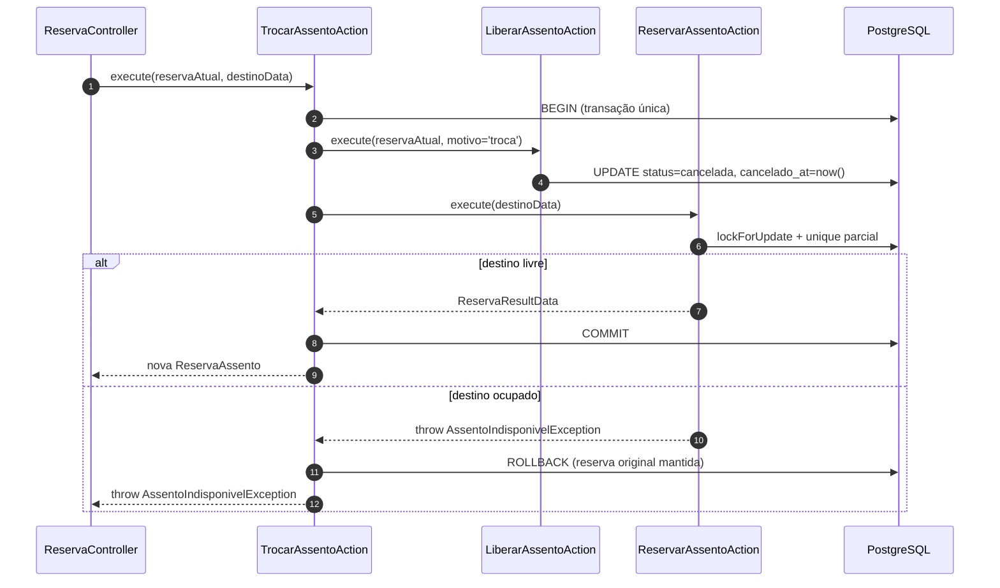
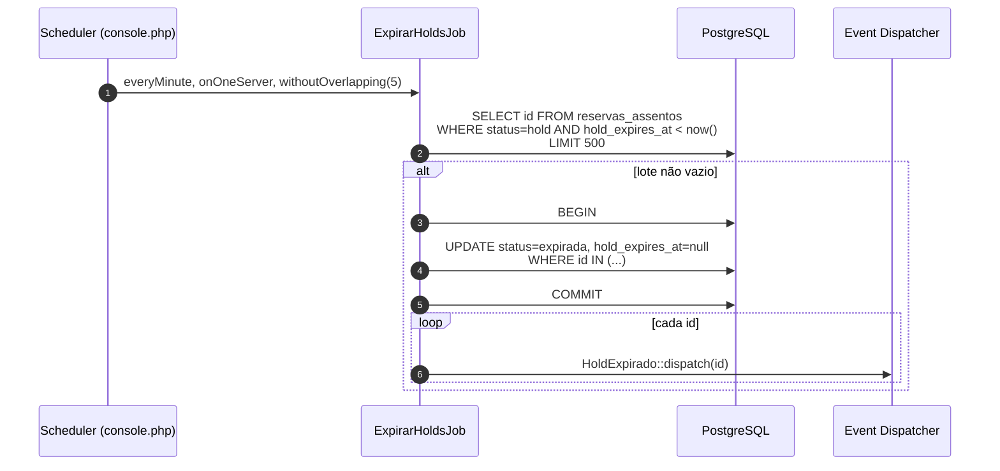
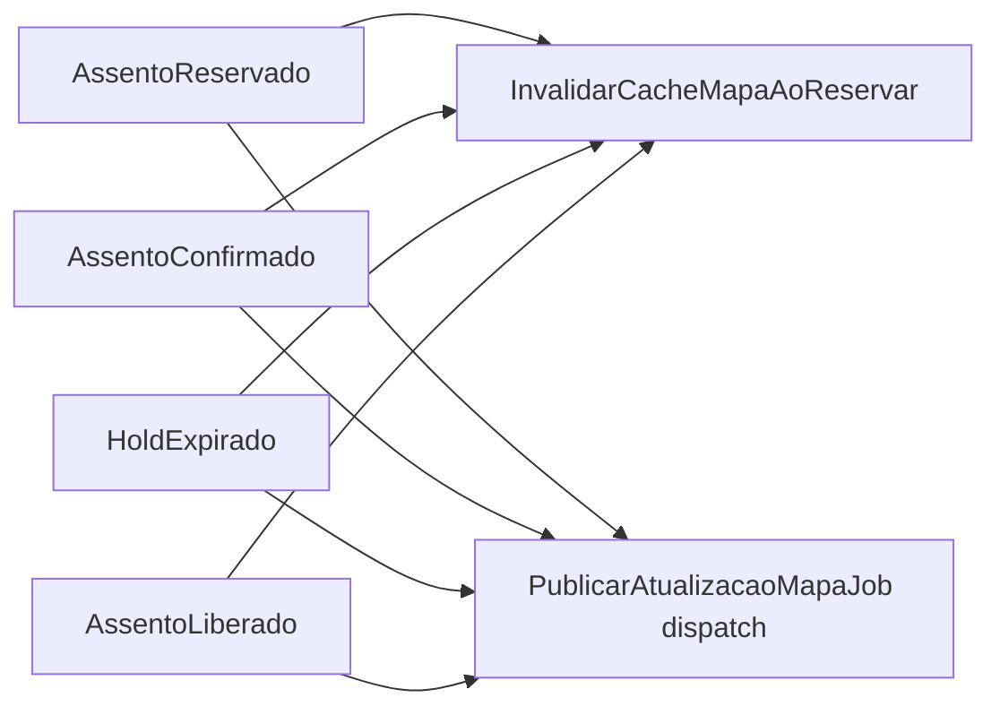
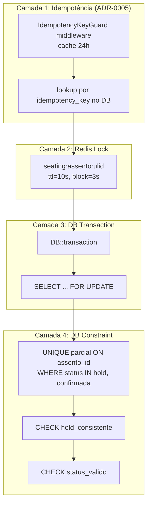

# Technical Design — Seating

**Status:** Accepted | **Data:** 2026-04-18 | **Contexto:** Reserva de assentos em eventos de formatura | **Tags:** seating, concorrencia, redis, postgres, horizon

> Desenho técnico detalhado do bounded context `Seating`. Referencia ADR-0006 (concorrência), ADR-0005 (idempotência), ADR-0011 (Horizon/Redis), ADR-0010 (enums) e §3.5, §4.3, §5.1–§5.4 do PLANEJAMENTO_BACKEND_APIV1.md.

## 1. Objetivo e invariantes

### 1.1 Objetivo

Permitir que formandos e comissão reservem assentos em um mapa de mesas de forma: (i) atômica, (ii) idempotente, (iii) rastreável, (iv) resiliente a picos de concorrência (1.000 tentativas simultâneas no mesmo assento) — mantendo P95 ≤ 700 ms e 0% de conflito.

### 1.2 Invariantes duras

1. **Um assento tem, no máximo, UMA reserva ativa (`hold` ou `confirmada`)**.
   Implementação: unique index parcial Postgres (§4.3).
2. **Um `hold` expira em 300 s (default)**; após isso, `ExpirarHoldsJob` marca `status = expirada` e libera o assento.
3. **Confirmação só é válida se `status = hold` E `hold_expires_at > now()`**.
4. **Troca de assento = liberar antigo + reservar novo**, na ordem fixa `assento_id ASC` (anti-deadlock).
5. **Reserva cancelada/expirada é append-only** — não se reutiliza linha, cria-se nova reserva.

## 2. Modelo de domínio

### 2.1 Entidades

- `MapaMesa` (evento → 1 mapa no MVP): agrupa Setores/Mesas/Assentos.
- `Setor` (nome, cor, capacidade máxima).
- `Mesa` (numero, capacidade, posição).
- `Assento` (numero, disponibilidade calculada via reservas ativas).
- `ReservaAssento` (transacional, imutável após estado final).
- `ReservaHistorico` (append-only, auditoria de transições).

### 2.2 Enums (ADR-0010)

- `StatusReserva`: `Hold | Confirmada | Cancelada | Expirada | Bloqueada`
- `OrigemReserva`: `Formando | Comissao | Admin | Operacao`

### 2.3 Esquema `reservas_assentos` (resumo — detalhes em §4.3 do planejamento)

- `id BIGSERIAL`, `ulid CHAR(26) UNIQUE` (ADR-0004)
- FKs: `evento_id`, `mesa_id`, `assento_id`, `convite_id?`, `formando_id?`
- `status VARCHAR(20)`, `origem VARCHAR(20)`, `idempotency_key VARCHAR(64) UNIQUE`
- `hold_expires_at TIMESTAMPTZ?`, `confirmado_at TIMESTAMPTZ?`, `cancelado_at TIMESTAMPTZ?`
- **Unique parcial**: `ON (assento_id) WHERE status IN ('hold','confirmada')`
- **CHECK** `hold_consistente`: coerência status × timestamps
- **CHECK** `status_valido`: `IN (hold, confirmada, cancelada, expirada, bloqueada)`

## 3. Fluxos — Diagramas Mermaid

### 3.1 Reserva (ReservarAssentoAction)



### 3.2 Confirmação do hold (ConfirmarAssentoAction)



### 3.3 Troca (TrocarAssentoAction) — evita deadlock



### 3.4 Expiração de hold (scheduled)



## 4. Componentes

### 4.1 Actions (`App\Actions\Seating`)

| Action                     | Responsabilidade                                                | DTO entrada                 | Retorno             |
| -------------------------- | --------------------------------------------------------------- | --------------------------- | ------------------- |
| `ReservarAssentoAction`    | Cria hold com idempotência + lock + unique parcial              | `ReservaRequestData`        | `ReservaResultData` |
| `ConfirmarAssentoAction`   | Hold → Confirmada, com validação de expiração                   | `ReservaAssento`            | `ReservaAssento`    |
| `LiberarAssentoAction`     | Hold/Confirmada → Cancelada (usado em troca, cancelamento user) | `ReservaAssento`, `motivo`  | `ReservaAssento`    |
| `ExpirarHoldAssentoAction` | Single-item expire (chamada pelo job em lote)                   | `ReservaAssento`            | `void`              |
| `TrocarAssentoAction`      | Libera atual + reserva destino, transação única                 | `ReservaAssento`, `destino` | `ReservaAssento`    |

### 4.2 Services (`App\Services\Seating`)

- `HoldService`: centraliza TTL, políticas de extensão, config por evento.
- `DisponibilidadeService`: `estaLivre(Assento $a): bool` — consulta unique parcial + reservas ativas. Usada **dentro** da transação de `ReservarAssentoAction` (cache bypass §9.2).

### 4.3 Jobs (`App\Jobs\Seating`)

- `ExpirarHoldsJob` — fila `critical-seating`, `tries=1`, `timeout=30s`, scheduled `everyMinute`.
- `PublicarAtualizacaoMapaJob` — fila `critical-seating`, publica delta do mapa via Reverb/WS.

### 4.4 Events e Listeners



Listener `InvalidarCacheMapaAoReservar` (fila `critical-seating`):

```php
Cache::tags(["evento:{$reserva->evento_id}", 'mapa'])->flush();
```

### 4.5 Exceções tipadas

- `AssentoIndisponivelException` → HTTP 409 `AssentoIndisponivel`
- `HoldExpiradoException` → HTTP 410 `HoldExpirado`

Mapeadas no handler global §2.11.

## 5. Camadas de concorrência (ADR-0006)



Falhas em qualquer camada são tipadas, observáveis e traduzidas em HTTP semanticamente correto.

## 6. Cache strategy (§9.1, §9.4)

| Chave                      | TTL            | Invalida em                                             |
| -------------------------- | -------------- | ------------------------------------------------------- |
| `evento:{id}:mapa:leitura` | 5 min ou event | `AssentoReservado`, `AssentoConfirmado`, `HoldExpirado` |
| `evento:{ulid}:config`     | 30 min         | `EventoAtualizado`                                      |

**Nunca cachear**: disponibilidade de assento dentro da transação de reserva (deve ler DB fresh).

## 7. Rate limiting e policies

- Rate limit `seating: 5/min por usuário` (`RateLimiterServiceProvider`).
- Policy `ReservaAssentoPolicy`:
    - `reservar(PortalUser, Evento)`: janela aberta + `formandos()->where('evento_id', $evento->id)` OU `hasRole('comissao')`.
    - `confirmar(PortalUser, ReservaAssento)`: dono da reserva.
    - `delete(PortalUser, ReservaAssento)`: dono da reserva.

## 8. Observabilidade

- **Log estruturado** por `ReservarAssentoAction`: `seating.reserva.indisponivel` em conflito (`assento_ulid`, `idempotency_key`, `actor_id`).
- **Métricas Pulse**: slow jobs em `critical-seating`, exceptions `AssentoIndisponivel` por minuto.
- **Alertas**:
    - `> 20 AssentoIndisponivelException/min` → Slack.
    - `critical-seating pending > 50` por 2 min → Slack + pager.
- **Correlation ID**: propagado pelo middleware `AttachRequestId`; coluna `correlation_id` em `reservas_assentos` (§12.4).

## 9. Testes exigidos (§10.1, §10.2, §10.3)

1. **Feature** — idempotência da reserva (mesma key devolve mesmo resultado).
2. **Feature** — conflito tipado (`AssentoIndisponivelException`).
3. **Concorrência** (Pest `--parallel` ou `pcntl_fork`) — 1 vitória em N simultâneas, com validação por unique parcial.
4. **Feature** — confirmação após `hold_expires_at` lança `HoldExpiradoException`.
5. **Feature** — troca atômica: destino ocupado → reserva original permanece.
6. **Feature** — `ExpirarHoldsJob` não expira hold ainda válido.
7. **Arch** — `ReservarAssentoAction` não importa `Illuminate\Http\*`.
8. **Carga** (F5 acceptance): 1.000 tentativas simultâneas → 0 conflito, P95 ≤ 700ms.

## 10. API pública resumida

| Método | Rota                                                          | Efeito            | Status sucesso |
| ------ | ------------------------------------------------------------- | ----------------- | -------------- |
| GET    | `/api/v1/eventos/{evento}/mesas/mapa`                         | Snapshot do mapa  | 200            |
| GET    | `/api/v1/eventos/{evento}/mesas/mapa?since=<iso8601>`         | Delta de reservas | 200            |
| POST   | `/api/v1/eventos/{evento}/mesas/reservas`                     | Criar hold        | 201            |
| POST   | `/api/v1/eventos/{evento}/mesas/reservas/{reserva}/confirmar` | Hold → Confirmada | 200            |
| DELETE | `/api/v1/eventos/{evento}/mesas/reservas/{reserva}`           | Cancelar          | 204            |
| POST   | `/api/v1/eventos/{evento}/mesas/reservas/{reserva}/trocar`    | Troca atômica     | 200            |

Todas autenticadas por `auth:sanctum`, com `idempotent` em POSTs sensíveis, throttle `seating:5/min/user`.

## 11. Ligações

- ADR-0004, ADR-0005, ADR-0006, ADR-0008, ADR-0010, ADR-0011
- PLANEJAMENTO_BACKEND_APIV1.md §3.5, §4.3, §5.1, §5.2, §5.3, §5.4, §7.3, §9, §10.2, §10.3
- SAD arc42 seções "Cenários de runtime — Seating" e "Concorrência"
