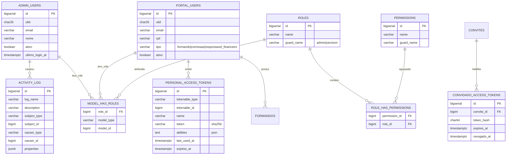
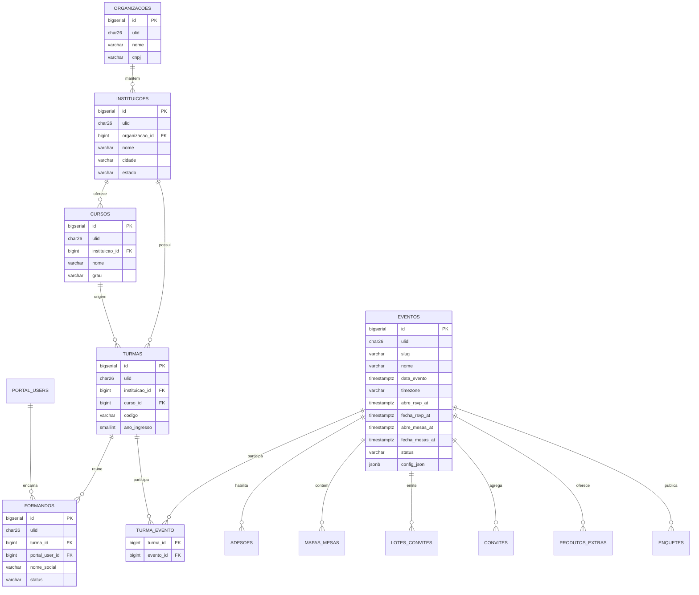
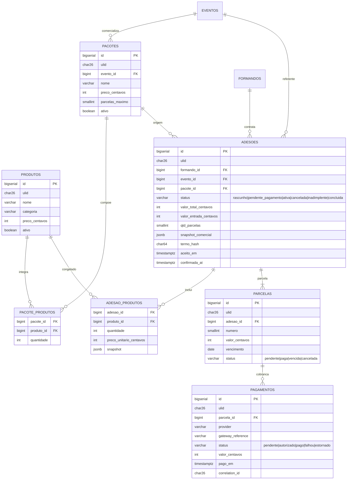
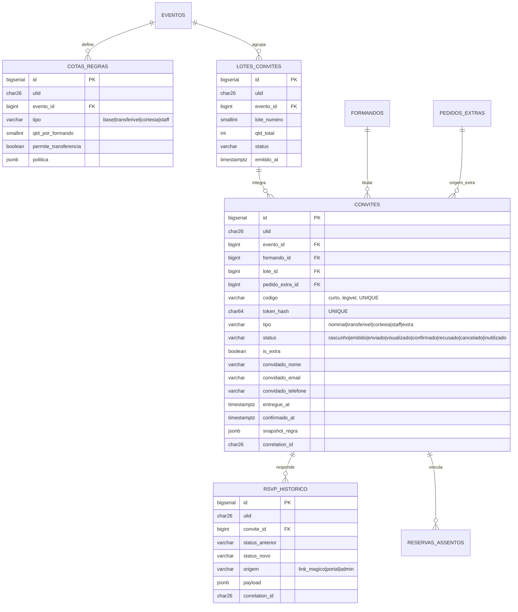
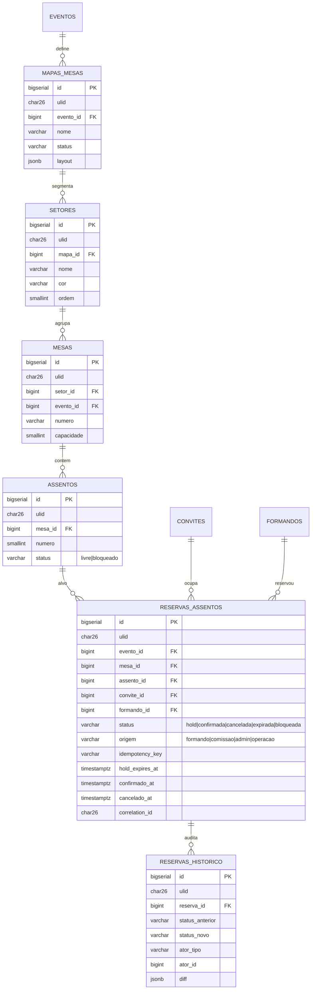
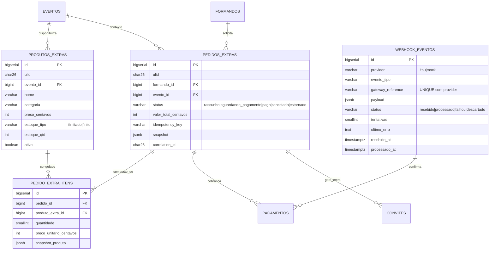
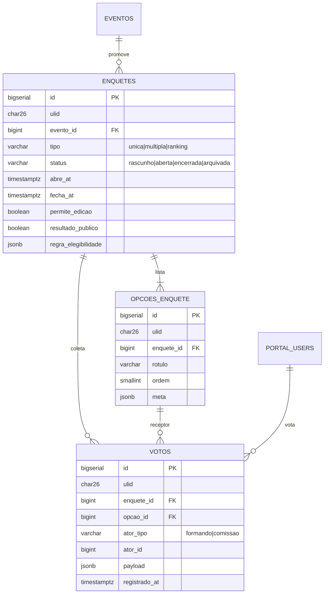
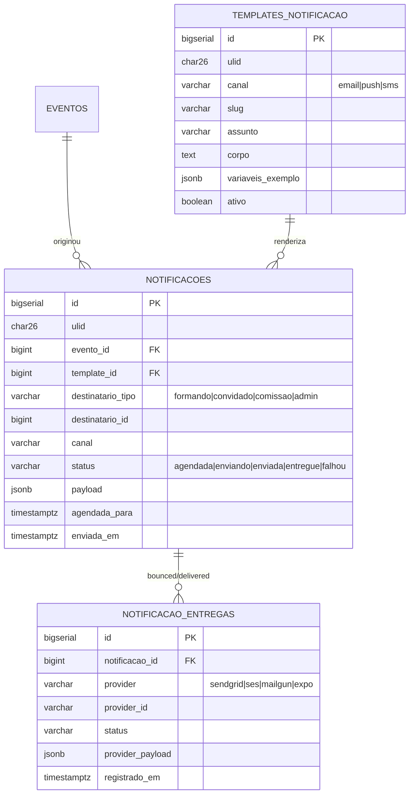
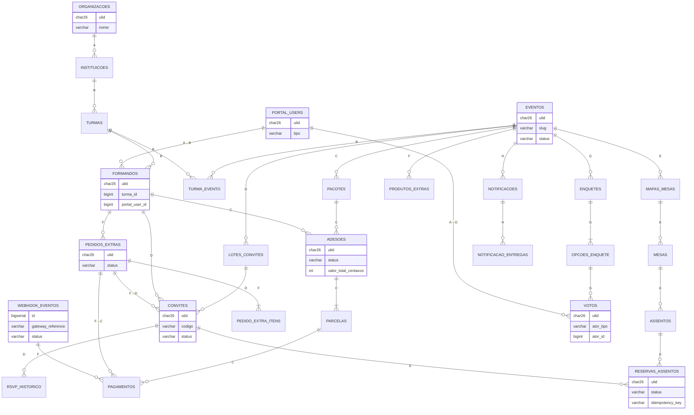

# Diagramas ER — Portal ArtFinal v2

Este documento apresenta o modelo relacional do MVP organizado em **bounded contexts**. Cada diagrama é independente e foca nas entidades de um contexto, suas cardinalidades e atributos-chave. A visão consolidada no final mostra as dependências entre contextos.

> Fonte de verdade das tabelas: `docs/data/data-model.md`.
> Referência de blocos/fases: `docs/prd/PLANEJAMENTO_BACKEND_APIV1.md` §4.2 e Apêndice C.

## Convenções dos diagramas

- Apenas atributos chave aparecem (PK, FKs, enums, campos discriminantes). Consulte `data-model.md` para o schema completo.
- `ulid` está presente em todas as entidades transacionais (omitido abaixo para manter legibilidade).
- `snapshot_*` indica coluna `JSONB` imutável pós-confirmação.
- Cardinalidades seguem notação Chen adaptada do Mermaid `erDiagram`:
    - `||--o{` → 1 para muitos (0..N)
    - `||--|{` → 1 para muitos (1..N)
    - `}o--||` → muitos para 1 (opcional)
    - `||--||` → 1 para 1

---

## 1. Contexto — Identidade e Acesso (Bloco A)

Usuários, sessões e tokens. Relação com Spatie Permission resolvida pelo `guard_name`.

**Notas.**

- `portal_users.tipo` é o primeiro filtro de papel. `roles` do Spatie refinam permissões granulares.
- `personal_access_tokens.tokenable` é polimórfico (aponta para `portal_users` ou `admin_users`).
- `convidado_access_tokens` só existe se o convite for exibido em clientes externos (SPA ou mobile autenticando por token mágico); caso contrário o hash vive em `convites.token_hash`.

---

## 2. Contexto — Cadastro Estrutural (Bloco B)

Hierarquia organizacional. `evento` é a entidade raiz de tudo que é operacional.

**Notas.**

- `eventos.status` é uma máquina de estados (`rascunho` → `publicado` → `encerrado`).
- `eventos.config_json` acumula overrides operacionais (ex.: TTL de hold, política de cancelamento).
- `turma_evento` é N:N — uma turma pode participar de múltiplos eventos (colação + baile), e um evento pode receber várias turmas.
- `formandos` é a ligação "individual × evento/turma"; um `portal_user` pode ter múltiplos formandos (uma pessoa em diferentes turmas ao longo da carreira).

---

## 3. Contexto — Comercial e Adesão (Bloco C)

Produtos, pacotes e adesões. Snapshot `JSONB` congela dados comerciais.

**Notas.**

- `adesoes.snapshot_comercial` contém preço, desconto, termos aceitos e composição do pacote **no momento da confirmação** — nunca consultado por `WHERE`.
- `UNIQUE` parcial em `adesoes (formando_id, evento_id) WHERE status IN ('pendente_pagamento','ativa')` garante adesão ativa única.
- `pagamentos.gateway_reference` é a referência externa do provedor (Itaú, mock); combinada com `provider` forma a unicidade em `webhook_eventos`.

---

## 4. Contexto — Convites e RSVP (Bloco D)

Emissão, entrega e resposta dos convites.

**Notas.**

- `convites.token_hash` é `sha256(token_bruto)`; o token bruto nunca é persistido.
- `convites.snapshot_regra` preserva a regra de cota/política vigente na emissão — usada em auditoria e em exibição do convite.
- `rsvp_historico` é append-only: cada mudança de status cria uma linha nova.

---

## 5. Contexto — Seating (Bloco E)

Mapa, mesas, assentos e reservas com controle de concorrência.

**Notas.**

- `UNIQUE` parcial `reservas_assentos_ativa_por_assento ON (assento_id) WHERE status IN ('hold','confirmada')` impede qualquer cenário de duplicidade.
- `CHECK` `reservas_assentos_hold_consistente` garante coerência entre `status` e campos temporais.
- `reservas_assentos.idempotency_key` é `UNIQUE` — serve como segunda camada da garantia de idempotência (primeira é o middleware `IdempotencyKeyGuard`).

---

## 6. Contexto — Extras e Pagamentos Operacionais (Bloco F)

Catálogo de produtos extras comprados fora do pacote e webhook de gateway.

**Notas.**

- `pedidos_extras.idempotency_key` é único por formando+evento.
- `webhook_eventos.(provider, gateway_reference)` UNIQUE garante idempotência dura.
- Quando `pedido_extra.status = 'pago'`, `ConfirmarPagamentoExtraAction` dispara `EmitirLoteConvitesAction` internamente — por isso `pedidos_extras ||--o{ convites` (origem_extra).

---

## 7. Contexto — Engajamento (Bloco G)

Enquetes, opções e votos.

**Notas.**

- `UNIQUE (enquete_id, ator_tipo, ator_id)` quando `permite_edicao = false`.
- Quando `permite_edicao = true`, o unique é omitido e faz-se `upsert` por (enquete_id, ator_tipo, ator_id, opcao_id).
- `regra_elegibilidade` descreve de forma declarativa quem pode votar (ex.: `"rsvp_confirmado": true, "perfil_min": "formando"`).

---

## 8. Contexto — Comunicação (Bloco H)

Templates, notificações agendadas/enviadas e log de entregas.

**Notas.**

- Notificação é idempotente por `(evento_id, destinatario_tipo, destinatario_id, template_id, chave_dedup)` — chave opcional evitando reenvios.
- `notificacao_entregas` é o log append-only de callbacks do provedor de envio (bounce, open, click).

---

## 9. Visão Consolidada — todos os contextos

Dependências entre contextos. Entidades representativas apenas; nem todos os atributos aparecem.

**Legenda das anotações (letra = bloco/fase):**

- A: Identidade e Acesso (F1)
- B: Cadastro Estrutural (F1/F2)
- C: Comercial e Adesão (F2)
- D: Convites e RSVP (F4)
- E: Seating (F5)
- F: Extras e Pagamentos Operacionais (F6)
- G: Engajamento (F6)
- H: Comunicação (F4/F6)

---

## 10. Linhas de dependência forte (resumo textual)

Complementa os diagramas. Útil para guiar a ordem de criação de migrations (ver `migrations-plan.md`).

| Dependência                                                                  | Tipo                                           | Observação                                                           |
| ---------------------------------------------------------------------------- | ---------------------------------------------- | -------------------------------------------------------------------- |
| `instituicoes.organizacao_id` → `organizacoes.id`                            | FK RESTRICT                                    | Topo da hierarquia.                                                  |
| `turmas.instituicao_id` → `instituicoes.id`                                  | FK RESTRICT                                    |                                                                      |
| `turmas.curso_id` → `cursos.id`                                              | FK RESTRICT                                    |                                                                      |
| `formandos.turma_id` → `turmas.id`                                           | FK RESTRICT                                    |                                                                      |
| `formandos.portal_user_id` → `portal_users.id`                               | FK RESTRICT                                    | 1 PortalUser pode ter muitos Formando (um por turma/evento).         |
| `eventos` não possui FK obrigatória; conecta-se a turmas via `turma_evento`. | —                                              | Permite eventos "inter-turmas" sem ambiguidade.                      |
| `adesoes.formando_id` + `adesoes.evento_id`                                  | FK RESTRICT                                    | UNIQUE parcial ativo.                                                |
| `convites.formando_id`                                                       | FK RESTRICT                                    | Todo convite tem titular formando (mesmo cortesia/staff).            |
| `reservas_assentos.assento_id`                                               | FK RESTRICT                                    | UNIQUE parcial ativo.                                                |
| `pedidos_extras.formando_id`                                                 | FK RESTRICT                                    |                                                                      |
| `pagamentos.parcela_id`                                                      | FK nullable (NULL se cobrança de pedido extra) | Pagamento polimórfico não — separa `parcela_id` e `pedido_extra_id`. |
| `webhook_eventos.(provider, gateway_reference)`                              | UNIQUE                                         | Idempotência dura.                                                   |
| `votos.(enquete_id, ator_tipo, ator_id)`                                     | UNIQUE (condicional)                           | Só quando enquete `permite_edicao = false`.                          |
| `notificacoes` → `templates_notificacao`                                     | FK RESTRICT                                    |                                                                      |

---

## 11. Anti-padrões explicitamente evitados

- Nenhum relacionamento **polimórfico de domínio** (evitamos `morphTo` em entidades financeiras). Pagamento separa `parcela_id` de `pedido_extra_id` por duas colunas FK mutuamente exclusivas.
- Nenhuma cardinalidade N:N "crua" — sempre via tabela pivô nomeada (`turma_evento`, `pacote_produtos`, `adesao_produtos`, `pedido_extra_itens`).
- Nenhuma FK `ON DELETE CASCADE` em entidades transacionais — sempre `RESTRICT` para forçar desativação explícita via estado.

> Consolide sempre com `data-model.md`. Divergência entre este diagrama e o schema real é **bug**; a migration é a autoridade.
