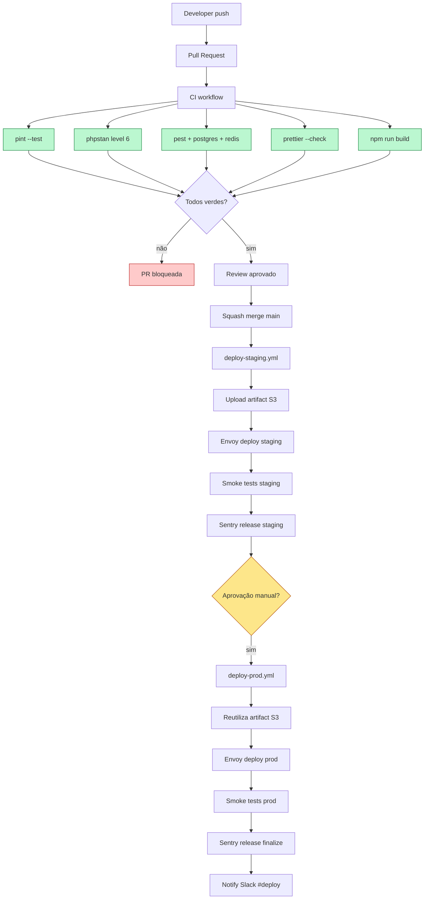
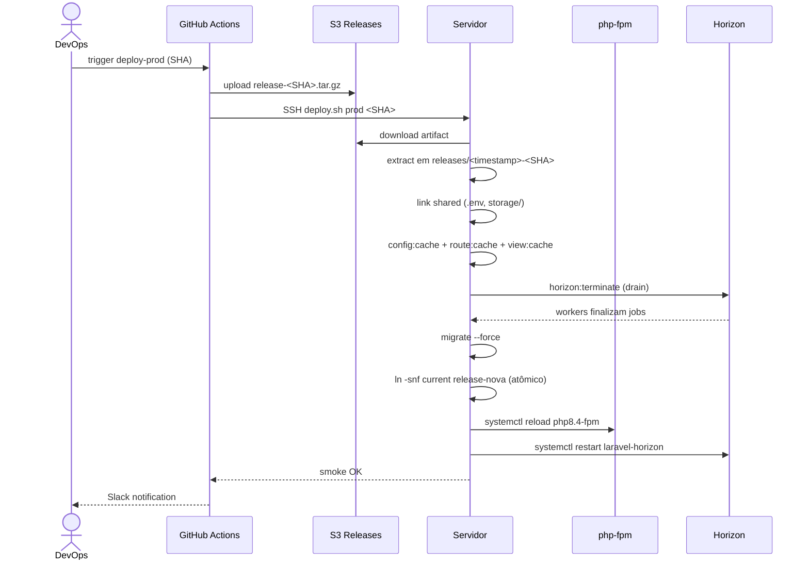

# CI/CD

Este documento define o pipeline de Integração Contínua e Entrega Contínua do projeto. Cobre workflows do GitHub Actions, secrets, ambientes, estratégia de deploy zero-downtime, rollback e diagrama do pipeline.

Base normativa:

- [`conventions.md`](conventions.md)
- [`runbook-deploy.md`](runbook-deploy.md)

---

## Sumário

1. Visão geral do pipeline
2. Ambientes
3. Workflows GitHub Actions
4. Secrets necessários
5. Deploy zero-downtime
6. Rollback
7. Diagrama do pipeline
8. Branch protection

---

## 1. Visão geral do pipeline

O pipeline tem **3 workflows principais** em `.github/workflows/`:

| Workflow             | Trigger                                  | Destino         |
| -------------------- | ---------------------------------------- | --------------- |
| `ci.yml`             | `pull_request` em qualquer branch        | Validação de PR |
| `deploy-staging.yml` | `push` em `main` (após merge)            | Staging         |
| `deploy-prod.yml`    | `workflow_dispatch` manual (ou tag `v*`) | Produção        |

Toda PR passa por CI antes de poder ser mergeada (branch protection força status checks). Após merge em `main`, o deploy para staging é automático. Deploy para produção é manual com aprovação obrigatória.

---

## 2. Ambientes

### 2.1 Matriz de ambientes

| Ambiente  | Domínio                          | Região    | Réplica DB    | Horizon        | Sentry |
| --------- | -------------------------------- | --------- | ------------- | -------------- | ------ |
| `local`   | `https://gdf-erp.ddev.site`      | —         | —             | DDEV           | —      |
| `staging` | `https://staging.exemplo.com.br` | us-east-1 | 1 leitor      | 1 supervisor   | Ativo  |
| `prod`    | `https://exemplo.com.br`         | us-east-1 | 1 leitor + DR | 4 supervisores | Ativo  |

### 2.2 Diferenças de config por ambiente

| Config                  | local   | staging         | prod            |
| ----------------------- | ------- | --------------- | --------------- |
| `APP_ENV`               | `local` | `staging`       | `production`    |
| `APP_DEBUG`             | `true`  | `false`         | `false`         |
| `LOG_LEVEL`             | `debug` | `info`          | `warning`       |
| `preventLazyLoading`    | `true`  | `true`          | `false`         |
| `SESSION_SECURE_COOKIE` | `false` | `true`          | `true`          |
| Horizon `maxProcesses`  | 3       | 6               | 20              |
| Sentry sample rate      | 0       | 100% / 20% perf | 100% / 10% perf |

### 2.3 Disaster Recovery

DR opcional para prod: réplica cross-AZ (us-east-1b) com failover manual. RTO 30min, RPO 5min.

---

## 3. Workflows GitHub Actions

### 3.1 `.github/workflows/ci.yml`

Roda em toda abertura/atualização de PR. Jobs paralelos para reduzir tempo de feedback.

```yaml
name: CI

on:
    pull_request:
        branches: [main]
    push:
        branches: [main]

concurrency:
    group: ci-${{ github.ref }}
    cancel-in-progress: true

jobs:
    pint:
        name: Lint PHP (Pint)
        runs-on: ubuntu-latest
        steps:
            - uses: actions/checkout@v4
            - uses: shivammathur/setup-php@v2
              with:
                  php-version: '8.4'
                  tools: composer:v2
                  coverage: none
            - name: Cache Composer
              uses: actions/cache@v4
              with:
                  path: vendor
                  key: composer-${{ hashFiles('composer.lock') }}
            - name: Install deps
              run: composer install --prefer-dist --no-progress --no-interaction
            - name: Run Pint
              run: vendor/bin/pint --test --format agent

    phpstan:
        name: Static analysis (PHPStan)
        runs-on: ubuntu-latest
        steps:
            - uses: actions/checkout@v4
            - uses: shivammathur/setup-php@v2
              with:
                  php-version: '8.4'
                  tools: composer:v2
            - name: Install deps
              run: composer install --prefer-dist --no-progress --no-interaction
            - name: Run PHPStan
              run: vendor/bin/phpstan analyse --memory-limit=1G --no-progress

    pest:
        name: Tests (Pest)
        runs-on: ubuntu-latest
        services:
            postgres:
                image: postgres:16
                env:
                    POSTGRES_USER: app
                    POSTGRES_PASSWORD: secret
                    POSTGRES_DB: app_test
                ports: ['5432:5432']
                options: >-
                    --health-cmd pg_isready
                    --health-interval 10s
                    --health-timeout 5s
                    --health-retries 5
            redis:
                image: redis:7-alpine
                ports: ['6379:6379']
                options: >-
                    --health-cmd "redis-cli ping"
                    --health-interval 10s
                    --health-retries 5
        steps:
            - uses: actions/checkout@v4
            - uses: shivammathur/setup-php@v2
              with:
                  php-version: '8.4'
                  extensions: pcntl, pdo_pgsql, redis
                  tools: composer:v2
                  coverage: pcov
            - name: Install deps
              run: composer install --prefer-dist --no-progress --no-interaction
            - name: Copy .env.testing
              run: cp .env.testing.example .env.testing
            - name: Generate key
              run: php artisan key:generate --env=testing
            - name: Run migrations
              run: php artisan migrate --env=testing --force
            - name: Run tests
              run: php artisan test --compact --parallel --processes=4

    prettier:
        name: Prettier check
        runs-on: ubuntu-latest
        steps:
            - uses: actions/checkout@v4
            - uses: actions/setup-node@v4
              with:
                  node-version: '20'
                  cache: 'npm'
            - run: npm ci
            - run: npx prettier --check resources/

    build:
        name: Build (Vite)
        runs-on: ubuntu-latest
        steps:
            - uses: actions/checkout@v4
            - uses: actions/setup-node@v4
              with:
                  node-version: '20'
                  cache: 'npm'
            - run: npm ci
            - run: npm run build
            - uses: actions/upload-artifact@v4
              with:
                  name: build-assets
                  path: public/build/
                  retention-days: 7
```

### 3.2 `.github/workflows/deploy-staging.yml`

```yaml
name: Deploy Staging

on:
    push:
        branches: [main]
    workflow_dispatch:

concurrency:
    group: deploy-staging
    cancel-in-progress: false

jobs:
    deploy:
        name: Deploy to staging
        runs-on: ubuntu-latest
        environment: staging
        steps:
            - uses: actions/checkout@v4

            - uses: shivammathur/setup-php@v2
              with:
                  php-version: '8.4'
                  tools: composer:v2

            - uses: actions/setup-node@v4
              with:
                  node-version: '20'
                  cache: 'npm'

            - name: Install PHP deps (prod)
              run: composer install --prefer-dist --no-dev --optimize-autoloader --no-progress

            - name: Install Node deps
              run: npm ci

            - name: Build assets
              run: npm run build

            - name: Package release artifact
              run: |
                  tar --exclude='.git' --exclude='node_modules' --exclude='tests' \
                      -czf release-${{ github.sha }}.tar.gz .

            - name: Upload to S3
              run: |
                  aws s3 cp release-${{ github.sha }}.tar.gz \
                      s3://${{ secrets.AWS_RELEASES_BUCKET }}/staging/
              env:
                  AWS_ACCESS_KEY_ID: ${{ secrets.AWS_ACCESS_KEY_ID }}
                  AWS_SECRET_ACCESS_KEY: ${{ secrets.AWS_SECRET_ACCESS_KEY }}
                  AWS_DEFAULT_REGION: us-east-1

            - name: Deploy via SSH (Envoy)
              uses: appleboy/ssh-action@v1.0.3
              with:
                  host: ${{ secrets.SSH_HOST_STAGING }}
                  username: ${{ secrets.SSH_USER_STAGING }}
                  key: ${{ secrets.SSH_KEY_STAGING }}
                  script: |
                      cd /var/www/app
                      ./deploy.sh staging ${{ github.sha }}

            - name: Smoke test
              run: |
                  set -e
                  curl -fsS https://staging.exemplo.com.br/up

            - name: Notify Slack
              if: always()
              uses: slackapi/slack-github-action@v1
              with:
                  channel-id: ${{ secrets.SLACK_CHANNEL_DEPLOY }}
                  slack-message: 'Staging deploy ${{ github.sha }} — ${{ job.status }}'
              env:
                  SLACK_BOT_TOKEN: ${{ secrets.SLACK_BOT_TOKEN }}

            - name: Notify Sentry release
              run: |
                  curl -sSf https://sentry.io/api/0/organizations/exemplo/releases/ \
                      -H 'Authorization: Bearer ${{ secrets.SENTRY_AUTH_TOKEN }}' \
                      -H 'Content-Type: application/json' \
                      -d '{"version":"${{ github.sha }}","projects":["app"],"refs":[{"repository":"app","commit":"${{ github.sha }}"}]}'
```

### 3.3 `.github/workflows/deploy-prod.yml`

Deploy para produção exige aprovação manual via GitHub Environments (com 1 ou mais reviewers). Segue mesma estrutura do staging com diferenças:

```yaml
name: Deploy Production

on:
    workflow_dispatch:
        inputs:
            release_sha:
                description: 'SHA do commit a deployar (default: main HEAD)'
                required: false
                default: ''

concurrency:
    group: deploy-prod
    cancel-in-progress: false

jobs:
    approval:
        name: Aprovação manual
        runs-on: ubuntu-latest
        environment:
            name: production
            url: https://exemplo.com.br
        steps:
            - run: echo "Aprovado por ${{ github.actor }}"

    deploy:
        name: Deploy to production
        needs: approval
        runs-on: ubuntu-latest
        environment: production
        steps:
            - uses: actions/checkout@v4
              with:
                  ref: ${{ inputs.release_sha || github.sha }}

            - name: Pre-deploy smoke test (staging)
              run: curl -fsS https://staging.exemplo.com.br/up

            - name: Build release (reutiliza artifact staging se existir)
              # ... mesmo bloco do staging ...

            - name: Create Sentry release
              run: |
                  sentry-cli releases new -p app ${{ inputs.release_sha || github.sha }}
                  sentry-cli releases set-commits --auto ${{ inputs.release_sha || github.sha }}
              env:
                  SENTRY_AUTH_TOKEN: ${{ secrets.SENTRY_AUTH_TOKEN }}

            - name: Deploy via SSH (Envoy)
              uses: appleboy/ssh-action@v1.0.3
              with:
                  host: ${{ secrets.SSH_HOST_PROD }}
                  username: ${{ secrets.SSH_USER_PROD }}
                  key: ${{ secrets.SSH_KEY_PROD }}
                  script: |
                      cd /var/www/app
                      ./deploy.sh prod ${{ inputs.release_sha || github.sha }}

            - name: Smoke test prod
              run: |
                  set -e
                  curl -fsS https://exemplo.com.br/up

            - name: Finalize Sentry release
              run: sentry-cli releases finalize ${{ inputs.release_sha || github.sha }}
              env:
                  SENTRY_AUTH_TOKEN: ${{ secrets.SENTRY_AUTH_TOKEN }}

            - name: Notify Slack
              if: always()
              # ... mesmo bloco do staging ...
```

### 3.4 `.github/workflows/scheduled-checks.yml`

```yaml
name: Scheduled checks

on:
    schedule:
        - cron: '0 3 * * 1' # toda segunda 03:00 UTC

jobs:
    composer-audit:
        runs-on: ubuntu-latest
        steps:
            - uses: actions/checkout@v4
            - uses: shivammathur/setup-php@v2
              with:
                  php-version: '8.4'
            - run: composer install --prefer-dist --no-progress
            - run: composer audit --format=json > audit.json
            - name: Alert on vulnerabilities
              run: |
                  if jq '.advisories | length > 0' audit.json | grep -q true; then
                      echo "Vulnerabilidades encontradas"
                      exit 1
                  fi

    npm-audit:
        runs-on: ubuntu-latest
        steps:
            - uses: actions/checkout@v4
            - uses: actions/setup-node@v4
              with: { node-version: '20' }
            - run: npm audit --audit-level=high
```

---

## 4. Secrets necessários

Configurados em **Settings → Secrets and variables → Actions** no GitHub. Divididos em dois ambientes (`staging`, `production`).

### 4.1 Secrets comuns (nível repositório)

| Secret                  | Descrição                                  |
| ----------------------- | ------------------------------------------ |
| `GITHUB_TOKEN`          | (auto — fornecido pelo runner)             |
| `AWS_ACCESS_KEY_ID`     | IAM do usuário `deploy-ci`                 |
| `AWS_SECRET_ACCESS_KEY` | senha do IAM                               |
| `AWS_RELEASES_BUCKET`   | nome do bucket S3 de releases              |
| `SENTRY_AUTH_TOKEN`     | token de org com escopo `project:releases` |
| `SLACK_BOT_TOKEN`       | bot token para postagem em canais          |
| `SLACK_CHANNEL_DEPLOY`  | ID do canal `#deploy-notifications`        |

### 4.2 Secrets por ambiente — staging

| Secret                 | Descrição                                           |
| ---------------------- | --------------------------------------------------- |
| `SSH_HOST_STAGING`     | host do servidor staging                            |
| `SSH_USER_STAGING`     | usuário SSH (`deploy`)                              |
| `SSH_KEY_STAGING`      | chave privada SSH                                   |
| `DATABASE_URL_STAGING` | DSN completo (apenas se usado em migration dry-run) |

### 4.3 Secrets por ambiente — production

| Secret              | Descrição                                |
| ------------------- | ---------------------------------------- |
| `SSH_HOST_PROD`     | host do servidor prod                    |
| `SSH_USER_PROD`     | usuário SSH                              |
| `SSH_KEY_PROD`      | chave privada SSH                        |
| `DATABASE_URL_PROD` | DSN do PostgreSQL (para scripts remotos) |

### 4.4 Política de rotação

- `SSH_KEY_*`: rotacionar a cada 90 dias.
- `AWS_*`: rotacionar a cada 60 dias. Usar IAM Role quando possível (OIDC GitHub).
- `SENTRY_AUTH_TOKEN`: rotacionar a cada 180 dias.
- `SLACK_BOT_TOKEN`: rotacionar quando integração quebrar.

Detalhes em [`security-operations.md §3`](security-operations.md).

### 4.5 Migração recomendada para OIDC (AWS)

Ao invés de `AWS_ACCESS_KEY_ID`/`AWS_SECRET_ACCESS_KEY` de longa duração, usar federação via OIDC:

```yaml
permissions:
    id-token: write
    contents: read

jobs:
    deploy:
        steps:
            - uses: aws-actions/configure-aws-credentials@v4
              with:
                  role-to-assume: arn:aws:iam::123456789:role/github-actions-deploy
                  aws-region: us-east-1
```

---

## 5. Deploy zero-downtime

O script `deploy.sh` no servidor orquestra o deploy atômico. Baseado em Envoy ([`envoy.blade.php`](https://laravel.com/docs/envoy)), com diretórios versionados.

### 5.1 Estrutura de diretórios no servidor

```
/var/www/app/
├── current → releases/20260418-142335/
├── releases/
│   ├── 20260418-120000/
│   ├── 20260418-142335/          ← atual após deploy
│   └── 20260418-150200/          ← novo sendo preparado
├── shared/
│   ├── .env
│   ├── storage/
│   └── bootstrap/cache/
└── deploy.sh
```

### 5.2 Fluxo do `deploy.sh`

```bash
#!/usr/bin/env bash
set -euo pipefail

ENV=$1          # staging | prod
SHA=$2
APP_DIR=/var/www/app
RELEASE_DIR="$APP_DIR/releases/$(date +%Y%m%d-%H%M%S)-$SHA"
SHARED_DIR="$APP_DIR/shared"
ARTIFACT_URL="s3://app-releases/$ENV/release-$SHA.tar.gz"

echo "[1/10] Baixar artefato $SHA"
mkdir -p "$RELEASE_DIR"
aws s3 cp "$ARTIFACT_URL" - | tar -xzf - -C "$RELEASE_DIR"

echo "[2/10] Linkar shared (.env, storage, cache)"
ln -snf "$SHARED_DIR/.env"              "$RELEASE_DIR/.env"
ln -snf "$SHARED_DIR/storage"           "$RELEASE_DIR/storage"
ln -snf "$SHARED_DIR/bootstrap/cache"   "$RELEASE_DIR/bootstrap/cache"

echo "[3/10] Cache config/routes/views"
cd "$RELEASE_DIR"
php artisan config:cache --no-interaction
php artisan route:cache  --no-interaction
php artisan view:cache   --no-interaction
php artisan event:cache  --no-interaction

echo "[4/10] Verificar migrations pendentes"
php artisan migrate:status

echo "[5/10] Modo de manutenção (se migration pesada — configurável)"
# [ "$REQUIRES_MAINTENANCE" = "1" ] && php artisan down --render=errors::503 --retry=60 --secret=bypass-key

echo "[6/10] Drain Horizon supervisors"
php artisan horizon:terminate
# aguarda até workers processarem jobs em andamento (timeout chain = max timeout + 10s)
sleep 70

echo "[7/10] Rodar migrations"
php artisan migrate --force --no-interaction

echo "[8/10] Atomic swap do symlink current"
ln -snf "$RELEASE_DIR" "$APP_DIR/current"

echo "[9/10] Recarregar php-fpm + restart Horizon"
sudo systemctl reload php8.4-fpm
sudo systemctl restart laravel-horizon

echo "[10/10] Saindo de manutenção + smoke"
# [ "$REQUIRES_MAINTENANCE" = "1" ] && php artisan up
curl -fsS "https://${ENV}.exemplo.com.br/up"

echo "Limpar releases antigas (manter 5)"
ls -1dt "$APP_DIR/releases"/*/ | tail -n +6 | xargs -r rm -rf

echo "Deploy $SHA concluído."
```

### 5.3 Ordem garantida

1. **Build fora do servidor** — assets, composer `--no-dev`, tar.gz em CI.
2. **Download + extract** no servidor em pasta nova.
3. **Symlinks shared** — `.env`, `storage/`, `bootstrap/cache/` vêm de pasta persistente.
4. **Cache de config/rotas/views** antes do swap.
5. **Drain Horizon** — dá tempo para jobs em voo terminarem (máx 70s = timeout maior + margem).
6. **Migrations** — `php artisan migrate --force`.
7. **Swap atômico** — `ln -snf` é atômico em filesystems POSIX; o próximo request já atende pela release nova.
8. **Reload php-fpm** — sem interromper requests ativos.
9. **Restart Horizon** — workers novos pegam a base nova.
10. **Smoke test** — `/up`.

### 5.4 Migration online (coluna pesada)

Mudanças destrutivas exigem deploy em **3 passos** descritos em [`runbook-deploy.md §4`](runbook-deploy.md):

1. Deploy A: adicionar coluna nova (nullable + default).
2. Deploy B: backfill em background job.
3. Deploy C: swap de leitura + drop da coluna velha.

---

## 6. Rollback

### 6.1 SLA de decisão

Decisão de rollback deve ocorrer em **≤ 15 minutos** após detecção de regressão crítica. Detalhado em [`runbook-deploy.md §7`](runbook-deploy.md).

### 6.2 Rollback de código

Symlink `current` aponta para a release anterior:

```bash
cd /var/www/app
PREVIOUS=$(ls -1dt releases/*/ | sed -n '2p')
ln -snf "$PREVIOUS" current
sudo systemctl reload php8.4-fpm
sudo systemctl restart laravel-horizon
```

### 6.3 Rollback de migration

Migrations precisam ser **reversíveis** (`down()` funcional). Rollback:

```bash
php artisan migrate:rollback --step=1 --force
```

Se a migration adicionou coluna NOT NULL sem default e a release nova já gravou dados, o rollback deixa inconsistência — por isso exige-se padrão de 3 deploys para mudanças pesadas (§5.4).

### 6.4 Idempotência

Toda release é uma tag imutável. O artefato `.tar.gz` no S3 fica retido por 30 dias. Rollback reusa um artefato antigo — não refaz build.

---

## 7. Diagrama do pipeline

### 7.1 Fluxo completo



### 7.2 Fluxo de deploy zero-downtime



---

## 8. Branch protection

### 8.1 `main`

Configuração no GitHub:

- Require pull request: **✓**
    - Required approvals: **1**
    - Dismiss stale approvals on new push: **✓**
- Require status checks:
    - `ci / pint`
    - `ci / phpstan`
    - `ci / pest`
    - `ci / prettier`
    - `ci / build`
- Require branches to be up to date before merging: **✓**
- Require conversation resolution: **✓**
- Require linear history: **✓**
- Do not allow bypassing: **✓**
- Restrict who can push to matching branches: apenas `maintainers` via PR.

### 8.2 Ambiente `production` (GitHub Environments)

- Required reviewers: **≥ 1** com papel `tech-lead` ou `devops`.
- Deployment branches and tags: apenas `main` ou tags `v*`.
- Wait timer: 0 min (aprovação é síncrona; se houver janela, usa até 30 min).

---

## 9. Métricas do pipeline

| Métrica                     | Meta       | Fonte              |
| --------------------------- | ---------- | ------------------ |
| Tempo de CI (p95)           | ≤ 8 min    | GitHub Actions     |
| Tempo de deploy staging     | ≤ 5 min    | deploy-staging.yml |
| Tempo de deploy prod        | ≤ 8 min    | deploy-prod.yml    |
| Frequência de deploy (prod) | ≥ 3/semana | GitHub releases    |
| Change failure rate         | ≤ 10%      | Sentry + rollbacks |
| MTTR de rollback            | ≤ 15 min   | Incident log       |

---

## 10. Referências

- [`conventions.md`](conventions.md) — padrões de código e commit.
- [`runbook-deploy.md`](runbook-deploy.md) — procedimentos operacionais de deploy.
- [`monitoring-alerts.md`](monitoring-alerts.md) — alertas e dashboards.

---

## 11. Histórico de mudanças

| Versão | Data       | Autor  | Resumo                                |
| ------ | ---------- | ------ | ------------------------------------- |
| 1.0.0  | 2026-04-18 | DevOps | Pipeline inicial — draft para revisão |
