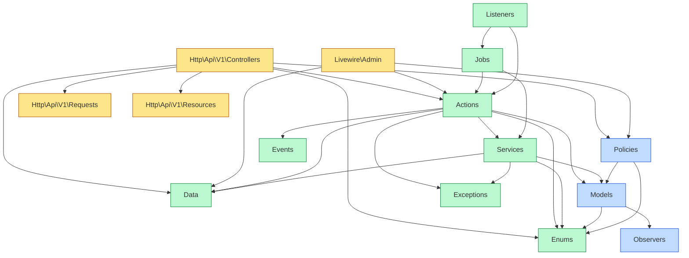

# Padrões de Engenharia — Portal ArtFinal Backend API v1

Este documento é a referência consolidada de padrões técnicos, arquiteturais e de qualidade para o backend API v1. Cobre princípios, estrutura, regras de dependência, convenções de código PHP, naming, commits, branching, code review, formatadores, análise estática, hooks de pré-commit, API-ready e anti-patterns proibidos.

Base normativa:

- [`docs/prd/PLANEJAMENTO_BACKEND_APIV1.md`](../prd/PLANEJAMENTO_BACKEND_APIV1.md) §0, §1, §7.6, Apêndice D
- [`docs/02-CONVENTIONS.md`](../02-CONVENTIONS.md)
- [`docs/devops/dev-setup.md`](dev-setup.md)
- [`CLAUDE.md`](../../CLAUDE.md) §7 e §19

Toda PR que violar um padrão listado aqui deve ser bloqueada em review. Dúvidas devem ser resolvidas em ADR (ver [`docs/adr/`](../adr/)).

---

## Sumário

1. Princípios não negociáveis
2. Estrutura de diretórios e namespaces
3. Regras de dependência
4. PHP — regras de linguagem
5. Naming conventions
6. Convenções Blade, CSS e JS
7. Commits Conventional PT-BR
8. Estratégia de branches
9. Code review — checklist 30+ itens
10. Formatadores — Pint, Prettier, ESLint
11. Análise estática — PHPStan level 6 (Larastan)
12. Pre-commit hooks — Husky + lint-staged
13. API-ready obrigatório
14. Anti-patterns proibidos (10 do Apêndice D)

---

## 1. Princípios não negociáveis

Os 10 princípios abaixo são **invioláveis**. Qualquer PR que os contrarie deve ser rejeitada sem negociação. São a fundação sobre a qual os demais padrões se apoiam.

1. **Monólito modular Laravel 13.** Sem microservices no horizonte MVP. Contextos separados por diretório (`Actions/<Contexto>`, `Models/<Contexto>`), não por deploy.
2. **API-first obrigatória.** `api/v1` é a interface oficial para React web e React Native. O Admin interno em Blade/Livewire **compartilha actions e domínio**, nunca duplica lógica em controllers próprios.
3. **Core independente da camada HTTP.** Toda regra de negócio vive em `Actions/`, `Services/`, `Data/`, `Enums/` e `Models/`. Controllers e Livewire são finos — apenas traduzem HTTP/UI para chamadas de Action.
4. **Idempotência obrigatória** em pagamentos, reservas e webhooks. Toda action mutadora em contextos críticos aceita `idempotency_key` e garante execução única.
5. **Concorrência é first-class concern.** Seating, pagamentos e limites de cota usam unique parcial no banco + Redis lock + idempotency key + transação curta (≤ 200ms).
6. **Snapshots imutáveis** em adesão confirmada, pagamento, convite emitido, reserva confirmada, voto e pedido extra pago. Dados comerciais/regras são _fotografados_ no momento da transição para estado confirmado.
7. **`declare(strict_types=1)` obrigatório** em 100% dos arquivos PHP. Type hints e return types em todos os métodos.
8. **ULID público, BIGINT interno.** IDs sequenciais nunca aparecem em URL, token, response da API ou log estruturado.
9. **Auditoria append-only** via `spatie/laravel-activitylog`. Nunca `DELETE` em `activity_log`.
10. **Nenhum dado de cartão armazenado.** Apenas `gateway_reference` do provedor.

### 1.1 Comentários sobre cada princípio

**Princípio 3 (Core independente) explicado:** um service/action recebe DTO, retorna DTO, lança `DomainException`. Zero conhecimento de `Request`, `Response`, `Redirect`, `View`, `Session`. Isso permite que Livewire admin e Controller API v1 consumam a mesma action sem adapter intermediário.

**Princípio 5 (Concorrência) — padrão canônico:**

```php
DB::transaction(function () use ($payload) {
    $lock = Cache::lock("seating:{$payload->assentoUlid}", 10);
    if (! $lock->get()) {
        throw new AssentoIndisponivelException();
    }

    try {
        // 1. Verificação de disponibilidade dentro da transação
        // 2. Insert com unique parcial — DB é a fonte de verdade
        // 3. Dispatch de eventos apenas após commit (ShouldDispatchAfterCommit)
    } finally {
        $lock->release();
    }
}, attempts: 2);
```

**Princípio 6 (Snapshots):** quando uma adesão transiciona para `ativa`, copiamos para `snapshot_comercial JSONB` o preço, desconto, política, termo e nome comercial do produto vigente. Se o produto muda de preço depois, a adesão antiga **continua válida pelo snapshot**. Veja §13 do planejamento.

---

## 2. Estrutura de diretórios e namespaces

### 2.1 Árvore de alto nível — `app/`

A árvore completa está em [`PLANEJAMENTO_BACKEND_APIV1.md §1.1`](../prd/PLANEJAMENTO_BACKEND_APIV1.md#11-árvore-completa-proposta-app). Resumo:

```text
app/
├── Actions/<Contexto>/*Action.php
├── Data/<Contexto>/*Data.php
├── Enums/<Contexto>/*.php
├── Events/<Contexto>/*.php
├── Exceptions/<Contexto>/*Exception.php
├── Http/
│   ├── Api/V1/{Controllers,Requests,Resources}/<Contexto>/
│   ├── Webhook/Controllers/
│   ├── Web/Admin/Controllers/
│   └── Middleware/
├── Jobs/<Contexto>/*Job.php
├── Listeners/<Contexto>/*.php
├── Models/<Contexto>/*.php
├── Observers/*Observer.php
├── Policies/*Policy.php
├── Providers/*ServiceProvider.php
├── Services/<Contexto>/
├── Support/
└── Livewire/{Admin,Portal}/
```

### 2.2 Contextos (bounded contexts)

Os namespaces por contexto são:

| Contexto      | Conteúdo                                       |
| ------------- | ---------------------------------------------- |
| `Acesso`      | Auth, guards, usuários, tokens de convite      |
| `Cadastro`    | Organização, Instituição, Curso, Turma, Evento |
| `Comercial`   | Pacote, Produto, Adesão, Parcela, Pagamento    |
| `Convites`    | Lote, Convite, RSVP, CotaRegra                 |
| `Seating`     | Mapa, Setor, Mesa, Assento, Reserva            |
| `Extras`      | ProdutoExtra, PedidoExtra, PedidoExtraItem     |
| `Enquetes`    | Enquete, OpcaoEnquete, Voto                    |
| `Pagamentos`  | Gateway, Webhook, Reconciliação                |
| `Comunicacao` | Template, Notificação, Entrega                 |

### 2.3 Pastas vazias com `.gitkeep`

Toda pasta por contexto que ainda não tem conteúdo deve ter um `.gitkeep`. Isso garante que a estrutura permaneça presente no repositório e evita que novos integrantes criem `Actions\Adesao\*` em `app/Actions/` sem o subnamespace.

---

## 3. Regras de dependência

### 3.1 Diagrama allowed-deps



### 3.2 Regras textuais

As regras do planejamento §1.2 são enforced por Pest Architecture Tests:

- `Actions\<Contexto>` pode depender de: `Data\<Contexto>`, `Data\Shared`, `Models\*`, `Services\*`, `Events\*`, `Enums\*`, `Exceptions\*`.
- `Actions\<Contexto>` **não pode** depender de `Http\*`, `Livewire\*`, `Jobs\*`.
- `Jobs\*` depende **apenas** de `Actions\*` e `Services\*`.
- `Http\Api\V1\Controllers\*` depende apenas de: `Actions\*`, `Data\*`, `Http\Api\V1\Requests\*`, `Http\Api\V1\Resources\*`, `Policies\*`, `Enums\*`, `Illuminate\Http`, `Illuminate\Routing`.
- `Livewire\Admin\*` segue regras equivalentes a Controllers.
- `Listeners\*` orquestra jobs e delega lógica a `Actions\*`. **Nunca contém regra.**
- `Models\*` não importa `Actions\*`. Pode importar `Enums\*` e é observado por `Observers\*`.

### 3.3 Pest Architecture Tests obrigatórios

Ficam em `tests/Feature/Architecture/ArchitectureTest.php`:

```php
test('actions não acoplam HTTP')
    ->expect('App\Actions')
    ->not->toUse([
        'Illuminate\Http\Request',
        'Illuminate\Http\Response',
        'Illuminate\Http\JsonResponse',
    ]);

test('strict types em todo PHP')
    ->expect('App')
    ->toUseStrictTypes();

test('controllers api v1 são finos')
    ->expect('App\Http\Api\V1\Controllers')
    ->toOnlyUse([
        'App\Actions',
        'App\Data',
        'App\Http\Api\V1\Requests',
        'App\Http\Api\V1\Resources',
        'App\Policies',
        'App\Enums',
        'Illuminate\Http',
        'Illuminate\Routing',
    ]);

test('models não importam actions')
    ->expect('App\Models')
    ->not->toUse('App\Actions');

test('jobs não importam Http')
    ->expect('App\Jobs')
    ->not->toUse(['Illuminate\Http\Request', 'Illuminate\Http\Response']);

test('policies no namespace correto')
    ->expect('App\Policies')
    ->toHaveSuffix('Policy');

test('actions possuem execute() público')
    ->expect('App\Actions')
    ->toHaveMethod('execute');

test('data objects são readonly')
    ->expect('App\Data')
    ->toBeReadonly();

test('enums implementam Backed')
    ->expect('App\Enums')
    ->toBeBackedEnum();
```

---

## 4. PHP — regras de linguagem

### 4.1 `declare(strict_types=1)`

Obrigatório em **todo arquivo PHP** — inclusive `config/*.php`, `database/factories/*.php`, `tests/*.php`, `bootstrap/*.php`. Deve ser a primeira linha após a tag de abertura `<?php`.

```php
<?php

declare(strict_types=1);

namespace App\Actions\Seating;

// ...
```

Pint aplica a regra `declare_strict_types` quando configurado (ver §10.1).

### 4.2 Readonly classes

Toda DTO (`App\Data\*`) deve ser `final readonly`. Value objects em `App\Support\*` também.

```php
final readonly class ReservaRequestData
{
    public function __construct(
        public string $assentoUlid,
        public ?string $conviteUlid,
        public OrigemReserva $origem,
        public string $idempotencyKey,
        public int $atorId,
        public string $atorTipo,
    ) {}
}
```

### 4.3 Constructor property promotion

Use em classes cujo único papel é carregar dependências/estado (Actions, Services, DTOs, Requests Saloon). Evite em casos onde a promoção mascara inicialização complexa.

```php
// Bom
final class CriarAdesaoAction
{
    public function __construct(
        private readonly GerarParcelasAction $gerarParcelas,
        private readonly AuditLogger $audit,
    ) {}

    public function execute(NovaAdesaoData $data): AdesaoResultData { /* ... */ }
}
```

### 4.4 Enums backed

Todo campo com valores finitos (status, tipos, origens) é Backed Enum PHP 8.1+. Nunca string solta.

```php
enum StatusReserva: string
{
    case Hold       = 'hold';
    case Confirmada = 'confirmada';
    case Liberada   = 'liberada';
    case Expirada   = 'expirada';

    public function label(): string
    {
        return match ($this) {
            self::Hold       => 'Reserva provisória',
            self::Confirmada => 'Confirmada',
            self::Liberada   => 'Liberada',
            self::Expirada   => 'Expirada',
        };
    }

    public function color(): string
    {
        return match ($this) {
            self::Hold       => 'warning',
            self::Confirmada => 'success',
            self::Liberada   => 'neutral',
            self::Expirada   => 'danger',
        };
    }

    public function isAtivo(): bool
    {
        return in_array($this, [self::Hold, self::Confirmada], strict: true);
    }
}
```

### 4.5 Type hints e return types

Obrigatório em:

- parâmetros de método
- propriedades (inclusive promovidas)
- return type (use `void` explicitamente)
- closures em signatures públicas (use `@param callable(int): bool` no PHPDoc quando necessário)

Proibido:

- parâmetros sem tipo
- retorno implícito em métodos que retornam dado não-`void`
- `mixed` como fallback preguiçoso (use union type específico)

### 4.6 Arrays tipados via PHPDoc

Quando a função recebe/retorna array, documente a shape:

```php
/**
 * @param array<int, string> $ulids
 * @return array{total: int, reservados: int, disponiveis: int}
 */
public function contar(array $ulids): array
{
    // ...
}
```

PHPStan level 6 recusa arrays genéricos sem shape — o objetivo é migrar para DTO readonly sempre que possível.

### 4.7 Exceções customizadas

Nunca lance `\Exception`, `\RuntimeException` ou `\LogicException` de forma genérica. Use hierarquia própria:

```
App\Exceptions\Domain\DomainException (base)
├── App\Exceptions\Domain\InvariantViolationException
├── App\Exceptions\Seating\AssentoIndisponivelException
├── App\Exceptions\Seating\HoldExpiradoException
├── App\Exceptions\Cota\CotaEsgotadaException
└── App\Exceptions\Pagamento\WebhookInvalidoException
```

Cada exceção expõe:

- `public function codigoNegocio(): string` — chave estável para o cliente (`seating.assento_indisponivel`)
- `public function httpStatus(): int` — status padrão quando renderizada pelo handler global
- mensagem em pt-BR para log (não para response — o cliente recebe código + título por §2.11)

---

## 5. Naming conventions

### 5.1 Classes, métodos, funções — inglês técnico

| Tipo        | Padrão                     | Exemplo                               |
| ----------- | -------------------------- | ------------------------------------- |
| Model       | PascalCase singular        | `ReservaAssento`, `PedidoExtra`       |
| Controller  | PascalCase + `Controller`  | `ReservaController`                   |
| Action      | PascalCase + `Action`      | `ReservarAssentoAction`               |
| Service     | PascalCase + `Service`     | `HoldService`, `SignedUrlService`     |
| Job         | PascalCase + `Job`         | `ExpirarHoldsJob`                     |
| Event       | PascalCase (passado)       | `AssentoReservado`, `PagamentoFalhou` |
| Listener    | PascalCase descritivo      | `InvalidarCacheMapaAoReservar`        |
| Observer    | PascalCase + `Observer`    | `ReservaAssentoObserver`              |
| FormRequest | `Store/Update/X + Request` | `ReservarAssentoRequest`              |
| Resource    | PascalCase + `Resource`    | `ReservaResource`                     |
| Policy      | PascalCase + `Policy`      | `ReservaAssentoPolicy`                |
| Enum        | PascalCase                 | `StatusReserva`, `OrigemReserva`      |
| DTO         | PascalCase + `Data`        | `ReservaRequestData`                  |
| Exception   | PascalCase + `Exception`   | `AssentoIndisponivelException`        |

### 5.2 Variáveis de negócio — português

Variáveis, parâmetros e propriedades em contexto de negócio usam **PT-BR**:

```php
// Certo
public function execute(Adesao $adesao, Parcela $parcela, int $valorCentavos): Pagamento

// Errado
public function execute(Membership $membership, Installment $installment, int $valueCents): Payment
```

Isso preserva a ubiquitous language do domínio (contrato, formando, parcela, convite, mesa, assento, formatura, adesão).

### 5.3 Banco de dados

| Elemento | Padrão               | Exemplo                         |
| -------- | -------------------- | ------------------------------- |
| Tabela   | snake_case plural    | `reservas_assentos`, `convites` |
| Coluna   | snake_case           | `hold_expires_at`, `status`     |
| FK       | `<singular>_id`      | `evento_id`, `adesao_id`        |
| Índice   | `idx_<tabela>_<col>` | `idx_reservas_status`           |
| Unique   | `uq_<tabela>_<col>`  | `uq_convites_token_hash`        |

### 5.4 Rotas

| Elemento   | Padrão                          | Exemplo                             |
| ---------- | ------------------------------- | ----------------------------------- |
| Route name | dot notation                    | `api.v1.reservas.confirmar`         |
| URI        | kebab-case                      | `/api/v1/reservas/{ulid}/confirmar` |
| Param      | `{ulid}` para recursos públicos | — nunca `{id}` numérico             |

### 5.5 Blade

| Elemento  | Padrão     | Exemplo                      |
| --------- | ---------- | ---------------------------- |
| View      | kebab-case | `reservar-assento.blade.php` |
| Component | kebab-case | `<x-admin.kpi-card>`         |

---

## 6. Convenções Blade, CSS e JS

### 6.1 Namespaces de componentes

```
resources/views/components/
├── admin/      ← x-admin.* — exclusivos do admin (Inspinia)
├── portal/     ← x-portal.* — exclusivos do portal (React mobile-first)
└── shared/     ← x-shared.* — compartilhados
```

Antes de escrever HTML em qualquer view do admin, siga o fluxo obrigatório documentado em [`CLAUDE.md §11`](../../CLAUDE.md#11-componentes-blade).

### 6.2 Tailwind CSS 4

- Classes utilitárias diretamente no Blade.
- Nunca CSS custom em `<style>` inline.
- Quando um pattern repete 2×, virar componente ou classe composta via `@apply` no `resources/css/admin.css` / `portal.css`.
- `prettier-plugin-tailwindcss` ordena classes automaticamente — não revert.

### 6.3 JavaScript

- Alpine.js para interações visuais locais (toggle, collapse, máscara leve).
- Livewire para qualquer interação que envolva dados do servidor.
- JS custom vai em `resources/js/admin.js` ou `resources/js/portal.js` — dois entry points em `vite.config.js`.
- ESLint + Prettier obrigatórios (ver §10).

---

## 7. Commits Conventional PT-BR

### 7.1 Formato

```
<tipo>(<escopo>): <descrição no imperativo, PT-BR, minúscula>

[corpo opcional — bullets explicando o porquê]

[rodapé: referência a issue Plane PAF-XX]
```

### 7.2 Tipos permitidos

| Tipo       | Uso                                               |
| ---------- | ------------------------------------------------- |
| `feat`     | Nova funcionalidade                               |
| `fix`      | Correção de bug                                   |
| `refactor` | Mudança interna sem alterar comportamento externo |
| `chore`    | Manutenção (deps, CI, tooling)                    |
| `docs`     | Documentação                                      |
| `test`     | Adição/ajuste de testes                           |
| `perf`     | Melhoria de performance                           |
| `build`    | Build system / assets                             |
| `ci`       | Workflows CI/CD                                   |
| `style`    | Formatação (Pint, Prettier) sem mudança de código |
| `revert`   | Reversão de commit anterior                       |

### 7.3 Escopos válidos

`portal`, `admin`, `api`, `webhook`, `gateway`, `seating`, `convites`, `rsvp`, `extras`, `enquetes`, `pagamentos`, `acesso`, `cadastro`, `infra`, `docs`, `ci`, `devops`.

### 7.4 Regras

- Descrição máxima: **72 caracteres**.
- Imperativo no presente: `adicionar`, `corrigir`, `remover` (não `adicionado`, `adicionei`).
- PT-BR obrigatório.
- Commit com breaking change usa `!`: `feat(api)!: renomear rota de convites`.
- Todo commit relevante referencia issue Plane no rodapé: `Refs: PAF-123`.
- Commit de WIP é proibido em PR aberta — use `git rebase -i` localmente.

### 7.5 Exemplos

```
feat(seating): implementar hold de 5 minutos com unique parcial

- Reserva cria linha em reservas_assentos com status=hold e expiração +5min
- Unique parcial em (assento_id) where status in ('hold','confirmada') garante
  que disputa concorrente resolva-se no banco
- Idempotency key protege retry do cliente
- Feature test cobre 8 requisições simultâneas (apenas 1 vence)

Refs: PAF-214
```

```
fix(webhook): descartar payload duplicado via firstOrCreate

Gateway reenviava ~3% das confirmações; sem proteção, o pedido extra era
marcado como pago duas vezes e convites derivados duplicavam.

Refs: PAF-287
```

```
chore(ci): adicionar workflow de deploy-staging com drain do Horizon

Refs: PAF-92
```

---

## 8. Estratégia de branches

### 8.1 Branches perenes

- `main` — estado do que está em produção. **Protegida**: não aceita push direto, exige PR com 1 review aprovado + CI verde.
- `staging` — estado do que está em homologação (opcional: pode usar apenas `main` + tags).

### 8.2 Branches de trabalho

Nomenclatura `<tipo>/paf-<numero>-<descricao-curta>`:

| Prefixo     | Uso                                |
| ----------- | ---------------------------------- |
| `feature/`  | Nova funcionalidade                |
| `bugfix/`   | Correção de bug                    |
| `hotfix/`   | Urgência em produção               |
| `refactor/` | Refatoração sem novo comportamento |
| `chore/`    | Infra, deps, tooling               |

Exemplos:

- `feature/paf-214-seating-hold-5min`
- `bugfix/paf-287-webhook-duplicado`
- `hotfix/paf-999-pagamento-travado`

### 8.3 Proteções de branch

A branch `main` tem as seguintes regras no GitHub:

- Require a pull request before merging (✓)
- Require approvals: **1**
- Dismiss stale pull request approvals when new commits are pushed (✓)
- Require status checks to pass before merging: `ci / pint`, `ci / phpstan`, `ci / pest`, `ci / prettier`, `ci / eslint`, `ci / build` (todos obrigatórios)
- Require branches to be up to date before merging (✓)
- Require linear history (✓)
- Require conversation resolution before merging (✓)
- Do not allow bypassing the above settings (✓)

### 8.4 Merge strategy

- **Squash and merge** é a estratégia default para PRs de feature/bug/chore — o commit final entra em `main` com a mensagem consolidada da PR (seguindo §7).
- **Merge commit** apenas em casos excepcionais de sincronização entre branches long-lived (ex. `staging` → `main` em release).
- **Rebase and merge** permitido quando a PR tem histórico limpo e atômico que se deseja preservar.

### 8.5 Tags de versão

Formato `vMAJOR.MINOR.PATCH` — SemVer. Exemplos:

- `v1.0.0` — MVP executivo (fim de F5)
- `v1.1.0` — MVP comercial (fim de F6)
- `v1.1.1` — hotfix em produção

---

## 9. Code review — checklist 30+ itens

Toda PR deve ser revisada com este checklist. Os itens marcados com **[BLOQ]** bloqueiam o merge.

### 9.1 Domínio e arquitetura

1. **[BLOQ]** Controller é fino — 5 a 7 linhas por método, sem `DB::`, sem `if` de negócio.
2. **[BLOQ]** Toda regra de negócio está em Action/Service — nunca em Controller, Livewire, Job, Listener.
3. **[BLOQ]** Listener não contém lógica — apenas orquestra dispatch de Action ou Job.
4. **[BLOQ]** Action não importa `Illuminate\Http\*`.
5. **[BLOQ]** DTO readonly usado para transporte entre camadas (nunca array anônimo).
6. Nomes (classes/variáveis) seguem §5.
7. Estrutura de pastas respeita §2 (contexto correto).

### 9.2 Banco de dados

8. **[BLOQ]** Migration é idempotente e reversível (`up` + `down`).
9. **[BLOQ]** Valores monetários em `INTEGER` (centavos) — nunca `FLOAT`/`DECIMAL`.
10. **[BLOQ]** Campo com valores finitos vira Enum — coluna usa `string` + cast para Enum no Model.
11. Índices criados em FKs, campos de filtro, colunas de status.
12. Unique parcial documentado quando disputado por concorrência (ex. seating).
13. Snapshot JSONB presente em tabelas transacionais (`adesoes`, `convites`, `reservas_assentos`, `pedidos_extras`, `pagamentos`).

### 9.3 HTTP e API

14. **[BLOQ]** `FormRequest` valida **toda** entrada. Nunca `$request->all()` em update.
15. **[BLOQ]** `Rule::enum(...)` em campos enumerados.
16. **[BLOQ]** Resource (`JsonResource`) formata **toda** saída de API. Nunca `->toArray()` direto do Model.
17. **[BLOQ]** URI usa `{ulid}` — nunca id sequencial.
18. Policy aplicada em toda action de recurso autenticado.
19. Status codes 200/201/202/204/401/403/404/409/422/429/500 seguem §2.11 do planejamento.

### 9.4 Concorrência

20. **[BLOQ]** Ação mutadora em seating/pagamento/cota tem `idempotency_key`.
21. **[BLOQ]** Webhook valida HMAC antes de persistir.
22. **[BLOQ]** Webhook usa `firstOrCreate(gateway_reference)`.
23. Transação é curta (≤ 200ms) e não chama HTTP externo dentro.
24. Dispatch de eventos pós-commit (`ShouldDispatchAfterCommit`).

### 9.5 Testes

25. **[BLOQ]** PR de feature tem ao menos 1 feature test.
26. **[BLOQ]** Action crítica (seating, pagamento, cota) tem unit test.
27. **[BLOQ]** Concorrência de seating tem teste específico (§10.2/10.3 do planejamento).
28. Factory coberta com states nomeados quando aplicável.
29. Arch tests passam (`tests/Feature/Architecture/`).

### 9.6 Segurança

30. **[BLOQ]** Nenhum dado de cartão em DB, log ou response.
31. **[BLOQ]** Token de convite em log mascarado (`***`).
32. **[BLOQ]** CPF/email mascarado em log quando presente.
33. **[BLOQ]** Upload valida MIME real + tamanho + renomeia server-side.

### 9.7 Qualidade

34. **[BLOQ]** `vendor/bin/pint --dirty --format agent` sem mudanças.
35. **[BLOQ]** `vendor/bin/phpstan analyse` level 6 sem erros.
36. **[BLOQ]** `php artisan test --compact` 100% verde.
37. **[BLOQ]** `npx prettier --check` sem mudanças.
38. **[BLOQ]** `npx eslint resources/js/` sem erros.
39. Commit messages seguem §7.
40. PR tem descrição com contexto + evidência (screenshot, log, teste).

### 9.8 Documentação

41. Módulo documentado em `docs/modules/<contexto>.md` quando aplicável.
42. ADR criada quando há decisão arquitetural não trivial.
43. `CHANGELOG.md` atualizado em PR de release.
44. OpenAPI regenerado via Scramble quando há mudança de contrato API.

---

## 10. Formatadores — Pint, Prettier, ESLint

### 10.1 Laravel Pint (`pint.json`)

Config esperado na raiz do repositório:

```json
{
    "preset": "laravel",
    "rules": {
        "declare_strict_types": true,
        "array_syntax": { "syntax": "short" },
        "binary_operator_spaces": { "default": "single_space" },
        "concat_space": { "spacing": "one" },
        "ordered_imports": { "sort_algorithm": "alpha" },
        "no_unused_imports": true,
        "phpdoc_align": { "align": "left" },
        "trailing_comma_in_multiline": true,
        "method_argument_space": { "on_multiline": "ensure_fully_multiline" }
    }
}
```

Uso:

```bash
# Formata arquivos modificados (rápido, dentro do workspace)
vendor/bin/pint --dirty --format agent

# Formata tudo
vendor/bin/pint --format agent

# Verifica sem modificar (CI)
vendor/bin/pint --test --format agent
```

### 10.2 Prettier (`.prettierrc`)

```json
{
    "printWidth": 120,
    "tabWidth": 4,
    "semi": true,
    "singleQuote": true,
    "trailingComma": "all",
    "bracketSpacing": true,
    "arrowParens": "always",
    "plugins": ["prettier-plugin-blade", "prettier-plugin-tailwindcss"],
    "overrides": [
        {
            "files": ["*.blade.php"],
            "options": {
                "parser": "blade",
                "tabWidth": 4
            }
        },
        {
            "files": ["*.md", "*.yaml", "*.yml", "*.json"],
            "options": { "tabWidth": 2 }
        }
    ],
    "tailwindConfig": "./tailwind.config.js"
}
```

### 10.3 `.prettierignore`

```
storage/
vendor/
node_modules/
public/build/
public/hot
public/vendor/
bootstrap/cache/
*.min.js
*.min.css
laradock/
```

### 10.4 ESLint (`.eslintrc.json`)

```json
{
    "root": true,
    "env": {
        "browser": true,
        "es2024": true,
        "node": true
    },
    "extends": ["eslint:recommended", "prettier"],
    "parserOptions": {
        "ecmaVersion": 2024,
        "sourceType": "module"
    },
    "rules": {
        "no-unused-vars": ["warn", { "argsIgnorePattern": "^_" }],
        "no-console": ["warn", { "allow": ["warn", "error"] }],
        "prefer-const": "error",
        "eqeqeq": ["error", "always"]
    },
    "ignorePatterns": ["public/build/", "public/vendor/", "storage/", "vendor/", "node_modules/"]
}
```

### 10.5 Comando unificado

Adicionar no `package.json`:

```json
{
    "scripts": {
        "format": "prettier --write resources/",
        "format:check": "prettier --check resources/",
        "lint": "eslint resources/js/ --ext .js,.ts,.tsx",
        "quality": "npm run format:check && npm run lint"
    }
}
```

E no `composer.json`:

```json
{
    "scripts": {
        "format": "pint --format agent",
        "format:check": "pint --test --format agent",
        "analyse": "phpstan analyse --memory-limit=512M",
        "test": "php artisan test --compact",
        "quality": ["@format:check", "@analyse", "@test"]
    }
}
```

Execução dentro do container:

```bash
make bash
composer quality
npm run quality
```

---

## 11. Análise estática — PHPStan level 6 (Larastan)

### 11.1 `phpstan.neon`

```neon
includes:
    - ./vendor/larastan/larastan/extension.neon

parameters:
    paths:
        - app/
        - config/
        - database/
        - routes/
        - tests/

    level: 6

    checkModelProperties: true
    checkMissingIterableValueType: true
    checkGenericClassInNonGenericObjectType: true

    ignoreErrors:
        - '#PHPDoc tag @var#'

    excludePaths:
        - bootstrap/cache/*
        - storage/*
```

### 11.2 Regras level 6 que ativamos

- Argumentos e return types corretos em chamadas de método.
- Propriedades sempre inicializadas ou nullable.
- Arrays possuem shape documentado quando passados/retornados.
- `Model` atributos são verificados contra o schema real (`checkModelProperties`).

### 11.3 Uso

```bash
# Dentro do workspace
vendor/bin/phpstan analyse --memory-limit=512M

# Somente arquivos alterados (CI PR)
vendor/bin/phpstan analyse --memory-limit=512M -- $(git diff --name-only origin/main...HEAD | grep '\.php$')
```

O CI falha se surgir qualquer erro novo. Débito técnico existente pode ser listado em `phpstan-baseline.neon` (gerado com `--generate-baseline`), mas todo erro novo deve ser zero.

---

## 12. Pre-commit hooks — Husky + lint-staged

### 12.1 Instalação

```bash
npm install --save-dev husky lint-staged
npx husky init
```

### 12.2 `.husky/pre-commit`

```bash
#!/usr/bin/env sh
. "$(dirname -- "$0")/_/husky.sh"

docker compose exec -T workspace npx lint-staged
```

Se desenvolvedor roda host-side (raro), fallback:

```bash
if docker compose ps workspace | grep -q 'Up'; then
    docker compose exec -T workspace npx lint-staged
else
    npx lint-staged
fi
```

### 12.3 `lint-staged.config.cjs`

```js
module.exports = {
    '*.php': ['vendor/bin/pint --dirty --format agent', () => 'vendor/bin/phpstan analyse --memory-limit=512M'],
    '*.{js,ts,tsx,vue}': ['prettier --write', 'eslint --fix'],
    '*.{blade.php,css,md,json,yaml,yml}': ['prettier --write'],
};
```

### 12.4 `.husky/commit-msg` (opcional — valida Conventional Commits)

```bash
#!/usr/bin/env sh
. "$(dirname -- "$0")/_/husky.sh"

npx --no-install commitlint --edit "$1"
```

Fonte de verdade dos tipos e escopos: **`docs/devops/conventions.md`** (seção 1). A configuração aplicada no repositório está em **`commitlint.config.cjs`** na raiz (mantida em sincronia com esse documento).

---

## 13. API-ready obrigatório

O sistema tem **duas fachadas** (Admin Livewire + API v1) que compartilham as mesmas Actions. Isso só funciona se cada Action for 100% desacoplada de HTTP.

### 13.1 Regras

- Actions **nunca** recebem `Illuminate\Http\Request`.
- Actions **nunca** retornam `Redirect`, `View`, `JsonResponse` ou `string` HTML.
- Actions recebem DTO tipado (`App\Data\<Contexto>\*Data`) e retornam DTO tipado ou void.
- DTOs sempre têm `toArray()` para serialização para JSON/log.
- Quem formata a resposta HTTP é o Controller/Livewire.

### 13.2 Bom vs ruim

**Errado — Action acoplada:**

```php
public function checkout(Request $request): RedirectResponse
{
    $formando = auth()->user()->formando;
    $pacote   = Pacote::findOrFail($request->input('pacote_id'));
    // ... lógica ...
    return redirect()->route('portal.adesoes.show', $adesao);
}
```

**Certo — Action pura:**

```php
// app/Actions/Adesao/CriarAdesaoAction.php
final class CriarAdesaoAction
{
    public function execute(NovaAdesaoData $data): AdesaoResultData
    {
        return DB::transaction(function () use ($data) {
            // ... lógica ...
            return new AdesaoResultData(
                adesaoUlid:      $adesao->ulid,
                valorCentavos:   $valorTotal,
                parcelasGeradas: $parcelas->count(),
            );
        });
    }
}

// app/Http/Api/V1/Controllers/Comercial/AdesaoController.php
public function store(StoreAdesaoRequest $request, CriarAdesaoAction $action): JsonResponse
{
    $result = $action->execute(NovaAdesaoData::fromRequest($request->validated()));
    return AdesaoResource::make($result)->response()->setStatusCode(201);
}

// app/Livewire/Admin/Adesao/CriarAdesao.php
public function submit(CriarAdesaoAction $action): void
{
    $result = $action->execute(NovaAdesaoData::fromArray($this->form));
    $this->redirect(route('admin.adesoes.show', $result->adesaoUlid));
}
```

### 13.3 Checklist API-ready

- [ ] Action não importa `Illuminate\Http\Request`.
- [ ] Action não importa `Illuminate\Http\JsonResponse`.
- [ ] Action não retorna `RedirectResponse` / `View`.
- [ ] Action não chama `session()`, `request()`, `auth()->user()` diretamente — recebe o ator como parâmetro.
- [ ] DTO de entrada tem `fromRequest(array)`, `fromArray(array)`, `toArray()`.
- [ ] DTO de saída tem `toArray()` para serialização JSON.
- [ ] Controller e Livewire consomem a MESMA action.
- [ ] Arch test `actions não acoplam HTTP` verde.

---

## 14. Anti-patterns proibidos (Apêndice D)

Os 10 anti-patterns abaixo são do Apêndice D do planejamento. Qualquer PR que violar um deles é **bloqueada em review** sem negociação.

### 14.1 Regra de negócio em Controller

```php
// ❌ Ruim
public function store(Request $request): JsonResponse
{
    $request->validate(['assento_id' => 'required']);
    $assento = Assento::find($request->assento_id);
    if ($assento->reservas()->where('status','hold')->exists()) {
        return response()->json(['error' => 'indisponível'], 409);
    }
    DB::beginTransaction();
    try {
        $reserva = ReservaAssento::create([...]);
        DB::commit();
        return response()->json($reserva);
    } catch (\Throwable $e) {
        DB::rollBack();
        throw $e;
    }
}

// ✅ Bom
public function store(ReservarAssentoRequest $request, ReservarAssentoAction $action): JsonResponse
{
    $result = $action->execute(ReservaRequestData::fromRequest($request));
    return ReservaResource::make($result)->response()->setStatusCode(201);
}
```

### 14.2 Confiar no frontend para disponibilidade

```php
// ❌ Ruim: validar disponibilidade via request
if ($request->boolean('seat_available')) { ... }

// ✅ Bom: re-validar no commit dentro da transação
DB::transaction(function () use ($assentoId) {
    $existe = ReservaAssento::where('assento_id', $assentoId)
        ->whereIn('status', ['hold', 'confirmada'])
        ->lockForUpdate()
        ->exists();
    if ($existe) throw new AssentoIndisponivelException();
    // insert protegido por unique parcial
});
```

### 14.3 Webhook sem HMAC e sem idempotência

```php
// ❌ Ruim
Route::post('/webhook/itau', fn (Request $r) => Pedido::find($r->id)->marcarPago());

// ✅ Bom
public function handle(Request $request, ProcessarWebhookPagamentoJob $jobClass): Response
{
    if (! $this->gateway->assinaturaValida($request->getContent(), $request->header('X-Signature', ''))) {
        throw new WebhookInvalidoException();
    }

    $webhook = WebhookEvento::firstOrCreate(
        ['provider' => 'itau', 'gateway_reference' => $request->input('evento.id')],
        ['payload' => $request->all(), 'status' => 'recebido']
    );

    if ($webhook->wasRecentlyCreated) {
        dispatch(new ProcessarWebhookPagamentoJob($webhook->id));
    }

    return response()->json(['status' => $webhook->wasRecentlyCreated ? 'accepted' : 'already_processed']);
}
```

### 14.4 IDs numéricos sequenciais na API pública

```php
// ❌ Ruim
Route::get('/api/v1/adesoes/{id}', ...); // /api/v1/adesoes/42

// ✅ Bom
Route::get('/api/v1/adesoes/{ulid}', ...); // /api/v1/adesoes/01HZX...
// com Route Model Binding resolvendo por ulid
```

### 14.5 Dados de cartão em DB

```php
// ❌ Ruim
$pagamento->cartao_numero  = $request->numero;
$pagamento->cartao_cvv     = $request->cvv; // CRIME

// ✅ Bom
$pagamento->gateway_reference = $resp->token; // apenas token opaco do gateway
```

### 14.6 Cache escondendo query ruim

```php
// ❌ Ruim
return Cache::remember("dashboard:$userId", 600, fn () => User::with('tudo')->find($userId));
// a query horrível continua — só foi mascarada.

// ✅ Bom
// 1. preventLazyLoading() em AppServiceProvider::boot() em dev/staging
// 2. Otimizar a query (eager loading seletivo, índices, colunas)
// 3. Depois avaliar cache
```

### 14.7 Export síncrono em request web

```php
// ❌ Ruim
public function export()
{
    return Excel::download(new AdesoesExport(), 'adesoes.xlsx'); // bloqueia 60s
}

// ✅ Bom
public function export(GerarRelatorioExcelJob $job)
{
    dispatch(new GerarRelatorioExcelJob(auth()->id(), 'adesoes'));
    return response()->json(['message' => 'Relatório em processamento. Você receberá um link por e-mail.']);
}
```

### 14.8 Admin com lógica paralela à API

```php
// ❌ Ruim: Admin Livewire duplica cálculo de cota
class EmitirConviteAdmin extends Component
{
    public function submit(): void
    {
        $cotaDisponivel = $this->formando->cota_total - $this->formando->convites()->count(); // bug: não considera cancelados
        if ($cotaDisponivel <= 0) throw new \Exception('sem cota');
        // ...
    }
}

// ✅ Bom: Admin consome a MESMA action
class EmitirConviteAdmin extends Component
{
    public function submit(EmitirConviteAction $action): void
    {
        $result = $action->execute(NovoConviteData::fromArray($this->form));
        $this->redirectToRoute('admin.convites.show', $result->conviteUlid);
    }
}
```

### 14.9 Estado transacional como boolean

```php
// ❌ Ruim
Schema::table('reservas_assentos', function (Blueprint $t) {
    $t->boolean('confirmada')->default(false);
    $t->boolean('expirada')->default(false);
    // estado cresce e vira combinatória impossível
});

// ✅ Bom
Schema::table('reservas_assentos', function (Blueprint $t) {
    $t->string('status', 20); // 'hold' | 'confirmada' | 'liberada' | 'expirada'
    $t->index('status');
});
// cast no Model para StatusReserva::class
```

### 14.10 Token de convite em logs/responses

```php
// ❌ Ruim
Log::info('convite emitido', ['token' => $tokenBruto, 'link' => $link]);
// token vazado em log — qualquer pessoa com acesso ao log pode aceitar o RSVP.

// ✅ Bom
Log::info('convite emitido', [
    'convite_ulid' => $convite->ulid,
    'token_hash'   => substr($tokenHash, 0, 8) . '...', // só prefixo
]);
// bruto vai apenas para o e-mail do convidado, nunca persistido.
```

---

## 15. Referências cruzadas

- Planejamento técnico: [`docs/prd/PLANEJAMENTO_BACKEND_APIV1.md`](../prd/PLANEJAMENTO_BACKEND_APIV1.md)
- Convenções históricas do monorepo: [`docs/02-CONVENTIONS.md`](../02-CONVENTIONS.md)
- Setup local: [`docs/devops/dev-setup.md`](dev-setup.md)
- CI/CD: [`docs/devops/ci-cd.md`](ci-cd.md)
- Runbook deploy: [`docs/devops/runbook-deploy.md`](runbook-deploy.md)
- Runbook operations: [`docs/devops/runbook-operations.md`](runbook-operations.md)
- Monitoramento e alertas: [`docs/devops/monitoring-alerts.md`](monitoring-alerts.md)
- Operações de segurança: [`docs/devops/security-operations.md`](security-operations.md)
- ADRs: [`docs/adr/`](../adr/)
- CLAUDE.md (instruções do agente IA): [`CLAUDE.md`](../../CLAUDE.md)

---

## 16. Histórico de mudanças

| Versão | Data       | Autor                | Resumo                                 |
| ------ | ---------- | -------------------- | -------------------------------------- |
| 1.0.0  | 2026-04-18 | DevOps + Arquitetura | Documento inicial — draft para revisão |
