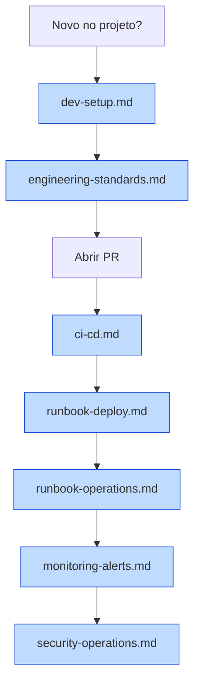

# DevOps — Portal ArtFinal Backend API v1

Índice navegável dos documentos operacionais. Todos os documentos aqui referenciados são **draft** na versão 1.0.0 e evoluem conforme a implementação do backend API v1 avança.

Toda a base técnica está em [`docs/prd/PLANEJAMENTO_BACKEND_APIV1.md`](../prd/PLANEJAMENTO_BACKEND_APIV1.md). Os documentos desta pasta operacionalizam aquele planejamento.

---

## Documentos

### 1. [`dev-setup.md`](dev-setup.md) — Setup de ambiente de desenvolvimento

Passo a passo obrigatório para colocar o ambiente local em execução. Cobre pré-requisitos (macOS, Linux, WSL2), setup inicial do Laradock, comandos do dia a dia, portas locais, troubleshooting e setup do editor (VS Code + PhpStorm).

**Quando consultar:**

- Primeiro boot do projeto.
- Quando algo no ambiente local para de funcionar.
- Ao integrar novo desenvolvedor.

### 2. [`engineering-standards.md`](engineering-standards.md) — Padrões de engenharia

Princípios não negociáveis, estrutura de diretórios/namespaces, regras de dependência (com diagrama Mermaid), regras de linguagem PHP (strict_types, readonly, enums, type hints), naming conventions, Blade/CSS/JS, Conventional Commits PT-BR, estratégia de branches, code review checklist de 40+ itens, formatadores (Pint, Prettier, ESLint), análise estática (PHPStan level 6), pre-commit hooks (Husky + lint-staged), API-ready obrigatório e anti-patterns proibidos.

**Quando consultar:**

- Antes de abrir PR.
- Em code review.
- Quando há dúvida sobre padrão arquitetural.

### 3. [`ci-cd.md`](ci-cd.md) — Integração e Entrega Contínuas

Workflows GitHub Actions (`ci.yml`, `deploy-staging.yml`, `deploy-prod.yml`, `scheduled-checks.yml`), secrets necessários, matriz de ambientes (local/staging/prod), deploy zero-downtime via Envoy com drain do Horizon, rollback atômico via symlink e diagramas Mermaid do pipeline completo e do fluxo de deploy.

**Quando consultar:**

- Ao configurar novo workflow.
- Ao adicionar secret ao repositório.
- Ao entender por que uma PR foi bloqueada.

### 4. [`runbook-deploy.md`](runbook-deploy.md) — Runbook de Deploy

Pre-deploy checklist, procedimentos passo a passo para: deploy normal staging→prod, deploy com migration simples, deploy com migration pesada (padrão Expand → Migrate → Contract em 3 deploys), deploy com mudança de fila/Horizon, deploy emergencial de hotfix, rollback completo (SLA < 15 min) e rollback de migration. Inclui janelas de manutenção, pessoas e papéis, templates Slack pré/pós-deploy.

**Quando consultar:**

- Antes de cada deploy.
- Durante incidente que exige rollback.
- Ao planejar migration pesada.

### 5. [`runbook-operations.md`](runbook-operations.md) — Runbook de Operações 24x7

Operação contínua: dashboards (Horizon, Pulse, Sentry, Grafana, PgHero), checklist diário L1, alertas com runbook específico por alerta (webhook falha massiva, conflito de assento, fila travada, 5xx endpoint crítico, rate limit estourando, slow queries PG, Redis OOM), procedimentos de incidente (critical-seating travada, AssentoIndisponivelException, webhook failed_jobs, Sentry P1), scheduled tasks (ExpirarHoldsJob everyMinute, ReconciliarPagamentosJob 15min, AnonimizarDadosPosEventoJob semanal, horizon:snapshot, logrotate), backups PostgreSQL (dump diário + WAL archiving), procedimentos LGPD (DELETE /me, export pseudonimizado, anonimização pós-evento), rotação de segredos, disaster recovery e escalonamento L1→L2→L3→gestão.

**Quando consultar:**

- Ao receber alerta.
- Em plantão 24x7.
- Ao investigar incidente em produção.

### 6. [`monitoring-alerts.md`](monitoring-alerts.md) — Monitoramento e Alertas

Logs estruturados JSON (com `CorrelationProcessor` + `SensitiveDataMasker`), Pulse custom cards (reservas/min, idempotency hit rate, conflito de assento, webhook processamento), dashboards Horizon custom por fila, Sentry (sample rate, release tracking, filtros de ruído), tabela completa de alertas (14 alertas com ID A01–A14, condição, janela, canal, severidade, link para runbook), tracing funcional via `correlation_id` e SLO/SLI (uptime 99,5%, p95 API ≤500ms, p95 reserva ≤700ms, MTTR <1h).

**Quando consultar:**

- Ao criar novo alerta.
- Ao investigar comportamento anômalo.
- Ao revisar SLOs mensalmente.

### 7. [`security-operations.md`](security-operations.md) — Operações de Segurança

Checklist periódico do §11 do planejamento (entrada, SQL, autenticação, rate limiting, webhooks, tokens de convite, uploads, logs, headers HTTP, LGPD) com frequência e responsável para cada item. Inventário completo de segredos, procedimento de rotação com comandos (APP_KEY, gateway webhook secret, AWS keys, Sentry DSN, SSH keys, DB password) e cronograma consolidado. Auditoria mensal de permissões Spatie, revisão trimestral de `activity_log`, gestão de acesso (onboarding/offboarding com checklist completo), patching de dependências (composer/npm/Dependabot), resposta a incidente de segurança (ciclo NIST), e conformidade LGPD (DPO, SLA 15 dias, registro de requisições de titular).

**Quando consultar:**

- Na rotação mensal de segredos.
- Em resposta a incidente de segurança.
- No onboarding/offboarding de pessoas.
- Em requisições de titular LGPD.

---

## Diagrama de navegação



---

## Quick reference

### Comandos essenciais

```bash
# Ambiente
make up                              # sobe containers
make bash                            # entra no workspace
make fresh                           # recria banco com seeds

# Qualidade
vendor/bin/pint --dirty --format agent
vendor/bin/phpstan analyse --memory-limit=512M
php artisan test --compact
npx prettier --write resources/
npx eslint resources/js/

# Deploy
gh workflow run deploy-prod.yml --ref main

# Observabilidade
# /horizon, /pulse, sentry.io/portalartfinal
```

### Links operacionais

| Recurso      | URL                                    |
| ------------ | -------------------------------------- |
| Horizon prod | https://portalartfinal.com.br/horizon  |
| Pulse prod   | https://portalartfinal.com.br/pulse    |
| OpenAPI docs | https://portalartfinal.com.br/docs/api |
| Sentry       | https://sentry.io/portalartfinal       |
| Status page  | https://status.portalartfinal.com.br   |
| Grafana      | https://grafana.portalartfinal.com.br  |
| PgHero       | https://portalartfinal.com.br/pghero   |

### Canais de comunicação

| Canal                   | Uso                                |
| ----------------------- | ---------------------------------- |
| `#dev`                  | Discussão geral de engenharia      |
| `#deploy-notifications` | Anúncios pré/pós-deploy            |
| `#alerts-backend`       | Alertas automáticos (A01–A14)      |
| `#oncall`               | Plantão (menção `@oncall-backend`) |
| `#security`             | Incidentes de segurança            |
| `#support`              | Reports de usuário (interno)       |

---

## Contribuição para esta documentação

Qualquer alteração nos documentos desta pasta segue o fluxo:

1. Branch `docs/paf-XXX-descricao`.
2. Commit: `docs(devops): <descrição>` (ver [`engineering-standards.md §7`](engineering-standards.md#7-commits-conventional-pt-br)).
3. PR com review de 1 devops.
4. Merge squash em `main`.
5. Atualizar `version` e `date` no frontmatter.
6. Entrada em **Histórico de mudanças** no final do documento alterado.

Proposta de mudança estrutural (ex: novo documento, remoção, reorganização) exige **ADR** em [`docs/adr/`](../adr/).

---

## Referências externas

- [Laravel 13 docs](https://laravel.com/docs/13.x)
- [Horizon docs](https://laravel.com/docs/13.x/horizon)
- [Pulse docs](https://laravel.com/docs/13.x/pulse)
- [Sanctum docs](https://laravel.com/docs/13.x/sanctum)
- [Scramble (OpenAPI)](https://scramble.dedoc.co/)
- [Sentry Laravel](https://docs.sentry.io/platforms/php/guides/laravel/)
- [Conventional Commits](https://www.conventionalcommits.org/pt-br/v1.0.0/)
- [LGPD — texto da lei](http://www.planalto.gov.br/ccivil_03/_ato2015-2018/2018/lei/l13709.htm)
- [OWASP Top 10](https://owasp.org/www-project-top-ten/)

---

## Histórico de mudanças

| Versão | Data       | Autor  | Resumo                                            |
| ------ | ---------- | ------ | ------------------------------------------------- |
| 1.0.0  | 2026-04-18 | DevOps | Índice inicial cobrindo 7 documentos operacionais |
