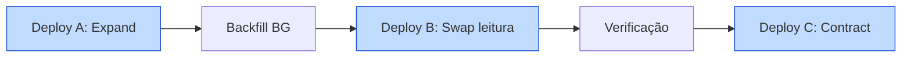

# Runbook de Deploy — Portal ArtFinal Backend API v1

Documento operacional para execução de deploys. Toda operação aqui descrita é **passo a passo, copy/paste friendly**, com critérios de verificação explícitos em cada etapa.

Contexto relacionado:

- [`ci-cd.md`](ci-cd.md) — workflows automáticos
- [`runbook-operations.md`](runbook-operations.md) — resposta a incidentes após deploy
- [`monitoring-alerts.md`](monitoring-alerts.md) — o que observar durante/após deploy
- [`PLANEJAMENTO_BACKEND_APIV1.md`](../prd/PLANEJAMENTO_BACKEND_APIV1.md) — base técnica

---

## Sumário

1. Pre-deploy checklist
2. Deploy normal (staging → prod)
3. Deploy com migration simples
4. Deploy com migration pesada (online, 3 passos)
5. Deploy com mudança de fila/Horizon
6. Deploy emergencial (hotfix)
7. Rollback completo
8. Rollback de migration
9. Janelas de manutenção
10. Pessoas e papéis

---

## 1. Pre-deploy checklist

Antes de clicar em **Run workflow → deploy-prod**, o responsável pelo deploy confirma **todos** os itens abaixo. Nenhum item pode ficar em aberto.

### 1.1 Qualidade do código

- [ ] CI do PR mergeado está **100% verde** (pint, phpstan, pest, prettier, eslint, build, openapi).
- [ ] Deploy staging foi executado automaticamente após merge em `main` e está **estável há ≥ 30 min**.
- [ ] Nenhum alerta Sentry nova no staging nas últimas 30 min (verificar `sentry.io/organizations/portalartfinal/issues/?environment=staging`).
- [ ] Horizon em staging sem jobs failed novos (`/horizon/failed` em staging).

### 1.2 Migrations

- [ ] Migration(ões) a rodar foram revisadas por DBA (tag `review/dba` resolvido na PR).
- [ ] Método `down()` implementado e testado em staging (`php artisan migrate:rollback --pretend`).
- [ ] Tempo estimado de lock (verificado em staging com dataset representativo).
- [ ] Se tempo ≥ 5s em prod → usar fluxo **§4 migration pesada**.

### 1.3 API e contratos

- [ ] OpenAPI regenerado via Scramble (`php artisan scramble:export`) e artifact do CI disponível.
- [ ] Nenhuma quebra de contrato não versionada (PR com breaking change exige `v2` ou deprecação prévia).
- [ ] `docs/api/CHANGELOG.md` atualizado quando houver mudança de contrato.

### 1.4 Rate limiters

- [ ] Rate limiters novos revisados — ver `App\Providers\RateLimiterServiceProvider`.
- [ ] Mudança de limite existente comunicada no `#dev-api` se afetar cliente externo.

### 1.5 Segurança

- [ ] Não há secret commitado (verificado via `git diff` + ferramenta `gitleaks` no CI).
- [ ] Composer `audit` sem vulnerabilidades críticas.
- [ ] `npm audit` sem vulnerabilidades high/critical não mitigadas.

### 1.6 Comunicação

- [ ] Canal `#deploy-notifications` avisado 15 min antes (template em §10.3).
- [ ] Janela de manutenção anunciada se esperado downtime > 30s (§9).
- [ ] Issue Plane `PAF-XXX` referenciada na mensagem Slack.

### 1.7 Comando de verificação rápida

Use este script local (host) para validar o que for automatizável:

```bash
#!/usr/bin/env bash
set -euo pipefail

echo "[1] CI verde?"
gh run list --workflow=ci.yml --branch=main --limit=1 --json conclusion -q '.[0].conclusion'

echo "[2] Staging /up?"
curl -fsS https://staging.portalartfinal.com.br/up | head -c 20

echo "[3] Staging /api/v1/health?"
curl -fsS https://staging.portalartfinal.com.br/api/v1/health

echo "[4] Sentry staging — issues novas últimas 30min?"
curl -sf "https://sentry.io/api/0/projects/portalartfinal/backend/issues/?query=is:unresolved+environment:staging+age:-30m" \
    -H "Authorization: Bearer $SENTRY_AUTH_TOKEN" | jq '. | length'

echo "[5] OpenAPI commit-sha bate com main?"
curl -fsS https://staging.portalartfinal.com.br/docs/api.json | jq '.info.version'
```

---

## 2. Deploy normal (staging → prod)

### 2.1 Janela esperada

- **Staging**: automático após merge, concluído em ≤ 5 min.
- **Produção**: trigger manual, concluído em ≤ 8 min.
- **Total** (do merge ao prod estável): ≤ 40 min (inclui 30 min de bake em staging).

### 2.2 Passos

**Passo 1** — merge da PR em `main`:

```
GitHub UI → Squash and merge
Commit message: seguir §7 de engineering-standards.md
```

**Passo 2** — aguardar `deploy-staging.yml` concluir:

```bash
gh run watch --exit-status
```

Critério de ok: `success` e smoke test `200`.

**Passo 3** — monitorar staging por 30 min:

- Sentry staging: sem issues novas.
- Horizon staging `/horizon`: filas processando normalmente, `pending` em `critical-seating` ≤ 5.
- Aplicação cliente (QA time) validou fluxo crítico.

**Passo 4** — trigger deploy-prod:

```bash
gh workflow run deploy-prod.yml --ref main
```

Ou via UI: **Actions → Deploy Production → Run workflow**.

**Passo 5** — aprovar no GitHub Environments:

Um tech-lead ou devops com permissão aprova em **Actions → Deploy Production → [run] → Review deployments → production → Approve and deploy**.

**Passo 6** — monitorar logs em tempo real:

```bash
ssh deploy@prod-host 'tail -f /var/log/portalartfinal/deploy.log'
```

**Passo 7** — smoke test manual pós-deploy:

```bash
# Home
curl -fsS https://portalartfinal.com.br/up
# API health
curl -fsS https://portalartfinal.com.br/api/v1/health
# Endpoint autenticado amostral
curl -fsS -H "Authorization: Bearer $TEST_TOKEN" \
     https://portalartfinal.com.br/api/v1/me
# OpenAPI
curl -fsS https://portalartfinal.com.br/docs/api.json | jq '.info.title'
```

**Passo 8** — monitorar produção por 15 min:

- Sentry prod: `sentry.io/organizations/portalartfinal/issues/?environment=production&age:-15m`
- Horizon prod: `/horizon` sem pending em `critical-seating`, sem failed novos
- Pulse prod: `/pulse` — p95 /api/v1/\* ≤ 500ms

**Passo 9** — postar confirmação no `#deploy-notifications`:

```
✓ Deploy prod <SHA> concluído
- Staging bake: 32 min
- Deploy prod: 6 min
- Smoke: OK
- Sentry: 0 issues novas
- Horizon: estável
Aguardando 15min de observação antes de fechar.
```

**Passo 10** — fechar deploy após 15 min sem regressão:

Atualizar issue Plane `PAF-XXX` para `Done`.

---

## 3. Deploy com migration simples

Aplicável quando a migration:

- Adiciona coluna nullable com default.
- Adiciona índice `CONCURRENTLY` (PostgreSQL).
- Cria tabela nova sem interferir em leitura atual.
- Lock estimado ≤ 1s.

O fluxo é **idêntico ao §2**. O passo 7 do `deploy.sh` roda `migrate --force` dentro da janela de drain/swap.

### 3.1 Exemplo — adicionar índice CONCURRENTLY

```php
public function up(): void
{
    DB::statement('CREATE INDEX CONCURRENTLY idx_reservas_correlation_id ON reservas_assentos (correlation_id)');
}

public function down(): void
{
    DB::statement('DROP INDEX CONCURRENTLY IF EXISTS idx_reservas_correlation_id');
}
```

Laravel não roda migration em transação quando `DB::statement` detecta DDL concorrente — **mas** o arquivo de migration precisa declarar:

```php
public $withinTransaction = false;
```

Critério de verificação pós-migration:

```sql
\d+ reservas_assentos  -- psql
-- esperar: "idx_reservas_correlation_id" btree (correlation_id)
```

---

## 4. Deploy com migration pesada (online, 3 passos)

Aplicável quando a migration:

- Tem lock estimado ≥ 5s em prod.
- Muda tipo de coluna existente.
- Remove coluna em uso.
- Renomeia coluna ou tabela.
- Adiciona coluna NOT NULL com backfill.

Nesses casos, **NUNCA** rodar a mudança direta. Usar padrão **Expand → Migrate → Contract** em 3 deploys separados.

### 4.1 Visão geral



### 4.2 Passo A — Expand (adicionar estrutura nova)

Exemplo: renomear `status_antigo` → `status`.

Migration:

```php
public function up(): void
{
    Schema::table('reservas_assentos', function (Blueprint $t) {
        $t->string('status', 20)->nullable()->after('status_antigo');
        $t->index('status');
    });
}
```

Código da aplicação: continua lendo/escrevendo `status_antigo`. Ninguém lê a coluna nova ainda.

Deploy normal via §2.

### 4.3 Passo B — Backfill em background job

Job idempotente:

```php
final class BackfillStatusReservasJob implements ShouldQueue
{
    public int $tries = 1;
    public int $timeout = 3600;

    public function handle(): void
    {
        ReservaAssento::query()
            ->whereNull('status')
            ->orderBy('id')
            ->chunkById(5000, function (Collection $chunk): void {
                foreach ($chunk as $r) {
                    $r->update(['status' => $r->status_antigo]);
                }
            });
    }
}
```

Disparar via Horizon:

```bash
docker compose exec workspace php artisan tinker --execute 'dispatch(new \App\Jobs\Bulk\BackfillStatusReservasJob())->onQueue("exports");'
```

Critério de sucesso:

```sql
SELECT COUNT(*) FILTER (WHERE status IS NULL) AS ainda_null,
       COUNT(*)                               AS total
  FROM reservas_assentos;
-- ainda_null == 0
```

### 4.4 Passo C — Swap de leitura

Nova PR muda as Actions para lerem/escreverem `status`. Inclui migration que torna a coluna `NOT NULL`:

```php
public function up(): void
{
    Schema::table('reservas_assentos', function (Blueprint $t) {
        $t->string('status', 20)->nullable(false)->change();
    });
}
```

Deploy normal via §2.

### 4.5 Passo D — Contract (remover coluna antiga)

Após ≥ 48h de observação estável:

```php
public function up(): void
{
    Schema::table('reservas_assentos', function (Blueprint $t) {
        $t->dropColumn('status_antigo');
    });
}
```

Deploy normal via §2.

### 4.6 Regras

- **Nunca** comprimir Expand + Migrate + Contract em um único deploy.
- **Nunca** deletar coluna cujo código ainda referencia — mesmo em release anterior.
- Monitorar `pg_stat_activity` durante backfill para detectar lock conflicts.

---

## 5. Deploy com mudança de fila/Horizon

Quando o deploy muda `config/horizon.php` (supervisors, concurrency, novas filas):

### 5.1 Ordem obrigatória

**Passo 1** — parar recebimento de novos jobs na fila afetada:

```bash
# via Horizon dashboard: Pause supervisor
# ou via artisan
docker compose exec workspace php artisan horizon:pause-supervisor supervisor-seating
```

**Passo 2** — aguardar drain completo:

```bash
docker compose exec workspace php artisan horizon:status
# esperar: pending=0 na fila afetada
```

**Passo 3** — executar deploy normal (§2). O `horizon:terminate` pega a config nova.

**Passo 4** — verificar supervisors novos subiram:

```bash
docker compose exec workspace php artisan horizon:status
# supervisors esperados devem listar
```

**Passo 5** — reenviar jobs falhados se aplicável:

```bash
docker compose exec workspace php artisan horizon:retry failed-job-id
# ou em lote
docker compose exec workspace php artisan queue:retry all
```

### 5.2 Checklist específico

- [ ] Nome da fila nova **não colide** com existente.
- [ ] Job classes referenciam a fila nova em `$queue` ou `onQueue()`.
- [ ] Worker memory não excede limite do container.
- [ ] Alerta de `LongWaitDetected` configurado em `config/horizon.php` para a nova fila.

---

## 6. Deploy emergencial (hotfix)

Aplicável apenas a:

- Vulnerabilidade de segurança ativamente explorada.
- Falha crítica em produção com perda de receita ou dados.
- Bug que impede RSVP, reserva ou pagamento em massa.

Não é aceito como atalho de conveniência.

### 6.1 Fluxo abreviado

**Passo 1** — criar branch a partir de `main`:

```bash
git checkout main && git pull
git checkout -b hotfix/paf-XXX-descricao
```

**Passo 2** — fix mínimo, com teste regressivo que falha antes do fix:

```bash
git add -p && git commit -m 'fix(api): ...'
git push -u origin hotfix/paf-XXX-descricao
```

**Passo 3** — PR com label `hotfix` e aprovação de **2 revisores** (tech-lead + devops):

```bash
gh pr create --label hotfix --reviewer <tech-lead>,<devops>
```

**Passo 4** — após merge e CI verde, **pular** bake de 30min em staging:

- Smoke test staging automático (deploy-staging.yml).
- Validação manual de 5 min (não 30).

**Passo 5** — trigger deploy-prod com justificativa no `#deploy-notifications`:

```
[HOTFIX] Deploy emergencial prod
- Issue: PAF-XXX
- Causa: <descrição>
- Fix: <1 linha>
- Bake staging: 5 min (skip justificado)
- Responsáveis: @tech-lead @devops
```

**Passo 6** — monitoramento intensivo por 60 min pós-deploy (não 15).

**Passo 7** — pós-mortem obrigatório em 48h em [`docs/postmortems/YYYY-MM-DD-<nome>.md`](../postmortems/).

### 6.2 Cherry-pick de hotfix

Se o hotfix precisa ir para prod antes de outras features que estão em `main`:

```bash
git checkout -b hotfix/paf-XXX-descricao v1.2.3  # a partir da tag prod
# aplicar fix
git cherry-pick <sha-do-fix>
git push -u origin hotfix/paf-XXX-descricao
# deploy-prod aceita input release_sha=<hotfix-sha>
```

---

## 7. Rollback completo

### 7.1 Critérios de decisão

Rollback deve ser decidido em ≤ 15 min quando:

- Taxa de 5xx em `/api/v1/*` > 1% por 5 min contínuos.
- Horizon `critical-seating` pending > 50 por 2 min.
- Sentry reporta > 20 issues novas em 10 min com mesmo fingerprint.
- Reports massivos de usuários em `#support` (≥ 5 em 10 min).
- Inconsistência de dados confirmada por DBA.

### 7.2 Passos

**Passo 1** — declarar incidente no `#deploy-notifications`:

```
🚨 INCIDENT — Rollback de prod iniciado
- Release atual: <sha>
- Sintoma: <1 linha>
- Responsável: @<on-call>
- ETA rollback: 5 min
```

**Passo 2** — conectar ao servidor:

```bash
ssh deploy@prod-host
cd /var/www/portalartfinal
```

**Passo 3** — identificar release anterior:

```bash
ls -1dt releases/*/ | head -n 2
# current → releases/20260418-142335-<SHA-NOVO>/
# anterior  releases/20260418-110012-<SHA-ANTIGO>/
```

**Passo 4** — executar rollback:

```bash
PREVIOUS=$(ls -1dt releases/*/ | sed -n '2p')
echo "Apontando current → $PREVIOUS"

# Drain Horizon antes do swap
php "$(readlink current)/artisan" horizon:terminate
sleep 30

# Rollback migration se necessário (§8)
# [só se migration do deploy atual for reversível e tiver impacto]

# Swap atômico
ln -snf "$PREVIOUS" current

# Reload serviços
sudo systemctl reload php8.4-fpm
sudo systemctl restart laravel-horizon
```

**Passo 5** — smoke test:

```bash
curl -fsS https://portalartfinal.com.br/up
curl -fsS https://portalartfinal.com.br/api/v1/health
```

**Passo 6** — notificar conclusão:

```
✓ Rollback concluído em 4m32s
- Release atual: <SHA-ANTIGO>
- 5xx rate: <voltou a baseline>
- Horizon: estável
Investigação de <SHA-NOVO> em andamento. Próximos passos em thread.
```

**Passo 7** — investigar causa em staging:

Não re-deployar `<SHA-NOVO>` até:

- Reproduzir o bug em staging.
- Ter teste regressivo que falhava antes do fix.
- Nova PR aprovada e CI verde.

**Passo 8** — pós-mortem obrigatório em 48h.

---

## 8. Rollback de migration

### 8.1 Critérios

Fazer rollback de migration apenas quando:

- A migration **ainda não** gerou dados novos incompatíveis com a release anterior.
- O método `down()` foi testado em staging e é reversível.
- O DBA confirma que o rollback é seguro para o dataset atual.

Em caso de dúvida, **não** rollbackar — compensar via migration nova (forward-only).

### 8.2 Passo a passo

**Passo 1** — verificar quais migrations foram executadas no deploy atual:

```bash
ssh deploy@prod-host
cd /var/www/portalartfinal/current
php artisan migrate:status | tail -n 20
```

**Passo 2** — fazer dump de backup focado:

```bash
pg_dump -h pg-prod -U portalartfinal -d portalartfinal \
    --schema-only --no-owner > /tmp/backup-schema-$(date +%s).sql
# backup de dados afetados também
pg_dump -h pg-prod -U portalartfinal -d portalartfinal \
    -t reservas_assentos --data-only > /tmp/backup-reservas-$(date +%s).sql
```

**Passo 3** — executar rollback:

```bash
php artisan migrate:rollback --step=1 --force
```

**Passo 4** — verificar schema:

```bash
php artisan migrate:status
# última migration deve aparecer como "Pending"
```

**Passo 5** — validar dados:

```sql
-- Exemplo: se rollback removeu coluna 'status' e restaurou 'status_antigo'
SELECT COUNT(*) FROM reservas_assentos WHERE status_antigo IS NOT NULL;
-- deve cobrir 100% dos registros ativos
```

**Passo 6** — se algo estiver inconsistente, **parar imediatamente** e acionar DBA. Nunca tentar mais rollback se o primeiro deixou estado sujo.

### 8.3 Forward-only fix (recomendado)

Preferir sempre uma **migration nova** que compense o problema:

```php
// 2026_04_18_170000_corrigir_status_reservas.php
public function up(): void
{
    DB::statement("
        UPDATE reservas_assentos
           SET status = 'confirmada'
         WHERE status IS NULL
           AND confirmado_at IS NOT NULL
    ");
}
```

Isso evita os riscos de `down()` em prod.

---

## 9. Janelas de manutenção

### 9.1 Quando entrar em maintenance mode

- Migration com lock esperado > 30s.
- Mudança de schema que exige parar escritas em tabela crítica.
- Reinstalação de dependência que quebra autoload (`composer dump-autoload -o` leva > 10s).

### 9.2 Comando

```bash
cd /var/www/portalartfinal/current

# Entrar em maintenance com render customizado
php artisan down \
    --render="errors::503" \
    --retry=60 \
    --secret="$MAINT_BYPASS_SECRET" \
    --refresh=15

# Retorno: URL para bypass via cookie
# https://portalartfinal.com.br/$MAINT_BYPASS_SECRET

# ... executar operação ...

php artisan up
```

### 9.3 Comunicação

Anunciar com 24h de antecedência para janelas planejadas. Template:

```
[Manutenção programada] Portal ArtFinal
- Data: 2026-04-20 03:00-03:30 BRT
- Impacto: Portal indisponível por ~5 min durante swap de schema
- Motivo: PAF-XXX (migration pesada, §4 do runbook)
- Contato: @<devops-on-call>
```

### 9.4 Bypass para testes

Durante maintenance, QA pode acessar via:

```
https://portalartfinal.com.br/<MAINT_BYPASS_SECRET>
```

Cookie `laravel_maintenance` é setado e libera requests subsequentes.

---

## 10. Pessoas e papéis

### 10.1 Papéis no deploy

| Papel             | Responsabilidade                                 |
| ----------------- | ------------------------------------------------ |
| Deploy driver     | Executa o workflow e monitora (1 pessoa)         |
| Code reviewer     | Aprovou a PR — disponível para dúvidas em `#dev` |
| DBA               | Validou migration; disponível em hotfix          |
| DevOps on-call    | Aprova deploy-prod em GitHub Environments        |
| Tech lead on-call | Decide rollback em < 15 min                      |

### 10.2 Escalação

Escalação detalhada em [`runbook-operations.md §10`](runbook-operations.md).

### 10.3 Template Slack pré-deploy

Postar em `#deploy-notifications` 15 min antes:

```
📦 Deploy prod agendado
- Release: <SHA>
- PR: <link>
- Issue: PAF-XXX
- Tipo: normal / hotfix / migration
- Driver: @<user>
- Impacto esperado: nenhum / indisponibilidade 5 min
- Rollback SLA: 15 min
```

### 10.4 Template pós-deploy

```
✓ Deploy prod <SHA> finalizado
- Tempo: <X>m<Y>s
- Migrations: N aplicadas
- Smoke: OK
- Sentry novas 15min: 0
- Horizon: estável
- Plane PAF-XXX → Done
```

---

## 11. Anexo — `deploy.sh` completo

O script canônico vive em `/var/www/portalartfinal/deploy.sh`. Conteúdo de referência em [`ci-cd.md §5.2`](ci-cd.md#52-fluxo-do-deploysh).

Qualquer mudança nesse script:

1. PR em repositório separado `infra/ansible-portalartfinal`.
2. Deploy do script via Ansible playbook (`site.yml → role: app-deploy`).
3. Revisão obrigatória por 2 devops.

---

## 12. Referências

- [`ci-cd.md`](ci-cd.md) — pipeline automatizado.
- [`runbook-operations.md`](runbook-operations.md) — incidentes operacionais.
- [`monitoring-alerts.md`](monitoring-alerts.md) — alertas e observabilidade.
- [`security-operations.md`](security-operations.md) — rotação de segredos.
- [`PLANEJAMENTO_BACKEND_APIV1.md`](../prd/PLANEJAMENTO_BACKEND_APIV1.md) — contexto técnico.

---

## 13. Histórico de mudanças

| Versão | Data       | Autor  | Resumo                               |
| ------ | ---------- | ------ | ------------------------------------ |
| 1.0.0  | 2026-04-18 | DevOps | Runbook inicial — draft para revisão |
