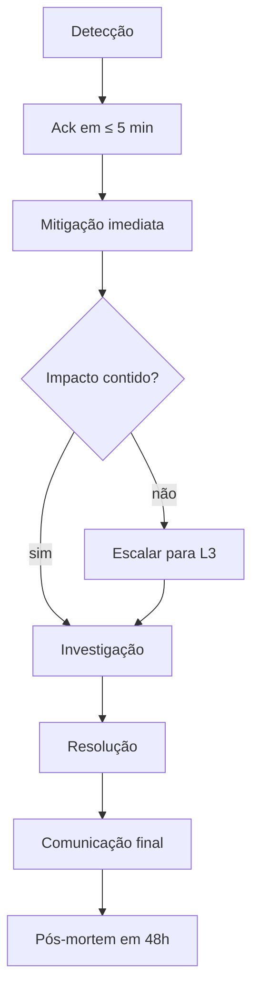

# Runbook de Operações — Portal ArtFinal Backend API v1

Documento operacional para operação 24x7 do backend em produção. Cobre monitoramento, alertas com procedimentos de resposta a incidentes, tarefas agendadas, backups, procedimentos LGPD, rotação de segredos e escalonamento.

Base normativa:

- [`PLANEJAMENTO_BACKEND_APIV1.md`](../prd/PLANEJAMENTO_BACKEND_APIV1.md) §7, §11, §12, §13
- [`monitoring-alerts.md`](monitoring-alerts.md) — definição dos alertas
- [`runbook-deploy.md`](runbook-deploy.md) — relacionado a incidentes pós-deploy
- [`security-operations.md`](security-operations.md) — rotação/resposta de segurança

---

## Sumário

1. Visão geral de operação
2. Dashboards e monitoramento
3. Alertas e runbook por alerta
4. Resposta a incidentes (procedimentos)
5. Tarefas agendadas (scheduler)
6. Backups PostgreSQL
7. Procedimentos LGPD
8. Rotação de segredos
9. Disaster recovery (DR)
10. Escalonamento L1 → L2 → L3 → gestão

---

## 1. Visão geral de operação

### 1.1 Princípios

- **Observabilidade primeiro**: nada em prod sem dashboard + alerta correspondente.
- **Runbook por alerta**: todo alerta tem procedimento documentado aqui.
- **Mitigação > investigação**: primeiro estancar o impacto, depois investigar causa raiz.
- **Pós-mortem sem culpa**: todo incidente P0/P1 gera pós-mortem em 48h.

### 1.2 Classificação de severidade

| Nível | Definição                                                          | Resposta                |
| ----- | ------------------------------------------------------------------ | ----------------------- |
| P0    | Sistema inacessível para todos os usuários                         | Imediata, 24x7          |
| P1    | Funcionalidade crítica degradada (pagamento/reserva/RSVP em massa) | ≤ 15 min, 24x7          |
| P2    | Degradação parcial (latência alta, um módulo afetado)              | ≤ 1h, horário comercial |
| P3    | Bug cosmético ou caso isolado                                      | Próximo sprint          |

### 1.3 SLOs / SLIs

| SLI                              | Objetivo (SLO)  |
| -------------------------------- | --------------- |
| Uptime mensal `/api/v1/*`        | 99,5%           |
| Latência p95 `/api/v1/*`         | ≤ 500ms         |
| Latência p95 reserva de assento  | ≤ 700ms         |
| Taxa de 5xx em `/api/v1/*`       | ≤ 0,1% (mensal) |
| MTTR (Mean Time To Recovery)     | < 1h (P0/P1)    |
| Sucesso de webhook idempotente   | 100%            |
| Job `ExpirarHoldsJob` atraso p95 | ≤ 60s           |

Detalhes em [`monitoring-alerts.md §7`](monitoring-alerts.md).

---

## 2. Dashboards e monitoramento

### 2.1 Links principais

| Dashboard           | URL                                     | Acesso                        |
| ------------------- | --------------------------------------- | ----------------------------- |
| Horizon (filas)     | `https://portalartfinal.com.br/horizon` | admin guard                   |
| Pulse (app metrics) | `https://portalartfinal.com.br/pulse`   | admin guard                   |
| Sentry              | `https://sentry.io/portalartfinal`      | SSO + 2FA                     |
| Grafana infra       | `https://grafana.portalartfinal.com.br` | SSO (infra, CPU/mem/disk)     |
| PgHero              | `https://portalartfinal.com.br/pghero`  | admin + permission `admin.db` |
| CloudWatch (AWS)    | AWS Console → CloudWatch                | IAM role                      |

### 2.2 O que observar em cada dashboard

**Horizon (`/horizon`):**

- Dashboard → Supervisors: todos `running`.
- Dashboard → Recent jobs: taxa sucesso ≥ 99%.
- Dashboard → Failed jobs: `count` e `last 24h`.
- Metrics → Throughput: jobs/min por fila.
- Metrics → Runtime: p95 por job classname.

**Pulse (`/pulse`):**

- Slow Queries: queries > 1000ms ocorrendo.
- Slow Jobs: jobs > 10s ocorrendo.
- Exceptions: fingerprints novos.
- Cache: hit rate ≥ 80%.
- Usage → Users: detecção de comportamento atípico.
- Custom cards (ver [`monitoring-alerts.md §2`](monitoring-alerts.md)): reservas/min, idempotency hit, conflito assento.

**Sentry:**

- Issues → Unresolved filtered by `environment:production`.
- Alerts → Rules → `portalartfinal-backend`.
- Release health: crash-free sessions ≥ 99,5%.

**PgHero:**

- Slow Queries: queries > 500ms.
- Indexes → Unused: candidatos a drop.
- Indexes → Missing: sugestões.
- Connections: < 80% do `max_connections`.

### 2.3 Checklist diário (L1 — início de turno)

- [ ] Horizon: 0 supervisors em `stopped`.
- [ ] Horizon: `failed` 24h < 20.
- [ ] Sentry: unresolved critical/error = 0.
- [ ] Pulse: slow queries 24h < 30.
- [ ] Grafana: CPU < 70%, mem < 80%, disk free > 30%.
- [ ] PgHero: conexões DB < 80% do limit.
- [ ] Backup noturno concluído (ver §6).

---

## 3. Alertas e runbook por alerta

Os alertas estão documentados em [`monitoring-alerts.md §4`](monitoring-alerts.md). Aqui cada alerta tem procedimento de resposta.

### 3.1 Alerta: Webhook falha massiva

**Definição:** > 10 falhas em 5 min no mesmo provider (via `failed_jobs` do Horizon para `ProcessarWebhookPagamentoJob`).

**Canal:** Slack `#alerts-backend` + Sentry.

**Causa provável:**

1. Gateway retornando formato inválido.
2. Assinatura HMAC não bate (segredo rotacionado sem sincronia).
3. Gateway envia duplicatas em excesso.
4. Erro em código pós-deploy.

**Mitigação imediata:**

```bash
# 1. Verificar últimos failed_jobs
ssh deploy@prod-host 'cd /var/www/portalartfinal/current && \
    php artisan tinker --execute "
        echo \App\Models\Webhook\WebhookEvento::query()
            ->where(\"status\", \"falhou\")
            ->where(\"created_at\", \">\", now()->subMinutes(10))
            ->latest()->take(5)->get([\"id\", \"provider\", \"gateway_reference\", \"erro\"])->toJson(JSON_PRETTY_PRINT);
    "'

# 2. Verificar se assinatura HMAC está ok — amostra
php artisan tinker --execute '
    $evt = \App\Models\Webhook\WebhookEvento::latest()->first();
    $esperado = hash_hmac("sha256", json_encode($evt->payload), config("gateway.itau.webhook_secret"));
    echo "assinatura_ok=" . ($esperado === $evt->assinatura_recebida ? "sim" : "NÃO");
'

# 3. Reprocessar jobs falhados em lote
php artisan queue:retry --queue=webhooks all
```

**Escalação:** se > 50 falhas persistirem por 10 min → P1, acionar tech lead.

### 3.2 Alerta: Conflito de assento

**Definição:** > 20 `AssentoIndisponivelException`/min no log estruturado.

**Canal:** Slack `#alerts-backend`.

**Causa provável:**

1. Pico legítimo de demanda (evento acabou de abrir).
2. Bug no frontend que reenvia request sem respeitar resposta 409.
3. Unique parcial do DB falhou (improvável mas investigar).

**Mitigação imediata:**

```bash
# 1. Verificar se é pico legítimo
curl -sf "https://portalartfinal.com.br/pulse" \
    # Card custom: reservas_por_minuto

# 2. Conferir distribuição de IPs
ssh deploy@prod-host 'grep AssentoIndisponivelException /var/log/portalartfinal/app.log | \
    tail -200 | jq -r ".context.ip" | sort | uniq -c | sort -rn | head -10'

# 3. Se > 80% vem de poucos IPs: rate limit extra ou bloqueio
# Ver §3.4 (rate limit)

# 4. Verificar integridade unique parcial
php artisan tinker --execute '
    echo DB::selectOne("
        SELECT COUNT(*) AS dup
          FROM (
            SELECT assento_id, COUNT(*)
              FROM reservas_assentos
             WHERE status IN (\"hold\", \"confirmada\")
             GROUP BY assento_id
            HAVING COUNT(*) > 1
          ) x
    ")->dup;
'
# esperado: 0
```

### 3.3 Alerta: Fila travada (critical-seating)

**Definição:** `pending` em `critical-seating` > 50 por 2 min.

**Canal:** Slack `#alerts-backend` + PagerDuty.

**Causa provável:**

1. Horizon supervisor crashou.
2. Job `ExpirarHoldsJob` em loop infinito.
3. Redis indisponível.

**Mitigação:**

```bash
# 1. Status Horizon
ssh deploy@prod-host 'cd /var/www/portalartfinal/current && \
    php artisan horizon:status'
# esperado: "Horizon is running."

# 2. Se não: reiniciar
sudo systemctl status laravel-horizon
sudo systemctl restart laravel-horizon

# 3. Verificar Redis
docker compose exec redis redis-cli ping
# PONG

# 4. Cleanup manual de holds expirados (se ExpirarHoldsJob travou)
php artisan tinker --execute '
    \App\Models\Seating\ReservaAssento::query()
        ->where("status", "hold")
        ->where("hold_expires_at", "<", now())
        ->update(["status" => "expirada"]);
'

# 5. Se supervisor ficou em loop restart repetido: inspecionar logs
tail -200 /var/log/portalartfinal/horizon.log | grep -i "critical-seating"
```

**Escalação:** P1 imediato — acionar tech lead e devops.

### 3.4 Alerta: 5xx endpoint crítico

**Definição:** taxa de 5xx > 1% em janela de 5 min em qualquer endpoint sob `/api/v1/*`.

**Canal:** PagerDuty + Slack `#alerts-backend`.

**Mitigação:**

```bash
# 1. Identificar endpoint
ssh deploy@prod-host 'grep "\"status\":\"5" /var/log/portalartfinal/app.log | \
    tail -100 | jq -r ".context.endpoint" | sort | uniq -c | sort -rn | head -5'

# 2. Verificar Sentry issues últimas 15 min
curl -sf "https://sentry.io/api/0/projects/portalartfinal/backend/issues/?query=is:unresolved+environment:production+age:-15m" \
    -H "Authorization: Bearer $SENTRY_AUTH_TOKEN" | jq '.[0:3]'

# 3. Verificar se correlaciona com deploy recente
ssh deploy@prod-host 'ls -1dt /var/www/portalartfinal/releases/ | head -1'

# 4. Se correlaciona → rollback (runbook-deploy.md §7)
# 5. Se não → investigar stack trace no Sentry
```

### 3.5 Alerta: Rate limit estourando

**Definição:** > 100 responses com HTTP 429 por minuto.

**Canal:** Slack `#alerts-backend`.

**Mitigação:**

```bash
# 1. Identificar limiter afetado
ssh deploy@prod-host 'grep "\"status\":429" /var/log/portalartfinal/app.log | \
    tail -200 | jq -r ".context.rate_limiter" | sort | uniq -c | sort -rn'

# 2. Identificar atores
grep "\"status\":429" /var/log/portalartfinal/app.log | \
    tail -200 | jq -r ".context.actor_id" | sort | uniq -c | sort -rn | head -10

# 3. Se IP único atacando → bloquear em camada superior (Cloudflare/WAF)
# 4. Se ator legítimo batendo limite: avaliar aumentar limite ou comunicar cliente
```

### 3.6 Alerta: Slow queries (PG)

**Definição:** Pulse detecta queries > 1000ms.

**Canal:** Slack `#alerts-backend` (baixa prioridade).

**Mitigação:**

```sql
-- 1. Identificar query exata
SELECT query, calls, mean_exec_time, total_exec_time
  FROM pg_stat_statements
 ORDER BY mean_exec_time DESC
 LIMIT 10;

-- 2. Rodar EXPLAIN ANALYZE
EXPLAIN (ANALYZE, BUFFERS) SELECT ...;

-- 3. Candidatos a índice — ver PgHero sugestões
```

Criar issue Plane PAF-XXX `perf: índice em <tabela>.<coluna>` se reincidente.

### 3.7 Alerta: Redis OOM

**Definição:** Redis memory usage > 90%.

**Canal:** PagerDuty + Slack.

**Mitigação:**

```bash
# 1. Status
docker compose exec redis redis-cli info memory

# 2. Identificar maiores keys
docker compose exec redis redis-cli --bigkeys

# 3. Limpar cache de aplicação se seguro (NÃO flushall)
docker compose exec workspace php artisan cache:clear
# NOTE: flush de cache fresco — sessões Sanctum não são afetadas (separated DB index)

# 4. Se session store estiver cheio: revisar TTL
docker compose exec redis redis-cli --scan --pattern "laravel_database_session*" | wc -l

# 5. Escalar: aumentar memory do container Redis, ou segmentar (cache vs session vs queue)
```

---

## 4. Resposta a incidentes (procedimentos)

### 4.1 Procedimento canônico (P0/P1)



### 4.2 Runbook: `critical-seating` travada

Ver §3.3. Passos adicionais:

```bash
# Se cleanup manual não resolveu:
# 1. Pausar supervisor
php artisan horizon:pause-supervisor supervisor-seating

# 2. Listar jobs em Redis
docker compose exec redis redis-cli -n 0 LRANGE queues:critical-seating 0 5

# 3. Inspecionar payload de job
docker compose exec redis redis-cli -n 0 LINDEX queues:critical-seating 0

# 4. Se job específico está quebrando o worker: remover
docker compose exec redis redis-cli -n 0 LREM queues:critical-seating 1 "<payload>"

# 5. Retomar
php artisan horizon:continue-supervisor supervisor-seating
```

### 4.3 Runbook: Webhook failed_jobs > 5/5min

Ver §3.1. Detalhes adicionais:

```bash
# 1. Baixar payload do webhook falhado
php artisan tinker --execute '
    $evt = \App\Models\Webhook\WebhookEvento::where("status","falhou")->latest()->first();
    file_put_contents("/tmp/webhook-$evt->id.json", json_encode($evt->payload, JSON_PRETTY_PRINT));
    echo "/tmp/webhook-$evt->id.json";
'

# 2. Validar assinatura manualmente
SIG=$(hash-hmac-sha256 < /tmp/webhook-123.json)
echo "Assinatura calculada: $SIG"
# comparar com webhook.assinatura_recebida

# 3. Reprocessar apenas um
php artisan tinker --execute '
    dispatch(new \App\Jobs\Webhooks\ProcessarWebhookPagamentoJob(123))->onQueue("webhooks");
'

# 4. Reprocessar em lote
php artisan queue:retry --queue=webhooks all
```

### 4.4 Runbook: AssentoIndisponivelException > 20/min

Ver §3.2.

### 4.5 Runbook: 5xx > 1% em endpoint

Ver §3.4.

### 4.6 Runbook: Slow queries PG

Ver §3.6.

### 4.7 Runbook: Redis OOM

Ver §3.7.

### 4.8 Runbook: Sentry issue nova P1

Issue Sentry marcada como P1 (crash-free < 99%, impacto > 50 usuários):

```bash
# 1. Ler stack trace
# Sentry UI → Issue → Events → Raw

# 2. Verificar distribuição de release
# Sentry UI → Tags → release — se > 90% numa release: candidato a rollback

# 3. Reproduzir em staging
# Usar dados do breadcrumb para recriar request

# 4. Decidir:
#    a) Fix forward (se simples) — PR + hotfix
#    b) Rollback (se release recente) — runbook-deploy.md §7
```

---

## 5. Tarefas agendadas (scheduler)

Todas em `app/Console/Kernel.php` (ou `routes/console.php` em Laravel 11+).

### 5.1 Lista completa

| Schedule                      | Task                          | Fila               | Propósito                                        |
| ----------------------------- | ----------------------------- | ------------------ | ------------------------------------------------ |
| `->everyMinute()`             | `ExpirarHoldsJob`             | `critical-seating` | Libera holds expirados (`hold_expires_at < now`) |
| `->everyFifteenMinutes()`     | `ReconciliarPagamentosJob`    | `webhooks`         | Consulta gateway e reconcilia pagamentos         |
| `->weeklyOn(Sunday, '03:00')` | `AnonimizarDadosPosEventoJob` | `default`          | LGPD: anonimiza convidados 90d pós-evento        |
| `->everyFiveMinutes()`        | `horizon:snapshot`            | —                  | Snapshot de métricas Horizon                     |
| `->daily('04:00')`            | `horizon:purge-completed`     | —                  | Limpa completed > 3 dias                         |
| `->daily('04:30')`            | `logrotate`                   | —                  | Rotação de `/var/log/portalartfinal/*.log`       |
| `->daily('02:00')`            | `backup:database`             | —                  | Dump PG diário (ver §6)                          |
| `->everyThirtyMinutes()`      | `EnviarReminderRsvpJob`       | `notifications`    | RSVP pendente há > 3 dias                        |
| `->daily('01:00')`            | `sanctum:prune-expired`       | —                  | Limpa tokens Sanctum expirados (>30d)            |
| `->weeklyOn(Monday, '03:30')` | `activitylog:clean`           | —                  | Arquiva activity_log > 2 anos em S3 parquet      |

### 5.2 Configuração

```php
// app/Console/Kernel.php
protected function schedule(Schedule $schedule): void
{
    $schedule->job(new \App\Jobs\Seating\ExpirarHoldsJob())
        ->everyMinute()
        ->onOneServer()
        ->withoutOverlapping()
        ->name('expirar-holds');

    $schedule->job(new \App\Jobs\Webhooks\ReconciliarPagamentosJob())
        ->everyFifteenMinutes()
        ->onOneServer()
        ->withoutOverlapping(10);

    $schedule->command('horizon:snapshot')->everyFiveMinutes();
    $schedule->command('horizon:purge-completed')->daily('04:00');

    $schedule->job(new \App\Jobs\Lgpd\AnonimizarDadosPosEventoJob())
        ->weeklyOn(0, '03:00')
        ->onOneServer();

    $schedule->command('sanctum:prune-expired --hours=720')->daily('01:00');
    $schedule->command('activitylog:clean --keep-days=730')->weeklyOn(1, '03:30');
}
```

### 5.3 Verificar execução

```bash
ssh deploy@prod-host 'tail -100 /var/log/portalartfinal/schedule.log'

# Testar manualmente
docker compose exec workspace php artisan schedule:test
# UI: seleciona task e executa
```

### 5.4 Logrotate

```ini
# /etc/logrotate.d/portalartfinal
/var/log/portalartfinal/*.log {
    daily
    rotate 14
    compress
    delaycompress
    missingok
    notifempty
    create 0640 deploy www-data
    sharedscripts
    postrotate
        /usr/sbin/service php8.4-fpm reload > /dev/null 2>&1 || true
    endscript
}
```

---

## 6. Backups PostgreSQL

### 6.1 Estratégia

- **Dump full diário** às 02:00 BRT, retido por 30 dias em S3.
- **WAL archiving** contínuo para S3 (point-in-time recovery — RPO 5 min).
- **Teste de restore mensal** (obrigatório, documentar em [`docs/devops/backup-restore-tests/`](.)).

### 6.2 Objetivos

| Métrica | Valor | Justificativa                       |
| ------- | ----- | ----------------------------------- |
| RPO     | 5 min | WAL archiving contínuo              |
| RTO     | 1h    | Dump + WAL replay em standby quente |

### 6.3 Comando de backup diário

```bash
#!/usr/bin/env bash
# /usr/local/bin/backup-pg.sh
set -euo pipefail

TS=$(date +%Y%m%d-%H%M%S)
BUCKET=portalartfinal-backups
TMP=/tmp/pg-backup-$TS.dump

pg_dump -h pg-prod -U portalartfinal -d portalartfinal \
    -Fc -Z 6 -f "$TMP"

aws s3 cp "$TMP" "s3://$BUCKET/daily/pg-backup-$TS.dump" \
    --storage-class STANDARD_IA

# Retenção — remover > 30 dias
aws s3 ls "s3://$BUCKET/daily/" | \
    awk -v cutoff=$(date -d '30 days ago' +%Y-%m-%d) \
        '$1 < cutoff {print $4}' | \
    xargs -I{} aws s3 rm "s3://$BUCKET/daily/{}"

rm -f "$TMP"

echo "Backup concluído: s3://$BUCKET/daily/pg-backup-$TS.dump"
```

Agendado em cron:

```
0 2 * * * deploy /usr/local/bin/backup-pg.sh >> /var/log/portalartfinal/backup.log 2>&1
```

### 6.4 WAL archiving

`postgresql.conf`:

```conf
archive_mode = on
archive_command = 'aws s3 cp %p s3://portalartfinal-backups/wal/%f --storage-class STANDARD_IA'
wal_level = replica
max_wal_senders = 3
```

### 6.5 Restore — procedimento

**Cenário 1 — restaurar dump completo:**

```bash
aws s3 cp s3://portalartfinal-backups/daily/pg-backup-20260418-020000.dump /tmp/
createdb -h pg-standby -U portalartfinal portalartfinal_restored
pg_restore -h pg-standby -U portalartfinal -d portalartfinal_restored \
    --clean --if-exists -j 4 /tmp/pg-backup-20260418-020000.dump
```

**Cenário 2 — PITR (point-in-time recovery):**

```bash
# 1. Restaurar dump base
# 2. recovery.conf no standby:
restore_command = 'aws s3 cp s3://portalartfinal-backups/wal/%f %p'
recovery_target_time = '2026-04-18 14:32:00'
recovery_target_action = 'promote'

# 3. Reiniciar PG standby em modo recovery
sudo systemctl restart postgresql
```

### 6.6 Teste de restore mensal

Toda primeira terça do mês, um DevOps:

1. Restaura dump em banco `portalartfinal_test_restore`.
2. Roda `SELECT COUNT(*)` em 5 tabelas principais — comparar com prod.
3. Documenta em `docs/devops/backup-restore-tests/YYYY-MM.md`.
4. Descarta banco de teste.

---

## 7. Procedimentos LGPD

### 7.1 `DELETE /api/v1/me` (direito ao esquecimento)

Endpoint disponível para o usuário. Action canônica em `App\Actions\Acesso\ExcluirContaAction`:

```php
public function execute(PortalUser $user, string $motivo): void
{
    DB::transaction(function () use ($user, $motivo) {
        // 1. Soft-delete
        $user->delete();

        // 2. Anonimizar dados pessoais
        $user->formandos->each(function ($formando) {
            $formando->update([
                'nome'     => "Usuário Removido #{$formando->id}",
                'email'    => null,
                'telefone' => null,
                'cpf'      => hash('sha256', $formando->cpf),
            ]);
        });

        // 3. Audit log
        activity()->causedBy($user)
            ->withProperties(['motivo' => $motivo])
            ->log('lgpd.exclusao_solicitada');
    });
}
```

### 7.2 Export pseudonimizado (portabilidade)

Endpoint `POST /api/v1/me/export`:

- Gera JSON com dados do usuário, mas com:
    - Nome: primeiro nome + iniciais
    - Email: `j***@d***`
    - CPF: hash SHA-256

Entregue via link S3 assinado (TTL 10 min) enviado ao email cadastrado.

### 7.3 Anonimização pós-evento

Job `AnonimizarDadosPosEventoJob` roda semanalmente:

```php
public function handle(): void
{
    $eventos = Evento::query()
        ->whereNotNull('data_evento')
        ->where('data_evento', '<', now()->subDays(90))
        ->where('anonimizado_em', null)
        ->get();

    foreach ($eventos as $evento) {
        DB::transaction(function () use ($evento) {
            Convite::query()
                ->where('evento_id', $evento->id)
                ->chunkById(500, function ($convites) {
                    foreach ($convites as $c) {
                        $c->update([
                            'convidado_nome'     => 'Convidado Anonimizado #' . $c->id,
                            'convidado_email'    => null,
                            'convidado_telefone' => null,
                        ]);
                    }
                });

            $evento->update(['anonimizado_em' => now()]);

            activity()->performedOn($evento)->log('lgpd.anonimizacao_pos_evento');
        });
    }
}
```

### 7.4 Resposta a requisição de titular

Canal oficial: `dpo@portalartfinal.com.br`. SLA de resposta: **15 dias corridos** conforme LGPD art. 19.

Procedimento:

1. Verificar identidade do titular (via email cadastrado).
2. Se acesso: gerar export via §7.2.
3. Se correção: orientar uso do portal.
4. Se exclusão: gerar via §7.1, confirmar por email.
5. Registrar em `docs/devops/lgpd-requests/YYYY-MM-DD.md`.

---

## 8. Rotação de segredos

Ver detalhes em [`security-operations.md §3`](security-operations.md). Resumo operacional aqui.

### 8.1 `APP_KEY`

Rotação: **nunca sem downtime**. `APP_KEY` é usada para criptografar dados em DB (`encrypted` casts). Rotacionar apenas em janela de manutenção com migração de dados.

### 8.2 `SESSION_*`

Rotacionar cookie de sessão força logout. Avisar usuários com 24h.

### 8.3 Gateway webhook secret

```bash
# 1. Gerar novo segredo
NEW_SECRET=$(openssl rand -hex 32)

# 2. Configurar no gateway (painel Itaú) → conviver com antigo por 24h
# Itaú envia novo segredo no header `X-Signature-v2` durante migração

# 3. Aceitar ambos em código (release temporária)
public function assinaturaValida(string $payload, string $sig): bool
{
    foreach ([config('gateway.itau.webhook_secret'), config('gateway.itau.webhook_secret_old')] as $secret) {
        if (hash_equals(hash_hmac('sha256', $payload, $secret), $sig)) return true;
    }
    return false;
}

# 4. Após 48h sem webhook com chave antiga, remover suporte à antiga
```

### 8.4 AWS keys

Ver §4.5 de [`ci-cd.md`](ci-cd.md). Preferir OIDC.

### 8.5 Sentry DSN

```bash
# 1. Gerar novo DSN em Sentry UI
# 2. Atualizar .env em prod
# 3. Reload php-fpm
sudo systemctl reload php8.4-fpm

# 4. Verificar: forçar exceção em endpoint de teste e conferir chegada no Sentry
```

---

## 9. Disaster recovery (DR)

### 9.1 Cenários cobertos

| Cenário                 | RTO    | RPO    | Procedimento                            |
| ----------------------- | ------ | ------ | --------------------------------------- |
| App server indisponível | 15 min | 0      | Failover para standby (AZ-B)            |
| PG primary indisponível | 1h     | 5 min  | Promover réplica + reconfigurar         |
| Region indisponível     | 4h     | 15 min | DR em região secundária (se habilitado) |
| Redis indisponível      | 30 min | —      | Reprovisionamento (cache é rebuildável) |
| S3 indisponível         | —      | 0      | Retry automático, esperar AWS           |

### 9.2 Failover PG primary → standby

```bash
# Passo 1: confirmar que primary está realmente down
pg_isready -h pg-prod -U portalartfinal
# retorno esperado: não responde

# Passo 2: promover standby
ssh dba@pg-standby 'sudo -u postgres pg_ctl promote -D /var/lib/postgresql/16/main'

# Passo 3: ajustar DNS / Route53 do backend para apontar para standby
aws route53 change-resource-record-sets --hosted-zone-id XXX \
    --change-batch file:///tmp/failover-dns.json

# Passo 4: reload php-fpm para reabrir conexões
sudo systemctl reload php8.4-fpm

# Passo 5: validar
php artisan tinker --execute 'DB::connection()->getPdo(); echo "OK";'
```

### 9.3 DR drill

Drill trimestral obrigatório (documentado em `docs/devops/dr-drills/YYYY-QX.md`). Simula falha de primary e mede RTO/RPO real.

---

## 10. Escalonamento L1 → L2 → L3 → gestão

### 10.1 Níveis

| Nível  | Responsável            | Escopo                                   |
| ------ | ---------------------- | ---------------------------------------- |
| L1     | On-call rotating       | Triagem, mitigação via runbook           |
| L2     | DevOps / SRE           | Incidentes que excedem runbook           |
| L3     | Tech lead / Arquiteto  | Rollback, decisões de mitigação críticas |
| Gestão | CTO / Líder de produto | Comunicação externa, impacto comercial   |

### 10.2 SLAs de escalação

| Severidade | Ack L1      | Escalar L2 | Escalar L3 | Gestão ciente |
| ---------- | ----------- | ---------- | ---------- | ------------- |
| P0         | ≤ 5 min     | imediato   | ≤ 15 min   | ≤ 30 min      |
| P1         | ≤ 15 min    | ≤ 30 min   | ≤ 1h       | ≤ 2h          |
| P2         | ≤ 1h        | ≤ 4h       | se precisa | —             |
| P3         | próximo dia | —          | —          | —             |

### 10.3 Contatos

Tabela em `docs/devops/on-call-roster.md` (reservada, link interno). Contatos via:

- Slack `#oncall` (mention `@oncall-backend`).
- PagerDuty rotation `backend-primary`.
- Telefone de emergência (apenas P0): CTO.

### 10.4 Comunicação externa

Durante incidente P0/P1 com impacto ao cliente:

1. **Status page** atualizada em ≤ 15 min (`status.portalartfinal.com.br`).
2. **Email** para clientes impactados se duração > 1h (via suporte).
3. **Pós-mortem público** se incidente > 30 min de downtime.

### 10.5 Pós-mortem obrigatório

Formato `docs/postmortems/YYYY-MM-DD-<nome>.md`:

```markdown
# Pós-mortem: <título>

- **Data**: YYYY-MM-DD HH:MM - HH:MM BRT
- **Severidade**: P0 | P1
- **Duração**: Xh Ym
- **Impacto**: <nº usuários afetados, receita, dados>
- **Responsável pós-mortem**: @<nome>

## Resumo

## Cronologia

## Causa raiz

## O que funcionou

## O que não funcionou

## Itens de ação

- [ ] PAF-XXX — descrição
```

Prazo: 48h após resolução. Revisão em retrospectiva do sprint.

---

## 11. Referências

- [`monitoring-alerts.md`](monitoring-alerts.md) — definição técnica dos alertas.
- [`runbook-deploy.md`](runbook-deploy.md) — procedimentos de deploy.
- [`security-operations.md`](security-operations.md) — operações de segurança.
- [`ci-cd.md`](ci-cd.md) — pipeline CI/CD.
- [`PLANEJAMENTO_BACKEND_APIV1.md`](../prd/PLANEJAMENTO_BACKEND_APIV1.md) — base técnica.

---

## 12. Histórico de mudanças

| Versão | Data       | Autor  | Resumo                               |
| ------ | ---------- | ------ | ------------------------------------ |
| 1.0.0  | 2026-04-18 | DevOps | Runbook inicial — draft para revisão |
