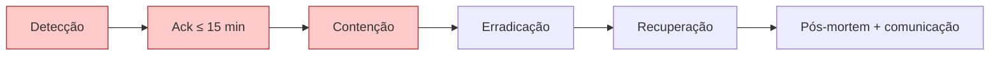

# Operações de Segurança

Documento operacional de segurança. Cobre checklist periódico, rotação de segredos, auditoria de permissões, revisão de `activity_log`, gestão de acesso, patching de dependências, resposta a incidente de segurança e conformidade LGPD.

Base normativa:

- [`conventions.md`](conventions.md) — padrões de código seguros
- [`ci-cd.md`](ci-cd.md) — secrets do pipeline

---

## Sumário

1. Checklist periódico de segurança
2. Inventário de segredos
3. Rotação de segredos (frequência, responsável, comandos)
4. Auditoria mensal de permissões (Spatie)
5. Revisão trimestral de `activity_log`
6. Gestão de acesso (onboarding/offboarding)
7. Patching de dependências
8. Resposta a incidente de segurança
9. LGPD — DPO e tempo de resposta

---

## 1. Checklist periódico de segurança

Cada item abaixo (entrada, SQL, autenticação, rate limiting, uploads, logs, headers, LGPD) deve ser verificado periodicamente. Tabela consolidada com frequência:

### 1.1 Entrada

| Item                                   | Frequência | Responsável | Evidência                                                 |
| -------------------------------------- | ---------- | ----------- | --------------------------------------------------------- |
| `FormRequest` em 100% das rotas        | Trimestral | Tech lead   | `grep -r 'function.*Request' routes/` diff vs controllers |
| `$request->validated()` em updates     | CI         | PR reviewer | Regra custom (roadmap)                                    |
| `Rule::enum` em campos enumerados      | Trimestral | Arquitetura | Grep `Rule::in\(` → substituir                            |
| `max`, `decimal:2`, `integer` em money | PR         | PR reviewer | Review checklist                                          |

### 1.2 SQL

| Item                                         | Frequência | Responsável | Evidência                |
| -------------------------------------------- | ---------- | ----------- | ------------------------ |
| Eloquent / Query Builder em 100% das queries | Trimestral | Tech lead   | Grep `DB::raw\|whereRaw` |
| Bindings explícitos em `whereRaw`            | PR         | PR reviewer | Review checklist         |

### 1.3 Autenticação e autorização

| Item                                               | Frequência | Responsável |
| -------------------------------------------------- | ---------- | ----------- |
| Guard `admin` configurado corretamente             | Anual      | Arquitetura |
| Policies em recursos expostos                      | Trimestral | Tech lead   |
| Middleware `role:`/`permission:` em rotas críticas | Trimestral | Tech lead   |

### 1.4 Rate limiting

| Limiter | Limite             | Verificação |
| ------- | ------------------ | ----------- |
| `login` | 5/min por email+IP | Logs ≥ 429  |
| global  | 120/min por ator   | Logs        |

Config em `App\Providers\RateLimiterServiceProvider`. Revisão trimestral.

### 1.5 Uploads

- [ ] MIME real validado (`ext/mime_type`)
- [ ] Nome server-side (ULID + ext)
- [ ] Storage privado S3 + URL assinada TTL ≤ 5 min
- [ ] Tamanho máximo por tipo

### 1.6 Logs

- [ ] Mascaramento de tokens, CPF, dados sensíveis
- [ ] Formato JSON com `request_id`, `actor_*`, `correlation_id`
- [ ] Níveis adequados (info/warning/error)

### 1.7 Headers HTTP

Middleware `SetSecurityHeaders` aplica:

```php
$response->headers->set('Strict-Transport-Security', 'max-age=31536000; includeSubDomains');
$response->headers->set('Content-Security-Policy',   "default-src 'self'; script-src 'self' 'unsafe-inline'; style-src 'self' 'unsafe-inline'; img-src 'self' data: https:; connect-src 'self'; frame-ancestors 'none';");
$response->headers->set('X-Frame-Options',           'DENY');
$response->headers->set('X-Content-Type-Options',    'nosniff');
$response->headers->set('Referrer-Policy',           'strict-origin-when-cross-origin');
$response->headers->set('Permissions-Policy',        'geolocation=(), camera=(), microphone=()');
```

Verificação pós-deploy:

```bash
curl -sI https://exemplo.com.br | grep -E '^(strict|content|x-frame|x-content|referrer|permissions)'
```

### 1.8 LGPD

Detalhes em §9 deste documento.

---

## 2. Inventário de segredos

### 2.1 Lista canônica

| Segredo                       | Onde vive                    | Acesso           | Rotação       |
| ----------------------------- | ---------------------------- | ---------------- | ------------- |
| `APP_KEY`                     | `.env` prod                  | deploy user      | Nunca¹        |
| `DB_PASSWORD`                 | `.env` prod, RDS IAM         | deploy user, DBA | 180 dias      |
| `REDIS_PASSWORD`              | `.env` prod                  | deploy user      | 180 dias      |
| `SESSION_DRIVER` related keys | `.env` prod                  | deploy user      | Junto APP_KEY |
| `AWS_ACCESS_KEY_ID/SECRET`    | CI secrets (roadmap OIDC)    | CI               | 60 dias       |
| `SENTRY_LARAVEL_DSN`          | `.env` prod                  | DevOps           | 180 dias      |
| `SENTRY_AUTH_TOKEN`           | GitHub Secrets               | CI               | 180 dias      |
| `MAILGUN_SECRET` / SMTP       | `.env` prod                  | DevOps           | 180 dias      |
| `SLACK_WEBHOOK_*`             | `.env` prod + GitHub Secrets | DevOps           | Após leak     |
| `PAGERDUTY_INTEGRATION_KEY`   | `.env` prod                  | DevOps           | Após leak     |
| `S3_BUCKET_KEY_PRIVATE`       | Secrets Manager              | app via IAM role | 180 dias      |
| `SSH_KEY_STAGING/PROD`        | GitHub Secrets               | CI               | 90 dias       |

¹ `APP_KEY` só é rotacionado em janela de manutenção com migração de dados encriptados — ver §3.1.

### 2.2 Backend de armazenamento

Produção:

- **AWS Secrets Manager** como fonte de verdade para segredos sensíveis (DB, etc.).
- `.env` em produção é gerado no deploy via `aws secretsmanager get-secret-value` (cache local 5min).
- **Nunca** commitar `.env` — apenas `.env.example` em git.

Staging:

- Mesma estrutura — Secrets Manager separado `app/staging/*`.

---

## 3. Rotação de segredos

### 3.1 `APP_KEY`

**Situação especial — nunca rotacionar sem plano.**

`APP_KEY` é usado para criptografar dados com cast `encrypted` no DB. Rotacionar quebra acesso a esses dados.

Procedimento (somente em janela de manutenção):

```bash
# 1. Entrar em manutenção
php artisan down --secret="$MAINT_BYPASS"

# 2. Gerar nova chave (não aplicar ainda)
php artisan key:generate --show  # copiar output

# 3. Script que re-encripta dados (comando custom):
php artisan encrypt:rotate --from=$OLD_KEY --to=$NEW_KEY --dry-run

# 4. Atualizar .env com nova chave
# 5. Rodar rotação real
# 6. artisan up
```

### 3.2 AWS access keys → OIDC (roadmap)

Hoje rotaciona manualmente a cada 60 dias:

```bash
# 1. Criar nova access key
aws iam create-access-key --user-name github-actions-deploy

# 2. Adicionar no GitHub Secrets como AWS_ACCESS_KEY_ID_NEW
# 3. Forçar um run CI com a nova — confirmar funcionamento
# 4. Swap — renomear nova para AWS_ACCESS_KEY_ID, deletar antiga
# 5. Desativar chave antiga
aws iam update-access-key --access-key-id AKIA_OLD --status Inactive
# 6. Após 7 dias sem incidente, remover
aws iam delete-access-key --access-key-id AKIA_OLD
```

Roadmap: migrar para OIDC federado (ver [`ci-cd.md §4.5`](ci-cd.md#45-migração-recomendada-para-oidc-aws)).

### 3.3 Sentry DSN e auth token

```bash
# 1. Sentry UI → Settings → Client Keys → Create New Key
# 2. Atualizar .env prod (ou Secrets Manager)
# 3. sudo systemctl reload php8.4-fpm
# 4. Forçar exceção em endpoint de teste
php artisan tinker --execute 'throw new \RuntimeException("teste rotação sentry");'
# 5. Confirmar em Sentry UI que chegou na release atual
# 6. Revogar DSN antigo em 48h
```

### 3.4 SSH keys (staging/prod)

```bash
# 1. Gerar par novo localmente
ssh-keygen -t ed25519 -C "github-actions-deploy-$(date +%Y%m%d)" -f ~/keys/deploy_new

# 2. Instalar public key no servidor (authorized_keys)
ssh deploy@host 'echo "<public>" >> ~/.ssh/authorized_keys'

# 3. Testar CI com a nova chave (via GitHub Secrets)
# 4. Remover chave antiga do authorized_keys:
ssh deploy@host 'sed -i "/<fingerprint-antigo>/d" ~/.ssh/authorized_keys'

# 5. Deletar localmente chave antiga
shred -u ~/keys/deploy_old
```

### 3.5 DB password

```bash
# 1. Gerar nova senha
NEW_PWD=$(openssl rand -base64 32)

# 2. Atualizar no PG
psql -h pg-prod -U postgres -c "ALTER USER app WITH PASSWORD '$NEW_PWD';"

# 3. Atualizar Secrets Manager
aws secretsmanager update-secret \
    --secret-id app/prod/db \
    --secret-string "{\"password\":\"$NEW_PWD\"}"

# 4. Redeploy app (força reload de .env)
gh workflow run deploy-prod.yml

# 5. Conferir conexão
php artisan tinker --execute 'DB::select("SELECT 1"); echo "ok";'
```

### 3.6 Cronograma consolidado

| Quando               | Responsável | Segredos rotacionados                            |
| -------------------- | ----------- | ------------------------------------------------ |
| 1º dia útil do mês   | DevOps      | Revisão geral (quem expira nos próximos 15d)     |
| 60 dias              | DevOps      | AWS keys                                         |
| 90 dias              | DevOps      | SSH keys staging/prod                            |
| 180 dias             | DevOps      | DB password, Redis password, Sentry tokens, SMTP |
| Após leak confirmado | Security    | Imediatamente — qualquer segredo afetado         |

---

## 4. Auditoria mensal de permissões (Spatie)

### 4.1 Objetivo

Garantir que ninguém tem permissão acima do necessário (princípio do menor privilégio).

### 4.2 Passos (mensal, primeiro dia útil)

**Passo 1** — exportar snapshot:

```bash
ssh deploy@prod-host 'cd /var/www/app/current && \
    php artisan permission:audit-export --output=/tmp/permissions-$(date +%Y%m).json'
```

Comando custom cria JSON com: users x roles x permissions + data de criação.

**Passo 2** — revisar diffs vs mês anterior:

```bash
diff <(jq '.' /tmp/permissions-202603.json) \
     <(jq '.' /tmp/permissions-202604.json) | head -100
```

**Passo 3** — validar com tech lead:

- Usuários novos → permissões alinhadas ao papel?
- Usuários removidos → acesso revogado?
- Roles novas → aprovadas em ADR?
- Permissões avulsas fora de role → justificar ou remover.

**Passo 4** — documentar em `docs/devops/audits/permissions-YYYY-MM.md`:

```markdown
# Auditoria de Permissões — 2026-04

- **Executor**: @devops
- **Data**: 2026-04-01
- **Usuários ativos**: N (+X vs mês anterior)
- **Roles**: super-admin, gestor, suporte
- **Permissões órfãs** (sem role): 0

## Alterações aprovadas

- @fulano — promovido de `suporte` para `devops`
- @beltrano — role `gestor` revogada (desligado)

## Ações

- [ ] Remover permission `admin.relatorios.manage` de @fulano (já não usa)
```

**Passo 5** — executar ações:

```bash
php artisan tinker --execute '
    \HT2ML\Core\Models\AdminUser::find($id)->revokePermissionTo("admin.relatorios.manage");
'
```

### 4.3 Role-matrix de referência

Documentar em `docs/devops/role-matrix.md` (snapshot inicial):

| Role        | Permissões principais                   |
| ----------- | --------------------------------------- |
| super-admin | `admin.*` (wildcard)                    |
| gestor      | `admin.relatorios.*`, gestão de módulos |
| suporte     | `admin.relatorios.view` (read-only)     |

---

## 5. Revisão trimestral de `activity_log`

### 5.1 Objetivo

Detectar:

- Operações atípicas (deleção em massa, escalonamento de permissões).
- Violações de acesso.
- Possível uso indevido de credenciais.

### 5.2 Queries padrão

```sql
-- 1. Top 10 causers por volume de eventos
SELECT causer_type, causer_id, COUNT(*) AS eventos
  FROM activity_log
 WHERE created_at > now() - interval '90 days'
 GROUP BY causer_type, causer_id
 ORDER BY eventos DESC
 LIMIT 10;

-- 2. Eventos sensíveis — criação/edição de role/permission
SELECT log_name, description, causer_id, created_at
  FROM activity_log
 WHERE subject_type IN ('Spatie\Permission\Models\Role','Spatie\Permission\Models\Permission')
   AND created_at > now() - interval '90 days'
 ORDER BY created_at DESC;

-- 3. Exclusões em tabelas operacionais
SELECT subject_type, description, causer_id, created_at
  FROM activity_log
 WHERE event = 'deleted'
   AND created_at > now() - interval '90 days'
 ORDER BY created_at DESC;
```

### 5.3 Relatório

`docs/devops/audits/activity-log-YYYY-QX.md` com:

- Volume total de eventos.
- Distribuição por `log_name`.
- Anomalias identificadas (com ação tomada ou justificativa).
- Sugestões de novas regras de alerta.

### 5.4 Retenção

`activity_log` mantido por **2 anos online**. Arquivo em S3 parquet após esse prazo (job `activitylog:clean --keep-days=730`).

**Nunca deletar** antes de 2 anos (append-only por princípio).

---

## 6. Gestão de acesso (onboarding/offboarding)

### 6.1 Onboarding de engenheiro

**Dia 1:**

- [ ] GitHub: convite para a org do projeto.
- [ ] Slack: `#dev`, `#deploy-notifications`, `#alerts`.
- [ ] Sentry: convite como `Member`.
- [ ] Gestor de tarefas: convite com role `Member` no projeto.
- [ ] Acesso ao repositório (ambiente DDEV local).
- [ ] Ler CLAUDE.md + docs/devops/.
- [ ] Setup local (dev-setup.md) funcionando em ≤ 1 dia.

**Semana 1:**

- [ ] 1ª PR mergeada (chore/doc pequeno — quebra a barreira).
- [ ] Pair com sênior em 1 feature.
- [ ] Ler 3 ADRs recentes.

**Nunca no primeiro mês:**

- Acesso SSH a prod.
- Permissão de deploy.
- Acesso direto ao DB de prod.

### 6.2 Onboarding de devops

Adicionalmente ao do engenheiro:

- [ ] AWS IAM user com permissões mínimas (read-only por padrão).
- [ ] PagerDuty — entra na rotation em 30 dias de observação.
- [ ] Secrets Manager — grupo `devops-senior` após 90 dias.
- [ ] SSH key em staging (apenas) — prod após aprovação.

### 6.3 Offboarding (imediato no dia do desligamento)

Checklist executado em ordem:

- [ ] GitHub: remover da org.
- [ ] Slack: desativar conta.
- [ ] Sentry: remover do projeto.
- [ ] Gestor de tarefas: remover acesso.
- [ ] AWS IAM: desativar user + keys.
- [ ] SSH: remover public key de `authorized_keys` em todos servidores.
- [ ] PagerDuty: remover da rotation.
- [ ] Spatie permissions: `$user->syncRoles([]); $user->syncPermissions([]);`.
- [ ] 2FA/SSO: revogar sessões.
- [ ] Google Workspace: suspender (pelo RH).

Documentar em `docs/devops/offboarding/YYYY-MM-DD-<iniciais>.md` com checklist.

### 6.4 Senhas e MFA

- **Admin users**: MFA obrigatório (TOTP via `pragmarx/google2fa-laravel`).
- **Senhas**: Argon2id via Laravel default.
- **Reset de senha**: link com TTL 30 min.
- **Login**: rate limit 5/min por email+IP.

---

## 7. Patching de dependências

### 7.1 Cadência

| Tipo           | Frequência     | Responsável | Workflow                     |
| -------------- | -------------- | ----------- | ---------------------------- |
| Composer       | Mensal         | DevOps      | `composer outdated --direct` |
| npm            | Mensal         | Frontend    | `npm outdated`               |
| CVE crítico    | ≤ 24h          | DevOps      | Hotfix direto                |
| CVE high       | ≤ 7 dias       | DevOps      | PR normal                    |
| CVE medium/low | próximo sprint | Dev         | PR normal                    |

### 7.2 Workflow mensal

```bash
# 1. Composer
ddev composer outdated --direct

# 2. composer audit
ddev composer audit --format=plain

# 3. Criar branch chore
git checkout -b chore/bump-deps-YYYY-MM

# 4. Atualizar
ddev composer update --with-all-dependencies <pacotes>

# 5. Rodar suite completa
make quality

# 6. Abrir PR — detalhar breaking changes se houver
```

### 7.3 Scheduled check no CI

[`ci-cd.md §3.4`](ci-cd.md#34-githubworkflowsscheduled-checksyml) tem workflow semanal `scheduled-checks.yml` que roda:

- `composer audit`
- `npm audit --audit-level=high`

Falha envia alerta Slack `#alerts`.

### 7.4 Dependabot

`.github/dependabot.yml`:

```yaml
version: 2
updates:
    - package-ecosystem: composer
      directory: /
      schedule: { interval: weekly }
      open-pull-requests-limit: 5
      labels: [dependencies, area:backend]

    - package-ecosystem: npm
      directory: /
      schedule: { interval: weekly }
      open-pull-requests-limit: 5
      labels: [dependencies, area:frontend]

    - package-ecosystem: github-actions
      directory: /
      schedule: { interval: monthly }
```

---

## 8. Resposta a incidente de segurança

### 8.1 Ciclo NIST (detecção → contenção → erradicação → recuperação → pós-mortem)



### 8.2 Detecção

Sinais:

- Alerta de crash-free < 99%.
- Alerta de login anômalo.
- Sentry issue com stack trace sugerindo injection/XSS.
- Relato externo (pesquisador, usuário).
- `activity_log` mostra ações suspeitas.

### 8.3 Contenção (imediato)

**Passo 1** — isolar impacto:

- Se credencial comprometida: revogar imediatamente.
- Se endpoint explorável: WAF block temporário (Cloudflare).
- Se usuário comprometido: forçar logout e reset de senha.

```bash
# Forçar logout (revogar sessões) de um usuário
php artisan tinker --execute '
    \HT2ML\Core\Models\AdminUser::find($id)->update(["remember_token" => null]);
'

# Revogar role crítica
php artisan tinker --execute '
    \HT2ML\Core\Models\AdminUser::find($id)->removeRole("super-admin");
'
```

**Passo 2** — preservar evidência:

```bash
# Snapshot de logs
ssh deploy@prod-host 'cp /var/log/app/*.log /tmp/incident-$(date +%s)/'

# Snapshot de DB (schema + dados afetados)
pg_dump -h pg-prod -U app -d app -t activity_log -t sessions \
    > /tmp/incident-dump-$(date +%s).sql
```

**Passo 3** — comunicar `#security` + liderança em ≤ 15 min.

### 8.4 Erradicação

- Identificar causa raiz (patch de código, config errada, credencial vazada).
- Deploy de fix.
- Rotacionar segredos potencialmente expostos (§3).

### 8.5 Recuperação

- Restaurar estado seguro (rollback de dados se necessário).
- Forçar reset de senha/MFA de usuários afetados.
- Monitoramento intensivo 72h.

### 8.6 Pós-mortem + comunicação

**Interno (72h):**

- Pós-mortem em `docs/postmortems/YYYY-MM-DD-security-<nome>.md`.
- Itens de ação rastreados no gestor de tarefas.

**Externo (se dados pessoais vazaram):**

- Notificação à ANPD em ≤ 72h (LGPD art. 48).
- Comunicação aos titulares afetados.
- Atualização de política de privacidade se necessário.

DPO (Data Protection Officer) coordena a comunicação externa.

### 8.7 Playbook — credencial vazada

```bash
# 1. Confirmar vazamento (checar git-log, gitleaks)
# 2. Rotacionar segredo (§3)
# 3. Se commitado em git público: BFG / git-filter-repo
#    (lembrar: commit já foi clonado; rotação é imperativa)
# 4. Revisar logs 30 dias em busca de uso suspeito
# 5. Pós-mortem
```

### 8.8 Playbook — SQL injection suspeita

```bash
# 1. Isolar endpoint (WAF block ou feature flag)
# 2. Revisar queries raw: grep -r "whereRaw\|DB::raw" app/
# 3. Fix + deploy emergencial (runbook-deploy.md §6)
# 4. Verificar integridade DB: checksums em tabelas críticas
# 5. Rotacionar DB password
# 6. Pós-mortem
```

---

## 9. LGPD — DPO e tempo de resposta

### 9.1 DPO (Encarregado de Proteção de Dados)

- **Nome**: definido no ato societário da empresa
- **Contato oficial**: `dpo@exemplo.com.br`
- **Responsabilidades** (LGPD art. 41):
    - Atender titulares
    - Orientar funcionários
    - Executar orientações da ANPD
    - Assessorar sobre boas práticas

### 9.2 Requisições de titular — SLA

| Tipo                      | SLA máximo | Procedimento                                   |
| ------------------------- | ---------- | ---------------------------------------------- |
| Confirmação de tratamento | 15 dias    | Email com detalhes                             |
| Acesso a dados            | 15 dias    | Export pseudonimizado                          |
| Correção                  | 15 dias    | Orientar uso da aplicação                      |
| Anonimização/exclusão     | 15 dias    | Action `AnonimizarUsuarioAction` (ver §9.5)    |
| Portabilidade             | 15 dias    | Export estruturado JSON/PDF (ver §9.5)         |
| Informação sobre uso      | 15 dias    | Política de privacidade + resposta customizada |

### 9.3 Registro de requisições

`docs/devops/lgpd-requests/YYYY-MM-DD-<ticket>.md`:

```markdown
# Requisição LGPD — 2026-04-18-0042

- **Titular**: @<iniciais> (email mascarado)
- **Tipo**: exclusão
- **Recebido em**: 2026-04-18 09:22
- **Atendido em**: 2026-04-18 14:30
- **Ação**: `AnonimizarUsuarioAction` executada; dados anonimizados
- **Evidência**: `activity_log` entry id=XXX
```

### 9.4 Incidente de segurança com dados pessoais

- **Notificação à ANPD**: ≤ 72h (art. 48 §1º).
- **Comunicação aos titulares**: ≤ 72h se risco alto.
- **Responsável por ambas**: DPO.

### 9.5 Retenção e anonimização

Implementado no painel (módulo de Usuários + Auditoria). Referência:

| Dado                   | Retenção padrão                  | Ação                                             |
| ---------------------- | -------------------------------- | ------------------------------------------------ |
| `activity_log`         | `dias_retencao_logs` (Segurança) | `activitylog:clean` — agendado (diário) + manual |
| Dados pessoais (admin) | conforme base legal              | Anonimizar (irreversível, mantém a linha + log)  |

**Retenção do `activity_log`.** O setting **Segurança → `dias_retencao_logs`** é
aplicado em runtime a `config('activitylog.clean_after_days')` pelo
`SettingsRuntimeApplier`. O expurgo roda de duas formas:

- **Agendado:** `Schedule::command('activitylog:clean')->daily()` (`routes/console.php`).
  **Requer o cron do scheduler no servidor** — sem ele, o agendamento não dispara:

    ```cron
    * * * * * cd /caminho/do/app && php artisan schedule:run >> /dev/null 2>&1
    ```

    Em desenvolvimento, `php artisan schedule:work` (ou o botão manual) cobre o caso.

- **Manual:** botão **"Expurgar logs antigos"** na tela de Auditoria (visível só a
  super-admin) → `ExpurgarLogsAction`. Cobre ambientes sem cron e expurgo sob demanda.

**Anonimização (direito ao esquecimento).** Ação **"Anonimizar"** na tabela de Usuários
(permissão `usuarios.anonimizar` + hierarquia; exige confirmação digitada + reconfirmação
de senha) → `AnonimizarUsuarioAction`. Substitui a PII por valores neutros, embaralha a
senha, desativa a conta e desfaz vínculos (papéis/empresas/filiais/concessões), gravando
`anonimizado_em`. O `activity_log` é **append-only**: a linha é preservada e o causer
aparece como "Usuário anonimizado". Além disso, a anonimização **mascara a PII que ficou
nos logs antigos** do titular (`MascararAtividadesUsuarioAction`): diffs do trait
`Auditavel` (nome/e-mail/telefone/cargo/bio/avatar), `subject_label`, IP/user-agent das
ações dele e o e-mail em eventos de auth (ex.: `login-falhou`) — exceção sancionada ao
append-only, da mesma natureza da anonimização do registro; a contagem de logs mascarados
fica em `properties.atividades_mascaradas` do evento `lgpd.anonimizado`.
**Export** (JSON/PDF, permissão `usuarios.exportar-dados`)
para acesso/portabilidade — nunca inclui o secret do 2FA. As três operações são auditadas
no canal `lgpd`.

---

## 10. Checklist anual de segurança

Todo janeiro:

- [ ] Revisão completa dos segredos (§2) — todos rotacionados ao menos 1× no ano?
- [ ] Penetration test externo (empresa contratada).
- [ ] Revisão do CSP e headers HTTP (§1.7).
- [ ] Revisão do backup/restore test mensal — 12/12 passaram?
- [ ] DR drill trimestral — 4/4 executados?
- [ ] Auditoria Spatie — 12/12 executadas?
- [ ] Revisão activity_log — 4/4 trimestrais?
- [ ] Pacotes EOL? PHP, Laravel, PostgreSQL, Redis, Node estão em versões suportadas?
- [ ] Política de privacidade atualizada vs últimas mudanças de produto?
- [ ] DPO ativo e capacitado?

Relatório consolidado à liderança.

---

## 11. Referências

- [`runbook-deploy.md`](runbook-deploy.md) — procedimentos de deploy.
- [`monitoring-alerts.md`](monitoring-alerts.md) — alertas relacionados.
- [`conventions.md`](conventions.md) — padrões de código seguros.

---

## 12. Histórico de mudanças

| Versão | Data       | Autor  | Resumo                                              |
| ------ | ---------- | ------ | --------------------------------------------------- |
| 1.0.0  | 2026-04-18 | DevOps | Operações de segurança inicial — draft para revisão |
