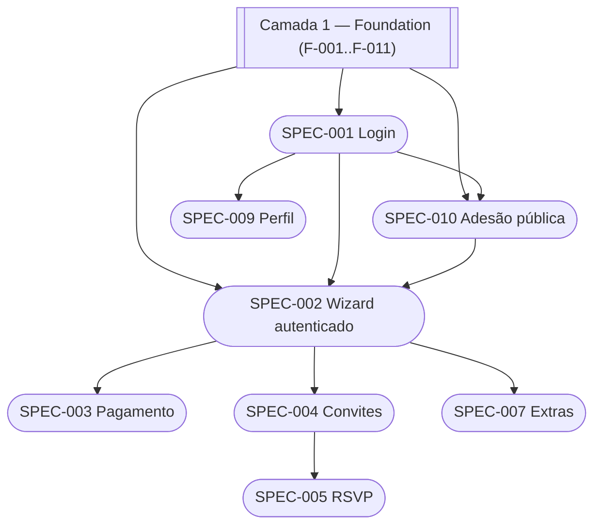

# Features — SPECs Unificadas BE + FE

Cada SPEC é um **documento vertical** que cobre uma funcionalidade completa do sistema — contrato de API, implementação Laravel, implementação React, testes (Pest + Gherkin) e critérios de aceite — em um único arquivo de referência.

Fontes primárias: [`prd/PLANEJAMENTO_BACKEND_APIV1.md`](../prd/PLANEJAMENTO_BACKEND_APIV1.md) · [`prd/PLANEJAMENTO_FRONTEND_REACT.md`](../prd/PLANEJAMENTO_FRONTEND_REACT.md) · [`frontend/09-TECHNICAL-DESIGN-CRITICAL-MODULES.md`](../frontend/09-TECHNICAL-DESIGN-CRITICAL-MODULES.md)

> **Nota:** esta pasta foi reorganizada em 2026-04-19. A estrutura agora tem 3 camadas. Ver [SPEC-RESTRUCTURE-PLAN](../SPEC-RESTRUCTURE-PLAN.md) para o mapa completo e o design doc em [`superpowers/specs/2026-04-19-*`](../superpowers/specs/2026-04-19-reorganizacao-specs-adesao-publica-design.md).

---

## Camada 1 — Foundation SPECs

Cobrem conceitos de domínio (Contrato, responsáveis, multi-formando, cálculo de parcelas, termos, gateway, auth, auditoria). **Devem ser consultadas antes** de escrever SPEC de feature.

| SPEC                                                       | Feature                              | Status | SPs |
| ---------------------------------------------------------- | ------------------------------------ | ------ | --- |
| [SPEC-F-001](foundation/SPEC-F-001-contrato-e-turma.md)    | Contrato e Turma                     | draft  | 5   |
| [SPEC-F-002](foundation/SPEC-F-002-responsaveis.md)        | Responsáveis (cadastro + financeiro) | stub   | 3   |
| [SPEC-F-003](foundation/SPEC-F-003-multi-formando.md)      | Multi-formando                       | stub   | 5   |
| [SPEC-F-004](foundation/SPEC-F-004-programacoes-valor.md)  | Programações de valor                | stub   | 5   |
| [SPEC-F-005](foundation/SPEC-F-005-descontos-condicoes.md) | Descontos e condições de pagamento   | stub   | 5   |
| [SPEC-F-006](foundation/SPEC-F-006-calculo-parcelas.md)    | Cálculo dinâmico de parcelas         | stub   | 8   |
| [SPEC-F-007](foundation/SPEC-F-007-termos-versionados.md)  | Termos versionados                   | stub   | 5   |
| [SPEC-F-008](foundation/SPEC-F-008-reajustes.md)           | Reajustes contratuais                | stub   | 3   |
| [SPEC-F-009](foundation/SPEC-F-009-gateway-pagamento.md)   | Gateway de pagamento (infra)         | stub   | 8   |
| [SPEC-F-010](foundation/SPEC-F-010-auth-authz.md)          | Auth & Authorization base            | draft  | 3   |
| [SPEC-F-011](foundation/SPEC-F-011-auditoria.md)           | Auditoria append-only                | stub   | 2   |

---

## Camada 2 — SPECs de Feature (existentes, em refactor)

Estes SPECs serão atualizados para consumir as Foundation SPECs acima. Ver [SPEC-RESTRUCTURE-PLAN](../SPEC-RESTRUCTURE-PLAN.md) §2.2.

| SPEC                                         | Feature                                    | Fase          | SPs | Status                                                                |
| -------------------------------------------- | ------------------------------------------ | ------------- | --- | --------------------------------------------------------------------- |
| [SPEC-001](SPEC-001-login.md)                | Login / Auth (Sanctum dual-mode)           | F1 — Fundação | 5   | refactor-pending                                                      |
| [SPEC-002](SPEC-002-wizard-adesao.md)        | Wizard de Adesão (7 etapas, autenticado)   | F3 — Portal   | 13  | refactor-pending                                                      |
| [SPEC-003](SPEC-003-financeiro-pagamento.md) | Financeiro + Pagamento (boleto/pix/cartão) | F3 — Portal   | 8   | refactor-pending                                                      |
| [SPEC-004](SPEC-004-convites-cotas.md)       | Convites + Cotas (individual + lote)       | F4 — Convites | 5   | refactor-pending                                                      |
| [SPEC-005](SPEC-005-rsvp-publico.md)         | RSVP Público (token mágico)                | F4 — Convites | 3   | refactor-pending                                                      |
| ~~SPEC-006~~                                 | ~~Mapa de Mesas (seating)~~                | —             | —   | **arquivada v1** — ver [BACKLOG_FUTURO](../roadmap/BACKLOG_FUTURO.md) |
| [SPEC-007](SPEC-007-extras.md)               | Extras (catálogo + pedido + estoque)       | F6 — Extras   | 5   | refactor-pending                                                      |
| ~~SPEC-008~~                                 | ~~Enquetes~~                               | —             | —   | **arquivada v1** — ver [BACKLOG_FUTURO](../roadmap/BACKLOG_FUTURO.md) |
| [SPEC-009](SPEC-009-perfil.md)               | Perfil (PATCH /me + senha)                 | F3 — Portal   | 3   | refactor-pending                                                      |

---

## Camada 3 — SPECs novas

| SPEC                                                   | Feature                                          | Fase        | SPs | Status      |
| ------------------------------------------------------ | ------------------------------------------------ | ----------- | --- | ----------- |
| [SPEC-010](SPEC-010-adesao-publica-codigo-contrato.md) | Adesão pública via código do contrato            | F3 — Portal | 52  | plan-ready  |
| [SPEC-011](SPEC-011-condicao-pagamento-composta.md)    | Condição de Pagamento Composta (Boleto + Cartão) | F3 — Portal | 8   | implemented |

> SPEC-010 v2.0.0 (2026-04-23): código público agora no Contrato (não na Turma). Plano completo em [implementation plan](../superpowers/plans/2026-04-19-adesao-publica-codigo-contrato-plan.md).
>
> SPEC-011 (2026-04-25): adiciona `tipo` em `condicoes_pagamento` (`normal`/`composta`). Adesão composta tem boletos + parcelas de cartão presenciais (sem boleto, sem 2ª via). Detalhes em [SPEC-011](SPEC-011-condicao-pagamento-composta.md).

---

## Grafo de dependências (simplificado)



---

## Estrutura padrão de cada SPEC

```
1. Resumo Executivo      → objetivo, escopo, SPs, fase
2. Visão Geral           → fluxo Mermaid, atores, pré-condições
3. Contrato de API       → endpoints, request/response, códigos HTTP
4. Backend Laravel       → models, migrations, services, jobs, policies
5. Frontend React        → pages, components, hooks, stores (Zustand)
6. Gates de Qualidade    → A (contrato) B (backend) C (frontend) D (integração) E (aceite)
7. Cenários Gherkin      → scenarios BDD (Given/When/Then)
8. Plano de Testes       → Pest (feature tests) + testes de integração
9. Blockers / Riscos     → dependências externas, decisões pendentes
10. Rastreabilidade      → ADRs referenciados, links para prd/ e architecture/
```

---

## Convenções SPEC

- **Idempotência:** mutações POST críticas usam `X-Idempotency-Key` (header obrigatório)
- **Dinheiro:** sempre em centavos (`int`) — nunca `float`
- **Enums:** backed enums PHP 8.1 (`StatusParcela`, `TipoExtra`, etc.)
- **Polling:** 5 s via `refetchInterval` TanStack Query (PIX)
- **Concorrência:** `FOR UPDATE SKIP LOCKED` no PostgreSQL (estoque; seating removido em v1)
- **Auth:** rotas públicas (`/rsvp`, `/adesao/publico`) usam `publicApi` sem `withCredentials`
