# SPEC-003 — Financeiro + Pagamento (boleto/pix/cartão)

> **Spec unificada backend + frontend.** Cobre o extrato financeiro do formando e o fluxo completo de pagamento de parcelas via boleto, PIX e cartão de crédito (gateway Itaú com mock/stub em MVP).
> Fontes: [09-TECHNICAL-DESIGN-CRITICAL-MODULES.md §3](../frontend/09-TECHNICAL-DESIGN-CRITICAL-MODULES.md) · [api-contract.md §2.5 e §8](../api/api-contract.md) · [PLANEJAMENTO_BACKEND_APIV1.md §8](../prd/PLANEJAMENTO_BACKEND_APIV1.md) · [07-DATA-CONTRACTS-AND-VIEW-MODELS.md](../frontend/07-DATA-CONTRACTS-AND-VIEW-MODELS.md)

---

## 0. Resumo executivo

O formando acessa `/portal/financeiro` e visualiza seu extrato financeiro paginado por cursor, com filtros por adesão e período. Ao clicar em "Pagar" em uma parcela pendente, é direcionado para `/portal/pagamento/$parcela_ulid`, onde escolhe o método (boleto, PIX ou cartão), dispara `POST /pagamentos/intents` com `X-Idempotency-Key` obrigatório e aguarda confirmação.

- **PIX:** QR Code + código copia-e-cola + polling a cada 5s enquanto `status=pendente`.
- **Boleto:** linha digitável + link para PDF + polling a cada 30s.
- **Cartão:** formulário com dados tokenizados pelo gateway (nunca PAN cru no estado/log) + resposta síncrona (aprovado/recusado em até 10s).

Confirmação via webhook `POST /webhooks/pagamentos/{provider}` (HMAC-SHA256 obrigatório). Após `status=pago` detectado pelo polling, o comprovante é exibido e o extrato é invalidado no cache.

**Princípio não negociável:** `PAN de cartão jamais transita pelo backend da ArtFinal` — apenas o token do provedor é armazenado.

---

## 1. Visão da feature

> **Nota — Condição Composta (SPEC-011):** Adesões originadas em condições de pagamento `tipo='composta'` produzem uma lista de parcelas mista (boletos + parcelas de cartão). As parcelas de cartão são marcadas com `permite_emitir_boleto=false` — o portal **não exibe** botões "Emitir boleto" / "2ª via" para elas, e o pagamento dessas parcelas é combinado presencialmente até que o fluxo de pagamento online do bloco-cartão seja liberado. Boletos da mesma adesão seguem o fluxo normal descrito abaixo. Detalhes em [SPEC-011](./SPEC-011-condicao-pagamento-composta.md).

### 1.1 Jornada macro

```mermaid
flowchart LR
    A[/portal/financeiro] -->|clica Pagar| B[/portal/pagamento/$ulid]
    B -->|escolhe método| C{método}
    C -->|pix| D[POST /pagamentos/intents\nmetodo=pix]
    C -->|boleto| E[POST /pagamentos/intents\nmetodo=boleto]
    C -->|cartão| F[POST /pagamentos/intents\nmetodo=cartao\npayload=token]
    D -->|201 + qrcode| G[PixDisplay\npolling 5s]
    E -->|201 + linha_digitavel| H[BoletoDisplay\npolling 30s]
    F -->|201 aprovado| I[Aprovado → Comprovante]
    F -->|201 recusado| J[Recusado → Retry]
    G -->|polling status=pago| K[ComprovanteCard]
    H -->|polling status=pago| K
    G -->|polling > 10min| L[Timeout → E-mail de confirmação]
    H -->|polling > 10min| L
    K -->|invalidate extrato| A
```

### 1.2 Jornada detalhada por método

```mermaid
flowchart TD
    subgraph PIX
        P1[Formando clica Pagar] --> P2[Seleciona PIX]
        P2 --> P3[POST /pagamentos/intents\nX-Idempotency-Key obrigatório]
        P3 -->|201| P4[Exibe QRCode + Código Copia-e-cola]
        P4 --> P5[Polling GET /pagamentos/:ulid\na cada 5s]
        P5 -->|status=pago| P6[Exibe Comprovante\nInvalida cache extrato]
        P5 -->|expirou QR ~30min| P7[Botão Gerar Novo QR\nNova idempotency key]
        P5 -->|> 10min polling| P8[Toast Aguarde e-mail]
    end

    subgraph BOLETO
        B1[Formando clica Pagar] --> B2[Seleciona Boleto]
        B2 --> B3[POST /pagamentos/intents\nX-Idempotency-Key obrigatório]
        B3 -->|201| B4[Exibe Linha Digitável + Link PDF]
        B4 --> B5[Polling GET /pagamentos/:ulid\na cada 30s]
        B5 -->|status=pago| B6[Exibe Comprovante]
        B5 -->|vencimento passado| B7[Toast Boleto vencido\nGerar novo]
    end

    subgraph CARTAO
        C1[Formando clica Pagar] --> C2[Seleciona Cartão]
        C2 --> C3[Formulário RHF+Zod\nDados tokenizados pelo SDK do gateway]
        C3 --> C4[POST /pagamentos/intents\npayload.token=TOKEN_GATEWAY]
        C4 -->|201 aprovado| C5[Exibe Comprovante Imediato]
        C4 -->|201 recusado| C6[Toast Cartão recusado\nTente outro método]
        C4 -->|422| C7[Erros inline no formulário]
    end
```



### 1.3 Atores

| Ator                   | Ação                                                                        |
| ---------------------- | --------------------------------------------------------------------------- |
| Formando               | Visualiza extrato, seleciona parcela e efetua pagamento (jornada primária). |
| Responsável financeiro | Usa as mesmas credenciais do formando (MVP — conta compartilhada).          |
| Gateway Itaú           | Recebe intent, gera QR/boleto/token; notifica via webhook.                  |
| Webhook (backend)      | Recebe notificação de pagamento e atualiza status da parcela.               |
| Admin (backoffice)     | Fora do escopo desta SPEC — acessa via Blade/Livewire.                      |

### 1.4 Valor

- Entrega a **capacidade de pagamento** do portal — módulo que gera receita direta.
- Garante que dados de cartão não transitam pela ArtFinal (PCI compliance).
- Desacopla lógica de pagamento do HTTP via `GatewayInterface` — troca de gateway sem reescrever regra de negócio.
- Suporta retentativa idempotente: mesmo `X-Idempotency-Key` por `parcela_ulid` garante exatamente uma cobrança.

### 1.5 Escopo

**In:** extrato paginado por cursor, pagamento de parcela de adesão, boleto/PIX/cartão via mock Itaú, polling de status, webhook de confirmação (HMAC), comprovante.

**Out:** pagamento de pedido extra (fluxo similar mas em `POST /extras/pedidos` — SPEC-004), estorno/chargeback UI (admin-side), split de pagamento, parcelamento no cartão (pós-MVP), 3DS (pós-MVP), geração de boleto físico por correio.

---

## 2. Contrato da API

### 2.1 `GET /api/v1/me/extrato`

- **Route name:** `api.v1.me.extrato`
- **Middlewares:** `auth:sanctum` · `throttle:api`
- **Auth:** obrigatória (Sanctum cookie ou bearer)
- **Idempotência:** não exigida (GET)

**Query parameters:**

| Parâmetro             | Tipo       | Regra                                                  |
| --------------------- | ---------- | ------------------------------------------------------ |
| `filter[adesao_id]`   | ULID       | `nullable\|string\|size:26`                            |
| `filter[periodo_de]`  | YYYY-MM-DD | `nullable\|date`                                       |
| `filter[periodo_ate]` | YYYY-MM-DD | `nullable\|date\|after_or_equal:periodo_de`            |
| `sort`                | string     | `nullable\|in:-data_movimento,data_movimento`          |
| `page[size]`          | integer    | `nullable\|integer\|min:1\|max:100` (default: 50)      |
| `page[cursor]`        | string     | `nullable\|string` (opaco — vem de `meta.next_cursor`) |

**Response 200:**

```json
{
    "data": [
        {
            "id": "01J...",
            "tipo": "parcela_paga",
            "data_movimento": "2026-03-05T00:00:00-03:00",
            "valor_centavos": 150000,
            "descricao": "Parcela 3/10 — Pacote Premium",
            "referencia": { "tipo": "parcela", "id": "01J..." },
            "links": {
                "self": "https://api.portalartfinal.com.br/api/v1/me/extrato/01J...",
                "comprovante": "https://api.portalartfinal.com.br/api/v1/pagamentos/01J..."
            }
        }
    ],
    "meta": {
        "per_page": 50,
        "next_cursor": "eyJpZCI6IjAxSiJ9",
        "prev_cursor": null
    },
    "links": {
        "self": "https://api.portalartfinal.com.br/api/v1/me/extrato",
        "next": "https://api.portalartfinal.com.br/api/v1/me/extrato?page[cursor]=eyJ...",
        "prev": null
    }
}
```

### 2.2 `GET /api/v1/me/adesoes`

- **Route name:** `api.v1.me.adesoes`
- **Middlewares:** `auth:sanctum` · `throttle:api`

**Response 200 (extrato de adesões com parcelas_resumo — usado para filtro e dashboard):**

```json
{
    "data": [
        {
            "id": "01J...",
            "status": "ativa",
            "evento": { "id": "01J...", "slug": "baile-med-usp-2026" },
            "pacote": { "id": "01J...", "nome": "Premium" },
            "valor_total_centavos": 1500000,
            "qtd_parcelas": 10,
            "parcelas_resumo": {
                "total": 10,
                "pagas": 3,
                "pendentes": 7,
                "vencidas": 0
            },
            "links": {
                "extrato": "https://api.portalartfinal.com.br/api/v1/me/extrato?filter[adesao_id]=01J..."
            }
        }
    ]
}
```

### 2.3 `POST /api/v1/pagamentos/intents`

- **Route name:** `api.v1.pagamentos.intents.store`
- **Middlewares:** `auth:sanctum` · `idempotent` · `throttle:api`
- **Header obrigatório:** `X-Idempotency-Key: <ULID ou UUID ≤ 80 chars>`
- **Policy:** `PagamentoPolicy::iniciar(user, parcela)`

**Request:**

```json
{
    "origem_tipo": "parcela",
    "origem_ulid": "01J...",
    "metodo": "pix",
    "payload": {}
}
```

Para cartão:

```json
{
    "origem_tipo": "parcela",
    "origem_ulid": "01J...",
    "metodo": "cartao",
    "payload": {
        "token": "tok_itau_4242424242424242",
        "parcelas_cartao": 1
    }
}
```

**Validação:**

| Campo                     | Regra                                        |
| ------------------------- | -------------------------------------------- |
| `origem_tipo`             | `required\|in:parcela,pedido_extra`          |
| `origem_ulid`             | `required\|string\|size:26`                  |
| `metodo`                  | `required\|in:boleto,pix,cartao`             |
| `payload`                 | `sometimes\|array`                           |
| `payload.token`           | `required_if:metodo,cartao\|string\|max:200` |
| `payload.parcelas_cartao` | `sometimes\|integer\|min:1\|max:12`          |

**Response 201 — PIX:**

```json
{
    "data": {
        "id": "01J...",
        "status": "pendente",
        "metodo": "pix",
        "valor_centavos": 150000,
        "pix": {
            "qrcode_base64": "iVBORw0KGgoAAAANS...",
            "codigo_copia_cola": "00020126580014br.gov.bcb.pix...",
            "expira_em": "2026-04-19T15:00:00-03:00"
        },
        "boleto": null,
        "cartao": null,
        "links": {
            "self": "https://api.portalartfinal.com.br/api/v1/pagamentos/01J..."
        }
    }
}
```

**Response 201 — Boleto:**

```json
{
    "data": {
        "id": "01J...",
        "status": "pendente",
        "metodo": "boleto",
        "valor_centavos": 150000,
        "pix": null,
        "boleto": {
            "linha_digitavel": "23793.38128 60024.012345 67890.123456 7 00000150000000",
            "pdf_url": "https://storage.portalartfinal.com.br/boletos/01J....pdf?signed=...",
            "vence_em": "2026-04-22T23:59:59-03:00"
        },
        "cartao": null,
        "links": {
            "self": "https://api.portalartfinal.com.br/api/v1/pagamentos/01J..."
        }
    }
}
```

**Response 201 — Cartão aprovado:**

```json
{
    "data": {
        "id": "01J...",
        "status": "pago",
        "metodo": "cartao",
        "valor_centavos": 150000,
        "pix": null,
        "boleto": null,
        "cartao": {
            "resultado": "aprovado",
            "ultimos_quatro": "4242",
            "bandeira": "visa"
        },
        "pago_em": "2026-04-19T14:32:00-03:00",
        "comprovante_url": "https://storage.portalartfinal.com.br/comprovantes/01J....pdf?signed=...",
        "links": {
            "self": "https://api.portalartfinal.com.br/api/v1/pagamentos/01J..."
        }
    }
}
```

**Erros:**

| Código HTTP | `error`                 | Significado                                         |
| ----------- | ----------------------- | --------------------------------------------------- |
| 400         | `MissingIdempotencyKey` | Header `X-Idempotency-Key` ausente                  |
| 404         | `NotFound`              | `origem_ulid` não existe ou não pertence ao usuário |
| 409         | `PagamentoDuplicado`    | Parcela já possui pagamento `pago` associado        |
| 409         | `IdempotencyConflict`   | Key reutilizada com payload diferente               |
| 422         | `ValidationError`       | Payload inválido (`details.fields`)                 |
| 503         | `GatewayIndisponivel`   | Gateway Itaú indisponível (`details.retry_after`)   |

### 2.4 `GET /api/v1/pagamentos/{ulid}`

- **Route name:** `api.v1.pagamentos.show`
- **Middlewares:** `auth:sanctum` · `throttle:api`
- **Usado para:** polling de status (PIX: a cada 5s; boleto: a cada 30s)

**Response 200:**

```json
{
    "data": {
        "id": "01J...",
        "status": "pago",
        "metodo": "pix",
        "valor_centavos": 150000,
        "pago_em": "2026-04-19T14:32:00-03:00",
        "origem": {
            "tipo": "parcela",
            "id": "01J...",
            "descricao": "Parcela 3/10 — Pacote Premium"
        },
        "comprovante_url": "https://storage.portalartfinal.com.br/comprovantes/01J....pdf?signed=...",
        "links": {
            "self": "https://api.portalartfinal.com.br/api/v1/pagamentos/01J..."
        }
    }
}
```

**Status possíveis:** `pendente` · `pago` · `cancelado` · `expirado` · `falho` · `estornado`

### 2.5 `POST /webhooks/pagamentos/{provider}` (backend apenas)

- **Route name:** `webhook.pagamentos.receive`
- **Path:** `{provider}` ∈ `itau | mock`
- **Auth:** nenhuma (validação HMAC via `X-Signature`)
- **Middlewares:** `AttachRequestId` (sem CSRF)
- **Rate limit:** `webhook` (600/min por IP)

**Headers obrigatórios:**

```
X-Signature: <hex sha256 hmac do body bruto com WEBHOOK_SECRET>
```

**Body (Itaú):**

```json
{
    "tipo": "pagamento.confirmado",
    "evento": { "id": "ITAU-EVT-20260419-0007" },
    "cobranca": { "id": "ITAU-20260419-0001", "status": "pago" },
    "valor_centavos": 150000,
    "pago_em": "2026-04-19T14:32:11-03:00",
    "metadata": { "pagamento_ulid": "01J..." }
}
```

**Respostas:** `202 accepted` (novo) · `200 already_processed` · `401 invalid signature`

### 2.6 Headers obrigatórios por endpoint

| Header              | Direção | Endpoints                                    |
| ------------------- | ------- | -------------------------------------------- |
| `X-Request-Id`      | req/res | Todos                                        |
| `X-XSRF-TOKEN`      | req     | Mutações POST (automático pelo Axios)        |
| `X-Idempotency-Key` | req     | `POST /pagamentos/intents` — **obrigatório** |
| `X-Signature`       | req     | `POST /webhooks/pagamentos/{provider}`       |
| `Content-Type`      | req     | `application/json`                           |
| `Accept`            | req     | `application/json`                           |

---

## 3. Backend — Laravel 13

### 3.1 Arquivos a criar/modificar

| Arquivo                                                          | Ação      | Responsabilidade                                                         |
| ---------------------------------------------------------------- | --------- | ------------------------------------------------------------------------ |
| `app/Http/Controllers/Api/V1/Pagamentos/PagamentoController.php` | Criar     | `intents()` + `show()`                                                   |
| `app/Http/Controllers/Webhooks/PagamentoWebhookController.php`   | Criar     | `receive()` — persiste `WebhookEvento` + dispara Job                     |
| `app/Http/Requests/Api/V1/Pagamentos/PagamentoIntentRequest.php` | Criar     | Validação com condicional por `metodo`                                   |
| `app/Http/Resources/V1/ExtratoResource.php`                      | Criar     | Serialização de item de extrato                                          |
| `app/Http/Resources/V1/PagamentoIntentResource.php`              | Criar     | Serialização do pagamento criado (inclui pix/boleto/cartao condicionais) |
| `app/Actions/Pagamentos/CriarPagamentoIntentAction.php`          | Criar     | Orquestra gateway + cria `Pagamento` + emite `PagamentoIniciado`         |
| `app/Actions/Pagamentos/ProcessarWebhookPagamentoAction.php`     | Criar     | Resolve `parcela/pedido_extra` + chama `ConfirmarPagamentoAction`        |
| `app/Services/Gateway/Contracts/GatewayInterface.php`            | Criar     | Contrato PHP para qualquer gateway                                       |
| `app/Services/Gateway/Drivers/GatewayMockService.php`            | Criar     | Implementação stub para MVP (retorna dados fake válidos)                 |
| `app/Services/Gateway/Drivers/ItauGatewayService.php`            | Criar     | Implementação real (esqueleto — integração completa em F3 final)         |
| `app/Services/Gateway/GatewayManager.php`                        | Criar     | Factory que resolve driver por `.env`                                    |
| `app/Providers/GatewayServiceProvider.php`                       | Modificar | Bind `GatewayInterface` → driver configurado                             |
| `app/Data/Pagamentos/PagamentoIntentData.php`                    | Criar     | DTO de entrada da action                                                 |
| `app/Data/Pagamentos/WebhookPayloadData.php`                     | Criar     | DTO de payload do webhook                                                |
| `app/Data/Pagamentos/GatewayResponseData.php`                    | Criar     | DTO de resposta do gateway (pix/boleto/cartao)                           |
| `app/Enums/Pagamentos/StatusPagamento.php`                       | Criar     | `PENDENTE\|PAGO\|CANCELADO\|EXPIRADO\|FALHO\|ESTORNADO` com labels       |
| `app/Enums/Pagamentos/MetodoPagamento.php`                       | Criar     | `BOLETO\|PIX\|CARTAO` com labels                                         |
| `app/Jobs/Webhooks/ProcessarWebhookPagamentoJob.php`             | Criar     | Chama `ProcessarWebhookPagamentoAction` na fila `webhooks`               |
| `app/Jobs/Pdf/GerarComprovantePagamentoJob.php`                  | Criar     | Gera PDF e salva em Storage (fila `pdf`)                                 |
| `routes/api/v1.php`                                              | Modificar | Registrar rotas de pagamento                                             |
| `routes/webhook.php`                                             | Modificar | Registrar webhook sem CSRF                                               |
| `tests/Feature/Api/V1/Pagamentos/PagamentoIntentTest.php`        | Criar     | 10+ cenários Pest                                                        |
| `tests/Feature/Webhooks/PagamentoWebhookTest.php`                | Criar     | 4+ cenários Pest                                                         |

### 3.2 `GatewayInterface`

```php
<?php
declare(strict_types=1);

namespace App\Services\Gateway\Contracts;

use App\Data\Pagamentos\GatewayResponseData;
use App\Enums\Pagamentos\MetodoPagamento;

interface GatewayInterface
{
    public function criarCobranca(
        string $referencia,
        int $valorCentavos,
        MetodoPagamento $metodo,
        array $payload = [],
    ): GatewayResponseData;

    public function consultarCobranca(string $gatewayId): GatewayResponseData;

    public function validarAssinaturaWebhook(string $body, string $assinatura): bool;
}
```

### 3.3 `GatewayMockService` (MVP)

```php
<?php
declare(strict_types=1);

namespace App\Services\Gateway\Drivers;

use App\Data\Pagamentos\GatewayResponseData;
use App\Enums\Pagamentos\MetodoPagamento;
use App\Services\Gateway\Contracts\GatewayInterface;
use Illuminate\Support\Str;

final class GatewayMockService implements GatewayInterface
{
    public function criarCobranca(
        string $referencia,
        int $valorCentavos,
        MetodoPagamento $metodo,
        array $payload = [],
    ): GatewayResponseData {
        return match ($metodo) {
            MetodoPagamento::PIX => new GatewayResponseData(
                gatewayId: 'MOCK-' . Str::ulid(),
                status: 'pendente',
                pix: [
                    'qrcode_base64' => base64_encode('mock_qr_' . $referencia),
                    'codigo_copia_cola' => '00020126580014br.gov.bcb.pix.mock.' . $referencia,
                    'expira_em' => now()->addMinutes(30)->toIso8601String(),
                ],
            ),
            MetodoPagamento::BOLETO => new GatewayResponseData(
                gatewayId: 'MOCK-' . Str::ulid(),
                status: 'pendente',
                boleto: [
                    'linha_digitavel' => '23793.38128 60024.012345 67890.123456 7 ' . str_pad((string) $valorCentavos, 15, '0', STR_PAD_LEFT),
                    'pdf_url' => 'https://mock.gateway/boletos/' . $referencia . '.pdf',
                    'vence_em' => now()->addDays(3)->toIso8601String(),
                ],
            ),
            MetodoPagamento::CARTAO => new GatewayResponseData(
                gatewayId: 'MOCK-' . Str::ulid(),
                status: str_contains($payload['token'] ?? '', 'recusado') ? 'recusado' : 'aprovado',
                cartao: [
                    'resultado' => str_contains($payload['token'] ?? '', 'recusado') ? 'recusado' : 'aprovado',
                    'ultimos_quatro' => '4242',
                    'bandeira' => 'visa',
                ],
            ),
        };
    }

    public function consultarCobranca(string $gatewayId): GatewayResponseData
    {
        // Mock: sempre retorna pendente (webhook simulado pelo seeder/test)
        return new GatewayResponseData(gatewayId: $gatewayId, status: 'pendente');
    }

    public function validarAssinaturaWebhook(string $body, string $assinatura): bool
    {
        $secret = config('services.gateway.webhook_secret', 'mock-secret');
        return hash_equals(
            hash_hmac('sha256', $body, $secret),
            $assinatura,
        );
    }
}
```

### 3.4 `PagamentoIntentRequest`

```php
<?php
declare(strict_types=1);

namespace App\Http\Requests\Api\V1\Pagamentos;

use App\Enums\Pagamentos\MetodoPagamento;
use Illuminate\Foundation\Http\FormRequest;
use Illuminate\Validation\Rule;

final class PagamentoIntentRequest extends FormRequest
{
    public function authorize(): bool
    {
        return true; // Policy verificada no controller
    }

    public function rules(): array
    {
        return [
            'origem_tipo'         => ['required', 'string', Rule::in(['parcela', 'pedido_extra'])],
            'origem_ulid'         => ['required', 'string', 'size:26'],
            'metodo'              => ['required', 'string', Rule::in(MetodoPagamento::values())],
            'payload'             => ['sometimes', 'array'],
            'payload.token'       => ['required_if:metodo,cartao', 'nullable', 'string', 'max:200'],
            'payload.parcelas_cartao' => ['sometimes', 'integer', 'min:1', 'max:12'],
        ];
    }

    public function messages(): array
    {
        return [
            'origem_tipo.in'      => 'Tipo de origem inválido. Valores aceitos: parcela, pedido_extra.',
            'origem_ulid.size'    => 'O identificador da origem deve ter 26 caracteres (ULID).',
            'metodo.required'     => 'Informe o método de pagamento.',
            'metodo.in'           => 'Método de pagamento inválido. Valores aceitos: boleto, pix, cartao.',
            'payload.token.required_if' => 'Token do cartão obrigatório para pagamento com cartão.',
        ];
    }
}
```

### 3.5 `CriarPagamentoIntentAction`

```php
<?php
declare(strict_types=1);

namespace App\Actions\Pagamentos;

use App\Data\Pagamentos\GatewayResponseData;
use App\Data\Pagamentos\PagamentoIntentData;
use App\Enums\Pagamentos\MetodoPagamento;
use App\Enums\Pagamentos\StatusPagamento;
use App\Events\Pagamentos\PagamentoIniciado;
use App\Exceptions\Domain\InvariantViolationException;
use App\Models\Comercial\Pagamento;
use App\Models\Comercial\Parcela;
use App\Services\Gateway\Contracts\GatewayInterface;
use Illuminate\Support\Facades\DB;

final class CriarPagamentoIntentAction
{
    public function __construct(
        private readonly GatewayInterface $gateway,
    ) {}

    public function execute(PagamentoIntentData $data): Pagamento
    {
        $origem = $this->resolverOrigem($data->origemTipo, $data->origemUlid, $data->userId);

        if ($this->jaExistePagamentoPago($origem)) {
            throw new InvariantViolationException(
                'PagamentoDuplicado',
                'Esta parcela já possui pagamento confirmado.',
            );
        }

        return DB::transaction(function () use ($data, $origem): Pagamento {
            $gatewayResponse = $this->gateway->criarCobranca(
                referencia: $origem->ulid,
                valorCentavos: $origem->valor_centavos,
                metodo: MetodoPagamento::from($data->metodo),
                payload: $data->payload,
            );

            $statusInicial = $gatewayResponse->status === 'aprovado'
                ? StatusPagamento::PAGO
                : StatusPagamento::PENDENTE;

            $pagamento = Pagamento::create([
                'ulid'           => \Str::ulid(),
                'origem_tipo'    => $data->origemTipo,
                'origem_id'      => $origem->id,
                'metodo'         => $data->metodo,
                'status'         => $statusInicial,
                'valor_centavos' => $origem->valor_centavos,
                'gateway_id'     => $gatewayResponse->gatewayId,
                'gateway_data'   => $this->montarGatewayData($gatewayResponse, $data->metodo),
                'pago_em'        => $statusInicial === StatusPagamento::PAGO ? now() : null,
            ]);

            event(new PagamentoIniciado($pagamento));

            return $pagamento;
        });
    }

    private function resolverOrigem(string $tipo, string $ulid, int $userId): mixed
    {
        return match ($tipo) {
            'parcela' => Parcela::whereHas('adesao', fn($q) => $q->where('portal_user_id', $userId))
                ->where('ulid', $ulid)
                ->firstOrFail(),
            default => throw new InvariantViolationException('OrigemInvalida', 'Tipo de origem não suportado.'),
        };
    }

    private function jaExistePagamentoPago(mixed $origem): bool
    {
        return Pagamento::where('origem_tipo', 'parcela')
            ->where('origem_id', $origem->id)
            ->where('status', StatusPagamento::PAGO->value)
            ->exists();
    }

    private function montarGatewayData(GatewayResponseData $response, string $metodo): array
    {
        return match ($metodo) {
            'pix'    => ['pix' => $response->pix],
            'boleto' => ['boleto' => $response->boleto],
            'cartao' => ['cartao' => $response->cartao], // NUNCA PAN — apenas token/resultado
        };
    }
}
```

### 3.6 `PagamentoController`

```php
<?php
declare(strict_types=1);

namespace App\Http\Controllers\Api\V1\Pagamentos;

use App\Actions\Pagamentos\CriarPagamentoIntentAction;
use App\Data\Pagamentos\PagamentoIntentData;
use App\Http\Controllers\Controller;
use App\Http\Requests\Api\V1\Pagamentos\PagamentoIntentRequest;
use App\Http\Resources\V1\PagamentoIntentResource;
use App\Models\Comercial\Pagamento;
use Illuminate\Http\JsonResponse;
use Illuminate\Http\Request;

final class PagamentoController extends Controller
{
    public function intents(
        PagamentoIntentRequest $request,
        CriarPagamentoIntentAction $action,
    ): JsonResponse {
        $pagamento = $action->execute(PagamentoIntentData::fromRequest($request));

        return (new PagamentoIntentResource($pagamento))
            ->response()
            ->setStatusCode(201)
            ->header('Location', route('api.v1.pagamentos.show', $pagamento));
    }

    public function show(Request $request, Pagamento $pagamento): JsonResponse
    {
        $this->authorize('view', $pagamento);

        return (new PagamentoIntentResource($pagamento))->response();
    }
}
```

### 3.7 `StatusPagamento` enum

```php
<?php
declare(strict_types=1);

namespace App\Enums\Pagamentos;

enum StatusPagamento: string
{
    case PENDENTE   = 'pendente';
    case PAGO       = 'pago';
    case CANCELADO  = 'cancelado';
    case EXPIRADO   = 'expirado';
    case FALHO      = 'falho';
    case ESTORNADO  = 'estornado';

    public function label(): string
    {
        return match ($this) {
            self::PENDENTE  => 'Aguardando Pagamento',
            self::PAGO      => 'Pago',
            self::CANCELADO => 'Cancelado',
            self::EXPIRADO  => 'Expirado',
            self::FALHO     => 'Falhou',
            self::ESTORNADO => 'Estornado',
        };
    }

    public function color(): string
    {
        return match ($this) {
            self::PENDENTE  => 'yellow',
            self::PAGO      => 'green',
            self::CANCELADO => 'gray',
            self::EXPIRADO  => 'orange',
            self::FALHO     => 'red',
            self::ESTORNADO => 'purple',
        };
    }

    public function estaFinalizado(): bool
    {
        return in_array($this, [self::PAGO, self::CANCELADO, self::EXPIRADO, self::FALHO, self::ESTORNADO], true);
    }

    public static function values(): array
    {
        return array_column(self::cases(), 'value');
    }
}
```

### 3.8 `PagamentoWebhookController`

```php
<?php
declare(strict_types=1);

namespace App\Http\Controllers\Webhooks;

use App\Http\Controllers\Controller;
use App\Jobs\Webhooks\ProcessarWebhookPagamentoJob;
use App\Models\Webhook\WebhookEvento;
use App\Services\Gateway\Contracts\GatewayInterface;
use Illuminate\Http\JsonResponse;
use Illuminate\Http\Request;

final class PagamentoWebhookController extends Controller
{
    public function receive(Request $request, string $provider, GatewayInterface $gateway): JsonResponse
    {
        $rawBody = $request->getContent();
        $assinatura = $request->header('X-Signature', '');

        if (! $gateway->validarAssinaturaWebhook($rawBody, $assinatura)) {
            return response()->json([
                'error'      => 'invalid signature',
                'message'    => 'Assinatura HMAC divergente.',
                'details'    => null,
                'request_id' => $request->header('X-Request-Id'),
                'timestamp'  => now()->toIso8601String(),
            ], 401);
        }

        $payload = $request->json()->all();
        $eventoId = data_get($payload, 'evento.id');

        /** @var WebhookEvento $evento */
        [$evento, $created] = WebhookEvento::firstOrCreate(
            ['evento_id' => $eventoId, 'provider' => $provider],
            ['payload' => $payload, 'status' => 'recebido'],
        );

        if (! $created) {
            return response()->json(['status' => 'already_processed']);
        }

        ProcessarWebhookPagamentoJob::dispatch($evento)->onQueue('webhooks');

        return response()->json(['status' => 'accepted'], 202);
    }
}
```

### 3.9 Testes Pest (mínimo obrigatório — 14 cenários)

```php
// tests/Feature/Api/V1/Pagamentos/PagamentoIntentTest.php

it('cria intent pix com status pendente e retorna qrcode', function () {
    $user = PortalUser::factory()->create();
    $parcela = Parcela::factory()->pendente()->paraUsuario($user)->create();

    $response = $this->actingAs($user, 'sanctum')
        ->withHeader('X-Idempotency-Key', (string) \Str::ulid())
        ->postJson('/api/v1/pagamentos/intents', [
            'origem_tipo' => 'parcela',
            'origem_ulid' => $parcela->ulid,
            'metodo'      => 'pix',
        ]);

    $response->assertCreated()
        ->assertJsonPath('data.status', 'pendente')
        ->assertJsonPath('data.metodo', 'pix')
        ->assertJsonStructure(['data' => ['pix' => ['qrcode_base64', 'codigo_copia_cola', 'expira_em']]]);
});

it('cria intent boleto com linha digitável', function () {
    $user = PortalUser::factory()->create();
    $parcela = Parcela::factory()->pendente()->paraUsuario($user)->create();

    $response = $this->actingAs($user, 'sanctum')
        ->withHeader('X-Idempotency-Key', (string) \Str::ulid())
        ->postJson('/api/v1/pagamentos/intents', [
            'origem_tipo' => 'parcela',
            'origem_ulid' => $parcela->ulid,
            'metodo'      => 'boleto',
        ]);

    $response->assertCreated()
        ->assertJsonPath('data.status', 'pendente')
        ->assertJsonStructure(['data' => ['boleto' => ['linha_digitavel', 'pdf_url', 'vence_em']]]);
});

it('cria intent cartão aprovado e retorna status pago imediatamente', function () {
    $user = PortalUser::factory()->create();
    $parcela = Parcela::factory()->pendente()->paraUsuario($user)->create();

    $response = $this->actingAs($user, 'sanctum')
        ->withHeader('X-Idempotency-Key', (string) \Str::ulid())
        ->postJson('/api/v1/pagamentos/intents', [
            'origem_tipo'    => 'parcela',
            'origem_ulid'    => $parcela->ulid,
            'metodo'         => 'cartao',
            'payload'        => ['token' => 'tok_mock_aprovado'],
        ]);

    $response->assertCreated()
        ->assertJsonPath('data.status', 'pago')
        ->assertJsonPath('data.cartao.resultado', 'aprovado');
});

it('cria intent cartão recusado e retorna status falho', function () {
    $user = PortalUser::factory()->create();
    $parcela = Parcela::factory()->pendente()->paraUsuario($user)->create();

    $response = $this->actingAs($user, 'sanctum')
        ->withHeader('X-Idempotency-Key', (string) \Str::ulid())
        ->postJson('/api/v1/pagamentos/intents', [
            'origem_tipo' => 'parcela',
            'origem_ulid' => $parcela->ulid,
            'metodo'      => 'cartao',
            'payload'     => ['token' => 'tok_mock_recusado'],
        ]);

    $response->assertCreated()
        ->assertJsonPath('data.cartao.resultado', 'recusado');
});

it('retorna 409 PagamentoDuplicado se parcela já está paga', function () {
    $user = PortalUser::factory()->create();
    $parcela = Parcela::factory()->paga()->paraUsuario($user)->create();

    $response = $this->actingAs($user, 'sanctum')
        ->withHeader('X-Idempotency-Key', (string) \Str::ulid())
        ->postJson('/api/v1/pagamentos/intents', [
            'origem_tipo' => 'parcela',
            'origem_ulid' => $parcela->ulid,
            'metodo'      => 'pix',
        ]);

    $response->assertConflict()
        ->assertJsonPath('error', 'PagamentoDuplicado');
});

it('retorna 404 se parcela não pertence ao usuário autenticado', function () {
    $user = PortalUser::factory()->create();
    $outraParcela = Parcela::factory()->pendente()->create();

    $this->actingAs($user, 'sanctum')
        ->withHeader('X-Idempotency-Key', (string) \Str::ulid())
        ->postJson('/api/v1/pagamentos/intents', [
            'origem_tipo' => 'parcela',
            'origem_ulid' => $outraParcela->ulid,
            'metodo'      => 'pix',
        ])
        ->assertNotFound();
});

it('retorna 422 com método inválido', function () {
    $user = PortalUser::factory()->create();
    $parcela = Parcela::factory()->pendente()->paraUsuario($user)->create();

    $this->actingAs($user, 'sanctum')
        ->withHeader('X-Idempotency-Key', (string) \Str::ulid())
        ->postJson('/api/v1/pagamentos/intents', [
            'origem_tipo' => 'parcela',
            'origem_ulid' => $parcela->ulid,
            'metodo'      => 'transferencia',
        ])
        ->assertUnprocessable()
        ->assertJsonPath('error', 'ValidationError');
});

it('garante idempotência: segunda chamada com mesma key retorna mesmo pagamento', function () {
    $user = PortalUser::factory()->create();
    $parcela = Parcela::factory()->pendente()->paraUsuario($user)->create();
    $key = (string) \Str::ulid();

    $payload = ['origem_tipo' => 'parcela', 'origem_ulid' => $parcela->ulid, 'metodo' => 'pix'];

    $r1 = $this->actingAs($user, 'sanctum')
        ->withHeader('X-Idempotency-Key', $key)
        ->postJson('/api/v1/pagamentos/intents', $payload);

    $r2 = $this->actingAs($user, 'sanctum')
        ->withHeader('X-Idempotency-Key', $key)
        ->postJson('/api/v1/pagamentos/intents', $payload);

    expect($r1->json('data.id'))->toBe($r2->json('data.id'));
    expect(Pagamento::count())->toBe(1);
});

it('GET /pagamentos/:ulid retorna status do polling', function () {
    $user = PortalUser::factory()->create();
    $pagamento = Pagamento::factory()->pendente()->paraUsuario($user)->create();

    $this->actingAs($user, 'sanctum')
        ->getJson("/api/v1/pagamentos/{$pagamento->ulid}")
        ->assertOk()
        ->assertJsonPath('data.status', 'pendente');
});

it('GET /me/extrato retorna lista paginada por cursor', function () {
    $user = PortalUser::factory()->create();
    Parcela::factory()->count(5)->paga()->paraUsuario($user)->create();

    $response = $this->actingAs($user, 'sanctum')
        ->getJson('/api/v1/me/extrato?page[size]=3');

    $response->assertOk()
        ->assertJsonCount(3, 'data')
        ->assertJsonStructure(['meta' => ['next_cursor', 'per_page']]);
});

it('GET /me/extrato respeita filtro por adesao_id', function () {
    $user = PortalUser::factory()->create();
    $adesao1 = Adesao::factory()->paraUsuario($user)->create();
    $adesao2 = Adesao::factory()->paraUsuario($user)->create();
    Parcela::factory()->paga()->parAdesao($adesao1)->count(3)->create();
    Parcela::factory()->paga()->parAdesao($adesao2)->count(2)->create();

    $response = $this->actingAs($user, 'sanctum')
        ->getJson("/api/v1/me/extrato?filter[adesao_id]={$adesao1->ulid}");

    $response->assertOk()->assertJsonCount(3, 'data');
});

// tests/Feature/Webhooks/PagamentoWebhookTest.php

it('webhook válido é aceito e job é enfileirado', function () {
    $body = json_encode(['tipo' => 'pagamento.confirmado', 'evento' => ['id' => 'EVT-001']]);
    $sig  = hash_hmac('sha256', $body, config('services.gateway.webhook_secret'));

    Queue::fake();

    $this->postJson('/webhooks/pagamentos/mock', json_decode($body, true), [
        'X-Signature' => $sig,
    ])->assertStatus(202)
      ->assertJsonPath('status', 'accepted');

    Queue::assertPushed(ProcessarWebhookPagamentoJob::class);
});

it('webhook com assinatura inválida retorna 401', function () {
    $this->postJson('/webhooks/pagamentos/mock', ['tipo' => 'pagamento.confirmado'], [
        'X-Signature' => 'assinatura-invalida',
    ])->assertUnauthorized()
      ->assertJsonPath('error', 'invalid signature');
});

it('webhook duplicado retorna already_processed sem enfileirar', function () {
    $body = json_encode(['tipo' => 'pagamento.confirmado', 'evento' => ['id' => 'EVT-DUP']]);
    $sig  = hash_hmac('sha256', $body, config('services.gateway.webhook_secret'));
    Queue::fake();

    $payload = json_decode($body, true);
    $this->postJson('/webhooks/pagamentos/mock', $payload, ['X-Signature' => $sig]);
    $this->postJson('/webhooks/pagamentos/mock', $payload, ['X-Signature' => $sig])
        ->assertOk()
        ->assertJsonPath('status', 'already_processed');

    Queue::assertPushedTimes(ProcessarWebhookPagamentoJob::class, 1);
});
```

---

## 4. Frontend — React 19 SPA

### 4.1 Arquivos a criar/modificar

| Arquivo                                                       | Ação  | Responsabilidade                                                        |
| ------------------------------------------------------------- | ----- | ----------------------------------------------------------------------- |
| `resources/spa/src/api/hooks/use-pagamento.ts`                | Criar | `useExtrato`, `useAdesoes`, `usePagamentoIntent`, `usePagamentoStatus`  |
| `resources/spa/src/routes/portal/financeiro.tsx`              | Criar | Rota `/portal/financeiro` com `ExtratoList` + `FinanceiroFilters`       |
| `resources/spa/src/routes/portal/pagamento/$parcela_ulid.tsx` | Criar | Rota `/portal/pagamento/$parcela_ulid` com `PagamentoPage`              |
| `resources/spa/src/components/financeiro/extrato-list.tsx`    | Criar | Lista infinita com intersection observer (cursor pagination)            |
| `resources/spa/src/components/financeiro/parcelas-card.tsx`   | Criar | Card de resumo de parcelas por adesão                                   |
| `resources/spa/src/components/pagamento/metodo-selector.tsx`  | Criar | Tabs: Boleto / PIX / Cartão                                             |
| `resources/spa/src/components/pagamento/pix-display.tsx`      | Criar | QR Code (img base64) + copia-e-cola + countdown até expirar             |
| `resources/spa/src/components/pagamento/boleto-display.tsx`   | Criar | Linha digitável + copiar + botão PDF                                    |
| `resources/spa/src/components/pagamento/cartao-form.tsx`      | Criar | RHF + Zod + máscara + tokenização SDK gateway                           |
| `resources/spa/src/components/pagamento/polling-status.tsx`   | Criar | Badge animado "Aguardando confirmação..."                               |
| `resources/spa/src/components/pagamento/comprovante-card.tsx` | Criar | Exibido após `status=pago` com link PDF                                 |
| `resources/spa/src/lib/money.ts`                              | Criar | `formatBRL(centavos: number): string` e `parseBRL(str: string): number` |
| `resources/spa/src/lib/idempotency.ts`                        | Criar | `getIdempotencyKey(scope: string): string` + `clearIdempotencyKey`      |
| `resources/spa/src/view-models/pagamento.ts`                  | Criar | `toPagamentoViewModel`, `toParcelaViewModel` + tipagens                 |
| `resources/spa/src/forms/pagamento/cartao.schema.ts`          | Criar | Schema Zod para form de cartão com mensagens PT-BR                      |
| `resources/spa/tests/unit/money.test.ts`                      | Criar | Testes de `formatBRL` e `parseBRL`                                      |
| `resources/spa/tests/unit/pagamento-view-model.test.ts`       | Criar | Testes de mappers                                                       |
| `resources/spa/tests/integration/pagamento-flow.test.tsx`     | Criar | Fluxo PIX e boleto com MSW                                              |
| `resources/spa/tests/e2e/pagamento.spec.ts`                   | Criar | Happy path PIX + timeout polling                                        |

### 4.2 `lib/money.ts`

```typescript
/**
 * Utilitários monetários do Portal ArtFinal.
 * REGRA: dinheiro é SEMPRE representado em centavos (inteiro) internamente.
 * Nunca use float para valores monetários.
 */

const BRL_FORMATTER = new Intl.NumberFormat('pt-BR', {
    style: 'currency',
    currency: 'BRL',
    minimumFractionDigits: 2,
});

/**
 * Converte centavos (int) para string formatada em BRL.
 * @example formatBRL(150099) → "R$\u00a01.500,99"
 */
export function formatBRL(centavos: number): string {
    if (!Number.isInteger(centavos)) {
        throw new RangeError(`formatBRL recebeu float: ${centavos}. Use inteiros (centavos).`);
    }
    return BRL_FORMATTER.format(centavos / 100);
}

/**
 * Converte string BRL para centavos.
 * @example parseBRL("1.500,99") → 150099
 * @example parseBRL("1500.99") → TypeError
 */
export function parseBRL(valor: string): number {
    const normalizado = valor
        .replace(/[R$\s]/g, '')
        .replace(/\./g, '')
        .replace(',', '.');
    const float = parseFloat(normalizado);
    if (isNaN(float)) throw new TypeError(`parseBRL: valor inválido "${valor}"`);
    return Math.round(float * 100);
}
```

### 4.3 `api/hooks/use-pagamento.ts`

```typescript
import { useInfiniteQuery, useMutation, useQuery, useQueryClient } from '@tanstack/react-query';
import { useState } from 'react';
import { api } from '../client';
import { getIdempotencyKey, clearIdempotencyKey } from '@/lib/idempotency';
import { toParcelaViewModel, toPagamentoViewModel } from '@/view-models/pagamento';
import type { ExtratoFilters, PagamentoIntentPayload } from '../types.gen';

// === Extrato (cursor infinite) ===

export function useExtrato(filters: ExtratoFilters = {}) {
    return useInfiniteQuery({
        queryKey: ['extrato', filters],
        initialPageParam: null as string | null,
        queryFn: async ({ pageParam }) => {
            const { data } = await api.get('/me/extrato', {
                params: {
                    'page[cursor]': pageParam,
                    'page[size]': 50,
                    'filter[adesao_id]': filters.adesaoUlid,
                    'filter[periodo_de]': filters.periodoDe,
                    'filter[periodo_ate]': filters.periodoAte,
                    sort: '-data_movimento',
                },
            });
            return {
                ...data,
                data: data.data.map(toParcelaViewModel),
            };
        },
        getNextPageParam: (last) => last.meta.next_cursor ?? null,
        staleTime: 30_000,
    });
}

// === Adesões com parcelas_resumo ===

export function useAdesoes() {
    return useQuery({
        queryKey: ['me', 'adesoes'],
        queryFn: async () => {
            const { data } = await api.get('/me/adesoes');
            return data.data;
        },
        staleTime: 60_000,
    });
}

// === Criar intent de pagamento ===

export function usePagamentoIntent() {
    const qc = useQueryClient();

    return useMutation({
        mutationFn: async (payload: PagamentoIntentPayload) => {
            const scope = `pagamento:${payload.origem_ulid}:${payload.metodo}`;
            const key = getIdempotencyKey(scope);

            const { data } = await api.post('/pagamentos/intents', payload, {
                headers: { 'X-Idempotency-Key': key },
            });

            const vm = toPagamentoViewModel(data.data);

            // Cartão: aprovado imediatamente, limpar key
            if (vm.estaFinalizado) {
                clearIdempotencyKey(scope);
            }

            return { vm, scope };
        },
        onSuccess: ({ vm }) => {
            if (vm.estaFinalizado) {
                qc.invalidateQueries({ queryKey: ['extrato'] });
                qc.invalidateQueries({ queryKey: ['me', 'adesoes'] });
            }
        },
    });
}

// === Polling de status do pagamento ===

const POLL_PIX_MS = 5_000;
const POLL_BOLETO_MS = 30_000;
const POLL_MAX_MS = 10 * 60 * 1_000; // 10 minutos

export function usePagamentoStatus(pagamentoUlid: string | null, metodo: 'pix' | 'boleto' | 'cartao' | null) {
    const [startedAt] = useState(() => Date.now());
    const qc = useQueryClient();
    const intervalo = metodo === 'pix' ? POLL_PIX_MS : POLL_BOLETO_MS;

    return useQuery({
        queryKey: ['pagamento', pagamentoUlid],
        enabled: !!pagamentoUlid && metodo !== 'cartao', // cartão é síncrono
        queryFn: async () => {
            const { data } = await api.get(`/pagamentos/${pagamentoUlid}`);
            return toPagamentoViewModel(data.data);
        },
        refetchInterval: (query) => {
            const vm = query.state.data;
            if (!vm) return intervalo;
            if (vm.estaFinalizado) {
                qc.invalidateQueries({ queryKey: ['extrato'] });
                return false;
            }
            if (Date.now() - startedAt > POLL_MAX_MS) return false;
            return intervalo;
        },
        staleTime: 0,
    });
}
```

### 4.4 `components/pagamento/pix-display.tsx`

```typescript
import { useState, useEffect } from 'react'
import type { PagamentoViewModel } from '@/view-models/pagamento'

interface PixDisplayProps {
    pagamento: PagamentoViewModel
    onExpirou: () => void
}

export function PixDisplay({ pagamento, onExpirou }: PixDisplayProps) {
    const { pix } = pagamento
    const [copiado, setCopiado] = useState(false)
    const [segundosRestantes, setSegundosRestantes] = useState<number | null>(null)

    // Countdown até expirar o QR
    useEffect(() => {
        if (!pix?.expira_em) return
        const expiresAt = new Date(pix.expira_em).getTime()

        const tick = () => {
            const diff = Math.floor((expiresAt - Date.now()) / 1_000)
            if (diff <= 0) {
                setSegundosRestantes(0)
                onExpirou()
                return
            }
            setSegundosRestantes(diff)
        }

        tick()
        const timer = setInterval(tick, 1_000)
        return () => clearInterval(timer)
    }, [pix?.expira_em, onExpirou])

    const copiar = async () => {
        if (!pix?.codigo_copia_cola) return
        await navigator.clipboard.writeText(pix.codigo_copia_cola)
        setCopiado(true)
        setTimeout(() => setCopiado(false), 3_000)
    }

    if (!pix) return null

    return (
        <div className="flex flex-col items-center gap-4 p-6">
            <p className="text-sm text-gray-600 font-medium">Escaneie o QR Code com seu banco:</p>

            {/* QR Code gerado pelo backend */}
            

            {/* Código copia-e-cola */}
            <div className="w-full bg-gray-50 rounded-lg p-3 border">
                <p className="text-xs text-gray-500 mb-1">Código Copia e Cola</p>
                <p className="text-xs font-mono break-all text-gray-800 select-all">
                    {pix.codigo_copia_cola}
                </p>
            </div>

            <button
                type="button"
                onClick={copiar}
                className="w-full py-2 px-4 bg-green-600 text-white rounded-lg font-medium hover:bg-green-700 transition-colors"
            >
                {copiado ? 'Copiado!' : 'Copiar Código PIX'}
            </button>

            {segundosRestantes !== null && segundosRestantes > 0 && (
                <p className="text-sm text-amber-600">
                    QR expira em {Math.floor(segundosRestantes / 60)}:{String(segundosRestantes % 60).padStart(2, '0')}
                </p>
            )}

            {segundosRestantes === 0 && (
                <div className="w-full p-3 bg-red-50 border border-red-200 rounded-lg">
                    <p className="text-sm text-red-700">QR Code expirado. Gere um novo para continuar.</p>
                </div>
            )}
        </div>
    )
}
```

### 4.5 `forms/pagamento/cartao.schema.ts`

```typescript
import { z } from 'zod';

const LUHN_RE = /^\d{13,19}$/;

function validarLuhn(numero: string): boolean {
    const digitos = numero.replace(/\s/g, '').split('').reverse().map(Number);
    const soma = digitos.reduce((acc, d, i) => {
        if (i % 2 === 1) {
            d *= 2;
            if (d > 9) d -= 9;
        }
        return acc + d;
    }, 0);
    return soma % 10 === 0;
}

export const cartaoSchema = z.object({
    numero: z
        .string({ required_error: 'Número do cartão obrigatório.' })
        .regex(/^\d{4} \d{4} \d{4} \d{4}$/, 'Número de cartão inválido.')
        .refine((v) => validarLuhn(v.replace(/\s/g, '')), 'Número de cartão inválido (falha Luhn).'),
    nome_titular: z
        .string({ required_error: 'Nome do titular obrigatório.' })
        .min(3, 'Informe o nome completo como no cartão.')
        .max(60),
    validade: z
        .string({ required_error: 'Validade obrigatória.' })
        .regex(/^(0[1-9]|1[0-2])\/\d{2}$/, 'Validade inválida. Formato: MM/AA.'),
    cvv: z.string({ required_error: 'CVV obrigatório.' }).regex(/^\d{3,4}$/, 'CVV deve ter 3 ou 4 dígitos.'),
    parcelas_cartao: z.coerce.number().int().min(1).max(12).default(1),
});

export type CartaoFormData = z.infer<typeof cartaoSchema>;
```

### 4.6 `view-models/pagamento.ts`

```typescript
import { formatBRL } from '@/lib/money';
import type { ExtratoItemDto, PagamentoDto } from '@/api/types.gen';

export interface ParcelaViewModel {
    id: string;
    tipo: string;
    datMovimento: string;
    valorFormatado: string;
    valorCentavos: number;
    descricao: string;
    statusLabel: string;
    linkPagamento: string | null;
    linkComprovante: string | null;
}

export interface PagamentoViewModel {
    id: string;
    status: string;
    statusLabel: string;
    statusColor: string;
    metodo: 'pix' | 'boleto' | 'cartao';
    valorFormatado: string;
    pagoEm: string | null;
    estaFinalizado: boolean;
    deveFazerPolling: boolean;
    pix: {
        qrcode_base64: string;
        codigo_copia_cola: string;
        expira_em: string;
    } | null;
    boleto: {
        linha_digitavel: string;
        pdf_url: string;
        vence_em: string;
    } | null;
    cartao: {
        resultado: 'aprovado' | 'recusado';
        ultimos_quatro: string;
        bandeira: string;
    } | null;
    comprovanteUrl: string | null;
}

const STATUS_LABELS: Record<string, string> = {
    pendente: 'Aguardando Pagamento',
    pago: 'Pago',
    cancelado: 'Cancelado',
    expirado: 'Expirado',
    falho: 'Falhou',
    estornado: 'Estornado',
};

const STATUS_COLORS: Record<string, string> = {
    pendente: 'yellow',
    pago: 'green',
    cancelado: 'gray',
    expirado: 'orange',
    falho: 'red',
    estornado: 'purple',
};

const FINALIZED = new Set(['pago', 'cancelado', 'expirado', 'falho', 'estornado']);

export function toParcelaViewModel(dto: ExtratoItemDto): ParcelaViewModel {
    return {
        id: dto.id,
        tipo: dto.tipo,
        datMovimento: dto.data_movimento,
        valorFormatado: formatBRL(dto.valor_centavos),
        valorCentavos: dto.valor_centavos,
        descricao: dto.descricao,
        statusLabel: dto.tipo === 'parcela_pendente' ? 'Pendente' : 'Pago',
        linkPagamento: dto.tipo === 'parcela_pendente' ? `/portal/pagamento/${dto.referencia.id}` : null,
        linkComprovante: dto.links.comprovante ?? null,
    };
}

export function toPagamentoViewModel(dto: PagamentoDto): PagamentoViewModel {
    const finalizado = FINALIZED.has(dto.status);
    return {
        id: dto.id,
        status: dto.status,
        statusLabel: STATUS_LABELS[dto.status] ?? dto.status,
        statusColor: STATUS_COLORS[dto.status] ?? 'gray',
        metodo: dto.metodo as 'pix' | 'boleto' | 'cartao',
        valorFormatado: formatBRL(dto.valor_centavos),
        pagoEm: dto.pago_em ?? null,
        estaFinalizado: finalizado,
        deveFazerPolling: !finalizado && dto.metodo !== 'cartao',
        pix: dto.pix ?? null,
        boleto: dto.boleto ?? null,
        cartao: dto.cartao ?? null,
        comprovanteUrl: dto.comprovante_url ?? null,
    };
}
```

### 4.7 Rota `/portal/pagamento/$parcela_ulid`

```typescript
// resources/spa/src/routes/portal/pagamento/$parcela_ulid.tsx
import { createFileRoute, redirect } from '@tanstack/react-router'
import { isUlid } from '@/lib/ulid'
import { PagamentoPage } from '@/components/pagamento/pagamento-page'

export const Route = createFileRoute('/portal/pagamento/$parcela_ulid')({
    parseParams: ({ parcela_ulid }) => {
        if (!isUlid(parcela_ulid)) {
            throw redirect({ to: '/portal/financeiro' })
        }
        return { parcela_ulid }
    },
    component: function PagamentoRoute() {
        const { parcela_ulid } = Route.useParams()
        return <PagamentoPage parcelaUlid={parcela_ulid} />
    },
})
```

### 4.8 Tratamento de erros por código

| `ApiError.error`        | HTTP | UX na tela de pagamento                                                  |
| ----------------------- | ---- | ------------------------------------------------------------------------ |
| `PagamentoDuplicado`    | 409  | Navega para pagamento existente (id em `details.existing_id`)            |
| `GatewayIndisponivel`   | 503  | Toast "Gateway indisponível. Tente novamente em alguns minutos."         |
| `ValidationError`       | 422  | `setError` inline nos campos do form cartão via `details.fields`         |
| `RateLimitExceeded`     | 429  | Banner com contagem regressiva; botão "Gerar intent" desativado          |
| `MissingIdempotencyKey` | 400  | Erro interno (log + Sentry) — nunca deveria ocorrer no cliente           |
| `NotFound`              | 404  | Toast "Parcela não encontrada." + redirect ao extrato                    |
| `Unauthenticated`       | 401  | Interceptor global → redirect `/login?redirect=/portal/pagamento/{ulid}` |
| `InternalServerError`   | 5xx  | Toast genérico com `request_id` para suporte                             |

---

## 5. Ordem de implementação (BE → FE → E2E)

### 5.1 Gate A — Infraestrutura gateway (blocker crítico)

1. Criar `GatewayInterface` com métodos `criarCobranca`, `consultarCobranca`, `validarAssinaturaWebhook`.
2. Criar `GatewayMockService` (totalmente funcional para testes).
3. Criar `GatewayServiceProvider` com bind `GatewayInterface → GatewayMockService` por padrão.
4. Criar `StatusPagamento` e `MetodoPagamento` enums.
5. Criar `PagamentoIntentData` e `GatewayResponseData` DTOs.

> **Gate A done quando:** `php artisan tinker` consegue resolver `GatewayInterface` e chamar `criarCobranca` sem erro.

### 5.2 Gate B — Endpoints de pagamento

6. Criar `PagamentoIntentRequest` (com validação condicional por método).
7. Criar `CriarPagamentoIntentAction` (transação DB + gateway + event).
8. Criar `PagamentoController@intents` + `@show`.
9. Criar `PagamentoIntentResource` (serialização condicional pix/boleto/cartao).
10. Registrar rotas em `routes/api/v1.php`.
11. Criar `PagamentoPolicy`.

> **Gate B done quando:** `php artisan test --filter=PagamentoIntent` com 10/10 verdes.

### 5.3 Gate C — Extrato

12. Criar `ExtratoController@index` (query filtrada + cursor pagination).
13. Criar `ExtratoResource`.
14. Registrar rota `GET /me/extrato`.
15. Testar filtros + cursor (3 cenários Pest).

> **Gate C done quando:** `php artisan test --filter=Extrato` verde.

### 5.4 Gate D — Webhook

16. Criar `PagamentoWebhookController@receive` (HMAC + idempotência + Job).
17. Criar `ProcessarWebhookPagamentoJob` + `ProcessarWebhookPagamentoAction`.
18. Registrar rota em `routes/webhook.php` sem CSRF.
19. Testar 3 cenários webhook.

> **Gate D done quando:** `php artisan test --filter=Webhook` verde + webhook simulado via cURL funciona.

### 5.5 Gate E — Frontend foundation financeiro

20. Criar `lib/money.ts` com testes Vitest passando.
21. Criar `lib/idempotency.ts`.
22. Criar `view-models/pagamento.ts` com testes dos mappers.
23. Criar `api/hooks/use-pagamento.ts`.

> **Gate E done quando:** `npm run typecheck` verde + testes unitários passando.

### 5.6 Gate F — Telas do portal

24. Criar rota + componentes de `/portal/financeiro` (ExtratoList, FinanceiroFilters, ParcelasCard).
25. Criar rota + componentes de `/portal/pagamento/$parcela_ulid` (PagamentoPage, MetodoSelector).
26. Criar `PixDisplay`, `BoletoDisplay`, `CartaoForm` com `cartao.schema.ts`.
27. Criar `PollingStatus`, `ComprovanteCard`.
28. Smoke test manual: `/portal/financeiro` lista parcelas → clica "Pagar" → PIX → polling funciona.

> **Gate F done quando:** smoke manual passa nos 3 browsers (Chromium, Firefox, WebKit).

### 5.7 Gate G — Testes integração e E2E

29. Escrever testes de integração com MSW.
30. Escrever testes E2E Playwright (PIX happy, cartão aprovado, cartão recusado).
31. CI: `npm run quality` + `php artisan test`.

> **Gate G done quando:** todos os testes verdes no CI + coverage ≥ 75%.

---

## 6. Critérios de aceite (Gherkin PT-BR)

### CA-001 — PIX aprovado (happy path)

```gherkin
Dado que sou um formando com parcela "Parcela 3/10" no status "pendente"
E estou autenticado em "/portal/financeiro"
Quando clico em "Pagar" na parcela
E sou redirecionado para "/portal/pagamento/01J..."
E seleciono o método "PIX"
E clico em "Gerar QR Code"
Então POST /api/v1/pagamentos/intents é chamado com X-Idempotency-Key
E o QR Code é exibido com countdown de expiração
E o polling GET /pagamentos/:ulid é iniciado a cada 5 segundos
Quando o webhook "pagamento.confirmado" é recebido pelo backend
E o polling detecta status="pago"
Então o ComprovanteCard é exibido com link para PDF
E o extrato é recarregado automaticamente (cache invalidado)
E a parcela aparece como "Paga" no extrato
```

### CA-002 — PIX timeout (QR expirou)

```gherkin
Dado que iniciei pagamento via PIX e aguardo confirmação
Quando o countdown do QR Code chega a zero (30 minutos passaram)
Então o componente PixDisplay exibe "QR Code expirado"
E o botão "Gerar Novo QR" é apresentado
Quando clico em "Gerar Novo QR"
Então uma nova idempotency key é gerada para o escopo "pagamento:{ulid}:pix"
E POST /pagamentos/intents é chamado novamente
E um novo QR Code é exibido com novo countdown
```

### CA-003 — Boleto pago via webhook

```gherkin
Dado que gerei um boleto para a parcela "Parcela 5/10"
E estou na tela de polling aguardando confirmação
Quando o banco registra o pagamento e envia webhook para o backend
E o backend valida HMAC e processa o job
E o status da parcela é atualizado para "pago"
Então o polling detecta status="pago" no próximo tick (30s)
E o ComprovanteCard é exibido
E o badge da parcela no extrato muda de "Aguardando" para "Pago"
```

### CA-004 — Cartão recusado

```gherkin
Dado que estou na tela de pagamento da parcela "Parcela 1/10"
E selecionei o método "Cartão de Crédito"
Quando preencho os dados do formulário com cartão recusado (tok_mock_recusado)
E clico em "Confirmar Pagamento"
Então POST /pagamentos/intents retorna 201 com cartao.resultado="recusado"
E o toast "Cartão recusado. Tente outro método ou entre em contato com seu banco." é exibido
E o formulário é resetado para nova tentativa
E a parcela continua no status "pendente"
```

### CA-005 — Cartão aprovado (resposta síncrona)

```gherkin
Dado que estou na tela de pagamento com método "Cartão"
Quando preencho dados válidos (tok_mock_aprovado) e confirmo
Então POST /pagamentos/intents retorna 201 com status="pago"
E nenhum polling é iniciado (cartão é síncrono)
E o ComprovanteCard é exibido imediatamente
E o extrato é invalidado no cache
```

### CA-006 — Idempotência duplo submit

```gherkin
Dado que clico rapidamente 2 vezes em "Gerar QR Code"
E ambas as requisições usam a mesma X-Idempotency-Key (scope: parcela_ulid + método)
Então apenas 1 pagamento é criado no banco
E ambas as respostas retornam o mesmo "data.id"
E a segunda chamada retorna o resultado cacheado (sem criar duplicata)
```

### CA-007 — Webhook com assinatura inválida

```gherkin
Dado que um agente envia uma requisição para POST /webhooks/pagamentos/mock
E o header X-Signature contém um valor inválido
Então o backend retorna 401
E nenhum job é enfileirado
E nenhuma linha é criada em webhook_eventos
```

### CA-008 — Extrato com cursor pagination

```gherkin
Dado que tenho 55 itens no extrato (3 adesões, 10 parcelas cada + 25 pedidos)
Quando acesso "/portal/financeiro"
Então os primeiros 50 itens são exibidos
E o botão "Carregar mais" está disponível
Quando clico em "Carregar mais"
Então os 5 itens restantes são carregados usando o next_cursor
E o botão "Carregar mais" some (não há mais itens)
```

---

## 7. Estratégia de testes

| Camada         | Arquivo                                               | Cenários                                                                                          |
| -------------- | ----------------------------------------------------- | ------------------------------------------------------------------------------------------------- |
| Unit FE        | `tests/unit/money.test.ts`                            | `formatBRL` centavos→BRL; `parseBRL` string→centavos; float throw; edge cases zero.               |
| Unit FE        | `tests/unit/pagamento-view-model.test.ts`             | `toPagamentoViewModel` todos os status; `estaFinalizado`; `deveFazerPolling`; pix/boleto/cartão.  |
| Unit FE        | `tests/unit/cartao.schema.test.ts`                    | Luhn válido; Luhn inválido; validade expirada; CVV curto; nome vazio.                             |
| Integration FE | `tests/integration/extrato.test.tsx` (MSW)            | Carrega extrato; paginação infinite; filtro adesao_id; sem parcelas (empty state).                |
| Integration FE | `tests/integration/pagamento-flow.test.tsx` (MSW)     | PIX: intent → polling 3 ticks → pago; Boleto: intent → display; Cartão aprovado; Cartão recusado. |
| Integration FE | `tests/integration/idempotency.test.ts`               | Mesma key → mesmo resultado; escopo diferente → key diferente; clear após pago.                   |
| Feature BE     | `tests/Feature/Api/V1/Pagamentos/PagamentoIntentTest` | 11 cenários (ver §3.9).                                                                           |
| Feature BE     | `tests/Feature/Api/V1/Pagamentos/ExtratoTest`         | Cursor pagination; filtros; empty; 401 sem auth; ordem `-data_movimento`.                         |
| Feature BE     | `tests/Feature/Webhooks/PagamentoWebhookTest`         | Válido aceito; duplicado; HMAC inválido; job enfileirado.                                         |
| Unit BE        | `tests/Unit/GatewayMockServiceTest`                   | `criarCobranca` PIX; boleto; cartão aprovado; cartão recusado; `validarAssinatura`.               |
| Unit BE        | `tests/Unit/StatusPagamentoTest`                      | `estaFinalizado()` para cada caso; `label()`; `color()`.                                          |
| E2E            | `tests/e2e/pagamento.spec.ts`                         | CA-001 (PIX happy via test API webhook); CA-004 (cartão recusado); CA-008 (paginação).            |

**Coverage alvo:** `lib/money.ts` 100% · `PagamentoIntentAction` 95% · `PagamentoWebhookController` 90% · global ≥ 75%.

---

## 8. Blockers + open questions

### 8.1 Blockers críticos (impedem go-live com pagamento real)

| ID    | Blocker                                 | Impacto                                                                                                                                               | Responsável      | Status     |
| ----- | --------------------------------------- | ----------------------------------------------------------------------------------------------------------------------------------------------------- | ---------------- | ---------- |
| B-F01 | **Gateway Itaú real não integrado**     | MVP usa `GatewayMockService`; pagamentos reais exigem `ItauGatewayService` + credenciais de produção.                                                 | Backend + Itaú   | Bloqueado  |
| B-F02 | **Tokenização PAN pelo SDK do gateway** | `CartaoForm` precisa do SDK JS do Itaú (ou Pagar.me como fallback); nunca enviar PAN cru ao backend.                                                  | Frontend + Itaú  | Bloqueado  |
| B-F03 | **HMAC webhook WEBHOOK_SECRET em prod** | Secret precisa estar configurado em `.env` de produção antes de ativar webhooks reais.                                                                | DevOps           | Pendente   |
| B-F04 | **Compliance PCI DSS**                  | Escopo PCI do portal precisa ser avaliado: `GatewayMockService` está fora do escopo; `ItauGateway` pode exigir SAQ-A ou SAQ-A-EP dependendo do fluxo. | Jurídico + Infra | Em análise |
| B-F05 | **URL assinada de comprovante PDF**     | `GerarComprovantePagamentoJob` precisa de bucket S3/R2 configurado com signed URL TTL.                                                                | DevOps           | Pendente   |
| B-F06 | **Endpoint de simulação de parcelas**   | `POST /adesoes/simular` ainda não definido (gap G2 em 08-API-INTEGRATION-CONTRACT); impacta wizard etapa 4, não esta SPEC diretamente.                | Backend          | Gap G2     |

### 8.2 Open questions

| ID    | Pergunta                                                                        | Proposta default                                                                          |
| ----- | ------------------------------------------------------------------------------- | ----------------------------------------------------------------------------------------- |
| OQ-01 | Qual é o TTL do QR PIX no ambiente de produção Itaú?                            | 30 minutos (ajustar no `GatewayResponseData.pix.expira_em`).                              |
| OQ-02 | Boleto vencido pode ser regenerado pelo formando ou exige ação do admin?        | Formando pode gerar nova intent; validade nova = D+3 úteis.                               |
| OQ-03 | Cartão permite parcelamento? Se sim, a partir de qual valor mínimo por parcela? | Pós-MVP; por ora `parcelas_cartao = 1` fixo.                                              |
| OQ-04 | Polling timeout de 10 minutos — o que mostrar ao formando?                      | Toast "Aguarde e-mail de confirmação" + botão "Verificar agora" (nova requisição manual). |
| OQ-05 | Chargeback/estorno notificado via webhook — qual UX no extrato?                 | Badge "Estornado" + link para suporte; a SPEC não cobre fluxo de contestação.             |
| OQ-06 | Webhook do provider `mock` deve estar habilitado em produção?                   | Não. `.env GATEWAY_DRIVER=itau` em produção desativa o mock automaticamente.              |

---

## 9. Matriz de rastreabilidade

| RF ([04-SRS](../frontend/04-FRONTEND-SRS.md)) | Endpoint BE                                  | Hook/Componente FE                         | Teste BE                                         | Teste FE                                 |
| --------------------------------------------- | -------------------------------------------- | ------------------------------------------ | ------------------------------------------------ | ---------------------------------------- |
| RF-010 Visualizar extrato financeiro          | `GET /me/extrato`                            | `useExtrato` · `ExtratoList`               | `ExtratoTest::paginacao_cursor`                  | `extrato.test::infinite_query`           |
| RF-011 Filtrar extrato por adesão             | `GET /me/extrato?filter[adesao_id]`          | `FinanceiroFilters` · `useExtrato`         | `ExtratoTest::filtro_adesao_id`                  | `extrato.test::filtro`                   |
| RF-012 Pagar parcela via PIX                  | `POST /pagamentos/intents` (pix)             | `usePagamentoIntent` · `PixDisplay`        | `PagamentoIntentTest::pix_cria_intent`           | `pagamento-flow.test::pix_happy`         |
| RF-013 Pagar parcela via boleto               | `POST /pagamentos/intents` (boleto)          | `usePagamentoIntent` · `BoletoDisplay`     | `PagamentoIntentTest::boleto_cria_intent`        | `pagamento-flow.test::boleto`            |
| RF-014 Pagar parcela via cartão               | `POST /pagamentos/intents` (cartão)          | `usePagamentoIntent` · `CartaoForm`        | `PagamentoIntentTest::cartao_aprovado`           | `pagamento-flow.test::cartao_aprovado`   |
| RF-015 Polling confirmação pagamento          | `GET /pagamentos/{ulid}`                     | `usePagamentoStatus` · `PollingStatus`     | `PagamentoIntentTest::polling_status`            | `pagamento-flow.test::polling_ticks`     |
| RF-016 Comprovante após pagamento             | `GET /pagamentos/{ulid}` (status=pago)       | `ComprovanteCard`                          | `PagamentoIntentTest::comprovante_url`           | `pagamento-flow.test::comprovante`       |
| RF-017 Webhook de confirmação                 | `POST /webhooks/pagamentos/{provider}`       | — (backend only)                           | `PagamentoWebhookTest::webhook_valido`           | `pagamento.spec::webhook_simulado`       |
| RNF-008 Idempotência de pagamento             | `POST /pagamentos/intents` (Idempotency-Key) | `getIdempotencyKey` · `usePagamentoIntent` | `PagamentoIntentTest::idempotencia_duplo_submit` | `idempotency.test::mesma_key`            |
| RNF-009 PAN nunca armazenado no backend       | Qualquer endpoint de cartão                  | `CartaoForm` (tokeniza via SDK)            | `PagamentoIntentTest::cartao_nao_armazena_pan`   | `cartao.schema.test::sem_pan_no_payload` |
| RNF-010 Cursor pagination no extrato          | `GET /me/extrato?page[cursor]=...`           | `useExtrato` (`useInfiniteQuery`)          | `ExtratoTest::cursor_paginacao`                  | `extrato.test::next_cursor`              |

---

## 10. Cross-refs

**Backend:**

- [PLANEJAMENTO_BACKEND_APIV1.md §8 (Integrações externas — Gateway)](../prd/PLANEJAMENTO_BACKEND_APIV1.md)
- [api-contract.md §8 (Pagamentos) e §10 (Webhooks)](../api/api-contract.md)
- [api-contract.md §2.5 (GET /me/extrato)](../api/api-contract.md)
- [error-envelope.md §2-§4](../api/error-envelope.md)
- [api-conventions.md §3 (cursor pagination) e §5 (idempotência)](../api/api-conventions.md)

**Frontend:**

- [09-TECHNICAL-DESIGN-CRITICAL-MODULES.md §3 (Módulo Financeiro & Pagamento)](../frontend/09-TECHNICAL-DESIGN-CRITICAL-MODULES.md)
- [07-DATA-CONTRACTS-AND-VIEW-MODELS.md §10 (helpers: money.ts, idempotency.ts)](../frontend/07-DATA-CONTRACTS-AND-VIEW-MODELS.md)
- [08-API-INTEGRATION-CONTRACT.md §6.6 (use-pagamento.ts)](../frontend/08-API-INTEGRATION-CONTRACT.md)
- [04-FRONTEND-SRS.md §3 (RF-010 a RF-017)](../frontend/04-FRONTEND-SRS.md)

**SPECs relacionadas:**

- [SPEC-001 — Autenticação (Login)](./SPEC-001-login.md) — **pré-requisito obrigatório** (sessão + store de auth)
- [SPEC-002 — Wizard de Adesão](./SPEC-002-wizard-adesao.md) — cria as parcelas que esta SPEC paga
