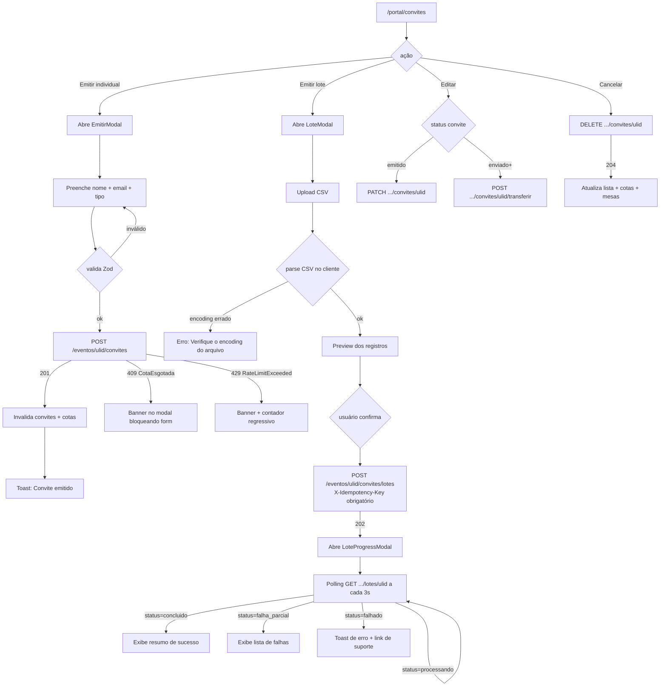

# SPEC-004 — Convites + Cotas (individual/lote)

> **Spec unificada backend + frontend.** Cobre toda a gestão de convites do formando: emissão individual, emissão em lote assíncrona via CSV, edição, cancelamento, transferência e visualização de saldo de cotas.
> Fontes: [09-TECHNICAL-DESIGN-CRITICAL-MODULES.md §6](../frontend/09-TECHNICAL-DESIGN-CRITICAL-MODULES.md) · [api-contract.md §4](../api/api-contract.md) · [api-contract.md §2.3-2.4](../api/api-contract.md) · [07-DATA-CONTRACTS-AND-VIEW-MODELS.md](../frontend/07-DATA-CONTRACTS-AND-VIEW-MODELS.md)

---

## 0. Resumo executivo

O formando acessa `/portal/convites` e visualiza o saldo de cotas disponíveis por tipo (base, transferível, cortesia, staff, extra) e a lista completa de convites emitidos com filtros. Pode emitir um convite individual preenchendo nome/email/telefone do convidado — o backend consome 1 cota do tipo correspondente e retorna `201`. Pode emitir em lote via upload de CSV (máx. 500 convites): o SPA parseia o CSV, exibe preview, envia `POST .../convites/lotes` com `X-Idempotency-Key` obrigatório, recebe `202` e inicia polling de status a cada 3s até `concluido` ou `falhado`. Convites emitidos (antes de `enviado`) podem ser editados via `PATCH`; após `enviado`, a alteração exige `POST .../transferir`. Cancelamento via `DELETE` marca `status=cancelado` e libera o assento atrelado (quando houver).

---

## 1. Visão da feature

### 1.1 Jornada macro — emissão individual vs lote



### 1.2 Atores

| Ator           | Ação                                                                      |
| -------------- | ------------------------------------------------------------------------- |
| Formando       | Emite, edita, cancela e transfere convites; consulta saldo de cotas.      |
| Convidado      | Recebe link RSVP por e-mail/WhatsApp; confirma ou recusa (RSVP externo).  |
| Backend (Job)  | Processa lotes assíncronos via `EmitirLoteConvitesJob` na fila `default`. |
| Comissão/Admin | Visão ampliada (fora de escopo desta spec — tela admin).                  |

### 1.3 Valor

- Permite ao formando exercer o benefício central do pacote contratado sem intervenção da equipe.
- Emissão em lote reduz drasticamente o tempo para formandos com muitos convidados.
- Controle de cotas garante que nenhum formando exceda o limite do seu pacote.
- Cancelamento automático libera recursos (assentos, cotas) imediatamente.

### 1.4 Escopo

**In:** lista de convites, filtros, emissão individual, emissão em lote CSV, edição antes de `enviado`, transferência após `enviado`, cancelamento, visualização de saldo de cotas por tipo.
**Out:** RSVP público pelo convidado (SPEC separada), QR code de compartilhamento (depende de `token_publico` no resource — pendente backend), analytics de abertura (módulo admin), compra de cotas extras (fluxo financeiro).

---

## 2. Contrato da API

### 2.1 `GET /api/v1/me/convites`

- **Route name:** `api.v1.me.convites`
- **Middlewares:** `auth:sanctum`, `throttle:api`
- **Paginação:** cursor (`page[cursor]`, `page[size]` padrão 50, máx 100)

**Query params:**

| Param            | Valores aceitos                                 |
| ---------------- | ----------------------------------------------- |
| `filter[status]` | `emitido,enviado,confirmado,recusado,cancelado` |
| `filter[tipo]`   | `nominal,transferivel,cortesia,staff,extra`     |
| `filter[search]` | busca parcial em `convidado_nome` e `codigo`    |
| `sort`           | `-created_at,codigo`                            |

**Response 200:**

```json
{
    "data": [
        {
            "id": "01J...",
            "codigo": "ABCDE123",
            "status": "enviado",
            "tipo": "nominal",
            "convidado": {
                "nome": "Carlos Alberto",
                "email": "carlos@example.com",
                "telefone": "+55 11 99876-5432"
            },
            "entregue_at": "2026-10-15T10:20:00-03:00",
            "visualizado_at": null,
            "confirmado_at": null,
            "links": {
                "self": "https://api.portalartfinal.com.br/api/v1/eventos/01J.../convites/01J...",
                "reemitir": "https://api.portalartfinal.com.br/api/v1/eventos/01J.../convites/01J.../reemitir",
                "transferir": "https://api.portalartfinal.com.br/api/v1/eventos/01J.../convites/01J.../transferir",
                "cancelar": "https://api.portalartfinal.com.br/api/v1/eventos/01J.../convites/01J..."
            }
        }
    ],
    "meta": { "per_page": 50, "next_cursor": "eyJ...", "prev_cursor": null },
    "links": { "self": "...", "next": "...", "prev": null }
}
```

### 2.2 `GET /api/v1/me/cotas`

- **Route name:** `api.v1.me.cotas`
- **Middlewares:** `auth:sanctum`, `throttle:api`

**Response 200:**

```json
{
    "data": [
        {
            "evento": { "id": "01J...", "slug": "baile-med-usp-2026" },
            "cotas": [
                { "tipo": "base", "limite": 4, "utilizados": 2, "saldo": 2 },
                { "tipo": "transferivel", "limite": 2, "utilizados": 0, "saldo": 2 },
                { "tipo": "cortesia", "limite": 1, "utilizados": 1, "saldo": 0 },
                { "tipo": "extra", "limite": null, "utilizados": 1, "saldo": null }
            ],
            "links": {
                "self": "https://api.portalartfinal.com.br/api/v1/me/cotas",
                "emitir": "https://api.portalartfinal.com.br/api/v1/eventos/01J.../convites"
            }
        }
    ]
}
```

> `limite: null` e `saldo: null` indicam cota ilimitada (tipo `extra` com pacote sem teto definido).

### 2.3 `GET /api/v1/eventos/{ulid}/convites`

- **Route name:** `api.v1.convites.index`
- **Middlewares:** `auth:sanctum`, `throttle:api`
- **Escopo:** formando vê apenas os seus; admin/comissão vê todos do evento.
- **Query params e response:** idênticos a §2.1 (`ConviteResource`).

### 2.4 `POST /api/v1/eventos/{ulid}/convites`

- **Route name:** `api.v1.convites.store`
- **Middlewares:** `auth:sanctum`, `throttle.actor:convite` (10/min/user), `ConvitePolicy::emitir`
- **Idempotência:** recomendada via `X-Idempotency-Key`

**Request:**

```json
{
    "tipo": "nominal",
    "convidado": {
        "nome": "Carlos Alberto",
        "email": "carlos@example.com",
        "telefone": "+55 11 99876-5432"
    },
    "origem_cota": "base"
}
```

**Validação:**

| Campo                | Regra                                                 |
| -------------------- | ----------------------------------------------------- |
| `tipo`               | `required\|in:nominal,transferivel,cortesia`          |
| `convidado.nome`     | `required\|string\|max:150`                           |
| `convidado.email`    | `required_without:convidado.telefone\|email\|max:150` |
| `convidado.telefone` | `string\|max:30`                                      |
| `origem_cota`        | `required\|in:base,transferivel,cortesia,staff`       |

**Response 201 + Header `Location`:**

```json
{
    "data": {
        "id": "01J...",
        "codigo": "ABCDE123",
        "status": "emitido",
        "tipo": "nominal",
        "convidado": { "nome": "Carlos Alberto", "email": "carlos@example.com", "telefone": "+55 11 99876-5432" },
        "links": {
            "self": "https://api.portalartfinal.com.br/api/v1/eventos/01J.../convites/01J...",
            "reemitir": null,
            "cancelar": "https://api.portalartfinal.com.br/api/v1/eventos/01J.../convites/01J..."
        }
    }
}
```

**Erros:**

| Código | `error`             | Causa                                       |
| ------ | ------------------- | ------------------------------------------- |
| 409    | `CotaEsgotada`      | Saldo zero para o tipo de cota requisitado. |
| 422    | `ValidationError`   | Payload inválido (`details.fields`).        |
| 429    | `RateLimitExceeded` | Mais de 10 convites individuais em 1 min.   |

### 2.5 `PATCH /api/v1/eventos/{ulid}/convites/{ulid}`

- **Route name:** `api.v1.convites.update`
- **Regra:** apenas válido enquanto `status = emitido`. Após `enviado` → usar `POST .../transferir`.

**Request:**

```json
{
    "convidado": { "nome": "Carlos A. Silva", "email": "carlos.silva@example.com" }
}
```

**Response 200:** `ConviteResource` atualizado.

**Erros:**

| Código | `error`              | Causa                                            |
| ------ | -------------------- | ------------------------------------------------ |
| 409    | `InvariantViolation` | Convite em status que não permite edição direta. |

### 2.6 `DELETE /api/v1/eventos/{ulid}/convites/{ulid}`

- **Route name:** `api.v1.convites.destroy`
- **Semântica:** cancelamento lógico — nunca DELETE físico. Marca `status = cancelado`.
- **Efeito colateral:** se havia `ReservaAssento` ativa, o backend dispara `LiberarAssentoAction` automaticamente.

**Response 204:** sem corpo.

### 2.7 `POST /api/v1/eventos/{ulid}/convites/lotes`

- **Route name:** `api.v1.convites.lotes.store`
- **Middlewares:** `auth:sanctum`, `idempotent` (`X-Idempotency-Key` **obrigatório**)
- **Processamento:** assíncrono — enfileira `EmitirLoteConvitesJob` na fila `default`.

**Request:**

```json
{
    "convites": [
        { "tipo": "nominal", "convidado": { "nome": "Ana", "email": "ana@x.com" }, "origem_cota": "base" },
        { "tipo": "nominal", "convidado": { "nome": "Bruno", "email": "b@x.com" }, "origem_cota": "base" }
    ]
}
```

**Validação:**

| Campo        | Regra                             |
| ------------ | --------------------------------- |
| `convites`   | `required\|array\|min:1\|max:500` |
| `convites.*` | herda regras de §2.4 por item     |

**Response 202:**

```json
{
    "data": {
        "id": "01J...",
        "status": "processando",
        "qtd_total": 500,
        "qtd_processados": 0,
        "status_url": "https://api.portalartfinal.com.br/api/v1/eventos/01J.../convites/lotes/01J..."
    }
}
```

**Erros:**

| Código | `error`               | Causa                                                |
| ------ | --------------------- | ---------------------------------------------------- |
| 409    | `IdempotencyConflict` | Chave duplicada com payload diferente.               |
| 422    | `ValidationError`     | Array vazio, itens inválidos, ou `max:500` excedido. |

### 2.8 `GET /api/v1/eventos/{ulid}/convites/lotes/{ulid}`

- **Route name:** `api.v1.convites.lotes.show`
- **Uso:** polling a cada 3s pelo frontend até status terminal.

**Response 200:**

```json
{
    "data": {
        "id": "01J...",
        "status": "concluido",
        "qtd_total": 500,
        "qtd_processados": 500,
        "qtd_falhados": 0,
        "falhas": [],
        "iniciado_at": "2026-10-15T10:00:00-03:00",
        "concluido_at": "2026-10-15T10:00:42-03:00"
    }
}
```

> `status` possíveis: `processando`, `concluido`, `falha_parcial`, `falhado`.
> Quando `qtd_falhados > 0`, `falhas` contém array com `{ linha, erro, convidado }`.

### 2.9 Headers obrigatórios para mutações

| Header              | Direção | Uso                                                            |
| ------------------- | ------- | -------------------------------------------------------------- |
| `X-Request-Id`      | req/res | ULID gerado pelo cliente. Correlação de logs.                  |
| `X-XSRF-TOKEN`      | req     | Lido do cookie (Axios injeta automaticamente).                 |
| `X-Idempotency-Key` | req     | **Obrigatório** em POST lotes; recomendado em POST individual. |
| `Content-Type`      | req     | `application/json`                                             |
| `Accept`            | req     | `application/json`                                             |

---

## 3. Backend — Laravel 13

### 3.1 Arquivos a criar/modificar

| Arquivo                                                   | Ação      | Responsabilidade                                                                     |
| --------------------------------------------------------- | --------- | ------------------------------------------------------------------------------------ |
| `routes/api/v1.php`                                       | Modificar | Registrar rotas de convites e cotas.                                                 |
| `app/Http/Controllers/Api/V1/ConviteController.php`       | Criar     | `index`, `store`, `update`, `destroy`, `storeLote`, `showLote`.                      |
| `app/Http/Controllers/Api/V1/CotaController.php`          | Criar     | `index` (GET /me/cotas).                                                             |
| `app/Http/Requests/Api/V1/StoreConviteRequest.php`        | Criar     | Validação de emissão individual.                                                     |
| `app/Http/Requests/Api/V1/UpdateConviteRequest.php`       | Criar     | Validação de edição de dados do convidado.                                           |
| `app/Http/Requests/Api/V1/StoreLoteConviteRequest.php`    | Criar     | Validação de emissão em lote (array max:500).                                        |
| `app/Actions/Convites/EmitirConviteAction.php`            | Criar     | Transação: verificar saldo, criar convite, decrementar cota, disparar evento.        |
| `app/Actions/Convites/CancelarConviteAction.php`          | Criar     | Marcar status=cancelado, disparar `ConviteCancelado`, chamar `LiberarAssentoAction`. |
| `app/Actions/Convites/AtualizarConviteAction.php`         | Criar     | Editar dados do convidado se status permite.                                         |
| `app/Jobs/EmitirLoteConvitesJob.php`                      | Criar     | Processa lote item a item; atualiza `qtd_processados`; registra falhas individuais.  |
| `app/Policies/ConvitePolicy.php`                          | Criar     | `emitir`, `update`, `destroy` — baseada em saldo + status + vínculo.                 |
| `app/Http/Resources/V1/ConviteResource.php`               | Criar     | Serialização de um convite com links HATEOAS.                                        |
| `app/Http/Resources/V1/CotaResource.php`                  | Criar     | Serialização de saldo por tipo e evento.                                             |
| `app/Http/Resources/V1/LoteConvitesResource.php`          | Criar     | Serialização do status do lote (polling).                                            |
| `app/Events/ConviteEmitido.php`                           | Criar     | Evento disparado após emissão individual.                                            |
| `app/Events/ConviteCancelado.php`                         | Criar     | Evento disparado após cancelamento.                                                  |
| `app/Events/LoteConvitesIniciado.php`                     | Criar     | Evento disparado ao enfileirar lote.                                                 |
| `app/Listeners/EnviarEmailConviteAoEmitir.php`            | Criar     | Ouve `ConviteEmitido` → enfileira `EnviarConviteEmailJob`.                           |
| `tests/Feature/Api/V1/Convites/EmitirConviteTest.php`     | Criar     | 4 cenários: ok, cota esgotada, rate limit, validação.                                |
| `tests/Feature/Api/V1/Convites/EmitirLoteConviteTest.php` | Criar     | 3 cenários: 202 async, idempotência, validação max:500.                              |
| `tests/Feature/Api/V1/Convites/CancelarConviteTest.php`   | Criar     | 2 cenários: ok, status inválido 409.                                                 |
| `tests/Feature/Api/V1/Convites/AtualizarConviteTest.php`  | Criar     | 2 cenários: antes enviado ok, após enviado 409.                                      |
| `tests/Feature/Api/V1/Convites/LoteStatusTest.php`        | Criar     | 2 cenários: polling processando, polling concluido.                                  |
| `tests/Feature/Api/V1/Convites/TransferirConviteTest.php` | Criar     | 1 cenário: transferência via PATCH para convite emitido.                             |
| `tests/Feature/Api/V1/Convites/ConviteFiltersTest.php`    | Criar     | 3 cenários: filter[search], filter[tipo], cursor pagination.                         |

### 3.2 Registro de rotas em `routes/api/v1.php`

```php
// Contexto do formando autenticado — cotas
Route::get('/me/convites', [ConviteController::class, 'meIndex'])->name('me.convites');
Route::get('/me/cotas', [CotaController::class, 'index'])->name('me.cotas');

// Convites por evento
Route::prefix('eventos/{evento:ulid}/convites')->name('convites.')->group(function () {
    Route::get('/',        [ConviteController::class, 'index'])->name('index');
    Route::post('/',       [ConviteController::class, 'store'])->name('store')
         ->middleware('throttle:convite');
    Route::patch('/{convite:ulid}',  [ConviteController::class, 'update'])->name('update');
    Route::delete('/{convite:ulid}', [ConviteController::class, 'destroy'])->name('destroy');
    Route::post('/lotes',            [ConviteController::class, 'storeLote'])->name('lotes.store')
         ->middleware('idempotent');
    Route::get('/lotes/{lote:ulid}', [ConviteController::class, 'showLote'])->name('lotes.show');
});
```

### 3.3 `ConviteController` — esqueleto

```php
<?php
declare(strict_types=1);

namespace App\Http\Controllers\Api\V1;

use App\Actions\Convites\CancelarConviteAction;
use App\Actions\Convites\EmitirConviteAction;
use App\Http\Controllers\Controller;
use App\Http\Requests\Api\V1\StoreConviteRequest;
use App\Http\Requests\Api\V1\StoreLoteConviteRequest;
use App\Http\Requests\Api\V1\UpdateConviteRequest;
use App\Http\Resources\V1\ConviteResource;
use App\Http\Resources\V1\LoteConvitesResource;
use App\Jobs\EmitirLoteConvitesJob;
use App\Models\Convite;
use App\Models\Evento;
use App\Models\LoteConvites;
use Illuminate\Http\JsonResponse;
use Illuminate\Http\Request;
use Illuminate\Support\Facades\Gate;

final class ConviteController extends Controller
{
    public function store(StoreConviteRequest $request, Evento $evento): JsonResponse
    {
        Gate::authorize('emitir', [$evento]);

        $convite = app(EmitirConviteAction::class)->execute(
            formando: $request->user()->formandoForEvento($evento),
            evento: $evento,
            dados: $request->validated(),
        );

        return (new ConviteResource($convite))
            ->response()
            ->setStatusCode(201)
            ->header('Location', route('api.v1.convites.show', [$evento, $convite]));
    }

    public function update(UpdateConviteRequest $request, Evento $evento, Convite $convite): ConviteResource
    {
        Gate::authorize('update', $convite);

        $convite = app(\App\Actions\Convites\AtualizarConviteAction::class)->execute(
            convite: $convite,
            dados: $request->validated(),
        );

        return new ConviteResource($convite);
    }

    public function destroy(Request $request, Evento $evento, Convite $convite): JsonResponse
    {
        Gate::authorize('destroy', $convite);

        app(CancelarConviteAction::class)->execute($convite);

        return response()->noContent();
    }

    public function storeLote(StoreLoteConviteRequest $request, Evento $evento): JsonResponse
    {
        Gate::authorize('emitir', [$evento]);

        $lote = LoteConvites::create([
            'evento_id'       => $evento->id,
            'formando_id'     => $request->user()->formandoForEvento($evento)->id,
            'status'          => 'processando',
            'qtd_total'       => count($request->validated('convites')),
            'qtd_processados' => 0,
            'qtd_falhados'    => 0,
        ]);

        EmitirLoteConvitesJob::dispatch($lote, $request->validated('convites'));

        return (new LoteConvitesResource($lote))
            ->response()
            ->setStatusCode(202);
    }

    public function showLote(Evento $evento, LoteConvites $lote): LoteConvitesResource
    {
        return new LoteConvitesResource($lote);
    }
}
```

### 3.4 `EmitirConviteAction`

```php
<?php
declare(strict_types=1);

namespace App\Actions\Convites;

use App\Events\ConviteEmitido;
use App\Exceptions\CotaEsgotadaException;
use App\Models\Convite;
use App\Models\Evento;
use App\Models\Formando;
use Illuminate\Support\Facades\DB;

final class EmitirConviteAction
{
    /**
     * @param  array<string, mixed> $dados
     * @throws CotaEsgotadaException
     */
    public function execute(Formando $formando, Evento $evento, array $dados): Convite
    {
        return DB::transaction(function () use ($formando, $evento, $dados): Convite {
            $cota = $formando->cotas()
                ->where('tipo', $dados['origem_cota'])
                ->lockForUpdate()
                ->firstOrFail();

            if ($cota->saldo !== null && $cota->saldo <= 0) {
                throw new CotaEsgotadaException(
                    "Cota do tipo '{$dados['origem_cota']}' esgotada.",
                );
            }

            $convite = Convite::create([
                'formando_id'      => $formando->id,
                'evento_id'        => $evento->id,
                'tipo'             => $dados['tipo'],
                'origem_cota'      => $dados['origem_cota'],
                'convidado_nome'   => $dados['convidado']['nome'],
                'convidado_email'  => $dados['convidado']['email'] ?? null,
                'convidado_fone'   => $dados['convidado']['telefone'] ?? null,
                'status'           => 'emitido',
                'codigo'           => $this->gerarCodigo(),
            ]);

            if ($cota->saldo !== null) {
                $cota->decrement('saldo');
                $cota->increment('utilizados');
            }

            event(new ConviteEmitido($convite));

            return $convite;
        });
    }

    private function gerarCodigo(): string
    {
        return strtoupper(substr(str_replace(['+', '/', '='], '', base64_encode(random_bytes(6))), 0, 8));
    }
}
```

### 3.5 `ConvitePolicy`

```php
<?php
declare(strict_types=1);

namespace App\Policies;

use App\Models\Convite;
use App\Models\Evento;
use App\Models\User;

final class ConvitePolicy
{
    /**
     * Verifica se o formando pode emitir mais convites neste evento.
     * A verificação de saldo real fica na Action (com lock — aqui é pré-check rápido).
     */
    public function emitir(User $user, Evento $evento): bool
    {
        return $user->formandos()->where('evento_id', $evento->id)->exists();
    }

    /**
     * Edição permitida somente pelo dono e somente enquanto status = emitido.
     */
    public function update(User $user, Convite $convite): bool
    {
        return $convite->formando->user_id === $user->id
            && $convite->status === 'emitido';
    }

    /**
     * Cancelamento permitido ao dono para status emitido, enviado ou visualizado.
     */
    public function destroy(User $user, Convite $convite): bool
    {
        return $convite->formando->user_id === $user->id
            && in_array($convite->status, ['emitido', 'enviado', 'visualizado'], true);
    }
}
```

### 3.6 `StoreLoteConviteRequest`

```php
<?php
declare(strict_types=1);

namespace App\Http\Requests\Api\V1;

use Illuminate\Foundation\Http\FormRequest;

final class StoreLoteConviteRequest extends FormRequest
{
    public function authorize(): bool
    {
        return true; // Policy aplicada no controller via Gate::authorize
    }

    public function rules(): array
    {
        return [
            'convites'                    => ['required', 'array', 'min:1', 'max:500'],
            'convites.*.tipo'             => ['required', 'in:nominal,transferivel,cortesia'],
            'convites.*.convidado.nome'   => ['required', 'string', 'max:150'],
            'convites.*.convidado.email'  => ['nullable', 'email', 'max:150'],
            'convites.*.convidado.telefone' => ['nullable', 'string', 'max:30'],
            'convites.*.origem_cota'      => ['required', 'in:base,transferivel,cortesia,staff'],
        ];
    }

    public function messages(): array
    {
        return [
            'convites.max'               => 'O lote não pode ter mais de 500 convites.',
            'convites.*.tipo.required'   => 'Cada convite deve ter um tipo.',
            'convites.*.convidado.nome.required' => 'Nome do convidado é obrigatório em cada item.',
        ];
    }
}
```

### 3.7 `EmitirLoteConvitesJob`

```php
<?php
declare(strict_types=1);

namespace App\Jobs;

use App\Actions\Convites\EmitirConviteAction;
use App\Exceptions\CotaEsgotadaException;
use App\Models\LoteConvites;
use Illuminate\Bus\Queueable;
use Illuminate\Contracts\Queue\ShouldQueue;
use Illuminate\Foundation\Bus\Dispatchable;
use Illuminate\Queue\InteractsWithQueue;
use Illuminate\Queue\SerializesModels;

final class EmitirLoteConvitesJob implements ShouldQueue
{
    use Dispatchable, InteractsWithQueue, Queueable, SerializesModels;

    public int $tries = 1; // Idempotência — não re-tentar automaticamente

    public function __construct(
        private readonly LoteConvites $lote,
        /** @var array<int, array<string, mixed>> */
        private readonly array $convites,
    ) {
        $this->onQueue('default');
    }

    public function handle(EmitirConviteAction $action): void
    {
        $formando = $this->lote->formando;
        $evento   = $this->lote->evento;
        $falhas   = [];

        foreach ($this->convites as $index => $dados) {
            try {
                $action->execute($formando, $evento, $dados);
                $this->lote->increment('qtd_processados');
            } catch (CotaEsgotadaException $e) {
                $falhas[] = ['linha' => $index + 1, 'erro' => $e->getMessage(), 'convidado' => $dados['convidado'] ?? []];
                $this->lote->increment('qtd_falhados');
            } catch (\Throwable $e) {
                $falhas[] = ['linha' => $index + 1, 'erro' => 'Erro interno.', 'convidado' => $dados['convidado'] ?? []];
                $this->lote->increment('qtd_falhados');
            }
        }

        $statusFinal = count($falhas) === count($this->convites) ? 'falhado'
            : (count($falhas) > 0 ? 'falha_parcial' : 'concluido');

        $this->lote->update([
            'status'       => $statusFinal,
            'falhas'       => $falhas,
            'concluido_at' => now(),
        ]);
    }
}
```

### 3.8 Tratamento de erro: `CotaEsgotadaException`

O handler global de exceções (`bootstrap/app.php` → `withExceptions`) deve mapear `CotaEsgotadaException` para o envelope padrão com HTTP 409:

```php
$exceptions->render(function (CotaEsgotadaException $e, $request) {
    if ($request->expectsJson()) {
        return response()->json([
            'error'      => 'CotaEsgotada',
            'message'    => $e->getMessage(),
            'details'    => null,
            'request_id' => $request->header('X-Request-Id'),
            'timestamp'  => now()->toIso8601String(),
        ], 409);
    }
});
```

### 3.9 Testes Pest (mínimo 12 obrigatórios)

```php
// tests/Feature/Api/V1/Convites/EmitirConviteTest.php

it('emite convite individual e retorna 201 com ConviteResource', function () {
    $formando = Formando::factory()->comCota('base', saldo: 2)->create();
    $evento   = $formando->evento;

    $response = $this->actingAs($formando->user)
        ->postJson("/api/v1/eventos/{$evento->ulid}/convites", [
            'tipo'       => 'nominal',
            'convidado'  => ['nome' => 'Ana Lima', 'email' => 'ana@x.com'],
            'origem_cota'=> 'base',
        ]);

    $response->assertCreated()
        ->assertJsonPath('data.status', 'emitido')
        ->assertJsonPath('data.tipo', 'nominal')
        ->assertHeader('Location');
});

it('retorna 409 CotaEsgotada quando saldo é zero', function () {
    $formando = Formando::factory()->comCota('base', saldo: 0)->create();
    $evento   = $formando->evento;

    $this->actingAs($formando->user)
        ->postJson("/api/v1/eventos/{$evento->ulid}/convites", [
            'tipo' => 'nominal', 'convidado' => ['nome' => 'X', 'email' => 'x@x.com'], 'origem_cota' => 'base',
        ])
        ->assertConflict()
        ->assertJsonPath('error', 'CotaEsgotada');
});

it('enfileira EmitirLoteConvitesJob e retorna 202', function () {
    Queue::fake();
    $formando = Formando::factory()->comCota('base', saldo: 10)->create();
    $evento   = $formando->evento;

    $this->actingAs($formando->user)
        ->postJson("/api/v1/eventos/{$evento->ulid}/convites/lotes", [
            'convites' => [
                ['tipo' => 'nominal', 'convidado' => ['nome' => 'A', 'email' => 'a@x.com'], 'origem_cota' => 'base'],
            ],
        ], ['X-Idempotency-Key' => '01JABCDE'])
        ->assertAccepted()
        ->assertJsonPath('data.status', 'processando');

    Queue::assertPushed(EmitirLoteConvitesJob::class);
});

it('retorna status do lote via polling', function () {
    $formando = Formando::factory()->create();
    $lote = LoteConvites::factory()->concluido()->for($formando)->create();

    $this->actingAs($formando->user)
        ->getJson("/api/v1/eventos/{$formando->evento->ulid}/convites/lotes/{$lote->ulid}")
        ->assertOk()
        ->assertJsonPath('data.status', 'concluido');
});

it('cancela convite e retorna 204', function () {
    $convite = Convite::factory()->emitido()->create();

    $this->actingAs($convite->formando->user)
        ->deleteJson("/api/v1/eventos/{$convite->evento->ulid}/convites/{$convite->ulid}")
        ->assertNoContent();

    expect($convite->fresh()->status)->toBe('cancelado');
});

it('retorna 409 ao cancelar convite já cancelado', function () {
    $convite = Convite::factory()->cancelado()->create();

    $this->actingAs($convite->formando->user)
        ->deleteJson("/api/v1/eventos/{$convite->evento->ulid}/convites/{$convite->ulid}")
        ->assertConflict()
        ->assertJsonPath('error', 'InvariantViolation');
});

it('transfere convite (PATCH com email novo) para status emitido', function () {
    $convite = Convite::factory()->emitido()->create();

    $this->actingAs($convite->formando->user)
        ->patchJson("/api/v1/eventos/{$convite->evento->ulid}/convites/{$convite->ulid}", [
            'convidado' => ['nome' => 'Novo Nome', 'email' => 'novo@x.com'],
        ])
        ->assertOk()
        ->assertJsonPath('data.convidado.email', 'novo@x.com');
});

it('retorna 409 ao editar convite com status enviado', function () {
    $convite = Convite::factory()->enviado()->create();

    $this->actingAs($convite->formando->user)
        ->patchJson("/api/v1/eventos/{$convite->evento->ulid}/convites/{$convite->ulid}", [
            'convidado' => ['nome' => 'X'],
        ])
        ->assertConflict()
        ->assertJsonPath('error', 'InvariantViolation');
});

it('filter[search] retorna apenas convites com convidado_nome correspondente', function () {
    $formando = Formando::factory()->create();
    Convite::factory()->for($formando)->create(['convidado_nome' => 'Carlos Alberto']);
    Convite::factory()->for($formando)->create(['convidado_nome' => 'Maria Silva']);

    $this->actingAs($formando->user)
        ->getJson('/api/v1/me/convites?filter[search]=Carlos')
        ->assertOk()
        ->assertJsonCount(1, 'data')
        ->assertJsonPath('data.0.convidado.nome', 'Carlos Alberto');
});

it('filter[tipo] retorna apenas convites do tipo especificado', function () {
    $formando = Formando::factory()->create();
    Convite::factory()->for($formando)->create(['tipo' => 'nominal']);
    Convite::factory()->for($formando)->create(['tipo' => 'cortesia']);

    $this->actingAs($formando->user)
        ->getJson('/api/v1/me/convites?filter[tipo]=cortesia')
        ->assertOk()
        ->assertJsonCount(1, 'data')
        ->assertJsonPath('data.0.tipo', 'cortesia');
});

it('cursor pagination retorna next_cursor na primeira página', function () {
    $formando = Formando::factory()->create();
    Convite::factory(5)->for($formando)->create();

    $this->actingAs($formando->user)
        ->getJson('/api/v1/me/convites?page[size]=2')
        ->assertOk()
        ->assertJsonStructure(['meta' => ['next_cursor']]);
});

it('dois formandos concorrentes recebem 409 CotaEsgotada no segundo', function () {
    $formando = Formando::factory()->comCota('base', saldo: 1)->create();
    $evento   = $formando->evento;
    $payload  = ['tipo' => 'nominal', 'convidado' => ['nome' => 'X', 'email' => 'x@x.com'], 'origem_cota' => 'base'];

    // Primeiro emite — deve passar
    $r1 = $this->actingAs($formando->user)->postJson("/api/v1/eventos/{$evento->ulid}/convites", $payload);
    $r1->assertCreated();

    // Segundo deve falhar com 409
    $r2 = $this->actingAs($formando->user)->postJson("/api/v1/eventos/{$evento->ulid}/convites", $payload);
    $r2->assertConflict()->assertJsonPath('error', 'CotaEsgotada');
});
```

---

## 4. Frontend — React 19 SPA

### 4.1 Arquivos a criar/modificar

| Arquivo                                                   | Ação  | Responsabilidade                                                                                                          |
| --------------------------------------------------------- | ----- | ------------------------------------------------------------------------------------------------------------------------- |
| `resources/spa/src/api/hooks/use-convites.ts`             | Criar | `useConvites`, `useCotas`, `useEmitirConvite`, `useCancelarConvite`, `useEmitirLote`, `useLoteStatus`, `usePatchConvite`. |
| `resources/spa/src/routes/portal/convites.tsx`            | Criar | Rota `/portal/convites` — orquestra página completa.                                                                      |
| `resources/spa/src/components/convites/convites-list.tsx` | Criar | Lista infinita de convites com skeleton.                                                                                  |
| `resources/spa/src/components/convites/cotas-summary.tsx` | Criar | Cards de saldo por tipo de cota.                                                                                          |
| `resources/spa/src/components/convites/emitir-form.tsx`   | Criar | Formulário individual (RHF + Zod).                                                                                        |
| `resources/spa/src/components/convites/lote-upload.tsx`   | Criar | Upload CSV, parse no cliente, preview, envio do lote.                                                                     |
| `resources/spa/src/components/convites/lote-progress.tsx` | Criar | Progress bar + polling de status do lote.                                                                                 |
| `resources/spa/src/components/convites/convite-card.tsx`  | Criar | Card individual: status badge, dados do convidado, menu de ações.                                                         |
| `resources/spa/src/forms/convites/emitir.schema.ts`       | Criar | Schema Zod do formulário de emissão individual.                                                                           |
| `resources/spa/src/forms/convites/transferir.schema.ts`   | Criar | Schema Zod do formulário de transferência.                                                                                |
| `resources/spa/src/lib/csv-parser.ts`                     | Criar | Parser de CSV com suporte a diferentes encodings.                                                                         |
| `resources/spa/tests/unit/use-convites.test.ts`           | Criar | Testes do hook useEmitirConvite e useLoteStatus.                                                                          |
| `resources/spa/tests/integration/convites-page.test.tsx`  | Criar | Testes RTL + MSW: happy path, 409 CotaEsgotada, lote 202.                                                                 |
| `resources/spa/tests/e2e/convites.spec.ts`                | Criar | E2E: emitir → cancelar → cota incrementa; lote CSV.                                                                       |

### 4.2 `api/hooks/use-convites.ts` — hooks completos

```typescript
import { useInfiniteQuery, useMutation, useQuery, useQueryClient } from '@tanstack/react-query';
import { api } from '../client';
import type { ConviteDto, CotasPorEventoDto, LoteConvitesDto } from '../types.gen';
import { toConviteViewModel, toCotasEventoViewModel } from '../mappers/convite.mappers';
import { getIdempotencyKey, clearIdempotencyKey } from '@/lib/idempotency';

// ── Types ──────────────────────────────────────────────────────────────────────

export interface ConvitesFilters {
    status?: string;
    tipo?: string;
    search?: string;
}

export interface EmitirConviteInput {
    tipo: 'nominal' | 'transferivel' | 'cortesia';
    origemCota: 'base' | 'transferivel' | 'cortesia' | 'staff';
    convidado: { nome: string; email?: string; telefone?: string };
}

export interface ConvitePatch {
    convidado: { nome?: string; email?: string; telefone?: string };
}

// ── Query Keys ─────────────────────────────────────────────────────────────────

export const conviteKeys = {
    all: ['convites'] as const,
    list: (filters: ConvitesFilters) => ['convites', 'list', filters] as const,
    cotas: ['me', 'cotas'] as const,
    lote: (eventoUlid: string, loteUlid: string) => ['lote', eventoUlid, loteUlid] as const,
};

// ── Hooks de leitura ───────────────────────────────────────────────────────────

export function useMeConvites(filters: ConvitesFilters = {}) {
    return useInfiniteQuery({
        queryKey: conviteKeys.list(filters),
        initialPageParam: null as string | null,
        queryFn: async ({ pageParam }) => {
            const { data } = await api.get<{ data: ConviteDto[]; meta: { next_cursor: string | null } }>(
                '/me/convites',
                {
                    params: {
                        'page[cursor]': pageParam,
                        'page[size]': 50,
                        'filter[status]': filters.status,
                        'filter[tipo]': filters.tipo,
                        'filter[search]': filters.search,
                        sort: '-created_at',
                    },
                },
            );
            return { ...data, data: data.data.map(toConviteViewModel) };
        },
        getNextPageParam: (last) => last.meta.next_cursor ?? undefined,
        staleTime: 30_000,
    });
}

export function useMeCotas() {
    return useQuery({
        queryKey: conviteKeys.cotas,
        queryFn: async () => {
            const { data } = await api.get<{ data: CotasPorEventoDto[] }>('/me/cotas');
            return data.data.map(toCotasEventoViewModel);
        },
        staleTime: 30_000,
    });
}

// ── Mutation: emitir individual ─────────────────────────────────────────────────

export function useEmitirConvite(eventoUlid: string) {
    const qc = useQueryClient();

    return useMutation({
        mutationFn: async (input: EmitirConviteInput) => {
            const { data } = await api.post<{ data: ConviteDto }>(
                `/eventos/${eventoUlid}/convites`,
                {
                    tipo: input.tipo,
                    convidado: input.convidado,
                    origem_cota: input.origemCota,
                },
                { headers: { 'X-Idempotency-Key': crypto.randomUUID() } },
            );
            return toConviteViewModel(data.data);
        },
        onSuccess: () => {
            qc.invalidateQueries({ queryKey: conviteKeys.all });
            qc.invalidateQueries({ queryKey: conviteKeys.cotas });
        },
    });
}

// ── Mutation: cancelar ──────────────────────────────────────────────────────────

export function useCancelarConvite(eventoUlid: string) {
    const qc = useQueryClient();

    return useMutation({
        mutationFn: async (conviteUlid: string) => {
            await api.delete(`/eventos/${eventoUlid}/convites/${conviteUlid}`);
            return conviteUlid;
        },
        onSuccess: () => {
            qc.invalidateQueries({ queryKey: conviteKeys.all });
            qc.invalidateQueries({ queryKey: conviteKeys.cotas });
            qc.invalidateQueries({ queryKey: ['mesas'] }); // cascata: assento pode ter sido liberado
        },
    });
}

// ── Mutation: editar (antes de enviado) ────────────────────────────────────────

export function usePatchConvite(eventoUlid: string) {
    const qc = useQueryClient();

    return useMutation({
        mutationFn: async ({ conviteUlid, patch }: { conviteUlid: string; patch: ConvitePatch }) => {
            const { data } = await api.patch<{ data: ConviteDto }>(
                `/eventos/${eventoUlid}/convites/${conviteUlid}`,
                patch,
            );
            return toConviteViewModel(data.data);
        },
        onSuccess: () => qc.invalidateQueries({ queryKey: conviteKeys.all }),
    });
}

// ── Mutation: emissão em lote ───────────────────────────────────────────────────

function hashItems(items: EmitirConviteInput[]): string {
    return btoa(JSON.stringify(items)).slice(0, 20);
}

function toRequestShape(input: EmitirConviteInput) {
    return {
        tipo: input.tipo,
        convidado: input.convidado,
        origem_cota: input.origemCota,
    };
}

export function useEmitirLote(eventoUlid: string) {
    return useMutation({
        mutationFn: async (convites: EmitirConviteInput[]) => {
            const scope = `convites:lote:${eventoUlid}:${hashItems(convites)}`;
            const key = getIdempotencyKey(scope);

            const { data } = await api.post<{ data: LoteConvitesDto }>(
                `/eventos/${eventoUlid}/convites/lotes`,
                { convites: convites.map(toRequestShape) },
                { headers: { 'X-Idempotency-Key': key } },
            );

            clearIdempotencyKey(scope);
            return data.data;
        },
    });
}

// ── Query: polling status do lote ──────────────────────────────────────────────

export function useLoteStatus(eventoUlid: string, loteUlid: string | null) {
    return useQuery({
        queryKey: loteUlid ? conviteKeys.lote(eventoUlid, loteUlid) : ['lote-disabled'],
        enabled: !!loteUlid,
        queryFn: async () => {
            const { data } = await api.get<{ data: LoteConvitesDto }>(
                `/eventos/${eventoUlid}/convites/lotes/${loteUlid}`,
            );
            return data.data;
        },
        refetchInterval: (query) => {
            const d = query.state.data;
            if (!d) return 3_000;
            const terminalStatuses = ['concluido', 'falha_parcial', 'falhado'];
            return terminalStatuses.includes(d.status) ? false : 3_000;
        },
        staleTime: 0,
    });
}
```

### 4.3 `components/convites/lote-upload.tsx` — componente de upload

```typescript
import React, { useCallback, useRef, useState } from 'react';
import { parseCsvToConvites, type CsvParseResult } from '@/lib/csv-parser';
import type { EmitirConviteInput } from '@/api/hooks/use-convites';

interface LoteUploadProps {
  eventoUlid: string;
  onConvitesParsed: (convites: EmitirConviteInput[]) => void;
  onError: (mensagem: string) => void;
}

const LIMITE_LOTE = 500;

export function LoteUpload({ eventoUlid, onConvitesParsed, onError }: LoteUploadProps) {
  const inputRef = useRef<HTMLInputElement>(null);
  const [preview, setPreview] = useState<EmitirConviteInput[]>([]);
  const [parseError, setParseError] = useState<string | null>(null);

  const handleFile = useCallback(
    async (file: File) => {
      setParseError(null);
      setPreview([]);

      // Verificar encoding antes de enviar
      let text: string;
      try {
        text = await file.text(); // UTF-8
        if (text.includes('\uFFFD')) {
          // Caractere de substituição: encoding provavelmente errado
          throw new Error('Encoding inválido. Salve o CSV como UTF-8 antes de fazer o upload.');
        }
      } catch (e) {
        const msg = e instanceof Error ? e.message : 'Erro ao ler o arquivo.';
        setParseError(msg);
        onError(msg);
        return;
      }

      const result: CsvParseResult = parseCsvToConvites(text);

      if (result.erros.length > 0) {
        const msg = `Erro nas linhas ${result.erros.map((e) => e.linha).join(', ')}: ${result.erros[0].mensagem}`;
        setParseError(msg);
        onError(msg);
        return;
      }

      if (result.convites.length > LIMITE_LOTE) {
        const msg = `O arquivo contém ${result.convites.length} convites. O máximo é ${LIMITE_LOTE}.`;
        setParseError(msg);
        onError(msg);
        return;
      }

      setPreview(result.convites);
      onConvitesParsed(result.convites);
    },
    [onConvitesParsed, onError],
  );

  const handleChange = (e: React.ChangeEvent<HTMLInputElement>) => {
    const file = e.target.files?.[0];
    if (file) void handleFile(file);
  };

  return (
    <div className="space-y-4">
      <label className="block text-sm font-medium text-gray-700">
        Arquivo CSV
        <span className="ml-1 text-xs text-gray-500">(máx. {LIMITE_LOTE} convites; UTF-8)</span>
      </label>

      <div
        className="flex cursor-pointer flex-col items-center rounded-lg border-2 border-dashed border-gray-300 p-6 hover:border-indigo-400"
        onClick={() => inputRef.current?.click()}
        role="button"
        tabIndex={0}
        onKeyDown={(e) => e.key === 'Enter' && inputRef.current?.click()}
        aria-label="Clique para selecionar arquivo CSV"
      >
        <span className="text-sm text-gray-500">Clique ou arraste o arquivo .csv aqui</span>
        <input
          ref={inputRef}
          type="file"
          accept=".csv,text/csv"
          className="hidden"
          onChange={handleChange}
          aria-hidden="true"
        />
      </div>

      {parseError && (
        <p role="alert" className="text-sm text-red-600">
          {parseError}
        </p>
      )}

      {preview.length > 0 && (
        <div aria-live="polite">
          <p className="text-sm font-medium text-green-700">
            {preview.length} convite(s) prontos para envio.
          </p>
          <ul className="mt-2 max-h-40 overflow-y-auto text-xs text-gray-600">
            {preview.slice(0, 5).map((c, i) => (
              <li key={i}>{c.convidado.nome} — {c.convidado.email ?? c.convidado.telefone}</li>
            ))}
            {preview.length > 5 && <li>... e mais {preview.length - 5} registros.</li>}
          </ul>
        </div>
      )}
    </div>
  );
}
```

### 4.4 Schema Zod — `forms/convites/emitir.schema.ts`

```typescript
import { z } from 'zod';

export const tipoConviteOptions = ['nominal', 'transferivel', 'cortesia'] as const;
export const origemCotaOptions = ['base', 'transferivel', 'cortesia', 'staff'] as const;

export const emitirConviteSchema = z.object({
    tipo: z.enum(tipoConviteOptions, { required_error: 'Selecione o tipo de convite.' }),
    origemCota: z.enum(origemCotaOptions, { required_error: 'Selecione a origem da cota.' }),
    convidado: z
        .object({
            nome: z
                .string({ required_error: 'Informe o nome do convidado.' })
                .min(2, 'Nome deve ter pelo menos 2 caracteres.')
                .max(150, 'Nome muito longo.'),
            email: z.string().email('E-mail inválido.').max(150).optional().or(z.literal('')),
            telefone: z.string().max(30, 'Telefone inválido.').optional().or(z.literal('')),
        })
        .refine((c) => (c.email && c.email.length > 0) || (c.telefone && c.telefone.length > 0), {
            message: 'Informe ao menos e-mail ou telefone do convidado.',
            path: ['email'],
        }),
});

export type EmitirConviteFormData = z.infer<typeof emitirConviteSchema>;
```

### 4.5 Tratamento de erros por código HTTP

| `ApiError.error`      | HTTP | UX no componente                                                            |
| --------------------- | ---- | --------------------------------------------------------------------------- |
| `CotaEsgotada`        | 409  | Banner no modal: "Cota esgotada. Você não possui mais convites deste tipo." |
| `InvariantViolation`  | 409  | Toast: "Use 'Transferir' para convites já enviados."                        |
| `ValidationError`     | 422  | `setError` do RHF em cada `details.fields[campo]`.                          |
| `RateLimitExceeded`   | 429  | Banner com contador: "Aguarde {Retry-After}s para emitir outro convite."    |
| `InternalServerError` | 5xx  | Toast: "Erro interno. ID: {request_id}. Tente novamente."                   |

---

## 5. Ordem de implementação (BE → FE → E2E)

### 5.1 Gate A — Backend foundation

1. Criar migrations para `convites`, `lote_convites` e `cotas` se não existirem.
2. Criar Models `Convite`, `LoteConvites`, `Cota` com relacionamentos.
3. Criar factories + seeders para cenários de teste.
4. Registrar `ConvitePolicy` em `AuthServiceProvider`.

> **Gate A done quando:** `php artisan test --filter=ConvitePolicy` verde.

### 5.2 Gate B — Endpoints de leitura

5. Criar `ConviteResource` e `CotaResource`.
6. Implementar `GET /me/convites` e `GET /me/cotas`.
7. Implementar `GET /eventos/{ulid}/convites`.
8. Escrever testes de filter[search], filter[tipo] e cursor pagination (3 cenários).

> **Gate B done quando:** `php artisan test --filter=ConviteFilter` com 3/3 verdes.

### 5.3 Gate C — Emissão individual

9. Criar `EmitirConviteAction` com transação e lock de cota.
10. Criar `StoreConviteRequest` com regras de validação.
11. Criar `ConviteController@store` com `Gate::authorize`.
12. Criar `CotaEsgotadaException` + registrar no handler global.
13. Registrar rate limiter `throttle.actor:convite` (10/min/user).
14. Escrever testes: emitir ok, cota esgotada 409, rate limit 429, validação 422.

> **Gate C done quando:** `php artisan test --filter=EmitirConvite` com 4/4 verdes.

### 5.4 Gate D — Edição, cancelamento e transferência

15. Criar `AtualizarConviteAction` com verificação de status.
16. Criar `CancelarConviteAction` com disparo de `LiberarAssentoAction`.
17. Criar `UpdateConviteRequest`.
18. Implementar `PATCH` e `DELETE` no controller.
19. Escrever testes: editar antes enviado ok, editar após enviado 409, cancelar ok, cancelar status inválido.

> **Gate D done quando:** `php artisan test --filter=ConviteAction` com 4/4 verdes.

### 5.5 Gate E — Emissão em lote

20. Criar `EmitirLoteConvitesJob` com loop + registro de falhas.
21. Criar `StoreLoteConviteRequest` (array max:500).
22. Criar `LoteConvites` model + `LoteConvitesResource`.
23. Implementar `POST .../lotes` e `GET .../lotes/{ulid}`.
24. Configurar middleware `idempotent` para o endpoint de lote.
25. Escrever testes: 202 async, polling concluido, falha parcial.

> **Gate E done quando:** `php artisan test --filter=Lote` com 3/3 verdes + `Queue::fake()` confirma Job enfileirado.

### 5.6 Gate F — Frontend base

26. Criar types/DTOs locais + mappers `toConviteViewModel`, `toCotasEventoViewModel`.
27. Criar `use-convites.ts` com todos os hooks.
28. Criar `cotas-summary.tsx` e `convite-card.tsx`.
29. Criar `convites-list.tsx` com infinite scroll.
30. Montar rota `/portal/convites` com dados reais.

> **Gate F done quando:** smoke test manual na rota exibe lista e saldo de cotas.

### 5.7 Gate G — Formulários e interações

31. Criar `emitir-form.tsx` com RHF + Zod + tratamento de 409 CotaEsgotada.
32. Criar `lote-upload.tsx` com CSV parse + preview.
33. Criar `lote-progress.tsx` com polling e progress bar.
34. Integrar botão "Cancelar" no `convite-card.tsx`.

> **Gate G done quando:** jornada completa (emitir individual + lote 5 items + cancelar) funciona no browser.

### 5.8 Gate H — Testes e qualidade

35. Escrever testes unit: `toConviteViewModel` (todos os status), `toCotaViewModel` (limite null → 'ilimitado').
36. Escrever testes integration RTL + MSW: 3 cenários principais.
37. Escrever E2E Playwright: 2 cenários (emitir→cancelar, lote CSV).
38. Rodar `npm run quality` + `php artisan test` no CI.

> **Gate H done quando:** CI verde com coverage ≥ 70% nos arquivos do módulo.

---

## 6. Critérios de aceite (Gherkin PT-BR)

### CA-001 — Emissão individual bem-sucedida

```gherkin
Dado que sou um formando com saldo de 2 cotas do tipo "base"
Quando acesso "/portal/convites"
E clico em "Emitir Convite"
E preencho nome "Carlos Alberto", email "carlos@x.com", tipo "nominal", cota "base"
E clico em "Confirmar Emissão"
Então a requisição POST /eventos/ulid/convites retorna 201
E o convite aparece na lista com status "emitido"
E o saldo de cotas "base" diminui de 2 para 1
E um e-mail é enfileirado para envio ao convidado
```

### CA-002 — Emissão bloqueada por cota esgotada

```gherkin
Dado que sou um formando com saldo zero em todas as cotas
Quando tento emitir um convite do tipo "nominal" com origem "base"
Então a API retorna 409 com error="CotaEsgotada"
E o modal exibe o banner "Cota esgotada. Você não possui mais convites deste tipo."
E o botão "Confirmar Emissão" permanece desabilitado
```

### CA-003 — Emissão em lote assíncrona com 500 convites

```gherkin
Dado que sou um formando com saldo suficiente para 500 convites
E tenho um arquivo CSV válido UTF-8 com 500 registros
Quando faço upload do CSV na tela "/portal/convites"
E visualizo o preview de 500 registros
E clico em "Enviar Lote"
Então a requisição POST .../convites/lotes retorna 202 com status="processando"
E o modal LoteProgressModal abre com barra de 0%
E o polling GET .../lotes/ulid começa a cada 3 segundos
E após conclusão do Job a barra chega a 100%
E o modal exibe "500 convites emitidos com sucesso."
```

### CA-004 — Lote com falhas parciais

```gherkin
Dado que enviei um lote de 10 convites onde 3 têm e-mail inválido processados pelo Job
Quando o polling retorna status="falha_parcial" com qtd_falhados=3
Então o modal exibe "7 convites emitidos, 3 falharam."
E exibe a lista de linhas com falha: linha 2, 5, 8 com a mensagem de erro
E a lista principal é atualizada com os 7 convites bem-sucedidos
```

### CA-005 — Edição de dados antes do envio

```gherkin
Dado que tenho um convite com status "emitido"
Quando clico em "Editar" no menu de ações do convite
E altero o e-mail do convidado para "novo@x.com"
E confirmo a edição
Então PATCH /eventos/ulid/convites/ulid retorna 200
E o card do convite exibe o novo e-mail
```

### CA-006 — Edição bloqueada após envio

```gherkin
Dado que tenho um convite com status "enviado"
Quando clico em "Editar" no menu de ações
E salvo alterações
Então a API retorna 409 com error="InvariantViolation"
E um toast exibe "Use 'Transferir' para convites já enviados."
```

### CA-007 — Cancelamento com liberação de assento

```gherkin
Dado que tenho um convite com status "enviado" e assento reservado associado
Quando clico em "Cancelar" e confirmo
Então DELETE /eventos/ulid/convites/ulid retorna 204
E o convite some da lista (ou aparece como "cancelado" com filtro ativo)
E o saldo de cotas incrementa em +1
E a query de mesas é invalidada (assento liberado)
```

### CA-008 — Upload CSV com encoding errado

```gherkin
Dado que tenho um arquivo CSV salvo em encoding ISO-8859-1 (Latin-1)
Quando faço upload do arquivo na tela de lote
Então o parser identifica caractere de substituição (U+FFFD)
E exibe o erro "Encoding inválido. Salve o CSV como UTF-8 antes de fazer o upload."
E nenhuma requisição é enviada ao backend
```

### CA-009 — Rate limit na emissão individual

```gherkin
Dado que já emiti 10 convites individuais no último minuto
Quando tento emitir o 11º
Então a API retorna 429 com error="RateLimitExceeded"
E um banner exibe "Aguarde Xs para emitir outro convite."
E o botão "Emitir" fica desabilitado pelo tempo indicado no header Retry-After
```

### CA-010 — Visualização de cotas por tipo

```gherkin
Dado que acesso "/portal/convites"
Quando a página carrega
Então o componente CotasSummary exibe um card para cada tipo de cota
E cada card mostra limite, utilizados e saldo
E para cotas com limite=null o saldo exibe "ilimitado"
```

---

## 7. Estratégia de testes

| Camada         | Arquivo                                                  | Casos                                                                      |
| -------------- | -------------------------------------------------------- | -------------------------------------------------------------------------- |
| Unit FE        | `tests/unit/convite.mappers.test.ts`                     | `toConviteViewModel`: todos os status; badge labels; links opcionais.      |
| Unit FE        | `tests/unit/cota.mappers.test.ts`                        | `toCotaViewModel`: saldo null → 'ilimitado'; saldo 0 → badge vermelho.     |
| Unit FE        | `tests/unit/csv-parser.test.ts`                          | Parse válido; encoding errado; mais de 500 linhas; campos ausentes.        |
| Integration FE | `tests/integration/convites-page.test.tsx` + MSW         | Happy emitir 201; 409 CotaEsgotada banner; lote 202 polling; cancelar 204. |
| Unit BE        | `tests/Unit/ConvitePolicyTest.php`                       | emitir com/sem vínculo; update status emitido vs enviado; destroy.         |
| Feature BE     | `tests/Feature/Api/V1/Convites/EmitirConviteTest.php`    | Emitir ok, CotaEsgotada, RateLimit, validação.                             |
| Feature BE     | `tests/Feature/Api/V1/Convites/LoteTest.php`             | 202 async, Job enfileirado, polling concluido, falha_parcial.              |
| Feature BE     | `tests/Feature/Api/V1/Convites/CancelarConviteTest.php`  | Cancelar ok, assento liberado, status inválido 409.                        |
| Feature BE     | `tests/Feature/Api/V1/Convites/AtualizarConviteTest.php` | Editar antes enviado ok, após enviado 409.                                 |
| Feature BE     | `tests/Feature/Api/V1/Convites/ConviteFiltersTest.php`   | filter[search], filter[tipo], cursor pagination.                           |
| E2E            | `tests/e2e/convites.spec.ts`                             | CA-001 (emitir→listar→cancelar→cota +1); CA-003 (lote CSV 10 items).       |
| Smoke          | `npm run smoke`                                          | `/portal/convites` carrega sem erro de console; `CotasSummary` visível.    |

**Coverage alvo:** `use-convites.ts` 85% · `EmitirConviteAction` 100% · `ConvitePolicy` 100% · global ≥ 70%.

---

## 8. Blockers e open questions

### 8.1 Blockers backend

- **BK-01** — Middleware `idempotent` precisa estar implementado antes do Gate E (endpoint de lote).
- **BK-02** — Configuração do rate limiter `throttle.actor:convite` (10/min/user) em `RateLimiterServiceProvider`.
- **BK-03** — `ConvitePolicy` precisa de `AuthServiceProvider::$policies` registrado.
- **BK-04** — Fila `default` (Redis) configurada e `Horizon` rodando antes de testar lote em produção.
- **BK-05** — `LiberarAssentoAction` (do módulo Seating/SPEC-006) deve existir antes do Gate D — alternativa: injetar via interface contratual com implementação stub.
- **BK-06** — `token_publico` no `ConviteResource` (necessário para QR code) — pendente de alinhamento com backend.

### 8.2 Blockers frontend

- **BK-FE-01** — `lib/idempotency.ts` (`getIdempotencyKey`, `clearIdempotencyKey`) deve existir (do módulo foundation).
- **BK-FE-02** — `lib/csv-parser.ts` não existe; criar no Gate F.
- **BK-FE-03** — Tipos `ConviteDto`, `CotasPorEventoDto`, `LoteConvitesDto` gerados pelo codegen (`npx openapi-typescript`).

### 8.3 Open questions

- **OQ-1** — Limite máximo de lote é 500. Existe paginação de processamento interno (batches de N no Job)? Proposto: Job processa em chunks de 50 para evitar timeout.
- **OQ-2** — Convite do tipo `extra` consome cota ilimitada — como a `ConvitePolicy` valida? Proposto: se `limite = null`, policy sempre aprovada para esse tipo.
- **OQ-3** — Transferência via PATCH (editar nome/email de emitido) vs endpoint dedicado `POST .../transferir` (para enviados). Precisam ser dois fluxos separados na UI? Proposto: sim — `EmitirModal` para emitido, `TransferirModal` para enviado.
- **OQ-4** — QR code usa `token_publico` do resource. Esse campo existe no DB? Proposto: campo `token_publico` gerado na emissão como hash aleatório de 64 chars (separado do `token_hash` interno).
- **OQ-5** — O que acontece com um lote em `processando` se o worker morrer? Proposto: `tries=1` + monitoramento Horizon; lote fica em `processando` até intervenção manual. Alertar via Horizon LongWaitDetected.

---

## 9. Matriz de rastreabilidade

| Requisito (PRD)                         | Endpoint                                 | Hook / Componente FE                            | Teste BE                                 | Teste FE                             |
| --------------------------------------- | ---------------------------------------- | ----------------------------------------------- | ---------------------------------------- | ------------------------------------ |
| RF-C01 Emitir convite individual        | `POST /eventos/{ulid}/convites`          | `useEmitirConvite` · `EmitirForm`               | `EmitirConviteTest::emite ok`            | `convites-page.test::emitir 201`     |
| RF-C02 Controle de cota esgotada        | idem (409 CotaEsgotada)                  | `useEmitirConvite` · banner no modal            | `EmitirConviteTest::cota esgotada`       | `convites-page.test::409 banner`     |
| RF-C03 Emissão em lote assíncrona       | `POST /eventos/{ulid}/convites/lotes`    | `useEmitirLote` · `LoteUpload` · `LoteProgress` | `LoteTest::202 async`                    | `convites.spec::lote CSV`            |
| RF-C04 Polling de status do lote        | `GET .../lotes/{ulid}`                   | `useLoteStatus` · `LoteProgressModal`           | `LoteTest::polling concluido`            | `convites-page.test::polling 3s`     |
| RF-C05 Editar convite antes de enviado  | `PATCH /eventos/{ulid}/convites/{ulid}`  | `usePatchConvite`                               | `AtualizarConviteTest::editar ok`        | —                                    |
| RF-C06 Bloquear edição após enviado     | idem (409 InvariantViolation)            | toast na UI                                     | `AtualizarConviteTest::após enviado 409` | —                                    |
| RF-C07 Cancelar convite                 | `DELETE /eventos/{ulid}/convites/{ulid}` | `useCancelarConvite` · `ConviteCard`            | `CancelarConviteTest::ok`                | `convites.spec::cancelar→cota +1`    |
| RF-C08 Liberar assento ao cancelar      | idem (efeito colateral)                  | invalida `['mesas']` no queryClient             | `CancelarConviteTest::assento liberado`  | —                                    |
| RF-C09 Visualizar saldo de cotas        | `GET /me/cotas`                          | `useMeCotas` · `CotasSummary`                   | —                                        | `convites-page.test::cotas exibidas` |
| RF-C10 Filtrar convites por status/tipo | `GET /me/convites?filter[...]`           | `useMeConvites(filters)` · `ConvitesFilters`    | `ConviteFiltersTest::filter[tipo]`       | —                                    |
| RNF-C01 Rate limit 10/min emissão       | `POST /eventos/.../convites` (429)       | banner + contador regressivo                    | `EmitirConviteTest::rate limit`          | —                                    |
| RNF-C02 Idempotência em lote            | `POST .../lotes` (X-Idempotency-Key)     | `getIdempotencyKey` + `clearIdempotencyKey`     | `LoteTest::idempotência`                 | —                                    |
| RNF-C03 Parse CSV no cliente            | —                                        | `LoteUpload` · `lib/csv-parser.ts`              | —                                        | `csv-parser.test::encoding errado`   |

---

## 10. Cross-refs

**Backend:**

- [api-contract.md §4 (Convites)](../api/api-contract.md)
- [api-contract.md §2.3 (GET /me/convites)](../api/api-contract.md)
- [api-contract.md §2.4 (GET /me/cotas)](../api/api-contract.md)
- [api-contract.md Anexo A — Matriz Endpoint × Action](../api/api-contract.md)
- [api-contract.md Anexo B — Matriz Endpoint × Policy](../api/api-contract.md)
- [api-contract.md Anexo C — Matriz Endpoint × Rate Limiter](../api/api-contract.md)
- [api-contract.md Anexo D — Matriz Endpoint × Idempotency Key](../api/api-contract.md)

**Frontend:**

- [09-TECHNICAL-DESIGN-CRITICAL-MODULES.md §6 (Módulo Convites & Cotas)](../frontend/09-TECHNICAL-DESIGN-CRITICAL-MODULES.md)
- [07-DATA-CONTRACTS-AND-VIEW-MODELS.md](../frontend/07-DATA-CONTRACTS-AND-VIEW-MODELS.md)
- [08-API-INTEGRATION-CONTRACT.md](../frontend/08-API-INTEGRATION-CONTRACT.md)

**SPECs relacionadas:**

- [SPEC-001 — Autenticação](./SPEC-001-login.md) _(depends_on — guard de rotas)_
- [SPEC-002 — Wizard de Adesão](./SPEC-002-wizard-adesao.md) _(depends_on — formando com cotas)_
- [SPEC-005 — RSVP Público](./SPEC-005-rsvp-publico.md) _(unlocks — link gerado pelo convite)_
- [SPEC-006 — Mapa de Mesas](./SPEC-006-mapa-mesas-seating.md) _(integração — cancelamento libera assento)_
