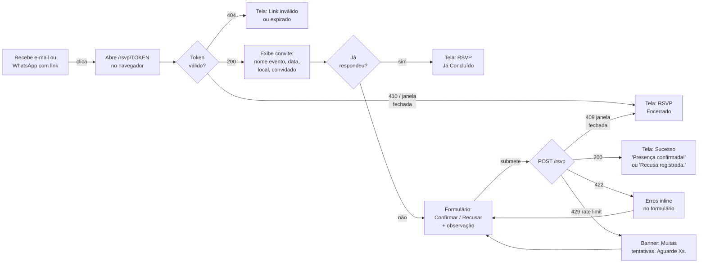
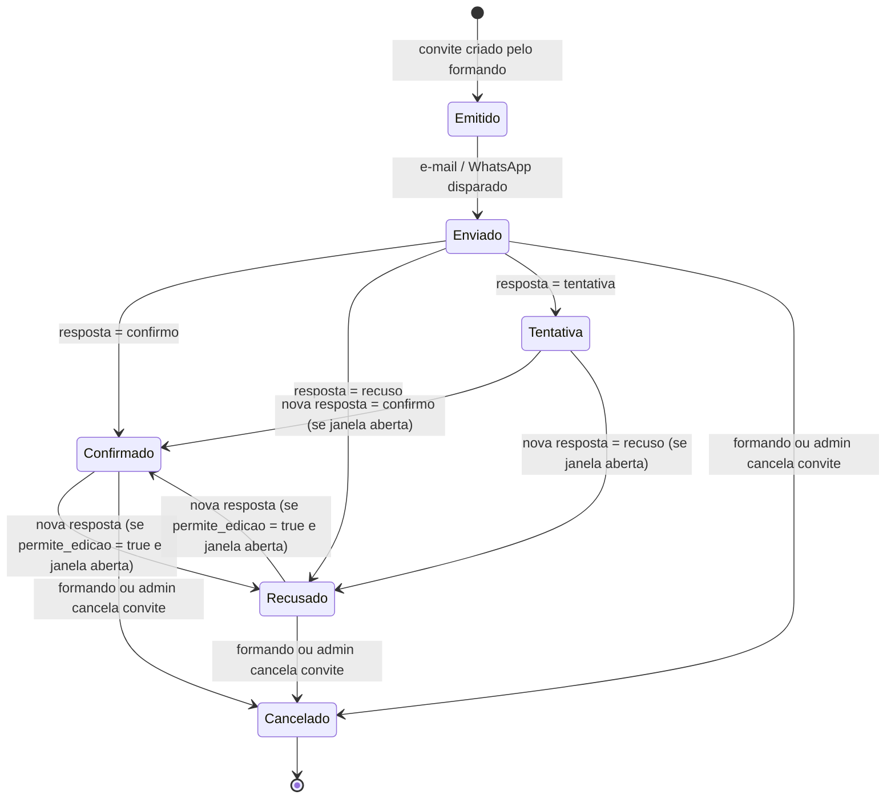

# SPEC-005 — RSVP Público (token mágico)

> **Spec unificada backend + frontend.** Feature de acesso público — sem autenticação Sanctum — que permite ao convidado externo confirmar ou recusar presença em evento de formatura via link mágico enviado por e-mail ou WhatsApp.
> Fontes: [09-TECHNICAL-DESIGN-CRITICAL-MODULES.md §5](../frontend/09-TECHNICAL-DESIGN-CRITICAL-MODULES.md) · [api-contract.md §5](../api/api-contract.md) · [07-DATA-CONTRACTS-AND-VIEW-MODELS.md §3.8, §4.6](../frontend/07-DATA-CONTRACTS-AND-VIEW-MODELS.md)

---

## 0. Resumo executivo

O convidado recebe um link do tipo `https://portal.artfinal.com.br/rsvp/<token>` por e-mail ou WhatsApp. Ao acessar o link, o SPA chama `GET /api/v1/convite/{token}` (sem auth) e exibe os dados do convite e do evento. O convidado preenche seu nome confirmado, escolhe "Confirmar" ou "Recusar" e submete — o SPA chama `POST /api/v1/convite/{token}/rsvp`. A rota `/rsvp/$token` é **completamente pública**: sem guard, sem cookie de sessão, sem `withCredentials`, sem CSRF. O token trafega apenas no path da URL, nunca em query string ou analytics. Rate limit de 10/min por IP protege ambos os endpoints. O formando emissor do convite recebe notificação via `NotificarFormandoRsvpJob` após cada resposta.

---

## 1. Visão da feature

### 1.1 Jornada do convidado



### 1.2 Diagrama de estados do convite (perspectiva RSVP)



### 1.3 Atores

| Ator              | Ação                                                                |
| ----------------- | ------------------------------------------------------------------- |
| Convidado externo | Acessa link mágico, visualiza convite, confirma ou recusa.          |
| Formando          | Emitiu o convite (fora desta spec); recebe notificação da resposta. |
| Sistema           | Valida token, registra resposta, dispara notificação.               |
| Admin             | Fora de escopo desta spec (monitora via backoffice).                |

### 1.4 Valor de negócio

- **Conversão rápida:** convidado não precisa criar conta. Um clique no link, uma ação.
- **Dado real-time para o formando:** notificação imediata a cada resposta de convite.
- **Segurança por obscuridade:** token opaco de 64 hex chars — inviável de adivinhar por força bruta (2^256).
- **Auditoria:** resposta registrada com `respondido_at`, IP (hash) e `user_agent` para fins de conformidade.

### 1.5 Escopo

**In:** visualização do convite (GET), formulário de resposta (POST), telas de estado (sucesso, token inválido, RSVP encerrado, já respondido), rate limiting, notificação ao formando.

**Out:** upload de foto do convidado, convidados adicionais, edição da resposta pelo convidado (o backend aceita se `permite_edicao=true`, mas a UI desta spec não expõe botão de edição explícito — apenas tenta o POST), criação de conta, SSO, integração com calendário.

---

## 2. Contrato da API

### 2.1 `GET /api/v1/convite/{token}`

- **Route name:** `api.v1.convite.show`
- **Middlewares:** `throttle:convite` (10/min por IP), `convite.token` (resolve hash)
- **Auth:** nenhuma (`auth:sanctum` **não** está presente)
- **CSRF:** não exigido
- **Idempotência:** sim (GET é seguro e idempotente)

**Parâmetros de rota:**

| Parâmetro | Tipo                  | Descrição                                                                                                |
| --------- | --------------------- | -------------------------------------------------------------------------------------------------------- |
| `token`   | string (64 hex chars) | Token mágico bruto enviado ao convidado. O backend faz `hash('sha256', $token)` e consulta `token_hash`. |

**Response 200:**

```json
{
    "data": {
        "convite": {
            "id": "01J5K3B5GTYV8E2F1W0M8P2XQA",
            "codigo": "ABCDE123",
            "tipo": "nominal",
            "status": "enviado",
            "convidado": { "nome": "Carlos Alberto" }
        },
        "evento": {
            "id": "01J...",
            "nome": "Baile de Formatura Medicina USP 2026",
            "data_evento": "2026-12-12T21:00:00-03:00",
            "local": {
                "nome": "Espaço Royal",
                "endereco": "Av. Paulista 1234, São Paulo"
            }
        },
        "links": {
            "self": "https://api.portalartfinal.com.br/api/v1/convite/<token>",
            "rsvp": "https://api.portalartfinal.com.br/api/v1/convite/<token>/rsvp"
        }
    }
}
```

**Erros:**

| HTTP | `error`             | Situação                                                                                |
| ---- | ------------------- | --------------------------------------------------------------------------------------- |
| 404  | `NotFound`          | Token não existe, revogado ou expirado. Não distinguir para evitar oracle attack.       |
| 410  | `GoneError`         | Janela RSVP fechada (`fecha_rsvp_at` < agora). Retorna data de fechamento no `details`. |
| 429  | `RateLimitExceeded` | Mais de 10 requisições por minuto pelo mesmo IP.                                        |

### 2.2 `POST /api/v1/convite/{token}/rsvp`

- **Route name:** `api.v1.convite.rsvp.store`
- **Middlewares:** `throttle:convite` (10/min por IP)
- **Auth:** nenhuma
- **CSRF:** não exigido (rota pública sem cookie de sessão)
- **Idempotência:** sim — o mesmo token pode ser submetido múltiplas vezes se `permite_edicao=true`

**Request:**

```json
{
    "resposta": "confirmo",
    "nome_confirmado": "Carlos Alberto Silva",
    "observacao": "Intolerância a lactose"
}
```

**Validação:**

| Campo             | Regra                                    |
| ----------------- | ---------------------------------------- |
| `resposta`        | `required\|in:confirmo,recuso,tentativa` |
| `nome_confirmado` | `required\|string\|max:150`              |
| `observacao`      | `nullable\|string\|max:500`              |

**Response 200:**

```json
{
    "data": {
        "convite": {
            "id": "01J5K3B5GTYV8E2F1W0M8P2XQA",
            "status": "confirmado",
            "confirmado_at": "2026-10-20T18:30:00-03:00"
        }
    }
}
```

**Erros:**

| HTTP | `error`              | Situação                                                 |
| ---- | -------------------- | -------------------------------------------------------- |
| 409  | `InvariantViolation` | Convite cancelado/inutilizado ou janela RSVP fechada.    |
| 422  | `ValidationError`    | Payload inválido — `details.fields` com erros por campo. |
| 429  | `RateLimitExceeded`  | Rate limit estourado.                                    |

### 2.3 Headers e segurança

| Header            | Direção | Obrigatório | Observação                                                |
| ----------------- | ------- | ----------- | --------------------------------------------------------- |
| `X-Request-Id`    | req/res | Sim         | ULID gerado pelo cliente para correlação de logs.         |
| `Accept`          | req     | Sim         | `application/json`                                        |
| `Content-Type`    | req     | Sim (POST)  | `application/json`                                        |
| `X-XSRF-TOKEN`    | req     | **Não**     | Rota pública sem CSRF. Não enviar cookie de sessão.       |
| `withCredentials` | req     | **Não**     | Usar cliente HTTP sem `withCredentials` para estas rotas. |

> **Segurança:** o token trafega **somente no path** da URL. Nunca incluir em query string (`?token=...`) para evitar captura por analytics, logs de servidor, Referer headers ou histórico do navegador.

---

## 3. Backend — Laravel 13

### 3.1 Arquivos a criar/modificar

| Arquivo                                            | Ação      | Responsabilidade                                                          |
| -------------------------------------------------- | --------- | ------------------------------------------------------------------------- |
| `routes/api/v1.php`                                | Modificar | Registrar 2 rotas públicas do RSVP (sem `auth:sanctum`).                  |
| `app/Http/Controllers/Api/V1/RsvpController.php`   | Criar     | `show()` e `store()` — magros, delegam para Action.                       |
| `app/Http/Requests/Api/V1/RsvpRequest.php`         | Criar     | FormRequest com regras de validação do RSVP.                              |
| `app/Http/Middleware/ResolveConviteToken.php`      | Criar     | Middleware `convite.token`: resolve `sha256($token)` → `$convite`.        |
| `app/Actions/Convites/RegistrarRsvpAction.php`     | Criar     | Lógica atômica: validar janela, atualizar status, disparar event.         |
| `app/Events/RsvpRegistrado.php`                    | Criar     | Evento disparado após registro bem-sucedido.                              |
| `app/Listeners/NotificarFormandoRsvpListener.php`  | Criar     | Ouve `RsvpRegistrado`, enfileira `NotificarFormandoRsvpJob`.              |
| `app/Jobs/NotificarFormandoRsvpJob.php`            | Criar     | Envia notificação (e-mail/push) ao formando. Fila `emails`.               |
| `app/Http/Resources/V1/ConvitePublicoResource.php` | Criar     | Serialização segura — sem dados sensíveis do formando.                    |
| `app/Providers/RateLimiterServiceProvider.php`     | Modificar | Registrar limiter `convite` (10/min por IP).                              |
| `tests/Feature/Api/V1/Rsvp/ConviteShowTest.php`    | Criar     | 4 cenários Pest (token válido, 404, 410, 429).                            |
| `tests/Feature/Api/V1/Rsvp/RsvpStoreTest.php`      | Criar     | 5 cenários Pest (confirmar, recusar, duplo idempotente, janela 409, 422). |

### 3.2 Registro das rotas públicas

```php
// routes/api/v1.php — trecho RSVP (sem auth:sanctum)
Route::prefix('convite')->name('convite.')->group(function () {
    Route::middleware(['throttle:convite', 'convite.token'])
        ->group(function () {
            Route::get('{token}', [RsvpController::class, 'show'])
                ->name('show');

            Route::post('{token}/rsvp', [RsvpController::class, 'store'])
                ->name('rsvp.store');
        });
});
```

> As rotas ficam **fora** do grupo `auth:sanctum`. Confirmar em `bootstrap/app.php` que `EnsureFrontendRequestsAreStateful` não bloqueia rotas sem prefixo `api/v1/auth`.

### 3.3 `ResolveConviteToken` middleware

```php
<?php
declare(strict_types=1);

namespace App\Http\Middleware;

use App\Models\Convite;
use Closure;
use Illuminate\Http\Request;
use Illuminate\Support\Facades\App;
use Symfony\Component\HttpFoundation\Response;

final class ResolveConviteToken
{
    public function handle(Request $request, Closure $next): Response
    {
        $rawToken = (string) $request->route('token');

        // Validação de formato antes de consultar o banco
        if (! preg_match('/^[a-f0-9]{64}$/i', $rawToken)) {
            abort(404, 'Token de convite inválido.');
        }

        $tokenHash = hash('sha256', $rawToken);
        $convite   = Convite::where('token_hash', $tokenHash)->first();

        if ($convite === null) {
            abort(404, 'Convite não encontrado.');
        }

        // Bind para o container — RsvpController pode type-hint Convite
        App::instance('convite.atual', $convite);
        $request->attributes->set('convite', $convite);

        return $next($request);
    }
}
```

### 3.4 `RsvpController`

```php
<?php
declare(strict_types=1);

namespace App\Http\Controllers\Api\V1;

use App\Actions\Convites\RegistrarRsvpAction;
use App\Http\Controllers\Controller;
use App\Http\Requests\Api\V1\RsvpRequest;
use App\Http\Resources\V1\ConvitePublicoResource;
use App\Models\Convite;
use Illuminate\Http\JsonResponse;
use Illuminate\Http\Request;

final class RsvpController extends Controller
{
    public function show(Request $request): JsonResponse
    {
        /** @var Convite $convite */
        $convite = $request->attributes->get('convite');

        return response()->json([
            'data' => new ConvitePublicoResource($convite->load('evento.local')),
        ]);
    }

    public function store(RsvpRequest $request, RegistrarRsvpAction $action): JsonResponse
    {
        /** @var Convite $convite */
        $convite = $request->attributes->get('convite');

        $resultado = $action->execute($convite, $request->validated());

        return response()->json(['data' => $resultado->toArray()]);
    }
}
```

### 3.5 `RsvpRequest`

```php
<?php
declare(strict_types=1);

namespace App\Http\Requests\Api\V1;

use Illuminate\Foundation\Http\FormRequest;

final class RsvpRequest extends FormRequest
{
    public function authorize(): bool
    {
        return true; // rota pública — autorização via middleware convite.token
    }

    public function rules(): array
    {
        return [
            'resposta'         => ['required', 'string', 'in:confirmo,recuso,tentativa'],
            'nome_confirmado'  => ['required', 'string', 'max:150'],
            'observacao'       => ['nullable', 'string', 'max:500'],
        ];
    }

    public function messages(): array
    {
        return [
            'resposta.required'        => 'Informe sua resposta (confirmo, recuso ou tentativa).',
            'resposta.in'              => 'Resposta inválida. Use confirmo, recuso ou tentativa.',
            'nome_confirmado.required' => 'Informe o nome completo do convidado.',
            'nome_confirmado.max'      => 'O nome não pode ter mais de 150 caracteres.',
            'observacao.max'           => 'A observação não pode ter mais de 500 caracteres.',
        ];
    }
}
```

### 3.6 `RegistrarRsvpAction`

```php
<?php
declare(strict_types=1);

namespace App\Actions\Convites;

use App\DTOs\Convites\RsvpResultadoDTO;
use App\Enums\StatusConvite;
use App\Events\RsvpRegistrado;
use App\Exceptions\InvariantViolationException;
use App\Models\Convite;
use Illuminate\Support\Facades\DB;

final class RegistrarRsvpAction
{
    /**
     * @param  array{resposta: string, nome_confirmado: string, observacao: string|null}  $dados
     */
    public function execute(Convite $convite, array $dados): RsvpResultadoDTO
    {
        // 1. Verificar se o convite pode receber resposta
        if ($convite->status === StatusConvite::CANCELADO) {
            throw new InvariantViolationException('Este convite foi cancelado e não aceita respostas.');
        }

        // 2. Verificar janela RSVP do evento
        $evento = $convite->evento;
        $agora  = now();

        if ($evento->fecha_rsvp_at !== null && $agora->isAfter($evento->fecha_rsvp_at)) {
            throw new InvariantViolationException('O período de confirmação de presença foi encerrado.');
        }

        if ($evento->abre_rsvp_at !== null && $agora->isBefore($evento->abre_rsvp_at)) {
            throw new InvariantViolationException('O período de confirmação ainda não foi aberto.');
        }

        // 3. Persistir resposta de forma atômica
        return DB::transaction(function () use ($convite, $dados, $agora): RsvpResultadoDTO {
            $novoStatus = match ($dados['resposta']) {
                'confirmo'  => StatusConvite::CONFIRMADO,
                'recuso'    => StatusConvite::RECUSADO,
                'tentativa' => StatusConvite::TENTATIVA,
            };

            $convite->update([
                'status'           => $novoStatus,
                'nome_confirmado'  => $dados['nome_confirmado'],
                'observacao_rsvp'  => $dados['observacao'] ?? null,
                'respondido_at'    => $agora,
            ]);

            $convite->refresh();

            // 4. Disparar evento de domínio
            RsvpRegistrado::dispatch($convite);

            return new RsvpResultadoDTO(
                conviteId:     $convite->id,
                status:        $convite->status,
                confirmadoAt:  $convite->respondido_at?->toIso8601String(),
            );
        });
    }
}
```

### 3.7 DTO de resultado

```php
<?php
declare(strict_types=1);

namespace App\DTOs\Convites;

use App\Enums\StatusConvite;

readonly class RsvpResultadoDTO
{
    public function __construct(
        public string       $conviteId,
        public StatusConvite $status,
        public string|null  $confirmadoAt,
    ) {}

    public function toArray(): array
    {
        return [
            'convite' => [
                'id'            => $this->conviteId,
                'status'        => $this->status->value,
                'confirmado_at' => $this->confirmadoAt,
            ],
        ];
    }
}
```

### 3.8 `ConvitePublicoResource`

```php
<?php
declare(strict_types=1);

namespace App\Http\Resources\V1;

use App\Models\Convite;
use Illuminate\Http\Request;
use Illuminate\Http\Resources\Json\JsonResource;

/** @mixin Convite */
final class ConvitePublicoResource extends JsonResource
{
    public function toArray(Request $request): array
    {
        return [
            'convite' => [
                'id'        => $this->id,
                'codigo'    => $this->codigo,
                'tipo'      => $this->tipo->value,
                'status'    => $this->status->value,
                'convidado' => [
                    'nome' => $this->nome_convidado,
                    // CPF, email e telefone do formando NUNCA expostos aqui
                ],
            ],
            'evento' => [
                'id'          => $this->evento->id,
                'nome'        => $this->evento->nome,
                'data_evento' => $this->evento->data_evento?->toIso8601String(),
                'local'       => $this->evento->local ? [
                    'nome'     => $this->evento->local->nome,
                    'endereco' => $this->evento->local->endereco,
                ] : null,
            ],
            'links' => [
                'self' => route('api.v1.convite.show', ['token' => $request->route('token')]),
                'rsvp' => route('api.v1.convite.rsvp.store', ['token' => $request->route('token')]),
            ],
        ];
    }
}
```

### 3.9 Evento e Listener

```php
// app/Events/RsvpRegistrado.php
<?php
declare(strict_types=1);

namespace App\Events;

use App\Models\Convite;
use Illuminate\Foundation\Events\Dispatchable;
use Illuminate\Queue\SerializesModels;

final class RsvpRegistrado
{
    use Dispatchable, SerializesModels;

    public function __construct(
        public readonly Convite $convite,
    ) {}
}
```

```php
// app/Listeners/NotificarFormandoRsvpListener.php
<?php
declare(strict_types=1);

namespace App\Listeners;

use App\Events\RsvpRegistrado;
use App\Jobs\NotificarFormandoRsvpJob;

final class NotificarFormandoRsvpListener
{
    public function handle(RsvpRegistrado $event): void
    {
        NotificarFormandoRsvpJob::dispatch($event->convite)->onQueue('emails');
    }
}
```

### 3.10 Rate limiter `convite`

Em `RateLimiterServiceProvider::boot()`:

```php
RateLimiter::for('convite', function (Request $request) {
    return Limit::perMinute(10)->by($request->ip())->response(function () {
        return response()->json([
            'error'      => 'RateLimitExceeded',
            'message'    => 'Muitas tentativas. Tente novamente em instantes.',
            'details'    => null,
            'request_id' => request()->header('X-Request-Id'),
            'timestamp'  => now()->toIso8601String(),
        ], 429);
    });
});
```

### 3.11 Testes Pest (mínimo obrigatório — 9 cenários)

```php
// tests/Feature/Api/V1/Rsvp/ConviteShowTest.php

it('retorna 200 com dados do convite para token válido dentro da janela', function () {
    $convite = Convite::factory()->withTokenValido()->comJanelaRsvpAberta()->create();

    $response = $this->getJson("/api/v1/convite/{$convite->token_raw}");

    $response->assertOk()
        ->assertJsonPath('data.convite.status', 'enviado')
        ->assertJsonPath('data.evento.nome', $convite->evento->nome)
        ->assertJsonStructure(['data' => ['convite', 'evento', 'links']]);
});

it('retorna 404 para token inexistente', function () {
    $tokenFalso = str_repeat('a', 64);

    $response = $this->getJson("/api/v1/convite/{$tokenFalso}");

    $response->assertNotFound()
        ->assertJsonPath('error', 'NotFound');
});

it('retorna 410 quando janela RSVP está fechada', function () {
    $convite = Convite::factory()->withTokenValido()->comJanelaRsvpFechada()->create();

    $response = $this->getJson("/api/v1/convite/{$convite->token_raw}");

    $response->assertStatus(410)
        ->assertJsonPath('error', 'GoneError');
});

it('retorna 429 após 10 requisições por minuto do mesmo IP', function () {
    $convite = Convite::factory()->withTokenValido()->comJanelaRsvpAberta()->create();

    for ($i = 0; $i < 10; $i++) {
        $this->getJson("/api/v1/convite/{$convite->token_raw}");
    }

    $this->getJson("/api/v1/convite/{$convite->token_raw}")
        ->assertStatus(429)
        ->assertJsonPath('error', 'RateLimitExceeded');
});
```

```php
// tests/Feature/Api/V1/Rsvp/RsvpStoreTest.php

it('confirma presença com sucesso e notifica formando', function () {
    Event::fake([RsvpRegistrado::class]);
    $convite = Convite::factory()->withTokenValido()->comJanelaRsvpAberta()->create();

    $response = $this->postJson("/api/v1/convite/{$convite->token_raw}/rsvp", [
        'resposta'        => 'confirmo',
        'nome_confirmado' => 'Carlos Alberto Silva',
        'observacao'      => null,
    ]);

    $response->assertOk()
        ->assertJsonPath('data.convite.status', 'confirmado');

    Event::assertDispatched(RsvpRegistrado::class);
    $this->assertDatabaseHas('convites', [
        'id'     => $convite->id,
        'status' => 'confirmado',
    ]);
});

it('registra recusa com observação livre', function () {
    $convite = Convite::factory()->withTokenValido()->comJanelaRsvpAberta()->create();

    $response = $this->postJson("/api/v1/convite/{$convite->token_raw}/rsvp", [
        'resposta'        => 'recuso',
        'nome_confirmado' => 'Carlos Alberto',
        'observacao'      => 'Não poderei comparecer.',
    ]);

    $response->assertOk()
        ->assertJsonPath('data.convite.status', 'recusado');

    $this->assertDatabaseHas('convites', [
        'id'              => $convite->id,
        'observacao_rsvp' => 'Não poderei comparecer.',
    ]);
});

it('é idempotente: confirmar duas vezes com mesmo token resulta em 200 ambas as vezes', function () {
    $convite = Convite::factory()->withTokenValido()->comJanelaRsvpAberta()->comPermiteEdicao()->create();
    $payload = ['resposta' => 'confirmo', 'nome_confirmado' => 'Carlos A.'];

    $this->postJson("/api/v1/convite/{$convite->token_raw}/rsvp", $payload)->assertOk();
    $this->postJson("/api/v1/convite/{$convite->token_raw}/rsvp", $payload)->assertOk();

    $this->assertDatabaseCount('convites', 1); // sem duplicação
});

it('retorna 409 ao tentar confirmar fora da janela RSVP', function () {
    $convite = Convite::factory()->withTokenValido()->comJanelaRsvpFechada()->create();

    $this->postJson("/api/v1/convite/{$convite->token_raw}/rsvp", [
        'resposta'        => 'confirmo',
        'nome_confirmado' => 'Carlos A.',
    ])->assertStatus(409)
      ->assertJsonPath('error', 'InvariantViolation');
});

it('retorna 422 quando campo resposta é inválido', function () {
    $convite = Convite::factory()->withTokenValido()->comJanelaRsvpAberta()->create();

    $this->postJson("/api/v1/convite/{$convite->token_raw}/rsvp", [
        'resposta'        => 'talvez', // valor não permitido
        'nome_confirmado' => 'Carlos',
    ])->assertUnprocessable()
      ->assertJsonPath('error', 'ValidationError')
      ->assertJsonStructure(['details' => ['fields' => ['resposta']]]);
});
```

---

## 4. Frontend — React 19 SPA

### 4.1 Arquivos a criar

| Arquivo                                                    | Ação  | Responsabilidade                                                       |
| ---------------------------------------------------------- | ----- | ---------------------------------------------------------------------- |
| `resources/spa/src/routes/rsvp/$token.tsx`                 | Criar | Rota pública `/rsvp/$token` — sem guard, fora de `portal/_layout.tsx`. |
| `resources/spa/src/api/hooks/use-rsvp.ts`                  | Criar | `useConvitePublico` (query) e `useRsvpResponder` (mutation).           |
| `resources/spa/src/api/dto/convite-publico.ts`             | Criar | Interface `ConvitePublicoDto` tipada.                                  |
| `resources/spa/src/view-models/convite-publico.ts`         | Criar | `ConvitePublicoViewModel` + `toConvitePublicoViewModel()`.             |
| `resources/spa/src/forms/rsvp/rsvp.schema.ts`              | Criar | Schema Zod + type `RsvpFormData`.                                      |
| `resources/spa/src/components/rsvp/rsvp-page.tsx`          | Criar | Orquestra loading / estados / erro / formulário / sucesso.             |
| `resources/spa/src/components/rsvp/convite-card.tsx`       | Criar | Banner com dados do evento e nome do convidado.                        |
| `resources/spa/src/components/rsvp/rsvp-form.tsx`          | Criar | Formulário RHF + Zod: 2 botões + campo observação.                     |
| `resources/spa/src/components/rsvp/rsvp-success.tsx`       | Criar | Tela de sucesso pós-resposta.                                          |
| `resources/spa/src/components/rsvp/rsvp-expired.tsx`       | Criar | Tela de RSVP encerrado (410 ou 409 janela fechada).                    |
| `resources/spa/src/components/rsvp/rsvp-invalid-token.tsx` | Criar | Tela de token inválido (404 ou formato errado).                        |
| `resources/spa/src/components/rsvp/rsvp-ja-concluido.tsx`  | Criar | Tela exibida quando `vm.jaRespondeu === true`.                         |
| `resources/spa/tests/unit/convite-publico-vm.test.ts`      | Criar | Testa `toConvitePublicoViewModel` e `jaRespondeu`.                     |
| `resources/spa/tests/integration/rsvp-form.test.tsx`       | Criar | 4 testes RTL + MSW (happy confirmar, happy recusar, 422, 429).         |
| `resources/spa/tests/e2e/rsvp.spec.ts`                     | Criar | 3 cenários Playwright (happy path, token inválido, janela expirada).   |

### 4.2 Cliente HTTP específico para rotas públicas

As rotas RSVP são públicas. **Não usar** o `api` client que seta `withCredentials: true`. Criar cliente separado ou chamada direta sem credenciais:

```typescript
// resources/spa/src/api/public-client.ts
import axios from 'axios';
import { ApiError } from './errors';
import type { AxiosError } from 'axios';

/**
 * Cliente HTTP para rotas públicas (sem auth, sem CSRF, sem withCredentials).
 * Usado exclusivamente pela feature RSVP público.
 */
export const publicApi = axios.create({
    baseURL: '/api/v1',
    withCredentials: false, // rota pública — sem cookie de sessão
    headers: {
        Accept: 'application/json',
        'Content-Type': 'application/json',
        'X-Requested-With': 'XMLHttpRequest',
    },
});

// Interceptor: X-Request-Id
publicApi.interceptors.request.use((config) => {
    config.headers['X-Request-Id'] = crypto.randomUUID();
    return config;
});

// Interceptor: Error envelope → ApiError
publicApi.interceptors.response.use(
    (r) => r,
    (err: AxiosError<{ error: string; message: string; details?: unknown; request_id: string }>) => {
        const data = err.response?.data;
        throw new ApiError(
            data?.error ?? 'InternalServerError',
            data?.message ?? 'Erro inesperado',
            data?.details ?? null,
            data?.request_id ?? '',
            err.response?.status ?? 500,
        );
    },
);
```

### 4.3 DTO e ViewModel

```typescript
// resources/spa/src/api/dto/convite-publico.ts

export type TipoConvite = 'nominal' | 'mesa' | 'familia';

export type StatusConvite = 'emitido' | 'enviado' | 'confirmado' | 'recusado' | 'tentativa' | 'cancelado';

export interface ConvitePublicoDto {
    convite: {
        id: string;
        codigo: string;
        tipo: TipoConvite;
        status: StatusConvite;
        convidado: { nome: string };
    };
    evento: {
        id: string;
        nome: string;
        data_evento: string; // ISO 8601
        local: { nome: string; endereco: string } | null;
    };
    links: {
        self: string;
        rsvp: string;
    };
}
```

```typescript
// resources/spa/src/view-models/convite-publico.ts
import type { ConvitePublicoDto, StatusConvite } from '@/api/dto/convite-publico';
import { formatDateTimePtBr } from '@/lib/date';

export interface ConvitePublicoViewModel {
    conviteId: string;
    codigo: string;
    convidadoNome: string;
    statusConvite: StatusConvite;
    jaRespondeu: boolean;
    cancelado: boolean;
    eventoNome: string;
    eventoDataFormatada: string;
    localNome: string | null;
    localEndereco: string | null;
    linkRsvp: string;
}

const STATUS_JA_RESPONDEU: StatusConvite[] = ['confirmado', 'recusado', 'tentativa'];

export function toConvitePublicoViewModel(dto: ConvitePublicoDto): ConvitePublicoViewModel {
    return {
        conviteId: dto.convite.id,
        codigo: dto.convite.codigo,
        convidadoNome: dto.convite.convidado.nome,
        statusConvite: dto.convite.status,
        jaRespondeu: STATUS_JA_RESPONDEU.includes(dto.convite.status),
        cancelado: dto.convite.status === 'cancelado',
        eventoNome: dto.evento.nome,
        eventoDataFormatada: formatDateTimePtBr(dto.evento.data_evento),
        localNome: dto.evento.local?.nome ?? null,
        localEndereco: dto.evento.local?.endereco ?? null,
        linkRsvp: dto.links.rsvp,
    };
}
```

### 4.4 Hooks TanStack Query

```typescript
// resources/spa/src/api/hooks/use-rsvp.ts
import { useMutation, useQuery, useQueryClient } from '@tanstack/react-query';
import { publicApi } from '../public-client';
import { ApiError } from '../errors';
import { toConvitePublicoViewModel } from '@/view-models/convite-publico';
import type { ConvitePublicoDto } from '../dto/convite-publico';
import type { SingleEnvelope } from '../types.gen';

// Regex de validação de formato — evita chamada API com token claramente inválido
const TOKEN_REGEX = /^[a-f0-9]{64}$/i;

export const rsvpQueryKeys = {
    convite: (token: string) => ['rsvp', 'convite', token] as const,
} as const;

/**
 * Busca os dados públicos do convite pelo token mágico.
 * Desativa retry em 404, 410 e 429 — erros não transitórios.
 */
export function useConvitePublico(token: string | null) {
    return useQuery({
        queryKey: rsvpQueryKeys.convite(token ?? ''),
        enabled: !!token && TOKEN_REGEX.test(token),
        staleTime: 0, // dados de RSVP devem ser sempre frescos
        queryFn: async () => {
            const { data } = await publicApi.get<SingleEnvelope<ConvitePublicoDto>>(`/convite/${token}`);
            return toConvitePublicoViewModel(data.data);
        },
        retry: (failureCount, error) => {
            if (error instanceof ApiError && [404, 410, 429].includes(error.status)) {
                return false; // sem retry para erros definitivos
            }
            return failureCount < 1;
        },
    });
}

export interface RsvpInput {
    token: string;
    resposta: 'confirmo' | 'recuso' | 'tentativa';
    nomeConfirmado: string;
    observacao?: string;
}

/**
 * Mutation para registrar a resposta do convidado.
 * Invalida a query do convite após sucesso para refletir novo status.
 */
export function useRsvpResponder() {
    const qc = useQueryClient();
    return useMutation({
        mutationFn: async (input: RsvpInput) => {
            const { data } = await publicApi.post<
                SingleEnvelope<{ convite: { id: string; status: string; confirmado_at: string | null } }>
            >(`/convite/${input.token}/rsvp`, {
                resposta: input.resposta,
                nome_confirmado: input.nomeConfirmado,
                observacao: input.observacao ?? null,
            });
            return data.data;
        },
        onSuccess: (_, input) => {
            // Invalida query para forçar re-fetch com novo status
            qc.invalidateQueries({ queryKey: rsvpQueryKeys.convite(input.token) });
        },
    });
}
```

### 4.5 Schema Zod do formulário

```typescript
// resources/spa/src/forms/rsvp/rsvp.schema.ts
import { z } from 'zod';

export const rsvpSchema = z.object({
    resposta: z.enum(['confirmo', 'recuso', 'tentativa'], {
        required_error: 'Selecione sua resposta.',
        invalid_type_error: 'Resposta inválida.',
    }),
    nome_confirmado: z
        .string({ required_error: 'Informe o nome completo.' })
        .min(2, 'Nome deve ter ao menos 2 caracteres.')
        .max(150, 'Nome não pode ter mais de 150 caracteres.'),
    observacao: z.string().max(500, 'Observação não pode ter mais de 500 caracteres.').optional(),
});

export type RsvpFormData = z.infer<typeof rsvpSchema>;
```

### 4.6 Rota `/rsvp/$token`

```typescript
// resources/spa/src/routes/rsvp/$token.tsx
import { createFileRoute } from '@tanstack/react-router'
import { RsvpPage } from '@/components/rsvp/rsvp-page'

// Validação local de formato — evita chamada à API com token claramente malformado
const TOKEN_REGEX = /^[a-f0-9]{64}$/i

export const Route = createFileRoute('/rsvp/$token')({
  parseParams: ({ token }) => ({
    // Token vazio aciona <RsvpInvalidToken> sem chamar API
    token: TOKEN_REGEX.test(token) ? token : '',
  }),
  // Meta tags Open Graph para o link mágico
  head: () => ({
    meta: [
      { name: 'robots', content: 'noindex, nofollow' }, // não indexar links de RSVP
    ],
  }),
  component: RsvpRoute,
})

function RsvpRoute() {
  const { token } = Route.useParams()
  return <RsvpPage token={token} />
}
```

> **Nota arquitetural:** a rota `/rsvp/$token` fica **fora** de `routes/portal/_layout.tsx`. No TanStack Router v1, isso significa que não passa pelo guard de autenticação. A organização de pastas é:
>
> ```
> src/routes/
> ├── __root.tsx
> ├── index.tsx
> ├── login.tsx
> ├── rsvp/            ← público, sem guard
> │   └── $token.tsx
> └── portal/
>     ├── _layout.tsx  ← guard: auth:sanctum
>     └── home.tsx
> ```

### 4.7 Componente `RsvpPage` (orquestrador)

```typescript
// resources/spa/src/components/rsvp/rsvp-page.tsx
import { useConvitePublico } from '@/api/hooks/use-rsvp'
import { ApiError } from '@/api/errors'
import { ConviteCard } from './convite-card'
import { RsvpForm } from './rsvp-form'
import { RsvpSuccess } from './rsvp-success'
import { RsvpExpired } from './rsvp-expired'
import { RsvpInvalidToken } from './rsvp-invalid-token'
import { RsvpJaConcluido } from './rsvp-ja-concluido'

interface Props {
  token: string
}

export function RsvpPage({ token }: Props) {
  const [respondido, setRespondido] = React.useState<'confirmo' | 'recuso' | 'tentativa' | null>(null)

  const { data: vm, isPending, error } = useConvitePublico(token || null)

  // Token com formato inválido (parseParams retornou string vazia)
  if (!token) return <RsvpInvalidToken />

  if (isPending) {
    return (
      <div className="flex min-h-screen items-center justify-center">
        <p className="text-gray-500 animate-pulse">Carregando convite...</p>
      </div>
    )
  }

  if (error instanceof ApiError) {
    if (error.status === 404) return <RsvpInvalidToken />
    if (error.status === 410) return <RsvpExpired />
  }

  if (!vm) return <RsvpInvalidToken />

  // Pós-resposta bem-sucedida nesta sessão
  if (respondido !== null) {
    return <RsvpSuccess resposta={respondido} eventoNome={vm.eventoNome} />
  }

  // Convite já tinha resposta antes desta sessão
  if (vm.jaRespondeu) {
    return <RsvpJaConcluido vm={vm} />
  }

  // Convite cancelado
  if (vm.cancelado) {
    return <RsvpExpired motivo="Este convite foi cancelado." />
  }

  return (
    <div className="min-h-screen bg-gradient-to-b from-slate-50 to-white">
      <ConviteCard vm={vm} />
      <RsvpForm
        token={token}
        nomeConvidado={vm.convidadoNome}
        onSuccess={(resposta) => setRespondido(resposta)}
      />
    </div>
  )
}
```

### 4.8 Componente `RsvpForm`

```typescript
// resources/spa/src/components/rsvp/rsvp-form.tsx
import { useForm } from 'react-hook-form'
import { zodResolver } from '@hookform/resolvers/zod'
import { rsvpSchema, type RsvpFormData } from '@/forms/rsvp/rsvp.schema'
import { useRsvpResponder } from '@/api/hooks/use-rsvp'
import { ApiError } from '@/api/errors'

interface Props {
  token: string
  nomeConvidado: string
  onSuccess: (resposta: 'confirmo' | 'recuso' | 'tentativa') => void
}

export function RsvpForm({ token, nomeConvidado, onSuccess }: Props) {
  const [rateLimitMsg, setRateLimitMsg] = React.useState<string | null>(null)

  const {
    register,
    handleSubmit,
    setValue,
    watch,
    setError,
    formState: { errors, isSubmitting },
  } = useForm<RsvpFormData>({
    resolver: zodResolver(rsvpSchema),
    defaultValues: { nome_confirmado: nomeConvidado },
  })

  const resposta = watch('resposta')
  const { mutateAsync } = useRsvpResponder()

  const onSubmit = async (data: RsvpFormData) => {
    setRateLimitMsg(null)
    try {
      await mutateAsync({
        token,
        resposta:        data.resposta,
        nomeConfirmado:  data.nome_confirmado,
        observacao:      data.observacao,
      })
      onSuccess(data.resposta)
    } catch (err) {
      if (err instanceof ApiError) {
        if (err.status === 422 && err.details?.fields) {
          // Mapear erros de campo do backend para RHF
          Object.entries(err.details.fields as Record<string, string[]>).forEach(
            ([field, msgs]) => setError(field as keyof RsvpFormData, { message: msgs[0] }),
          )
          return
        }
        if (err.status === 429) {
          setRateLimitMsg('Muitas tentativas. Aguarde alguns segundos e tente novamente.')
          return
        }
        if (err.status === 409) {
          setRateLimitMsg(err.message)
          return
        }
      }
      setRateLimitMsg('Erro inesperado. Tente novamente.')
    }
  }

  return (
    <form
      onSubmit={handleSubmit(onSubmit)}
      className="mx-auto max-w-md space-y-6 p-6"
      aria-label="Formulário de confirmação de presença"
      noValidate
    >
      {rateLimitMsg && (
        <div role="alert" className="rounded-md bg-yellow-50 p-4 text-sm text-yellow-800">
          {rateLimitMsg}
        </div>
      )}

      {/* Campo nome confirmado */}
      <div>
        <label htmlFor="nome_confirmado" className="mb-1 block text-sm font-medium text-gray-700">
          Seu nome completo
        </label>
        <input
          id="nome_confirmado"
          type="text"
          {...register('nome_confirmado')}
          aria-invalid={!!errors.nome_confirmado}
          aria-describedby={errors.nome_confirmado ? 'erro-nome' : undefined}
          className="w-full rounded-lg border border-gray-300 px-4 py-2 focus:outline-none focus:ring-2 focus:ring-indigo-500"
          placeholder="Ex: Carlos Alberto Silva"
        />
        {errors.nome_confirmado && (
          <p id="erro-nome" role="alert" className="mt-1 text-sm text-red-600">
            {errors.nome_confirmado.message}
          </p>
        )}
      </div>

      {/* Botões de resposta */}
      <div className="flex gap-3">
        <button
          type="button"
          onClick={() => setValue('resposta', 'confirmo', { shouldValidate: true })}
          aria-pressed={resposta === 'confirmo'}
          className={`flex-1 rounded-lg border-2 px-4 py-3 text-sm font-semibold transition
            ${resposta === 'confirmo'
              ? 'border-green-600 bg-green-600 text-white'
              : 'border-gray-300 bg-white text-gray-700 hover:border-green-400'}`}
        >
          Confirmar presença
        </button>
        <button
          type="button"
          onClick={() => setValue('resposta', 'recuso', { shouldValidate: true })}
          aria-pressed={resposta === 'recuso'}
          className={`flex-1 rounded-lg border-2 px-4 py-3 text-sm font-semibold transition
            ${resposta === 'recuso'
              ? 'border-red-600 bg-red-600 text-white'
              : 'border-gray-300 bg-white text-gray-700 hover:border-red-400'}`}
        >
          Não poderei ir
        </button>
      </div>
      {errors.resposta && (
        <p role="alert" className="text-sm text-red-600">{errors.resposta.message}</p>
      )}

      {/* Observação — exibida sempre para ambas as respostas */}
      <div>
        <label htmlFor="observacao" className="mb-1 block text-sm font-medium text-gray-700">
          Observação <span className="text-gray-400">(opcional)</span>
        </label>
        <textarea
          id="observacao"
          {...register('observacao')}
          rows={3}
          maxLength={500}
          aria-invalid={!!errors.observacao}
          className="w-full resize-none rounded-lg border border-gray-300 px-4 py-2 focus:outline-none focus:ring-2 focus:ring-indigo-500"
          placeholder="Ex: intolerância a glúten, restrição de mobilidade..."
        />
        {errors.observacao && (
          <p role="alert" className="mt-1 text-sm text-red-600">{errors.observacao.message}</p>
        )}
      </div>

      <button
        type="submit"
        disabled={isSubmitting || !resposta}
        className="w-full rounded-lg bg-indigo-600 px-6 py-3 text-sm font-semibold text-white
          hover:bg-indigo-700 disabled:cursor-not-allowed disabled:opacity-50 transition"
      >
        {isSubmitting ? 'Enviando...' : 'Confirmar resposta'}
      </button>
    </form>
  )
}
```

### 4.9 Tratamento de erros por código HTTP

| `ApiError.error`      | HTTP | Tela / UX                                                                 |
| --------------------- | ---- | ------------------------------------------------------------------------- |
| `NotFound`            | 404  | `<RsvpInvalidToken>` — "Link inválido. Verifique o e-mail recebido."      |
| `GoneError`           | 410  | `<RsvpExpired>` — "O período de confirmação foi encerrado."               |
| `InvariantViolation`  | 409  | Banner inline — mensagem do backend (janela fechada / convite cancelado). |
| `ValidationError`     | 422  | `setError` RHF por campo (`nome_confirmado`, `observacao`).               |
| `RateLimitExceeded`   | 429  | Banner — "Muitas tentativas. Aguarde alguns segundos."                    |
| `InternalServerError` | 5xx  | Banner — "Erro inesperado. Tente novamente. ID: {request_id}."            |

---

## 5. Ordem de implementação (BE → FE → E2E)

### Gate A — Backend: middlewares e rotas

1. Criar `app/Http/Middleware/ResolveConviteToken.php`.
2. Registrar alias `convite.token` em `bootstrap/app.php`.
3. Registrar rate limiter `convite` (10/min/IP) no `RateLimiterServiceProvider`.
4. Criar as 2 rotas públicas em `routes/api/v1.php`.

> **Gate A concluído quando:** `php artisan route:list --name=convite` exibe as 2 rotas sem `auth:sanctum`.

### Gate B — Backend: Controller, Action e Resource

5. Criar `RsvpRequest` com regras de validação.
6. Criar `RegistrarRsvpAction` + `RsvpResultadoDTO`.
7. Criar `ConvitePublicoResource` sem dados sensíveis do formando.
8. Criar `RsvpController@show` e `RsvpController@store`.
9. Criar `RsvpRegistrado` (Event) + `NotificarFormandoRsvpListener` + `NotificarFormandoRsvpJob`.
10. Registrar Listener em `EventServiceProvider`.

> **Gate B concluído quando:** `php artisan test --filter=Rsvp` com 9/9 cenários verdes.

### Gate C — Frontend: tipos, ViewModel e hooks

11. Criar `api/dto/convite-publico.ts` com interfaces TypeScript.
12. Criar `view-models/convite-publico.ts` com `toConvitePublicoViewModel`.
13. Criar `api/public-client.ts` (sem `withCredentials`).
14. Criar `api/hooks/use-rsvp.ts` com `useConvitePublico` e `useRsvpResponder`.
15. Criar `forms/rsvp/rsvp.schema.ts` com Zod.

> **Gate C concluído quando:** `npm run typecheck` verde + teste unitário do ViewModel (4/4 cenários).

### Gate D — Frontend: componentes e rota

16. Criar `routes/rsvp/$token.tsx` (fora de `portal/_layout.tsx`).
17. Criar `components/rsvp/rsvp-page.tsx` (orquestrador).
18. Criar `components/rsvp/convite-card.tsx`.
19. Criar `components/rsvp/rsvp-form.tsx` (RHF + Zod + 2 botões).
20. Criar `components/rsvp/rsvp-success.tsx`, `rsvp-expired.tsx`, `rsvp-invalid-token.tsx`, `rsvp-ja-concluido.tsx`.

> **Gate D concluído quando:** smoke manual em `/rsvp/<token>` com token válido exibe convite e permite confirmar.

### Gate E — Testes e qualidade

21. Escrever `tests/unit/convite-publico-vm.test.ts` (6 casos unit Vitest).
22. Escrever `tests/integration/rsvp-form.test.tsx` (4 RTL + MSW).
23. Escrever `tests/e2e/rsvp.spec.ts` (3 cenários Playwright).
24. Rodar `npm run quality` (lint + typecheck + test) + `php artisan test`.

> **Gate E concluído quando:** todos os testes verdes no CI + coverage de `use-rsvp.ts` ≥ 80%.

---

## 6. Critérios de aceite (Gherkin PT-BR)

### CA-001 — Confirmar presença com token válido dentro da janela

```gherkin
Dado que recebi um e-mail com o link "/rsvp/abc...def" (64 hex chars)
E o convite está na janela de RSVP aberta
E o convidado ainda não respondeu
Quando acesso o link no navegador
Então vejo os dados do evento (nome, data, local) e meu nome
E posso clicar em "Confirmar presença"
E preencho o nome confirmado e clico em "Confirmar resposta"
Então a resposta é registrada com status "confirmado"
E vejo a tela de sucesso "Obrigado, Carlos Alberto! Sua presença foi confirmada."
E o formando recebe notificação por e-mail
```

### CA-002 — Recusar presença com observação livre

```gherkin
Dado que recebi o link mágico e o convite está com janela aberta
Quando acesso o link e clico em "Não poderei ir"
E preencho a observação "Compromisso de trabalho"
E clico em "Confirmar resposta"
Então a resposta é registrada com status "recusado"
E o campo observacao_rsvp contém "Compromisso de trabalho" no banco
E vejo tela de sucesso "Sua recusa foi registrada."
```

### CA-003 — Token inexistente retorna tela de erro

```gherkin
Dado que acesso "/rsvp/aaaa...aaaa" onde o token não existe no banco
Então o backend retorna 404
E o frontend exibe "<RsvpInvalidToken>" com a mensagem "Link inválido ou expirado."
E nenhuma informação de convite ou formando é exposta
```

### CA-004 — Janela RSVP encerrada

```gherkin
Dado que o evento tem fecha_rsvp_at = ontem
E acesso o link mágico de um convite válido
Então o backend retorna 410
E o frontend exibe "<RsvpExpired>" com "O período de confirmação de presença foi encerrado."
E o formulário de resposta não é exibido
```

### CA-005 — Resposta dupla com mesmo token (idempotência)

```gherkin
Dado que já confirmei presença via o link "/rsvp/<token>"
Quando acesso o link novamente
Então o GET /convite/{token} retorna status "confirmado"
E o frontend exibe "<RsvpJaConcluido>" com minha resposta anterior
Dado que permite_edicao = true no evento
E submeto nova resposta "recuso"
Então o backend aceita e retorna 200 com status "recusado"
E o banco registra a nova resposta sem duplicar linhas
```

### CA-006 — Validação de formulário: nome obrigatório

```gherkin
Dado que acesso o link e o convite está com janela aberta
Quando clico em "Confirmar presença"
E apago o campo "Seu nome completo"
E clico em "Confirmar resposta"
Então vejo o erro inline "Nome deve ter ao menos 2 caracteres."
E o POST /convite/{token}/rsvp NÃO é chamado (validação client-side)
```

### CA-007 — Rate limit no formulário de resposta

```gherkin
Dado que submeto o formulário de RSVP 10 vezes em menos de 1 minuto
Quando envio a 11ª tentativa
Então o backend retorna 429
E o frontend exibe o banner "Muitas tentativas. Aguarde alguns segundos."
E o botão "Confirmar resposta" permanece habilitado para nova tentativa após o período
```

### CA-008 — Token com formato inválido (proteção client-side)

```gherkin
Dado que acesso "/rsvp/linkmalformado"
Então o TanStack Router detecta que o token não tem 64 hex chars
E renderiza <RsvpInvalidToken> sem nenhuma chamada a GET /api/v1/convite/*
```

---

## 7. Estratégia de testes

| Camada         | Arquivo                                         | Casos                                                                                         |
| -------------- | ----------------------------------------------- | --------------------------------------------------------------------------------------------- |
| Unit FE        | `tests/unit/convite-publico-vm.test.ts`         | `jaRespondeu` para status enviado (false), confirmado, recusado, tentativa (true), cancelado. |
| Unit FE        | `tests/unit/rsvp-schema.test.ts`                | Zod: resposta inválida, nome vazio, nome > 150, observacao > 500, happy path.                 |
| Integration FE | `tests/integration/rsvp-form.test.tsx` + MSW    | Happy confirmar, happy recusar, 422 campo inválido (setError), 429 banner, 409 banner.        |
| Unit BE        | `tests/Unit/RsvpRequestTest.php`                | Regras de validação: `resposta` in, `nome_confirmado` max, `observacao` nullable.             |
| Feature BE     | `tests/Feature/Api/V1/Rsvp/ConviteShowTest.php` | Token válido 200, 404, 410 janela fechada, 429 rate limit.                                    |
| Feature BE     | `tests/Feature/Api/V1/Rsvp/RsvpStoreTest.php`   | Confirmar, recusar, duplo idempotente, fora da janela 409, 422 resposta inválida.             |
| E2E            | `tests/e2e/rsvp.spec.ts`                        | CA-001 happy path, CA-003 token inválido, CA-004 janela expirada.                             |
| Smoke          | `npm run smoke`                                 | `/rsvp/<token-fixture>` carrega sem erro console; token malformado mostra tela de erro.       |

**Coverage alvo:** `use-rsvp.ts` ≥ 80% · `convite-publico.ts` ViewModel 100% · `RsvpController` 100% · `RegistrarRsvpAction` 100%.

---

## 8. Blockers e open questions

### 8.1 Blockers backend

| ID    | Blocker                                                                                                                                                                                                  | Responsável     |
| ----- | -------------------------------------------------------------------------------------------------------------------------------------------------------------------------------------------------------- | --------------- |
| ❌ B1 | **Geração segura do token:** usar `random_bytes(32)` → hex (64 chars) com `bin2hex()`. Token bruto enviado ao usuário; banco armazena `sha256($token)`. **Nunca usar UUIDs sequenciais ou previsíveis.** | Backend dev     |
| ❌ B2 | **Coluna `token_hash`** na tabela `convites`: índice único, não indexar o token bruto.                                                                                                                   | DBA / migration |
| ❌ B3 | **Template de e-mail/WhatsApp** com o link mágico precisa estar pronto antes do RSVP ser útil.                                                                                                           | Designer        |
| ❌ B4 | **`NotificarFormandoRsvpJob`** depende de integração com provedor de e-mail (Mailpit dev → Resend prod) e opcionalmente WhatsApp API.                                                                    | Infra           |
| ❌ B5 | **`abre_rsvp_at` e `fecha_rsvp_at`** na tabela `eventos` — confirmar que as colunas existem (migration SPEC-004 ou anterior).                                                                            | Backend dev     |
| ❌ B6 | **`permite_edicao`** na tabela `eventos` ou `configuracoes_evento` — definir onde fica o campo.                                                                                                          | Arquitetura     |

### 8.2 Blockers frontend

| ID    | Blocker                                                                                                                                                                                       | Responsável  |
| ----- | --------------------------------------------------------------------------------------------------------------------------------------------------------------------------------------------- | ------------ |
| ❌ F1 | **`public-client.ts`** — precisa de alinhamento se o backend usa algum header obrigatório além de `Accept`.                                                                                   | Frontend dev |
| ❌ F2 | **`formatDateTimePtBr`** em `@/lib/date` — confirmar que esta utility existe antes de consumir.                                                                                               | Frontend dev |
| ❌ F3 | **Open Graph no link mágico** — o SPA é client-side rendered; para pré-visualização em WhatsApp/iMessage, pode ser necessário SSR ou metatag injection via edge middleware. Decisão pendente. | Arquitetura  |

### 8.3 Open questions

| ID      | Questão                                                                                                    | Decisão proposta                                                                                          |
| ------- | ---------------------------------------------------------------------------------------------------------- | --------------------------------------------------------------------------------------------------------- |
| ❓ OQ-1 | Token expira em X dias após emissão ou apenas quando a janela RSVP fecha?                                  | Proposto: token válido enquanto convite existir + janela aberta. Token não tem TTL próprio.               |
| ❓ OQ-2 | Resposta "tentativa" (não confirmado / não recusado) deve ser exibida na UI do convidado?                  | Proposto: exibir como terceiro botão "Talvez" se `evento.permite_tentativa = true`.                       |
| ❓ OQ-3 | Formando deve receber notificação a cada resposta ou apenas a primeira?                                    | Proposto: toda mudança de status dispara `RsvpRegistrado` → formando notificado. Configurável por evento. |
| ❓ OQ-4 | Para e-mails de convite em lote, o link do WhatsApp deve usar `wa.me/link` com pré-preenchimento de texto? | Proposto: `https://wa.me/?text=Você+foi+convidado...+https%3A//portal.artfinal.com.br/rsvp/{token}`       |

---

## 9. Matriz de rastreabilidade

| RF (SRS)                                 | Endpoint                     | Hook / Componente FE                  | Teste BE                            | Teste FE                                 |
| ---------------------------------------- | ---------------------------- | ------------------------------------- | ----------------------------------- | ---------------------------------------- |
| RF-RSVP-001 — Visualizar convite         | `GET /convite/{token}`       | `useConvitePublico` · `ConviteCard`   | `ConviteShowTest::token válido 200` | `rsvp-form.test::renderiza convite`      |
| RF-RSVP-002 — Confirmar presença         | `POST /convite/{token}/rsvp` | `useRsvpResponder` · `RsvpForm`       | `RsvpStoreTest::confirmar`          | `rsvp-form.test::happy confirmar`        |
| RF-RSVP-003 — Recusar presença           | `POST /convite/{token}/rsvp` | `useRsvpResponder` · `RsvpForm`       | `RsvpStoreTest::recusar`            | `rsvp-form.test::happy recusar`          |
| RF-RSVP-004 — Token inválido 404         | `GET /convite/{token}`       | `RsvpPage` → `RsvpInvalidToken`       | `ConviteShowTest::404`              | `rsvp.spec::token inválido`              |
| RF-RSVP-005 — Janela fechada             | `GET /convite/{token}` (410) | `RsvpPage` → `RsvpExpired`            | `ConviteShowTest::410`              | `rsvp.spec::janela expirada`             |
| RF-RSVP-006 — Idempotência dupla         | `POST /convite/{token}/rsvp` | `useRsvpResponder`                    | `RsvpStoreTest::duplo idempotente`  | `rsvp-form.test::reenvia mesma resposta` |
| RF-RSVP-007 — Rate limit                 | ambos endpoints              | `RsvpForm` → banner 429               | `ConviteShowTest::429`              | `rsvp-form.test::429 banner`             |
| RF-RSVP-008 — Notificar formando         | `POST /convite/{token}/rsvp` | — (backend-only)                      | `RsvpStoreTest::Event::dispatched`  | —                                        |
| RNF-SEC-001 — Token opaco não previsível | — (geração)                  | — (sem exposição em analytics)        | audit de geração                    | —                                        |
| RNF-A11Y-001 — Formulário acessível      | —                            | `RsvpForm` (aria-invalid, aria-label) | —                                   | axe-core no `rsvp-form.test`             |

---

## 10. Cross-refs

**Backend:**

- [api-contract.md §5 — RSVP via token mágico](../api/api-contract.md)
- [PLANEJAMENTO_BACKEND_APIV1.md — seção convites e RSVP](../prd/PLANEJAMENTO_BACKEND_APIV1.md)
- [api-contract.md Anexo C — Matriz Rate Limiters](../api/api-contract.md)

**Frontend:**

- [09-TECHNICAL-DESIGN-CRITICAL-MODULES.md §5 — Módulo RSVP Público](../frontend/09-TECHNICAL-DESIGN-CRITICAL-MODULES.md)
- [07-DATA-CONTRACTS-AND-VIEW-MODELS.md §3.8, §4.6 — ConvitePublicoDto e ViewModel](../frontend/07-DATA-CONTRACTS-AND-VIEW-MODELS.md)
- [14-OPEN-QUESTIONS-AND-BACKEND-BLOCKERS.md](../frontend/14-OPEN-QUESTIONS-AND-BACKEND-BLOCKERS.md)

**SPECs relacionadas:**

- [SPEC-001 — Autenticação](./SPEC-001-login.md) _(esta SPEC é propositalmente pública — sem dependência de auth)_
- [SPEC-004 — Convites e Cotas](./SPEC-004-convites-cotas.md) _(SPEC que emite os convites cujos tokens esta SPEC consome)_
