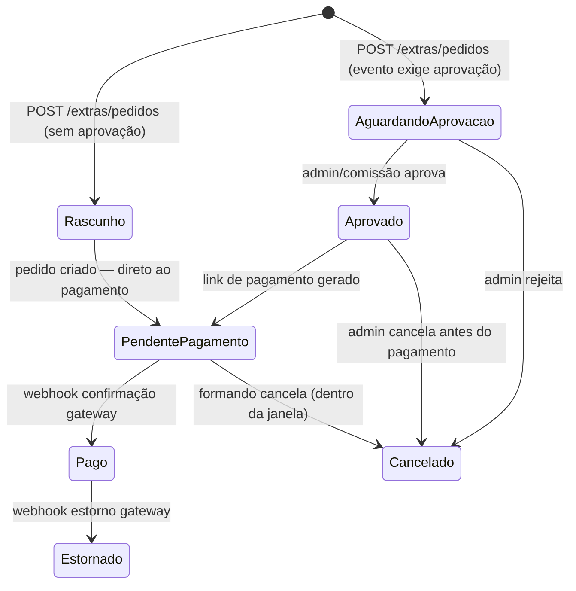

# SPEC-007 — Extras (catálogo + pedido)

> **Spec unificada backend + frontend.** Cobre o ciclo completo de compra de produtos extras pelo formando: navegação do catálogo, montagem de carrinho, checkout com pedido idempotente e integração com o módulo de pagamento.
> Fontes: [api-contract.md §7](../api/api-contract.md) · [technical-design-extras.md](../architecture/technical-design-extras.md) · [09-TECHNICAL-DESIGN-CRITICAL-MODULES.md](../frontend/09-TECHNICAL-DESIGN-CRITICAL-MODULES.md) · [07-DATA-CONTRACTS-AND-VIEW-MODELS.md](../frontend/07-DATA-CONTRACTS-AND-VIEW-MODELS.md)

---

## 0. Resumo executivo

O formando, já autenticado e com adesão ativa, acessa `/portal/extras` e vê o catálogo de produtos extras disponíveis para o seu evento (fotos avulsas, vídeos, brindes, jantares premium, convites adicionais etc.). Cada produto exibe nome, descrição, preço formatado, estoque disponível e imagem. O formando monta um carrinho local, ajusta quantidades e submete o pedido via `POST /eventos/{ulid}/extras/pedidos` com `X-Idempotency-Key` obrigatório. O backend decrementa estoque com `SELECT ... FOR UPDATE`, cria o pedido e retorna o intent de pagamento. O SPA redireciona o formando para o fluxo de pagamento. Cancelamento é permitido apenas enquanto o status for `pendente_pagamento` e a janela de cancelamento estiver aberta. Histórico de pedidos fica visível no extrato financeiro.

---

## 1. Visão da feature

### 1.1 Jornada de compra de extras

```mermaid
flowchart LR
    A[/portal/extras] -->|carrega catálogo| B{extras disponíveis?}
    B -->|sim| C[Catálogo Grid — ExtraCard]
    B -->|nenhum ativo| Z[Estado vazio — mensagem informativa]
    C -->|adiciona ao carrinho| D[CarrinhoExtras — estado local]
    D -->|ajusta qtd| D
    D -->|qtd > estoque| E[botão desabilitado + tooltip]
    D -->|submete pedido| F{POST /extras/pedidos}
    F -->|201 Created| G[CheckoutExtras — exibe resumo + redirect pagamento]
    F -->|409 EstoqueInsuficiente| H[toast erro + atualiza qtd máx no carrinho]
    F -->|409 ForaJanelaVenda| I[toast — janela de venda encerrada]
    F -->|422 ValidationError| J[erros inline nos campos]
    G -->|redireciona para pagamento| K[/portal/pagamento/:pedidoUlid]
```

### 1.2 Diagrama de estados do pedido



### 1.3 Atores

| Ator                 | Ação                                                                       |
| -------------------- | -------------------------------------------------------------------------- |
| Formando autenticado | Navega catálogo, monta carrinho, submete pedido e paga.                    |
| Gateway de pagamento | Dispara webhook de confirmação ou estorno após processamento.              |
| Admin/Comissão       | Aprova pedidos quando o evento exige aprovação prévia (fluxo Admin Blade). |
| Sistema (Job/Event)  | Aplica efeitos derivados pós-pagamento (ex.: emissão de convites extras).  |

### 1.4 Valor

- Receita incremental para a operadora via venda de produtos opcionais.
- Formando personaliza sua experiência de formatura além do pacote base.
- Fluxo idempotente garante que duplo-clique ou retry de rede não gera pedido duplicado.

### 1.5 Escopo

**In:** catálogo paginado por cursor com filtros, carrinho local (estado SPA), pedido com itens múltiplos, gestão de estoque com lock, janela de venda por produto, idempotência, redirect para módulo de pagamento, consulta de status do pedido.

**Out:** aprovação pelo admin (fluxo Admin Blade separado), emissão derivada de convites (responsabilidade de `ConfirmarPagamentoExtraAction`), gestão do catálogo (admin backoffice), estorno manual (admin), relatórios financeiros de extras (admin), app mobile (F8).

---

## 2. Contrato da API

### 2.1 `GET /api/v1/eventos/{ulid}/extras/catalogo`

- **Route name:** `api.v1.extras.catalogo`
- **Middlewares:** `auth:sanctum`, `throttle:api`
- **Policy:** `PedidoExtraPolicy::view(user, evento)` — formando deve ter vínculo com o evento
- **Idempotência:** não exigida (GET)

**Query params:**

| Parâmetro            | Tipo     | Descrição                                               |
| -------------------- | -------- | ------------------------------------------------------- |
| `filter[categoria]`  | `string` | Filtra por categoria (ex.: `alimentacao`, `fotografia`) |
| `filter[disponivel]` | `bool`   | `true` → apenas com estoque > 0 e janela aberta         |
| `page[cursor]`       | `string` | Cursor da próxima página                                |
| `page[size]`         | `int`    | Itens por página (default: 20, max: 50)                 |

**Response 200:**

```json
{
    "data": [
        {
            "id": "01J...",
            "nome": "Jantar extra chef",
            "categoria": "alimentacao",
            "descricao": "Prato principal elaborado pelo chef residente.",
            "preco_centavos": 18000,
            "estoque": {
                "tipo": "finito",
                "qtd_restante": 42
            },
            "janela_venda": {
                "abre_venda_at": "2026-10-01T00:00:00-03:00",
                "fecha_venda_at": "2026-11-30T23:59:59-03:00",
                "aberta": true
            },
            "imagens": [
                { "url": "https://cdn.artfinal.com.br/extras/01J.../thumb.webp?exp=...", "alt": "Prato do chef" }
            ],
            "links": {
                "self": "https://api.portalartfinal.com.br/api/v1/eventos/01J.../extras/catalogo/01J...",
                "pedido": "https://api.portalartfinal.com.br/api/v1/eventos/01J.../extras/pedidos"
            }
        }
    ],
    "meta": { "per_page": 20, "next_cursor": "eyJpZCI6Ik9...", "prev_cursor": null },
    "links": { "self": "...", "next": "...?page[cursor]=eyJpZ...", "prev": null }
}
```

**Erros:**

- `401 Unauthenticated` — sem sessão.
- `403 Forbidden` — formando sem vínculo com o evento.
- `404 NotFound` — evento não existe.

---

### 2.2 `POST /api/v1/eventos/{ulid}/extras/pedidos`

- **Route name:** `api.v1.extras.pedidos.store`
- **Middlewares:** `auth:sanctum`, `idempotent`, `throttle:api`
- **Policy:** `PedidoExtraPolicy::criar(user, evento)` — formando vinculado + janela aberta
- **Idempotência:** `X-Idempotency-Key` **OBRIGATÓRIO** (retorna 400 se ausente)

**Headers obrigatórios:**

| Header              | Valor de exemplo                       |
| ------------------- | -------------------------------------- |
| `X-Idempotency-Key` | `extras-pedido:01Jevento:sha256abc123` |
| `X-Request-Id`      | `01J5K3B5GTYV8E2F1W0M8P2XQA`           |
| `Content-Type`      | `application/json`                     |

**Request:**

```json
{
    "itens": [
        { "produto_extra_ulid": "01J...", "quantidade": 2 },
        { "produto_extra_ulid": "01J...", "quantidade": 1 }
    ],
    "metodo_pagamento": "pix"
}
```

**Validação:**

| Campo                        | Regras                                                   |
| ---------------------------- | -------------------------------------------------------- |
| `itens`                      | `required\|array\|min:1\|max:20`                         |
| `itens.*.produto_extra_ulid` | `required\|string\|size:26\|exists:produtos_extras,ulid` |
| `itens.*.quantidade`         | `required\|integer\|min:1\|max:10`                       |
| `metodo_pagamento`           | `required\|in:boleto,pix,cartao`                         |

**Response 201 + `Location`:**

```json
{
    "data": {
        "id": "01J...",
        "status": "aguardando_pagamento",
        "valor_total_centavos": 54000,
        "itens": [
            {
                "produto": { "id": "01J...", "nome": "Jantar extra chef" },
                "quantidade": 2,
                "preco_unitario_centavos": 18000,
                "subtotal_centavos": 36000
            },
            {
                "produto": { "id": "01J...", "nome": "Foto avulsa impressa 30x40" },
                "quantidade": 1,
                "preco_unitario_centavos": 18000,
                "subtotal_centavos": 18000
            }
        ],
        "pagamento": {
            "id": "01J...",
            "metodo": "pix",
            "status": "pendente",
            "qrcode": "00020126...",
            "qrcode_url": "https://cdn.artfinal.com.br/pix/qr/01J....png"
        },
        "links": {
            "self": "https://api.portalartfinal.com.br/api/v1/eventos/01J.../extras/pedidos/01J...",
            "pagar": "https://api.portalartfinal.com.br/api/v1/pagamentos/01J...",
            "cancelar": "https://api.portalartfinal.com.br/api/v1/eventos/01J.../extras/pedidos/01J..."
        }
    }
}
```

**Erros:**

| Código | `error`                 | Condição                                          |
| ------ | ----------------------- | ------------------------------------------------- |
| `409`  | `EstoqueInsuficiente`   | Estoque disponível < quantidade solicitada        |
| `409`  | `ForaJanelaVenda`       | `fecha_venda_at` no passado para algum item       |
| `409`  | `PedidoJaExistente`     | Idempotency key reutilizada com payload diferente |
| `422`  | `ValidationError`       | Payload inválido (`details.fields`)               |
| `400`  | `IdempotencyKeyMissing` | Header `X-Idempotency-Key` ausente                |

**Action/Event:**

- Action: `CriarPedidoExtrasAction` (decrementa estoque com `lockForUpdate`) + `IniciarPagamentoAction` (encadeada).
- Events: `PedidoExtraCriado`, `PagamentoIniciado`.

---

### 2.3 `GET /api/v1/eventos/{ulid}/extras/pedidos/{ulid}`

- **Route name:** `api.v1.extras.pedidos.show`
- **Middlewares:** `auth:sanctum`, `throttle:api`
- **Policy:** `PedidoExtraPolicy::ver(user, pedido)` — dono do pedido

**Response 200:** mesmo shape de §2.2, com status atualizado.

**Erros:**

- `403 Forbidden` — pedido pertence a outro formando.
- `404 NotFound` — pedido não existe.

---

### 2.4 Headers transversais

| Header              | Direção | Uso                                              |
| ------------------- | ------- | ------------------------------------------------ |
| `X-Request-Id`      | req/res | Correlação de logs (ULID). Gerado pelo cliente.  |
| `X-Idempotency-Key` | req     | Obrigatório em POST pedidos (max 80 chars).      |
| `X-XSRF-TOKEN`      | req     | Proteção CSRF (Axios lê de cookie `XSRF-TOKEN`). |
| `Content-Type`      | req     | `application/json`                               |
| `Accept`            | req     | `application/json`                               |

---

## 3. Backend — Laravel 13

### 3.1 Arquivos a criar/modificar

| Arquivo                                            | Ação      | Responsabilidade                                                 |
| -------------------------------------------------- | --------- | ---------------------------------------------------------------- |
| `routes/api/v1.php`                                | Modificar | Registrar 3 rotas de extras.                                     |
| `app/Http/Controllers/Api/V1/ExtrasController.php` | Criar     | `catalogo()`, `store()`, `show()`.                               |
| `app/Http/Requests/Api/V1/PedidoExtrasRequest.php` | Criar     | FormRequest com regras de validação.                             |
| `app/Actions/Extras/CriarPedidoExtrasAction.php`   | Criar     | Decrementa estoque com lock + cria pedido + enfileira pagamento. |
| `app/Http/Resources/V1/ExtraResource.php`          | Criar     | Serialização de `ProdutoExtra` para o catálogo.                  |
| `app/Http/Resources/V1/PedidoExtrasResource.php`   | Criar     | Serialização de `PedidoExtra` com itens e intent de pagamento.   |
| `app/Policies/PedidoExtraPolicy.php`               | Criar     | `criar`, `ver`, `cancelar`.                                      |
| `app/Enums/StatusPedidoExtra.php`                  | Criar     | Backed enum com labels PT-BR e cores.                            |
| `app/Enums/TipoEstoque.php`                        | Criar     | `Ilimitado`, `LimitadoPorEvento`, `LimitadoPorFormando`.         |
| `tests/Feature/Api/V1/Extras/CatalogoTest.php`     | Criar     | 3 cenários (lista ok, filter disponivel, sem vínculo 403).       |
| `tests/Feature/Api/V1/Extras/PedidoExtrasTest.php` | Criar     | 10+ cenários (ver §3.7).                                         |

### 3.2 Rotas em `routes/api/v1.php`

```php
Route::prefix('eventos/{evento:ulid}')->middleware(['auth:sanctum'])->group(function () {
    // Extras
    Route::get('extras/catalogo', [ExtrasController::class, 'catalogo'])
        ->name('api.v1.extras.catalogo');

    Route::post('extras/pedidos', [ExtrasController::class, 'store'])
        ->middleware(['idempotent'])
        ->name('api.v1.extras.pedidos.store');

    Route::get('extras/pedidos/{pedido:ulid}', [ExtrasController::class, 'show'])
        ->name('api.v1.extras.pedidos.show');
});
```

### 3.3 `ExtrasController` — esqueleto

```php
<?php
declare(strict_types=1);

namespace App\Http\Controllers\Api\V1;

use App\Actions\Extras\CriarPedidoExtrasAction;
use App\Http\Controllers\Controller;
use App\Http\Requests\Api\V1\PedidoExtrasRequest;
use App\Http\Resources\V1\ExtraResource;
use App\Http\Resources\V1\PedidoExtrasResource;
use App\Models\Evento;
use App\Models\PedidoExtra;
use Illuminate\Http\Request;
use Illuminate\Http\Resources\Json\AnonymousResourceCollection;

final class ExtrasController extends Controller
{
    public function catalogo(Request $request, Evento $evento): AnonymousResourceCollection
    {
        $this->authorize('view', $evento);

        $extras = $evento->produtosExtras()
            ->ativo()
            ->when($request->filter('categoria'), fn ($q, $v) => $q->where('categoria', $v))
            ->when($request->boolean('filter.disponivel'), fn ($q) => $q->comEstoqueDisponivel()->comJanelaAberta())
            ->cursorPaginate($request->integer('page.size', 20));

        return ExtraResource::collection($extras);
    }

    public function store(PedidoExtrasRequest $request, Evento $evento): PedidoExtrasResource
    {
        $this->authorize('criar', [PedidoExtra::class, $evento]);

        $pedido = app(CriarPedidoExtrasAction::class)->execute(
            evento: $evento,
            formando: $request->user()->formandoParaEvento($evento),
            itens: $request->validated('itens'),
            metodoPagamento: $request->validated('metodo_pagamento'),
            idempotencyKey: $request->header('X-Idempotency-Key'),
        );

        return (new PedidoExtrasResource($pedido))
            ->response()
            ->setStatusCode(201)
            ->header('Location', route('api.v1.extras.pedidos.show', [$evento, $pedido]));
    }

    public function show(Evento $evento, PedidoExtra $pedido): PedidoExtrasResource
    {
        $this->authorize('ver', $pedido);

        return new PedidoExtrasResource($pedido->load(['itens.produtoExtra', 'pagamento']));
    }
}
```

### 3.4 `PedidoExtrasRequest`

```php
<?php
declare(strict_types=1);

namespace App\Http\Requests\Api\V1;

use Illuminate\Foundation\Http\FormRequest;

final class PedidoExtrasRequest extends FormRequest
{
    public function authorize(): bool
    {
        return true; // autorização via Policy no Controller
    }

    public function rules(): array
    {
        return [
            'itens'                        => ['required', 'array', 'min:1', 'max:20'],
            'itens.*.produto_extra_ulid'   => ['required', 'string', 'size:26', 'exists:produtos_extras,ulid'],
            'itens.*.quantidade'           => ['required', 'integer', 'min:1', 'max:10'],
            'metodo_pagamento'             => ['required', 'in:boleto,pix,cartao'],
        ];
    }

    public function messages(): array
    {
        return [
            'itens.required'                       => 'Adicione ao menos um produto ao pedido.',
            'itens.max'                            => 'O pedido pode ter no máximo 20 produtos distintos.',
            'itens.*.produto_extra_ulid.exists'    => 'Produto extra inválido ou não encontrado.',
            'itens.*.quantidade.min'               => 'A quantidade mínima é 1.',
            'itens.*.quantidade.max'               => 'A quantidade máxima por produto é 10.',
            'metodo_pagamento.in'                  => 'Método de pagamento inválido. Use: boleto, pix ou cartao.',
        ];
    }
}
```

### 3.5 `CriarPedidoExtrasAction` — lógica de estoque com lock

```php
<?php
declare(strict_types=1);

namespace App\Actions\Extras;

use App\DTOs\Extras\PedidoExtraResultDTO;
use App\Enums\StatusPedidoExtra;
use App\Exceptions\EstoqueInsuficienteException;
use App\Exceptions\ForaJanelaVendaException;
use App\Models\Evento;
use App\Models\Formando;
use App\Models\PedidoExtra;
use App\Models\ProdutoExtra;
use Illuminate\Support\Facades\DB;
use App\Events\Extras\PedidoExtraCriado;

final class CriarPedidoExtrasAction
{
    /**
     * @param  array<int, array{produto_extra_ulid: string, quantidade: int}>  $itens
     */
    public function execute(
        Evento $evento,
        Formando $formando,
        array $itens,
        string $metodoPagamento,
        string $idempotencyKey,
    ): PedidoExtra {
        // Idempotência: retorna pedido existente se a chave já foi usada
        $existente = PedidoExtra::where('idempotency_key', $idempotencyKey)->first();
        if ($existente !== null) {
            return $existente->load(['itens.produtoExtra', 'pagamento']);
        }

        return DB::transaction(function () use ($evento, $formando, $itens, $metodoPagamento, $idempotencyKey): PedidoExtra {
            $ulids = collect($itens)->pluck('produto_extra_ulid')->all();

            // Bloqueia produtos para leitura consistente e atualização atômica
            $produtos = ProdutoExtra::whereIn('ulid', $ulids)
                ->lockForUpdate()
                ->get()
                ->keyBy('ulid');

            $valorTotal = 0;

            foreach ($itens as $item) {
                $produto = $produtos->get($item['produto_extra_ulid']);

                // Valida janela de venda
                if (! $produto->janelaVendaAberta()) {
                    throw new ForaJanelaVendaException(
                        "Produto '{$produto->nome}' está fora do período de venda."
                    );
                }

                // Valida estoque (apenas para estoque finito)
                if ($produto->tipo_estoque !== 'ilimitado' && $produto->estoque_qtd < $item['quantidade']) {
                    throw new EstoqueInsuficienteException(
                        "Estoque insuficiente para '{$produto->nome}'. Disponível: {$produto->estoque_qtd}."
                    );
                }

                $valorTotal += $produto->preco_unitario_centavos * $item['quantidade'];
            }

            // Cria o pedido
            $pedido = PedidoExtra::create([
                'evento_id'       => $evento->id,
                'formando_id'     => $formando->id,
                'status'          => StatusPedidoExtra::PendentePagamento,
                'valor_total_centavos' => $valorTotal,
                'idempotency_key' => $idempotencyKey,
            ]);

            // Cria os itens e decrementa estoque
            foreach ($itens as $item) {
                $produto = $produtos->get($item['produto_extra_ulid']);

                $pedido->itens()->create([
                    'produto_extra_id'              => $produto->id,
                    'quantidade'                    => $item['quantidade'],
                    'preco_unitario_centavos_snapshot' => $produto->preco_unitario_centavos,
                ]);

                if ($produto->tipo_estoque !== 'ilimitado') {
                    $produto->decrement('estoque_qtd', $item['quantidade']);
                }
            }

            PedidoExtraCriado::dispatch($pedido);

            return $pedido->load(['itens.produtoExtra']);
        });
    }
}
```

### 3.6 `StatusPedidoExtra` Enum

```php
<?php
declare(strict_types=1);

namespace App\Enums;

enum StatusPedidoExtra: string
{
    case Rascunho             = 'rascunho';
    case AguardandoAprovacao  = 'aguardando_aprovacao';
    case Aprovado             = 'aprovado';
    case PendentePagamento    = 'pendente_pagamento';
    case Pago                 = 'pago';
    case Cancelado            = 'cancelado';
    case Estornado            = 'estornado';

    public function label(): string
    {
        return match ($this) {
            self::Rascunho            => 'Rascunho',
            self::AguardandoAprovacao => 'Aguardando aprovação',
            self::Aprovado            => 'Aprovado',
            self::PendentePagamento   => 'Pendente de pagamento',
            self::Pago                => 'Pago',
            self::Cancelado           => 'Cancelado',
            self::Estornado           => 'Estornado',
        };
    }

    public function color(): string
    {
        return match ($this) {
            self::Rascunho            => 'gray',
            self::AguardandoAprovacao => 'yellow',
            self::Aprovado            => 'blue',
            self::PendentePagamento   => 'orange',
            self::Pago                => 'green',
            self::Cancelado           => 'red',
            self::Estornado           => 'purple',
        };
    }

    public function podeSerCancelado(): bool
    {
        return in_array($this, [self::PendentePagamento, self::Aprovado, self::AguardandoAprovacao], true);
    }
}
```

### 3.7 Testes Pest (mínimo obrigatório — 10 cenários)

```php
// tests/Feature/Api/V1/Extras/PedidoExtrasTest.php

it('catálogo lista extras disponíveis do evento', function () {
    $evento = Evento::factory()->comFormandoVinculado($this->formando)->create();
    ProdutoExtra::factory()->count(3)->paraEvento($evento)->disponivel()->create();

    $response = $this->actingAs($this->formando->user)
        ->getJson("/api/v1/eventos/{$evento->ulid}/extras/catalogo");

    $response->assertOk()->assertJsonCount(3, 'data');
});

it('catálogo filter[disponivel]=true omite produtos esgotados', function () {
    $evento = Evento::factory()->comFormandoVinculado($this->formando)->create();
    ProdutoExtra::factory()->paraEvento($evento)->esgotado()->create();
    ProdutoExtra::factory()->paraEvento($evento)->disponivel()->create();

    $response = $this->actingAs($this->formando->user)
        ->getJson("/api/v1/eventos/{$evento->ulid}/extras/catalogo?filter[disponivel]=true");

    $response->assertOk()->assertJsonCount(1, 'data');
});

it('formando sem vínculo recebe 403 no catálogo', function () {
    $evento = Evento::factory()->create(); // sem formando vinculado

    $this->actingAs($this->formando->user)
        ->getJson("/api/v1/eventos/{$evento->ulid}/extras/catalogo")
        ->assertForbidden();
});

it('cria pedido de extras com sucesso e retorna 201', function () {
    $evento = Evento::factory()->comFormandoVinculado($this->formando)->create();
    $produto = ProdutoExtra::factory()->paraEvento($evento)->disponivel()->create([
        'preco_unitario_centavos' => 18000,
        'estoque_qtd' => 10,
    ]);

    $response = $this->actingAs($this->formando->user)
        ->withHeader('X-Idempotency-Key', 'extras-pedido:test-001')
        ->postJson("/api/v1/eventos/{$evento->ulid}/extras/pedidos", [
            'itens' => [['produto_extra_ulid' => $produto->ulid, 'quantidade' => 2]],
            'metodo_pagamento' => 'pix',
        ]);

    $response->assertCreated()
        ->assertJsonPath('data.status', 'aguardando_pagamento')
        ->assertJsonPath('data.valor_total_centavos', 36000);

    $this->assertDatabaseHas('pedidos_extras', ['valor_total_centavos' => 36000]);
    $this->assertDatabaseHas('produtos_extras', ['id' => $produto->id, 'estoque_qtd' => 8]);
});

it('retorna 409 EstoqueInsuficiente quando estoque < quantidade', function () {
    $evento = Evento::factory()->comFormandoVinculado($this->formando)->create();
    $produto = ProdutoExtra::factory()->paraEvento($evento)->create(['estoque_qtd' => 1]);

    $this->actingAs($this->formando->user)
        ->withHeader('X-Idempotency-Key', 'extras-pedido:test-estoque')
        ->postJson("/api/v1/eventos/{$evento->ulid}/extras/pedidos", [
            'itens' => [['produto_extra_ulid' => $produto->ulid, 'quantidade' => 5]],
            'metodo_pagamento' => 'pix',
        ])
        ->assertConflict()
        ->assertJsonPath('error', 'EstoqueInsuficiente');
});

it('retorna 409 ForaJanelaVenda quando janela de venda está encerrada', function () {
    $evento = Evento::factory()->comFormandoVinculado($this->formando)->create();
    $produto = ProdutoExtra::factory()->paraEvento($evento)->create([
        'fecha_venda_at' => now()->subDay(),
    ]);

    $this->actingAs($this->formando->user)
        ->withHeader('X-Idempotency-Key', 'extras-pedido:test-janela')
        ->postJson("/api/v1/eventos/{$evento->ulid}/extras/pedidos", [
            'itens' => [['produto_extra_ulid' => $produto->ulid, 'quantidade' => 1]],
            'metodo_pagamento' => 'boleto',
        ])
        ->assertConflict()
        ->assertJsonPath('error', 'ForaJanelaVenda');
});

it('retorna 409 quando estoque chega a zero', function () {
    $evento = Evento::factory()->comFormandoVinculado($this->formando)->create();
    $produto = ProdutoExtra::factory()->paraEvento($evento)->create(['estoque_qtd' => 0]);

    $this->actingAs($this->formando->user)
        ->withHeader('X-Idempotency-Key', 'extras-pedido:test-zero')
        ->postJson("/api/v1/eventos/{$evento->ulid}/extras/pedidos", [
            'itens' => [['produto_extra_ulid' => $produto->ulid, 'quantidade' => 1]],
            'metodo_pagamento' => 'pix',
        ])
        ->assertConflict()
        ->assertJsonPath('error', 'EstoqueInsuficiente');
});

it('segunda requisição com mesma idempotency key retorna pedido existente sem duplicar', function () {
    $evento = Evento::factory()->comFormandoVinculado($this->formando)->create();
    $produto = ProdutoExtra::factory()->paraEvento($evento)->disponivel()->create(['estoque_qtd' => 10]);

    $payload = [
        'itens' => [['produto_extra_ulid' => $produto->ulid, 'quantidade' => 1]],
        'metodo_pagamento' => 'pix',
    ];

    $this->actingAs($this->formando->user)
        ->withHeader('X-Idempotency-Key', 'extras-pedido:idempotente')
        ->postJson("/api/v1/eventos/{$evento->ulid}/extras/pedidos", $payload)
        ->assertCreated();

    $this->actingAs($this->formando->user)
        ->withHeader('X-Idempotency-Key', 'extras-pedido:idempotente')
        ->postJson("/api/v1/eventos/{$evento->ulid}/extras/pedidos", $payload)
        ->assertCreated();

    $this->assertDatabaseCount('pedidos_extras', 1);
    $this->assertDatabaseHas('produtos_extras', ['id' => $produto->id, 'estoque_qtd' => 9]);
});

it('retorna 422 quando quantidade é zero', function () {
    $evento = Evento::factory()->comFormandoVinculado($this->formando)->create();
    $produto = ProdutoExtra::factory()->paraEvento($evento)->disponivel()->create();

    $this->actingAs($this->formando->user)
        ->withHeader('X-Idempotency-Key', 'extras-pedido:qty-zero')
        ->postJson("/api/v1/eventos/{$evento->ulid}/extras/pedidos", [
            'itens' => [['produto_extra_ulid' => $produto->ulid, 'quantidade' => 0]],
            'metodo_pagamento' => 'pix',
        ])
        ->assertUnprocessable()
        ->assertJsonPath('error', 'ValidationError')
        ->assertJsonStructure(['details' => ['fields' => ['itens.0.quantidade']]]);
});

it('cria pedido com múltiplos itens diferentes e calcula valor total corretamente', function () {
    $evento = Evento::factory()->comFormandoVinculado($this->formando)->create();
    $prod1 = ProdutoExtra::factory()->paraEvento($evento)->disponivel()->create(['preco_unitario_centavos' => 10000]);
    $prod2 = ProdutoExtra::factory()->paraEvento($evento)->disponivel()->create(['preco_unitario_centavos' => 25000]);

    $response = $this->actingAs($this->formando->user)
        ->withHeader('X-Idempotency-Key', 'extras-pedido:multi')
        ->postJson("/api/v1/eventos/{$evento->ulid}/extras/pedidos", [
            'itens' => [
                ['produto_extra_ulid' => $prod1->ulid, 'quantidade' => 2], // 20000
                ['produto_extra_ulid' => $prod2->ulid, 'quantidade' => 1], // 25000
            ],
            'metodo_pagamento' => 'cartao',
        ]);

    $response->assertCreated()
        ->assertJsonPath('data.valor_total_centavos', 45000)
        ->assertJsonCount(2, 'data.itens');
});

it('consultar pedido retorna shape correto com status atualizado', function () {
    $evento = Evento::factory()->comFormandoVinculado($this->formando)->create();
    $pedido = PedidoExtra::factory()->paraFormando($this->formando)->paraEvento($evento)->create([
        'status' => StatusPedidoExtra::PendentePagamento,
    ]);

    $this->actingAs($this->formando->user)
        ->getJson("/api/v1/eventos/{$evento->ulid}/extras/pedidos/{$pedido->ulid}")
        ->assertOk()
        ->assertJsonPath('data.id', $pedido->ulid)
        ->assertJsonPath('data.status', 'aguardando_pagamento');
});
```

---

## 4. Frontend — React 19 SPA

### 4.1 Arquivos a criar/modificar

| Arquivo                                                    | Ação   | Responsabilidade                                                           |
| ---------------------------------------------------------- | ------ | -------------------------------------------------------------------------- |
| `resources/spa/src/api/hooks/use-extras.ts`                | Criar  | `useCatalogo`, `usePedidoExtras` (mutation), `usePedidoStatus`.            |
| `resources/spa/src/routes/portal/extras.tsx`               | Criar  | Rota `/portal/extras` com layout e orquestração.                           |
| `resources/spa/src/components/extras/catalogo-grid.tsx`    | Criar  | Grid responsivo de cards de extras com filtros.                            |
| `resources/spa/src/components/extras/extra-card.tsx`       | Criar  | Card individual: imagem, nome, preço, estoque, botão +/- e adicionar.      |
| `resources/spa/src/components/extras/carrinho-extras.tsx`  | Criar  | Painel lateral: itens selecionados, quantidades, subtotal, botão checkout. |
| `resources/spa/src/components/extras/checkout-extras.tsx`  | Criar  | Formulário de checkout: método pagamento, POST pedido, redirect pagamento. |
| `resources/spa/src/stores/carrinho-extras-store.ts`        | Criar  | Zustand store local: itens, quantidades, subtotal calculado.               |
| `resources/spa/src/forms/extras/checkout-extras.schema.ts` | Criar  | Schema Zod para o formulário de checkout.                                  |
| `resources/spa/src/lib/idempotency.ts`                     | Modify | Adicionar `getIdempotencyKey('extras-pedido:...')`.                        |
| `resources/spa/tests/unit/carrinho-extras-store.test.ts`   | Criar  | 6 testes Vitest.                                                           |
| `resources/spa/tests/integration/checkout-extras.test.tsx` | Criar  | 5 testes RTL + MSW.                                                        |
| `resources/spa/tests/e2e/extras.spec.ts`                   | Criar  | 3 cenários Playwright (happy, estoque insuficiente, janela fechada).       |

### 4.2 `api/hooks/use-extras.ts`

```typescript
import { useInfiniteQuery, useMutation, useQuery, useQueryClient } from '@tanstack/react-query';
import { api } from '../client';
import { getIdempotencyKey, clearIdempotencyKey } from '@/lib/idempotency';
import type { ExtraDto, PedidoExtrasDto, PedidoExtrasPayload } from '../types.gen';
import { toExtraViewModel, toPedidoExtrasViewModel } from '../mappers/extras';

// --- queryKeys ---
export const extrasQueryKeys = {
    catalogo: (eventoUlid: string, params?: Record<string, unknown>) =>
        ['extras', 'catalogo', eventoUlid, params] as const,
    pedido: (eventoUlid: string, pedidoUlid: string) => ['extras', 'pedido', eventoUlid, pedidoUlid] as const,
};

// --- useCatalogo: infinite query com cursor pagination + filtros ---
export function useCatalogo(eventoUlid: string, filters?: { categoria?: string; disponivel?: boolean }) {
    return useInfiniteQuery({
        queryKey: extrasQueryKeys.catalogo(eventoUlid, filters),
        queryFn: async ({ pageParam }) => {
            const params: Record<string, unknown> = { 'page[size]': 20 };
            if (pageParam) params['page[cursor]'] = pageParam;
            if (filters?.categoria) params['filter[categoria]'] = filters.categoria;
            if (filters?.disponivel !== undefined) params['filter[disponivel]'] = filters.disponivel;

            const { data } = await api.get<{ data: ExtraDto[]; meta: { next_cursor: string | null } }>(
                `/eventos/${eventoUlid}/extras/catalogo`,
                { params },
            );
            return {
                items: data.data.map(toExtraViewModel),
                nextCursor: data.meta.next_cursor,
            };
        },
        initialPageParam: null as string | null,
        getNextPageParam: (lastPage) => lastPage.nextCursor ?? undefined,
        staleTime: 2 * 60 * 1000, // catálogo pode mudar (estoque), então 2 min
        enabled: !!eventoUlid,
    });
}

// --- usePedidoExtras: mutation para criar pedido ---
export function usePedidoExtras(eventoUlid: string) {
    const qc = useQueryClient();

    return useMutation({
        mutationFn: async (payload: PedidoExtrasPayload) => {
            const scope = `extras-pedido:${eventoUlid}:${hashItens(payload.itens)}`;
            const idempotencyKey = getIdempotencyKey(scope);

            const { data } = await api.post<{ data: PedidoExtrasDto }>(
                `/eventos/${eventoUlid}/extras/pedidos`,
                payload,
                { headers: { 'X-Idempotency-Key': idempotencyKey } },
            );

            return { pedido: toPedidoExtrasViewModel(data.data), idempotencyKey: scope };
        },
        onSuccess: ({ pedido, idempotencyKey }) => {
            // Limpa key após confirmação (pedido criado com sucesso)
            clearIdempotencyKey(idempotencyKey);
            // Invalida catálogo para refletir mudança de estoque
            qc.invalidateQueries({ queryKey: ['extras', 'catalogo', eventoUlid] });
        },
    });
}

// --- usePedidoStatus: polling do status do pedido ---
export function usePedidoStatus(eventoUlid: string, pedidoUlid: string | null) {
    return useQuery({
        queryKey: extrasQueryKeys.pedido(eventoUlid, pedidoUlid ?? ''),
        queryFn: async () => {
            const { data } = await api.get<{ data: PedidoExtrasDto }>(
                `/eventos/${eventoUlid}/extras/pedidos/${pedidoUlid}`,
            );
            return toPedidoExtrasViewModel(data.data);
        },
        enabled: !!pedidoUlid,
        refetchInterval: (query) => {
            // Para de fazer polling quando pedido está em estado terminal
            const status = query.state.data?.status;
            if (status === 'pago' || status === 'cancelado' || status === 'estornado') return false;
            return 5000; // 5s de polling enquanto pendente
        },
    });
}

// Utilitário: hash estável dos itens para key de idempotência
function hashItens(itens: PedidoExtrasPayload['itens']): string {
    return [...itens]
        .sort((a, b) => a.produto_extra_ulid.localeCompare(b.produto_extra_ulid))
        .map(({ produto_extra_ulid, quantidade }) => `${produto_extra_ulid}:${quantidade}`)
        .join('|');
}
```

### 4.3 `stores/carrinho-extras-store.ts`

```typescript
import { create } from 'zustand';
import type { ExtraViewModel } from '@/api/mappers/extras';

interface ItemCarrinho {
    extra: ExtraViewModel;
    quantidade: number;
}

interface CarrinhoExtrasState {
    itens: Map<string, ItemCarrinho>;
    // Seletores derivados
    totalItens: () => number;
    subtotalCentavos: () => number;
    // Ações
    adicionar: (extra: ExtraViewModel, quantidade?: number) => void;
    remover: (extraUlid: string) => void;
    atualizarQuantidade: (extraUlid: string, quantidade: number) => void;
    limpar: () => void;
}

export const useCarrinhoExtrasStore = create<CarrinhoExtrasState>((set, get) => ({
    itens: new Map(),

    totalItens: () => {
        return [...get().itens.values()].reduce((acc, item) => acc + item.quantidade, 0);
    },

    subtotalCentavos: () => {
        return [...get().itens.values()].reduce((acc, item) => acc + item.extra.precoCentavos * item.quantidade, 0);
    },

    adicionar: (extra, quantidade = 1) => {
        set((state) => {
            const itens = new Map(state.itens);
            const existente = itens.get(extra.id);
            const novaQtd = (existente?.quantidade ?? 0) + quantidade;
            const maxQtd = extra.estoqueQtdRestante ?? Infinity;
            itens.set(extra.id, { extra, quantidade: Math.min(novaQtd, maxQtd) });
            return { itens };
        });
    },

    remover: (extraUlid) => {
        set((state) => {
            const itens = new Map(state.itens);
            itens.delete(extraUlid);
            return { itens };
        });
    },

    atualizarQuantidade: (extraUlid, quantidade) => {
        set((state) => {
            const itens = new Map(state.itens);
            const existente = itens.get(extraUlid);
            if (!existente) return state;
            if (quantidade <= 0) {
                itens.delete(extraUlid);
            } else {
                itens.set(extraUlid, { ...existente, quantidade });
            }
            return { itens };
        });
    },

    limpar: () => set({ itens: new Map() }),
}));
```

### 4.4 `components/extras/extra-card.tsx`

```typescript
import { memo } from 'react'
import type { ExtraViewModel } from '@/api/mappers/extras'
import { useCarrinhoExtrasStore } from '@/stores/carrinho-extras-store'
import { formatMoney } from '@/lib/money'

interface ExtraCardProps {
  extra: ExtraViewModel
}

export const ExtraCard = memo(function ExtraCard({ extra }: ExtraCardProps) {
  const { itens, adicionar, remover, atualizarQuantidade } = useCarrinhoExtrasStore()
  const itemNoCarrinho = itens.get(extra.id)
  const quantidadeAtual = itemNoCarrinho?.quantidade ?? 0
  const estoqueMaximo = extra.estoqueQtdRestante ?? 10
  const esgotado = extra.estoque.tipo === 'finito' && (extra.estoqueQtdRestante ?? 0) === 0
  const foraDaJanela = !extra.janelaVenda.aberta
  const desabilitado = esgotado || foraDaJanela

  return (
    <article className="rounded-xl border border-gray-200 bg-white shadow-sm overflow-hidden">
      {/* Imagem com fallback */}
      <div className="aspect-video bg-gray-100 relative">
        {extra.imagens[0] ? (
           {
              (e.currentTarget as HTMLImageElement).src = '/assets/extra-placeholder.svg'
            }}
          />
        ) : (
          <div className="flex items-center justify-center h-full text-gray-400 text-sm">
            Sem imagem
          </div>
        )}
        {(esgotado || foraDaJanela) && (
          <div className="absolute inset-0 bg-black/50 flex items-center justify-center">
            <span className="text-white font-semibold text-sm px-3 py-1 rounded-full bg-red-600">
              {esgotado ? 'Esgotado' : 'Fora do período de venda'}
            </span>
          </div>
        )}
      </div>

      <div className="p-4 space-y-2">
        <h3 className="font-semibold text-gray-900 text-base">{extra.nome}</h3>
        {extra.descricao && (
          <p className="text-sm text-gray-500 line-clamp-2">{extra.descricao}</p>
        )}
        <div className="flex items-center justify-between">
          <span className="text-lg font-bold text-gray-900">
            {formatMoney(extra.precoCentavos)}
          </span>
          {extra.estoque.tipo === 'finito' && !esgotado && (
            <span className="text-xs text-gray-400">
              {extra.estoqueQtdRestante} restante{extra.estoqueQtdRestante !== 1 ? 's' : ''}
            </span>
          )}
        </div>

        {/* Controle de quantidade */}
        {quantidadeAtual > 0 ? (
          <div className="flex items-center gap-3">
            <button
              onClick={() =>
                quantidadeAtual === 1 ? remover(extra.id) : atualizarQuantidade(extra.id, quantidadeAtual - 1)
              }
              className="w-8 h-8 rounded-full border border-gray-300 flex items-center justify-center hover:bg-gray-50"
              aria-label="Diminuir quantidade"
            >
              −
            </button>
            <span className="font-medium text-gray-900 w-4 text-center">{quantidadeAtual}</span>
            <button
              onClick={() => atualizarQuantidade(extra.id, quantidadeAtual + 1)}
              disabled={quantidadeAtual >= estoqueMaximo}
              title={quantidadeAtual >= estoqueMaximo ? `Máximo: ${estoqueMaximo}` : undefined}
              className="w-8 h-8 rounded-full border border-gray-300 flex items-center justify-center hover:bg-gray-50 disabled:opacity-40 disabled:cursor-not-allowed"
              aria-label="Aumentar quantidade"
            >
              +
            </button>
          </div>
        ) : (
          <button
            onClick={() => adicionar(extra)}
            disabled={desabilitado}
            className="w-full py-2 px-4 rounded-lg bg-blue-600 text-white font-medium text-sm hover:bg-blue-700 disabled:opacity-40 disabled:cursor-not-allowed transition-colors"
          >
            {desabilitado ? (esgotado ? 'Esgotado' : 'Indisponível') : 'Adicionar'}
          </button>
        )}
      </div>
    </article>
  )
})
```

### 4.5 `components/extras/checkout-extras.tsx` — mutação e redirect

```typescript
import { useNavigate } from '@tanstack/react-router'
import { useForm } from 'react-hook-form'
import { zodResolver } from '@hookform/resolvers/zod'
import { z } from 'zod'
import { usePedidoExtras } from '@/api/hooks/use-extras'
import { useCarrinhoExtrasStore } from '@/stores/carrinho-extras-store'
import { formatMoney } from '@/lib/money'
import { toast } from '@/lib/toast'
import type { ApiError } from '@/api/errors'

const checkoutSchema = z.object({
  metodo_pagamento: z.enum(['boleto', 'pix', 'cartao'], {
    required_error: 'Selecione o método de pagamento.',
  }),
})

type CheckoutFormData = z.infer<typeof checkoutSchema>

interface CheckoutExtrasProps {
  eventoUlid: string
}

export function CheckoutExtras({ eventoUlid }: CheckoutExtrasProps) {
  const navigate = useNavigate()
  const { itens, subtotalCentavos, limpar } = useCarrinhoExtrasStore()
  const { mutateAsync, isPending } = usePedidoExtras(eventoUlid)

  const { register, handleSubmit, formState: { errors } } = useForm<CheckoutFormData>({
    resolver: zodResolver(checkoutSchema),
  })

  const onSubmit = async (formData: CheckoutFormData) => {
    if (itens.size === 0) {
      toast.error('Adicione ao menos um produto ao carrinho.')
      return
    }

    try {
      const { pedido } = await mutateAsync({
        itens: [...itens.values()].map(({ extra, quantidade }) => ({
          produto_extra_ulid: extra.id,
          quantidade,
        })),
        metodo_pagamento: formData.metodo_pagamento,
      })

      limpar()
      toast.success('Pedido criado com sucesso!')
      navigate({ to: `/portal/pagamento/${pedido.pagamento?.id}` })
    } catch (err) {
      const apiErr = err as ApiError
      if (apiErr.error === 'EstoqueInsuficiente') {
        toast.error('Estoque insuficiente para um ou mais produtos. Atualize seu carrinho.')
      } else if (apiErr.error === 'ForaJanelaVenda') {
        toast.error('A janela de venda de um produto foi encerrada. Remova-o do carrinho.')
      } else {
        toast.error(`Erro ao criar pedido. ID: ${apiErr.requestId}`)
      }
    }
  }

  return (
    <form onSubmit={handleSubmit(onSubmit)} className="space-y-4">
      <div>
        <label className="block text-sm font-medium text-gray-700 mb-1">
          Método de pagamento
        </label>
        <select
          {...register('metodo_pagamento')}
          className="w-full border border-gray-300 rounded-lg px-3 py-2 text-sm"
        >
          <option value="">Selecione...</option>
          <option value="pix">PIX</option>
          <option value="boleto">Boleto</option>
          <option value="cartao">Cartão de crédito</option>
        </select>
        {errors.metodo_pagamento && (
          <p className="text-red-500 text-xs mt-1">{errors.metodo_pagamento.message}</p>
        )}
      </div>

      <div className="border-t pt-4">
        <div className="flex justify-between text-sm font-semibold">
          <span>Total</span>
          <span>{formatMoney(subtotalCentavos())}</span>
        </div>
      </div>

      <button
        type="submit"
        disabled={isPending || itens.size === 0}
        className="w-full py-3 px-6 bg-green-600 text-white rounded-lg font-semibold hover:bg-green-700 disabled:opacity-40 disabled:cursor-not-allowed transition-colors"
      >
        {isPending ? 'Criando pedido...' : 'Finalizar pedido'}
      </button>
    </form>
  )
}
```

### 4.6 Tratamento de erros por código

| `ApiError.error`        | HTTP | UX no componente `CheckoutExtras`                                             |
| ----------------------- | ---- | ----------------------------------------------------------------------------- |
| `EstoqueInsuficiente`   | 409  | Toast: "Estoque insuficiente. Atualize o carrinho." + invalida catálogo.      |
| `ForaJanelaVenda`       | 409  | Toast: "Janela de venda encerrada. Remova o produto do carrinho."             |
| `PedidoJaExistente`     | 409  | Toast: "Pedido já registrado." + redireciona para status do pedido existente. |
| `IdempotencyKeyMissing` | 400  | Log técnico (nunca deve acontecer em prod — bug no cliente).                  |
| `ValidationError`       | 422  | `setError` nos campos do formulário via `details.fields`.                     |
| `InternalServerError`   | 5xx  | Toast: "Erro interno. ID: {request_id}."                                      |

---

## 5. Ordem de implementação (BE → FE → E2E)

### 5.1 Gate A — Migrations e models

1. Migration `create_produtos_extras_table` — campos: `id`, `ulid`, `evento_id`, `nome`, `descricao`, `categoria`, `preco_unitario_centavos` (INTEGER), `estoque_tipo` (enum), `estoque_qtd` (INTEGER, nullable), `abre_venda_at`, `fecha_venda_at`, `ativo`, `timestamps`.
2. Migration `create_pedidos_extras_table` — campos: `id`, `ulid`, `evento_id`, `formando_id`, `status` (enum), `valor_total_centavos` (INTEGER), `idempotency_key` (unique), `snapshot` (JSONB, nullable), `aprovado_por_admin_id` (nullable), `aprovado_at`, `pago_at`, `cancelado_at`, `estornado_at`, `timestamps`.
3. Migration `create_pedido_extra_itens_table` — campos: `pedido_extra_id`, `produto_extra_id`, `quantidade`, `preco_unitario_centavos_snapshot`.
4. Criar `ProdutoExtra`, `PedidoExtra`, `PedidoExtraItem` models com relacionamentos e scopes.

> **Gate A done quando:** `php artisan migrate` verde + factories criadas para os 3 models.

### 5.2 Gate B — Backend endpoints

5. Criar `StatusPedidoExtra`, `TipoEstoque` enums.
6. Criar `PedidoExtrasRequest`, `ExtrasController`.
7. Criar `CriarPedidoExtrasAction` com lock `FOR UPDATE`.
8. Criar `ExtraResource`, `PedidoExtrasResource`.
9. Criar `PedidoExtraPolicy` e registrar no `AuthServiceProvider`.
10. Registrar 3 rotas em `routes/api/v1.php`.
11. Escrever os 10+ testes Pest (ver §3.7).

> **Gate B done quando:** `php artisan test --filter=Extras` com 10/10+ verdes.

### 5.3 Gate C — Frontend base

12. Criar tipos TS: `ExtraDto`, `PedidoExtrasDto`, `PedidoExtrasPayload` em `types.gen.ts` (ou diretamente em `api/types.ts` até o codegen).
13. Criar mappers: `toExtraViewModel`, `toPedidoExtrasViewModel` em `api/mappers/extras.ts`.
14. Criar `stores/carrinho-extras-store.ts`.
15. Criar `api/hooks/use-extras.ts` com `useCatalogo`, `usePedidoExtras`, `usePedidoStatus`.

> **Gate C done quando:** `npm run typecheck` verde + testes unitários do store passando.

### 5.4 Gate D — Tela e componentes

16. Criar `components/extras/extra-card.tsx`, `components/extras/catalogo-grid.tsx`.
17. Criar `components/extras/carrinho-extras.tsx`, `components/extras/checkout-extras.tsx`.
18. Criar `routes/portal/extras.tsx`.
19. Smoke test manual: `/portal/extras` → adiciona item → checkout → redirect pagamento.

> **Gate D done quando:** smoke manual em 3 browsers (Chromium, Firefox, WebKit) + sem erros de console.

### 5.5 Gate E — Testes

20. Escrever `tests/unit/carrinho-extras-store.test.ts` (6 testes Vitest).
21. Escrever `tests/integration/checkout-extras.test.tsx` (5 testes RTL + MSW).
22. Escrever `tests/e2e/extras.spec.ts` (3 cenários Playwright).
23. CI: `npm run quality` + `php artisan test`.

> **Gate E done quando:** todos os testes verdes + coverage ≥ 70% nos arquivos de extras.

---

## 6. Critérios de aceite (Gherkin PT-BR)

### CA-001 — Catálogo carrega e exibe extras disponíveis

```gherkin
Dado que sou um formando autenticado e vinculado ao evento "Baile Med USP 2026"
E o evento possui 5 extras com janela de venda aberta e estoque disponível
Quando acesso "/portal/extras"
Então vejo um grid com 5 cards de produtos
E cada card exibe nome, preço formatado em R$, imagem e botão "Adicionar"
E os produtos esgotados aparecem com o selo "Esgotado" e botão desabilitado
```

### CA-002 — Pedido criado com sucesso

```gherkin
Dado que estou em "/portal/extras" com o formando "Ana" autenticado
E o produto "Jantar extra" custa R$ 180,00 e tem 10 unidades em estoque
Quando adiciono 2 unidades de "Jantar extra" ao carrinho
E seleciono "PIX" como método de pagamento
E clico em "Finalizar pedido"
Então a requisição POST /api/v1/eventos/{ulid}/extras/pedidos retorna 201
E o estoque de "Jantar extra" é reduzido para 8
E sou redirecionado para "/portal/pagamento/{pedidoUlid}"
E vejo o QR Code PIX para pagamento
```

### CA-003 — Estoque insuficiente durante checkout

```gherkin
Dado que adicionei 5 unidades de "Foto avulsa" ao carrinho
E durante a minha sessão o estoque caiu para 3 (outro formando comprou)
Quando clico em "Finalizar pedido"
Então recebo o toast "Estoque insuficiente. Atualize o carrinho."
E permaneço na tela de extras
E o catálogo é atualizado automaticamente mostrando 3 unidades disponíveis
```

### CA-004 — Fora da janela de venda

```gherkin
Dado que adicionei "Brinde exclusivo" ao carrinho
E a janela de venda de "Brinde exclusivo" encerrou enquanto eu estava na página
Quando clico em "Finalizar pedido"
Então recebo o toast "A janela de venda de um produto foi encerrada. Remova-o do carrinho."
E o card de "Brinde exclusivo" exibe "Fora do período de venda"
E o botão "Adicionar" está desabilitado
```

### CA-005 — Idempotência: duplo clique não gera pedido duplicado

```gherkin
Dado que cliquei em "Finalizar pedido" e a requisição está em andamento (isPending)
Quando clico em "Finalizar pedido" novamente
Então o botão permanece desabilitado durante isPending
E apenas um pedido é criado no banco de dados
E o X-Idempotency-Key é enviado em ambas as tentativas com o mesmo valor
E o backend retorna o mesmo pedido criado inicialmente
```

### CA-006 — Filtro de disponíveis

```gherkin
Dado que o catálogo contém 3 produtos disponíveis e 2 esgotados
Quando ativo o filtro "Apenas disponíveis"
Então apenas 3 cards são exibidos
E a URL inclui o parâmetro filter[disponivel]=true
E ao desativar o filtro, os 5 produtos voltam a ser exibidos
```

### CA-007 — Quantidade máxima respeitada

```gherkin
Dado que "Jantar extra" tem 3 unidades em estoque
Quando adiciono o produto ao carrinho
E tento aumentar a quantidade para mais de 3
Então o botão "+" fica desabilitado com tooltip "Máximo: 3"
E a quantidade não ultrapassa 3
```

---

## 7. Estratégia de testes

| Camada         | Arquivo                                            | Casos                                                                           |
| -------------- | -------------------------------------------------- | ------------------------------------------------------------------------------- |
| Unit FE        | `tests/unit/carrinho-extras-store.test.ts`         | adicionar, remover, atualizar, limpar, subtotal, totalItens.                    |
| Unit FE        | `tests/unit/extras-mappers.test.ts`                | `toExtraViewModel`: preço formatado, janela aberta/fechada, fallback imagem.    |
| Integration FE | `tests/integration/checkout-extras.test.tsx` + MSW | Happy 201, estoque 409, janela 409, 422 validation, isPending desabilita botão. |
| Unit BE (Pest) | `tests/Unit/PedidoExtrasRequestTest.php`           | Regras por campo: quantidade 0, max 10, itens vazio, metodo_pagamento inválido. |
| Feature BE     | `tests/Feature/Api/V1/Extras/CatalogoTest.php`     | Lista ok, filter disponivel, sem vínculo 403.                                   |
| Feature BE     | `tests/Feature/Api/V1/Extras/PedidoExtrasTest.php` | 10 cenários (ver §3.7).                                                         |
| E2E            | `tests/e2e/extras.spec.ts`                         | CA-001 (catálogo), CA-002 (pedido ok), CA-003 (estoque insuficiente MSW mock).  |
| Smoke          | `npm run smoke`                                    | `/portal/extras` carrega sem erro de console; grid renderiza.                   |

**Coverage alvo:** `CriarPedidoExtrasAction` 100% · `ExtrasController` 100% · `carrinho-extras-store` 90% · global extras ≥ 75%.

---

## 8. Blockers e open questions

### 8.1 Blockers BE

| ID   | Blocker                                                                                                    | Criticidade |
| ---- | ---------------------------------------------------------------------------------------------------------- | ----------- |
| BE-1 | Migrations de `produtos_extras`, `pedidos_extras`, `pedido_extra_itens` devem existir antes de Gate B.     | Alta        |
| BE-2 | Gestão de estoque com `lockForUpdate` depende de PostgreSQL em modo transacional correto (sem autocommit). | Alta        |
| BE-3 | `IniciarPagamentoAction` (módulo Pagamentos) deve existir antes de encadear no `CriarPedidoExtrasAction`.  | Alta        |
| BE-4 | Middleware `idempotent` global deve estar registrado e funcional (referência: SPEC-006 Seating).           | Alta        |
| BE-5 | `PedidoExtraPolicy::criar` depende da relação `formando ↔ evento` estar mapeada no model `Formando`.      | Média       |
| BE-6 | Imagens do catálogo devem ter URLs assinadas com expiração (CDN/Storage — ver `TOOLS-AND-PACKAGES.md`).    | Média       |

### 8.2 Blockers FE

| ID   | Blocker                                                                                       | Criticidade |
| ---- | --------------------------------------------------------------------------------------------- | ----------- |
| FE-1 | `lib/idempotency.ts` com `getIdempotencyKey` e `clearIdempotencyKey` deve estar implementado. | Alta        |
| FE-2 | `lib/money.ts::formatMoney` deve formatar centavos em PT-BR (`R$ 1.234,56`).                  | Alta        |
| FE-3 | Rota `/portal/pagamento/:pedidoUlid` deve existir para receber o redirect pós-checkout.       | Alta        |
| FE-4 | Typo `ExtraDto` e `PedidoExtrasDto` devem estar no `types.gen.ts` ou `api/types.ts`.          | Média       |
| FE-5 | Imagens do CDN podem ter CORS — verificar se o `` carrega sem preflight.                 | Baixa       |

### 8.3 Open questions

- **OQ-1** — Aprovação pelo admin é opcional por evento. Qual é o campo de config? Proposto: `eventos.requer_aprovacao_extras: boolean` (default `false`).
- **OQ-2** — Cancelamento de pedido: qual é a janela? Proposto: apenas enquanto `status = pendente_pagamento` e dentro de 30 minutos após criação.
- **OQ-3** — Estoque por formando (`limitado_por_formando`): o limite é configurável por produto ou fixo? Proposto: campo `estoque_max_por_formando: int` no `produtos_extras`.
- **OQ-4** — O carrinho sobrevive a reload de página? Proposto: não persiste (estado volátil), formando recomeça o carrinho. Revisar antes de F4.
- **OQ-5** — Catálogo deve mostrar preço com desconto para determinados formandos (ex.: comissão)? Proposto: fora do MVP.

---

## 9. Matriz de rastreabilidade

| Requisito ([PRD §17](../prd/PRD_v3.1.0.md)) | Endpoint                                  | Hook/Componente FE                                | Teste BE                                         | Teste FE                                   |
| ------------------------------------------- | ----------------------------------------- | ------------------------------------------------- | ------------------------------------------------ | ------------------------------------------ |
| RF-EX-01 Catálogo de extras paginado        | `GET /extras/catalogo`                    | `useCatalogo` · `CatalogoGrid` · `ExtraCard`      | `CatalogoTest::lista_ok`                         | —                                          |
| RF-EX-02 Filtrar por disponibilidade        | `GET /extras/catalogo?filter[disponivel]` | `useCatalogo(filters)` · filtro no `CatalogoGrid` | `CatalogoTest::filter_disponivel`                | `checkout-extras.test::filtro`             |
| RF-EX-03 Montar carrinho local              | —                                         | `CarrinhoExtras` · `useCarrinhoExtrasStore`       | —                                                | `carrinho-extras-store.test`               |
| RF-EX-04 Criar pedido com múltiplos itens   | `POST /extras/pedidos`                    | `usePedidoExtras` · `CheckoutExtras`              | `PedidoExtrasTest::multiple_itens_ok`            | `checkout-extras.test::happy`              |
| RF-EX-05 Gestão de estoque com lock         | `POST /extras/pedidos` (action)           | Toast de 409                                      | `PedidoExtrasTest::estoque_insuficiente`         | `checkout-extras.test::estoque_409`        |
| RF-EX-06 Janela de venda por produto        | `POST /extras/pedidos` (action)           | Toast de 409 + card desabilitado                  | `PedidoExtrasTest::fora_janela_409`              | `checkout-extras.test::janela_409`         |
| RF-EX-07 Idempotência no pedido             | `POST /extras/pedidos` (middleware)       | `getIdempotencyKey` + `clearIdempotencyKey`       | `PedidoExtrasTest::idempotencia_2x`              | `checkout-extras.test::isPending_disabled` |
| RF-EX-08 Integração com pagamento           | `POST /pagamentos/intents` (encadeado)    | redirect `/portal/pagamento/:id`                  | `PedidoExtrasTest::pedido_ok` (inclui pagamento) | `extras.spec.ts::happy_e2e`                |
| RF-EX-09 Consultar status do pedido         | `GET /extras/pedidos/{ulid}`              | `usePedidoStatus` (polling)                       | `PedidoExtrasTest::consultar_pedido`             | —                                          |
| RNF-EX-01 Estoque: lock atomico no PG       | `CriarPedidoExtrasAction::lockForUpdate`  | —                                                 | `PedidoExtrasTest::estoque_zero_409`             | —                                          |
| RNF-EX-02 WCAG 2.1 AA                       | —                                         | `ExtraCard` (aria-label nos botões +/−)           | —                                                | `extras.spec.ts` (a11y check Playwright)   |

---

## 10. Cross-refs

**Backend:**

- [api-contract.md §7 — Extras (endpoints)](../api/api-contract.md)
- [technical-design-extras.md (DTOs, state machine, snapshot, estorno)](../architecture/technical-design-extras.md)
- [PLANEJAMENTO_BACKEND_APIV1.md §2.2, §3.7, §4.2 bloco F](../prd/PLANEJAMENTO_BACKEND_APIV1.md)
- [api-conventions.md — idempotência, paginação cursor, filtros](../api/api-conventions.md)
- [error-envelope.md — envelope de erro padronizado](../api/error-envelope.md)

**Frontend:**

- [09-TECHNICAL-DESIGN-CRITICAL-MODULES.md (referência de padrões de módulos críticos)](../frontend/09-TECHNICAL-DESIGN-CRITICAL-MODULES.md)
- [07-DATA-CONTRACTS-AND-VIEW-MODELS.md — padrão DTO → ViewModel → UI](../frontend/07-DATA-CONTRACTS-AND-VIEW-MODELS.md)
- [08-API-INTEGRATION-CONTRACT.md — client Axios, interceptors, idempotência](../frontend/08-API-INTEGRATION-CONTRACT.md)

**SPECs que esta feature depende:**

- [SPEC-001 — Autenticação](./SPEC-001-login.md) _(auth:sanctum obrigatório)_
- [SPEC-002 — Wizard de Adesão](./SPEC-002-wizard-adesao.md) _(formando deve ter adesão ativa)_
- [SPEC-003 — Financeiro e Pagamento](./SPEC-003-financeiro-pagamento.md) _(integração com `/pagamentos/intents`)_
