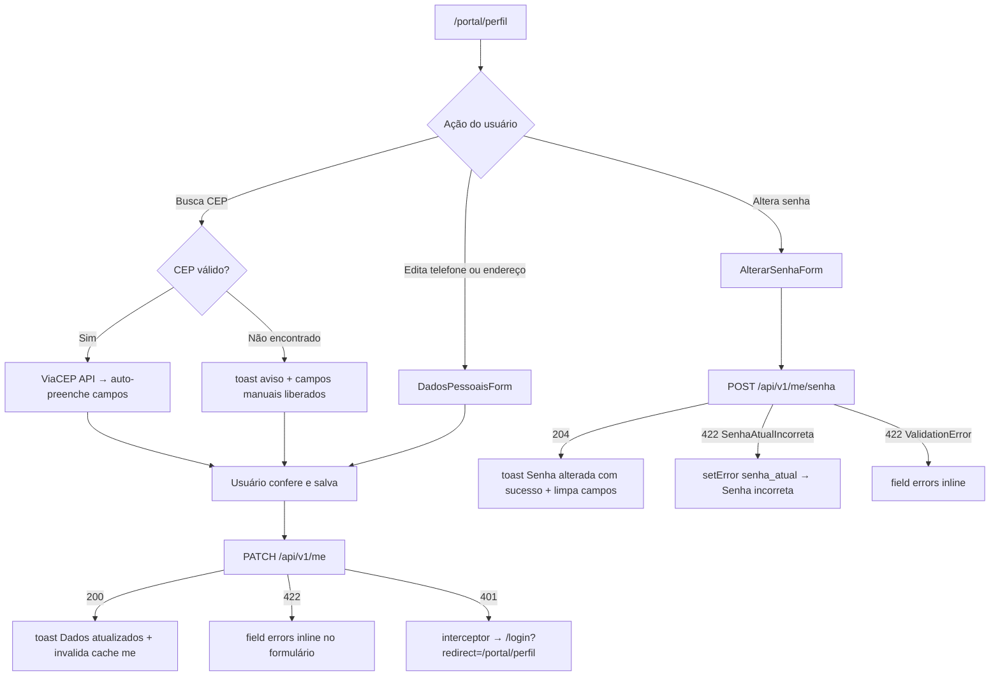
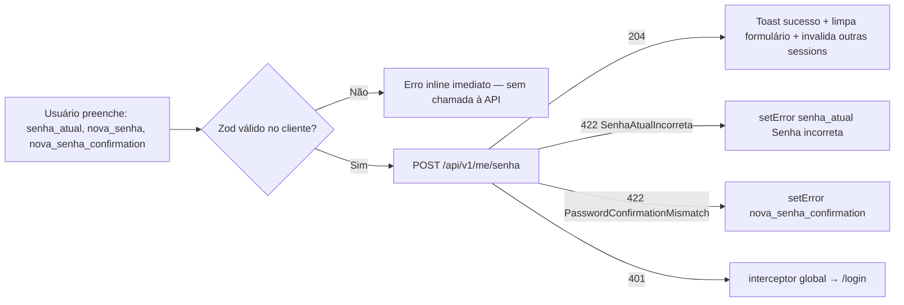

# SPEC-009 — Perfil (PATCH /me + troca de senha)

> **Spec unificada backend + frontend.** Permite ao formando visualizar e editar seus dados pessoais (telefone, endereço de entrega, preferências de comunicação) e alterar sua senha. Campos de identificação (nome, CPF, e-mail) são protegidos e não editáveis via portal no MVP.
> Fontes: [api-contract.md §1.3](../api/api-contract.md) · [PLANEJAMENTO_BACKEND_APIV1.md §1,§2](../prd/PLANEJAMENTO_BACKEND_APIV1.md) · [09-TECHNICAL-DESIGN-CRITICAL-MODULES.md §1](../frontend/09-TECHNICAL-DESIGN-CRITICAL-MODULES.md) · [07-DATA-CONTRACTS-AND-VIEW-MODELS.md §3.1](../frontend/07-DATA-CONTRACTS-AND-VIEW-MODELS.md)

---

## 0. Resumo executivo

O formando acessa `/portal/perfil`, visualiza seus dados pessoais e pode editar: **telefone**, **endereço de entrega** (com auto-preenchimento via ViaCEP) e **preferências de comunicação** (e-mail, SMS, WhatsApp). Numa seção separada, pode alterar sua senha. Os dois formulários são independentes — salvar um não afeta o outro. Campos de identificação (nome, CPF, e-mail) são exibidos como somente leitura; a alteração de e-mail requer fluxo de verificação (pós-MVP). Ao trocar a senha com sucesso, as sessões de outros dispositivos são invalidadas, mas a sessão atual permanece ativa. A feature é simples em fluxo, mas crítica para consistência de dados e segurança da conta.

---

## 1. Visão da feature

### 1.1 Jornada macro — Edição de perfil



### 1.2 Jornada macro — Troca de senha



### 1.3 Atores

| Ator                   | Ação                                                                 |
| ---------------------- | -------------------------------------------------------------------- |
| Formando autenticado   | Edita dados pessoais e altera senha (jornada primária).              |
| Responsável financeiro | Mesmas credenciais do formando — edita apenas dados da conta.        |
| Admin (backoffice)     | Pode alterar nome, CPF, e-mail via painel Blade — fora desta spec.   |
| Mobile F8 (futuro)     | Consome `PATCH /me` e `POST /me/senha` com Bearer token (mesma API). |

### 1.4 Valor

- Mantém dados de contato atualizados sem depender do backoffice.
- Endereço de entrega correto é pré-requisito para envio de materiais físicos.
- Troca de senha autossuficiente reduz carga de suporte.
- Proteção de campos críticos (CPF, e-mail) via servidor previne alterações acidentais ou maliciosas.

### 1.5 Escopo

**In:** edição de telefone, endereço de entrega (com CEP lookup), preferências de comunicação, troca de senha.
**Out:** alteração de e-mail (requer verificação — pós-MVP), alteração de nome/CPF (admin apenas), foto de perfil (pós-MVP), 2FA (pós-MVP), histórico de sessões (pós-MVP).

---

## 2. Contrato da API

### 2.1 `GET /api/v1/me` (referência — definido em SPEC-001)

- **Route name:** `api.v1.me`
- **Middlewares:** `auth:sanctum`, `throttle:api`
- **Uso nesta spec:** inicializa os formulários com os dados atuais do formando.

O campo `data` retornado inclui o shape completo definido em SPEC-001 §2.3. Os campos editáveis estão aninhados dentro de `data.formandos[0]` ou em extensão futura de `data` (ver blocker B1).

### 2.2 `PATCH /api/v1/me`

- **Route name:** `api.v1.me.update`
- **Middlewares:** `auth:sanctum`, `throttle:api`
- **Idempotência:** não exigida (operação idempotente por natureza — PATCH com mesmo payload retorna mesmo resultado).
- **Auth:** cookie `laravel_session` (SPA) ou Bearer (mobile).

**Request body:**

```json
{
    "telefone": "11999887766",
    "endereco_entrega": {
        "cep": "01310-100",
        "logradouro": "Avenida Paulista",
        "numero": "1000",
        "complemento": "Apto 42",
        "bairro": "Bela Vista",
        "cidade": "São Paulo",
        "estado": "SP"
    },
    "preferencias_comunicacao": {
        "email": true,
        "sms": false,
        "whatsapp": true
    }
}
```

**Regras de validação:**

- Todos os campos são opcionais (PATCH parcial).
- `telefone` → `nullable|string|min:10|max:15|regex:/^\d{10,15}$/`
- `endereco_entrega` → `nullable|array`
- `endereco_entrega.cep` → `nullable|string|regex:/^\d{5}-?\d{3}$/`
- `endereco_entrega.logradouro` → `nullable|string|max:200`
- `endereco_entrega.numero` → `nullable|string|max:20`
- `endereco_entrega.complemento` → `nullable|string|max:100`
- `endereco_entrega.bairro` → `nullable|string|max:100`
- `endereco_entrega.cidade` → `nullable|string|max:100`
- `endereco_entrega.estado` → `nullable|string|size:2|in:<lista UFs BR>`
- `preferencias_comunicacao` → `nullable|array`
- `preferencias_comunicacao.email` → `boolean`
- `preferencias_comunicacao.sms` → `boolean`
- `preferencias_comunicacao.whatsapp` → `boolean`
- **Campos proibidos:** qualquer tentativa de enviar `nome`, `cpf`, `email`, `turma_id`, `pacote_id` deve retornar `422` com `error: CampoProtegido`.

**Response 200:** resource `FormandoMeResource` atualizado (mesmo shape de `GET /me`).

**Erros:**

- `422 ValidationError` — campos inválidos (`details.fields`)
- `422 CampoProtegido` — tentativa de alterar campo somente-leitura
- `401 Unauthenticated` — sessão expirada

### 2.3 `POST /api/v1/me/senha`

- **Route name:** `api.v1.me.senha`
- **Middlewares:** `auth:sanctum`, `throttle:senha` (10/min por `user_id`)
- **Auth:** cookie `laravel_session` ou Bearer.

**Request body:**

```json
{
    "senha_atual": "SenhaAntiga#123",
    "nova_senha": "NovaSenha#456",
    "nova_senha_confirmation": "NovaSenha#456"
}
```

**Regras de validação:**

- `senha_atual` → `required|string`
- `nova_senha` → `required|string|min:8|max:128|regex:/[A-Z]/|regex:/[0-9]/|regex:/[^a-zA-Z0-9]/|confirmed`
- `nova_senha_confirmation` → `required|string`

**Comportamento pós-sucesso:**

- Atualiza o hash da senha via `Hash::make()`.
- Invalida todas as sessions ativas de **outros dispositivos** (`Auth::logoutOtherDevices($nova_senha)`).
- Sessão atual permanece ativa.
- Tokens Bearer de outros dispositivos são revogados (`$user->tokens()->where('id', '!=', $currentTokenId)->delete()`).

**Response 204:** sem corpo.

**Erros:**

- `422 SenhaAtualIncorreta` — `senha_atual` não confere com hash atual
- `422 ValidationError` — regras de complexidade ou confirmação não satisfeitas
- `401 Unauthenticated` — sessão expirada

### 2.4 Headers obrigatórios

Mesmos headers definidos em SPEC-001 §2.5 (`X-Request-Id`, `X-XSRF-TOKEN`, `Content-Type`, `Accept`, `X-Requested-With`).

---

## 3. Backend — Laravel 13

### 3.1 Arquivos a criar/modificar

| Arquivo                                               | Ação      | Responsabilidade                                                     |
| ----------------------------------------------------- | --------- | -------------------------------------------------------------------- |
| `app/Http/Controllers/Api/V1/MeController.php`        | Criar     | `update()` e `alterarSenha()`.                                       |
| `app/Http/Requests/Api/V1/AtualizarPerfilRequest.php` | Criar     | Validação de PATCH /me + proteção de campos.                         |
| `app/Http/Requests/Api/V1/AlterarSenhaRequest.php`    | Criar     | Validação de POST /me/senha.                                         |
| `app/Http/Resources/V1/MeResource.php`                | Modificar | Incluir campos editáveis (telefone, endereco_entrega, preferencias). |
| `routes/api/v1.php`                                   | Modificar | Registrar PATCH /me e POST /me/senha.                                |
| `app/Providers/RateLimiterServiceProvider.php`        | Modificar | Registrar limiter `senha` (10/min por user_id).                      |
| `tests/Feature/Api/V1/Perfil/AtualizarPerfilTest.php` | Criar     | Testes Pest para PATCH /me.                                          |
| `tests/Feature/Api/V1/Perfil/AlterarSenhaTest.php`    | Criar     | Testes Pest para POST /me/senha.                                     |

### 3.2 `AtualizarPerfilRequest`

```php
<?php
declare(strict_types=1);

namespace App\Http\Requests\Api\V1;

use Illuminate\Foundation\Http\FormRequest;
use Illuminate\Validation\Validator;

final class AtualizarPerfilRequest extends FormRequest
{
    /** @var list<string> */
    private const CAMPOS_PROTEGIDOS = ['nome', 'cpf', 'email', 'turma_id', 'pacote_id'];

    public function authorize(): bool
    {
        return true; // auth:sanctum garante autenticação
    }

    public function rules(): array
    {
        return [
            'telefone'                              => ['nullable', 'string', 'min:10', 'max:15', 'regex:/^\d{10,15}$/'],
            'endereco_entrega'                      => ['nullable', 'array'],
            'endereco_entrega.cep'                  => ['nullable', 'string', 'regex:/^\d{5}-?\d{3}$/'],
            'endereco_entrega.logradouro'           => ['nullable', 'string', 'max:200'],
            'endereco_entrega.numero'               => ['nullable', 'string', 'max:20'],
            'endereco_entrega.complemento'          => ['nullable', 'string', 'max:100'],
            'endereco_entrega.bairro'               => ['nullable', 'string', 'max:100'],
            'endereco_entrega.cidade'               => ['nullable', 'string', 'max:100'],
            'endereco_entrega.estado'               => ['nullable', 'string', 'size:2', 'in:AC,AL,AP,AM,BA,CE,DF,ES,GO,MA,MT,MS,MG,PA,PB,PR,PE,PI,RJ,RN,RS,RO,RR,SC,SP,SE,TO'],
            'preferencias_comunicacao'              => ['nullable', 'array'],
            'preferencias_comunicacao.email'        => ['boolean'],
            'preferencias_comunicacao.sms'          => ['boolean'],
            'preferencias_comunicacao.whatsapp'     => ['boolean'],
        ];
    }

    public function withValidator(Validator $validator): void
    {
        $validator->after(function (Validator $v): void {
            foreach (self::CAMPOS_PROTEGIDOS as $campo) {
                if ($this->has($campo)) {
                    $v->errors()->add($campo, "O campo {$campo} não pode ser alterado pelo portal.");
                }
            }
        });
    }

    public function messages(): array
    {
        return [
            'telefone.regex'              => 'Telefone deve conter apenas dígitos (10 a 15).',
            'telefone.min'               => 'Telefone deve ter no mínimo 10 dígitos.',
            'endereco_entrega.cep.regex' => 'CEP inválido. Use o formato 00000-000.',
            'endereco_entrega.estado.in' => 'Estado inválido. Use a sigla de 2 letras (ex: SP).',
            'endereco_entrega.estado.size' => 'Estado deve ter exatamente 2 caracteres.',
        ];
    }
}
```

### 3.3 `AlterarSenhaRequest`

```php
<?php
declare(strict_types=1);

namespace App\Http\Requests\Api\V1;

use Illuminate\Foundation\Http\FormRequest;

final class AlterarSenhaRequest extends FormRequest
{
    public function authorize(): bool
    {
        return true;
    }

    public function rules(): array
    {
        return [
            'senha_atual'              => ['required', 'string'],
            'nova_senha'               => [
                'required',
                'string',
                'min:8',
                'max:128',
                'regex:/[A-Z]/',
                'regex:/[0-9]/',
                'regex:/[^a-zA-Z0-9]/',
                'confirmed',
            ],
            'nova_senha_confirmation'  => ['required', 'string'],
        ];
    }

    public function messages(): array
    {
        return [
            'senha_atual.required'          => 'Informe sua senha atual.',
            'nova_senha.required'           => 'Informe a nova senha.',
            'nova_senha.min'                => 'A nova senha deve ter pelo menos 8 caracteres.',
            'nova_senha.regex'              => 'A senha deve conter maiúscula, número e caractere especial.',
            'nova_senha.confirmed'          => 'A confirmação da nova senha não confere.',
            'nova_senha_confirmation.required' => 'Confirme a nova senha.',
        ];
    }
}
```

### 3.4 `MeController` — update e alterarSenha

```php
<?php
declare(strict_types=1);

namespace App\Http\Controllers\Api\V1;

use App\Http\Controllers\Controller;
use App\Http\Requests\Api\V1\AtualizarPerfilRequest;
use App\Http\Requests\Api\V1\AlterarSenhaRequest;
use App\Http\Resources\V1\MeResource;
use Illuminate\Http\JsonResponse;
use Illuminate\Http\Request;
use Illuminate\Http\Response;
use Illuminate\Support\Facades\Hash;
use Illuminate\Auth\Events\PasswordReset;

final class MeController extends Controller
{
    public function update(AtualizarPerfilRequest $request): MeResource
    {
        $user = $request->user();
        $dados = $request->validated();

        $user->update(array_filter([
            'telefone'                 => $dados['telefone'] ?? null,
            'endereco_entrega'         => $dados['endereco_entrega'] ?? null,
            'preferencias_comunicacao' => $dados['preferencias_comunicacao'] ?? null,
        ], fn ($v) => $v !== null));

        return new MeResource(
            $user->fresh()->load(['formandos.turma', 'formandos.evento', 'roles', 'permissions'])
        );
    }

    public function alterarSenha(AlterarSenhaRequest $request): Response
    {
        $user = $request->user();

        if (! Hash::check($request->validated('senha_atual'), $user->password)) {
            return response()->json([
                'error'      => 'SenhaAtualIncorreta',
                'message'    => 'A senha atual informada está incorreta.',
                'details'    => ['fields' => ['senha_atual' => ['Senha incorreta.']]],
                'request_id' => $request->header('X-Request-Id'),
                'timestamp'  => now()->toIso8601String(),
            ], 422);
        }

        $user->update(['password' => Hash::make($request->validated('nova_senha'))]);

        // Invalida sessions de outros devices; mantém a sessão atual
        event(new PasswordReset($user));

        // Revoga tokens Bearer de outros dispositivos
        if ($currentToken = $user->currentAccessToken()) {
            $user->tokens()->where('id', '!=', $currentToken->id)->delete();
        }

        return response()->noContent();
    }
}
```

### 3.5 Registro das rotas em `routes/api/v1.php`

```php
// Dentro do grupo auth:sanctum já existente
Route::patch('/me', [MeController::class, 'update'])->name('api.v1.me.update');
Route::post('/me/senha', [MeController::class, 'alterarSenha'])
    ->middleware('throttle:senha')
    ->name('api.v1.me.senha');
```

### 3.6 Rate limiter `senha` em `RateLimiterServiceProvider`

```php
RateLimiter::for('senha', function (Request $request) {
    $key = 'senha|' . $request->user()?->id;
    return Limit::perMinute(10)->by($key)->response(function () {
        return response()->json([
            'error'      => 'RateLimitExceeded',
            'message'    => 'Muitas tentativas de alteração de senha. Tente novamente em instantes.',
            'details'    => null,
            'request_id' => request()->header('X-Request-Id'),
            'timestamp'  => now()->toIso8601String(),
        ], 429);
    });
});
```

### 3.7 Testes Pest (mínimo obrigatório)

```php
// tests/Feature/Api/V1/Perfil/AtualizarPerfilTest.php

it('atualiza telefone com sucesso e retorna 200 com dados atualizados', function () {
    $user = PortalUser::factory()->create();
    $this->actingAs($user, 'sanctum');

    $response = $this->patchJson('/api/v1/me', [
        'telefone' => '11999887766',
    ]);

    $response->assertOk()
        ->assertJsonPath('data.telefone', '11999887766');
});

it('atualiza endereco_entrega com sucesso', function () {
    $user = PortalUser::factory()->create();
    $this->actingAs($user, 'sanctum');

    $response = $this->patchJson('/api/v1/me', [
        'endereco_entrega' => [
            'cep'        => '01310-100',
            'logradouro' => 'Avenida Paulista',
            'numero'     => '1000',
            'bairro'     => 'Bela Vista',
            'cidade'     => 'São Paulo',
            'estado'     => 'SP',
        ],
    ]);

    $response->assertOk()
        ->assertJsonPath('data.endereco_entrega.cidade', 'São Paulo');
});

it('retorna 422 ao tentar alterar o campo email (protegido)', function () {
    $user = PortalUser::factory()->create();
    $this->actingAs($user, 'sanctum');

    $response = $this->patchJson('/api/v1/me', [
        'email' => 'novo@email.com',
    ]);

    $response->assertStatus(422)
        ->assertJsonPath('error', 'ValidationError')
        ->assertJsonStructure(['details' => ['fields' => ['email']]]);
});

it('retorna 422 ao tentar alterar o campo cpf (protegido)', function () {
    $user = PortalUser::factory()->create();
    $this->actingAs($user, 'sanctum');

    $response = $this->patchJson('/api/v1/me', ['cpf' => '123.456.789-00']);

    $response->assertStatus(422)
        ->assertJsonStructure(['details' => ['fields' => ['cpf']]]);
});

it('retorna 422 quando cep tem formato inválido', function () {
    $user = PortalUser::factory()->create();
    $this->actingAs($user, 'sanctum');

    $response = $this->patchJson('/api/v1/me', [
        'endereco_entrega' => ['cep' => 'ABCDE-XYZ'],
    ]);

    $response->assertStatus(422)
        ->assertJsonPath('error', 'ValidationError');
});

// tests/Feature/Api/V1/Perfil/AlterarSenhaTest.php

it('altera senha com sucesso e retorna 204', function () {
    $user = PortalUser::factory()->create(['password' => bcrypt('SenhaAntiga#1')]);
    $this->actingAs($user, 'sanctum');

    $response = $this->postJson('/api/v1/me/senha', [
        'senha_atual'             => 'SenhaAntiga#1',
        'nova_senha'              => 'NovaSenha@2026',
        'nova_senha_confirmation' => 'NovaSenha@2026',
    ]);

    $response->assertNoContent();
    expect(Hash::check('NovaSenha@2026', $user->fresh()->password))->toBeTrue();
});

it('retorna 422 SenhaAtualIncorreta quando senha_atual está errada', function () {
    $user = PortalUser::factory()->create(['password' => bcrypt('SenhaCorreta#1')]);
    $this->actingAs($user, 'sanctum');

    $response = $this->postJson('/api/v1/me/senha', [
        'senha_atual'             => 'SenhaErrada#1',
        'nova_senha'              => 'NovaSenha@2026',
        'nova_senha_confirmation' => 'NovaSenha@2026',
    ]);

    $response->assertStatus(422)
        ->assertJsonPath('error', 'SenhaAtualIncorreta')
        ->assertJsonPath('details.fields.senha_atual.0', 'Senha incorreta.');
});

it('retorna 422 quando nova_senha e confirmação não coincidem', function () {
    $user = PortalUser::factory()->create(['password' => bcrypt('SenhaAntiga#1')]);
    $this->actingAs($user, 'sanctum');

    $response = $this->postJson('/api/v1/me/senha', [
        'senha_atual'             => 'SenhaAntiga#1',
        'nova_senha'              => 'NovaSenha@2026',
        'nova_senha_confirmation' => 'SenhaDiferente@2026',
    ]);

    $response->assertStatus(422)
        ->assertJsonPath('error', 'ValidationError');
});
```

---

## 4. Frontend — React 19 SPA

### 4.1 Arquivos a criar/modificar

| Arquivo                                                                 | Ação      | Responsabilidade                                          |
| ----------------------------------------------------------------------- | --------- | --------------------------------------------------------- |
| `resources/spa/src/api/hooks/use-auth.ts`                               | Modificar | Adicionar `useAtualizarPerfil` e `useAlterarSenha`.       |
| `resources/spa/src/routes/portal/perfil.tsx`                            | Criar     | Rota `/portal/perfil` com `PerfilPage`.                   |
| `resources/spa/src/components/perfil/dados-pessoais-form.tsx`           | Criar     | Formulário com telefone e preferências de comunicação.    |
| `resources/spa/src/components/perfil/endereco-entrega-form.tsx`         | Criar     | Sub-seção com campo CEP e auto-preenchimento ViaCEP.      |
| `resources/spa/src/components/perfil/preferencias-comunicacao-form.tsx` | Criar     | Checkboxes email/sms/whatsapp.                            |
| `resources/spa/src/components/perfil/alterar-senha-form.tsx`            | Criar     | 3 campos de senha com toggle de visibilidade.             |
| `resources/spa/src/components/ui/cep-input.tsx`                         | Criar     | Input com lookup ViaCEP ao perder foco (onBlur).          |
| `resources/spa/src/forms/perfil/dados-pessoais.schema.ts`               | Criar     | Schema Zod para dados pessoais + endereço + preferências. |
| `resources/spa/src/forms/perfil/alterar-senha.schema.ts`                | Criar     | Schema Zod para troca de senha.                           |
| `resources/spa/src/view-models/perfil.ts`                               | Criar     | ViewModel e mapper para campos editáveis do perfil.       |
| `resources/spa/tests/unit/perfil.schema.test.ts`                        | Criar     | Testes Vitest dos schemas Zod.                            |
| `resources/spa/tests/integration/dados-pessoais-form.test.tsx`          | Criar     | Testes RTL + MSW do formulário principal.                 |
| `resources/spa/tests/integration/alterar-senha-form.test.tsx`           | Criar     | Testes RTL + MSW do formulário de senha.                  |

### 4.2 Schemas Zod completos

#### `forms/perfil/dados-pessoais.schema.ts`

```typescript
import { z } from 'zod';

const UF_VALIDAS = [
    'AC',
    'AL',
    'AP',
    'AM',
    'BA',
    'CE',
    'DF',
    'ES',
    'GO',
    'MA',
    'MT',
    'MS',
    'MG',
    'PA',
    'PB',
    'PR',
    'PE',
    'PI',
    'RJ',
    'RN',
    'RS',
    'RO',
    'RR',
    'SC',
    'SP',
    'SE',
    'TO',
] as const;

export const enderecoEntregaSchema = z
    .object({
        cep: z
            .string()
            .regex(/^\d{5}-?\d{3}$/, 'CEP inválido. Use o formato 00000-000.')
            .optional()
            .or(z.literal('')),
        logradouro: z.string().max(200, 'Máximo 200 caracteres.').optional().or(z.literal('')),
        numero: z.string().max(20, 'Máximo 20 caracteres.').optional().or(z.literal('')),
        complemento: z.string().max(100, 'Máximo 100 caracteres.').optional().or(z.literal('')),
        bairro: z.string().max(100, 'Máximo 100 caracteres.').optional().or(z.literal('')),
        cidade: z.string().max(100, 'Máximo 100 caracteres.').optional().or(z.literal('')),
        estado: z.enum(UF_VALIDAS, { message: 'Estado inválido.' }).optional(),
    })
    .optional();

export const preferenciasComunicacaoSchema = z
    .object({
        email: z.boolean(),
        sms: z.boolean(),
        whatsapp: z.boolean(),
    })
    .optional();

export const dadosPessoaisSchema = z.object({
    telefone: z
        .string()
        .regex(/^\d{10,15}$/, 'Telefone deve conter apenas dígitos (10 a 15).')
        .optional()
        .or(z.literal('')),
    endereco_entrega: enderecoEntregaSchema,
    preferencias_comunicacao: preferenciasComunicacaoSchema,
});

export type DadosPessoaisFormData = z.infer<typeof dadosPessoaisSchema>;
export type EnderecoEntregaFormData = z.infer<typeof enderecoEntregaSchema>;
```

#### `forms/perfil/alterar-senha.schema.ts`

```typescript
import { z } from 'zod';

export const alterarSenhaSchema = z
    .object({
        senha_atual: z.string({ required_error: 'Informe sua senha atual.' }).min(1, 'Informe sua senha atual.'),
        nova_senha: z
            .string({ required_error: 'Informe a nova senha.' })
            .min(8, 'Mínimo 8 caracteres.')
            .max(128, 'Máximo 128 caracteres.')
            .regex(/[A-Z]/, 'Deve conter pelo menos uma letra maiúscula.')
            .regex(/[0-9]/, 'Deve conter pelo menos um número.')
            .regex(/[^a-zA-Z0-9]/, 'Deve conter pelo menos um caractere especial.'),
        nova_senha_confirmation: z
            .string({ required_error: 'Confirme a nova senha.' })
            .min(1, 'Confirme a nova senha.'),
    })
    .refine((d) => d.nova_senha === d.nova_senha_confirmation, {
        message: 'As senhas não coincidem.',
        path: ['nova_senha_confirmation'],
    });

export type AlterarSenhaFormData = z.infer<typeof alterarSenhaSchema>;
```

### 4.3 Hooks — adições a `use-auth.ts`

```typescript
// Adicionar ao arquivo resources/spa/src/api/hooks/use-auth.ts

import type { DadosPessoaisFormData, AlterarSenhaFormData } from '@/forms/perfil/dados-pessoais.schema';

// ─── useAtualizarPerfil ───────────────────────────────────────────────────────

export function useAtualizarPerfil() {
    const qc = useQueryClient();

    return useMutation({
        mutationKey: ['auth', 'me', 'update'],
        mutationFn: async (payload: DadosPessoaisFormData) => {
            const { data } = await api.patch<{ data: FormandoMeDto }>('/me', payload);
            return data.data;
        },
        onSuccess: (user) => {
            // Invalida cache e atualiza dados exibidos no layout
            qc.invalidateQueries({ queryKey: queryKeys.me });
            qc.setQueryData(queryKeys.me, user);
        },
        onError: (err) => {
            // Tratamento de 422 é feito pelo componente via err.details?.fields
            if (!(err instanceof ApiError)) {
                console.error('[useAtualizarPerfil] erro inesperado:', err);
            }
        },
    });
}

// ─── useAlterarSenha ──────────────────────────────────────────────────────────

export function useAlterarSenha() {
    return useMutation({
        mutationKey: ['auth', 'me', 'senha'],
        mutationFn: async (payload: AlterarSenhaFormData) => {
            await api.post('/me/senha', payload);
        },
        // onSuccess: quem chama limpa o form e exibe toast
        // onError: quem chama interpreta err.details?.fields['senha_atual']
    });
}
```

### 4.4 Componente `CepInput`

```typescript
// resources/spa/src/components/ui/cep-input.tsx
import { forwardRef, useState } from 'react'
import type { InputHTMLAttributes } from 'react'

export interface ViaCepResponse {
  logradouro: string
  bairro:     string
  localidade: string
  uf:         string
  erro?:      boolean
}

export interface CepInputProps extends InputHTMLAttributes<HTMLInputElement> {
  onCepResolved?: (dados: ViaCepResponse) => void
  onCepError?:    () => void
}

export const CepInput = forwardRef<HTMLInputElement, CepInputProps>(
  ({ onCepResolved, onCepError, onBlur, ...props }, ref) => {
    const [buscando, setBuscando] = useState(false)

    const handleBlur = async (e: React.FocusEvent<HTMLInputElement>) => {
      onBlur?.(e)
      const cep = e.target.value.replace(/\D/g, '')
      if (cep.length !== 8) {
        return
      }
      setBuscando(true)
      try {
        const res = await fetch(`https://viacep.com.br/ws/${cep}/json/`, {
          signal: AbortSignal.timeout(5000),
        })
        if (!res.ok) {
          throw new Error(`ViaCEP respondeu ${res.status}`)
        }
        const dados: ViaCepResponse = await res.json()
        if (dados.erro) {
          onCepError?.()
        } else {
          onCepResolved?.(dados)
        }
      } catch {
        onCepError?.()
      } finally {
        setBuscando(false)
      }
    }

    return (
      <div className="relative">
        <input
          ref={ref}
          {...props}
          onBlur={handleBlur}
          placeholder="00000-000"
          maxLength={9}
          className={[
            'w-full rounded-md border px-3 py-2 text-sm',
            'focus:outline-none focus:ring-2 focus:ring-primary-500',
            props.className,
          ].join(' ')}
        />
        {buscando && (
          <span className="absolute right-3 top-1/2 -translate-y-1/2 text-xs text-gray-400">
            Buscando...
          </span>
        )}
      </div>
    )
  }
)
CepInput.displayName = 'CepInput'
```

### 4.5 Componente `EnderecoEntregaForm`

```typescript
// resources/spa/src/components/perfil/endereco-entrega-form.tsx
import { useFormContext } from 'react-hook-form'
import { CepInput } from '@/components/ui/cep-input'
import type { DadosPessoaisFormData } from '@/forms/perfil/dados-pessoais.schema'
import { toast } from '@/lib/toast'

export function EnderecoEntregaForm() {
  const { register, setValue, formState: { errors } } = useFormContext<DadosPessoaisFormData>()

  return (
    <fieldset className="mt-6 space-y-4">
      <legend className="text-sm font-semibold text-gray-700">Endereço de Entrega</legend>

      <div>
        <label className="block text-sm font-medium text-gray-600">CEP</label>
        <CepInput
          {...register('endereco_entrega.cep')}
          onCepResolved={(dados) => {
            setValue('endereco_entrega.logradouro', dados.logradouro, { shouldDirty: true })
            setValue('endereco_entrega.bairro',     dados.bairro,     { shouldDirty: true })
            setValue('endereco_entrega.cidade',     dados.localidade,  { shouldDirty: true })
            setValue('endereco_entrega.estado',     dados.uf as never, { shouldDirty: true })
          }}
          onCepError={() => {
            toast.warning('CEP não encontrado. Preencha os campos manualmente.')
          }}
        />
        {errors.endereco_entrega?.cep && (
          <p className="mt-1 text-xs text-red-600">{errors.endereco_entrega.cep.message}</p>
        )}
      </div>

      <div className="grid grid-cols-3 gap-3">
        <div className="col-span-2">
          <label className="block text-sm font-medium text-gray-600">Logradouro</label>
          <input {...register('endereco_entrega.logradouro')} className="input-base w-full" />
        </div>
        <div>
          <label className="block text-sm font-medium text-gray-600">Número</label>
          <input {...register('endereco_entrega.numero')} className="input-base w-full" />
        </div>
      </div>

      <div className="grid grid-cols-2 gap-3">
        <div>
          <label className="block text-sm font-medium text-gray-600">Complemento</label>
          <input {...register('endereco_entrega.complemento')} className="input-base w-full" />
        </div>
        <div>
          <label className="block text-sm font-medium text-gray-600">Bairro</label>
          <input {...register('endereco_entrega.bairro')} className="input-base w-full" />
        </div>
      </div>

      <div className="grid grid-cols-3 gap-3">
        <div className="col-span-2">
          <label className="block text-sm font-medium text-gray-600">Cidade</label>
          <input {...register('endereco_entrega.cidade')} className="input-base w-full" />
        </div>
        <div>
          <label className="block text-sm font-medium text-gray-600">Estado</label>
          <input {...register('endereco_entrega.estado')} maxLength={2} className="input-base w-full uppercase" />
          {errors.endereco_entrega?.estado && (
            <p className="mt-1 text-xs text-red-600">{errors.endereco_entrega.estado.message}</p>
          )}
        </div>
      </div>
    </fieldset>
  )
}
```

### 4.6 Componente `AlterarSenhaForm`

```typescript
// resources/spa/src/components/perfil/alterar-senha-form.tsx
import { useForm } from 'react-hook-form'
import { zodResolver } from '@hookform/resolvers/zod'
import { alterarSenhaSchema, type AlterarSenhaFormData } from '@/forms/perfil/alterar-senha.schema'
import { useAlterarSenha } from '@/api/hooks/use-auth'
import { ApiError } from '@/api/errors'
import { toast } from '@/lib/toast'
import { PasswordInput } from '@/components/ui/password-input'

export function AlterarSenhaForm() {
  const { mutateAsync, isPending } = useAlterarSenha()
  const {
    register,
    handleSubmit,
    reset,
    setError,
    formState: { errors },
  } = useForm<AlterarSenhaFormData>({
    resolver: zodResolver(alterarSenhaSchema),
  })

  const onSubmit = async (data: AlterarSenhaFormData) => {
    try {
      await mutateAsync(data)
      reset()
      toast.success('Senha alterada com sucesso.')
    } catch (err) {
      if (err instanceof ApiError && err.status === 422) {
        const campos = err.details?.fields ?? {}
        if (campos['senha_atual']) {
          setError('senha_atual', { message: campos['senha_atual'][0] ?? 'Senha incorreta.' })
        }
        if (campos['nova_senha']) {
          setError('nova_senha', { message: campos['nova_senha'][0] })
        }
        if (campos['nova_senha_confirmation']) {
          setError('nova_senha_confirmation', { message: campos['nova_senha_confirmation'][0] })
        }
        return
      }
      toast.error('Erro inesperado ao alterar senha. Tente novamente.')
    }
  }

  return (
    <section aria-labelledby="seguranca-titulo" className="mt-10">
      <h2 id="seguranca-titulo" className="text-base font-semibold text-gray-800">
        Segurança
      </h2>
      <p className="mt-1 text-sm text-gray-500">
        Altere sua senha. A sessão atual permanecerá ativa; outros dispositivos serão desconectados.
      </p>

      <form onSubmit={handleSubmit(onSubmit)} noValidate className="mt-4 space-y-4">
        <div>
          <label htmlFor="senha_atual" className="block text-sm font-medium text-gray-700">
            Senha atual
          </label>
          <PasswordInput
            id="senha_atual"
            {...register('senha_atual')}
            aria-invalid={!!errors.senha_atual}
            aria-describedby={errors.senha_atual ? 'senha_atual-error' : undefined}
          />
          {errors.senha_atual && (
            <p id="senha_atual-error" role="alert" className="mt-1 text-xs text-red-600">
              {errors.senha_atual.message}
            </p>
          )}
        </div>

        <div>
          <label htmlFor="nova_senha" className="block text-sm font-medium text-gray-700">
            Nova senha
          </label>
          <PasswordInput
            id="nova_senha"
            {...register('nova_senha')}
            aria-invalid={!!errors.nova_senha}
            aria-describedby={errors.nova_senha ? 'nova_senha-error' : undefined}
          />
          {errors.nova_senha && (
            <p id="nova_senha-error" role="alert" className="mt-1 text-xs text-red-600">
              {errors.nova_senha.message}
            </p>
          )}
        </div>

        <div>
          <label htmlFor="nova_senha_confirmation" className="block text-sm font-medium text-gray-700">
            Confirmar nova senha
          </label>
          <PasswordInput
            id="nova_senha_confirmation"
            {...register('nova_senha_confirmation')}
            aria-invalid={!!errors.nova_senha_confirmation}
            aria-describedby={errors.nova_senha_confirmation ? 'nova_senha_confirmation-error' : undefined}
          />
          {errors.nova_senha_confirmation && (
            <p id="nova_senha_confirmation-error" role="alert" className="mt-1 text-xs text-red-600">
              {errors.nova_senha_confirmation.message}
            </p>
          )}
        </div>

        <button
          type="submit"
          disabled={isPending}
          className="rounded-md bg-primary-600 px-4 py-2 text-sm font-semibold text-white hover:bg-primary-700 disabled:opacity-50"
        >
          {isPending ? 'Alterando...' : 'Alterar senha'}
        </button>
      </form>
    </section>
  )
}
```

### 4.7 Rota `/portal/perfil`

```typescript
// resources/spa/src/routes/portal/perfil.tsx
import { createFileRoute } from '@tanstack/react-router'
import { useMe } from '@/api/hooks/use-auth'
import { DadosPessoaisForm } from '@/components/perfil/dados-pessoais-form'
import { AlterarSenhaForm } from '@/components/perfil/alterar-senha-form'

export const Route = createFileRoute('/portal/perfil')({
  component: PerfilPage,
})

function PerfilPage() {
  const { data: me, isLoading } = useMe()

  if (isLoading) {
    return <div className="p-8 text-center text-sm text-gray-400">Carregando...</div>
  }

  return (
    <div className="mx-auto max-w-2xl px-4 py-8">
      <header className="mb-6">
        <h1 className="text-xl font-bold text-gray-900">Meu perfil</h1>
        <p className="text-sm text-gray-500">
          Gerencie seus dados pessoais e configurações de conta.
        </p>
      </header>

      {/* Campos somente-leitura (identificação) */}
      <section aria-labelledby="identidade-titulo" className="rounded-lg border bg-gray-50 p-4">
        <h2 id="identidade-titulo" className="text-sm font-semibold text-gray-700">
          Identificação
        </h2>
        <p className="mt-1 text-xs text-gray-400">
          Esses dados são gerenciados pela ArtFinal e não podem ser alterados pelo portal.
        </p>
        <dl className="mt-3 grid grid-cols-2 gap-3 text-sm">
          <div>
            <dt className="text-gray-500">Nome</dt>
            <dd className="font-medium text-gray-800">{me?.nome}</dd>
          </div>
          <div>
            <dt className="text-gray-500">E-mail</dt>
            <dd className="font-medium text-gray-800">{me?.email}</dd>
          </div>
        </dl>
      </section>

      {/* Formulário de dados editáveis */}
      <DadosPessoaisForm defaultValues={me} />

      {/* Seção de segurança */}
      <AlterarSenhaForm />
    </div>
  )
}
```

### 4.8 Tratamento de erros (por código)

| `ApiError.error`      | HTTP | UX no componente                                            |
| --------------------- | ---- | ----------------------------------------------------------- |
| `ValidationError`     | 422  | `setError` via RHF em cada `details.fields[name]`.          |
| `CampoProtegido`      | 422  | Toast de aviso: "Campo não pode ser alterado pelo portal."  |
| `SenhaAtualIncorreta` | 422  | `setError('senha_atual', { message: 'Senha incorreta.' })`. |
| `RateLimitExceeded`   | 429  | Toast: "Muitas tentativas. Aguarde {Retry-After}s."         |
| `Unauthenticated`     | 401  | Interceptor global → `/login?redirect=/portal/perfil`.      |
| `InternalServerError` | 5xx  | Toast: "Erro interno. ID: {request_id}."                    |

---

## 5. Ordem de implementação (BE → FE → E2E)

### 5.1 Gate A — Backend (PATCH /me)

1. Estender `MeResource` com campos `telefone`, `endereco_entrega`, `preferencias_comunicacao`.
2. Criar `AtualizarPerfilRequest` com regras de validação e proteção de campos.
3. Criar `MeController@update`.
4. Registrar rota `PATCH /me` em `routes/api/v1.php`.
5. Escrever 5 testes Pest para `AtualizarPerfilTest`.

> **Gate A done quando:** `php artisan test --filter=AtualizarPerfil` — 5/5 verdes.

### 5.2 Gate B — Backend (POST /me/senha)

6. Criar `AlterarSenhaRequest`.
7. Criar `MeController@alterarSenha`.
8. Registrar rota `POST /me/senha` com rate limiter `senha`.
9. Escrever 3 testes Pest para `AlterarSenhaTest`.

> **Gate B done quando:** `php artisan test --filter=AlterarSenha` — 3/3 verdes.

### 5.3 Gate C — Frontend foundation

10. Criar schemas Zod `dados-pessoais.schema.ts` e `alterar-senha.schema.ts`.
11. Criar `CepInput` com integração ViaCEP.
12. Criar `PasswordInput` (se não existir de SPEC-001).
13. Adicionar `useAtualizarPerfil` e `useAlterarSenha` a `use-auth.ts`.

> **Gate C done quando:** `npm run typecheck` verde.

### 5.4 Gate D — Tela de perfil

14. Criar `EnderecoEntregaForm`, `DadosPessoaisForm`, `PreferenciasComunicacaoForm`.
15. Criar `AlterarSenhaForm`.
16. Criar rota `/portal/perfil`.
17. Smoke test manual: editar telefone → salvar → ver dados atualizados.

> **Gate D done quando:** smoke manual passa (Chromium) + toast de sucesso aparece.

### 5.5 Gate E — Testes

18. Escrever testes de schema Zod (Vitest).
19. Escrever testes de integração com MSW (RTL).
20. CI: `npm run quality` + `php artisan test` verdes.

> **Gate E done quando:** todos verdes no CI + coverage ≥ 70%.

---

## 6. Critérios de aceite (Gherkin PT-BR)

### CA-001 — Atualizar telefone com sucesso

```gherkin
Dado que estou autenticado em "/portal/perfil"
E o meu telefone atual é "11988887777"
Quando altero o telefone para "11999990000"
E clico em "Salvar dados"
Então PATCH /api/v1/me é chamado com telefone "11999990000"
E o servidor retorna 200 com os dados atualizados
E vejo o toast "Dados atualizados com sucesso."
E o campo telefone exibe "11999990000"
```

### CA-002 — Auto-preenchimento de endereço via CEP válido

```gherkin
Dado que estou em "/portal/perfil" na seção de endereço de entrega
Quando digito o CEP "01310-100"
E o campo perde o foco (onBlur)
Então a API ViaCEP é consultada com o CEP "01310100"
E os campos logradouro, bairro, cidade e estado são preenchidos automaticamente
E o campo logradouro mostra "Avenida Paulista"
E o campo estado mostra "SP"
```

### CA-003 — CEP inválido ou não encontrado

```gherkin
Dado que estou em "/portal/perfil" na seção de endereço
Quando digito o CEP "99999-999"
E o campo perde o foco
Então a ViaCEP retorna erro (campo "erro": true)
E vejo o toast de aviso "CEP não encontrado. Preencha os campos manualmente."
E os campos de endereço permanecem editáveis e vazios
```

### CA-004 — Alterar senha com sucesso

```gherkin
Dado que estou autenticado em "/portal/perfil"
Quando preencho "Senha atual" com minha senha correta
E preencho "Nova senha" com "NovaSenha@2026"
E preencho "Confirmar nova senha" com "NovaSenha@2026"
E clico em "Alterar senha"
Então POST /api/v1/me/senha retorna 204
E vejo o toast "Senha alterada com sucesso."
E os 3 campos de senha são limpos
E a sessão atual permanece ativa
```

### CA-005 — Senha atual incorreta

```gherkin
Dado que estou em "/portal/perfil" na seção de segurança
Quando preencho "Senha atual" com uma senha errada
E preencho "Nova senha" com "NovaSenha@2026"
E preencho "Confirmar nova senha" com "NovaSenha@2026"
E clico em "Alterar senha"
Então POST /api/v1/me/senha retorna 422 com error "SenhaAtualIncorreta"
E vejo a mensagem "Senha incorreta." abaixo do campo "Senha atual"
E a senha não é alterada no banco
```

### CA-006 — Campos protegidos bloqueados (CPF)

```gherkin
Dado que estou autenticado como formando
Quando envio PATCH /api/v1/me com payload contendo o campo "cpf"
Então o servidor retorna 422 com error "ValidationError"
E details.fields.cpf contém a mensagem de campo protegido
E o CPF no banco permanece inalterado
```

### CA-007 — Formulários independentes

```gherkin
Dado que estou em "/portal/perfil"
Quando salvo o formulário de dados pessoais com novo telefone
E o formulário de senha ainda está preenchido mas não submetido
Então apenas PATCH /api/v1/me é chamado
E POST /api/v1/me/senha NÃO é chamado
E os campos do formulário de senha permanecem preenchidos
```

### CA-008 — Validação de nova senha fraca

```gherkin
Dado que estou em "/portal/perfil" na seção de segurança
Quando preencho "Nova senha" com "senhasimples"
E clico em "Alterar senha"
Então NÃO há chamada a POST /api/v1/me/senha (validação Zod no cliente)
E vejo erros inline:
  - "Deve conter pelo menos uma letra maiúscula."
  - "Deve conter pelo menos um número."
  - "Deve conter pelo menos um caractere especial."
```

---

## 7. Estratégia de testes

| Camada         | Arquivo                                                | Casos                                                                                                                  |
| -------------- | ------------------------------------------------------ | ---------------------------------------------------------------------------------------------------------------------- |
| Unit FE        | `tests/unit/perfil.schema.test.ts`                     | Zod: telefone inválido, CEP inválido, senha sem maiúscula, senha sem número, confirmação diverge, campos opcionais ok. |
| Unit FE        | `tests/unit/cep-input.test.tsx`                        | ViaCEP ok, ViaCEP erro, CEP curto não dispara fetch, timeout abort.                                                    |
| Integration FE | `tests/integration/dados-pessoais-form.test.tsx` + MSW | Happy path (PATCH 200), 422 campo inválido, 422 campo protegido, 401 redirect.                                         |
| Integration FE | `tests/integration/alterar-senha-form.test.tsx` + MSW  | Sucesso (204), senha_atual incorreta (422), senhas divergem (Zod), 429 toast.                                          |
| Feature BE     | `tests/Feature/Api/V1/Perfil/AtualizarPerfilTest.php`  | 5 cenários (§3.7).                                                                                                     |
| Feature BE     | `tests/Feature/Api/V1/Perfil/AlterarSenhaTest.php`     | 3 cenários (§3.7).                                                                                                     |
| E2E            | `tests/e2e/perfil.spec.ts`                             | CA-001 (telefone), CA-004 (senha ok), CA-005 (senha incorreta).                                                        |
| Smoke          | `npm run smoke`                                        | `/portal/perfil` carrega sem erro de console; campos somente-leitura visíveis.                                         |

**Coverage alvo:** schemas Zod 95% · AlterarSenhaForm 80% · MeController 100% · global ≥ 70%.

---

## 8. Blockers e open questions

### 8.1 Blockers BE

- ❌ **B1** — `MeResource` precisa ser estendido para incluir `telefone`, `endereco_entrega` e `preferencias_comunicacao`. Sem isso o frontend não consegue popular os formulários.
- ❌ **B2** — Modelo `PortalUser` (ou `Formando`) precisa ter as colunas `telefone` (string), `endereco_entrega` (jsonb), `preferencias_comunicacao` (jsonb) — migrations devem ser criadas antes dos testes.
- ❌ **B3** — Rate limiter `senha` deve ser registrado em `RateLimiterServiceProvider` antes de publicar a rota.
- ❌ **B4** — Middleware `auth:sanctum` no grupo de rotas `/me/*` (já herdado de SPEC-001, confirmar escopo).

### 8.2 Blockers FE

- ❌ **B5** — `PasswordInput` com toggle de visibilidade: verificar se já foi criado em SPEC-001; se não, criar em `components/ui/password-input.tsx` antes de `AlterarSenhaForm`.
- ❌ **B6** — `toast` helper: confirmar lib de toast adotada no projeto (Sonner, React Hot Toast ou nativa). Ajustar import em todos os componentes desta spec.

### 8.3 Open questions

- **❓ OQ-1** — Alteração de e-mail: quando entra no roadmap? Requer fluxo de verificação por e-mail. _Proposto:_ SPEC-009.1 pós-MVP (F6+).
- **❓ OQ-2** — ViaCEP rate limit (client-side): se muitos formandos consultarem ao mesmo tempo, a API pública pode responder lentamente. _Proposto:_ debounce de 300ms e fallback gracioso (sem retry automático).
- **❓ OQ-3** — `Auth::logoutOtherDevices($nova_senha)` exige confirmação de senha no middleware `password.confirm`. _Proposto:_ usar alternativa explícita (revogar tokens manually) para evitar middleware extra nesta rota.
- **❓ OQ-4** — `preferencias_comunicacao` deve respeitar opt-out de legislação? _Proposto:_ flag `sms: false` apenas desabilita notificações; não substitui processo de opt-out LGPD (tratado no módulo Comunicação, pós-MVP).
- **❓ OQ-5** — Campos de endereço devem ter validação de logradouro obrigatório se CEP for preenchido? _Proposto:_ no MVP, todos são opcionais individualmente. O backend não valida dependência entre campos do endereço.

---

## 9. Matriz de rastreabilidade

| RF ([04-SRS](../frontend/04-FRONTEND-SRS.md)) | Endpoint               | Hook / Componente FE                                 | Teste (BE)                                   | Teste (FE)                                       |
| --------------------------------------------- | ---------------------- | ---------------------------------------------------- | -------------------------------------------- | ------------------------------------------------ |
| RF-PER-001 Visualizar dados pessoais          | `GET /me`              | `useMe` · `PerfilPage`                               | `MeTest::200 autenticado`                    | `dados-pessoais-form.test::inicializa com dados` |
| RF-PER-002 Editar telefone                    | `PATCH /me`            | `useAtualizarPerfil` · `DadosPessoaisForm`           | `AtualizarPerfilTest::atualiza telefone`     | `dados-pessoais-form.test::happy path`           |
| RF-PER-003 Editar endereço de entrega         | `PATCH /me`            | `useAtualizarPerfil` · `EnderecoEntregaForm`         | `AtualizarPerfilTest::atualiza endereco`     | `dados-pessoais-form.test::endereço atualizado`  |
| RF-PER-004 Auto-preencher endereço via CEP    | ViaCEP (FE apenas)     | `CepInput`                                           | —                                            | `cep-input.test::ViaCEP ok`                      |
| RF-PER-005 Editar preferências de comunicação | `PATCH /me`            | `useAtualizarPerfil` · `PreferenciasComunicacaoForm` | `AtualizarPerfilTest::atualiza preferencias` | `dados-pessoais-form.test::preferências`         |
| RF-PER-006 Proteção de campos (CPF, e-mail)   | `PATCH /me` → 422      | `DadosPessoaisForm` (campos read-only na UI)         | `AtualizarPerfilTest::campo cpf protegido`   | `dados-pessoais-form.test::422 campo protegido`  |
| RF-PER-007 Alterar senha                      | `POST /me/senha`       | `useAlterarSenha` · `AlterarSenhaForm`               | `AlterarSenhaTest::altera senha 204`         | `alterar-senha-form.test::sucesso`               |
| RF-PER-008 Rejeitar senha atual incorreta     | `POST /me/senha` → 422 | `AlterarSenhaForm` → `setError('senha_atual')`       | `AlterarSenhaTest::senha_atual incorreta`    | `alterar-senha-form.test::senha incorreta`       |
| RNF-001 WCAG 2.1 AA                           | —                      | `AlterarSenhaForm` (aria-invalid, aria-describedby)  | —                                            | `alterar-senha-form.test::a11y`                  |
| RNF-002 Sessão atual mantida pós-troca senha  | `POST /me/senha` → 204 | —                                                    | `AlterarSenhaTest::sessao atual mantida`     | —                                                |

---

## 10. Cross-refs

**Backend:**

- [PLANEJAMENTO_BACKEND_APIV1.md §1 (estrutura de diretórios)](../prd/PLANEJAMENTO_BACKEND_APIV1.md)
- [PLANEJAMENTO_BACKEND_APIV1.md §2 (camada HTTP — controllers, requests, resources)](../prd/PLANEJAMENTO_BACKEND_APIV1.md)
- [api-contract.md §1.3 (GET /me — base da resposta)](../api/api-contract.md)
- [error-envelope.md §2-§4 (envelope de erro)](../api/error-envelope.md)
- [ADR backend 0003 — Sanctum dual-mode](../architecture/adrs/ADR-0003-sanctum-dual-mode.md)

**Frontend:**

- [07-DATA-CONTRACTS-AND-VIEW-MODELS.md §3.1 (FormandoMeDto)](../frontend/07-DATA-CONTRACTS-AND-VIEW-MODELS.md)
- [09-TECHNICAL-DESIGN-CRITICAL-MODULES.md §1 (módulo auth — base de hooks)](../frontend/09-TECHNICAL-DESIGN-CRITICAL-MODULES.md)
- [08-API-INTEGRATION-CONTRACT.md (client Axios + interceptors)](../frontend/08-API-INTEGRATION-CONTRACT.md)
- [04-FRONTEND-SRS.md (RFs de referência)](../frontend/04-FRONTEND-SRS.md)
- [SPEC-001-login.md (use-auth.ts base, PasswordInput, guards)](./SPEC-001-login.md)

**SPECs relacionadas:**

- [SPEC-001 — Autenticação](./SPEC-001-login.md) _(pré-requisito direto)_
