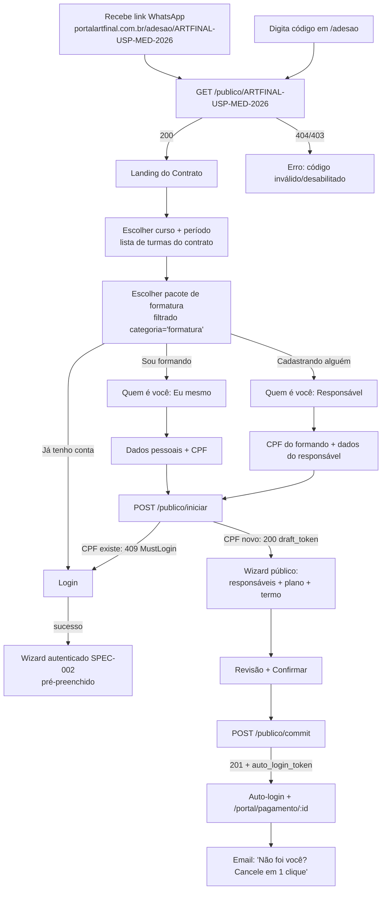

# SPEC-010 — Adesão pública via código do contrato

> **Spec unificada backend + frontend.** Permite que um formando novo inicie sua adesão **sem login prévio**, digitando um código humano-legível do **contrato** (ex: `ARTFINAL-USP-MED-2026`). Após validar o código, o wizard inclui uma **nova etapa de escolha de curso + período (turma)** dentro do contrato e uma etapa dedicada à **seleção de pacote da categoria `formatura`**. Formandos com conta existente são redirecionados para login (que pré-preenche o wizard). Cobre o cenário "pais de gêmeos" via integração com SPEC-F-003 (multi-formando).
>
> Origem: [`docs/superpowers/specs/2026-04-19-reorganizacao-specs-adesao-publica-design.md`](../superpowers/specs/2026-04-19-reorganizacao-specs-adesao-publica-design.md).
> Contexto de governança: [`docs/META/PROJECT-STATUS.md`](../META/PROJECT-STATUS.md) — `status: desenvolvimento`, breaking changes permitidos.

---

## 0. Resumo executivo

> **Nota — Condição Composta (SPEC-011):** A etapa de pagamento agora suporta um 4º card "Boleto + Cartão" que aparece quando o contrato tem condições com `tipo='composta'`. Nesse modo, o payload de simular/commit envia apenas `condicao_ulid` + `dia_vencimento` (qtd e métodos são derivados pelo backend). Detalhes em [SPEC-011](./SPEC-011-condicao-pagamento-composta.md).

Pessoa recebe link `https://portalartfinal.com.br/adesao/ARTFINAL-USP-MED-2026` (ou digita o código em `/adesao`). Backend valida o código no escopo dos **contratos** (não mais turmas), retorna Contrato + **turmas disponíveis** (curso + período) + **pacotes de categoria `formatura`** + condições de pagamento + termo vigente. O wizard público agora inclui duas etapas novas antes da identificação do solicitante:

1. **Escolher curso + período** — formando seleciona 1 turma entre as disponíveis do contrato.
2. **Escolher pacote de formatura** — lista filtrada por `categoria='formatura'`; permite exatamente 1 seleção.

Na etapa "Quem é você" (antigo etapa 0), pergunta se é o próprio formando ou se está cadastrando outra pessoa. Na etapa seguinte (dados pessoais), CPF é validado contra PortalUsers existentes: se CPF novo, sistema emite `draft_token` JWT (HS256, TTL 48h) que carrega o wizard adiante sem sessão. Etapas posteriores reaproveitam o wizard do SPEC-002 refatorado, com endpoints paralelos em `/api/v1/adesao/publico/*` e header `X-Adesao-Draft-Token`. Etapa final comita atomicamente: cria `PortalUser + Formando + Adesão + Parcelas + AceiteTermo` em uma transação, emite auto-login token (15min, uso único) e redireciona para `/portal/pagamento/:intent_id`. Email transacional dispara com link "não fui eu" (cancelamento 1-clique em 72h).

---

## 1. Visão da feature

### 1.1 Jornada macro



### 1.2 Atores

| Ator                         | Ação                                                                             |
| ---------------------------- | -------------------------------------------------------------------------------- |
| Formando maior de idade novo | Fluxo completo sem login; escolhe turma+pacote; cria PortalUser próprio          |
| Pai/mãe cadastrando filho    | Etapa "Quem é você" → "cadastrando outra pessoa"; PortalUser=pai, Formando=filho |
| Formando existente           | Redirecionado via `409 MustLogin` para login e depois fluxo SPEC-002             |
| Comissão                     | Divulga link/código do contrato no WhatsApp, acompanha adesões via admin         |
| Admin                        | Define/regenera `codigo_acesso` do **contrato** (não mais da turma)              |

### 1.3 Valor

- **Conversão**: remove fricção de cadastro prévio; formando novo pode aderir em <5 min
- **Distribuição**: WhatsApp vira canal primário via link compartilhável
- **Multi-formando**: pais de gêmeos fazem 2 adesões com 1 conta (mesmo contrato ou contratos diferentes)
- **Segurança**: CPFs existentes forçados a login (anti-sequestro de identidade)
- **Flexibilidade acadêmica**: 1 contrato agrupa várias turmas (curso + período) — ex.: Medicina 2026-1 e Medicina 2026-2 sob "ARTFINAL-USP-MED-2026"

### 1.4 Escopo

**In:**

- Landing pública via **código do contrato** (URL + formulário)
- **Escolha de turma (curso + período)** dentro do contrato — nova etapa
- **Filtro de pacote por categoria `formatura`** — nova etapa
- Etapa "Quem é você"
- Wizard público (identificação, responsáveis, plano, termo, revisão) paralelo ao SPEC-002
- Commit atômico criando `PortalUser + Formando + Adesão + Parcelas + AceiteTermo`
- Auto-login pós-commit
- Email de confirmação com cancelamento 1-clique
- Admin: CRUD do `codigo_acesso` do contrato

**Out:**

- Categoria `extra` (convites, mesas premium, combos) no fluxo público — só aparece no portal autenticado após adesão concretizada (SPEC futura)
- Regeneração do código invalidando adesões em curso (não invalidamos — ver §9 OQ-2)
- Transferência de titularidade pós-commit (admin manual)
- Seletor completo de formando no portal (faz parte de SPEC-F-003 / SPEC-001 refactor)
- Login social ou OTP (v2+)

---

## 2. Contratos de API

> **Nota:** esta seção assume que os endpoints `contrato`-orientados do SPEC-002 refatorado já existem. Esta spec apenas adiciona/ajusta o **bloco público**.

### 2.1 `GET /api/v1/adesao/publico/{codigo-contrato}` — resolver código

- **Route name:** `api.v1.publico.adesao.show`
- **Middlewares:** `throttle:adesao-publica-show` (10/min/IP)
- **Auth:** nenhum

**Path params:**

- `codigo-contrato` — VARCHAR até 32, regex `^[A-Za-z0-9-]{4,32}$` (case-insensitive na lookup)

**Response 200:**

```json
{
    "data": {
        "contrato": {
            "ulid": "01J...",
            "codigo_acesso": "ARTFINAL-USP-MED-2026",
            "nome": "Formatura Medicina USP 2026",
            "categoria": "formatura",
            "status": "ativo",
            "data_fim_adesao": "2026-06-30",
            "exige_responsavel_cadastro": false,
            "exige_responsavel_financeiro": true,
            "permite_formando_resp_cadastro": true,
            "permite_formando_resp_financeiro": true,
            "instituicao": { "ulid": "01J...", "nome": "USP" }
        },
        "turmas_disponiveis": [
            {
                "ulid": "01J...",
                "curso": { "ulid": "01J...", "nome": "Medicina", "codigo": "MED" },
                "ano_formatura": 2026,
                "semestre_formatura": 1,
                "rotulo": "Medicina USP 2026/1"
            },
            {
                "ulid": "01J...",
                "curso": { "ulid": "01J...", "nome": "Medicina", "codigo": "MED" },
                "ano_formatura": 2026,
                "semestre_formatura": 2,
                "rotulo": "Medicina USP 2026/2"
            }
        ],
        "pacotes_formatura": [
            {
                "ulid": "01J...",
                "nome": "Pacote Premium",
                "preco_vigente_centavos": 1500000,
                "beneficios": ["Jantar", "Open bar", "Fotos oficiais"],
                "programacao_ulid": "01J..."
            },
            {
                "ulid": "01J...",
                "nome": "Pacote Essencial",
                "preco_vigente_centavos": 950000,
                "beneficios": ["Jantar", "Fotos oficiais"],
                "programacao_ulid": "01J..."
            }
        ],
        "condicoes_pagamento": [
            {
                "ulid": "01J...",
                "nome": "À vista PIX",
                "metodos_permitidos": ["pix"],
                "qtd_parcelas_min": 1,
                "qtd_parcelas_max": 1,
                "desconto_percentual": 10,
                "acrescimo_percentual": 0
            },
            {
                "ulid": "01J...",
                "nome": "Boleto 6-10x",
                "metodos_permitidos": ["boleto"],
                "qtd_parcelas_min": 6,
                "qtd_parcelas_max": 10,
                "desconto_percentual": 0,
                "acrescimo_percentual": 0
            },
            {
                "ulid": "01J...",
                "nome": "Cartão parcelado 11-12x",
                "metodos_permitidos": ["cartao"],
                "qtd_parcelas_min": 11,
                "qtd_parcelas_max": 12,
                "desconto_percentual": 0,
                "acrescimo_percentual": 3
            }
        ],
        "termo_vigente": {
            "ulid": "01J...",
            "versao": "v2026-01"
        }
    }
}
```

> **Mudanças estruturais vs v1:**
>
> - Bloco `turma` (singular, top-level) removido — agora `turmas_disponiveis[]` (array).
> - Bloco `categorias[]` aninhado foi removido. Estrutura plana:
>   `pacotes_formatura[]` (já filtrado por `categoria='formatura'`) + `condicoes_pagamento[]` (do contrato, via SPEC-F-005).
> - `eventos_disponiveis[]` removido (acesso via `contrato.evento_id` quando já vinculado; não faz parte do fluxo público inicial).
> - `contrato.codigo_acesso` agora é campo de primeira classe.

**Erros:**

| HTTP | error                          | Causa                                                       |
| ---- | ------------------------------ | ----------------------------------------------------------- |
| 404  | `ContratoNaoEncontrado`        | Código não existe                                           |
| 403  | `AdesaoPublicaDesabilitada`    | `contrato.adesao_publica_ativa = false`                     |
| 403  | `ContratoIndisponivel`         | `contrato.status != 'ativo'`                                |
| 403  | `AdesaoPublicaEncerrada`       | `contrato.data_fim_adesao < hoje`                           |
| 412  | `ContratoSemTurmasDisponiveis` | Nenhuma turma ativa vinculada — orienta contatar a comissão |
| 429  | `RateLimitExceeded`            | > 10 validações/min/IP                                      |

---

### 2.2 `POST /api/v1/adesao/publico/{codigo-contrato}/iniciar` — emitir draft

- **Route name:** `api.v1.publico.adesao.iniciar`
- **Middlewares:** `throttle:adesao-publica-iniciar` (5/min/IP)
- **Auth:** nenhum

**Body:**

```json
{
    "tipo_solicitante": "proprio",
    "cpf_formando": "123.456.789-09",
    "turma_ulid": "01J...",
    "pacote_ulid": "01J..."
}
```

**Validação:**

- `tipo_solicitante` → `required|in:proprio,responsavel`
- `cpf_formando` → `required|cpf` (valida mod 11 via `laravellegends/pt-br-validator`)
- `turma_ulid` → `required|string|size:26` — **obrigatório**; precisa pertencer ao contrato resolvido pelo código
- `pacote_ulid` → `required|string|size:26` — **obrigatório**; precisa pertencer ao contrato + ter `categoria='formatura'`

> **Por que turma e pacote são obrigatórios no `/iniciar`?**
> O fluxo frontend confirma as escolhas antes do CPF. Exigir ambos reduz tempo de simulação (o backend já pode indexar pacote+programação) e simplifica as claims do draft_token.

**Response 200 (CPF novo):**

```json
{
    "data": {
        "draft_token": "eyJ0eXAiOiJKV1QiLCJh...",
        "expires_at": "2026-04-25T15:00:00-03:00"
    }
}
```

**Response 409 (CPF já tem PortalUser):**

```json
{
    "error": "MustLogin",
    "message": "Este CPF já possui conta no portal.",
    "details": {
        "login_hint": "j***@gmail.com"
    }
}
```

**Response 422 (validação):**

```json
{
    "error": "ValidationError",
    "details": {
        "fields": {
            "cpf_formando": ["CPF inválido."],
            "turma_ulid": ["Turma escolhida não pertence ao contrato."],
            "pacote_ulid": ["Pacote indisponível nesta categoria."]
        }
    }
}
```

**Outros erros:** `404 ContratoNaoEncontrado`, `403 AdesaoPublicaDesabilitada`, `429 RateLimitExceeded`.

**Estrutura do draft_token (JWT HS256, TTL 48h):**

```json
{
    "sub": "adesao_draft",
    "contrato_ulid": "01J...",
    "turma_ulid": "01J...",
    "pacote_ulid": "01J...",
    "tipo_solicitante": "proprio",
    "cpf_hash": "sha256(cpf_formando)",
    "iat": 1712345678,
    "exp": 1712518478,
    "jti": "01J..."
}
```

> **Nota sobre as claims:**
> As três claims `contrato_ulid`, `turma_ulid` e `pacote_ulid` são obrigatórias desde a emissão do token. Qualquer mudança dessas três amarras durante o wizard (p.ex., trocar de turma no meio do caminho) requer novo `POST /iniciar` — não há mutação silenciosa. Essa escolha arquitetural evita reemissão mid-wizard e mantém o contrato claims-imutáveis até o commit.

Segredo: `DRAFT_TOKEN_SECRET` (separado de `APP_KEY`). Revogação via set Redis `draft_token:revoked:{jti}`.

---

### 2.3 `POST /api/v1/adesao/publico/simular` — simular parcelamento

- **Route name:** `api.v1.publico.adesao.simular`
- **Middlewares:** `throttle:adesao-publica-simular` (20/min/IP), `ResolveAdesaoContext`
- **Header obrigatório:** `X-Adesao-Draft-Token`

**Body:**

```json
{
    "turma_ulid": "01J...",
    "pacote_ulid": "01J...",
    "qtd_parcelas": 10,
    "metodo_primeira_parcela": "pix",
    "metodo_demais": "boleto",
    "data_vencimento_dia": 5,
    "cupom": null
}
```

**Validação:**

- `turma_ulid` e `pacote_ulid` → `required`; devem coincidir com claims do draft_token.
- `qtd_parcelas` → `required|integer|min:1|max:12`
- `metodo_primeira_parcela` → `required|in:pix,boleto,cartao`
- `metodo_demais` → `required_if:qtd_parcelas,>,1|in:boleto,cartao` (**PIX bloqueado em parcelas subsequentes**)
- `data_vencimento_dia` → `required|integer|min:1|max:28`
- `cupom` → `nullable|string|max:32`

**Regras de negócio por método (validação de combinação, alinhadas com SPEC-F-005 / SPEC-F-006):**

| Método 1ª parcela   | Qtd parcelas | Regra                                        |
| ------------------- | ------------ | -------------------------------------------- |
| `pix`               | 1            | À vista; desconto -10%; demais proibido      |
| `pix`               | > 1          | **422** — PIX exige `qtd_parcelas=1`         |
| `boleto`            | 1-12         | 1x -10%, 2-5x -5%, 6-10x 0%, 11-12x +3%      |
| `cartao`            | 2-12         | Mínimo 2x; 2-5x -5%, 6-10x 0%, 11-12x +3%    |
| `cartao`            | 1            | **422** — cartão exige `qtd_parcelas>=2`     |
| `metodo_demais=pix` | qualquer     | **422** — PIX bloqueado para demais parcelas |

**Response 200:** idêntico a SPEC-002 §2.4, integrando SPEC-F-006 (cálculo dinâmico com programações e descontos).

---

### 2.4 `POST /api/v1/adesao/publico/commit` — commit atômico

- **Route name:** `api.v1.publico.adesao.commit`
- **Middlewares:** `throttle:adesao-publica-commit` (3/min/IP), `ResolveAdesaoContext`, `EnsureIdempotency`
- **Headers obrigatórios:** `X-Adesao-Draft-Token`, `X-Idempotency-Key`, `X-Request-Id`

**Body:**

```json
{
    "contrato_ulid": "01J...",
    "turma_ulid": "01J...",
    "pacote_ulid": "01J...",
    "formando": {
        "cpf": "123.456.789-09",
        "nome": "João Silva",
        "data_nascimento": "2006-05-10",
        "email": "joao@email.com",
        "telefone": "+55 11 98765-4321"
    },
    "solicitante": {
        "cpf": "098.765.432-11",
        "nome": "Maria Silva",
        "email": "maria@email.com",
        "telefone": "+55 11 98765-4322",
        "vinculo": "mae"
    },
    "responsavel_cadastro": {
        "mesmo_formando": false,
        "reutilizar_solicitante": true
    },
    "responsavel_financeiro": {
        "mesmo_formando": false,
        "reutilizar_solicitante": true
    },
    "plano": {
        "qtd_parcelas": 10,
        "metodo_primeira_parcela": "pix",
        "metodo_demais": "boleto",
        "data_vencimento_dia": 5,
        "cupom": null
    },
    "aceitou_termos": true,
    "termo_contrato_ulid": "01J..."
}
```

> Quando `tipo_solicitante = proprio`: `formando.cpf = solicitante.cpf`; bloco `solicitante` pode ser omitido (backend infere do próprio formando).

**Validações principais:**

- `contrato_ulid` + `turma_ulid` + `pacote_ulid` do payload == claims do draft_token → impede troca mid-wizard das 3 amarras.
- `turma_ulid` precisa pertencer ao `contrato_ulid` (FK coerente).
- `pacote_ulid` precisa pertencer ao `contrato_ulid` e ter `categoria='formatura'`.
- `cpf_hash(formando.cpf)` == claims do draft_token → impede troca mid-wizard do CPF.
- CPF do formando ainda não tem PortalUser (recheck para evitar race) — se tiver: `409 CpfJaRegistrado`
- CPF do formando não tem outra adesão ativa no mesmo contrato — se tiver: `409 AdesaoJaExistente`
- Se `tipo_solicitante = responsavel`: formando precisa ter < 18 anos OU contrato permitir responsável sempre
- `termo_contrato_ulid` == termo_vigente do contrato — se não: `409 TermoVersaoDesatualizada`

**Response 201:**

```json
{
    "data": {
        "adesao": {
            /* AdesaoResource completo */
        },
        "auto_login_token": "sanctum_token_abc...",
        "auto_login_expires_at": "2026-04-23T15:15:00-03:00",
        "pagamento_intent": { "id": "01J...", "ulid_parcela": "01J..." }
    }
}
```

**Fluxo atômico (transação):**

1. Validar `draft_token` + `cpf_hash` + idempotency
2. Recheck CPF não tem PortalUser (SELECT FOR UPDATE na tabela, sem criar)
3. Recheck `contrato.adesao_publica_ativa = true` e `contrato.data_fim_adesao >= hoje`
4. Criar `PortalUser { cpf, nome, email, senha: null, status: 'incompleto' }`
5. Criar/vincular `Formando { portal_user_id, turma_id: turma_ulid escolhido, cpf, nome, vinculo }`
6. Se solicitante ≠ formando: criar `portal_user_formandos` pivô
7. Criar `Adesao { portal_user_id, formando_id, contrato_id, turma_id, pacote_id, origem: 'publica_codigo_contrato', status: 'pendente_pagamento', responsáveis snapshot, calculo_snapshot }`
8. Criar `Parcelas` via `CalcularPlanoParcelasAction`
9. Criar `AceiteTermo` (SPEC-F-007)
10. Revogar `draft_token.jti` (Redis set)
11. Emitir `auto_login_token` Sanctum (ability `portal:read portal:write`, expires 15min, bound ao IP+UA)
12. Criar `PagamentoIntent` via `F-009` para 1ª parcela
13. Enfileirar jobs: `EnviarEmailAtivacaoAdesaoJob` (com link "não fui eu"), `ConsolidarTermoPdfJob`
14. Log auditoria (SPEC-F-011)

**Erros principais:**

| HTTP | error                         | Ação UX                                     |
| ---- | ----------------------------- | ------------------------------------------- |
| 401  | `DraftTokenInvalido`          | Reset store + pedir código novamente        |
| 401  | `DraftTokenExpirado`          | Idem                                        |
| 422  | `CpfTrocadoMidWizard`         | Volta etapa 1 com mensagem                  |
| 422  | `TurmaNaoPertenceAoContrato`  | Volta etapa "Escolher turma"                |
| 422  | `PacoteNaoPertenceAoContrato` | Volta etapa "Escolher pacote"               |
| 409  | `CpfJaRegistrado`             | Abre login com hint                         |
| 409  | `AdesaoJaExistente`           | Redireciona para `/portal/home` (se logar)  |
| 409  | `IdempotencyConflict`         | Retry automático 1× com mesma chave         |
| 409  | `TermoVersaoDesatualizada`    | Volta etapa de termo carregando nova versão |
| 422  | `ValidationError`             | Inline errors via `details.fields`          |

---

### 2.5 Bloco admin

#### `PATCH /api/v1/admin/contratos/{contrato:ulid}/codigo-acesso`

- **Middleware:** `auth:admin` + `can:manage,contrato`

**Body:**

```json
{ "codigo": "ARTFINAL-USP-MED-2026" }
// ou
{ "generate": true }
```

**Validação:**

- Formato: `^[A-Z0-9-]{4,32}$`
- Unicidade global (CITEXT + regex; índice funcional `UPPER(codigo_acesso)`)
- Se `generate: true`: sistema gera `ARTFINAL-{INSTITUICAO_ABBR}-{CURSO_ABBR}-{ANO}` + sufixo aleatório de 4 chars se houver colisão.
- **Mudança vs v1:** rota move de `turmas/{turma:ulid}/codigo-acesso` para `contratos/{contrato:ulid}/codigo-acesso`. Mesma lógica, entidade diferente.

**Response 200:** retorna contrato atualizado + URL pública gerada.

#### `DELETE /api/v1/admin/contratos/{contrato:ulid}/codigo-acesso`

Remove código (seta `null`) e desabilita adesão pública.

#### `PATCH /api/v1/admin/contratos/{contrato:ulid}/adesao-publica`

```json
{ "ativa": true } // ou false
```

---

## 3. Data Model

### 3.1 Alterações em tabelas existentes

**`contratos`** (decisão 2026-04-23 — ver SPEC-F-001 §2.1):

```php
$table->string('codigo_acesso', 32)->nullable()->unique();  // movido de turmas
$table->boolean('adesao_publica_ativa')->default(true);     // movido de turmas
// Índice funcional para lookup case-insensitive (PostgreSQL)
// CREATE INDEX contratos_codigo_acesso_upper_idx ON contratos (UPPER(codigo_acesso));
```

**`turmas`** (inversão da hierarquia):

```php
// REMOVIDO desta tabela:
$table->dropColumn(['codigo_acesso', 'adesao_publica_ativa']);
// ADICIONADO: FK para contrato (NOT NULL — turma só existe dentro de um contrato)
$table->foreignId('contrato_id')->constrained('contratos');
```

**`pacotes`** (nova coluna — filtro do wizard público):

```php
$table->string('categoria', 30)->default('formatura');      // enum: 'formatura' | 'extra'
$table->index(['contrato_id', 'categoria']);
```

**`adesoes`** (refactor do SPEC-002 + inversão):

```php
$table->foreignId('portal_user_id')->nullable()->change();   // antes NOT NULL
$table->foreignId('contrato_id')->constrained('contratos');  // NOT NULL (agregado raiz)
$table->foreignId('turma_id')->constrained('turmas');        // NOT NULL (escolha do formando)
$table->dropForeign('adesoes_evento_id_foreign');            // remover (deprecated)
$table->dropColumn('evento_id');                             // derivado via contrato.evento_id
$table->string('draft_token_hash', 64)->nullable();          // auditoria do token usado
$table->string('origem_adesao', 30)->default('autenticada'); // enum
```

### 3.2 Enums novos

```php
enum OrigemAdesao: string
{
    case AUTENTICADA              = 'autenticada';
    case PUBLICA_CODIGO_CONTRATO  = 'publica_codigo_contrato';
    case ADMIN_MANUAL             = 'admin_manual';
}

enum TipoSolicitante: string
{
    case PROPRIO      = 'proprio';
    case RESPONSAVEL  = 'responsavel';
}
```

> **Mudança vs v1:** case `PUBLICA_CODIGO_TURMA` renomeado para `PUBLICA_CODIGO_CONTRATO` (string no banco também).

### 3.3 Claims JWT do `draft_token`

| Claim              | Tipo      | Origem                                        | Obrigatoriedade |
| ------------------ | --------- | --------------------------------------------- | --------------- |
| `sub`              | string    | constante `"adesao_draft"`                    | sempre          |
| `contrato_ulid`    | string    | resolução do código no `GET /publico/:codigo` | sempre          |
| `turma_ulid`       | string    | escolha de curso + período no frontend        | sempre          |
| `pacote_ulid`      | string    | escolha de pacote formatura                   | sempre          |
| `tipo_solicitante` | enum      | etapa "Quem é você"                           | sempre          |
| `cpf_hash`         | sha256    | hash do CPF do formando                       | sempre          |
| `iat`              | timestamp | emissão                                       | sempre          |
| `exp`              | timestamp | `iat + DRAFT_TOKEN_TTL_SECONDS` (48h)         | sempre          |
| `jti`              | ULID      | identificador único p/ revogação Redis        | sempre          |

### 3.4 Portal user pós-commit público

Criado com estes defaults:

```php
PortalUser::create([
    'cpf'      => $formando['cpf'],
    'nome'     => $formando['nome'],
    'email'    => $formando['email'],
    'password' => null,                // definido via email de ativação
    'status'   => 'incompleto',
    'email_verified_at' => null,
]);
```

Job `EnviarEmailAtivacaoAdesaoJob` envia link `/ativar-conta/:token` (TTL 7 dias) para definir senha.

---

## 4. Backend — arquivos a criar/modificar

### 4.1 Criar novos

| Arquivo                                                                     | Responsabilidade                                                                                      |
| --------------------------------------------------------------------------- | ----------------------------------------------------------------------------------------------------- |
| `app/Actions/Adesao/ResolveContratoPorCodigoAction.php`                     | Resolve código → contrato ativo + turmas_disponiveis + pacotes_formatura                              |
| `app/Actions/Adesao/IniciarAdesaoPublicaAction.php`                         | Valida CPF + turma+pacote pertencem ao contrato, detecta `MustLogin`, emite draft_token               |
| `app/Actions/Adesao/CommitAdesaoPublicaAction.php`                          | Transação atômica (§2.4 passos 1-14)                                                                  |
| `app/Http/Controllers/Api/V1/Publico/AdesaoPublicaController.php`           | show, iniciar, simular, commit                                                                        |
| `app/Http/Controllers/Api/V1/Admin/ContratoCodigoAcessoController.php`      | PATCH/DELETE do código no contrato (mudança: antes era `TurmaCodigoAcessoController`)                 |
| `app/Http/Middleware/ResolveAdesaoContext.php`                              | Auth sanctum OU draft_token → `$request->attributes['adesao_context']`                                |
| `app/Http/Middleware/ValidateDraftTokenBindings.php`                        | Valida hash(cpf), jti revogação, TTL, match de `contrato_ulid`/`turma_ulid`/`pacote_ulid` com payload |
| `app/Http/Requests/Api/V1/Publico/IniciarAdesaoPublicaRequest.php`          | Valida `turma_ulid` pertence ao contrato; `pacote_ulid` pertence ao contrato + `categoria=formatura`  |
| `app/Http/Requests/Api/V1/Publico/SimularAdesaoPublicaRequest.php`          | Inclui regras por método (PIX=1x, cartão>=2x, PIX bloqueado em demais)                                |
| `app/Http/Requests/Api/V1/Publico/CommitAdesaoPublicaRequest.php`           | Validação cruzada `contrato_ulid`/`turma_ulid`/`pacote_ulid` vs claims                                |
| `app/Services/Adesao/DraftTokenService.php`                                 | encode/decode JWT HS256 + revocation Redis                                                            |
| `app/Data/Adesao/DraftTokenClaims.php`                                      | readonly DTO (spatie/laravel-data)                                                                    |
| `app/Data/Adesao/ContratoPublicoData.php`                                   | Response DTO de GET /publico/{codigo-contrato}                                                        |
| `app/Data/Adesao/TurmaResumoData.php`                                       | DTO de turma no array `turmas_disponiveis[]`                                                          |
| `app/Data/Adesao/PacoteFormaturaData.php`                                   | DTO de pacote no array `pacotes_formatura[]`                                                          |
| `app/Exceptions/Adesao/MustLoginException.php`                              | 409 com login_hint mascarado                                                                          |
| `app/Exceptions/Adesao/DraftTokenExpiradoException.php`                     | 401                                                                                                   |
| `app/Exceptions/Adesao/CpfTrocadoMidWizardException.php`                    | 422                                                                                                   |
| `app/Exceptions/Adesao/TurmaNaoPertenceAoContratoException.php`             | 422                                                                                                   |
| `app/Exceptions/Adesao/PacoteNaoPertenceAoContratoException.php`            | 422                                                                                                   |
| `app/Exceptions/Adesao/TermoVersaoDesatualizadaException.php`               | 409                                                                                                   |
| `app/Exceptions/Adesao/ContratoSemTurmasDisponiveisException.php`           | 412                                                                                                   |
| `app/Enums/Adesao/OrigemAdesao.php`                                         | `AUTENTICADA`, `PUBLICA_CODIGO_CONTRATO`, `ADMIN_MANUAL`                                              |
| `app/Enums/Adesao/TipoSolicitante.php`                                      |                                                                                                       |
| `app/Enums/Pacotes/CategoriaPacote.php`                                     | `FORMATURA`, `EXTRA`                                                                                  |
| `database/migrations/XXXX_invert_contrato_turma_hierarchy.php`              | Adiciona `contrato_id` em `turmas`, remove `turma_id` de `contratos`                                  |
| `database/migrations/XXXX_alter_contratos_add_codigo_acesso.php`            | Move colunas de `turmas` para `contratos`                                                             |
| `database/migrations/XXXX_alter_pacotes_add_categoria.php`                  | Nova coluna + índice                                                                                  |
| `database/migrations/XXXX_alter_adesoes_add_contrato_and_public_fields.php` | Adiciona `contrato_id` + `turma_id` (escolha) + `draft_token_hash` + `origem_adesao`                  |
| `routes/api/v1.php`                                                         | Novos endpoints sob prefix `adesao/publico/{codigo-contrato}`                                         |
| `config/services.php`                                                       | `draft_token_secret`, TTL, rate limit configs                                                         |

### 4.2 Testes

| Arquivo                                                      | Cenários                                                                                                                                                                                                                                                                                                                                                    |
| ------------------------------------------------------------ | ----------------------------------------------------------------------------------------------------------------------------------------------------------------------------------------------------------------------------------------------------------------------------------------------------------------------------------------------------------- |
| `tests/Feature/Api/V1/Publico/ValidarCodigoContratoTest.php` | 6 cenários: código válido, código inválido (404), contrato com `adesao_publica_ativa=false` (403), case-insensitive, rate limit, contrato encerrado (403).                                                                                                                                                                                                  |
| `tests/Feature/Api/V1/Publico/EscolherTurmaTest.php`         | 3 cenários: turma pertence ao contrato (200 no `/iniciar`), turma não pertence (422 `TurmaNaoPertenceAoContrato`), contrato sem turmas cadastradas retorna 412 `ContratoSemTurmasDisponiveis` já no `GET /publico/:codigo`.                                                                                                                                 |
| `tests/Feature/Api/V1/Publico/EscolherPacoteTest.php`        | 3 cenários: pacote formatura pertence ao contrato, pacote de `categoria='extra'` rejeitado (422), pacote de outro contrato rejeitado (422).                                                                                                                                                                                                                 |
| `tests/Feature/Api/V1/Publico/IniciarAdesaoPublicaTest.php`  | 6 cenários: CPF novo emite token com 3 claims, CPF existe 409 com hint mascarado, CPF inválido 422, rate limit, turma de outro contrato 422, pacote extra rejeitado 422.                                                                                                                                                                                    |
| `tests/Feature/Api/V1/Publico/SimularAdesaoPublicaTest.php`  | 7 cenários: simulação OK boleto 10x, sem header 401, token expirado 401, cálculo com desconto PIX 1x -10%, cartão 1x rejeitado 422, PIX em demais rejeitado 422, boleto 12x com +3%.                                                                                                                                                                        |
| `tests/Feature/Api/V1/Publico/CommitAdesaoPublicaTest.php`   | 14 cenários: commit tipo proprio, commit tipo responsavel, pais de gêmeos mesmo contrato, pais de gêmeos contratos distintos, CPF race (2 requests simultâneos), idempotência duplo submit, CPF trocado mid-wizard, turma trocada mid-wizard, pacote trocado mid-wizard, termo desatualizado, idade < 18, formando ≥18 próprio, cupom inválido, rate limit. |
| `tests/Unit/Services/DraftTokenServiceTest.php`              | 7 cenários: encode/decode completo (3 ulids), assinatura inválida, expiração, revogação via jti, claim cpf_hash imutável, secret errado, claims faltando `pacote_ulid`.                                                                                                                                                                                     |
| `tests/Feature/Admin/ContratoCodigoAcessoTest.php`           | 6 cenários: define, regenera com formato `ARTFINAL-{INST}-{CURSO}-{ANO}`, remove (desabilita), unicidade global, apenas admin autorizado, regex inválido 422.                                                                                                                                                                                               |

Cobertura alvo: `CommitAdesaoPublicaAction` 100% · `DraftTokenService` 100% · `ResolveAdesaoContext` 100% · global ≥ 70%.

---

## 5. Frontend — arquivos a criar/modificar

### 5.1 Criar novos

```
resources/spa/src/
├── routes/adesao/
│   ├── index.tsx                                ← /adesao (formulário de código)
│   └── $codigo.tsx                              ← /adesao/ARTFINAL-USP-MED-2026 (landing do contrato)
├── components/adesao-publica/
│   ├── codigo-contrato-form.tsx                 ← input de código + submit
│   ├── contrato-landing.tsx                     ← header com nome/instituição + CTA "começar"
│   ├── escolher-turma-step.tsx                  ← NOVO — lista turmas_disponiveis, seleção única
│   ├── escolher-pacote-step.tsx                 ← NOVO — lista pacotes_formatura, seleção única
│   ├── quem-e-voce-step.tsx                     ← Etapa "Quem é você"
│   ├── must-login-dialog.tsx                    ← Modal 409 MustLogin
│   └── prefill-toast.tsx                        ← Após login: "Seus dados foram preenchidos"
├── stores/adesao-publica-store.ts               ← persist sessionStorage; campos: contrato_ulid, turma_ulid, pacote_ulid
├── api/hooks/use-adesao-publica.ts              ← hooks: useContratoPublico, useIniciarPublico, useSimularPublico, useCommitPublico, useAdminCodigoContrato
├── forms/adesao/
│   ├── codigo.schema.ts                         ← regex ^[A-Z0-9-]{4,32}$
│   ├── escolher-turma.schema.ts                 ← turma_ulid required + ULID válido
│   ├── escolher-pacote.schema.ts                ← pacote_ulid required + ULID válido
│   ├── quem-e-voce.schema.ts                    ← tipo_solicitante
│   ├── dados-formando.schema.ts                 ← cpf + nome + email + data_nascimento
│   └── plano-pagamento.schema.ts                ← com regras cross-field método↔parcelas
└── lib/draft-token.ts                           ← decode claims (client-side), validate exp
```

**Hook principal** — `useContratoPublico(codigo)`:

- Input: `codigo: string`
- Output: `ContratoPublicoData` (contrato + turmas_disponiveis[] + pacotes_formatura[] + condicoes_pagamento[] + termo_vigente)
- Erro: trata 404/403/412 com mensagens específicas (ex.: contrato sem turmas → "Contrato ainda não tem turmas disponíveis; contate a comissão").

**Store `adesao-publica-store`** — campos (persist em sessionStorage):

```ts
type AdesaoPublicaStore = {
    codigo_contrato: string | null;
    contrato_ulid: string | null;
    turma_ulid: string | null;
    pacote_ulid: string | null;
    tipo_solicitante: 'proprio' | 'responsavel' | null;
    draft_token: string | null;
    draft_token_exp: number | null;
    // ... (form data por etapa)
    setContrato: (c: ContratoPublicoData) => void;
    setTurma: (ulid: string) => void;
    setPacote: (ulid: string) => void;
    reset: () => void;
};
```

### 5.2 Modificar

- `resources/spa/src/components/wizard/wizard-shell.tsx` → aceitar prop `mode: 'autenticado' | 'publico'` + mapa de etapas que inclui `escolher-turma`, `escolher-pacote`.
- `resources/spa/src/api/client.ts` → interceptor que injeta `X-Adesao-Draft-Token` se store tiver token ativo.
- `resources/spa/src/stores/wizard-store.ts` → estender com `mode`, `contratoUlid`, `turmaUlid`, `pacoteUlid`, `draftToken`.
- `resources/spa/src/routes/__root.tsx` → adicionar rota `/adesao/$codigo` pública (sem auth guard).

### 5.3 Testes frontend

- `tests/unit/adesao-publica-store.test.ts` — persist, migração de token expirado, reset ao trocar de contrato.
- `tests/unit/escolher-turma-schema.test.ts` — validação Zod cross-field com lista disponível.
- `tests/unit/escolher-pacote-schema.test.ts` — rejeita pacotes `categoria='extra'`.
- `tests/integration/fluxo-publico.test.tsx` — happy path sem login (MSW); happy path com login; 409 MustLogin → dialog; 401 → recovery; 412 contrato sem turmas → erro amigável.
- `tests/e2e/adesao-via-codigo-contrato.spec.ts` — 4 specs: URL direta + escolher turma + escolher pacote + wizard + commit + auto-login + pagamento; formulário + código; pais de gêmeos (2 commits no mesmo contrato com turmas diferentes); pais de gêmeos (2 commits em contratos distintos).

---

## 6. Segurança

| Risco                      | Mitigação                                                                                                                     |
| -------------------------- | ----------------------------------------------------------------------------------------------------------------------------- |
| Enumeração de códigos      | Rate limit 10/min/IP em GET; alerta Sentry > 100 404s/h; índice funcional `UPPER(codigo_acesso)`                              |
| Enumeração de CPFs         | 409 MustLogin retorna login_hint mascarado; rate limit 5/min                                                                  |
| Token theft (draft_token)  | JWT liga `contrato_ulid` + `turma_ulid` + `pacote_ulid` + `cpf_hash`; troca de qualquer claim = 422; jti Redis para revogação |
| Replay de commit           | Idempotency Key obrigatório (TTL 24h Redis)                                                                                   |
| SQL injection via código   | FormRequest regex + Eloquent binding                                                                                          |
| Google indexar `/adesao/*` | `robots.txt` disallow + `<meta name="robots" content="noindex">`                                                              |
| Adesão fantasma (abandono) | Job noturno cancela `pendente_pagamento` > 7d; PortalUser `incompleto` > 30d sem adesão = delete                              |
| draft_token na URL         | Nunca — sempre header `X-Adesao-Draft-Token`; sessionStorage local à tab                                                      |
| CSRF no auto-login         | Token 15min, uso único, bound ao IP+UA                                                                                        |
| Adesão sob coação          | Email imediato com link "não foi você? cancelar" válido 72h                                                                   |
| Rebind de turma/pacote     | Três ulids fazem parte do JWT — tentar alterar via request → 422                                                              |

---

## 7. Fluxos detalhados (complementam §1.1)

### 7.1 Fluxo A — Sem login (CPF novo)

Detalhado em [design doc §3.1](../superpowers/specs/2026-04-19-reorganizacao-specs-adesao-publica-design.md). Resumo:

1. Landing do contrato (`GET /publico/{codigo-contrato}`) — exibe nome do contrato, instituição, CTA "começar".
2. **Escolher curso + período** — lista `turmas_disponiveis[]`; seleção única; persiste `turma_ulid` na store.
    - Se o contrato tiver apenas 1 turma, a UI pode pular automaticamente (skip to next step com pré-seleção — ver OQ-OQ-NOVA-1).
3. **Escolher pacote de formatura** — lista `pacotes_formatura[]`; seleção única; persiste `pacote_ulid` na store.
4. **Quem é você** — próprio formando vs. cadastrando outra pessoa.
5. **Dados pessoais + CPF** — `POST /iniciar` com `{turma_ulid, pacote_ulid, cpf_formando, tipo_solicitante}`; retorna `draft_token`.
6. **Responsáveis** — cadastro (F-002) + financeiro; cada um pode ser formando/solicitante/outro.
7. **Plano de pagamento** — `POST /simular` em tempo real; aplica regras por método (§2.3).
8. **Termo** — aceite da versão vigente.
9. **Revisão** — checkpoint "você está aderindo a {contrato} / {curso} / {período} / {pacote}".
10. **Confirmar** — `POST /commit` atômico → auto-login → `/portal/pagamento/:intent_id`.
11. **Email pós-commit** — "Defina sua senha" + "Não foi você? Cancelar em 72h".

### 7.2 Fluxo B — Com login opcional (CPF existente)

1. Landing do contrato mostra CTA "Já tenho conta (login)".
2. Usuário clica → tela de login preserva `codigo_contrato`, `turma_ulid` (se já escolhido), `pacote_ulid` (se já escolhido) no state.
3. Após login bem-sucedido, SPA chama `GET /api/v1/me/perfil-adesao-publica?contrato_ulid=X`.
4. Response contém dados do PortalUser + formandos já vinculados + adesões neste contrato.
5. Se há adesão ativa neste contrato → redireciona para `/portal/home`.
6. Senão: pré-popula wizard-store e entra no fluxo SPEC-002 (autenticado).
    - Se formando já tinha `turma_ulid`/`pacote_ulid` escolhidos antes do login, são mantidos.
    - Se não, o wizard autenticado pede escolha de curso+período + pacote (mesmas etapas, mesmos componentes).

### 7.3 Fluxo C — Pais de gêmeos

Cenário típico: pai/mãe cadastra 2 filhos que podem estar no **mesmo contrato** (duas turmas — ex.: mesmo curso, semestres diferentes) ou em **contratos distintos** (cursos diferentes na mesma universidade).

Sequência de 2 commits usando a mesma conta:

```
1º commit (público, sem login):
   Acessa /adesao/ARTFINAL-USP-MED-2026
   Escolhe turma: Medicina USP 2026/1
   Escolhe pacote: Premium
   Quem é você: "Estou cadastrando outra pessoa" (tipo_solicitante=responsavel)
   Dados: formando=Pedro Silva (filho), solicitante=Maria Silva (mãe)
   Commit → cria PortalUser(Maria) + Formando(Pedro) vinculado a turma 2026/1
            + Adesão(Pedro no contrato MED-USP-2026)
   Auto-login como Maria

2º commit — mesmo contrato (autenticado, via SPEC-002):
   Maria, logada, vai em /portal/home → "+ Adicionar outro formando"
   Digita código ARTFINAL-USP-MED-2026 (mesmo contrato)
   Escolhe turma: Medicina USP 2026/2 (turma diferente, mesma família de curso)
   Escolhe pacote: Essencial
   Quem é você: "Estou cadastrando outra pessoa"
   Dados: formando=Joana Silva (filha)
   Commit → cria apenas Formando(Joana) + Adesão(Joana)
            PortalUser(Maria) já existe, apenas adiciona vínculo no pivô

Alternativa — contratos distintos (ex.: USP Medicina 2026 e USP Odonto 2027):
   Maria, logada, digita ARTFINAL-USP-ODONTO-2027 em vez de repetir o MED.
   Fluxo idêntico (contrato diferente, turma diferente).
```

---

## 8. Critérios de aceite (Gherkin PT-BR)

### CA-001 — Pessoa nova acessa via URL pública do contrato

```gherkin
Dado que recebi o link "portalartfinal.com.br/adesao/ARTFINAL-USP-MED-2026"
E que nunca tive conta no portal
Quando acesso a URL
Então vejo a landing do "Contrato Formatura Medicina USP 2026"
E vejo a instituição "USP"
E vejo o CTA "Começar minha adesão"
```

### CA-002 — Pessoa escolhe curso e período dentro do contrato

```gherkin
Dado que estou na landing do contrato "ARTFINAL-USP-MED-2026"
E o contrato tem 2 turmas disponíveis (Medicina 2026/1 e Medicina 2026/2)
Quando clico em "Começar minha adesão"
Então vejo a etapa "Escolher curso e período"
E vejo as 2 turmas listadas com rótulos claros
E preciso selecionar exatamente 1 para avançar
```

### CA-003 — Pessoa vê apenas pacotes da categoria formatura

```gherkin
Dado que já escolhi a turma "Medicina USP 2026/1"
E o contrato tem 3 pacotes cadastrados: "Premium" (formatura), "Essencial" (formatura), "Combo Mesa" (extra)
Quando avanço para a etapa "Escolher pacote"
Então vejo "Premium" e "Essencial"
E NÃO vejo "Combo Mesa"
E preciso selecionar exatamente 1 pacote para avançar
```

### CA-004 — Simulação respeita regras de pagamento por método

```gherkin
Cenário A: PIX à vista
  Dado que selecionei pacote "Premium" (R$ 15.000,00)
  Quando escolho método "PIX" e quantidade "1 parcela"
  Então a simulação retorna total com desconto de 10% (R$ 13.500,00)

Cenário B: Cartão parcelado mínimo
  Quando tento escolher método "Cartão" com "1 parcela"
  Então recebo erro 422 "Cartão exige 2 parcelas ou mais"

Cenário C: PIX bloqueado para demais parcelas
  Quando escolho "PIX" como método da 1ª parcela e "PIX" como método das demais
  E quantidade "3 parcelas"
  Então recebo erro 422 "PIX não é permitido para parcelas subsequentes"

Cenário D: Boleto 12x com acréscimo
  Quando escolho "Boleto" em 12 parcelas
  Então a simulação aplica acréscimo de +3% no total
```

### CA-005 — CPF já tem conta força login

```gherkin
Dado que já tenho conta no portal com CPF "123.456.789-09"
Quando acesso "/adesao/ARTFINAL-USP-MED-2026"
E escolho turma, pacote e clico "Sou formando"
E informo meu CPF na etapa de identificação
Então recebo modal "Este CPF já tem conta"
E vejo hint "j***@gmail.com"
E clico "Fazer login"
E sou redirecionado para "/login" preservando o contexto do contrato + turma + pacote
```

### CA-006 — Novo formando completa adesão sem login

```gherkin
Dado que nunca tive conta
Quando acesso "/adesao/ARTFINAL-USP-MED-2026"
E escolho turma, pacote e completo as etapas do wizard público
E na revisão confirmo a adesão
Então uma PortalUser é criada com status "incompleto"
E uma Adesão é criada com origem "publica_codigo_contrato"
E a Adesão aponta para o contrato_id correto E para o turma_id escolhido
E o Formando criado aponta para o turma_id escolhido
E sou auto-logada e redirecionada para "/portal/pagamento/:intent_id"
E recebo um email "Defina sua senha" e um email "Não foi você? Cancelar"
```

### CA-007 — Pais de gêmeos usam mesma conta (mesmo contrato)

```gherkin
Dado que completei adesão pública para meu filho João (turma Medicina 2026/1 no contrato ARTFINAL-USP-MED-2026)
E estou logada como Maria Silva
Quando acesso "/portal/home"
E clico em "+ Adicionar outro formando"
E digito "ARTFINAL-USP-MED-2026" (mesmo contrato)
E escolho turma "Medicina USP 2026/2" (turma diferente)
E completo o wizard para minha filha Joana
Então apenas um novo Formando é criado (Joana) sem duplicar PortalUser
E /portal/home passa a listar ambos João e Joana como meus formandos
E ambas as adesões apontam para o mesmo contrato mas turmas distintas
```

### CA-008 — Código inválido mostra erro amigável

```gherkin
Quando acesso "/adesao/CONTRATO-INEXISTENTE"
Então vejo erro "Código inválido. Verifique com a comissão da sua turma."
E não há tentativa automática de login ou redirecionamento
```

### CA-009 — Contrato sem turmas disponíveis retorna erro informativo

```gherkin
Dado que o contrato "ARTFINAL-USP-MED-2026" existe e está ativo
Mas nenhuma turma foi cadastrada ainda
Quando acesso "/adesao/ARTFINAL-USP-MED-2026"
Então recebo erro 412 "Contrato ainda não tem turmas disponíveis; contate a comissão"
E o wizard não avança para etapa de escolha
```

### CA-010 — Rate limit protege contra enumeração

```gherkin
Quando faço 11 requisições GET /publico/{codigo-contrato} em menos de 1 minuto do mesmo IP
Então a 11ª retorna 429 com cabeçalho Retry-After
E alerta Sentry é disparado se o IP fizer > 100 404s/hora
```

### CA-011 — CPF trocado mid-wizard é detectado

```gherkin
Dado que iniciei a adesão com CPF "123.456.789-09" (draft_token emitido)
Quando no commit envio CPF "987.654.321-00" no payload
Então recebo 422 CpfTrocadoMidWizard
E nenhum PortalUser ou Adesão é criado
```

### CA-012 — Turma ou pacote trocados mid-wizard são detectados

```gherkin
Dado que iniciei a adesão com turma X e pacote Y (draft_token com essas claims)
Quando no commit envio turma Z (pertencente a outro contrato) no payload
Então recebo 422 TurmaNaoPertenceAoContrato
E nenhum PortalUser ou Adesão é criado

Quando no commit envio pacote W (de outro contrato) no payload
Então recebo 422 PacoteNaoPertenceAoContrato
E nenhum PortalUser ou Adesão é criado
```

### CA-013 — Auto-login só funciona 1 vez e respeita IP

```gherkin
Dado que o commit retornou auto_login_token
Quando uso o token para logar do mesmo IP/UA no primeiro minuto
Então sou autenticada com sucesso
Quando tento usar o mesmo token novamente
Então retorna 401 TokenUsado
Quando tento usar o token de um IP diferente
Então retorna 401 TokenBindingMismatch
```

### CA-014 — Cancelamento "não fui eu" em 72h

```gherkin
Dado que recebi email de confirmação após commit
Quando clico em "Não foi você? Cancelar" nas primeiras 72h
Então a Adesão vira status "cancelada"
E o PortalUser é marcado como "cancelado" (se não tem outras adesões)
E log de auditoria registra cancelamento_por_email_publico
```

---

## 9. Perguntas pendentes

- **OQ-1** — Formato exato do código: livre ou padronizado? _Proposto:_ livre, regex `^[A-Z0-9-]{4,32}$`. Convenção recomendada: `ARTFINAL-{INSTITUICAO}-{CURSO}-{ANO}` (gerado por default no admin, editável).
- **OQ-2** — Regeneração do código invalida adesões em curso? _Proposto:_ NÃO — draft_token carrega `contrato_ulid`. Regeneração só afeta NOVAS adesões.
- **OQ-3** — Auto-login expira sessões anteriores? _Proposto:_ sim (padrão Sanctum).
- **OQ-4** — Formando < 18: responsável sempre obrigatório? _Proposto:_ sim (overrides flag `permite_formando_resp_*`).
- **OQ-5** — Checkpoint "você está se inscrevendo em {contrato} / {curso} / {período} / {pacote} — confirme" antes do commit? _Proposto:_ sim, na etapa de Revisão.
- **OQ-6** — "Esqueci a senha" antes de definir a primeira senha? _Proposto:_ fluxo normal de reset envia link de definição (idempotente com email de ativação).
- **OQ-7** — O que acontece se o admin desabilitar o código entre etapas intermediárias e o commit? _Proposto:_ commit recheca `contrato.adesao_publica_ativa` e retorna 403 com mensagem + botão "Contatar comissão".
- **OQ-NOVA-1** — Um contrato pode ter só 1 turma? _Proposto:_ sim, caso comum. Nesse cenário a UI pode pular a etapa "Escolher curso + período" automaticamente (skip quando `turmas_disponiveis.length === 1`), pré-selecionando a única opção e exibindo-a como confirmação visual antes de avançar.
- **OQ-NOVA-2** — Categoria `extra` (convites extras, mesas premium, combos) aparece quando? _Proposto:_ só no portal autenticado **após** adesão ativa concretizada. Backlog para SPEC futura (rotas pós-adesão de upsell). Modelo fica preparado via `pacotes.categoria` enum; wizard público filtra e oculta `extra`.
- **OQ-NOVA-3** — Formando pode cadastrar mais de uma adesão no mesmo contrato (turmas diferentes)? _Proposto:_ sim, via SPEC-F-003 multi-formando — PortalUser pode ter N Formandos, cada um em sua turma. No fluxo público, cada adesão exige um novo `commit`.

---

## 10. Matriz de rastreabilidade

| RF                                | Endpoint                                   | Hook/Componente FE         | Teste BE                               | Teste FE          |
| --------------------------------- | ------------------------------------------ | -------------------------- | -------------------------------------- | ----------------- |
| Validar código do contrato        | GET /publico/{codigo-contrato}             | `useContratoPublico`       | `ValidarCodigoContratoTest`            | integration + E2E |
| Escolher curso + período          | derivado do GET (validado no /iniciar)     | `escolher-turma-step.tsx`  | `EscolherTurmaTest`                    | integration + E2E |
| Escolher pacote formatura         | derivado do GET (validado no /iniciar)     | `escolher-pacote-step.tsx` | `EscolherPacoteTest`                   | integration + E2E |
| Decidir login vs novo             | POST /publico/{codigo-contrato}/iniciar    | `useIniciarPublico`        | `IniciarAdesaoPublicaTest`             | integration       |
| Emitir draft (3 ulids + cpf_hash) | POST /publico/{codigo-contrato}/iniciar    | DraftTokenService          | `DraftTokenServiceTest`                | unit              |
| Simular parcelamento sem login    | POST /publico/simular                      | `useSimularPublico`        | `SimularAdesaoPublicaTest`             | integration       |
| Commit atômico                    | POST /publico/commit                       | `useCommitPublico`         | `CommitAdesaoPublicaTest`              | E2E happy path    |
| Auto-login pós-commit             | Sanctum token emitido                      | interceptor api/client     | `CommitAdesaoPublicaTest::auto_login`  | E2E               |
| Multi-formando (pais de gêmeos)   | POST /publico/commit + /me                 | `useFormandoAtivo` (F-003) | `CommitAdesaoPublicaTest::pais_gemeos` | E2E               |
| Cancelamento 1-clique             | GET /cancelar-adesao/:token                | `cancelar-adesao-page.tsx` | `CancelarAdesaoPublicaTest`            | E2E               |
| Admin definir/regenerar código    | PATCH /admin/contratos/:ulid/codigo-acesso | `useAdminCodigoContrato`   | `ContratoCodigoAcessoTest`             | admin smoke test  |

---

## 11. Cross-references

**Governança:**

- [`docs/META/PROJECT-STATUS.md`](../META/PROJECT-STATUS.md) — `status: desenvolvimento` habilita breaking changes da inversão Contrato↔Turma.

**Dependências (Foundation):**

- [SPEC-F-001](foundation/SPEC-F-001-contrato-e-turma.md) — **inversão da hierarquia**: Contrato hasMany Turmas; `codigo_acesso` no contrato; `pacotes.categoria` enum.
- [SPEC-F-002](foundation/SPEC-F-002-responsaveis.md) — 2 responsáveis.
- [SPEC-F-003](foundation/SPEC-F-003-multi-formando.md) — pais de gêmeos.
- [SPEC-F-004](foundation/SPEC-F-004-programacoes-valor.md) — programação de valor por pacote (snapshot no commit).
- [SPEC-F-005](foundation/SPEC-F-005-descontos-condicoes.md) — `condicoes_pagamento` do contrato; regras de método e parcelas.
- [SPEC-F-006](foundation/SPEC-F-006-calculo-parcelas.md) — `CalcularPlanoParcelasAction` reutilizada (assinatura com `contrato_ulid`).
- [SPEC-F-007](foundation/SPEC-F-007-termos-versionados.md) — termo ligado ao contrato; aceito no commit.
- [SPEC-F-009](foundation/SPEC-F-009-gateway-pagamento.md) — pagamento pós-commit.
- [SPEC-F-010](foundation/SPEC-F-010-auth-authz.md) — `ResolveAdesaoContext` middleware; claims JWT (`contrato_ulid`, `turma_ulid`, `pacote_ulid`).
- [SPEC-F-011](foundation/SPEC-F-011-auditoria.md) — logs com `origem_adesao`, `codigo_contrato_usado`, `cpf_hash`.

**Consumidores diretos (refactor necessário):**

- [SPEC-001 login](SPEC-001-login.md) — `/me` precisa retornar `formandos[]` e permitir fluxo B.
- [SPEC-002 wizard](SPEC-002-wizard-adesao.md) — **compartilha componentes**; wizard-shell recebe `mode`; novas etapas `escolher-turma` e `escolher-pacote` aparecem nos dois modos.

**Docs base:**

- [Plano de implementação](../superpowers/plans/2026-04-19-adesao-publica-codigo-contrato-plan.md)
- [Design doc original](../superpowers/specs/2026-04-19-reorganizacao-specs-adesao-publica-design.md)
- [SPEC-RESTRUCTURE-PLAN](../SPEC-RESTRUCTURE-PLAN.md)
- [BACKLOG_FUTURO](../roadmap/BACKLOG_FUTURO.md)

---

_**Estado:** `draft` (v2.0.0). Atualizado 2026-04-23 refletindo inversão Contrato↔Turma e novas etapas de escolha de curso+período + pacote formatura. Pronto para revisão do usuário antes de executar o plano de implementação._
