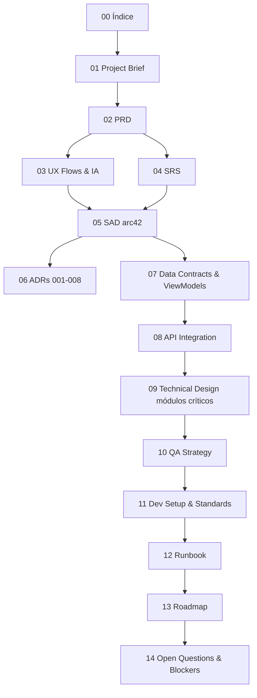

# Frontend — Índice Mestre da Documentação

> Hub de leitura da documentação do **Portal do Formando (SPA React)** do Portal ArtFinal v2.
> Esta pasta cobre **somente o frontend web/mobile**. O Admin (Blade/Livewire + Inspinia) tem docs próprios em [`../prd/`](../prd/), [`../architecture/`](../architecture/) e [`../modules/`](../modules/).
>
> Antes de qualquer linha de código React, leia o [Planejamento Frontend React](../prd/PLANEJAMENTO_FRONTEND_REACT.md) — documento-mestre que origina todos os arquivos aqui.

---

## 1. Visão rápida do escopo

| Pergunta                | Resposta                                                                                                                                                       |
| ----------------------- | -------------------------------------------------------------------------------------------------------------------------------------------------------------- |
| **O que é?**            | SPA React puro servido pelo shell Laravel `spa.blade.php`, consumindo exclusivamente `api/v1`.                                                                 |
| **Para quem?**          | Formando (primário), Responsável financeiro, Convidado (RSVP público), Comissão de formatura (acompanhamento).                                                 |
| **Qual stack?**         | React 19 + Vite 7 + TypeScript 5 + TanStack Router v1 + TanStack Query v5 + Zustand v5 + RHF v7 + Zod v4 + Axios v1 + Tamagui v2 + Vitest/Playwright.          |
| **Qual auth?**          | Sanctum **stateful (cookie)** no web; Sanctum **token** no mobile F8 (ver [ADR-008](./06-ADR/ADR-008-sanctum-stateful-cookie-web.md)).                         |
| **Quantas rotas?**      | 11 rotas SPA + 1 pública `/rsvp/$token` (ver [§5 do Planejamento](../prd/PLANEJAMENTO_FRONTEND_REACT.md#5--tanstack-router-11-rotas)).                         |
| **Quais fases?**        | F3 (login + wizard + dashboard + financeiro + pagamento) → F4 (convites + RSVP + perfil + extras) → F5 (mesas) → F6 (enquetes) → F7 (polish) → F8 (mobile RN). |
| **Onde mora o código?** | `resources/spa/` (monorepo Laravel, build separado via `resources/spa/vite.config.ts`).                                                                        |
| **Tipos vêm de onde?**  | `resources/spa/src/api/types.gen.ts` gerado por `openapi-typescript` a partir de `docs/api/openapi-skeleton.yaml` em CI.                                       |

### 1.1 Princípios não-negociáveis (valem para todos os docs desta pasta)

1. SPA React puro no portal (exceto shell `spa.blade.php`).
2. API-first via `/api/v1`, nunca chamadas fora desse prefixo.
3. TypeScript estrito (`strict: true`, `noUncheckedIndexedAccess`, zero `any`).
4. Sanctum stateful (cookie) para web; token para mobile F8.
5. UI 100% PT-BR.
6. ULID em rotas — nunca BIGINT.
7. Idempotência em seating e pagamentos via `X-Idempotency-Key` em `sessionStorage`.
8. Hold timer reconciliado com `hold_expires_at` do servidor.
9. Cursor pagination (nunca offset).
10. `openapi-typescript` codegen em CI — tipos de contrato nunca manuais.

---

## 2. Ordem de leitura recomendada

1. **00 — Índice** (este arquivo) — hub e rota de leitura.
2. **01 — Project Brief** — brief executivo: problema, objetivos, jornadas macro, metas.
3. **02 — PRD** — PRD expandido por módulo, priorização por fase, critérios de aceite.
4. **03 — UX Flows / IA / Screens** — fluxogramas Mermaid por jornada (auth, wizard, pagamento, seating, RSVP, etc.) + IA + estados de tela.
5. **04 — SRS** — requisitos funcionais (RF) e não-funcionais (RNF), validações Zod, comportamento por rota, critérios Gherkin.
6. **05 — SAD (arc42)** — arquitetura do SPA: contexto, building blocks, runtime, deployment, crosscutting.
7. **06-ADR/** — 8 ADRs iniciais do frontend.
8. **07 — Data Contracts & ViewModels** — fronteira DTO (gerado) vs ViewModel (composição), libs (`money`, `date`, `ulid`, `idempotency`).
9. **08 — API Integration Contract** — Axios client + interceptors, auth flow, idempotência, cursor pagination, invariantes.
10. **09 — Technical Design dos 7 módulos críticos** — auth, wizard, financeiro, seating, RSVP, convites, enquetes.
11. **10 — QA Test Strategy** — pirâmide unit/integration/E2E, MSW, Playwright, axe-core, Lighthouse CI, matriz feature×teste.
12. **11 — Dev Setup & Engineering Standards** — setup local, padrões de branch/naming, codegen, lint, DoR/DoD.
13. **12 — Runbook** — operação: subir local, validar auth, debug, build, deploy, troubleshooting.
14. **13 — Implementation Roadmap** — cronograma Pré-F3 → F8 com SPs, milestones, sequência recomendada.
15. **14 — Open Questions & Backend Blockers** — consolidação viva de pendências (blockers BE, UX, design, decisões top-level).

---

## 3. Mapa de documentos frontend (14 docs + 8 ADRs)

### 3.1 Documentos principais

| #   | Arquivo                                                                                  | Descrição (1 linha)                                                                                                                 | Linhas | Status |
| --- | ---------------------------------------------------------------------------------------- | ----------------------------------------------------------------------------------------------------------------------------------- | -----: | ------ |
| 00  | [00-README-INDEX.md](./00-README-INDEX.md)                                               | Hub da documentação frontend, ordem de leitura, status, blockers, open questions top-level.                                         |    347 | draft  |
| 01  | [01-FRONTEND-PROJECT-BRIEF.md](./01-FRONTEND-PROJECT-BRIEF.md)                           | Brief executivo: problema, 8 objetivos (O1-O8), 13 riscos, 13 premissas, jornadas macro, metas UX.                                  |    506 | draft  |
| 02  | [02-FRONTEND-PRD.md](./02-FRONTEND-PRD.md)                                               | PRD expandido por 11 módulos, 10 objetivos (OP1-OP10), matriz feature × fase × SP, 25 open questions.                               |    972 | draft  |
| 03  | [03-UX-FLOWS-IA-SCREENS.md](./03-UX-FLOWS-IA-SCREENS.md)                                 | IA, navegação, 7 fluxos Mermaid (auth, wizard, pagamento, convites, RSVP, mesas, extras/enquetes), estados de tela, a11y macro.     |   1099 | draft  |
| 04  | [04-FRONTEND-SRS.md](./04-FRONTEND-SRS.md)                                               | 30 RF + 25 RNF, schemas Zod, regras navegação/permissão, comportamento por rota, mapa error key → UX, critérios Gherkin.            |    940 | draft  |
| 05  | [05-FRONTEND-SAD.md](./05-FRONTEND-SAD.md)                                               | SAD arc42 adaptado: 12 seções (contexto, building blocks, runtime 6 sequence diagrams, deployment, 9 cenários qualidade, 9 riscos). |    850 | draft  |
| 07  | [07-DATA-CONTRACTS-AND-VIEW-MODELS.md](./07-DATA-CONTRACTS-AND-VIEW-MODELS.md)           | Fronteira DTO (gerado) vs ViewModel (local), 14 entidades TS, libs money/date/ulid/idempotency, 8 gaps de backend.                  |   2287 | draft  |
| 08  | [08-API-INTEGRATION-CONTRACT.md](./08-API-INTEGRATION-CONTRACT.md)                       | Axios client com 4 interceptors, auth flow Sanctum stateful, cursor pagination, 30 invariantes, 20 checks backend, 15 gaps.         |   1472 | draft  |
| 09  | [09-TECHNICAL-DESIGN-CRITICAL-MODULES.md](./09-TECHNICAL-DESIGN-CRITICAL-MODULES.md)     | Design detalhado dos 7 módulos: auth, wizard (7 etapas), financeiro/pagamento, seating (hold 5min), RSVP, convites/cotas, enquetes. |   2165 | draft  |
| 10  | [10-QA-TEST-STRATEGY.md](./10-QA-TEST-STRATEGY.md)                                       | Vitest + RTL + MSW, Playwright E2E (7 fluxos críticos), axe-core WCAG AA, Lighthouse CI, matriz feature × teste, DoD.               |   1407 | draft  |
| 11  | [11-DEV-SETUP-AND-ENGINEERING-STANDARDS.md](./11-DEV-SETUP-AND-ENGINEERING-STANDARDS.md) | Pré-requisitos, setup local, tsconfig strict + `noUncheckedIndexedAccess`, lint/typecheck/test, codegen CI, ~40 anti-patterns.      |   1366 | draft  |
| 12  | [12-RUNBOOK-FRONTEND.md](./12-RUNBOOK-FRONTEND.md)                                       | Operação: subir local, validar auth flow, regenerar tipos, 13 causas de erros comuns, build, deploy, 30+ entradas sintoma→causa.    |   1081 | draft  |
| 13  | [13-FRONTEND-IMPLEMENTATION-ROADMAP.md](./13-FRONTEND-IMPLEMENTATION-ROADMAP.md)         | Cronograma Pré-F3 → F8, 18 tarefas FE + 10 BE no setup, breakdown sprint SP 4-26, quick wins, 5 milestones macro, ordem pós-docs.   |    801 | draft  |
| 14  | [14-OPEN-QUESTIONS-AND-BACKEND-BLOCKERS.md](./14-OPEN-QUESTIONS-AND-BACKEND-BLOCKERS.md) | 21 blockers backend, 14 perguntas BE, 14 UX, 10 design, 16 decisões top-level, 30 gaps de contrato, template de decisão, sync.      |    671 | draft  |

### 3.2 ADRs (Architecture Decision Records) do frontend

Todos em [`./06-ADR/`](./06-ADR/). Seguem template MADR com frontmatter YAML, 6 seções (Contexto, Decisão, Consequências, Trade-offs, Alternativas rejeitadas, Status) em PT-BR.

| ADR     | Arquivo                                                                                                           | Decisão resumida                                                                                                              | Linhas | Status   |
| ------- | ----------------------------------------------------------------------------------------------------------------- | ----------------------------------------------------------------------------------------------------------------------------- | -----: | -------- |
| ADR-001 | [ADR-001-frontend-spa-react-puro.md](./06-ADR/ADR-001-frontend-spa-react-puro.md)                                 | Portal é SPA React 19 puro, sem Blade/Livewire (exceto shell `spa.blade.php`). Inertia descartado.                            |    130 | accepted |
| ADR-002 | [ADR-002-api-first-contrato-v1.md](./06-ADR/ADR-002-api-first-contrato-v1.md)                                     | SPA consome exclusivamente `/api/v1` versionada. Mobile F8 compartilha o mesmo contrato. Sem BFF, sem endpoints SPA-specific. |    136 | accepted |
| ADR-003 | [ADR-003-tamagui-v2-cross-platform-design-system.md](./06-ADR/ADR-003-tamagui-v2-cross-platform-design-system.md) | Tamagui v2 como design system único (web + React Native F8). shadcn/ui descartado — quebraria estratégia cross-platform.      |    145 | accepted |
| ADR-004 | [ADR-004-tanstack-router-query-zustand.md](./06-ADR/ADR-004-tanstack-router-query-zustand.md)                     | TanStack Router v1 (file-based) + TanStack Query v5 + Zustand v5 como trio core. Redux/SWR/Jotai descartados.                 |    156 | accepted |
| ADR-005 | [ADR-005-openapi-typescript-fonte-unica-tipos.md](./06-ADR/ADR-005-openapi-typescript-fonte-unica-tipos.md)       | Tipos de contrato gerados por `openapi-typescript` v7; CI falha em drift. Orval/tipos manuais descartados.                    |    166 | accepted |
| ADR-006 | [ADR-006-polling-5s-mapa-mesas-mvp.md](./06-ADR/ADR-006-polling-5s-mapa-mesas-mvp.md)                             | Polling 5s via TanStack Query durante hold ativo. WebSocket/Reverb postergado para F7+ conforme carga real.                   |    156 | accepted |
| ADR-007 | [ADR-007-sessionstorage-idempotencia-wizard.md](./06-ADR/ADR-007-sessionstorage-idempotencia-wizard.md)           | `sessionStorage` (não `localStorage`) para `X-Idempotency-Key` e wizard de adesão. Dados sensíveis não persistem entre abas.  |    154 | accepted |
| ADR-008 | [ADR-008-sanctum-stateful-cookie-web.md](./06-ADR/ADR-008-sanctum-stateful-cookie-web.md)                         | SPA web usa Sanctum stateful (cookie `laravel_session` + XSRF). Mobile F8 usa tokens. JWT descartado.                         |    161 | accepted |

### 3.3 Tabela consolidada de status

| Tipo     | Total | draft | in-review | accepted | Linhas | Tamanho |
| -------- | ----: | ----: | --------: | -------: | -----: | ------: |
| Docs     |    14 |    14 |         0 |        0 | 15 014 | ~680 KB |
| ADRs     |     8 |     0 |         0 |        8 |  1 204 |  ~72 KB |
| **Soma** |    22 |    14 |         0 |        8 | 16 218 | ~752 KB |

> **Entrega 2026-04-18:** 22 artefatos produzidos em paralelo por 5 agentes especializados (Produto, UX/SRS, Arquitetura, Dados/API/TD, QA/DevOps). Próximo passo: revisão técnica + promoção para `accepted`.

---

## 4. Onde começar? (por perfil)

### 4.1 Desenvolvedor React (novo no time)

1. [CLAUDE.md raiz](../../CLAUDE.md) — princípios globais do projeto.
2. [`../prd/PLANEJAMENTO_FRONTEND_REACT.md`](../prd/PLANEJAMENTO_FRONTEND_REACT.md) — documento-mestre técnico.
3. **Este índice** (00) → **01 Brief** → **02 PRD** → **05 SAD** → **07 Data Contracts** → **08 API Integration**.
4. **09 Technical Design** para entender o módulo em que vai trabalhar.
5. **11 Dev Setup** antes de abrir o editor; Apêndice A do planejamento para checklist Pré-F3.
6. ADRs 001–008 antes de abrir PR.

### 4.2 UX/Designer

1. **01 Brief** — entender o problema e personas.
2. **02 PRD** — conferir escopo por módulo e critérios de aceite.
3. **03 UX Flows / IA / Screens** — fluxogramas detalhados e estados de tela.
4. **04 SRS** — requisitos de a11y, responsividade e validações.
5. ADR-003 (Tamagui) para entender limites do design system.
6. [`../product/macro-screens.md`](../product/macro-screens.md) — referência de telas macro do PRD.

### 4.3 Arquiteto / Tech Lead

1. **05 SAD** — arquitetura do SPA (arc42 adaptado).
2. **06-ADR/\*** — todas as 8 decisões gravadas.
3. [`../architecture/SAD-arc42.md`](../architecture/SAD-arc42.md) — SAD global (backend + frontend + infra).
4. [`../architecture/adrs/`](../architecture/adrs/) — ADRs backend para cross-check (0001 API-first, 0003 Sanctum, 0005 Idempotência, 0006 Seating, 0007 OpenAPI).
5. **08 API Integration Contract** — pontos de acoplamento com `api/v1` + invariantes.
6. **09 Technical Design** — runtime dos 7 módulos críticos.
7. **14 Open Questions** — blockers e perguntas estruturais pendentes.

### 4.4 QA

1. **02 PRD** — critérios de aceite por feature.
2. **04 SRS** — RF/RNF com IDs rastreáveis + critérios Gherkin.
3. **10 QA Test Strategy** — pirâmide, MSW, Playwright, coverage thresholds.
4. **03 UX Flows** — cenários felizes e de exceção por jornada.
5. **09 Technical Design** — edge cases por módulo (seating, pagamento, wizard).
6. **12 Runbook** §2 (validar auth flow) + §4 (testar integrações).

### 4.5 Product Manager

1. **01 Brief** — visão executiva, objetivos, KPIs.
2. **02 PRD** — escopo, fases, open questions (25 OQs).
3. **13 Roadmap** — cronograma F3 → F8 com milestones.
4. **14 Open Questions & Blockers** — pendências que precisam de decisão de produto.
5. Seção 5 deste índice — decisões top-level priorizadas.

### 4.6 Backend / Integrador

1. **08 API Integration Contract** — o que o frontend espera da API.
2. **Seção 6** deste índice — blockers B1-B7 (+ adicionais em 14).
3. **07 Data Contracts** — shape dos payloads esperados.
4. [`../api/api-contract.md`](../api/api-contract.md) — contrato oficial.
5. [`../api/error-envelope.md`](../api/error-envelope.md) — como o FE consome erros.

---

## 5. Decisões pendentes top-level (precisam de dono)

Consolidadas dos docs 01, 02 e 14 + Apêndice B do planejamento.

| #   | Decisão pendente                                                                              | Dono sugerido | Prazo sugerido  | Default proposto                                               |
| --- | --------------------------------------------------------------------------------------------- | ------------- | --------------- | -------------------------------------------------------------- |
| D1  | Onde reside o código React: `resources/spa/` (monorepo) ou repo separado?                     | Tech Lead     | Antes F3 início | `resources/spa/` (monorepo).                                   |
| D2  | Realtime no mapa de mesas: polling 5s (MVP) ou WebSocket/Reverb (F7+)?                        | Arquitetura   | Final F5        | Polling 5s durante hold; avaliar Reverb em F7 (ADR-006).       |
| D3  | i18n: strings hardcoded PT-BR (fase inicial) ou i18next desde F3?                             | Produto + Dev | Antes F3        | Hardcoded PT-BR; migrar para i18next em F8 (mobile).           |
| D4  | `noUncheckedIndexedAccess` ligado desde F3 ou relaxado nas primeiras sprints?                 | Tech Lead     | Antes F3        | Ligado desde o início (ADR-005 + doc 11).                      |
| D5  | E2E: Playwright ou Cypress?                                                                   | QA            | Antes F3        | Playwright (velocidade + DX + doc 10).                         |
| D6  | Design system: Tamagui full ou complementar com shadcn/ui no admin?                           | Arquitetura   | Antes F3        | Tamagui full no portal; admin segue Inspinia (ADR-003).        |
| D7  | Recuperação de senha: entra no MVP do portal ou fica para F6/F7?                              | Produto       | F3              | Entra em F3 com fluxo mínimo (e-mail + link).                  |
| D8  | Convidado pode comprar extras direto via `/rsvp/$token` ou apenas via formando responsável?   | Produto       | Antes F6        | Apenas via formando (MVP).                                     |
| D9  | Comissão pode aprovar trocas de assento e compras extras pelo SPA, ou só pelo admin Blade?    | Produto       | Antes F5        | Apenas admin Blade no MVP; comissão consulta no SPA.           |
| D10 | RSVP público (`/rsvp/$token`) precisa de captcha ou throttle mais agressivo?                  | Segurança     | F4              | Throttle `rsvp` (10/min por IP+token); captcha off.            |
| D11 | Perfil: quais campos são editáveis (nome, e-mail, telefone) vs. somente-leitura (CPF, turma)? | Produto       | F4              | Editáveis: telefone, senha. Leitura: CPF, nome, turma, e-mail. |
| D12 | Estratégia de offline no mobile F8: cache TanStack Query + MMKV ou apenas fallback visual?    | Arquitetura   | F8              | Cache TanStack Query + MMKV para leitura.                      |

> Registre ✅ quando uma decisão for aceita e documentada em ADR próprio (ou em doc 14 via template de decisão).

---

## 6. Blockers de backend (pré-requisitos para F3)

Extraídos de [§11 do Planejamento Frontend](../prd/PLANEJAMENTO_FRONTEND_REACT.md#11--backend-prerequisites-bloqueadores). **Nenhum código React de F3 pode começar antes destes 7 itens estarem concluídos no backend.** Blockers adicionais (B8-B21) detalhados no [doc 14](./14-OPEN-QUESTIONS-AND-BACKEND-BLOCKERS.md).

| #   | Item backend                                                                                      | Arquivo Laravel                                     | Responsável   | Status |
| --- | ------------------------------------------------------------------------------------------------- | --------------------------------------------------- | ------------- | ------ |
| B1  | `config/cors.php` com `supports_credentials: true` e `allowed_origins: [env('FRONTEND_URL')]`     | `config/cors.php`                                   | Backend Squad | ❓     |
| B2  | `config/sanctum.php` com `stateful: ['localhost', 'localhost:5173', env('APP_URL')]`              | `config/sanctum.php`                                | Backend Squad | ❓     |
| B3  | `routes/portal.php` com catch-all servindo `spa.blade.php`                                        | `routes/portal.php`                                 | Backend Squad | ❓     |
| B4  | `resources/views/spa.blade.php` com `@viteReactRefresh` + `@vite(['resources/spa/src/main.tsx'])` | `resources/views/spa.blade.php`                     | Backend Squad | ❓     |
| B5  | `POST /api/v1/auth/login` retornando `{ data: { formando: {...} } }` + cookie setado              | `App\Http\Controllers\Api\V1\AuthController@login`  | Backend Squad | ❓     |
| B6  | `GET /api/v1/auth/me` retornando o formando autenticado                                           | `App\Http\Controllers\Api\V1\AuthController@me`     | Backend Squad | ❓     |
| B7  | `POST /api/v1/auth/logout` revogando token/sessão                                                 | `App\Http\Controllers\Api\V1\AuthController@logout` | Backend Squad | ❓     |

> Ao concluir cada item, atualize o status para ✅ e referencie o PR (ex.: `#142 ✅`). Blockers estendidos (CORS `allowed_headers`, rate limiters, idempotency middleware, error envelope global, endpoints `/me/*`, `/mesas/*`, `/pagamentos/*`, `/eventos/{ulid}/pacotes`, RSVP público) estão em [doc 14 §2](./14-OPEN-QUESTIONS-AND-BACKEND-BLOCKERS.md).

---

## 7. Cross-refs (para docs fora desta pasta)

### 7.1 Para o backend

| Tema                                | Arquivo backend                                                                                      |
| ----------------------------------- | ---------------------------------------------------------------------------------------------------- |
| PRD geral do produto                | [`../prd/PRD_v4.md`](../prd/PRD_v4.md)                                                               |
| Regras de negócio                   | [`../prd/REGRAS_NEGOCIO.md`](../prd/REGRAS_NEGOCIO.md)                                               |
| Planejamento backend API v1         | [`../prd/PLANEJAMENTO_BACKEND_APIV1.md`](../prd/PLANEJAMENTO_BACKEND_APIV1.md)                       |
| Planejamento frontend (mestre)      | [`../prd/PLANEJAMENTO_FRONTEND_REACT.md`](../prd/PLANEJAMENTO_FRONTEND_REACT.md)                     |
| Roadmap por fases                   | [`../prd/ROADMAP.md`](../prd/ROADMAP.md)                                                             |
| Contrato da API v1                  | [`../api/api-contract.md`](../api/api-contract.md)                                                   |
| Convenções de API (paginação, erro) | [`../api/api-conventions.md`](../api/api-conventions.md)                                             |
| Envelope de erro                    | [`../api/error-envelope.md`](../api/error-envelope.md)                                               |
| OpenAPI skeleton (fonte dos tipos)  | [`../api/openapi-skeleton.yaml`](../api/openapi-skeleton.yaml)                                       |
| Brief do projeto (backend)          | [`../product/PROJECT_BRIEF.md`](../product/PROJECT_BRIEF.md)                                         |
| Jornadas/Personas detalhadas        | [`../product/journeys-personas.md`](../product/journeys-personas.md)                                 |
| Telas macro                         | [`../product/macro-screens.md`](../product/macro-screens.md)                                         |
| User flows (backend)                | [`../product/user-flows.md`](../product/user-flows.md)                                               |
| SRS (geral)                         | [`../product/SRS.md`](../product/SRS.md)                                                             |
| SAD global arc42                    | [`../architecture/SAD-arc42.md`](../architecture/SAD-arc42.md)                                       |
| ADRs backend                        | [`../architecture/adrs/`](../architecture/adrs/)                                                     |
| Design técnico seating              | [`../architecture/technical-design-seating.md`](../architecture/technical-design-seating.md)         |
| Design técnico convites             | [`../architecture/technical-design-invitations.md`](../architecture/technical-design-invitations.md) |
| Design técnico extras               | [`../architecture/technical-design-extras.md`](../architecture/technical-design-extras.md)           |
| Design técnico pagamentos           | [`../architecture/technical-design-payments.md`](../architecture/technical-design-payments.md)       |

### 7.2 Para o admin (Blade/Livewire + Inspinia)

O portal React **não compartilha componentes visuais** com o admin, mas compartilha **naming de estados, semântica de ações, ícones e status operacional** (conforme [PRD_v4 §7.4](../prd/PRD_v4.md)).

| Tema                                    | Arquivo admin                                                                    |
| --------------------------------------- | -------------------------------------------------------------------------------- |
| Catálogo Inspinia                       | [`../INSPINIA-CATALOGO-COMPONENTES.md`](../INSPINIA-CATALOGO-COMPONENTES.md)     |
| Mapa tela → componentes                 | [`../INSPINIA-MAPA-TELAS-COMPONENTES.md`](../INSPINIA-MAPA-TELAS-COMPONENTES.md) |
| Template map & components               | [`../04-TEMPLATE-MAP-AND-COMPONENTS.md`](../04-TEMPLATE-MAP-AND-COMPONENTS.md)   |
| Architecture guide (Service/Action/DTO) | [`../01-ARCHITECTURE-GUIDE.md`](../01-ARCHITECTURE-GUIDE.md)                     |

### 7.3 Para qualidade e operação

| Tema              | Arquivo                                                      |
| ----------------- | ------------------------------------------------------------ |
| Convenções gerais | [`../02-CONVENTIONS.md`](../02-CONVENTIONS.md)               |
| Tools & packages  | [`../03-TOOLS-AND-PACKAGES.md`](../03-TOOLS-AND-PACKAGES.md) |
| Infra (Docker)    | [`../INFRA.md`](../INFRA.md)                                 |
| QA plan (geral)   | [`../qa/`](../qa/)                                           |
| DevOps            | [`../devops/`](../devops/)                                   |

---

## 8. Quem mantém cada documento

| Arquivo                                   | Papel responsável           | Co-maintainer sugerido     |
| ----------------------------------------- | --------------------------- | -------------------------- |
| 00-README-INDEX.md                        | Tech Lead Frontend          | Product Manager            |
| 01-FRONTEND-PROJECT-BRIEF.md              | Product Manager             | Tech Lead Frontend         |
| 02-FRONTEND-PRD.md                        | Product Manager             | UX + Tech Lead Frontend    |
| 03-UX-FLOWS-IA-SCREENS.md                 | UX Designer                 | Product Manager            |
| 04-FRONTEND-SRS.md                        | Tech Lead Frontend          | QA + Product Manager       |
| 05-FRONTEND-SAD.md                        | Tech Lead / Arquitetura     | Squad Frontend             |
| 06-ADR/\*.md                              | Tech Lead / Arquitetura     | Squad Frontend             |
| 07-DATA-CONTRACTS-AND-VIEW-MODELS.md      | Dev Frontend Senior         | Backend Squad              |
| 08-API-INTEGRATION-CONTRACT.md            | Dev Frontend Senior         | Backend Squad              |
| 09-TECHNICAL-DESIGN-CRITICAL-MODULES.md   | Dev Frontend Senior         | Tech Lead Frontend         |
| 10-QA-TEST-STRATEGY.md                    | QA Lead                     | Tech Lead Frontend         |
| 11-DEV-SETUP-AND-ENGINEERING-STANDARDS.md | Tech Lead Frontend          | DevOps                     |
| 12-RUNBOOK-FRONTEND.md                    | Tech Lead Frontend          | DevOps / SRE               |
| 13-FRONTEND-IMPLEMENTATION-ROADMAP.md     | Tech Lead + Product Manager | Squad Frontend             |
| 14-OPEN-QUESTIONS-AND-BACKEND-BLOCKERS.md | Tech Lead Frontend          | Product Manager + BE Squad |

> Cada arquivo tem exatamente **um** responsável (single source of truth) e opcionalmente um co-maintainer que revisa PRs de alteração.

---

## 9. Convenções desta pasta

- Todos os arquivos começam com frontmatter YAML (`title`, `version`, `date`, `status`).
- Versão segue semver: **1.0.0** na primeira entrega, **1.X.0** para adições, **2.0.0** para mudança não-retrocompatível de escopo.
- Status possíveis: `draft`, `in-review`, `accepted`, `superseded`.
- Links internos usam paths relativos (ex.: `[SAD](./05-FRONTEND-SAD.md)`, `[ADR-001](./06-ADR/ADR-001-frontend-spa-react-puro.md)`).
- Marcadores de origem da informação:
    - ✅ **confirmado** pelo [Planejamento Frontend React](../prd/PLANEJAMENTO_FRONTEND_REACT.md) ou pelo [PRD_v4](../prd/PRD_v4.md).
    - 💡 **inferido** pelo autor a partir de princípios do projeto, marcado como "assunção explícita".
    - ❓ **pendente** — requer decisão de produto/UX/arquitetura (ver seção 5 e doc 14).
- Todo conteúdo normativo usa imperativo ("o SPA deve", "o hook precisa"), nunca condicional sem justificativa.
- Exemplos concretos são preferidos a afirmações genéricas.

---

## 10. Changelog desta pasta

| Data       | Versão | Autor                                            | Mudanças                                                                                                                      |
| ---------- | ------ | ------------------------------------------------ | ----------------------------------------------------------------------------------------------------------------------------- |
| 2026-04-18 | 1.0.0  | Agente de Produto/Requisitos                     | Criação inicial: `00`, `01`, `02`.                                                                                            |
| 2026-04-18 | 1.1.0  | 5 agentes paralelos (UX, Arq, Dados, QA, DevOps) | Entrega completa: `03`, `04`, `05`, `06-ADR/*` (8 ADRs), `07`, `08`, `09`, `10`, `11`, `12`, `13`, `14`. Índice reconciliado. |

---

## 11. Dúvidas frequentes (FAQ)

**Q: Por que o portal não usa Inertia.js se o admin Laravel é monolítico?**
A: Decisão explícita do [PRD_v4 §2.2](../prd/PRD_v4.md) e [ADR-002](./06-ADR/ADR-002-api-first-contrato-v1.md). O produto precisa sustentar web React **e** mobile RN (F8) consumindo o **mesmo** contrato. Inertia criaria duas superfícies (uma implícita Inertia, outra explícita para mobile). Preferimos uma API pública versionada única.

**Q: Por que Tamagui e não shadcn/ui?**
A: Porque o mobile F8 reusa 80% da UI. shadcn é web-only. Ver [ADR-003](./06-ADR/ADR-003-tamagui-v2-cross-platform-design-system.md).

**Q: Por que TanStack Router e não React Router 7?**
A: File-based routing, type-safe links, loaders integrados com TanStack Query, melhor DX com Vite. Ver [ADR-004](./06-ADR/ADR-004-tanstack-router-query-zustand.md).

**Q: Posso chamar `fetch()` direto em um componente?**
A: Não. Use sempre `useQuery`/`useMutation` com o Axios client configurado. Ver [Anti-Patterns](../prd/PLANEJAMENTO_FRONTEND_REACT.md#apêndice-c--anti-patterns-proibido) e [doc 11 §12](./11-DEV-SETUP-AND-ENGINEERING-STANDARDS.md).

**Q: Onde gravo token de autenticação no web?**
A: Em lugar nenhum. Web usa **cookie Sanctum HttpOnly** — o SPA não toca no token. Mobile F8 usa token em MMKV/Keychain. Ver [ADR-008](./06-ADR/ADR-008-sanctum-stateful-cookie-web.md).

**Q: Por que `sessionStorage` e não `localStorage`?**
A: Dados do wizard são sensíveis e devem morrer ao fechar a aba. Tokens JWT nunca são persistidos do lado do cliente. Ver [ADR-007](./06-ADR/ADR-007-sessionstorage-idempotencia-wizard.md).

**Q: O admin também consome `api/v1`?**
A: Não. Admin usa Livewire com Eloquent direto (sessão/cookie do guard `admin`). API v1 é do portal + mobile.

**Q: Como é o hold timer do mapa de mesas?**
A: 5 minutos a partir de `hold_expires_at` do servidor. Cliente reconcilia e faz polling 5s. Ver [ADR-006](./06-ADR/ADR-006-polling-5s-mapa-mesas-mvp.md) e [doc 09 §4](./09-TECHNICAL-DESIGN-CRITICAL-MODULES.md).

---

## 12. Próximos passos (pós-entrega)

1. **Backend Squad:** resolver B1–B7 antes do início da F3 (ver [doc 14 §2](./14-OPEN-QUESTIONS-AND-BACKEND-BLOCKERS.md) para lista estendida).
2. **Product Manager:** resolver D7, D8, D10, D11 (doc 14 §4).
3. **Tech Lead Frontend:** aceitar ADRs 001–008 formalmente + iniciar Apêndice A do planejamento (checklist Pré-F3).
4. **Dev Frontend Senior:** criar `resources/spa/vite.config.ts`, `tsconfig.json` strict, `main.tsx`, Axios client, auth-store, codegen `types.gen.ts`.
5. **QA Lead:** configurar Vitest + RTL + MSW + Playwright (doc 10).
6. **UX Designer:** validar fluxos 03 com telas macro do PRD_v4 §14 e abrir decisões D7/D11.
7. **Semanal:** revisar doc 14 (open questions), mover resolvidos para changelogs dos docs afetados.

> **Ordem recomendada de implementação:** (1) resolver blockers backend → (2) executar checklist Pré-F3 → (3) smoke test `csrf → login → me` → (4) iniciar F3 pelo login → wizard paralelo ao financeiro → pagamento → F4 → F5 → F6 → F7 → F8.
