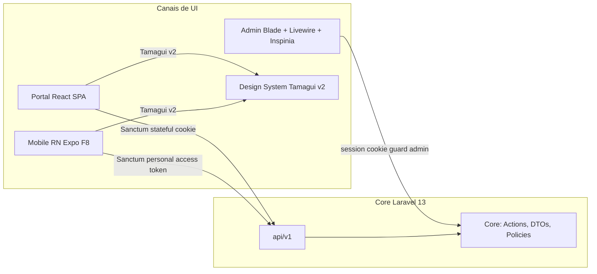
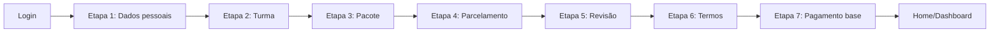
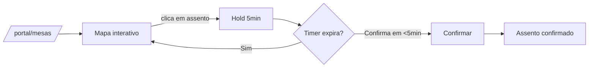
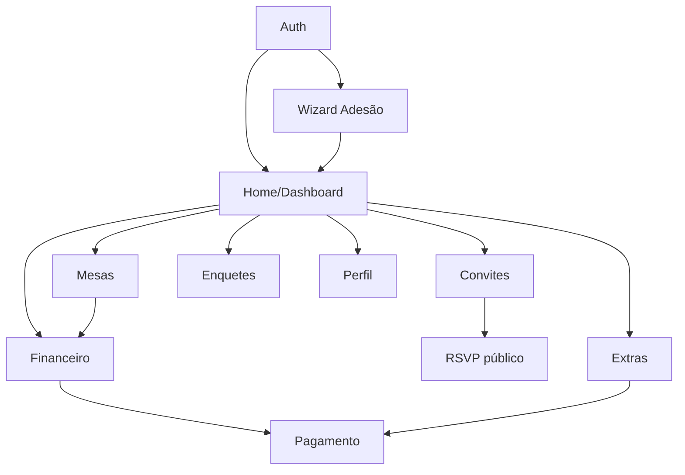

# Frontend Project Brief — Portal ArtFinal v2

> Brief executivo do **Portal do Formando (SPA React)**, um dos canais de consumo da `api/v1` do Portal ArtFinal v2.
> Este documento é irmão do [`../product/PROJECT_BRIEF.md`](../product/PROJECT_BRIEF.md) (backend) e se concentra **exclusivamente na camada de apresentação web**. O mobile F8 (React Native) compartilha o mesmo contrato e parte do design system, mas tem documento próprio (fora desta entrega).
>
> Fontes primárias: [`../prd/PLANEJAMENTO_FRONTEND_REACT.md`](../prd/PLANEJAMENTO_FRONTEND_REACT.md) (mestre), [`../prd/PRD_v4.md`](../prd/PRD_v4.md), [`../product/PROJECT_BRIEF.md`](../product/PROJECT_BRIEF.md), [`../api/api-contract.md`](../api/api-contract.md).

---

## 1. Visão do frontend

O Portal do Formando é uma **SPA React pura**, mobile-first, consumida via navegador. É servida por um único shell Blade (`spa.blade.php`) e obtém todos os dados exclusivamente do contrato `api/v1`. O código do SPA vive em `resources/spa/` dentro do monorepo Laravel, com build Vite próprio (`resources/spa/vite.config.ts`).

O objetivo da camada de apresentação é dar ao formando uma experiência unificada, previsível e rápida para **todas as capabilities do produto**: adesão, financeiro, convites, RSVP, mesas, extras, enquetes e perfil. A mesma estrutura de código e o mesmo design system (Tamagui v2) serão reusados em **F8 (mobile React Native)** — o Tamagui é o único DS aprovado justamente porque compila para web e nativo.

### 1.1 Arquitetura de canais do produto

### 1.2 Princípios não-negociáveis do frontend

Repetidos do [§0 do Planejamento Frontend](../prd/PLANEJAMENTO_FRONTEND_REACT.md#0--princípios-não-negociáveis) porque ancoram **todas** as decisões deste brief:

1. SPA React puro no portal (exceto shell `spa.blade.php`).
2. API-first via `/api/v1`.
3. TypeScript estrito desde F3 (`strict: true`, `noUncheckedIndexedAccess`, zero `any`).
4. Sanctum stateful (cookie) para web; token para mobile F8.
5. 100% PT-BR na UI.
6. ULID em todas as rotas.
7. Idempotência obrigatória (seating, pagamentos).
8. Hold timer reconciliado com servidor.
9. Cursor pagination — nunca offset.
10. `openapi-typescript` codegen em CI; tipos de API nunca manuais.

---

## 2. Problema que o frontend resolve

### 2.1 Dores atuais do usuário final

O produto atual do cliente (v3.1.0) cobre parte do eixo comercial, mas a UX dos formandos enfrenta problemas concretos:

| #   | Dor                                                                                                    | Evidência                                                                         |
| --- | ------------------------------------------------------------------------------------------------------ | --------------------------------------------------------------------------------- |
| 1   | Formulários "soltos" sem estado preservado: o formando perde progresso quando fecha a aba.             | Relato frequente na operação; não há wizard com persistência.                     |
| 2   | Falta visibilidade financeira clara (parcelas, vencimentos, comprovantes).                             | Extrato vive em planilhas paralelas; formando liga para a operadora pedir 2ª via. |
| 3   | Convites manuais via WhatsApp/planilha; RSVP disperso em respostas de grupo.                           | Zero rastreabilidade; retrabalho na véspera.                                      |
| 4   | Mapa de mesas em PowerPoint; conflitos resolvidos no telefone.                                         | Taxa de conflito visível na véspera de cada evento piloto.                        |
| 5   | Compra de extras por PIX direto, sem rastro financeiro vinculado ao sistema.                           | Zero controle de estoque de convites extras; reconciliação manual.                |
| 6   | Ausência de feedback visual consistente (loading, erro, sucesso) — usuário não sabe se a ação "pegou". | Observado em sessões de uso; formandos fazem dupla submissão.                     |
| 7   | Nenhum suporte mobile: UI travada em desktop/responsivo ruim.                                          | +70% dos acessos são mobile (inferência setorial ❓).                             |
| 8   | Nenhuma oferta de RSVP sem fricção para o convidado; o convidado precisa criar conta.                  | Queda de conversão na jornada do convidado.                                       |

### 2.2 Por que um SPA React resolve

| Dor | Resposta do SPA                                                                                                                                                          |
| --- | ------------------------------------------------------------------------------------------------------------------------------------------------------------------------ |
| 1   | Wizard 7 etapas com estado em Zustand + `sessionStorage`; retomada automática ao reabrir a aba.                                                                          |
| 2   | Dashboard com KPIs sintéticos e extrato com filtros + comprovantes; tudo vindo de endpoints `api/v1/me/*`.                                                               |
| 3   | Carteira de convites com emissão por cota, lote, reenvio e transferência; RSVP via token mágico em `/rsvp/$token` (público, sem criar conta).                            |
| 4   | Mapa interativo com hold de 5min, polling de 5s e confirmação transacional no servidor.                                                                                  |
| 5   | Catálogo de extras + checkout com boleto/PIX/cartão, vinculado ao pedido e reconciliado por webhook do gateway.                                                          |
| 6   | Padrão único de feedback: loading com skeleton ≥ 200ms, error boundary por rota, toast de sucesso/erro, confirmação destrutiva com `SweetAlert2` ou equivalente Tamagui. |
| 7   | Mobile-first desde o dia 1; Tamagui v2 entrega componentes responsivos que rodam em React Native em F8.                                                                  |
| 8   | Rota `/rsvp/$token` é pública e sem auth; convidado só precisa de 1 link + 1 clique.                                                                                     |

---

## 3. Objetivos do portal

Objetivos de produto do frontend, derivados dos objetivos SMART do [`PROJECT_BRIEF backend §6`](../product/PROJECT_BRIEF.md#6-objetivos-smart), reinterpretados no olhar de UX/entrega web.

| #   | Objetivo do frontend                                                                              | Indicador verificável                                       | Prazo |
| --- | ------------------------------------------------------------------------------------------------- | ----------------------------------------------------------- | ----- |
| O1  | Entregar jornada de adesão completa (wizard 7 etapas → pagamento base) com conversão ≥ 65%.       | Analytics: `adesao_iniciada` → `adesao_concluida`.          | F3    |
| O2  | Dar ao formando **clareza financeira**: saldo, próxima parcela, status, comprovante em 2 cliques. | Heatmap/UX test: < 10s para localizar próxima parcela.      | F3    |
| O3  | Permitir RSVP público pelo convidado em ≤ 2 minutos médios.                                       | Tempo médio entre `convite_enviado` e `rsvp_confirmado`.    | F4    |
| O4  | Entregar mapa de mesas com **zero conflito** de confirmação pós-abertura pública.                 | 0 registros de `AssentoIndisponivel` após `confirmada`.     | F5    |
| O5  | Permitir compra de extras com ≥ 95% de pedidos concluídos sem intervenção manual.                 | Razão `pago / (pago + pendente + falhou)` em `PedidoExtra`. | F6    |
| O6  | Atingir Lighthouse mobile ≥ 90 nas 5 rotas críticas (home, financeiro, adesão, mesas, rsvp).      | Relatório CI Lighthouse.                                    | F7    |
| O7  | Aderência WCAG 2.1 AA mínima nas 11 rotas autenticadas + `/rsvp`.                                 | axe-core sem violações críticas; auditoria manual.          | F7    |
| O8  | Reuso ≥ 80% do código de componentes/hooks entre web e mobile (Tamagui + TanStack Query).         | Inventário de componentes compartilhados.                   | F8    |

### 3.1 Metas de UX quantitativas

| Meta                                                                 | Valor             | Como mede                                                  |
| -------------------------------------------------------------------- | ----------------- | ---------------------------------------------------------- |
| Time-to-interactive mobile (3G fast)                                 | ≤ 3 s             | Lighthouse, origem: Chrome DevTools                        |
| First Contentful Paint (FCP)                                         | ≤ 1,5 s           | Lighthouse                                                 |
| Largest Contentful Paint (LCP)                                       | ≤ 2,5 s           | Lighthouse                                                 |
| Cumulative Layout Shift (CLS)                                        | < 0,1             | Lighthouse                                                 |
| Tempo de resposta percebido por interação (clique → visual feedback) | ≤ 200 ms          | Loading state começa em 200 ms (abaixo disso sem skeleton) |
| Tempo médio de conclusão de RSVP                                     | ≤ 2 min           | Métrica produto (O3)                                       |
| Tempo médio de seleção de mesa                                       | ≤ 90 s após abrir | Métrica produto (F5)                                       |
| Taxa de abandono do wizard de adesão                                 | ≤ 20%             | `adesao_iniciada` vs `adesao_concluida`                    |

### 3.2 Metas de qualidade técnica

| Meta                                                           | Valor    |
| -------------------------------------------------------------- | -------- |
| Cobertura unitária (libs `lib/*`, stores, hooks)               | ≥ 80%    |
| Cobertura de componentes críticos (wizard, seating, pagamento) | ≥ 70%    |
| Testes E2E Playwright das 6 jornadas principais passando em CI | 100%     |
| Zero `any` no TypeScript (auditado por `tsc --noEmit`)         | Enforce  |
| Pacote JS gzip total (por rota, pós code-split)                | ≤ 220 KB |
| Build time local                                               | ≤ 20 s   |
| CI verde sem flakes ≥ 95%                                      | Enforce  |

---

## 4. Público-alvo

Mirando exclusivamente os canais servidos pelo SPA. Personas detalhadas estão em [`../product/journeys-personas.md`](../product/journeys-personas.md).

### 4.1 Primário: Formando

- **Perfil:** universitário, 19–27 anos, mobile-first, conta com baixa paciência para fluxos longos sem feedback.
- **Expectativas:** comprar/aderir rápido, ver parcelas, emitir convite e escolher mesa em minutos.
- **Contexto de uso:** celular Android gama média, Wi-Fi institucional instável, sessões curtas (2–5 min).
- **Motivos para abandonar:** erro sem mensagem clara, carregamento > 3 s, formulário sem persistência.

### 4.2 Secundário: Responsável financeiro

- **Perfil:** pai, mãe ou tutor, 45–60 anos, desktop-first.
- **Expectativas:** receber link, ver boleto/PIX, pagar e guardar comprovante.
- **Contexto de uso:** abrir em desktop, imprimir boleto, conferir próxima parcela 1×/mês.
- **Motivos para abandonar:** precisar criar conta, fluxo de login complexo, links quebrados.
- **Decisão pendente ❓:** o responsável terá login próprio ou acessa via link/token encaminhado pelo formando? (ver D-FR-01 no §11).

### 4.3 Secundário: Convidado (RSVP)

- **Perfil:** amigos, familiares, 16–70 anos, heterogêneo.
- **Expectativas:** clicar no link, ver convite, confirmar presença. Ponto.
- **Contexto de uso:** celular qualquer; o link chega por WhatsApp/e-mail.
- **Motivos para abandonar:** pedir senha/cadastro, formulário > 3 campos, erro de token.
- **Não precisa** de conta no sistema. Token descartável é suficiente.

### 4.4 Secundário: Comissão (acompanhamento)

- **Perfil:** formandos voluntários, já autenticados como formando, com permissão adicional via Spatie Permission.
- **Expectativas:** ver agregados (quantos confirmaram, ocupação do salão, lista de pendências).
- **Contexto de uso:** no portal, com guard `portal` + permissões `comissao.*`.
- **Nota:** MVP **não** permite comissão aprovar trocas ou compras pelo SPA. Isso é feito no admin Blade. (ver [D9 em 00-README-INDEX §5](./00-README-INDEX.md#5-decisões-pendentes-top-level-precisam-de-dono)).

---

## 5. Principais jornadas (macro)

Jornadas detalhadas serão produzidas no doc **03-USER-FLOWS** pelo agente de UX. Abaixo estão os macros com entrada, saída e dependências.

### 5.1 Jornada de Adesão

- **Entrada:** `/login` (formando com credenciais válidas) → `/portal/adesao/1`.
- **Saída:** `/portal/home` com `adesao.status = aguardando_pagamento` ou `ativa`.
- **Persistência de estado:** `wizard-store` em Zustand + `sessionStorage` (nunca `localStorage`).
- **Idempotência:** `POST /adesoes` envia `X-Idempotency-Key` gerado em `sessionStorage`.
- **Tempo alvo:** ≤ 7 min (95º percentil).

### 5.2 Jornada Financeira

- **Entrada:** `/portal/home` → `/portal/financeiro`.
- **Fluxo:** extrato de parcelas com filtros (status, intervalo de datas) → selecionar parcela → `/portal/pagamento/$parcela_ulid` → escolher método (boleto/PIX/cartão) → polling de status até `pago` ou timeout de 10 min.
- **Saída:** confirmação com comprovante baixável.
- **Tempo alvo:** ≤ 2 min do clique em "pagar" até confirmação PIX.

### 5.3 Jornada de Convites

- **Entrada:** `/portal/home` → `/portal/convites`.
- **Fluxo:** ver cota disponível → emitir individual (form com 3 campos) **ou** emitir lote (CSV de convidados) → opcionalmente transferir convite → compartilhar link de RSVP.
- **Saída:** convite com status `emitido`; link de RSVP copiável.
- **Tempo alvo:** emitir 1 convite em ≤ 30 s; emitir 200 convites em ≤ 5 min (O5 do [brief backend](../product/PROJECT_BRIEF.md)).

### 5.4 Jornada RSVP (público)

- **Entrada:** `/rsvp/$token` (link recebido por e-mail/WhatsApp).
- **Fluxo:** validar token → exibir convite + evento → confirmar ou recusar → (opcional) ver mesa/assento indicado.
- **Saída:** convite com status `confirmado` ou `recusado`; trilha de RSVP atualizada.
- **Sem auth.** Sem cadastro. Sem senha.
- **Tempo alvo:** ≤ 2 min (O3).

### 5.5 Jornada Seating

- **Entrada:** `/portal/home` → `/portal/mesas` (só disponível se `evento.abre_mesas_at <= now()` e formando tem adesão ativa).
- **Fluxo:**
    1. Ler mapa via `GET /eventos/:ulid/mesas/mapa` com polling 5s durante hold ativo.
    2. Clicar em assento → `POST /eventos/:ulid/mesas/reservas` → `200 { hold_expires_at }`.
    3. Timer visual regressivo; reconcilia `secondsRemaining` com servidor.
    4. Confirmar → `POST /eventos/:ulid/mesas/reservas/:ulid/confirmar` → limpar `X-Idempotency-Key`.
- **Saída:** reserva `confirmada`.
- **Tempo alvo:** ≤ 90 s desde abrir mapa até confirmar.

### 5.6 Jornada Extras

- **Entrada:** `/portal/home` → `/portal/extras`.
- **Fluxo:** catálogo filtrável → adicionar ao pedido → checkout → pagar (mesma UI de `/portal/pagamento`) → confirmação.
- **Saída:** `PedidoExtra.status = pago`; convites extras emitidos automaticamente (via evento de domínio no backend).
- **Dependência:** formando precisa ter adesão ativa (✅ confirmado pelo [PRD_v4 §6.10 Fluxo 4](../prd/PRD_v4.md#610-fluxos-ponta-a-ponta-prioritários)).

### 5.7 Jornada Enquetes

- **Entrada:** `/portal/home` → `/portal/enquetes`.
- **Fluxo:** listar enquetes abertas → selecionar → votar dentro da janela `abre_at / fecha_at`.
- **Saída:** voto registrado; resultado parcial/público conforme config da enquete.
- **Restrição:** elegibilidade validada no servidor (formando, comissão, convidado confirmado).

### 5.8 Jornada Perfil

- **Entrada:** `/portal/home` → `/portal/perfil`.
- **Fluxo:** visualizar dados → editar campos permitidos → confirmar → toast de sucesso.
- **Campos editáveis (default 💡 assunção explícita):** telefone, senha. ❓ Definir em produto: e-mail editável?
- **Campos leitura:** CPF, nome completo, turma, instituição.

### 5.9 Mapa macro de dependências entre jornadas

---

## 6. Escopo

### 6.1 Dentro do escopo (in)

✅ Confirmado pelo [Planejamento Frontend §14](../prd/PLANEJAMENTO_FRONTEND_REACT.md#14--cronograma) e pelo [PRD_v4 §1.4](../prd/PRD_v4.md).

| Categoria     | Item                                                                                       | Fase |
| ------------- | ------------------------------------------------------------------------------------------ | ---- |
| Auth          | Login e logout via Sanctum cookie stateful                                                 | F3   |
| Auth          | Recuperação de senha (fluxo mínimo: solicitar link + redefinir)                            | F3   |
| Adesão        | Wizard 7 etapas + payload `POST /adesoes`                                                  | F3   |
| Dashboard     | KPIs (saldo, próxima parcela, convites emitidos/cota, próximos eventos)                    | F3   |
| Financeiro    | Extrato de parcelas com filtros, status e download de comprovante                          | F3   |
| Pagamento     | Boleto (retornar PDF), PIX (QR + copia-e-cola + polling), cartão (tokenização via gateway) | F3   |
| Convites      | Cota visual, emissão individual, emissão em lote (CSV), transferência, reenvio             | F4   |
| RSVP público  | Rota pública `/rsvp/$token`, confirmar/recusar, exibir mesa indicada se aplicável          | F4   |
| Perfil        | Editar telefone, senha; visualizar demais dados                                            | F4   |
| Extras        | Catálogo, checkout, pagamento                                                              | F4   |
| Mesas         | Mapa interativo, hold, confirmar, trocar (com idempotência)                                | F5   |
| Enquetes      | Listar, votar dentro da janela                                                             | F6   |
| Polish        | Lighthouse ≥ 90, WCAG 2.1 AA, E2E Playwright                                               | F7   |
| Mobile        | App RN Expo SDK 53 reutilizando Tamagui + hooks                                            | F8   |
| Observability | Error boundary, `X-Request-Id`, Sentry SPA                                                 | F7   |
| Codegen       | `openapi-typescript` CI → `types.gen.ts`                                                   | F3   |
| i18n          | PT-BR hardcoded                                                                            | F3   |

### 6.2 Fora do escopo (out)

| Item                                         | Razão                                                                                                                                                                  |
| -------------------------------------------- | ---------------------------------------------------------------------------------------------------------------------------------------------------------------------- |
| Admin em React                               | Admin permanece em Blade/Livewire + Inspinia (decisão do [PRD_v4 §2.3](../prd/PRD_v4.md)).                                                                             |
| PWA install / offline-first                  | Não há requisito no MVP. Avaliado pós-F7. 💡 Cache TanStack Query + Service Worker de navegação é possível.                                                            |
| Internacionalização (outros idiomas)         | Produto PT-BR. i18next só em F8 (mobile).                                                                                                                              |
| Check-in por QR Code no evento               | Fora do core MVP (confirmado pelo [PRD_v4 §1.4](../prd/PRD_v4.md)).                                                                                                    |
| Marketplace de fornecedores                  | Fora do MVP.                                                                                                                                                           |
| Networking social entre convidados           | Fora do MVP.                                                                                                                                                           |
| BI/analítico                                 | Relatórios operacionais suficientes para MVP; dashboards em admin.                                                                                                     |
| WebSocket realtime no seating                | Polling 5s no MVP; Reverb considerado em F7 se polling sobrecarregar (ver D2 em [00-README §5](./00-README-INDEX.md#5-decisões-pendentes-top-level-precisam-de-dono)). |
| Ranking/votação avançada em enquetes         | Enquetes simples e múltipla escolha no MVP (confirmado pelo [PRD_v4 §6.6](../prd/PRD_v4.md)).                                                                          |
| SMS/WhatsApp como canal de convite           | Fora do MVP ([`PROJECT_BRIEF backend §8.2`](../product/PROJECT_BRIEF.md)).                                                                                             |
| Componentes visuais compartilhados com admin | Admin usa Inspinia; portal usa Tamagui. Compartilham apenas semântica de estados e ícones.                                                                             |

---

## 7. Metas de UX

### 7.1 Mobile-first

- Breakpoints: `base` (320–480), `sm` (480–768), `md` (768–1024), `lg` (≥ 1024).
- Todas as rotas testadas em ≥ 375px (iPhone SE base) antes de PR.
- Touch targets ≥ 44×44 px.
- Form inputs com `inputMode` e `autocomplete` adequados (ex.: CPF → `inputMode="numeric"`).

### 7.2 Performance alvo

Alinhada com [`../prd/PERFORMANCE.md`](../prd/PERFORMANCE.md) e [PRD_v4 §9.3](../prd/PRD_v4.md).

| Métrica                   | Meta mobile | Meta desktop |
| ------------------------- | ----------- | ------------ |
| Lighthouse Performance    | ≥ 90        | ≥ 95         |
| Lighthouse Accessibility  | ≥ 95        | ≥ 95         |
| Lighthouse Best Practices | ≥ 95        | ≥ 95         |
| Lighthouse SEO            | ≥ 90        | ≥ 90         |
| FCP                       | ≤ 1,5 s     | ≤ 1,0 s      |
| LCP                       | ≤ 2,5 s     | ≤ 1,8 s      |
| TBT                       | ≤ 200 ms    | ≤ 100 ms     |
| CLS                       | < 0,1       | < 0,1        |

### 7.3 Acessibilidade

- WCAG 2.1 AA como piso; AAA em textos de corpo quando possível.
- Contraste mínimo 4,5:1 para texto < 18pt; 3:1 para texto ≥ 18pt.
- Navegação completa por teclado nas 11 rotas + `/rsvp`.
- `aria-*` consistente nos primitivos Tamagui wrapeados em `components/ui/`.
- Leitor de tela: VoiceOver/TalkBack/NVDA devem anunciar estado de formulário e ações.
- Indicador de foco visível em todos os interativos (não usar `outline: none` sem substituto).

### 7.4 Interação e feedback

| Regra                                                                                              | Justificativa                        |
| -------------------------------------------------------------------------------------------------- | ------------------------------------ |
| Feedback visual inicia em ≤ 200 ms após clique.                                                    | Threshold percepção humana.          |
| Loading skeleton **só** aparece se operação passar de 200 ms (evitar flicker).                     | Melhora percepção de velocidade.     |
| Toasts de sucesso verde, erro vermelho, info azul; duração 4 s; fechamento manual disponível.      | Consistência + não ocultar erros.    |
| Erros incluem `request_id` em modo debug (campo colapsável) para suporte.                          | Correlação com logs backend.         |
| Confirmações destrutivas (cancelar reserva, deletar convite, sair do wizard) usam modal explícito. | Evitar perda de dados acidental.     |
| Estados vazios com CTA claro (ex.: "Você ainda não emitiu convites. Emitir primeiro convite").     | Reduzir atrito em primeiras sessões. |
| Redirecionamento após login respeita `?redirect=<path>`.                                           | UX fluida em deep links.             |

---

## 8. Metas de produto

### 8.1 Conversão e engajamento

| Meta                                                    | Valor alvo | Onde mede                          |
| ------------------------------------------------------- | ---------- | ---------------------------------- |
| Conversão wizard (iniciado → concluído)                 | ≥ 65%      | Evento `adesao_iniciada/concluida` |
| Tempo médio de RSVP (`enviado` → `confirmado/recusado`) | ≤ 2 min    | Log backend                        |
| Taxa RSVP respondido por convite emitido                | ≥ 75%      | Log backend                        |
| Taxa de conflito de assento após liberação pública      | < 0,5%     | Log backend                        |
| Taxa de pagamento bem-sucedido em extras                | ≥ 95%      | Log backend                        |
| NPS do formando (coletado pós-evento)                   | ≥ 60       | Survey                             |

### 8.2 Adoção

| Meta                                                              | Valor alvo |
| ----------------------------------------------------------------- | ---------- |
| % de formandos que logam ≥ 1×/mês nos 90 dias pós-adesão          | ≥ 70%      |
| % de formandos que emitem ≥ 1 convite até 30 dias antes do evento | ≥ 90%      |
| % de convites entregues com RSVP respondido até D-7               | ≥ 80%      |
| Ocupação do mapa 24h após abertura                                | ≥ 60%      |

---

## 9. Riscos

| #   | Risco                                                                                               | Prob. | Impacto | Mitigação                                                                                                                                                                |
| --- | --------------------------------------------------------------------------------------------------- | :---: | :-----: | ------------------------------------------------------------------------------------------------------------------------------------------------------------------------ |
| R1  | Hold timer dessincronizado com servidor (clock skew, JS pause em background) libera assento errado. | média |  alto   | Reconciliar `secondsRemaining` a cada refetch (polling 5s); servidor é fonte de verdade; expirado visualmente → bloquear confirmação até novo refetch.                   |
| R2  | Concorrência no seating: dois usuários clicam no mesmo assento quase ao mesmo tempo.                | alta  |  alto   | Idempotência via `X-Idempotency-Key`; confirmação 409 explicitamente tratada na UI com "Este assento acabou de ser tomado".                                              |
| R3  | Gateway de pagamento offline ou lento durante pico.                                                 | média |  alto   | Exibir fallback ("Estamos processando. Você receberá confirmação por e-mail"); polling de status com timeout; retry manual.                                              |
| R4  | Escopo do React SPA crescer durante F3 (adicionar features fora do MVP).                            | alta  |  alto   | Congelar MVP por capability; Roadmap por fase; rejeitar PRs fora do escopo documentado.                                                                                  |
| R5  | Bundle JS grande degrada Lighthouse em mobile.                                                      | média |  médio  | Code split por rota (TanStack Router suporta nativamente); lazy-load Tamagui modules; budget de 220 KB gzip por rota.                                                    |
| R6  | `openapi-typescript` gerar tipos incompatíveis após mudança no backend.                             | média |  médio  | Step de CI que regenera `types.gen.ts` e **falha build** em diff; PR backend + frontend sincronizados.                                                                   |
| R7  | Mobile F8 forçar breaking change tardio na API por necessidade de push notifications/offline.       | média |  médio  | Validar contratos com SPA web antes de F8; versionamento `api/v1` estável; Sanctum dual-mode já aceito ([ADR-0003](../architecture/adrs/ADR-0003-sanctum-dual-mode.md)). |
| R8  | CSRF falhar em ambiente de dev devido a proxy Vite mal configurado.                                 | média |  médio  | Proxy explícito para `/sanctum` e `/api` em `vite.config.ts`; `.env` documentado.                                                                                        |
| R9  | WCAG AA complexo de atingir em mapa de mesas interativo (SVG).                                      | média |  médio  | Alternativa textual/tabela equivalente ao mapa (ocupação por seção); navegação por teclado no SVG; foco rastreável.                                                      |
| R10 | Design System Tamagui v2 ter incompatibilidade com React Native Web versão usada.                   | baixa |  alto   | Prova de conceito em F3 (home + botão); plano B: shadcn/ui web + Gluestack RN (fallback).                                                                                |
| R11 | Recuperação de senha não planejada virar bloqueador de UAT.                                         | média |  médio  | Incluir em F3 com fluxo mínimo (link por e-mail, token de 1h); docs backend no planejamento API v1.                                                                      |
| R12 | LGPD violada por logar CPF ou e-mail de convidado em console/Sentry.                                | baixa |  alto   | Interceptor Axios remove PII antes de enviar para Sentry; review obrigatório em PRs.                                                                                     |
| R13 | Tempo de TypeScript (`tsc --noEmit`) explodir ao crescer o projeto.                                 | baixa |  médio  | Incremental builds; `skipLibCheck: true`; monitorar tempo de CI.                                                                                                         |

---

## 10. Premissas

1. ✅ Backend entrega `api/v1` estável antes do início de F3 (itens B1–B7 do §6 deste índice).
2. ✅ OpenAPI skeleton (`docs/api/openapi-skeleton.yaml`) reflete 100% do contrato público e é atualizado em cada PR backend.
3. ✅ Sanctum dual-mode (cookie web + token mobile) aceito em [ADR-0003](../architecture/adrs/ADR-0003-sanctum-dual-mode.md).
4. ✅ ULID como identificador público aceito em [ADR-0004](../architecture/adrs/ADR-0004-ulid-publico-bigint-interno.md).
5. ✅ Idempotência em 3 camadas aceita em [ADR-0005](../architecture/adrs/ADR-0005-idempotencia-3-camadas.md).
6. ✅ Tamagui v2 é compatível com RN Expo SDK 53 no F8. 💡 Validado por prova de conceito em F3.
7. ✅ Vite 7 já está instalado no projeto; adicionar `vite.config.ts` separado em `resources/spa/` não quebra o admin.
8. 💡 Equipe frontend tem ≥ 1 dev senior TypeScript para owner de `07-ROUTING-AND-STATE` e `08-API-CONTRACT-BINDING`.
9. 💡 Cliente tem CDN/edge para servir assets do SPA (Cloudflare ou equivalente); se não, fallback para Laravel/nginx direto.
10. 💡 Gateway de pagamento Itaú fornece SDK ou endpoint server-to-server para tokenização de cartão; o SPA nunca toca em PAN.
11. 💡 Design final do mapa de mesas é produzido em Figma antes de F5; agente de UX é responsável.
12. 💡 Feature flags (LaunchDarkly/Unleash ou solução caseira) existem até F6 para habilitar enquetes e extras por evento.
13. 💡 Sentry (ou equivalente) configurado no SPA até F7 com DSN por ambiente.

---

## 11. Decisões pendentes específicas do frontend

Complementa a lista consolidada em [`00-README-INDEX §5`](./00-README-INDEX.md#5-decisões-pendentes-top-level-precisam-de-dono).

| ID      | Decisão                                                                                            | Dono sugerido | Default proposto                                                         |
| ------- | -------------------------------------------------------------------------------------------------- | ------------- | ------------------------------------------------------------------------ |
| D-FR-01 | Responsável financeiro tem conta própria ou acessa via link/token encaminhado pelo formando?       | Produto       | Acesso por link/token descartável; cadastro próprio só no backlog.       |
| D-FR-02 | Comprovante de pagamento: PDF gerado pelo backend ou screenshot do resumo com dados básicos?       | Produto       | PDF gerado pelo backend (DomPDF) para parcelas e extras.                 |
| D-FR-03 | CSV de lote de convites: qual o schema exato? (nome, e-mail, telefone, CPF?)                       | Produto       | `nome, email, telefone` obrigatórios; `cpf` opcional; codificação UTF-8. |
| D-FR-04 | Scanner de QR Code no SPA ou só no app mobile F8 para auto check-in?                               | Produto       | Só F8 mobile (se entrar).                                                |
| D-FR-05 | Dashboard da comissão: rota separada `/portal/comissao` ou toggle dentro do home?                  | UX + Produto  | Toggle em `/portal/home` baseado em permissão Spatie.                    |
| D-FR-06 | Enquetes multiselect aceitam ver parcial (andamento) durante janela aberta?                        | Produto       | Não — resultado só depois do fechamento (default); configurável backend. |
| D-FR-07 | Notificações in-app (sino no topo) entram em F6 ou F7?                                             | Produto       | F6 mínimas (lista); F7 realtime se Reverb entrar.                        |
| D-FR-08 | Deep link do Admin para o SPA (ex.: admin abre convite do formando direto no SPA) precisa existir? | Tech Lead     | Não no MVP; admin faz tudo em Blade.                                     |

---

## 12. Não-objetivos (para clareza)

- **Não** substituir o admin Blade. O portal React serve **apenas** formandos/convidados.
- **Não** criar backend paralelo em Node/Next para o portal. Toda lógica de negócio mora no Laravel.
- **Não** armazenar dados sensíveis em `localStorage` (tokens, CPF, cartão).
- **Não** publicar OpenAPI em prod com endpoints internos.
- **Não** acoplar UI do portal a decisões do Inspinia (cor, tipografia, layout) — os dois universos são independentes.

---

## 13. Métricas pós-lançamento (O&M)

A partir do go-live (fim F7), monitorar continuamente:

| Métrica                                        | Fonte                           | Frequência |
| ---------------------------------------------- | ------------------------------- | ---------- |
| Erro JavaScript client-side                    | Sentry                          | Tempo real |
| Tempo de carregamento por rota (p50, p95, p99) | Sentry Performance / web vitals | Diário     |
| Taxa de falhas 4xx/5xx por endpoint            | Backend Pulse + logs            | Diário     |
| Conversão por funil (login→adesão→pagamento)   | Analytics                       | Semanal    |
| Abandono por etapa do wizard                   | Analytics                       | Semanal    |
| Reclamações de suporte correlacionadas         | Helpdesk (tag `request_id`)     | Semanal    |
| Lighthouse CI em cada deploy                   | GitHub Actions                  | Por deploy |

---

## 14. Referências

### 14.1 Internas

- [`00-README-INDEX.md`](./00-README-INDEX.md) — hub da documentação frontend.
- [`02-FRONTEND-PRD.md`](./02-FRONTEND-PRD.md) — PRD expandido por módulo.
- [`../prd/PLANEJAMENTO_FRONTEND_REACT.md`](../prd/PLANEJAMENTO_FRONTEND_REACT.md) — documento-mestre técnico.
- [`../prd/PRD_v4.md`](../prd/PRD_v4.md) — PRD geral do produto.
- [`../product/PROJECT_BRIEF.md`](../product/PROJECT_BRIEF.md) — brief do backend.
- [`../product/journeys-personas.md`](../product/journeys-personas.md) — personas detalhadas.
- [`../product/macro-screens.md`](../product/macro-screens.md) — telas macro.
- [`../api/api-contract.md`](../api/api-contract.md) — contrato da API v1.
- [`../architecture/SAD-arc42.md`](../architecture/SAD-arc42.md) — SAD global.

### 14.2 Externas (material de referência)

- [TanStack Router — file-based routing](https://tanstack.com/router/latest)
- [TanStack Query v5](https://tanstack.com/query/latest)
- [Zustand v5](https://github.com/pmndrs/zustand)
- [React Hook Form](https://react-hook-form.com/)
- [Zod](https://zod.dev/)
- [Tamagui](https://tamagui.dev/)
- [openapi-typescript](https://github.com/openapi-ts/openapi-typescript)
- [WCAG 2.1 AA](https://www.w3.org/TR/WCAG21/)

---

## 15. Changelog

| Data       | Versão | Autor                        | Mudanças         |
| ---------- | ------ | ---------------------------- | ---------------- |
| 2026-04-18 | 1.0.0  | Agente de Produto/Requisitos | Criação inicial. |
