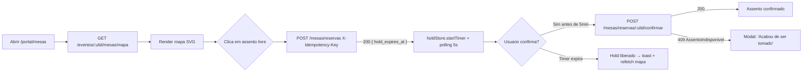
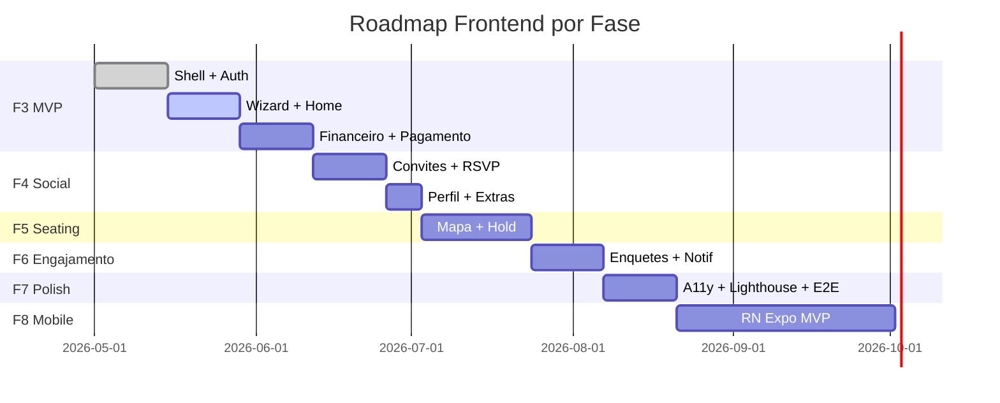
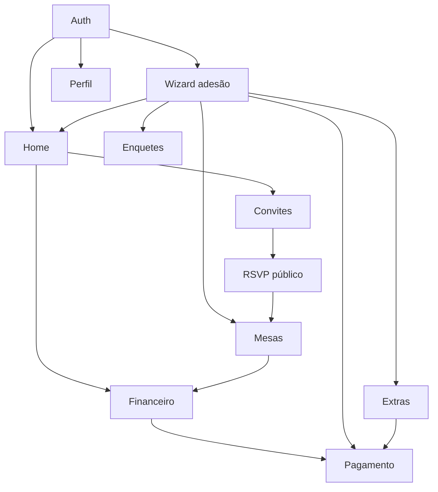

# Frontend PRD — Portal ArtFinal v2

> PRD expandido do **SPA React do Portal do Formando**. Detalha jornadas, funcionalidades, regras de UX, priorização por fase e critérios de aceite para cada módulo.
>
> Complementa o [`01-FRONTEND-PROJECT-BRIEF.md`](./01-FRONTEND-PROJECT-BRIEF.md) e se apoia no mestre técnico [`../prd/PLANEJAMENTO_FRONTEND_REACT.md`](../prd/PLANEJAMENTO_FRONTEND_REACT.md).
> Onde houver divergência com o brief ou o planejamento, **este PRD prevalece para escopo do frontend**, e o diff deve ser registrado em PR + ADR.

> **[REESCRITA PENDENTE — 2026-04-23]** O fluxo de adesão descrito neste PRD (wizard de 7 etapas, parâmetros `{evento_ulid, turma_ulid}`, mapa de pacotes) precisa ser atualizado conforme a inversão Contrato↔Turma e o novo modelo de adesão pública. Verdade corrente:
>
> - **Entidade central:** Contrato (ver [SPEC-F-001 v0.3.0](../features/foundation/SPEC-F-001-contrato-e-turma.md)). `Contrato hasMany Turmas`, código público em `contratos.codigo_acesso` (ex.: `ARTFINAL-USP-MED-2026`).
> - **Novas etapas no wizard:** "Escolher curso + período" (1 turma entre as do contrato) e "Escolher pacote formatura" (filtro `categoria='formatura'`, exatamente 1 seleção) antes dos dados pessoais.
> - **Payload:** `contrato_ulid` + `turma_ulid` + `pacote_ulid` (todos ULID obrigatórios nas mutações do wizard).
> - **Fluxo público sem login:** ver [SPEC-010 v2.0.0](../features/SPEC-010-adesao-publica-codigo-contrato.md).
> - **Governança:** [`docs/META/PROJECT-STATUS.md`](../META/PROJECT-STATUS.md) — `status: desenvolvimento`.

---

## Sumário

1. [Objetivos do produto frontend](#1-objetivos-do-produto-frontend)
2. [Jornadas detalhadas por módulo](#2-jornadas-detalhadas-por-módulo)
3. [Funcionalidades por área (inputs, outputs, validações)](#3-funcionalidades-por-área)
4. [Regras de experiência (UX horizontal)](#4-regras-de-experiência-ux-horizontal)
5. [Priorização por fase (F3 → F8)](#5-priorização-por-fase)
6. [Critérios macro de aceite por feature](#6-critérios-macro-de-aceite-por-feature)
7. [Dependências entre features](#7-dependências-entre-features)
8. [Open questions consolidadas](#8-open-questions-consolidadas)
9. [Referências](#9-referências)

---

## 1. Objetivos do produto frontend

Reafirmados e ampliados do [§3 do Brief](./01-FRONTEND-PROJECT-BRIEF.md#3-objetivos-do-portal). Este PRD adiciona **métricas numéricas auditáveis** e o **evento de analytics** que comprova cada objetivo.

| #    | Objetivo                                                                               | KPI                                                        | Meta      | Evento de analytics                                              | Prazo |
| ---- | -------------------------------------------------------------------------------------- | ---------------------------------------------------------- | --------- | ---------------------------------------------------------------- | ----- |
| OP1  | Dar ao formando jornada de adesão completa sem abandono.                               | Conversão `adesao_iniciada` → `adesao_concluida`           | ≥ 65%     | `adesao_iniciada`, `adesao_step_completed`, `adesao_concluida`   | F3    |
| OP2  | Entregar clareza financeira em ≤ 2 cliques desde o login.                              | Tempo até localizar próxima parcela (teste de usabilidade) | ≤ 10 s    | `financeiro_viewed`, `parcela_selected`                          | F3    |
| OP3  | Viabilizar RSVP público em ≤ 2 min médios sem cadastro.                                | `rsvp_token_opened` → `rsvp_responded`                     | ≤ 120 s   | `rsvp_token_opened`, `rsvp_responded`                            | F4    |
| OP4  | Garantir seating **zero conflito** após abertura pública.                              | % de `confirmada` sem `AssentoIndisponivel`                | 100%      | `seating_hold_created`, `seating_confirmed`, `seating_conflict`  | F5    |
| OP5  | Permitir compra de extras completa no SPA com ≥ 95% de sucesso sem intervenção manual. | `pedido_iniciado` → `pedido_pago`                          | ≥ 95%     | `extra_added`, `pedido_iniciado`, `pedido_pago`, `pedido_falhou` | F6    |
| OP6  | Entregar Lighthouse ≥ 90 nas 5 rotas críticas mobile.                                  | Score Lighthouse CI                                        | ≥ 90      | —                                                                | F7    |
| OP7  | Acessibilidade WCAG 2.1 AA nas 12 rotas (11 auth + `/rsvp`).                           | `axe-core` sem violações críticas; auditoria manual        | 100%      | —                                                                | F7    |
| OP8  | Reuso ≥ 80% do código entre web e mobile F8 (Tamagui + hooks).                         | Inventário em `05-FRONTEND-SAD`                            | ≥ 80%     | —                                                                | F8    |
| OP9  | Permitir convite emitido em ≤ 30 s individualmente; lote 200 em ≤ 5 min.               | `convite_emitido`, `lote_emitido`                          | ver metas | Tempo médio por operação                                         | F4    |
| OP10 | Zero exposição de PII sensível em logs de cliente (CPF completo, token).               | Auditoria de logs Sentry                                   | 0         | —                                                                | F7    |

---

## 2. Jornadas detalhadas por módulo

Cada subseção segue o padrão: **pré-condições → passos → pós-condições → pontos de erro → eventos emitidos → rotas envolvidas**.

### 2.1 Auth — Login / Logout / Recuperação de senha

#### Rotas envolvidas

| Rota                                    | Propósito                               |
| --------------------------------------- | --------------------------------------- |
| `/login`                                | Formulário de login (público)           |
| `/portal/*` (bloqueado sem sessão)      | Guard via `_layout.tsx`                 |
| `/recuperar-senha` 💡 (**nova**)        | Solicitar link de redefinição           |
| `/redefinir-senha/:token` 💡 (**nova**) | Redefinir com token recebido por e-mail |

#### Endpoints consumidos

| Endpoint                                                    | Método | Onde                         |
| ----------------------------------------------------------- | ------ | ---------------------------- |
| [`/auth/login`](../api/api-contract.md#11-post-authlogin)   | POST   | `/login`                     |
| [`/auth/logout`](../api/api-contract.md#12-post-authlogout) | POST   | Menu do usuário              |
| [`/me`](../api/api-contract.md#13-get-me)                   | GET    | Todo boot do SPA (`_layout`) |
| `/auth/forgot-password` 💡                                  | POST   | `/recuperar-senha`           |
| `/auth/reset-password` 💡                                   | POST   | `/redefinir-senha/:token`    |

#### Jornada de login

1. Usuário acessa qualquer rota sob `/portal/*` sem sessão.
2. Guard (`_layout.tsx`) detecta `useAuthStore.isAuthenticated === false` → redireciona para `/login?redirect=<path>`.
3. Usuário preenche e-mail + senha.
4. Submit dispara:
    - `GET /sanctum/csrf-cookie` (automático via interceptor).
    - `POST /auth/login { mode: 'spa' }`.
    - Se 200: `GET /me` para popular store; redireciona para `redirect` ou `/portal/home`.
5. Cookies `XSRF-TOKEN` e `laravel_session` (HttpOnly, Secure, SameSite=lax) são gerenciados pelo browser; o SPA **não toca** em tokens.

#### Jornada de logout

1. Usuário clica em "Sair" no menu do topo.
2. `POST /auth/logout` → store limpa → `queryClient.clear()` → redirect `/login`.

#### Jornada de recuperação de senha (MVP mínimo F3)

1. Usuário em `/login` clica "Esqueci a senha".
2. Em `/recuperar-senha` informa e-mail → `POST /auth/forgot-password`.
3. Recebe e-mail com link `/redefinir-senha/:token` (token válido 1h, uso único).
4. Em `/redefinir-senha/:token` define nova senha → `POST /auth/reset-password`.
5. Toast de sucesso → redirect `/login`.

#### Pontos de erro

| Cenário                          | Tratamento na UI                                                                         |
| -------------------------------- | ---------------------------------------------------------------------------------------- |
| 401 credenciais inválidas        | Mensagem inline: "E-mail ou senha inválidos." Não informar se e-mail existe (segurança). |
| 429 rate limit no login          | Toast: "Muitas tentativas. Aguarde 1 minuto." Desabilitar botão por 60s.                 |
| 419 CSRF token expirado          | Interceptor reexecuta `GET /sanctum/csrf-cookie` + retry 1×; falha → redirect `/login`.  |
| Rede offline                     | Toast: "Sem conexão. Verifique sua internet."                                            |
| Token de reset inválido/expirado | Página `/redefinir-senha/:token` mostra estado de erro com link para solicitar novo.     |

#### Eventos de analytics

- `login_attempted`, `login_succeeded`, `login_failed`
- `logout`
- `password_reset_requested`, `password_reset_completed`

#### Critérios de aceite

- [ ] Login persiste sessão após reload da aba.
- [ ] Logout limpa cache TanStack Query.
- [ ] Recuperação de senha: link por e-mail chega em ≤ 2 min.
- [ ] Token de reset expira em 1h.
- [ ] Rate limit `login` (5/min por email+ip) respeitado com feedback claro.
- [ ] CPF/senha nunca são logados em console ou Sentry.

---

### 2.2 Wizard de Adesão — 7 etapas

#### Rota envolvida

- `/portal/adesao/$step` — `$step` ∈ `{1,2,3,4,5,6,7}`.
- Redirect automático para a etapa correta se `wizard-store` estiver mais avançado.

#### Etapas

| Etapa | Nome                 | Campos principais                                                                              | Endpoint pré-preenchimento            |
| ----- | -------------------- | ---------------------------------------------------------------------------------------------- | ------------------------------------- |
| 1     | Dados pessoais       | CPF (readonly se pré-preenchido), nome, telefone, data nascimento                              | `GET /me` + `GET /me/eventos`         |
| 2     | Turma                | Escolher turma (se múltiplas)                                                                  | `GET /me/eventos`                     |
| 3     | Pacote               | Escolher pacote dentro da programação do evento                                                | `GET /eventos/:ulid/pacotes` 💡       |
| 4     | Parcelamento         | Nº de parcelas, método base (boleto/pix/cartão)                                                | `GET /eventos/:ulid/parcelamentos` 💡 |
| 5     | Revisão              | Resumo calculado (valor total, desconto, parcelas)                                             | Cálculo local + validação servidor    |
| 6     | Termos               | Checkbox "li e aceito", link para PDF                                                          | `GET /eventos/:ulid/termos` 💡        |
| 7     | Pagamento da entrada | Chama `POST /adesoes` → redireciona para `/portal/pagamento/:parcela_ulid` da primeira parcela | `POST /adesoes`                       |

#### Regras do wizard

- Estado em `wizard-store` (Zustand) + `sessionStorage` (nunca `localStorage`).
- Cada etapa valida com **Zod** via `zodResolver` em RHF.
- Botão "Voltar" preserva dados da etapa atual.
- Botão "Avançar" só habilita quando `formState.isValid === true`.
- Timeout de sessão (30 min sem interação) → salvar estado + toast de sessão expirada.
- `X-Idempotency-Key` gerado em sessão ao entrar na etapa 1; limpo após 201.
- Se o usuário logar novamente e `wizard-store` ainda tiver dados, mostrar modal: "Retomar adesão ou recomeçar?".

#### Pontos de erro

| Cenário                                 | Tratamento                                                                         |
| --------------------------------------- | ---------------------------------------------------------------------------------- |
| 422 validation error do `POST /adesoes` | Mapear `errors.fields` para erros inline no RHF; scroll até primeiro erro.         |
| 409 adesão já ativa                     | Modal explícito + link para `/portal/home`.                                        |
| Perda de conexão entre etapas           | `sessionStorage` preserva estado; retry ao voltar online.                          |
| Wizard abandonado > 24h                 | `sessionStorage` expira naturalmente ao fechar aba; ao reabrir, oferecer recomeço. |

#### Eventos de analytics

- `adesao_iniciada` (entrada etapa 1)
- `adesao_step_completed` (por etapa, com `step: 1..7`)
- `adesao_concluida` (após 201 da etapa 7)
- `adesao_abandonada` (saída sem concluir, medida por analytics)

#### Critérios de aceite

- [ ] Cada etapa valida com Zod antes de permitir avançar.
- [ ] Estado persiste em `sessionStorage` e sobrevive a reload.
- [ ] Etapa 5 (Revisão) exibe valor total exato calculado pelo backend (`GET /eventos/:ulid/parcelamentos/preview`).
- [ ] Etapa 6 (Termos) impede avanço sem aceite explícito.
- [ ] `X-Idempotency-Key` não é reutilizado entre adesões diferentes.
- [ ] Wizard inteiro acessível por teclado (Tab + Enter + Esc).
- [ ] Texto "Próximo" / "Voltar" tem `aria-label` descritivo.

---

### 2.3 Home / Dashboard do formando

#### Rota

- `/portal/home` — landing pós-login.

#### Blocos (KPIs e listas)

| Bloco                       | Conteúdo                                                                                | Endpoint                                |
| --------------------------- | --------------------------------------------------------------------------------------- | --------------------------------------- |
| Saudação                    | "Olá, Mariana"                                                                          | `GET /me`                               |
| KPI Saldo                   | Valor total pendente da adesão ativa                                                    | `GET /me/adesoes` + `/me/extrato`       |
| KPI Próxima parcela         | Valor + data vencimento + CTA "Pagar"                                                   | `GET /me/extrato` (primeira `pendente`) |
| KPI Cota de convites        | `emitidos / total` + barra de progresso                                                 | `GET /me/cotas`                         |
| KPI Próximo evento          | Nome, data, local + CTA "Ver mesa"                                                      | `GET /me/eventos`                       |
| Timeline de próximos passos | Banner dinâmico: "Escolha sua mesa (abre em 2 dias)", "1 convite aguardando RSVP", etc. | Derivado                                |
| Avisos / notificações       | Lista compacta de notificações recentes                                                 | `GET /me/notificacoes` 💡               |

#### Comportamento

- Se `adesao.status !== 'ativa'` → banner de destaque no topo pedindo adesão/pagamento.
- Skeleton por bloco (não bloqueia render inteiro).
- Refetch ao focar janela (opcional: `refetchOnWindowFocus` desabilitado em dev, habilitado em prod).
- Links clicáveis levam à rota respectiva (`/portal/financeiro`, `/portal/convites`, `/portal/mesas`).

#### Critérios de aceite

- [ ] Home carrega em < 2 s (LCP) em 4G.
- [ ] Skeletons aparecem apenas se request > 200 ms.
- [ ] Todos os KPIs têm estado vazio amigável (ex.: "Você ainda não tem parcelas. Concluir adesão →").
- [ ] Banner de próximo passo é dismissível por sessão.

---

### 2.4 Financeiro — Extrato de parcelas

#### Rota

- `/portal/financeiro`

#### Funcionalidades

| Função               | Descrição                                                                                                                  |
| -------------------- | -------------------------------------------------------------------------------------------------------------------------- |
| Listagem de parcelas | Paginação cursor via `useInfiniteQuery`; filtros: status (`pendente`, `paga`, `vencida`, `cancelada`), intervalo de datas. |
| Badge de status      | `status-pill` (Tamagui) com ícone e cor semântica.                                                                         |
| Detalhe inline       | Expandir linha para ver comprovante, histórico de envios, PDF download.                                                    |
| CTA "Pagar"          | Visível quando `status === 'pendente'` e `vencimento <= hoje + 30d`. Leva para `/portal/pagamento/:parcela_ulid`.          |
| Baixar comprovante   | Para parcelas `paga` — abre PDF em nova aba via signed URL.                                                                |
| Resumo topo          | Saldo pendente, pago no ano, próxima parcela em destaque.                                                                  |

#### Endpoints

| Endpoint                                                 | Método | Observação                                      |
| -------------------------------------------------------- | ------ | ----------------------------------------------- |
| [`/me/extrato`](../api/api-contract.md#25-get-meextrato) | GET    | Lista de parcelas com `cursor` e `next_cursor`. |
| `GET /parcelas/:ulid/comprovante` 💡                     | GET    | Retorna signed URL para PDF.                    |

#### Critérios de aceite

- [ ] Filtros aplicam imediatamente (debounce 300 ms).
- [ ] Cursor pagination carrega próximos 20 registros ao scrollar.
- [ ] Moeda formatada em PT-BR (`R$ 1.234,56`).
- [ ] Data formatada `dd/mm/aaaa`.
- [ ] Badge de status tem texto **e** ícone (não apenas cor — a11y).

---

### 2.5 Pagamento — Boleto / PIX / Cartão

#### Rota

- `/portal/pagamento/$parcela_ulid` (usada tanto para parcela da adesão quanto para pedido de extra, via query `?tipo=extra&ulid=...`).

#### Métodos suportados

| Método | UX                                                                                                    | Endpoint                                                                                         |
| ------ | ----------------------------------------------------------------------------------------------------- | ------------------------------------------------------------------------------------------------ |
| Boleto | Gera boleto; exibe linha digitável + botão "Baixar PDF" + "Copiar linha digitável".                   | [`POST /pagamentos/intents`](../api/api-contract.md#81-post-pagamentosintents) `{tipo:"boleto"}` |
| PIX    | Exibe QR Code + copia-e-cola; polling 3s do status até `pago` ou timeout 10 min.                      | `POST /pagamentos/intents {tipo:"pix"}`                                                          |
| Cartão | Formulário tokenizado (SDK do gateway); o SPA **nunca** recebe PAN. Enviar `card_token` para backend. | `POST /pagamentos/intents {tipo:"cartao",card_token}`                                            |

#### Regras

- `X-Idempotency-Key` gerado em `sessionStorage` com namespace `pagamento:<parcela_ulid>`.
- Polling de status só enquanto tab tiver foco (evitar cota).
- Ao receber `pago` → cancelar polling → redirect `/portal/financeiro` com toast de sucesso.
- Se polling timeout (10 min) → exibir "Ainda processando. Verifique seu e-mail" + manter a intent.
- Erro 402/422 do gateway → mostrar mensagem do backend + permitir trocar método.

#### Eventos de analytics

- `pagamento_iniciado { metodo, valor_centavos, tipo }`
- `pagamento_aprovado`
- `pagamento_falhou { erro_codigo }`
- `pagamento_timeout`

#### Critérios de aceite

- [ ] Nenhum dado de cartão (número, CVV, validade) passa pelo backend do Portal. Só token.
- [ ] PIX exibe QR Code legível mesmo em 320px de largura.
- [ ] Polling respeita visibilidade da aba (`document.visibilityState`).
- [ ] Timeout de 10 min é comunicado claramente.
- [ ] Boleto PDF abre em nova aba com `noopener,noreferrer`.

---

### 2.6 Convites — Carteira e emissão

#### Rota

- `/portal/convites`

#### Funcionalidades

| Função              | Descrição                                                                                                                                                                        |
| ------------------- | -------------------------------------------------------------------------------------------------------------------------------------------------------------------------------- |
| Cota visual         | "12 de 15 emitidos" + barra de progresso + "3 extras disponíveis".                                                                                                               |
| Lista de convites   | Paginação cursor; badge de status RSVP (`pendente`, `confirmado`, `recusado`, `cancelado`).                                                                                      |
| Emitir individual   | Form com `nome`, `email`, `telefone` (opcional `cpf`).                                                                                                                           |
| Emitir em lote      | Upload CSV; validação por linha; preview antes de confirmar. Padrão CSV ver D-FR-03 ([Brief §11](./01-FRONTEND-PROJECT-BRIEF.md#11-decisões-pendentes-específicas-do-frontend)). |
| Reenviar convite    | Botão na linha; dispara `POST /eventos/:ulid/convites/:ulid/reenviar` 💡.                                                                                                        |
| Transferir convite  | Modal com form para novo convidado; requer confirmação destrutiva.                                                                                                               |
| Copiar link de RSVP | Ícone "copiar" na linha → copia `/rsvp/:token` para clipboard.                                                                                                                   |
| Cancelar convite    | Modal destrutivo; validar se política permite (devolve cota conforme janela).                                                                                                    |

#### Endpoints

| Endpoint                                                                                            | Método |
| --------------------------------------------------------------------------------------------------- | ------ |
| [`/eventos/:ulid/convites`](../api/api-contract.md#41-get-eventosulidconvites)                      | GET    |
| [`/eventos/:ulid/convites`](../api/api-contract.md#42-post-eventosulidconvites)                     | POST   |
| [`/eventos/:ulid/convites/:ulid`](../api/api-contract.md#43-patch-eventosulidconvitesulid)          | PATCH  |
| [`/eventos/:ulid/convites/:ulid`](../api/api-contract.md#44-delete-eventosulidconvitesulid)         | DELETE |
| [`/eventos/:ulid/convites/lotes`](../api/api-contract.md#45-post-eventosulidconviteslotes)          | POST   |
| [`/eventos/:ulid/convites/lotes/:ulid`](../api/api-contract.md#46-get-eventosulidconviteslotesulid) | GET    |

#### Critérios de aceite

- [ ] Cota é revalidada após cada emissão (invalidate query).
- [ ] Lote ≤ 200 convites por upload.
- [ ] Preview do lote mostra linhas com erro antes de submeter.
- [ ] Cancelamento exige confirmação explícita ("Tem certeza? Cota só retorna se dentro da janela.").
- [ ] Link copiado mostra toast "Link copiado".

---

### 2.7 RSVP público

#### Rota

- `/rsvp/$token` — **pública**, sem auth.

#### Jornada

1. Convidado clica no link recebido.
2. SPA chama [`GET /convite/:token`](../api/api-contract.md#51-get-convitetoken) → exibe dados do convite + evento.
3. Convidado clica "Confirmar presença" ou "Não poderei ir".
4. `POST /convite/:token/rsvp { resposta: 'confirmado'|'recusado' }` → sucesso → tela de confirmação com detalhes do evento.
5. Opcional: se convite tem assento indicado, mostrar mesa/assento.

#### Regras

- Nenhum dado sensível do formando é exposto.
- Throttle agressivo: `rsvp` (10/min por IP+token) — ver [D10](./00-README-INDEX.md#5-decisões-pendentes-top-level-precisam-de-dono).
- Se token inválido/expirado → tela amigável "Este convite expirou. Entre em contato com quem te convidou."
- Convidado pode mudar resposta enquanto janela estiver aberta.
- Após fim da janela, página vira somente-leitura com resposta congelada.

#### Critérios de aceite

- [ ] Fluxo completo em ≤ 2 min (O3).
- [ ] Funciona em navegador sem JavaScript moderno? **Não**, mas exibe mensagem "Este convite precisa de um navegador atualizado".
- [ ] Nenhum dado sensível vaza no payload (sem CPF, sem e-mail do formando).
- [ ] Acessível por leitores de tela (foco inicial no CTA principal).

---

### 2.8 Mesas / Seating

#### Rota

- `/portal/mesas`

#### Pré-condições

- Formando tem adesão ativa.
- `evento.abre_mesas_at <= now() < evento.fecha_mesas_at`.
- Se janela fechada, exibir mapa **somente-leitura** com assento confirmado (se houver).

#### Jornada

#### Hold timer

- Chega do servidor `hold_expires_at` (ISO 8601).
- `holdStore.startTimer(expiresAt)` calcula `secondsRemaining = (expires - now) / 1000`.
- `setInterval` a cada 1s decrementa; reconcilia a cada refetch do mapa (polling 5s).
- Quando `secondsRemaining <= 0` → automaticamente limpar hold local, refetch do mapa, toast "Tempo esgotado".

#### Regras

- **Um hold por vez** por formando. Ao clicar em outro assento durante um hold ativo, modal de confirmação "Liberar o assento anterior?".
- **Idempotência:** `POST /mesas/reservas` e `POST /confirmar` enviam `X-Idempotency-Key` gerado para a operação corrente.
- Troca de assento após confirmação usa `POST /mesas/reservas/:ulid/trocar` — exige janela ainda aberta.
- Mapa renderiza em SVG; assentos têm `role="button"`, `aria-label` com número da mesa e assento.

#### Endpoints

| Endpoint                                                                                                                | Método |
| ----------------------------------------------------------------------------------------------------------------------- | ------ |
| [`/eventos/:ulid/mesas/mapa`](../api/api-contract.md#61-get-eventosulidmesasmapa)                                       | GET    |
| [`/eventos/:ulid/mesas/reservas`](../api/api-contract.md#62-post-eventosulidmesasreservas)                              | POST   |
| [`/eventos/:ulid/mesas/reservas/:ulid/confirmar`](../api/api-contract.md#63-post-eventosulidmesasreservasulidconfirmar) | POST   |
| [`/eventos/:ulid/mesas/reservas/:ulid`](../api/api-contract.md#64-delete-eventosulidmesasreservasulid)                  | DELETE |
| [`/eventos/:ulid/mesas/reservas/:ulid/trocar`](../api/api-contract.md#65-post-eventosulidmesasreservasulidtrocar)       | POST   |

#### Critérios de aceite

- [ ] Timer visível no topo do mapa enquanto hold ativo.
- [ ] Timer reconcilia ao mudar de aba (ao voltar, reler `hold_expires_at`).
- [ ] 409 na confirmação exibe modal claro e oferece "Escolher outro".
- [ ] Assentos têm navegação por teclado (setas + Enter).
- [ ] Tabela equivalente disponível (a11y) com filtros por seção.
- [ ] Zero conflito em teste E2E de concorrência simulada.

---

### 2.9 Extras

#### Rota

- `/portal/extras`

#### Funcionalidades

- Catálogo de produtos extras (convite extra, upgrade de mesa, kits).
- Filtros: categoria, faixa de preço.
- Carrinho local (estado Zustand `cart-store`); adicionar/remover; quantidade por produto.
- Checkout → `POST /eventos/:ulid/extras/pedidos` com `X-Idempotency-Key`.
- Ir para `/portal/pagamento/$pedido_ulid?tipo=extra` para concluir pagamento.
- Após `pago`, webhook backend emite convites extras automaticamente.

#### Endpoints

| Endpoint                                                                                            | Método |
| --------------------------------------------------------------------------------------------------- | ------ |
| [`/eventos/:ulid/extras/catalogo`](../api/api-contract.md#71-get-eventosulidextrascatalogo)         | GET    |
| [`/eventos/:ulid/extras/pedidos`](../api/api-contract.md#72-post-eventosulidextraspedidos)          | POST   |
| [`/eventos/:ulid/extras/pedidos/:ulid`](../api/api-contract.md#73-get-eventosulidextraspedidosulid) | GET    |

#### Critérios de aceite

- [ ] Estoque real-time: validar no backend antes de permitir adicionar (UI atualiza após 200).
- [ ] Carrinho persiste em `sessionStorage` durante a sessão.
- [ ] Se pedido entra em `pendente_aprovacao` (regra do backend), UI mostra status explícito.
- [ ] Cancelar pedido antes de pagar é possível e devolve estoque.

---

### 2.10 Enquetes

#### Rota

- `/portal/enquetes`

#### Funcionalidades

- Listar enquetes abertas/encerradas (filtros por status e tema).
- Votar dentro da janela `abre_at <= now < fecha_at`.
- Edição de voto permitida se `permite_edicao === true`.
- Resultado visível conforme política (`publico` | `parcial` | `admin_only`).

#### Endpoints

| Endpoint                                                                                             | Método |
| ---------------------------------------------------------------------------------------------------- | ------ |
| [`/eventos/:ulid/enquetes`](../api/api-contract.md#91-get-eventosulidenquetes)                       | GET    |
| [`/eventos/:ulid/enquetes/:ulid`](../api/api-contract.md#92-get-eventosulidenquetesulid)             | GET    |
| [`/eventos/:ulid/enquetes/:ulid/votos`](../api/api-contract.md#93-post-eventosulidenquetesulidvotos) | POST   |

#### Critérios de aceite

- [ ] Enquete encerrada bloqueia voto no cliente **e** no servidor.
- [ ] Escolha múltipla respeita cardinalidade (`min/max` de opções).
- [ ] Voto idempotente se `permite_edicao === true` (substitui anterior).
- [ ] Resultado renderizado com gráfico acessível (barras + tabela equivalente).

---

### 2.11 Perfil

#### Rota

- `/portal/perfil`

#### Funcionalidades

- Visualizar dados pessoais (CPF mascarado, nome, turma, instituição).
- Editar telefone.
- Alterar senha (form de 3 campos: atual, nova, confirmação).
- 💡 ❓ Decidir: e-mail editável?
- Baixar meus dados (LGPD) 💡 F7+.
- Revogar todas as sessões ativas (logout global).

#### Endpoints

| Endpoint                          | Método | Observação              |
| --------------------------------- | ------ | ----------------------- |
| `GET /me`                         | GET    | Leitura                 |
| `PATCH /me` 💡                    | PATCH  | Atualizar telefone etc. |
| `POST /me/password` 💡            | POST   | Alterar senha           |
| `POST /me/sessions/revoke-all` 💡 | POST   | Logout global           |

#### Critérios de aceite

- [ ] CPF exibido sempre mascarado (`123.***.***-45`).
- [ ] Alteração de senha requer senha atual.
- [ ] Toast de sucesso após salvar; erros inline.

---

## 3. Funcionalidades por área

Tabela síntese de inputs, outputs, validações e permissões por funcionalidade.

### 3.1 Auth

| Função          | Input                                      | Output                     | Validação (Zod/backend)                                             | Permissão   |
| --------------- | ------------------------------------------ | -------------------------- | ------------------------------------------------------------------- | ----------- |
| Login           | `{email, password, mode:'spa'}`            | `{user}` + cookie          | `email: z.string().email()`, `password: z.string().min(8).max(128)` | Público     |
| Logout          | —                                          | 204                        | —                                                                   | Autenticado |
| `GET /me`       | —                                          | `{data:{user, formandos}}` | —                                                                   | Autenticado |
| Forgot password | `{email}`                                  | 204                        | `email: z.string().email()`                                         | Público     |
| Reset password  | `{token, password, password_confirmation}` | 204                        | token: `z.string()`; password min 8; confirmação igual              | Público     |

### 3.2 Wizard adesão

| Etapa | Input                               | Validação                                                                      |
| ----- | ----------------------------------- | ------------------------------------------------------------------------------ |
| 1     | `{cpf, nome, telefone, nascimento}` | CPF regex + validação módulo 11; telefone min 10 dígitos; nascimento 16+ anos. |
| 2     | `{turma_ulid}`                      | ULID válido; turma pertence ao formando.                                       |
| 3     | `{pacote_ulid}`                     | ULID válido; pacote ativo; elegível à turma.                                   |
| 4     | `{parcelamento_id, metodo_base}`    | `metodo_base ∈ ['boleto','pix','cartao']`.                                     |
| 5     | (revisão — sem input)               | Servidor valida preview em `GET /eventos/:ulid/parcelamentos/preview`.         |
| 6     | `{termo_aceito: true}`              | Boolean estrito `true`.                                                        |
| 7     | `{metodo_pagamento}`                | Mesmo conjunto do passo 4 (pode mudar).                                        |

### 3.3 Financeiro

| Função             | Input                           | Output                       | Validação                           |
| ------------------ | ------------------------------- | ---------------------------- | ----------------------------------- |
| Listar parcelas    | `{cursor?, status?, de?, ate?}` | `{data, meta:{next_cursor}}` | Status ∈ enum; datas ISO.           |
| Baixar comprovante | `{parcela_ulid}`                | signed URL PDF               | ULID; parcela pertence ao formando. |

### 3.4 Pagamento

| Função           | Input                                                            | Output                                          | Validação                                             |
| ---------------- | ---------------------------------------------------------------- | ----------------------------------------------- | ----------------------------------------------------- |
| Criar intent     | `{parcela_ulid, tipo, card_token?}` + header `X-Idempotency-Key` | `{intent_id, qr_code?, linha_digitavel?, url?}` | tipo ∈ enum; card_token obrigatório se `tipo=cartao`. |
| Consultar status | `{intent_ulid}`                                                  | `{status, pago_em?, valor, metodo}`             | ULID.                                                 |

### 3.5 Convites

| Função            | Input                                                   | Output        | Validação                                                |
| ----------------- | ------------------------------------------------------- | ------------- | -------------------------------------------------------- |
| Listar            | `{cursor?, status?, q?}`                                | lista         | Status ∈ enum.                                           |
| Emitir individual | `{convidado_nome, convidado_email, convidado_telefone}` | convite       | Nome ≥ 3 chars; e-mail; telefone regex; cota disponível. |
| Emitir lote (CSV) | `File`                                                  | `{lote_ulid}` | CSV ≤ 200 linhas; schema obrigatório.                    |
| Transferir        | `{convite_ulid, novo_convidado}`                        | convite       | Novo convidado válido; convite ainda não confirmado.     |
| Cancelar          | `{convite_ulid}`                                        | —             | Janela de cancelamento ainda aberta.                     |

### 3.6 Seating

| Função          | Input                                  | Output                                    | Validação                                                 |
| --------------- | -------------------------------------- | ----------------------------------------- | --------------------------------------------------------- |
| Mapa            | `{evento_ulid}`                        | `{mesas: [{id, assentos:[{id,status}]}]}` | Evento ativo; janela aberta ou formando é admin/operação. |
| Reservar (hold) | `{assento_ulid}` + `X-Idempotency-Key` | `{reserva_ulid, hold_expires_at}`         | Assento livre; um hold por formando.                      |
| Confirmar       | `{reserva_ulid}` + `X-Idempotency-Key` | `{reserva_ulid, status:'confirmada'}`     | Hold ainda válido.                                        |
| Trocar          | `{reserva_ulid, novo_assento_ulid}`    | `{reserva_ulid, hold_expires_at}`         | Janela aberta; novo assento livre.                        |
| Liberar         | `{reserva_ulid}`                       | 204                                       | Hold ainda ativo.                                         |

### 3.7 Extras

| Função       | Input                                                | Output          | Validação                        |
| ------------ | ---------------------------------------------------- | --------------- | -------------------------------- |
| Catálogo     | `{evento_ulid, cursor?, categoria?}`                 | lista           | Evento ativo.                    |
| Criar pedido | `{itens:[{produto_ulid,qtd}]}` + `X-Idempotency-Key` | `{pedido_ulid}` | Estoque; elegibilidade; qtd ≥ 1. |
| Consultar    | `{pedido_ulid}`                                      | pedido          | Pertence ao formando.            |

### 3.8 Enquetes

| Função  | Input                             | Output  | Validação                                                 |
| ------- | --------------------------------- | ------- | --------------------------------------------------------- |
| Listar  | `{evento_ulid, cursor?, status?}` | lista   | —                                                         |
| Detalhe | `{enquete_ulid}`                  | enquete | Janela aberta ou encerrada com resultado público/parcial. |
| Votar   | `{opcao_ulids:[]}`                | 201     | Cardinalidade; janela aberta; elegibilidade.              |

### 3.9 RSVP (público)

| Função      | Input                           | Output           | Validação                         |
| ----------- | ------------------------------- | ---------------- | --------------------------------- | ------------------------------------ |
| Ver convite | `{token}`                       | convite + evento | Token não expirado; não revogado. |
| Responder   | `{token, resposta: 'confirmado' | 'recusado'}`     | convite atualizado                | Janela RSVP aberta; throttle `rsvp`. |

### 3.10 Perfil

| Função          | Input                                                 | Output | Validação                           |
| --------------- | ----------------------------------------------------- | ------ | ----------------------------------- |
| Editar          | `{telefone, email?}`                                  | user   | Campos formato; ❓ e-mail editável. |
| Alterar senha   | `{current_password, password, password_confirmation}` | 204    | Senha atual correta; min 8.         |
| Revogar sessões | —                                                     | 204    | —                                   |

---

## 4. Regras de experiência (UX horizontal)

Valem para **todo o SPA**.

### 4.1 Loading e skeletons

- Skeleton aparece **apenas** se a operação passar de 200 ms (evitar flicker).
- Cada rota tem `PendingComponent` (TanStack Router) com skeleton dedicado.
- Listagens usam skeleton de linha (5–8 linhas); detalhes usam skeleton de card.
- Mutations longas (> 500 ms) mostram spinner no botão + disable.

### 4.2 Error boundary

- Cada rota envolvida em `<ErrorBoundary>` com fallback amigável.
- Fallback mostra mensagem em PT-BR + botão "Tentar novamente" + link "Reportar" com `request_id` pré-preenchido.
- Sentry captura automaticamente (com PII scrubbing).

### 4.3 Toasts

- Tipo: sucesso (verde), erro (vermelho), info (azul), aviso (amarelo).
- Duração: 4s; fechamento manual disponível.
- Máximo 3 toasts simultâneos (mais antigos são removidos).
- Mensagens nunca genéricas ("Erro ao salvar") — sempre contextuais ("Não foi possível salvar o perfil. Tente novamente.").
- Em modo debug (`?debug=1` ou `NODE_ENV=development`), exibir `request_id`.

### 4.4 Confirmação destrutiva

Ações que exigem modal de confirmação explícita:

- Cancelar reserva de assento
- Cancelar convite emitido
- Transferir convite
- Cancelar pedido extra
- Sair do wizard de adesão com dados não salvos
- Revogar todas as sessões
- Alterar senha (após sucesso: avisar que sessões mobile podem precisar relogar)

### 4.5 Formulários

- RHF + Zod obrigatórios.
- Erros inline por campo (`FormField.Error`).
- Primeiro erro recebe foco automaticamente ao submeter.
- Auto-save não é padrão (só no wizard, via `wizard-store`).
- Campos obrigatórios têm `*` visual + `aria-required="true"`.
- Máscaras de entrada: CPF, telefone, CEP, moeda (via lib leve tipo `imask` ou `react-number-format`).

### 4.6 Navegação

- Rota `/` redireciona para `/portal/home` se autenticado, `/login` caso contrário.
- Sidebar desktop + BottomNav mobile com ícones + labels curtos.
- Breadcrumbs em páginas profundas (`/portal/pagamento/:ulid`).
- Tab order lógica; `skip-to-content` link no topo.

### 4.7 Estados vazios

Toda listagem/painel vazio tem:

- Ilustração simples (ou ícone grande).
- Mensagem contextual ("Você ainda não emitiu convites").
- CTA primário ("Emitir primeiro convite").

### 4.8 Offline / rede instável

- Ao detectar `navigator.onLine === false`, banner fixo no topo: "Você está offline".
- TanStack Query continua servindo cache local.
- Mutações pendentes esperam volta da conexão (retry automático 1×).

### 4.9 Deep links

- Login respeita `?redirect=/portal/mesas` e retorna após autenticar.
- Rotas compartilháveis: `/rsvp/:token`, comprovante de pagamento (signed URL).
- Links seguros: `rel="noopener noreferrer"` em `target="_blank"`.

---

## 5. Priorização por fase

### 5.1 Matriz feature × fase × SP

Extraída de [§14 do planejamento](../prd/PLANEJAMENTO_FRONTEND_REACT.md#14--cronograma) e refinada abaixo.

| Feature                            |   F3   |   F4   |   F5   |   F6   |  F7   |   F8   | SP (frontend) | Status   |
| ---------------------------------- | :----: | :----: | :----: | :----: | :---: | :----: | :------------ | -------- |
| Setup inicial + shell + auth       |   ●    |        |        |        |       |        | 5             | pendente |
| Login + logout + recuperação senha |   ●    |        |        |        |       |        | 3             | pendente |
| Wizard adesão 7 etapas             |   ●    |        |        |        |       |        | 8             | pendente |
| Home / dashboard KPIs              |   ●    |        |        |        |       |        | 5             | pendente |
| Financeiro extrato + filtros       |   ●    |        |        |        |       |        | 5             | pendente |
| Pagamento boleto + PIX + cartão    |   ●    |        |        |        |       |        | 8             | pendente |
| Convites carteira + emissão        |        |   ●    |        |        |       |        | 5             | pendente |
| RSVP público                       |        |   ●    |        |        |       |        | 3             | pendente |
| Perfil (editar + senha)            |        |   ●    |        |        |       |        | 2             | pendente |
| Extras catálogo + checkout         |        |   ●    |        |        |       |        | 2             | pendente |
| Mesas (mapa + hold + confirmar)    |        |        |   ●    |        |       |        | 10            | pendente |
| Mesas (trocar + liberar)           |        |        |   ●    |        |       |        | 4             | pendente |
| Enquetes listar + votar            |        |        |        |   ●    |       |        | 5             | pendente |
| Notificações in-app (F6 mínimo)    |        |        |        |   ●    |       |        | 3             | pendente |
| Refinamentos UX F6                 |        |        |        |   ●    |       |        | 4             | pendente |
| Polish Lighthouse ≥ 90             |        |        |        |        |   ●   |        | 2             | pendente |
| A11y WCAG 2.1 AA                   |        |        |        |        |   ●   |        | 3             | pendente |
| E2E Playwright jornadas            |        |        |        |        |   ●   |        | -             | pendente |
| Mobile RN Expo                     |        |        |        |        |       |   ●    | 34            | pendente |
| **Total SP por fase**              | **34** | **12** | **14** | **12** | **5** | **34** |               |          |

Legenda: ● = entregue naquela fase.

### 5.2 Detalhamento F3 (MVP técnico)

| Entrega                      | Dependência                          | DoD                                                      |
| ---------------------------- | ------------------------------------ | -------------------------------------------------------- |
| Shell SPA + Vite + TS strict | B1–B4 backend                        | `npm run dev` renderiza `/login`.                        |
| Axios client + interceptors  | `openapi-skeleton.yaml` estável      | Smoke test `/sanctum/csrf-cookie` + `/me`.               |
| Auth flow                    | B5–B7 backend                        | Login persiste sessão + logout limpa.                    |
| Recuperação senha            | Backend `forgot/reset-password`      | E-mail chega; token funciona.                            |
| Wizard adesão                | `POST /adesoes`                      | 7 etapas salvando em `sessionStorage`; 201 bem-sucedido. |
| Home                         | `/me`, `/me/extrato`, `/me/cotas`    | KPIs + skeletons + navegação.                            |
| Financeiro                   | `/me/extrato`                        | Cursor pagination + filtros + comprovante.               |
| Pagamento                    | `POST /pagamentos/intents` + webhook | Boleto + PIX + cartão funcionando.                       |

### 5.3 Detalhamento F4 (experiência social)

| Entrega               | Dependência                               | DoD                                             |
| --------------------- | ----------------------------------------- | ----------------------------------------------- |
| Convites individual   | `/eventos/:ulid/convites`                 | Emissão + cota revalidada.                      |
| Convites lote         | `/eventos/:ulid/convites/lotes`           | CSV ≤ 200 com preview.                          |
| Reenvio/transferência | backend                                   | Fluxos com confirmação destrutiva.              |
| RSVP público          | `/convite/:token`, `/convite/:token/rsvp` | Fluxo ≤ 2 min; throttle.                        |
| Perfil                | `/me`, `PATCH /me`, `POST /me/password`   | Editar telefone + senha.                        |
| Extras                | `/extras/catalogo`, `/extras/pedidos`     | Catálogo + checkout + pagamento via rota reuso. |

### 5.4 Detalhamento F5 (seating)

| Entrega           | Dependência                                          | DoD                                     |
| ----------------- | ---------------------------------------------------- | --------------------------------------- |
| Mapa de mesas     | `/mesas/mapa`                                        | Render SVG + polling 5s.                |
| Hold + confirmar  | `/mesas/reservas`, `/mesas/reservas/:ulid/confirmar` | Timer reconciliado + idempotência.      |
| Troca / liberação | `/trocar`, DELETE                                    | Fluxos com confirmação.                 |
| A11y mapa         | —                                                    | Navegação teclado + tabela equivalente. |

### 5.5 Detalhamento F6 (engajamento + polish)

| Entrega               | DoD                                              |
| --------------------- | ------------------------------------------------ |
| Enquetes              | Listar + votar; edição se permitida.             |
| Notificações (mínimo) | Lista em dropdown do header; marcar lido.        |
| Refinamentos UX       | Revisão de toasts, estados vazios, empty states. |

### 5.6 Detalhamento F7 (polish + qualidade)

| Entrega          | DoD                                                          |
| ---------------- | ------------------------------------------------------------ |
| Lighthouse ≥ 90  | 5 rotas críticas em mobile.                                  |
| A11y WCAG 2.1 AA | axe-core 0 violações críticas; auditoria manual.             |
| E2E Playwright   | 6 jornadas passando em CI.                                   |
| Observability    | Sentry SPA configurado; request-id em logs.                  |
| Feature flags    | Infra mínima para ligar/desligar extras/enquetes por evento. |

### 5.7 Detalhamento F8 (mobile)

| Entrega              | DoD                                                |
| -------------------- | -------------------------------------------------- |
| RN Expo shell        | Boot Expo + Tamagui + TanStack Query.              |
| Auth mobile (token)  | Login via `mode:'token'` + MMKV.                   |
| Dashboard            | Home + extrato.                                    |
| Convites + RSVP      | Carteira + token scan (se D-FR-04 aceitar).        |
| Seating simplificado | Lista de mesas; hold/confirmar.                    |
| Push notifications   | Expo Notifications vinculado a eventos de domínio. |

### 5.8 Diagrama de priorização

---

## 6. Critérios macro de aceite por feature

Condensa os critérios detalhados do §2 em uma tabela única consultável.

| Feature       | DoD frontend resumido                                                                                                                                  |
| ------------- | ------------------------------------------------------------------------------------------------------------------------------------------------------ |
| Auth          | Login/Logout/Reset funcionam; rate limit respeitado; 0 PII em logs; deep link `?redirect`; WCAG teclado.                                               |
| Wizard adesão | 7 etapas com Zod; persistência `sessionStorage`; `X-Idempotency-Key`; preview de valores bate com backend; aceite de termos obrigatório; a11y teclado. |
| Home          | KPIs presentes; LCP < 2,5 s; skeletons ≥ 200 ms; CTA contextual conforme status; navegação interna.                                                    |
| Financeiro    | Cursor pagination; filtros debounce; comprovante PDF; moeda e data PT-BR; badge a11y (ícone+texto).                                                    |
| Pagamento     | Boleto/PIX/cartão; polling com visibilidade; idempotência; cartão tokenizado (PAN não passa pelo SPA); timeout 10 min.                                 |
| Convites      | Cota revalidada após emitir; lote ≤ 200 com preview; transferência + cancelamento com confirmação; link copiável.                                      |
| RSVP público  | `/rsvp/:token` sem auth; ≤ 2 min; throttle; token inválido trata bonito; nenhum dado sensível vaza.                                                    |
| Mesas         | Mapa SVG + polling 5s; hold timer reconciliado; idempotência; 409 tratado; a11y (teclado + tabela equivalente); 0 conflito em E2E.                     |
| Extras        | Catálogo + filtros; carrinho `sessionStorage`; checkout reutiliza pagamento; estoque validado server-side.                                             |
| Enquetes      | Janela respeitada; cardinalidade min/max; edição se permitida; resultado acessível.                                                                    |
| Perfil        | CPF mascarado; senha atual exigida; toast de sucesso; revogação global funciona.                                                                       |
| Polish F7     | Lighthouse ≥ 90; axe-core 0 críticas; E2E 100% passando; Sentry ativo.                                                                                 |
| Mobile F8     | Token auth; reuso ≥ 80%; push; build publicado TestFlight/Play Internal.                                                                               |

---

## 7. Dependências entre features

### 7.1 Grafo de dependências (runtime)

**Leitura:** MESA só é acessível se houver adesão ativa (vem do WIZARD); EXTRAS dependem de adesão; RSVP é independente de auth mas depende de convite emitido (vem de CONVITES).

### 7.2 Dependências de backend

| Feature frontend | Depende de API backend (F do roadmap backend) |
| ---------------- | --------------------------------------------- |
| Auth             | F1                                            |
| Wizard adesão    | F1 + F2 (pacotes)                             |
| Financeiro       | F1 (adesão + parcelas)                        |
| Pagamento        | F1 (pagamentos) + F6 (extras pagos)           |
| Convites         | F4 (cota + emissão + lote)                    |
| RSVP             | F4 (token mágico)                             |
| Mesas            | F5 (hold + confirmar)                         |
| Extras           | F6 (catálogo + pedido)                        |
| Enquetes         | F6 (votação)                                  |
| Perfil           | F1                                            |
| Notificações     | F6 (eventos de domínio)                       |

### 7.3 Dependências de libs/infra

| Lib/Infra                    | Features que dependem                           |
| ---------------------------- | ----------------------------------------------- |
| Sanctum cookie               | Auth, todas rotas protegidas                    |
| `openapi-typescript` codegen | Todas (tipos)                                   |
| Axios interceptors           | Todas                                           |
| TanStack Query               | Todas (exceto `/rsvp/:token` — mas recomendado) |
| TanStack Router              | Todas                                           |
| Zustand `auth-store`         | Auth + guards                                   |
| Zustand `wizard-store`       | Wizard                                          |
| Zustand `hold-store`         | Mesas                                           |
| Zustand `cart-store` 💡      | Extras                                          |
| Tamagui v2                   | Todos os componentes                            |
| Vitest + RTL                 | Testes unitários                                |
| Playwright                   | E2E                                             |
| Sentry                       | Error boundary + logging                        |
| Feature flag runtime         | Enquetes, Extras (habilitação por evento)       |

---

## 8. Open questions consolidadas

Agregação das pendências de todos os módulos. Duplica por ergonomia (para fechar todas aqui na próxima rodada de produto).

| #    | Módulo        | Pergunta                                                                                                                       | Bloqueador de? | Dono sugerido          |
| ---- | ------------- | ------------------------------------------------------------------------------------------------------------------------------ | -------------- | ---------------------- |
| OQ1  | Auth          | Recuperação de senha está no MVP F3 ou só em F6?                                                                               | F3             | Produto                |
| OQ2  | Auth          | Usar 2FA opcional via TOTP no portal? (Brief §11 D-FR não tratou)                                                              | F7+            | Produto + Segurança    |
| OQ3  | Wizard        | Passo 2 (turma) é visível para formandos com **uma** turma ou oculto automaticamente?                                          | F3             | Produto + UX           |
| OQ4  | Wizard        | Políticas de retomada: oferecer "continuar" ou "recomeçar" ao retornar ao portal com wizard incompleto? Quantas horas guardar? | F3             | Produto + UX           |
| OQ5  | Pagamento     | Cartão: tokenização via SDK JS do gateway Itaú ou via iframe hospedado? Tem SDK JS disponível?                                 | F3             | Tech Lead + Financeiro |
| OQ6  | Pagamento     | PIX copia-e-cola: salvar em clipboard automaticamente ou apenas exibir QR?                                                     | F3             | UX                     |
| OQ7  | Pagamento     | Valor máximo de parcela no cartão? (limite do gateway)                                                                         | F3             | Produto + Financeiro   |
| OQ8  | Convites      | Schema exato do CSV de lote (nomes de colunas, encoding, separador)?                                                           | F4             | Produto                |
| OQ9  | Convites      | Transferência de convite já confirmado (RSVP) é permitida?                                                                     | F4             | Produto                |
| OQ10 | RSVP          | Precisa captcha/hCaptcha no RSVP público?                                                                                      | F4             | Segurança              |
| OQ11 | RSVP          | Convidado pode comprar extras via link (D-FR-08)?                                                                              | F6             | Produto                |
| OQ12 | Mesas         | Uma adesão pode ocupar mais de um assento (família) via mesma conta?                                                           | F5             | Produto                |
| OQ13 | Mesas         | Políticas suportadas no MVP: apenas "assento individual" ou também "mesa inteira"?                                             | F5             | Produto + Arquitetura  |
| OQ14 | Mesas         | Hold padrão 5 min é configurável por evento (admin)? Se sim, UI tem que ler do `evento.seating_hold_seconds`?                  | F5             | Produto                |
| OQ15 | Extras        | Estoque ao vivo: exibir "restam 3" no catálogo ou só no checkout?                                                              | F6             | UX + Produto           |
| OQ16 | Extras        | Fluxo de aprovação: como informar que pedido está `pendente_aprovacao`? Polling? E-mail?                                       | F6             | Produto                |
| OQ17 | Enquetes      | Enquetes multiselect: mostrar parcial durante janela?                                                                          | F6             | Produto                |
| OQ18 | Perfil        | Campos editáveis exatos (e-mail?) e política de reconfirmação em troca de e-mail.                                              | F4             | Produto + Segurança    |
| OQ19 | Perfil        | Download de dados LGPD (direito de portabilidade): F7 ou pós-MVP?                                                              | F7+            | Segurança + Produto    |
| OQ20 | Observability | `request_id` visível em debug: `?debug=1` na URL ou toggle no menu?                                                            | F7             | UX + Eng               |
| OQ21 | Observability | Sentry PII scrubbing: quais campos filtrar (CPF, e-mail, telefone, token)?                                                     | F7             | Segurança              |
| OQ22 | Build/Deploy  | Feature flags: LaunchDarkly, Unleash, ou solução caseira com tabela `feature_flags`?                                           | F6             | Tech Lead              |
| OQ23 | Build/Deploy  | SPA servido por CDN (Cloudflare) ou direto pelo nginx Laravel?                                                                 | F7             | DevOps                 |
| OQ24 | Testes        | Smoke multi-rota com Playwright em cada deploy ou só em release?                                                               | F7             | QA                     |
| OQ25 | DS            | Dark mode: obrigatório no F3 ou apenas F7?                                                                                     | F7             | UX                     |

---

## 9. Referências

### 9.1 Internas

- [`00-README-INDEX.md`](./00-README-INDEX.md) — hub da documentação frontend.
- [`01-FRONTEND-PROJECT-BRIEF.md`](./01-FRONTEND-PROJECT-BRIEF.md) — brief executivo.
- [`../prd/PLANEJAMENTO_FRONTEND_REACT.md`](../prd/PLANEJAMENTO_FRONTEND_REACT.md) — planejamento mestre (técnico).
- [`../prd/PRD_v4.md`](../prd/PRD_v4.md) — PRD geral do produto.
- [`../prd/REGRAS_NEGOCIO.md`](../prd/REGRAS_NEGOCIO.md) — regras de negócio detalhadas.
- [`../product/PROJECT_BRIEF.md`](../product/PROJECT_BRIEF.md) — brief backend.
- [`../product/journeys-personas.md`](../product/journeys-personas.md) — jornadas e personas.
- [`../product/user-flows.md`](../product/user-flows.md) — user flows (backend).
- [`../product/macro-screens.md`](../product/macro-screens.md) — telas macro.
- [`../product/SRS.md`](../product/SRS.md) — SRS.
- [`../api/api-contract.md`](../api/api-contract.md) — contrato API v1.
- [`../api/api-conventions.md`](../api/api-conventions.md) — convenções API.
- [`../api/error-envelope.md`](../api/error-envelope.md) — envelope de erro.
- [`../architecture/SAD-arc42.md`](../architecture/SAD-arc42.md) — SAD global.
- [`../architecture/technical-design-seating.md`](../architecture/technical-design-seating.md) — design seating.
- [`../architecture/technical-design-payments.md`](../architecture/technical-design-payments.md) — design pagamentos.

### 9.2 Externas

- [TanStack Router](https://tanstack.com/router/latest)
- [TanStack Query](https://tanstack.com/query/latest)
- [React Hook Form](https://react-hook-form.com/)
- [Zod](https://zod.dev/)
- [Tamagui](https://tamagui.dev/)
- [WCAG 2.1 AA](https://www.w3.org/TR/WCAG21/)
- [axe-core](https://github.com/dequelabs/axe-core)
- [openapi-typescript](https://github.com/openapi-ts/openapi-typescript)
- [Sentry for React](https://docs.sentry.io/platforms/javascript/guides/react/)

---

## 10. Changelog

| Data       | Versão | Autor                        | Mudanças         |
| ---------- | ------ | ---------------------------- | ---------------- |
| 2026-04-18 | 1.0.0  | Agente de Produto/Requisitos | Criação inicial. |
