# UX Flows, Arquitetura de Informação e Telas

> Este documento descreve **arquitetura de informação**, **fluxos de usuário** e **estados de tela** do SPA React (Portal do Formando). Ele **não** entra no detalhe funcional de cada requisito — para isso, leia [`04-FRONTEND-SRS.md`](./04-FRONTEND-SRS.md).
>
> Público-alvo: designer de produto, PM, engenharia frontend, QA.
> Escopo: apenas o SPA React. O Admin (Blade/Livewire) está fora deste documento.

---

## §1 — Arquitetura de Informação (IA)

### 1.1 Princípios de IA

1. **Tarefa-primeiro, não recurso-primeiro.** A navegação primária reflete o que o formando quer fazer (pagar, emitir convite, escolher mesa), não a estrutura de tabelas do backend.
2. **Estado da adesão como eixo.** O formando pode estar em 4 estados macro — `sem_adesao`, `adesao_em_andamento`, `adesao_ativa`, `adesao_concluida`. A Home adapta o CTA principal ao estado.
3. **Progressão linear para tarefas críticas.** Wizard de adesão e pagamento são lineares — nunca tabs.
4. **Atalhos para reincidência.** Financeiro e Convites são usados várias vezes — têm filtros salvos e deep-link.
5. **Público externo em rota isolada.** `/rsvp/$token` não carrega shell autenticado — é uma página standalone.

### 1.2 Hierarquia visual

```
┌──────────────────────────────────────────────────────────┐
│ AppShell                                                 │
│ ┌──────────────────────────────────────────────────────┐ │
│ │ Header (topo, fixo)                                  │ │
│ │   - logo portal                                      │ │
│ │   - nome do evento ativo (badge)                     │ │
│ │   - notificações (sino)                              │ │
│ │   - menu perfil (avatar)                             │ │
│ └──────────────────────────────────────────────────────┘ │
│ ┌──────────────┬───────────────────────────────────────┐ │
│ │ Sidebar      │ Conteúdo principal (Outlet)           │ │
│ │ (desktop)    │                                       │ │
│ │              │   [Página ativa via TanStack Router]  │ │
│ │  Home        │                                       │ │
│ │  Financeiro  │                                       │ │
│ │  Convites    │                                       │ │
│ │  Mesas       │                                       │ │
│ │  Extras      │                                       │ │
│ │  Enquetes    │                                       │ │
│ │  Perfil      │                                       │ │
│ │              │                                       │ │
│ └──────────────┴───────────────────────────────────────┘ │
│ ┌──────────────────────────────────────────────────────┐ │
│ │ BottomNav (mobile, fixo, 5 slots principais)         │ │
│ │   Home │ Financeiro │ Mesas │ Extras │ Perfil        │ │
│ └──────────────────────────────────────────────────────┘ │
└──────────────────────────────────────────────────────────┘
```

- **Mobile primário** — Header + BottomNav (5 itens). Convites/Enquetes entram em "Mais" (drawer/sheet). ✅
- **Desktop (≥1024px)** — Header + Sidebar à esquerda (7 itens diretos) + Conteúdo. BottomNav é ocultado. ✅

### 1.3 Mapa do site — rota × módulo × nível

| Rota                              | Nível | Módulo     | Auth    | Deep link? | Observações                                                   |
| --------------------------------- | ----- | ---------- | ------- | ---------- | ------------------------------------------------------------- |
| `/`                               | 0     | Shell      | —       | não        | redireciona (ver §1.4)                                        |
| `/login`                          | 1     | Auth       | público | sim        | deep link via `?redirect=<rota>`                              |
| `/portal`                         | 1     | Guard      | sim     | não        | nunca renderiza; apenas hub (redireciona para `/portal/home`) |
| `/portal/home`                    | 2     | Dashboard  | sim     | sim        | landing autenticada, KPIs pessoais                            |
| `/portal/adesao/$step`            | 2     | Adesão     | sim     | parcial    | `$step` ∈ `1..7`; só permite voltar, nunca pular à frente     |
| `/portal/financeiro`              | 2     | Financeiro | sim     | sim        | cursor pagination em extrato                                  |
| `/portal/pagamento/$parcela_ulid` | 3     | Pagamento  | sim     | sim        | ULID validado ✅                                              |
| `/portal/convites`                | 2     | Convites   | sim     | sim        | lista + emissão individual + lote                             |
| `/portal/mesas`                   | 2     | Seating    | sim     | sim        | mapa interativo, hold 5min ✅                                 |
| `/portal/extras`                  | 2     | Extras     | sim     | sim        | catálogo + meus pedidos                                       |
| `/portal/enquetes`                | 2     | Enquetes   | sim     | sim        | lista + detalhe expandido                                     |
| `/portal/perfil`                  | 2     | Perfil     | sim     | sim        | dados pessoais + preferências                                 |
| `/rsvp/$token`                    | 1     | RSVP       | público | sim        | não carrega AppShell; shell mínimo                            |

### 1.4 Redirecionamentos raiz `/`

```
           ┌────────────────────────────────┐
           │  / (request entry)             │
           └───────────────┬────────────────┘
                           │
               ┌───────────┴────────────┐
               │ sessão válida?          │
               └───────────┬────────────┘
                           │
              ┌────────────┴────────────┐
              │ sim                     │ não
              ▼                         ▼
      /portal/home               /login
```

### 1.5 Taxonomia de conteúdo

Cada página pertence a um dos padrões abaixo. Isso define qual layout/componentes usar.

| Padrão            | Usa em                                                     | Composição padrão                                               |
| ----------------- | ---------------------------------------------------------- | --------------------------------------------------------------- |
| **Dashboard**     | `/portal/home`                                             | KPI cards + timeline + CTAs contextuais                         |
| **Lista-Detalhe** | `/portal/financeiro`, `/portal/convites`, `/portal/extras` | header com filtros + lista cursor-paginated + ação inline       |
| **Wizard**        | `/portal/adesao/$step`                                     | progress bar + form da etapa + botões anterior/próximo          |
| **Formulário**    | `/portal/perfil`, etapas de wizard                         | RHF + Zod + campos agrupados em seções                          |
| **Mapa/Canvas**   | `/portal/mesas`                                            | canvas/SVG + painel lateral (legenda + detalhe seleção + timer) |
| **Detalhe ação**  | `/portal/pagamento/$parcela_ulid`                          | resumo + opções de método + confirmação + instruções pós-ação   |
| **Público leve**  | `/login`, `/rsvp/$token`                                   | card central, máximo 1 CTA por vez                              |

---

## §2 — Mapa de Navegação

### 2.1 Diagrama geral

```mermaid
graph TD
    Root[/] -->|sessão válida| Home[/portal/home]
    Root -->|sem sessão| Login[/login]
    Login -->|POST /auth/login OK| Home
    Login -->|query redirect=X| Redirect[/portal/X]

    Home --> Fin[/portal/financeiro]
    Home --> Conv[/portal/convites]
    Home --> Mesas[/portal/mesas]
    Home --> Extras[/portal/extras]
    Home --> Enq[/portal/enquetes]
    Home --> Perf[/portal/perfil]
    Home -->|não tem adesão| Ad1[/portal/adesao/1]

    Ad1 --> Ad2[/portal/adesao/2]
    Ad2 --> Ad3[/portal/adesao/3]
    Ad3 --> Ad4[/portal/adesao/4]
    Ad4 --> Ad5[/portal/adesao/5]
    Ad5 --> Ad6[/portal/adesao/6]
    Ad6 --> Ad7[/portal/adesao/7]
    Ad7 -->|pagamento OK| Home

    Fin --> Pag[/portal/pagamento/ulid]
    Pag -->|pago| Fin

    Conv --> RsvpExt[/rsvp/token]

    style RsvpExt fill:#fde68a
    style Login fill:#bfdbfe
    style Home fill:#bbf7d0
```

### 2.2 Navegação primária (5 itens em mobile / 7 em desktop)

| Ordem              | Item       | Rota                 | Ícone (lucide) | Badge dinâmico                      |
| ------------------ | ---------- | -------------------- | -------------- | ----------------------------------- |
| 1                  | Home       | `/portal/home`       | `home`         | —                                   |
| 2                  | Financeiro | `/portal/financeiro` | `wallet`       | nº parcelas vencidas (vermelho)     |
| 3                  | Mesas      | `/portal/mesas`      | `armchair`     | "reservado" (verde) se já confirmou |
| 4                  | Extras     | `/portal/extras`     | `shopping-bag` | nº itens em pedido aberto           |
| 5                  | Perfil     | `/portal/perfil`     | `user`         | —                                   |
| 6 (desktop apenas) | Convites   | `/portal/convites`   | `ticket`       | cota restante                       |
| 7 (desktop apenas) | Enquetes   | `/portal/enquetes`   | `vote`         | enquetes abertas (azul)             |

> Mobile: Convites/Enquetes entram num botão "Mais" (sheet bottom) ou via Home. 💡

### 2.3 Navegação secundária

Dentro de cada módulo, tabs/segmentos de 2-3 opções no máximo:

| Módulo     | Secundária                                           |
| ---------- | ---------------------------------------------------- |
| Financeiro | Extrato · Parcelas abertas · Histórico de pagamentos |
| Convites   | Meus convites · Emitir · Lote                        |
| Mesas      | Mapa · Minhas reservas                               |
| Extras     | Catálogo · Meus pedidos                              |
| Enquetes   | Abertas · Encerradas · Minhas respostas              |
| Perfil     | Dados · Preferências · Segurança                     |

---

## §3 — Fluxo de Autenticação

### 3.1 Happy path login

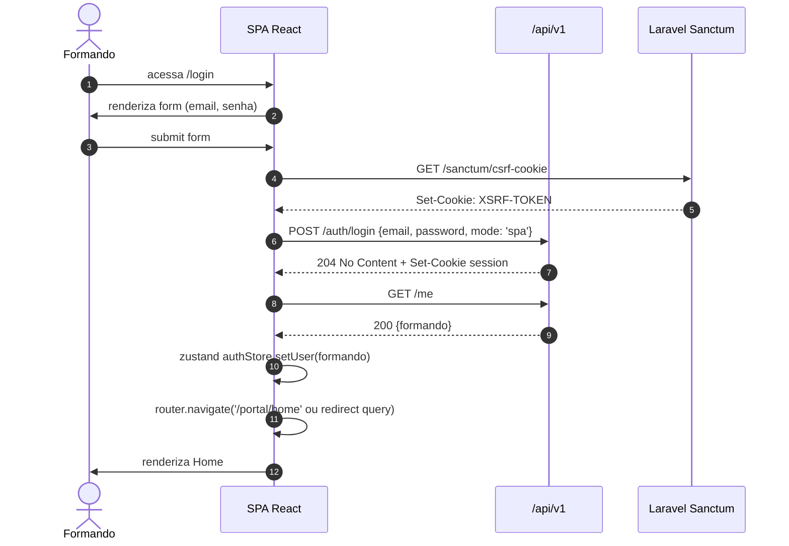
```mermaid
sequenceDiagram
    autonumber
    actor U as Formando
    participant SPA as SPA React
    participant API as /api/v1
    participant Sanctum as Laravel Sanctum

    U->>SPA: acessa /login
    SPA->>U: renderiza form (email, senha)
    U->>SPA: submit form
    SPA->>Sanctum: GET /sanctum/csrf-cookie
    Sanctum-->>SPA: Set-Cookie: XSRF-TOKEN
    SPA->>API: POST /auth/login {email, password, mode: 'spa'}
    API-->>SPA: 204 No Content + Set-Cookie session
    SPA->>API: GET /me
    API-->>SPA: 200 {formando}
    SPA->>SPA: zustand authStore.setUser(formando)
    SPA->>SPA: router.navigate('/portal/home' ou redirect query)
    SPA->>U: renderiza Home
```

### 3.2 Login com erro (credenciais inválidas)

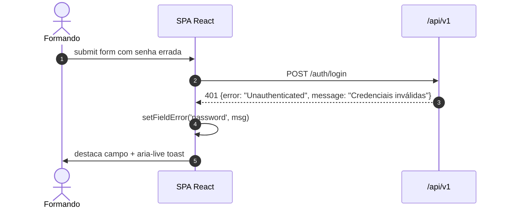
```mermaid
sequenceDiagram
    autonumber
    actor U as Formando
    participant SPA as SPA React
    participant API as /api/v1

    U->>SPA: submit form com senha errada
    SPA->>API: POST /auth/login
    API-->>SPA: 401 {error: "Unauthenticated", message: "Credenciais inválidas"}
    SPA->>SPA: setFieldError('password', msg)
    SPA->>U: destaca campo + aria-live toast
```

### 3.3 Deep link pós-login

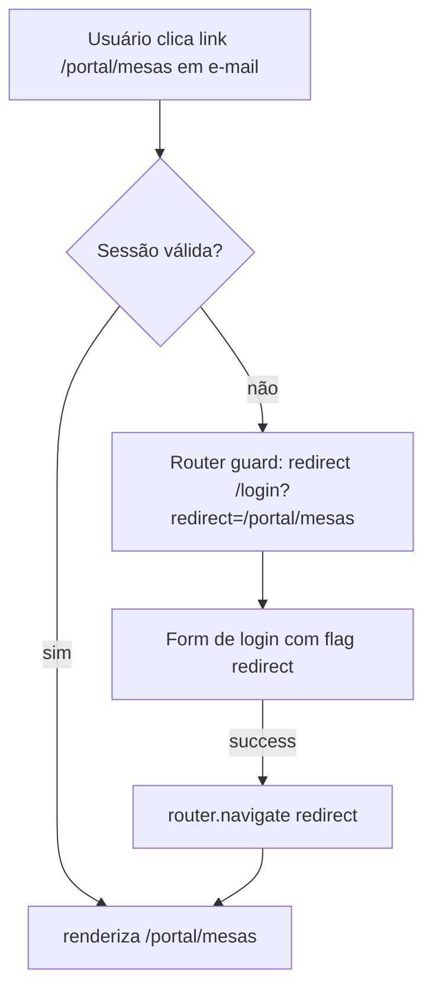
```mermaid
flowchart TD
    A[Usuário clica link /portal/mesas em e-mail] --> B{Sessão válida?}
    B -->|sim| C[renderiza /portal/mesas]
    B -->|não| D[Router guard: redirect /login?redirect=/portal/mesas]
    D --> E[Form de login com flag redirect]
    E -->|success| F[router.navigate redirect]
    F --> C
```

### 3.4 Logout

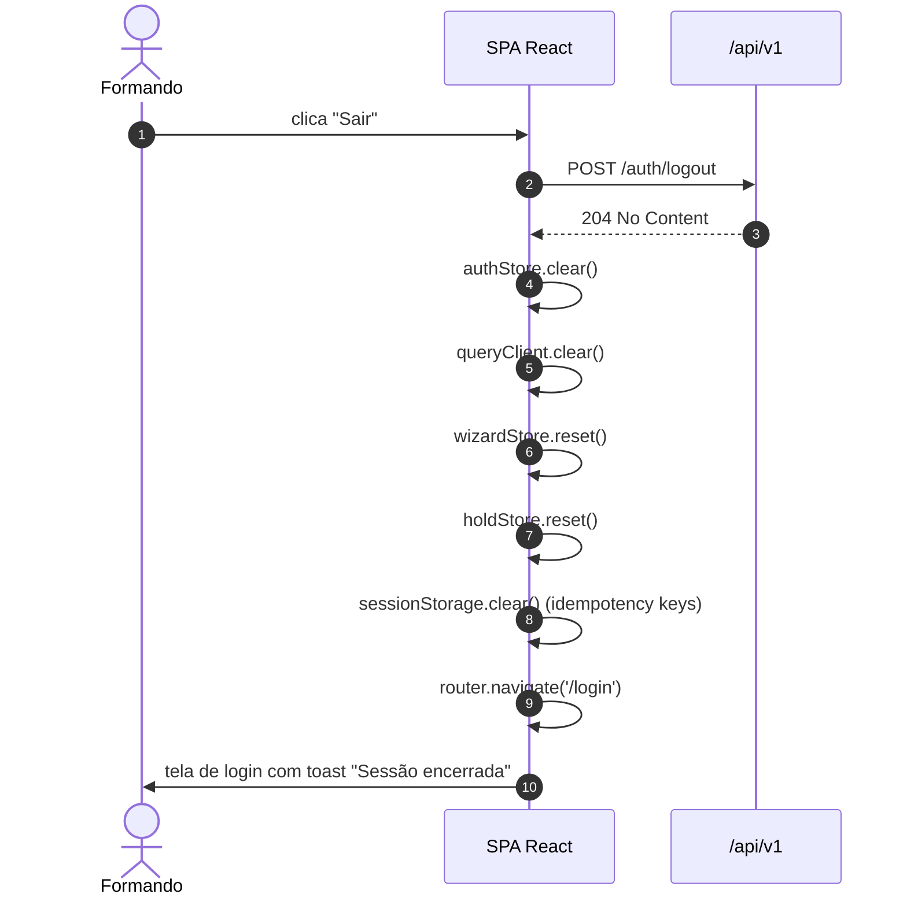
```mermaid
sequenceDiagram
    autonumber
    actor U as Formando
    participant SPA as SPA React
    participant API as /api/v1

    U->>SPA: clica "Sair"
    SPA->>API: POST /auth/logout
    API-->>SPA: 204 No Content
    SPA->>SPA: authStore.clear()
    SPA->>SPA: queryClient.clear()
    SPA->>SPA: wizardStore.reset()
    SPA->>SPA: holdStore.reset()
    SPA->>SPA: sessionStorage.clear() (idempotency keys)
    SPA->>SPA: router.navigate('/login')
    SPA->>U: tela de login com toast "Sessão encerrada"
```

### 3.5 401 em rota protegida (sessão expirada)

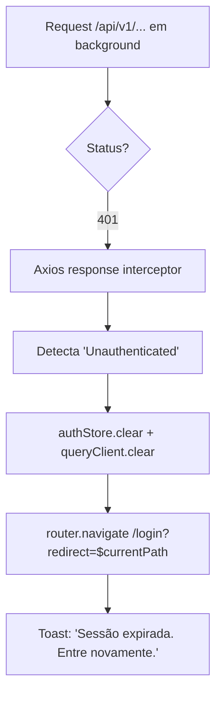
```mermaid
flowchart TD
    A[Request /api/v1/... em background] --> B{Status?}
    B -->|401| C[Axios response interceptor]
    C --> D[Detecta 'Unauthenticated']
    D --> E[authStore.clear + queryClient.clear]
    E --> F[router.navigate /login?redirect=$currentPath]
    F --> G[Toast: 'Sessão expirada. Entre novamente.']
```

### 3.6 Tratamento do CSRF token

- Sempre antes de qualquer POST/PATCH/DELETE, axios lê o cookie `XSRF-TOKEN` e envia no header `X-XSRF-TOKEN`. ✅
- Se 419 CSRF mismatch ocorrer, interceptor refaz `GET /sanctum/csrf-cookie` e retenta uma vez. 💡
- `withCredentials: true` está configurado globalmente no cliente axios. ✅

---

## §4 — Fluxo Wizard Adesão (7 etapas)

### 4.1 Máquina de estado do wizard

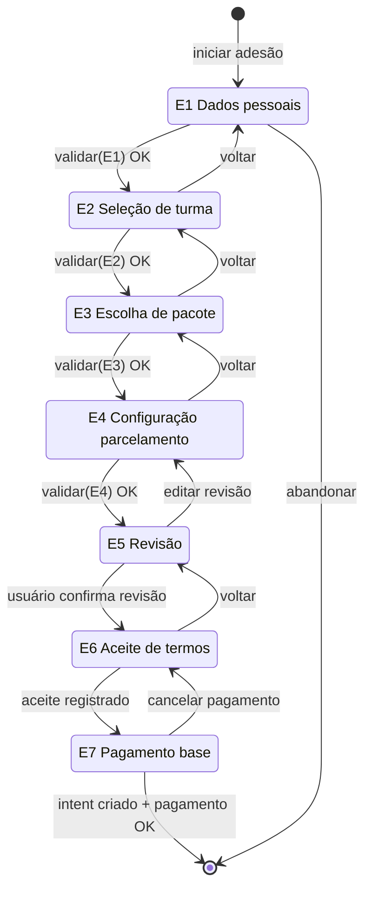
```mermaid
stateDiagram-v2
    [*] --> E1: iniciar adesão
    E1: E1 Dados pessoais
    E2: E2 Seleção de turma
    E3: E3 Escolha de pacote
    E4: E4 Configuração parcelamento
    E5: E5 Revisão
    E6: E6 Aceite de termos
    E7: E7 Pagamento base

    E1 --> E2: validar(E1) OK
    E2 --> E3: validar(E2) OK
    E3 --> E4: validar(E3) OK
    E4 --> E5: validar(E4) OK
    E5 --> E6: usuário confirma revisão
    E6 --> E7: aceite registrado
    E7 --> [*]: intent criado + pagamento OK

    E1 --> [*]: abandonar
    E2 --> E1: voltar
    E3 --> E2: voltar
    E4 --> E3: voltar
    E5 --> E4: editar revisão
    E6 --> E5: voltar
    E7 --> E6: cancelar pagamento
```

### 4.2 Sequência de interação por etapa

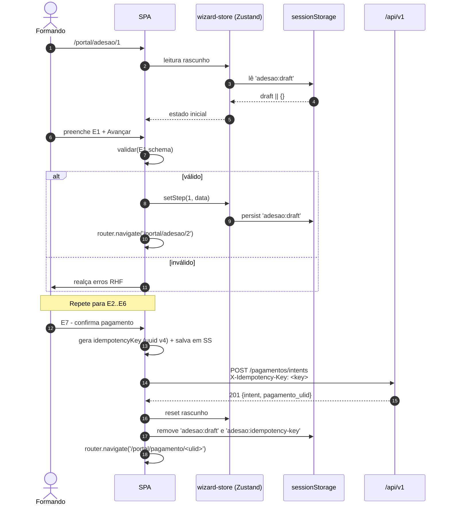
```mermaid
sequenceDiagram
    autonumber
    actor U as Formando
    participant SPA as SPA
    participant Store as wizard-store (Zustand)
    participant SS as sessionStorage
    participant API as /api/v1

    U->>SPA: /portal/adesao/1
    SPA->>Store: leitura rascunho
    Store->>SS: lê 'adesao:draft'
    SS-->>Store: draft || {}
    Store-->>SPA: estado inicial

    U->>SPA: preenche E1 + Avançar
    SPA->>SPA: validar(E1.schema)
    alt válido
        SPA->>Store: setStep(1, data)
        Store->>SS: persist 'adesao:draft'
        SPA->>SPA: router.navigate('/portal/adesao/2')
    else inválido
        SPA->>U: realça erros RHF
    end

    Note over U,SPA: Repete para E2..E6

    U->>SPA: E7 - confirma pagamento
    SPA->>SPA: gera idempotencyKey (uuid v4) + salva em SS
    SPA->>API: POST /pagamentos/intents<br/>X-Idempotency-Key: <key>
    API-->>SPA: 201 {intent, pagamento_ulid}
    SPA->>Store: reset rascunho
    SPA->>SS: remove 'adesao:draft' e 'adesao:idempotency-key'
    SPA->>SPA: router.navigate('/portal/pagamento/<ulid>')
```

### 4.3 Campos por etapa (alto nível — detalhe técnico no SRS §3)

| Etapa | Componentes principais                                | Endpoints consumidos                                         |
| ----- | ----------------------------------------------------- | ------------------------------------------------------------ |
| E1    | CPF (máscara 000.000.000-00), telefone, nome completo | — (só client-side)                                           |
| E2    | Select turma                                          | `GET /me/eventos` ✅                                         |
| E3    | Radio/card de pacotes com preços                      | `GET /eventos/{ulid}/pacotes` ✅ _(endpoint a confirmar ❓)_ |
| E4    | Slider/select número de parcelas + simulação          | — (cálculo client-side via tabela da API)                    |
| E5    | Resumo read-only de E1..E4 com botão "editar"         | —                                                            |
| E6    | Scroll de termos + checkbox "li e aceito"             | — (texto vem de E3)                                          |
| E7    | Método (boleto/pix/cartão) + confirmação              | `POST /pagamentos/intents` ✅                                |

### 4.4 Estados da tela Wizard

| Estado                   | Visual                                | Trigger                     |
| ------------------------ | ------------------------------------- | --------------------------- |
| **empty**                | form vazio                            | primeira entrada, sem draft |
| **loading turma/pacote** | skeleton em select                    | aguardando GET              |
| **preenchido (draft)**   | form com dados de sessionStorage      | usuário retomou rascunho    |
| **validação falhou**     | campos destacados + mensagens PT-BR   | Zod error                   |
| **salvando etapa**       | botão "Avançar" com spinner           | durante post (se houver)    |
| **erro servidor**        | banner erro + CTA "tentar novamente"  | 5xx                         |
| **success final**        | redirect para /portal/pagamento/$ulid | E7 OK                       |

### 4.5 Regras de persistência do draft

- Chave sessionStorage: `adesao:draft` (JSON serializado da store).
- TTL implícito: sessão do navegador. 💡
- Ao concluir E7 com sucesso, limpar draft + idempotency key.
- Se o usuário abandonar e voltar em outra sessão, o draft é perdido (comportamento aceito para MVP). 💡

### 4.6 Idempotência no wizard

- Idempotency key gerada uma única vez no início de E7 e guardada em `sessionStorage` sob `adesao:idempotency-key`. ✅
- Se o usuário clicar "Confirmar" mais de uma vez (duplo clique, refresh), o servidor responde com a mesma intent (200) e evita cobrança duplicada. ✅

---

## §5 — Fluxo Financeiro + Pagamento

### 5.1 Visão geral

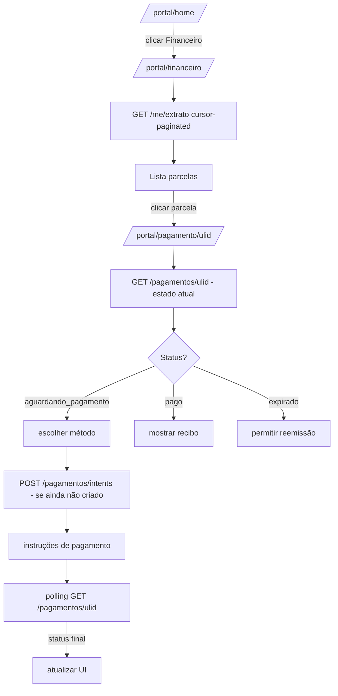
```mermaid
flowchart TD
    A[/portal/home/] -->|clicar Financeiro| B[/portal/financeiro/]
    B --> B1[GET /me/extrato cursor-paginated]
    B1 --> C[Lista parcelas]
    C -->|clicar parcela| D[/portal/pagamento/ulid/]
    D --> D1[GET /pagamentos/ulid - estado atual]
    D1 --> E{Status?}
    E -->|aguardando_pagamento| F[escolher método]
    E -->|pago| G[mostrar recibo]
    E -->|expirado| H[permitir reemissão]
    F --> F1[POST /pagamentos/intents - se ainda não criado]
    F1 --> I[instruções de pagamento]
    I --> J[polling GET /pagamentos/ulid]
    J -->|status final| K[atualizar UI]
```

### 5.2 Sequência — criar intent de pagamento

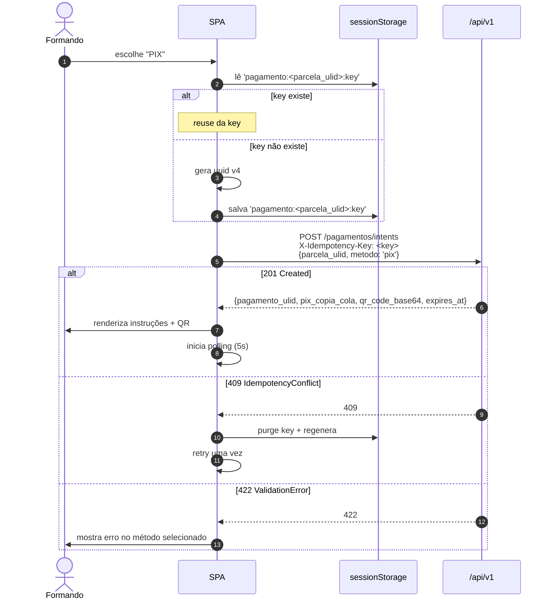
```mermaid
sequenceDiagram
    autonumber
    actor U as Formando
    participant SPA as SPA
    participant SS as sessionStorage
    participant API as /api/v1

    U->>SPA: escolhe "PIX"
    SPA->>SS: lê 'pagamento:<parcela_ulid>:key'
    alt key existe
        Note over SPA: reuse da key
    else key não existe
        SPA->>SPA: gera uuid v4
        SPA->>SS: salva 'pagamento:<parcela_ulid>:key'
    end
    SPA->>API: POST /pagamentos/intents<br/>X-Idempotency-Key: <key><br/>{parcela_ulid, metodo: 'pix'}
    alt 201 Created
        API-->>SPA: {pagamento_ulid, pix_copia_cola, qr_code_base64, expires_at}
        SPA->>U: renderiza instruções + QR
        SPA->>SPA: inicia polling (5s)
    else 409 IdempotencyConflict
        API-->>SPA: 409
        SPA->>SS: purge key + regenera
        SPA->>SPA: retry uma vez
    else 422 ValidationError
        API-->>SPA: 422
        SPA->>U: mostra erro no método selecionado
    end
```

### 5.3 Polling status de pagamento

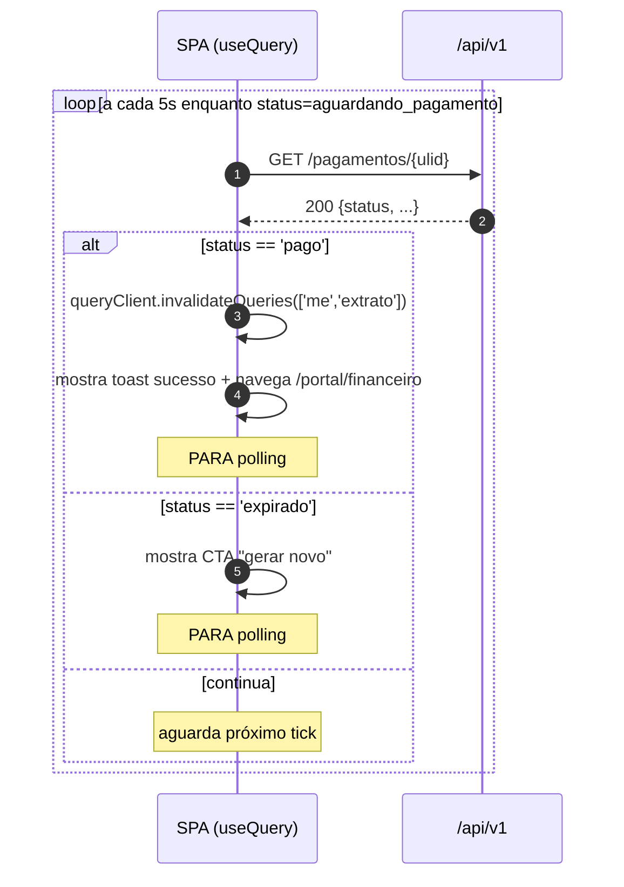
```mermaid
sequenceDiagram
    autonumber
    participant SPA as SPA (useQuery)
    participant API as /api/v1

    loop a cada 5s enquanto status=aguardando_pagamento
        SPA->>API: GET /pagamentos/{ulid}
        API-->>SPA: 200 {status, ...}
        alt status == 'pago'
            SPA->>SPA: queryClient.invalidateQueries(['me','extrato'])
            SPA->>SPA: mostra toast sucesso + navega /portal/financeiro
            Note over SPA: PARA polling
        else status == 'expirado'
            SPA->>SPA: mostra CTA "gerar novo"
            Note over SPA: PARA polling
        else continua
            Note over SPA: aguarda próximo tick
        end
    end
```

- `refetchInterval` do TanStack Query: `5_000` ms enquanto `status === 'aguardando_pagamento'`; `false` caso contrário. ✅
- Stop automático após 30 min de polling ativo (fallback visual "clique para atualizar"). 💡

### 5.4 Estados da tela Pagamento

| Estado                   | Método PIX                      | Método Boleto                   | Método Cartão                    |
| ------------------------ | ------------------------------- | ------------------------------- | -------------------------------- |
| empty                    | "Gere seu código"               | "Gere seu boleto"               | "Informe os dados"               |
| loading (criando intent) | spinner + msg                   | spinner + msg                   | spinner + msg                    |
| pronto para pagar        | QR + copia-cola + timer         | PDF download + linha digitável  | form 3DS                         |
| polling ativo            | banner "aguardando pagamento"   | banner "aguardando compensação" | modal processando                |
| pago                     | check + recibo                  | check + recibo                  | check + recibo                   |
| falhou                   | banner erro + CTA "tentar novo" | banner erro + CTA reemitir      | erro por código (ex: 3DS falhou) |
| expirado                 | CTA "gerar novo"                | CTA "reemitir"                  | CTA "tentar novamente"           |

### 5.5 Extrato financeiro — cursor pagination

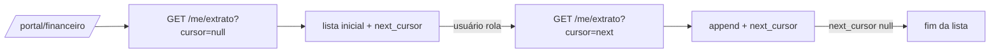
```mermaid
flowchart LR
    A[/portal/financeiro/] --> B[GET /me/extrato?cursor=null]
    B --> C[lista inicial + next_cursor]
    C -->|usuário rola| D[GET /me/extrato?cursor=next]
    D --> E[append + next_cursor]
    E -->|next_cursor null| F[fim da lista]
```

- Infinite query via `useInfiniteQuery` do TanStack Query v5. ✅
- `getNextPageParam: lastPage => lastPage.next_cursor ?? undefined`. ✅
- Sem contador total (API não fornece). 💡

---

## §6 — Fluxo Convites

### 6.1 Visão geral

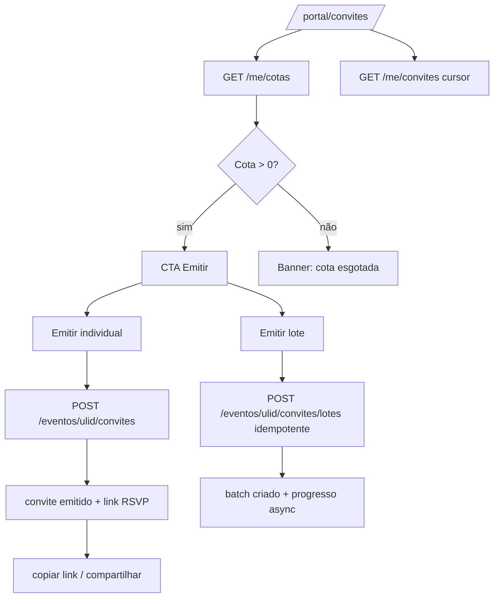
```mermaid
flowchart TD
    A[/portal/convites/] --> A1[GET /me/cotas]
    A --> A2[GET /me/convites cursor]
    A1 --> B{Cota > 0?}
    B -->|sim| C[CTA Emitir]
    B -->|não| D[Banner: cota esgotada]
    C --> C1[Emitir individual]
    C --> C2[Emitir lote]
    C1 --> E[POST /eventos/ulid/convites]
    C2 --> F[POST /eventos/ulid/convites/lotes idempotente]
    E --> G[convite emitido + link RSVP]
    F --> H[batch criado + progresso async]
    G --> I[copiar link / compartilhar]
```

### 6.2 Emissão individual

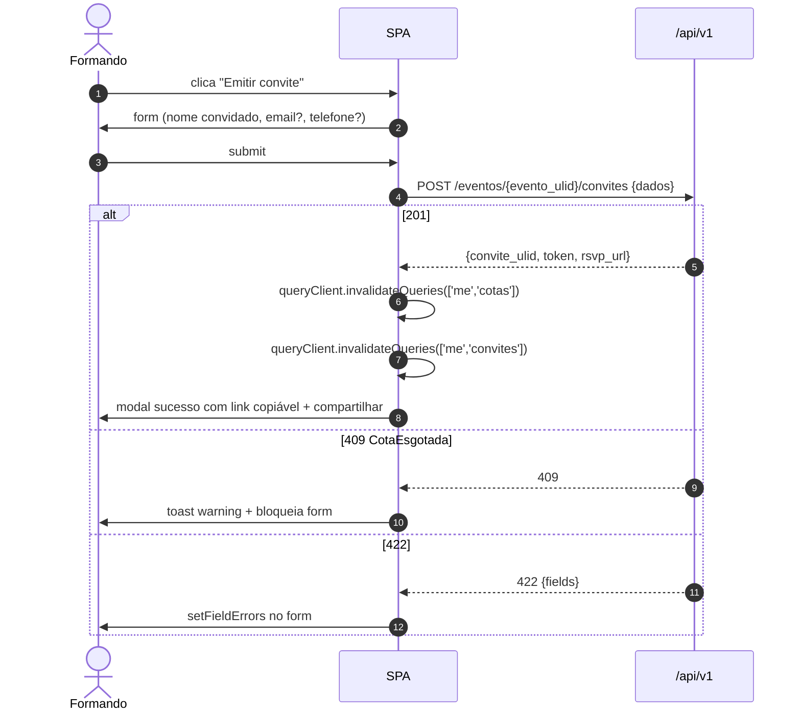
```mermaid
sequenceDiagram
    autonumber
    actor U as Formando
    participant SPA as SPA
    participant API as /api/v1

    U->>SPA: clica "Emitir convite"
    SPA->>U: form (nome convidado, email?, telefone?)
    U->>SPA: submit
    SPA->>API: POST /eventos/{evento_ulid}/convites {dados}
    alt 201
        API-->>SPA: {convite_ulid, token, rsvp_url}
        SPA->>SPA: queryClient.invalidateQueries(['me','cotas'])
        SPA->>SPA: queryClient.invalidateQueries(['me','convites'])
        SPA->>U: modal sucesso com link copiável + compartilhar
    else 409 CotaEsgotada
        API-->>SPA: 409
        SPA->>U: toast warning + bloqueia form
    else 422
        API-->>SPA: 422 {fields}
        SPA->>U: setFieldErrors no form
    end
```

### 6.3 Emissão em lote

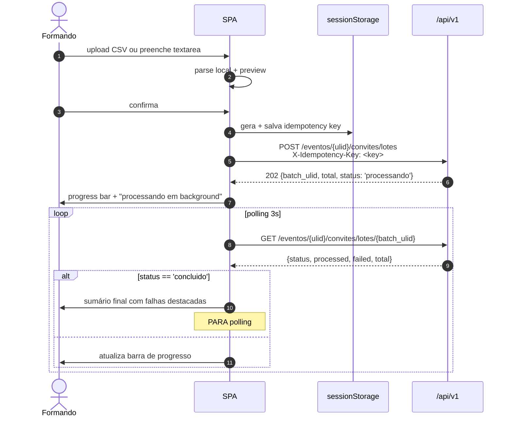
```mermaid
sequenceDiagram
    autonumber
    actor U as Formando
    participant SPA as SPA
    participant SS as sessionStorage
    participant API as /api/v1

    U->>SPA: upload CSV ou preenche textarea
    SPA->>SPA: parse local + preview
    U->>SPA: confirma
    SPA->>SS: gera + salva idempotency key
    SPA->>API: POST /eventos/{ulid}/convites/lotes<br/>X-Idempotency-Key: <key>
    API-->>SPA: 202 {batch_ulid, total, status: 'processando'}
    SPA->>U: progress bar + "processando em background"
    loop polling 3s
        SPA->>API: GET /eventos/{ulid}/convites/lotes/{batch_ulid}
        API-->>SPA: {status, processed, failed, total}
        alt status == 'concluido'
            SPA->>U: sumário final com falhas destacadas
            Note over SPA: PARA polling
        else
            SPA->>U: atualiza barra de progresso
        end
    end
```

> `GET /eventos/{ulid}/convites/lotes/{batch_ulid}` pressupõe endpoint de status — ❓ confirmar com backend.

### 6.4 Estados da tela Convites

| Estado                      | Descrição                                                 |
| --------------------------- | --------------------------------------------------------- |
| loading                     | skeleton cards                                            |
| empty (nunca emitiu)        | ilustração + CTA primário "emitir primeiro"               |
| lista com itens             | cards de convites + status (pendente/confirmado/recusado) |
| cota esgotada               | banner warning no topo + CTA desabilitado                 |
| emissão em progresso (lote) | progress bar fixo no topo                                 |
| erro                        | toast + manter estado anterior                            |

---

## §7 — Fluxo RSVP Público

### 7.1 Característica crítica

A rota `/rsvp/$token` é **pública** — não usa `authStore`, não carrega `AppShell`, não exige cookie de sessão. Tem shell mínimo (logo + página central). ✅

### 7.2 Fluxo principal

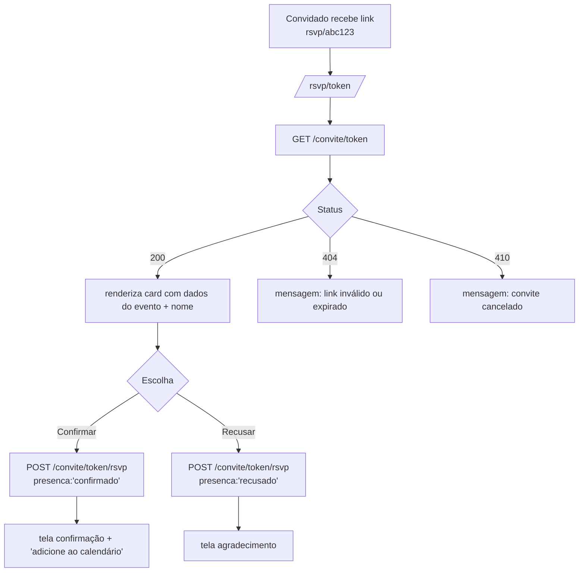
```mermaid
flowchart TD
    A[Convidado recebe link<br/>rsvp/abc123] --> B[/rsvp/token/]
    B --> C[GET /convite/token]
    C --> D{Status}
    D -->|200| E[renderiza card com dados do evento + nome]
    D -->|404| F[mensagem: link inválido ou expirado]
    D -->|410| G[mensagem: convite cancelado]
    E --> H{Escolha}
    H -->|Confirmar| I[POST /convite/token/rsvp<br/>presenca:'confirmado']
    H -->|Recusar| J[POST /convite/token/rsvp<br/>presenca:'recusado']
    I --> K[tela confirmação + 'adicione ao calendário']
    J --> L[tela agradecimento]
```

### 7.3 Sequência

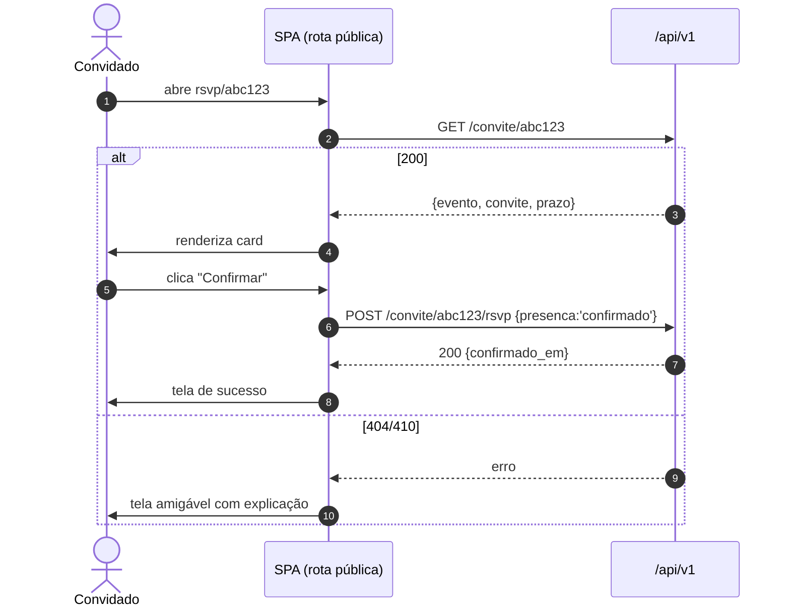
```mermaid
sequenceDiagram
    autonumber
    actor C as Convidado
    participant SPA as SPA (rota pública)
    participant API as /api/v1

    C->>SPA: abre rsvp/abc123
    SPA->>API: GET /convite/abc123
    alt 200
        API-->>SPA: {evento, convite, prazo}
        SPA->>C: renderiza card
        C->>SPA: clica "Confirmar"
        SPA->>API: POST /convite/abc123/rsvp {presenca:'confirmado'}
        API-->>SPA: 200 {confirmado_em}
        SPA->>C: tela de sucesso
    else 404/410
        API-->>SPA: erro
        SPA->>C: tela amigável com explicação
    end
```

### 7.4 Estados

| Estado                  | Visual                                                          |
| ----------------------- | --------------------------------------------------------------- |
| carregando              | skeleton do card central                                        |
| válido (pendente)       | card com 2 botões (Confirmar / Recusar) + info do evento        |
| válido (já respondeu)   | card read-only com status atual + opção "alterar"               |
| token inválido/expirado | mensagem amigável + sugestão de contatar o formando             |
| sucesso confirmação     | check grande + "adicionar ao calendário" (.ics)                 |
| sucesso recusa          | mensagem "resposta registrada" + opção reverter dentro de prazo |

### 7.5 Restrições explícitas

- Sem `useAuthStore`. ✅
- Sem header/bottom nav. 💡
- Sem persistência em sessionStorage (stateless).
- Link é de uso único do convidado; não usar idempotency key (POST é idempotente no servidor por token). ✅

---

## §8 — Fluxo Mapa de Mesas (crítico)

> Ver [ADR-006 — Polling 5s no Mapa de Mesas (MVP)](./06-ADR/ADR-006-polling-5s-mapa-mesas-mvp.md) e [Technical Design](./09-TECHNICAL-DESIGN-CRITICAL-MODULES.md) para racional completo.

### 8.1 Máquina de estado do hold

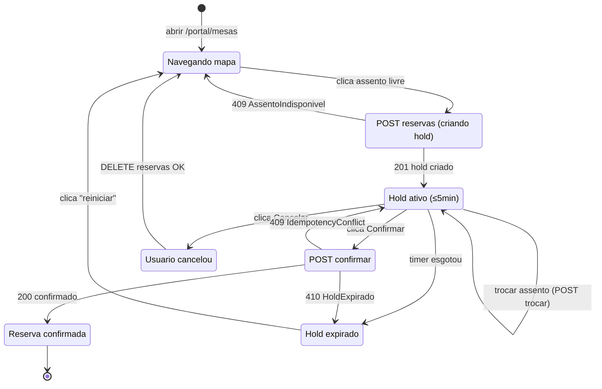
```mermaid
stateDiagram-v2
    [*] --> Navegando: abrir /portal/mesas
    Navegando: Navegando mapa
    Reservando: POST reservas (criando hold)
    HoldAtivo: Hold ativo (≤5min)
    Confirmando: POST confirmar
    Confirmado: Reserva confirmada
    Expirado: Hold expirado
    Cancelado: Usuario cancelou

    Navegando --> Reservando: clica assento livre
    Reservando --> HoldAtivo: 201 hold criado
    Reservando --> Navegando: 409 AssentoIndisponivel
    HoldAtivo --> Confirmando: clica Confirmar
    HoldAtivo --> Expirado: timer esgotou
    HoldAtivo --> Cancelado: clica Cancelar
    HoldAtivo --> HoldAtivo: trocar assento (POST trocar)
    Confirmando --> Confirmado: 200 confirmado
    Confirmando --> HoldAtivo: 409 IdempotencyConflict
    Confirmando --> Expirado: 410 HoldExpirado
    Confirmado --> [*]
    Expirado --> Navegando: clica "reiniciar"
    Cancelado --> Navegando: DELETE reservas OK
```

### 8.2 Fluxo de reserva

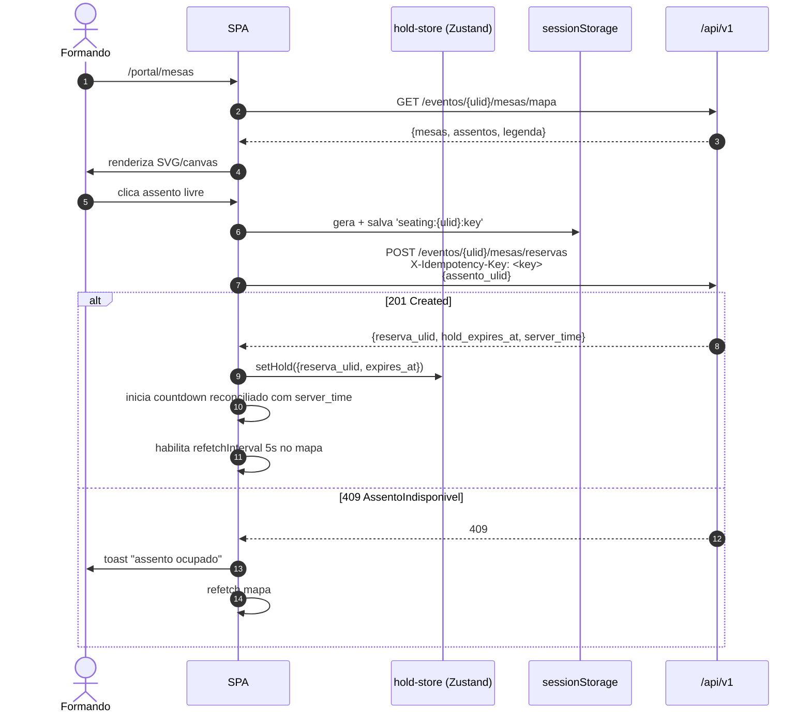
```mermaid
sequenceDiagram
    autonumber
    actor U as Formando
    participant SPA as SPA
    participant HS as hold-store (Zustand)
    participant SS as sessionStorage
    participant API as /api/v1

    U->>SPA: /portal/mesas
    SPA->>API: GET /eventos/{ulid}/mesas/mapa
    API-->>SPA: {mesas, assentos, legenda}
    SPA->>U: renderiza SVG/canvas

    U->>SPA: clica assento livre
    SPA->>SS: gera + salva 'seating:{ulid}:key'
    SPA->>API: POST /eventos/{ulid}/mesas/reservas<br/>X-Idempotency-Key: <key><br/>{assento_ulid}
    alt 201 Created
        API-->>SPA: {reserva_ulid, hold_expires_at, server_time}
        SPA->>HS: setHold({reserva_ulid, expires_at})
        SPA->>SPA: inicia countdown reconciliado com server_time
        SPA->>SPA: habilita refetchInterval 5s no mapa
    else 409 AssentoIndisponivel
        API-->>SPA: 409
        SPA->>U: toast "assento ocupado"
        SPA->>SPA: refetch mapa
    end
```

### 8.3 Hold timer reconciliado

```mermaid
sequenceDiagram
    autonumber
    participant SPA as SPA
    participant API as /api/v1

    Note over SPA: hold iniciado
    SPA->>SPA: calcular offset = server_time - Date.now()
    loop a cada 1s (UI)
        SPA->>SPA: restante = expires_at - (Date.now() + offset)
        alt restante <= 0
            SPA->>SPA: dispara HoldExpirado local
            SPA->>SPA: holdStore.reset()
        end
    end
    loop a cada 5s (refetch mapa)
        SPA->>API: GET /mesas/mapa
        API-->>SPA: {...}
        Note over SPA: reconcilia estado; se hold sumiu, invalida localmente
    end
```

### 8.4 Confirmação de reserva

```mermaid
sequenceDiagram
    autonumber
    actor U as Formando
    participant SPA as SPA
    participant SS as sessionStorage
    participant API as /api/v1

    U->>SPA: clica "Confirmar assento"
    SPA->>API: POST /eventos/{ulid}/mesas/reservas/{reserva_ulid}/confirmar<br/>X-Idempotency-Key: <key>
    alt 200
        API-->>SPA: {reserva: confirmada}
        SPA->>SS: remove 'seating:{ulid}:key'
        SPA->>SPA: holdStore.reset()
        SPA->>SPA: invalidate queries ['mesas','mapa']
        SPA->>U: toast sucesso + selo "reservado"
    else 410 HoldExpirado
        API-->>SPA: 410
        SPA->>SS: purga key
        SPA->>U: toast crítico + refetch mapa
    else 409 AssentoIndisponivel
        API-->>SPA: 409
        SPA->>U: toast + refetch
    end
```

### 8.5 Troca de assento

```mermaid
flowchart TD
    A[Hold ativo no assento X] --> B[clica outro assento Y]
    B --> C{Y livre?}
    C -->|sim| D[POST reservas/ulid/trocar idempotente]
    D --> E{200?}
    E -->|sim| F[hold migrado; countdown mantém restante]
    E -->|409 AssentoIndisponivel| G[toast + refetch mapa + manter hold X]
    E -->|410 HoldExpirado| H[reset hold + banner]
```

### 8.6 Cancelamento explícito

```mermaid
sequenceDiagram
    autonumber
    actor U as Formando
    participant SPA as SPA
    participant API as /api/v1

    U->>SPA: clica "Cancelar reserva"
    SPA->>U: confirm modal
    U->>SPA: confirma
    SPA->>API: DELETE /eventos/{ulid}/mesas/reservas/{reserva_ulid}
    API-->>SPA: 204
    SPA->>SPA: holdStore.reset()
    SPA->>SPA: invalidate ['mesas','mapa']
    SPA->>U: toast "reserva cancelada"
```

### 8.7 Estados visuais do mapa

| Assento status     | Cor                    | Interação                              |
| ------------------ | ---------------------- | -------------------------------------- |
| livre              | verde claro            | clicável → tentar reservar             |
| em hold (outro)    | amarelo (com cadeado)  | não clicável + tooltip "reservando..." |
| em hold (meu)      | azul brilhante + timer | clicável → confirmar ou trocar         |
| confirmado (outro) | cinza                  | não clicável                           |
| confirmado (meu)   | verde escuro + selo    | não clicável                           |
| bloqueado (admin)  | vermelho hachurado     | não clicável + tooltip motivo          |

### 8.8 Responsividade do mapa

- **Mobile:** pinch-zoom + pan horizontal/vertical; painel lateral colapsa em sheet bottom.
- **Desktop:** vista completa centralizada; zoom via scroll; painel lateral fixo à direita.
- Scroll da página é desativado dentro do canvas via `touch-action: none`. 💡

---

## §9 — Fluxo Extras e Enquetes

### 9.1 Extras — catálogo e pedido

```mermaid
flowchart TD
    A[/portal/extras/] --> A1[GET /eventos/ulid/extras/catalogo]
    A1 --> B[lista de produtos extras com preço]
    B --> C[adicionar item ao carrinho]
    C --> D[revisar pedido]
    D --> E[POST /eventos/ulid/extras/pedidos idempotente]
    E --> F{201?}
    F -->|sim| G[redirect /portal/pagamento/ulid intent]
    F -->|422| H[erro validação nos itens]
```

### 9.2 Sequência pedido extra

```mermaid
sequenceDiagram
    autonumber
    actor U as Formando
    participant SPA as SPA
    participant SS as sessionStorage
    participant API as /api/v1

    U->>SPA: adiciona itens + clica "Finalizar"
    SPA->>SS: gera + salva 'extras:pedido:key'
    SPA->>API: POST /eventos/{ulid}/extras/pedidos<br/>X-Idempotency-Key: <key>
    API-->>SPA: 201 {pedido_ulid, pagamento_intent_ulid}
    SPA->>SPA: router.navigate(`/portal/pagamento/${intent_ulid}`)
```

### 9.3 Enquetes — listar e votar

```mermaid
flowchart TD
    A[/portal/enquetes/] --> B[GET /me/eventos + enquetes embed]
    B --> C{dentro da janela?}
    C -->|sim| D[mostrar opções votáveis]
    C -->|não, não iniciada| E[mostrar contagem regressiva]
    C -->|não, encerrada| F[mostrar resultado]
    D --> G[POST /eventos/ulid/enquetes/ulid/votos]
    G --> H[voto registrado + mostra próprio voto]
```

### 9.4 Sequência voto

```mermaid
sequenceDiagram
    autonumber
    actor U as Formando
    participant SPA as SPA
    participant API as /api/v1

    U->>SPA: escolhe opção
    SPA->>API: POST /eventos/{ulid}/enquetes/{ulid}/votos {opcao_ulid}
    alt 201 Created
        API-->>SPA: {voto_registrado_em}
        SPA->>SPA: invalidate ['me','eventos']
        SPA->>U: selo "Você votou"
    else 409 DomainError (já votou / fora da janela)
        API-->>SPA: 409
        SPA->>U: toast explicando motivo
    end
```

### 9.5 Estados

| Módulo   | Estado                  | UX                                          |
| -------- | ----------------------- | ------------------------------------------- |
| Extras   | carrinho vazio          | banner "adicione itens ao carrinho"         |
| Extras   | pedido em pagamento     | link destacado no topo "concluir pagamento" |
| Extras   | catálogo carregando     | skeleton grid                               |
| Enquetes | não iniciada            | card com data de abertura                   |
| Enquetes | aberta                  | radio buttons + botão "votar"               |
| Enquetes | votado                  | read-only + "sua escolha: X"                |
| Enquetes | encerrada com resultado | barras de % por opção                       |

---

## §10 — Estados de Tela Padronizados

### 10.1 Matriz rota × estados

| Rota                      | empty                     | loading             | error                         | success              |
| ------------------------- | ------------------------- | ------------------- | ----------------------------- | -------------------- |
| `/login`                  | form vazio                | spinner no botão    | inline no campo ou banner     | redirect             |
| `/portal/home`            | "nenhuma adesão" + CTA    | skeleton cards KPIs | banner top + retry            | dashboard populado   |
| `/portal/adesao/$step`    | form limpo                | skeleton selects    | inline + retry                | avança etapa         |
| `/portal/financeiro`      | "sem parcelas"            | skeleton rows       | banner topo                   | lista populada       |
| `/portal/pagamento/$ulid` | "criar intent"            | spinner criando     | inline por método             | confirmação + recibo |
| `/portal/convites`        | "emita primeiro convite"  | skeleton cards      | banner                        | lista populada       |
| `/portal/mesas`           | "sem evento"              | skeleton canvas     | banner + retry mapa           | mapa renderizado     |
| `/portal/extras`          | "catálogo vazio"          | skeleton grid       | banner                        | grid populado        |
| `/portal/enquetes`        | "sem enquetes ativas"     | skeleton cards      | banner                        | lista enquetes       |
| `/portal/perfil`          | form preenchido com `/me` | skeleton form       | inline                        | toast salvo          |
| `/rsvp/$token`            | —                         | skeleton card       | tela amigável "link inválido" | confirmação/recusa   |

### 10.2 Regras de UX por estado

#### empty

- Sempre ter ilustração + mensagem + CTA primário.
- Exemplos: "Você ainda não emitiu nenhum convite." + botão "Emitir primeiro".
- Evitar estados vazios "em branco" sem ação sugerida.

#### loading

- Spinner para ações < 200ms (ex: clique num botão).
- Skeleton para conteúdo > 200ms (lista, canvas, cards).
- `aria-busy="true"` no container durante load. 💡
- Nunca bloquear a tela inteira — manter navegação disponível.

#### error

- ErrorBoundary por rota (fallback UI) + retry CTA. ✅
- Em dev: mostrar `request_id` do envelope de erro. ✅
- Em prod: apenas mensagem PT-BR + botão retry.
- Se 401 ou 403: não mostrar ErrorBoundary; tratar no interceptor Axios.

#### success

- Toast PT-BR auto-dismiss em 5s + `aria-live="polite"`. 💡
- Atualização otimista quando seguro (ex: votar em enquete).
- Rollback em caso de falha do POST otimista.

### 10.3 Catálogo de toasts

| Tipo    | Usa cor  | Ícone            | Uso típico                                             |
| ------- | -------- | ---------------- | ------------------------------------------------------ |
| success | verde    | `check-circle`   | ação concluída (pagamento OK, reserva confirmada)      |
| warning | âmbar    | `alert-triangle` | cota esgotada, sessão prestes a expirar                |
| error   | vermelho | `alert-octagon`  | erro de rede/servidor, hold expirado                   |
| info    | azul     | `info`           | "polling de pagamento ativo", "aguardando compensação" |

---

## §11 — Responsividade

### 11.1 Breakpoints (alinhados com Tamagui / Tailwind 4)

| Nome | Faixa           | Uso principal  |
| ---- | --------------- | -------------- |
| `xs` | 320px - 479px   | mobile pequeno |
| `sm` | 480px - 767px   | mobile         |
| `md` | 768px - 1023px  | tablet         |
| `lg` | 1024px - 1279px | desktop        |
| `xl` | ≥ 1280px        | desktop amplo  |

### 11.2 Alterações de layout por breakpoint

| Elemento           | xs/sm (< 768)                 | md (768-1023)              | lg/xl (≥ 1024)        |
| ------------------ | ----------------------------- | -------------------------- | --------------------- |
| Navegação primária | BottomNav                     | BottomNav                  | Sidebar               |
| Header             | minimal (logo + menu)         | logo + título módulo       | logo + título + busca |
| Wizard adesão      | 1 coluna, sticky progress top | 1 coluna + progress side   | 2 colunas             |
| Financeiro         | lista card (vertical)         | lista card                 | tabela densa          |
| Mapa mesas         | pan/zoom + sheet bottom       | pan/zoom + painel inferior | mapa + painel lateral |
| Extras             | grid 1 coluna                 | grid 2 colunas             | grid 3-4 colunas      |
| Convites           | lista card                    | tabela                     | tabela + filtros side |
| Pagamento          | passos empilhados             | 2 colunas (info + ação)    | 2 colunas             |

### 11.3 Orientação

- Landscape mobile é suportado. Mapa de mesas ganha prioridade nessa orientação (vista expandida). 💡
- Portrait tablet prioriza 1 coluna com painel lateral collapse. 💡

---

## §12 — Acessibilidade (macro)

> Detalhamento de RNF está em [`04-FRONTEND-SRS.md`](./04-FRONTEND-SRS.md) §8 e §11.

### 12.1 Princípios

1. Semântica HTML nativa antes de ARIA (`<button>`, `<nav>`, `<main>`).
2. Foco visível em todos os elementos interativos — outline Tamagui + high-contrast.
3. Ordem de tab previsível, seguindo o fluxo visual.
4. `aria-live="polite"` em toasts; `aria-live="assertive"` em erros críticos (hold expirado, pagamento falhou).
5. Skip links no topo ("pular para conteúdo").
6. Contraste mínimo 4.5:1 (texto) e 3:1 (componentes gráficos) — WCAG 2.1 AA. ✅
7. Alt text em todas as imagens informativas; `alt=""` em decorativas.
8. Rotulagem explícita: `<label for=...>` ou `aria-labelledby`.
9. Form errors com `aria-invalid="true"` + `aria-describedby` apontando para mensagem.
10. Diálogos modais gerenciam foco (trap) e restauram no fechamento.

### 12.2 Específico por módulo crítico

| Módulo        | Considerações A11y                                                               |
| ------------- | -------------------------------------------------------------------------------- |
| Wizard adesão | `aria-current="step"` no indicador de progresso; navegação por setas no progress |
| Mapa mesas    | alternativa em tabela/lista para leitores de tela (toggle "vista acessível")     |
| Pagamento     | QR code com `alt` descritivo + texto copia-cola sempre visível                   |
| RSVP público  | botões grandes (≥ 44×44px) com labels claros "Sim, confirmo" / "Não poderei ir"  |
| Toasts        | role="status" (polite) ou role="alert" (assertive)                               |

---

## §13 — Notificações no app

### 13.1 Dois canais

1. **Toasts transientes** — feedback imediato (save OK, erro, polling). Auto-dismiss 5s (exceto erros críticos).
2. **Inbox (sino no header)** — notificações persistentes (novo boleto emitido, convite recusado, enquete nova). 💡
    - ❓ Endpoint `/me/notificacoes` não está explicitado na API v1; validar com backend.
    - Se não houver endpoint dedicado no MVP, usar apenas toasts + badge contextual.

### 13.2 Eventos que geram notificação

| Evento                             | Canal | Persistente? | Ação CTA           |
| ---------------------------------- | ----- | ------------ | ------------------ |
| Pagamento aprovado                 | Toast | —            | "Ver recibo"       |
| Pagamento falhou                   | Toast | —            | "Tentar novamente" |
| Hold expirado                      | Toast | —            | "Recarregar mapa"  |
| Cota esgotada                      | Toast | —            | —                  |
| Novo convite RSVP confirmado       | Inbox | sim 💡       | "Ver convite"      |
| Nova enquete aberta                | Inbox | sim 💡       | "Votar agora"      |
| Boleto próximo do vencimento (D-3) | Inbox | sim 💡       | "Pagar agora"      |
| Sessão prestes a expirar           | Toast | —            | "Continuar"        |

### 13.3 Regras

- Máximo 3 toasts simultâneos na tela (fila FIFO). 💡
- Toasts críticos (erro hold, pagamento falhou) não empilham com success toasts.
- Acessível por teclado (tecla `Esc` fecha).

---

## §14 — Cross-references

- **Requisitos funcionais e não-funcionais:** [`04-FRONTEND-SRS.md`](./04-FRONTEND-SRS.md)
- **Design técnico dos módulos críticos:** [`09-TECHNICAL-DESIGN-CRITICAL-MODULES.md`](./09-TECHNICAL-DESIGN-CRITICAL-MODULES.md)
- **Polling do mapa de mesas:** [`ADR-006`](./06-ADR/ADR-006-polling-5s-mapa-mesas-mvp.md)
- **Contrato da API:** [`../api/api-contract.md`](../api/api-contract.md)
- **Envelope de erro:** [`../api/error-envelope.md`](../api/error-envelope.md)
- **Convenções gerais API:** [`../api/api-conventions.md`](../api/api-conventions.md)
- **Planejamento Frontend:** [`../prd/PLANEJAMENTO_FRONTEND_REACT.md`](../prd/PLANEJAMENTO_FRONTEND_REACT.md)

---

## §15 — Open questions

| Item                                                                 | Dono            | Bloqueante?  |
| -------------------------------------------------------------------- | --------------- | ------------ |
| Endpoint `GET /eventos/{ulid}/pacotes` para E3 do wizard — existe?   | Backend         | sim (wizard) |
| Endpoint `GET /eventos/{ulid}/convites/lotes/{batch_ulid}` de status | Backend         | sim (lote)   |
| Endpoint `GET /me/notificacoes` (inbox persistente)                  | Backend/Produto | não (MVP)    |
| Janela máxima de polling pagamento (atualmente 30min proposto)       | Produto         | não          |
| Permitir alterar RSVP depois de confirmado?                          | Produto         | não (MVP)    |
| Campos opcionais no convite (email ≠ obrigatório)?                   | Produto         | sim (form E) |
| Layout tablet landscape para mapa de mesas                           | Design          | não          |
| Mecanismo de compartilhamento do link RSVP (Web Share API?)          | Design/Eng      | não          |
| Suporte a modo escuro no MVP                                         | Design          | não          |
| I18n futuro (apenas PT-BR no MVP) — remover estruturas?              | Produto         | não          |

---

## §16 — Glossário rápido (UX)

| Termo               | Definição curta                                                           |
| ------------------- | ------------------------------------------------------------------------- |
| AppShell            | Layout raiz autenticado (Header + Sidebar/BottomNav + Outlet)             |
| BottomNav           | Barra de navegação inferior exclusiva mobile                              |
| Hold                | Reserva temporária de assento (TTL 5min) antes da confirmação             |
| Idempotency key     | UUID v4 enviado no header `X-Idempotency-Key` para POSTs sensíveis        |
| Intent de pagamento | Objeto gerado pelo backend que representa uma tentativa ativa de cobrança |
| Wizard              | Fluxo linear guiado em N etapas (adesão tem 7)                            |
| Cursor pagination   | Paginação via cursor opaco (sem `?page=`), usa `next_cursor`              |
| Optimistic update   | Atualização de UI antes da resposta do servidor (rollback se falhar)      |
