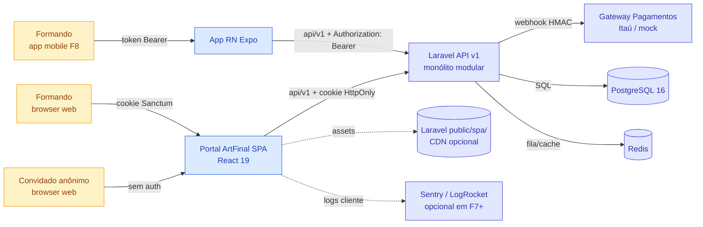
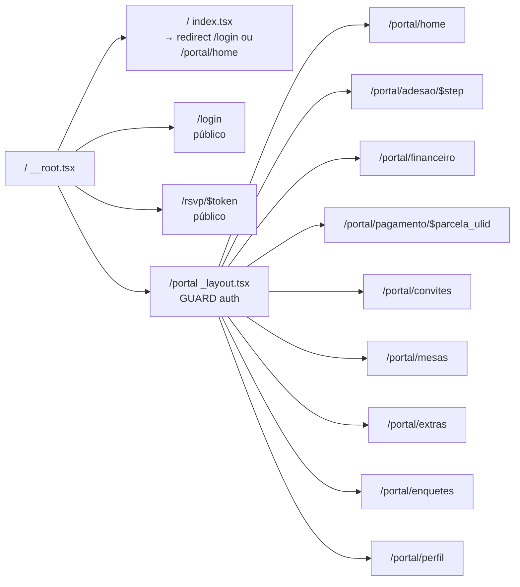
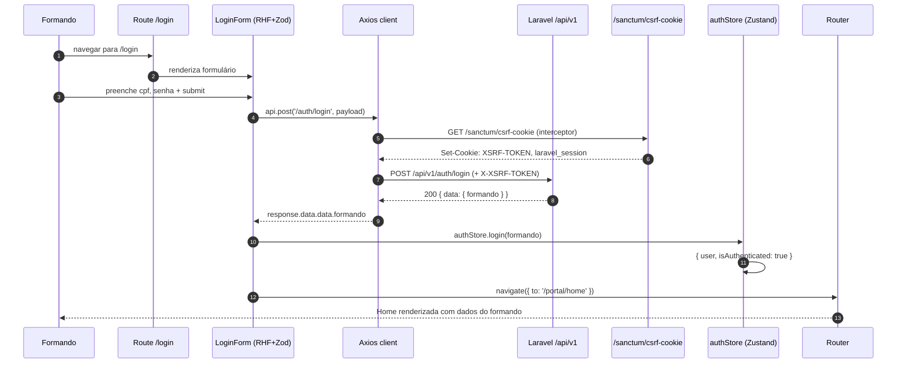
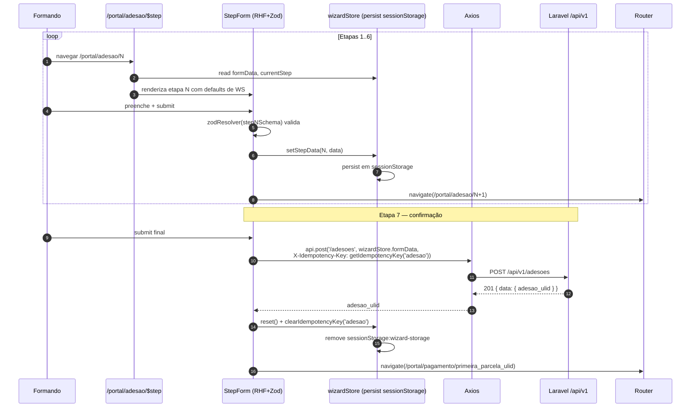
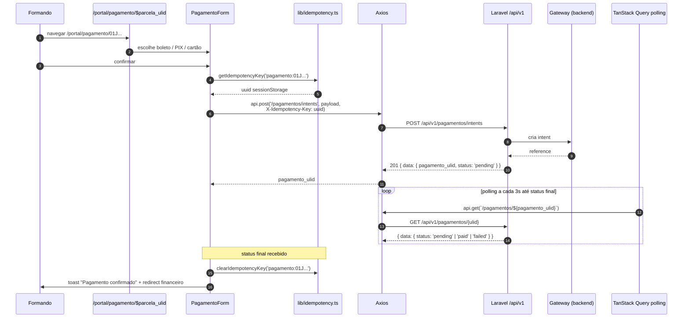
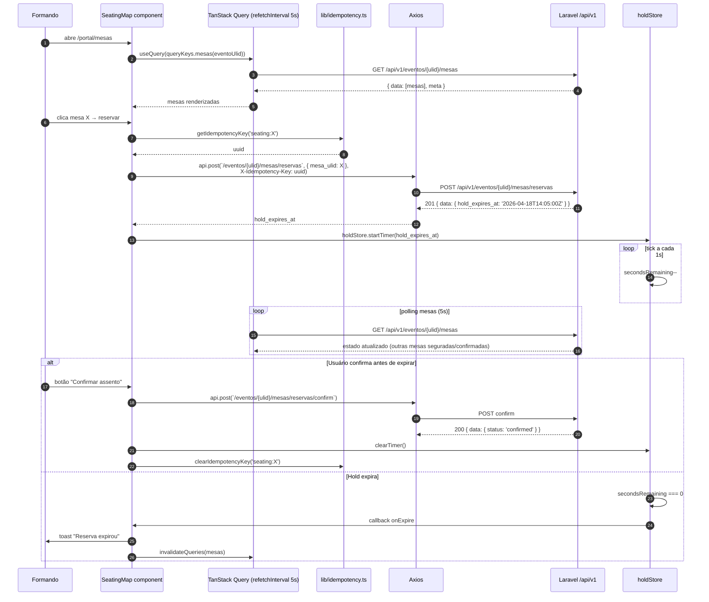
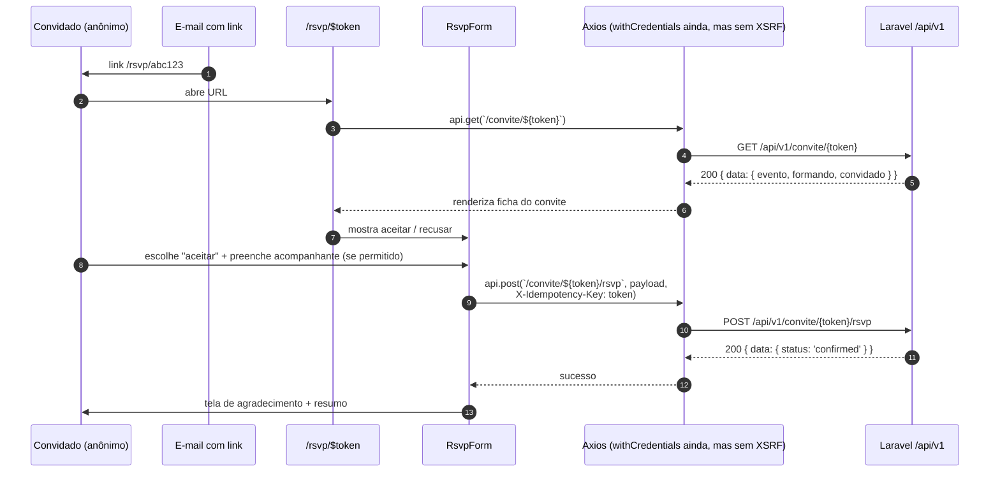
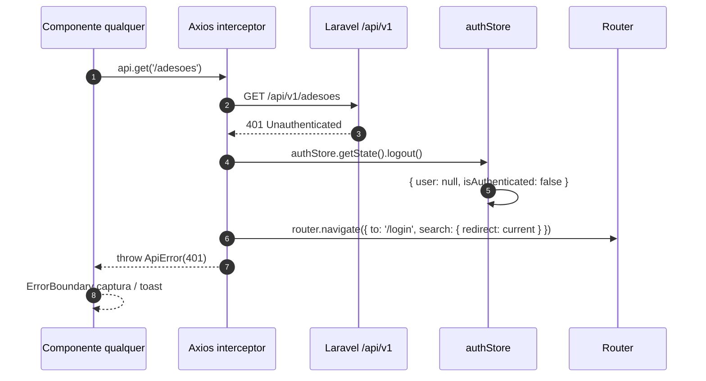
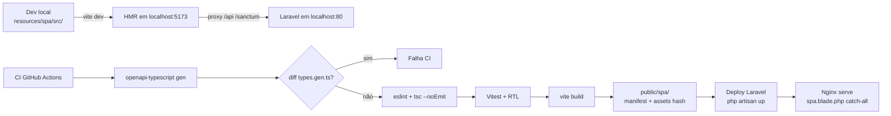

# Software Architecture Document (arc42) — Portal ArtFinal v2 • Camada Frontend

> Template: **arc42 v8 (PT-BR)**. Este documento descreve a arquitetura da camada de apresentação do Portal ArtFinal v2 — o SPA React 19 que serve o formando e o convidado público via web, e o app React Native (F8) que reutiliza a mesma design system e contrato HTTP. O documento é gêmeo do SAD backend (`docs/architecture/SAD-arc42.md`) e herda integralmente o contrato `api/v1` publicado por ele. Onde houver divergência, `docs/prd/PLANEJAMENTO_FRONTEND_REACT.md` é fonte-de-verdade e este SAD deve ser atualizado.

---

## 1. Introdução e objetivos

### 1.1 Visão geral do produto (lente frontend)

O **Portal ArtFinal v2 — SPA** é a face cliente web do sistema. Ele materializa três jornadas:

1. **Jornada do formando autenticado** — login, wizard de adesão (7 etapas), dashboard, financeiro, pagamento (boleto/PIX/cartão), carteira de convites, mapa de mesas com hold, compra de extras, enquetes e perfil.
2. **Jornada do convidado anônimo** — rota pública `/rsvp/$token` para confirmação de presença (RSVP), sem cookie de sessão, sem Sanctum.
3. **Jornada do formando mobile (F8)** — mesma API v1, mesma design system (Tamagui), autenticação por token Bearer (ADR-0003 backend + ADR-008 frontend).

O SPA **não fala** com o backend por nenhum outro caminho que não `/api/v1`. O admin é Blade/Livewire e está **fora do escopo** deste documento — há menção apenas onde há fronteira compartilhada (CSP, tokens de design, contrato).

### 1.2 Objetivos essenciais de qualidade

Ordenados por prioridade de arquitetura:

| ID  | Objetivo                                                                                                             | Métrica de sucesso                                                                            |
| --- | -------------------------------------------------------------------------------------------------------------------- | --------------------------------------------------------------------------------------------- |
| FG1 | **Cross-platform real**: o mesmo design system e os mesmos tipos de contrato funcionam no web (F3) e no mobile (F8). | 80% dos componentes de UI web são reutilizáveis sem alteração no RN. (ADR-003)                |
| FG2 | **Contrato tipado fim-a-fim**: zero drift entre OpenAPI e TypeScript.                                                | CI falha se `openapi-typescript` produz diff contra `types.gen.ts`. (ADR-005)                 |
| FG3 | **UX confiável em operações críticas**: idempotência em seating, pagamentos, lotes, trocas, extras.                  | 0 double-charge em 1.000 duplos-cliques simulados. (ADR-007)                                  |
| FG4 | **Responsividade e performance**: LCP < 2.5 s na home autenticada em 4G simulado.                                    | Lighthouse ≥ 90 performance + a11y + best-practices em F7.                                    |
| FG5 | **Segurança SPA**: nenhum token de longa duração em `localStorage`, CSRF sempre via cookie Sanctum.                  | Auditoria de XSS e inventário de `Storage` limpos em F7. (ADR-008)                            |
| FG6 | **Manutenibilidade**: qualquer engenheiro React novo consegue rodar o projeto e abrir um PR em ≤ 1 dia.              | Onboarding README + `npm install && npm run dev` funcionam em 1 comando.                      |
| FG7 | **Observabilidade de pré-produção**: todo erro 4xx/5xx carrega `X-Request-Id` capturável pelo suporte.               | `X-Request-Id` correlacionável com backend em 100% das requisições. (integra SAD backend §12) |

### 1.3 Stakeholders

| Papel                  | Expectativa principal                                                                        |
| ---------------------- | -------------------------------------------------------------------------------------------- |
| Formando               | SPA rápido, fluxos claros, hold de mesa confiável, pagamento sem refluxo acidental.          |
| Convidado (RSVP)       | Página leve, acessível, confirmação sem cadastro.                                            |
| Comissão de formatura  | Consulta via SPA com mesmos dados que a equipe comercial vê no admin, mas em visão formando. |
| Engenharia Frontend    | Base previsível (TanStack + Zustand + RHF+Zod), tipos gerados, sem boilerplate manual.       |
| Engenharia Mobile (F8) | Reuso de hooks, stores e design system; só a camada de navegação e de storage de token muda. |
| Engenharia Laravel     | Contrato estável `api/v1`; não precisa saber nada do React; OpenAPI é a superfície.          |
| QA                     | Rota-a-rota testável com Playwright; componentes testáveis com RTL + Vitest.                 |
| SRE / DevOps           | Build reprodutível (Vite), assets sob `public/spa/`, catch-all servido pelo Laravel.         |

### 1.4 Escopo (IN / OUT)

**IN (MVP web, F3→F7):** login, wizard de adesão, dashboard, financeiro, pagamentos, convites, seating, extras, enquetes, perfil, RSVP público, design system Tamagui v2, tipos gerados por `openapi-typescript`.

**IN (F8 mobile):** React Native + Expo SDK 53, autenticação por token, reuso de hooks `api/`, stores Zustand e componentes Tamagui.

**OUT (roadmap):** PWA offline-first, push notifications web, WebSocket realtime (Reverb), i18n multi-idioma, SSR/RSC, micro-frontends.

---

## 2. Restrições arquiteturais

### 2.1 Restrições técnicas (stack imutável)

A decisão de stack é **congelada** até F8 inclusive. Qualquer substituição exige ADR formal.

| Camada        | Pacote                       | Versão     | ADR                 |
| ------------- | ---------------------------- | ---------- | ------------------- |
| Bundler       | Vite                         | 7.x        | herdado do monorepo |
| UI            | React                        | 19.x       | ADR-001             |
| Linguagem     | TypeScript                   | 5.x strict | §2.2                |
| Roteamento    | TanStack Router (file-based) | v1         | ADR-004             |
| Data fetching | TanStack Query               | v5         | ADR-004             |
| Estado global | Zustand                      | v5         | ADR-004             |
| Formulários   | React Hook Form              | v7         | §8                  |
| Validação     | Zod                          | v4         | §8                  |
| HTTP client   | Axios                        | v1         | ADR-008             |
| Design system | Tamagui                      | v2         | ADR-003             |
| Testes        | Vitest + RTL + Playwright    | —          | §10                 |
| Tipos de API  | openapi-typescript           | v7         | ADR-005             |
| i18n          | hardcoded PT-BR              | —          | F8 introduz i18next |

### 2.2 Restrições de linguagem (TypeScript)

`tsconfig.json` do SPA é minimalista e severo:

```json
{
    "compilerOptions": {
        "strict": true,
        "noUncheckedIndexedAccess": true,
        "noImplicitOverride": true,
        "exactOptionalPropertyTypes": true,
        "noFallthroughCasesInSwitch": true,
        "allowUnreachableCode": false
    }
}
```

Regras adicionais:

- `any` é proibido. Usar `unknown` + type guard.
- Nunca tipar manualmente DTOs da API (usar `types.gen.ts`).
- Toda função exportada declara seu tipo de retorno.
- Imports absolutos via alias `@/` (configurado no Vite).

### 2.3 Restrições de produto

- **PT-BR 100%** na UI, mensagens de erro, toasts, placeholders.
- **ULID** em todas as rotas públicas (nunca `BIGINT`).
- **Cursor pagination** (não offset) — todo hook `use*List` consome `next_cursor`.
- **Hold timer** reconciliado com `hold_expires_at` do servidor; nunca apenas local.
- **Shell único**: a única view Blade do portal é `resources/views/spa.blade.php`.
- **Admin isolado**: o SPA nunca importa componentes, estilos ou rotas do admin; e vice-versa.

### 2.4 Restrições organizacionais

- Equipe pequena (1-2 devs frontend até F7). Preferir convenções e codegen a abstrações customizadas.
- Deploy único com backend Laravel (mesmo repositório, mesmo pipeline).
- Zero dependência de CDN de terceiros para libs críticas (React, Tamagui empacotados no bundle).

### 2.5 Restrições políticas

- **LGPD**: dados sensíveis (CPF, e-mail, telefone) do wizard ficam em `sessionStorage` (não `localStorage`) e são limpos após confirmação (ADR-007).
- **Acessibilidade**: contratual no F7 (WCAG 2.1 AA mínimo em rotas públicas e de pagamento).

---

## 3. Contexto e escopo

### 3.1 Contexto do sistema (diagrama)



### 3.2 Atores e sistemas vizinhos

| Ator / Sistema       | Papel                                                            | Direção   |
| -------------------- | ---------------------------------------------------------------- | --------- |
| Formando (web)       | Usuário autenticado — consome SPA React.                         | in        |
| Formando (mobile F8) | Usuário autenticado — consome app RN com token.                  | in        |
| Convidado anônimo    | Acessa `/rsvp/$token` via e-mail; não autentica.                 | in        |
| Laravel API v1       | Fonte de verdade do domínio; publica OpenAPI.                    | out       |
| Gateway Pagamentos   | Backend encapsula; SPA nunca fala direto.                        | (backend) |
| Tracking / Analytics | Opcional F7+: Sentry para erros, Plausible/Matomo para métricas. | out (F7+) |

### 3.3 Contexto de interface (HTTP)

- **Base URL**: `/api/v1` (mesma origem; proxy em dev via Vite).
- **Autenticação web**: cookie Sanctum `laravel_session` + header `X-XSRF-TOKEN` (lido do cookie `XSRF-TOKEN`).
- **Autenticação mobile**: header `Authorization: Bearer <token>` (F8).
- **RSVP público**: sem credencial; token é o próprio identificador na URL.
- **Headers obrigatórios em mutações**: `X-Idempotency-Key` (ADR-007), `X-Request-Id` (debug), `Accept: application/json`, `X-Requested-With: XMLHttpRequest`.

### 3.4 Envelope de resposta esperado

O SPA assume o envelope padrão do backend (herdado do SAD backend §5):

```json
{
    "data": { "...": "..." },
    "meta": { "next_cursor": "01J...", "request_id": "uuid" }
}
```

Para erros (status ≥ 400):

```json
{
    "message": "Dados inválidos",
    "errors": { "cpf": ["CPF inválido"] },
    "request_id": "uuid"
}
```

O interceptor Axios transforma isso em `ApiError` tipado (§8.1).

---

## 4. Estratégia técnica

### 4.1 Por que TanStack Router + Query + Zustand (e não Redux / React Router)

| Necessidade                    | TanStack Router v1   | React Router v6         | Redux Toolkit + RTK Query |
| ------------------------------ | -------------------- | ----------------------- | ------------------------- |
| Type-safe params e search      | **Nativo** (codegen) | Manual (generic)        | N/A (só estado)           |
| File-based routing             | **Nativo**           | Manual ou via plugin    | N/A                       |
| Co-location loader + component | **Sim**              | Parcial (v6.4+ loaders) | Não                       |
| Bundle size (gzip)             | ~25 KB               | ~18 KB                  | ~50 KB (RTK+RTKQ)         |
| Learning curve                 | Média-alta           | Baixa                   | Alta                      |
| Integração com TanStack Query  | **Co-maintained**    | Ad-hoc                  | Duplica feature           |

**Escolha**: TanStack Router + Query pelo ganho de tipagem ponta-a-ponta e pela sinergia com o padrão server-state de Query (ADR-004).

Para estado global **client-only** (sessão, wizard, hold timer), Zustand vence:

| Necessidade                   | Zustand v5       | React Context + useReducer | Redux Toolkit          |
| ----------------------------- | ---------------- | -------------------------- | ---------------------- |
| Bundle                        | ~1 KB            | 0                          | ~12 KB                 |
| Boilerplate                   | Mínimo           | Médio                      | Alto                   |
| Re-render seletivo            | **Nativo**       | Manual (split de Context)  | **Nativo** (selectors) |
| DevTools                      | Plugin           | Ausente                    | Built-in               |
| Persistência (sessionStorage) | Plugin `persist` | Manual                     | `redux-persist`        |

### 4.2 Por que Tamagui (e não shadcn/ui)

| Critério               | Tamagui v2                        | shadcn/ui             |
| ---------------------- | --------------------------------- | --------------------- |
| Web + React Native     | **Sim (core do Tamagui)**         | Web apenas            |
| Primitivos tipados     | Sim                               | Sim (Radix)           |
| Sistema de tokens      | **Built-in** (`createTokens`)     | Externo (Tailwind)    |
| Runtime overhead       | Compilado (zero-runtime opcional) | Pequeno               |
| Dark mode              | **Built-in**                      | Via Tailwind `dark:*` |
| Maturidade em React 19 | Emergente — **risco monitorado**  | Estável               |

Como o F8 é requisito contratual, abrir mão do mobile para ganhar shadcn web não se paga. **Risco de maturidade é o trade-off explicitado na ADR-003**.

### 4.3 Por que RHF + Zod (e não Formik / Yup / React Hook Form + Joi)

- **RHF** é ~10× mais performático que Formik em formulários com ≥ 20 campos (rerenders isolados por `register`).
- **Zod v4** gera tipo TS a partir do schema (`z.infer`), integrando com `types.gen.ts` sem duplicar definições.
- **RHF + Zod** é combinação padrão Vercel/Next.js community em 2026 — ecossistema vasto de exemplos.

### 4.4 Fonte única de tipos (codegen OpenAPI)

`openapi-typescript` é preferido a alternativas porque:

- Gera **apenas tipos**, sem hooks (hooks vêm do TanStack Query).
- Zero runtime.
- CI check simples (`diff` no arquivo gerado).
- Integra sem atrito com `docs/api/openapi-skeleton.yaml` (ADR-005).

Alternativas rejeitadas: `orval` (gera hooks → conflita com nossas convenções de query keys), `openapi-generator-cli` (Java, pesado), tipagem manual (drift inevitável em equipe pequena).

---

## 5. Building blocks / estrutura

### 5.1 Estrutura de pastas

```mermaid
graph TD
    SPA[resources/spa/]
    SPA --> SRC[src/]
    SPA --> TSC[tsconfig.json]
    SPA --> VIT[vite.config.ts]

    SRC --> MAIN[main.tsx<br/>entry point]
    SRC --> APP[app/]
    SRC --> API[api/]
    SRC --> STORES[stores/]
    SRC --> COMP[components/]
    SRC --> FORMS[forms/]
    SRC --> ROUTES[routes/]
    SRC --> LIB[lib/]

    APP --> RT[router.tsx]
    APP --> QC[query-client.ts]
    APP --> ST[store.ts]

    API --> CL[client.ts<br/>Axios singleton]
    API --> TYPES[types.gen.ts<br/>não editar]
    API --> HOOKS[hooks/]
    HOOKS --> UA[use-auth.ts]
    HOOKS --> UAD[use-adesao.ts]
    HOOKS --> UPG[use-pagamento.ts]
    HOOKS --> USE[use-seating.ts]
    HOOKS --> UC[use-convites.ts]
    HOOKS --> UE[use-extras.ts]
    HOOKS --> UEN[use-enquetes.ts]

    STORES --> AUTHS[auth-store.ts]
    STORES --> WS[wizard-store.ts]
    STORES --> HS[hold-store.ts]

    COMP --> UI[ui/ - primitivos Tamagui]
    COMP --> LAY[layout/]
    COMP --> WIZ[wizard/]
    COMP --> SEAT[seating/]
    COMP --> SH[shared/]

    FORMS --> FAD[adesao/ - schemas Zod]
    FORMS --> FPG[pagamento/]

    ROUTES --> RR[__root.tsx]
    ROUTES --> RI[index.tsx]
    ROUTES --> RL[login.tsx]
    ROUTES --> RP[portal/]
    ROUTES --> RRSVP[rsvp/token.tsx]

    LIB --> IDE[idempotency.ts]
    LIB --> MON[money.ts]
    LIB --> UL[ulid.ts]
    LIB --> DT[date.ts]
```



### 5.2 Camadas e responsabilidades

| Camada        | Pasta             | Responsabilidade                                                                           | Pode importar de                                                             |
| ------------- | ----------------- | ------------------------------------------------------------------------------------------ | ---------------------------------------------------------------------------- |
| `main`        | `src/main.tsx`    | Entry point: monta `<RouterProvider>` + `<QueryClientProvider>` + `<TamaguiProvider>`.     | `app/`, `lib/`                                                               |
| `app/`        | `src/app/`        | Configuração de router, QueryClient e store raiz.                                          | `lib/`, `stores/`, `api/`                                                    |
| `routes/`     | `src/routes/`     | Páginas (rotas file-based). Cada rota é uma tela. Guards em `_layout.tsx`.                 | `components/`, `api/hooks/`, `stores/`, `lib/`, `forms/`                     |
| `components/` | `src/components/` | Blocos visuais reutilizáveis, wrappers Tamagui, layouts, seating map.                      | `api/hooks/` (sem side-effect no render), `lib/`, `stores/` (apenas leitura) |
| `api/hooks/`  | `src/api/hooks/`  | Hooks TanStack Query/Mutation por recurso. Encapsulam chaves, mapeamento DTO → view-model. | `api/client.ts`, `api/types.gen.ts`, `lib/`, `stores/` (leitura)             |
| `api/`        | `src/api/`        | Axios singleton, tipos gerados. **Folha** em termos de dependência.                        | `lib/`                                                                       |
| `stores/`     | `src/stores/`     | Estado client-only (Zustand). **Nunca** chama API direto — delega a hooks.                 | `lib/`                                                                       |
| `forms/`      | `src/forms/`      | Schemas Zod + tipos inferidos. Co-localizados por feature.                                 | `lib/`, `api/types.gen.ts`                                                   |
| `lib/`        | `src/lib/`        | Utilitários puros: idempotência, formatação de moeda, ULID, data. **Folha absoluta.**      | (nada)                                                                       |

### 5.3 Regras de dependência (architecture tests)

A ser validado com ESLint custom rule ou `dependency-cruiser` em F7:

```
OK  routes/     → components/, api/hooks/, stores/, forms/, lib/
OK  components/ → api/hooks/ (leitura), stores/ (leitura), lib/
OK  api/hooks/  → api/client, api/types.gen, lib/, stores/ (setters apenas em onSuccess)
OK  stores/     → lib/ (apenas)
OK  forms/      → api/types.gen, lib/
OK  lib/        → (folha)

NAO lib/        → qualquer outra camada
NAO stores/     → components/ ou routes/
NAO api/client  → stores/ (ciclo)
NAO components/ → routes/ (inversão)
```

### 5.4 Roteamento (11 rotas)



O guard em `portal/_layout.tsx` consulta `useAuthStore().isAuthenticated`. Se falso, faz `redirect({ to: '/login', search: { redirect: location.pathname } })`. Após login, restaura.

---

## 6. Runtime de fluxos críticos

### 6.1 Login happy path (Sanctum stateful)



**Pontos críticos:**

- O interceptor `(req)` garante CSRF **antes** de toda mutação, não só no login.
- O backend escreve `XSRF-TOKEN` e `laravel_session` com `HttpOnly` em `laravel_session` e `Secure` em produção.
- Se `POST /auth/login` devolve 422 com `errors.cpf`, o RHF mapeia direto para `<ErrorMessage>` da Zod schema.

### 6.2 Wizard de adesão (7 etapas com Zustand + sessionStorage)



**Notas de desenho:**

- `X-Idempotency-Key` é gerado **uma vez** por operação (ADR-007). Mesmo que o usuário duplo-clique, a chave é a mesma → backend devolve `201` só uma vez (ADR-0005 backend) e retorna `200 OK` idempotente nas próximas.
- Voltar do browser (`history.back`) mantém os dados da etapa pois estão em `sessionStorage`.
- Fechar aba limpa o wizard (proposital — proteção LGPD).

### 6.3 Pagamento com idempotência



### 6.4 Seating: hold + reconciliação + confirmação



**Reconciliação**: a cada resposta do polling, o SPA compara `hold_expires_at` local vs estado no servidor. Se o backend já marcou a mesa como liberada (por job de limpeza), o SPA limpa o timer imediatamente.

### 6.5 RSVP público (sem Sanctum)



**Notas**:

- Nenhum cookie de sessão é necessário. Axios ainda usa `withCredentials: true` (consistente), mas a rota pública não exige `XSRF-TOKEN`.
- Idempotency key é o próprio `token` (natural unique key) — resubmit é inofensivo.

### 6.6 Renewal de sessão — interceptor 401



Decisão de design: **não** tentar refresh silencioso no MVP. Sanctum stateful depende de cookie `laravel_session` — se expirou, o fluxo correto é reautenticar. Mobile (F8) pode eventualmente usar refresh token explícito.

---

## 7. Deployment view

### 7.1 Build e empacotamento



### 7.2 Servir o SPA

- Laravel tem rota catch-all em `routes/portal.php`:

    ```php
    Route::get('/{any}', fn () => view('spa'))->where('any', '^(?!api|sanctum|admin|horizon|pulse).*$');
    ```

- `resources/views/spa.blade.php` injeta Vite manifest via `@vite(['resources/spa/src/main.tsx'])`.
- Assets de produção servidos por Nginx com `Cache-Control: max-age=31536000, immutable` (hashes no nome).
- CDN **opcional** em F7+ (Cloudflare ou Fastly) apontando para `/spa/` com origin `public/spa/`.

### 7.3 Variáveis de ambiente (frontend)

Mínimas, injetadas em `import.meta.env`:

| Chave               | Uso                                     | Exemplo                |
| ------------------- | --------------------------------------- | ---------------------- |
| `VITE_API_BASE_URL` | override do baseURL (default `/api/v1`) | `/api/v1`              |
| `VITE_SENTRY_DSN`   | Opcional (F7+).                         | `https://...ingest...` |
| `VITE_ENV`          | `dev` / `staging` / `prod`              | `prod`                 |

### 7.4 Pipeline CI/CD

```yaml
# Pseudo-pipeline (GitHub Actions)
- checkout
- node 22
- npm ci
- npx openapi-typescript docs/api/openapi-skeleton.yaml -o resources/spa/src/api/types.gen.ts
- git diff --exit-code resources/spa/src/api/types.gen.ts
- npx tsc --noEmit -p resources/spa/tsconfig.json
- npx eslint resources/spa/src
- npx vitest run
- npx vite build
- composer install && php artisan test
- deploy (Laravel Forge / Envoyer / Cloud)
```

---

## 8. Cross-cutting concerns

### 8.1 Error handling

**Tipos:**

```typescript
class ApiError extends Error {
    constructor(
        message: string,
        public fieldErrors: Record<string, string[]> | undefined,
        public status: number,
        public requestId: string | undefined,
    ) {
        super(message);
        this.name = 'ApiError';
    }
}
```

**Camadas de tratamento:**

1. **Interceptor Axios** — converte envelope de erro em `ApiError`.
2. **TanStack Query** — `onError` por hook pode exibir toast específico.
3. **React Hook Form** — `setError(field, { message })` para cada `fieldErrors`.
4. **ErrorBoundary global** (`components/shared/ErrorBoundary.tsx`) — captura render errors não tratados; exibe tela fallback "Algo deu errado" com botão "Recarregar" e `X-Request-Id` para suporte.
5. **Rota de erro do router** — `__root.tsx` define `errorComponent` para rotas que falharem no loader.

### 8.2 Logging (cliente)

- Desenvolvimento: `console.error/warn/info` padrão.
- Produção (F7+): Sentry SDK no `main.tsx`, com `beforeSend` filtrando PII (CPF, e-mail, telefone removidos).
- Todo `ApiError` loga `request_id` para cruzar com backend (SAD backend §12).

### 8.3 i18n

- F3-F7: PT-BR hardcoded. Strings ficam em `lib/strings.ts` (opcional) ou inline.
- F8 (mobile): introduzir `i18next` + `react-i18next`. SPA web adota junto para paridade (migração gradual: strings → chaves).

### 8.4 Observability

| Sinal                 | Mecanismo                                    | Fase |
| --------------------- | -------------------------------------------- | ---- |
| Request correlation   | `X-Request-Id` gerado no interceptor         | F3   |
| Erros JS              | `ErrorBoundary` + console                    | F3   |
| Erros JS em produção  | Sentry opcional                              | F7   |
| Performance (LCP/INP) | `web-vitals` → console (dev) / Sentry (prod) | F7   |
| Session replay        | LogRocket (opcional, só staff)               | F8+  |

### 8.5 Security

| Aspecto             | Decisão                                                                                           |
| ------------------- | ------------------------------------------------------------------------------------------------- |
| CSRF                | Sanctum cookie `XSRF-TOKEN` + header `X-XSRF-TOKEN` automático (Axios `withCredentials`).         |
| XSS                 | React escapa por padrão. APIs de injeção HTML bruto são **proibidas** sem sanitização auditada.   |
| CSP                 | Shell `spa.blade.php` define `Content-Security-Policy` restritivo (self + api base).              |
| Dados sensíveis     | Nunca em `localStorage`. `sessionStorage` para idempotência e wizard. Cookies HttpOnly para auth. |
| Clickjacking        | `X-Frame-Options: DENY` no backend (já em SAD backend §Segurança).                                |
| Dependency scanning | `npm audit` no CI; Dependabot configurado.                                                        |

---

## 9. Decisões arquiteturais

A arquitetura frontend é formalizada em 8 ADRs. Referência cruzada:

| ADR     | Decisão                                                   | Impacto principal                      |
| ------- | --------------------------------------------------------- | -------------------------------------- |
| ADR-001 | SPA React 19 puro (sem Blade/Livewire no portal)          | Independência frontend ↔ backend      |
| ADR-002 | API-first `/api/v1` exclusiva (mesmo contrato que mobile) | Zero duplicação de endpoints           |
| ADR-003 | Tamagui v2 como DS único (web + RN)                       | Reuso mobile garantido                 |
| ADR-004 | TanStack Router + Query + Zustand                         | Stack previsível, tipada, performática |
| ADR-005 | Codegen `openapi-typescript` obrigatório                  | Zero drift de contrato                 |
| ADR-006 | Polling 5s em mapa de mesas (sem WS no MVP)               | Simplicidade de infra                  |
| ADR-007 | `sessionStorage` para idempotência e wizard               | LGPD + retries seguros                 |
| ADR-008 | Sanctum stateful (web) + token (mobile) — consumo cliente | Alinhamento com ADR-0003 backend       |

Os ADRs ficam em `docs/frontend/06-ADR/ADR-00N-*.md`.

---

## 10. Qualidade

### 10.1 Cenários de qualidade

| ID  | Atributo         | Cenário                                                        | Resposta esperada                                                                                                    |
| --- | ---------------- | -------------------------------------------------------------- | -------------------------------------------------------------------------------------------------------------------- |
| Q1  | Performance      | Formando abre `/portal/home` em conexão 4G simulada.           | LCP < 2.5 s; TTI < 3.5 s.                                                                                            |
| Q2  | Performance      | Wizard etapa 3 com 20 campos, typing contínuo.                 | Nenhum re-render fora do campo ativo (RHF `register`).                                                               |
| Q3  | Manutenibilidade | Novo desenvolvedor adiciona rota `/portal/nova-feature`.       | Cria arquivo em `routes/portal/nova-feature.tsx`; router-vite regenera tipos; componente ganha tipo automaticamente. |
| Q4  | Evolução         | Backend adiciona campo `descricao` em `ConviteResource`.       | `openapi-typescript` regenera tipos; TS sugere autocomplete; zero mudança manual.                                    |
| Q5  | Testabilidade    | Componente `PagamentoForm` precisa ser testado isolado de API. | MSW intercepta Axios; RTL + Vitest rodam com factories Zod.                                                          |
| Q6  | Segurança        | Atacante força `localStorage.setItem('token', '...')`.         | SPA **nunca** lê `localStorage` para auth; Axios depende só de cookie.                                               |
| Q7  | Confiabilidade   | Usuário pressiona `Confirmar pagamento` 5× em 1 segundo.       | Mesma `X-Idempotency-Key`; backend devolve 201 uma vez; UI mostra "Pagamento em processamento".                      |
| Q8  | A11y             | Leitor de tela navega `/login`.                                | Todos os `<Input>` têm `aria-label`; `<Button>` anunciado; foco preservado após erro.                                |
| Q9  | Cross-platform   | F8: mesmo `use-adesao.ts` é importado no app RN sem alteração. | 100% dos hooks `api/` compartilháveis (a camada HTTP muda só em `client.ts`).                                        |

### 10.2 Qualidade estrutural

- Cobertura Vitest mínima em F7: 60% de `lib/` e `api/hooks/`.
- Playwright E2E: login, wizard completo, pagamento simulado, seating com hold, RSVP público.
- Lighthouse CI em PR: bloqueia merge se performance cair mais de 5 pontos.
- Bundle size budget: `portal.js` ≤ 350 KB gzip em F7 (monitorado via `rollup-plugin-visualizer`).

---

## 11. Riscos técnicos e dívida prevista

| ID  | Risco                                                                                                                    | Severidade | Mitigação                                                                                                                               |
| --- | ------------------------------------------------------------------------------------------------------------------------ | ---------- | --------------------------------------------------------------------------------------------------------------------------------------- |
| R1  | **Tamagui v2 em React 19** — maturidade ainda emergente; bugs pontuais reportados em transições de tema.                 | Alta       | Pinar versão minor; manter fallback para Radix UI Primitives caso um componente quebre em F7. Monitorar GitHub do Tamagui semanalmente. |
| R2  | **Polling 5s vs WebSocket** em seating com alta concorrência (≥ 200 formandos simultâneos).                              | Média      | Revisar em F7 com carga real. Se latência > 10 s para propagar liberação, avaliar Reverb (ADR-006).                                     |
| R3  | **Curva de aprendizado do file-based routing** — engenheiros acostumados com React Router v6.                            | Média      | README do SPA com 5 exemplos minimamente cobertos. Sessão de onboarding em F3.                                                          |
| R4  | **Bundle size com Tamagui** — design system vem com runtime opcional de ~40 KB gzip.                                     | Média      | Usar compilador Tamagui (`@tamagui/vite-plugin`) em F7 para tree-shake agressivo.                                                       |
| R5  | **Codegen OpenAPI drift** — backend muda contrato sem regenerar `types.gen.ts`.                                          | Alta       | CI check obrigatório (diff). Ninguém faz merge com diff pendente. ADR-005.                                                              |
| R6  | **Idempotência corrompida por limpeza prematura** — usuário clica "Voltar" no browser, retoma wizard com chave expirada. | Média      | `sessionStorage` TTL implícito (sessão do navegador). Em dúvida, `lib/idempotency.ts` oferece `clearIdempotencyKey` + regenera.         |
| R7  | **Sanctum + subdomínio diferente** — se frontend for movido para CDN subdomínio distinto.                                | Alta       | Documentar `SANCTUM_STATEFUL_DOMAINS` e `SESSION_DOMAIN` em INFRA.md. Em produção, SPA e API no mesmo apex domain.                      |
| R8  | **sessionStorage não disponível** em modo privado de alguns navegadores.                                                 | Baixa      | `lib/idempotency.ts` detecta e cai para in-memory `Map` (sessão única, aceitável).                                                      |
| R9  | **Hold timer divergente** — relógio do cliente atrasado.                                                                 | Média      | Ler `Date` do header `Date` do response; diferença calculada no servidor. A cada polling, reconciliar.                                  |

### 11.1 Dívida técnica aceita no MVP

- Sem **PWA / offline**. Foco no essencial em F3-F7.
- Sem **lazy loading por rota** (todas as rotas no bundle inicial). Introduzir em F7 via `createLazyFileRoute`.
- Sem **internacionalização**. F8 introduzirá `i18next`.
- Sem **skeleton screens** em todas as rotas — apenas em home, financeiro e mesas.
- Sem **Storybook** no MVP. Pode ser adicionado em F7+ se a base de componentes UI crescer.

---

## 12. Glossário técnico

| Termo                 | Definição                                                                                                        |
| --------------------- | ---------------------------------------------------------------------------------------------------------------- |
| **SPA**               | Single Page Application. Todo o portal é uma só aplicação JS servida por um único shell HTML.                    |
| **Shell**             | Arquivo `spa.blade.php` — apenas `<head>` + `<div id="root">` + injeção Vite.                                    |
| **Sanctum stateful**  | Modo do Laravel Sanctum onde a autenticação vive num cookie de sessão HttpOnly com CSRF via `XSRF-TOKEN`.        |
| **ULID**              | Universally Unique Lexicographically Sortable Identifier — usado em todas as rotas públicas (ADR-0004 backend).  |
| **Hold**              | Reserva temporária de mesa/assento com `hold_expires_at` (default 5 min) — liberada por job se não confirmada.   |
| **X-Idempotency-Key** | Header UUID gerado pelo SPA e persistido em `sessionStorage` por operação. Backend deduplica (ADR-0005 backend). |
| **Cursor pagination** | Paginação onde a página seguinte é pedida com `cursor=<opaque>`; SPA consome `next_cursor` de `meta`.            |
| **Codegen**           | Geração automática de tipos TS a partir de OpenAPI (`openapi-typescript`).                                       |
| **TanStack Query**    | Lib de server-state com cache, staleTime, refetch, retries. Equivalente ao RTK Query mas standalone.             |
| **TanStack Router**   | Router file-based type-safe para React. Cada arquivo em `routes/` vira uma rota tipada.                          |
| **Zustand**           | Store global leve (~1 KB). Usamos para auth, wizard, hold.                                                       |
| **Tamagui**           | Design system cross-platform (web + RN) com primitivos tipados e tokens.                                         |
| **RHF**               | React Hook Form — lib de formulários com renders isolados.                                                       |
| **Zod**               | Lib de schema validation TS-first; gera tipos via `z.infer`.                                                     |
| **Axios interceptor** | Função executada antes/depois de cada request/response. Usamos para CSRF, idempotency, error envelope, 401.      |
| **MSW**               | Mock Service Worker — intercepta `fetch`/`Axios` em testes sem subir backend.                                    |
| **Vitest**            | Test runner nativo Vite — substituto do Jest para projetos Vite.                                                 |
| **RTL**               | React Testing Library — API para testar componentes por acessibilidade.                                          |
| **LCP / INP**         | Largest Contentful Paint / Interaction to Next Paint — métricas de Core Web Vitals.                              |
| **Catch-all route**   | Rota Laravel que captura tudo que não é `/api`, `/sanctum`, `/admin`, `/horizon` e serve `spa.blade.php`.        |

---

## 13. Referências

- `docs/prd/PLANEJAMENTO_FRONTEND_REACT.md` — fonte-de-verdade frontend
- `docs/prd/PLANEJAMENTO_BACKEND_APIV1.md` — fonte-de-verdade backend
- `docs/architecture/SAD-arc42.md` — SAD backend (gêmeo deste)
- `docs/architecture/adrs/ADR-0001` a `ADR-0014` — ADRs backend
- `docs/frontend/06-ADR/ADR-001` a `ADR-008` — ADRs frontend (este documento)
- `docs/api/openapi-skeleton.yaml` — contrato
- `CLAUDE.md` — convenções gerais do projeto

---

**Fim do SAD — Frontend.** Este documento evolui com o projeto. Atualizar a cada ADR novo ou mudança estrutural; versionar via `version:` no frontmatter.
