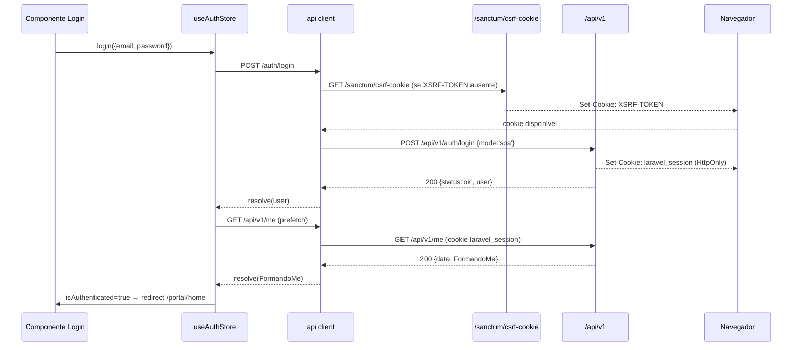
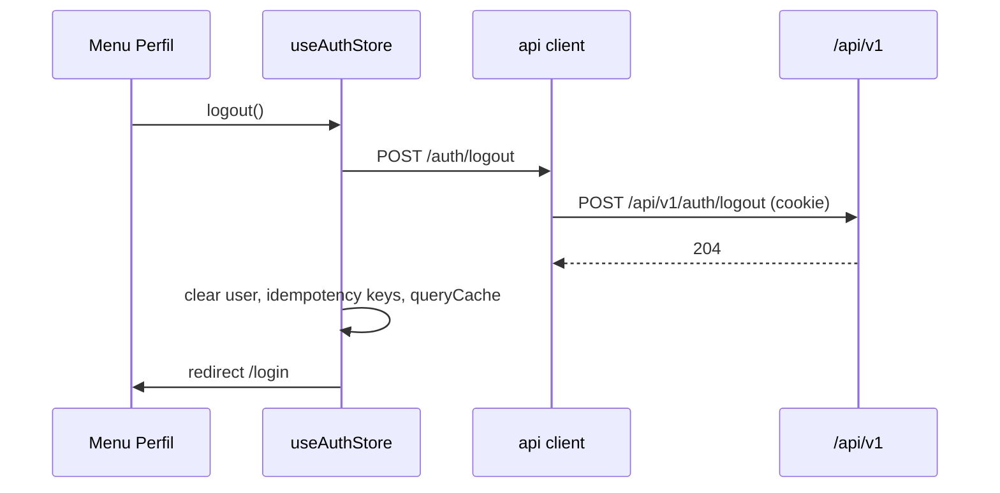
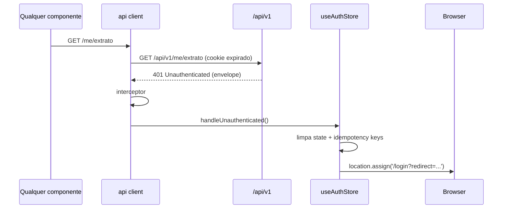
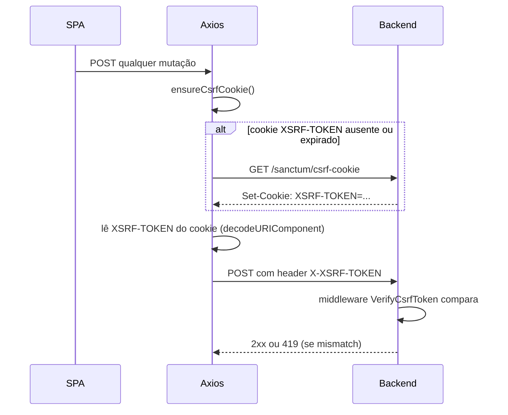

# API Integration Contract — SPA React × API v1

> Define **como** o SPA React do Portal do Formando conversa com a API v1 em runtime: instância Axios, interceptors, auth flow (Sanctum stateful), CSRF, idempotência, paginação cursor, tratamento do envelope de erro único e gaps com o backend.
>
> Este documento é complementar a [`07-DATA-CONTRACTS-AND-VIEW-MODELS.md`](./07-DATA-CONTRACTS-AND-VIEW-MODELS.md) (shapes e ViewModels) e a [`09-TECHNICAL-DESIGN-CRITICAL-MODULES.md`](./09-TECHNICAL-DESIGN-CRITICAL-MODULES.md) (design por módulo).

> Legenda: ✅ confirmado pelo contrato da API | 💡 inferido de convenções explícitas | ❓ pendente até F3.

---

## Sumário

- [1. Visão geral da integração](#1-visão-geral-da-integração)
- [2. Axios client completo](#2-axios-client-completo)
- [3. Auth flow (Sanctum stateful)](#3-auth-flow-sanctum-stateful)
- [4. Headers obrigatórios por endpoint](#4-headers-obrigatórios-por-endpoint)
- [5. Cookies e CSRF](#5-cookies-e-csrf)
- [6. Idempotency keys](#6-idempotency-keys)
- [7. Paginação cursor](#7-paginação-cursor)
- [8. Envelope de erro e tratamento](#8-envelope-de-erro-e-tratamento)
- [9. Invariantes por integração](#9-invariantes-por-integração)
- [10. Dependências do backend (blockers)](#10-dependências-do-backend-blockers)
- [11. Gaps entre frontend esperado e backend atual](#11-gaps-entre-frontend-esperado-e-backend-atual)
- [12. Checklist de alinhamento com API v1](#12-checklist-de-alinhamento-com-api-v1)
- [Apêndice A — Smoke test end-to-end](#apêndice-a--smoke-test-end-to-end)
- [Apêndice B — Matriz de observabilidade](#apêndice-b--matriz-de-observabilidade)

---

## 1. Visão geral da integração

### 1.1 Topologia

```
┌───────────────────────────┐           ┌────────────────────────────┐
│ SPA React (Vite)          │           │ Laravel 13 (API v1)        │
│ resources/spa/src/        │           │ routes/api/v1.php          │
│                           │           │                            │
│ Axios instance            │──HTTPS───▶│ Sanctum middleware         │
│   baseURL:/api/v1         │  cookie   │ Idempotency middleware     │
│   withCredentials:true    │  ◀────────│ Throttle middleware        │
│   interceptors × 4        │           │ Controllers Api\V1\*       │
│                           │           │ Resources (JSON)           │
│ TanStack Query + Zustand  │           │ Error envelope handler     │
└───────────────────────────┘           └────────────────────────────┘
```

### 1.2 Base URL por ambiente

| Ambiente  | `baseURL`                                          | Sanctum `stateful`                            | CORS `allowed_origins`                         |
| --------- | -------------------------------------------------- | --------------------------------------------- | ---------------------------------------------- |
| dev local | `http://localhost/api/v1`                          | `localhost`, `localhost:5173`, `localhost:80` | `http://localhost:5173`                        |
| staging   | `https://api.staging.portalartfinal.com.br/api/v1` | `portal.staging.portalartfinal.com.br`        | `https://portal.staging.portalartfinal.com.br` |
| produção  | `https://api.portalartfinal.com.br/api/v1`         | `portal.portalartfinal.com.br`                | `https://portal.portalartfinal.com.br`         |

Fonte: [`PLANEJAMENTO_FRONTEND_REACT.md`](../prd/PLANEJAMENTO_FRONTEND_REACT.md) §11 e `config/cors.php` / `config/sanctum.php`.

### 1.3 Por que Sanctum stateful no web

- **Cookie HttpOnly** é imune a XSS (JS não lê `laravel_session`).
- **CSRF nativo do Laravel** + double submit (`XSRF-TOKEN` cookie + header `X-XSRF-TOKEN`).
- **SPA + API same-site** (`portal.*` e `api.*` no mesmo apex ou apenas `portal.*` servindo ambas) → SameSite=Lax funciona sem complicação de terceiros.
- Mobile (F8, ADR-0003) usa `mode: 'token'` e recebe bearer token; web **não** grava bearer em JS.

### 1.4 `withCredentials: true` — obrigatório

Sem `withCredentials`, o navegador não envia o cookie de sessão em requisições cross-origin. Como o dev roda o Vite em `:5173` e o Laravel em `:80`, toda chamada à API é cross-origin. Em produção, mesmo com origens iguais, manter `withCredentials: true` para cobrir configurações futuras.

### 1.5 Contrato de envelope

Toda resposta **bem-sucedida** segue um dos shapes em [§8 do 07-DATA-CONTRACTS](./07-DATA-CONTRACTS-AND-VIEW-MODELS.md#8-shape-esperado-de-respostas):

- `{ data: T }` (single)
- `{ data: T[], meta: CursorMeta, links: CursorLinks }` (cursor)
- `{ data: T[], meta: OffsetMeta, links: OffsetLinks }` (raro)

Toda resposta **de erro** segue o envelope único de [`error-envelope.md`](../api/error-envelope.md).

O Axios client garante:

- 2xx → resolve com `response.data` tipado.
- ≥ 400 → rejeita com `ApiError` (nunca com o raw AxiosError).

---

## 2. Axios client completo

### 2.1 Arquivo `resources/spa/src/api/client.ts`

```ts
// resources/spa/src/api/client.ts
import axios, { type AxiosError, type AxiosInstance, type InternalAxiosRequestConfig } from 'axios';

import { useAuthStore } from '@/stores/auth-store';
import type { ErrorEnvelope, ErrorKey } from '@/api/types';

// ============================================================================
// ApiError — classe custom lançada por todo erro HTTP
// ============================================================================

export class ApiError<D = unknown> extends Error {
    public readonly error: ErrorKey;
    public readonly status: number;
    public readonly requestId: string | null;
    public readonly timestamp: string | null;
    public readonly details: D | null;
    public readonly retryAfter: number | null; // segundos

    constructor(envelope: ErrorEnvelope, status: number, retryAfter?: number) {
        super(envelope.message);
        this.name = 'ApiError';
        this.error = envelope.error;
        this.status = status;
        this.requestId = envelope.request_id ?? null;
        this.timestamp = envelope.timestamp ?? null;
        this.details = (envelope.details as D) ?? null;
        this.retryAfter = retryAfter ?? null;
        Object.setPrototypeOf(this, ApiError.prototype);
    }

    get isValidation(): boolean {
        return this.error === 'ValidationError';
    }

    get isUnauthenticated(): boolean {
        return this.error === 'Unauthenticated';
    }

    get fieldErrors(): Record<string, string[]> {
        if (!this.details || typeof this.details !== 'object') return {};
        const d = this.details as { fields?: Record<string, string[]> };
        return d.fields ?? {};
    }
}

// ============================================================================
// Helpers
// ============================================================================

function isMutation(method: string | undefined): boolean {
    return ['post', 'put', 'patch', 'delete'].includes((method ?? '').toLowerCase());
}

function readCookie(name: string): string | null {
    const match = document.cookie.match(
        new RegExp('(?:^|; )' + name.replace(/([.*+?^=!:${}()|[\]/\\])/g, '\\$1') + '=([^;]*)'),
    );
    return match ? decodeURIComponent(match[1]) : null;
}

// Garante que o cookie XSRF-TOKEN está presente antes de mutações. Re-pega do
// servidor se ausente ou expirado.
let csrfRequestInflight: Promise<void> | null = null;
async function ensureCsrfCookie(): Promise<void> {
    if (readCookie('XSRF-TOKEN')) return;
    if (!csrfRequestInflight) {
        csrfRequestInflight = axios
            .get('/sanctum/csrf-cookie', { withCredentials: true, baseURL: '/' })
            .then(() => {})
            .finally(() => {
                csrfRequestInflight = null;
            });
    }
    return csrfRequestInflight;
}

// ============================================================================
// Axios instance
// ============================================================================

export const api: AxiosInstance = axios.create({
    baseURL: import.meta.env.VITE_API_BASE_URL ?? '/api/v1',
    withCredentials: true,
    headers: {
        Accept: 'application/json',
        'X-Requested-With': 'XMLHttpRequest',
    },
    timeout: 30_000,
});

// ----------------------------------------------------------------------------
// Interceptor #1 — CSRF cookie + header antes de mutações
// ----------------------------------------------------------------------------
api.interceptors.request.use(async (config: InternalAxiosRequestConfig) => {
    if (isMutation(config.method)) {
        await ensureCsrfCookie();
        const xsrf = readCookie('XSRF-TOKEN');
        if (xsrf) {
            config.headers.set('X-XSRF-TOKEN', xsrf);
        }
    }
    return config;
});

// ----------------------------------------------------------------------------
// Interceptor #2 — X-Request-Id único por requisição (correlação de logs)
// ----------------------------------------------------------------------------
api.interceptors.request.use((config) => {
    config.headers.set('X-Request-Id', crypto.randomUUID());
    return config;
});

// ----------------------------------------------------------------------------
// Interceptor #3 — Error envelope parser → lança ApiError tipado
// ----------------------------------------------------------------------------
api.interceptors.response.use(
    (response) => response,
    (err: AxiosError<ErrorEnvelope>) => {
        const status = err.response?.status ?? 0;
        const data = err.response?.data;

        // Sem response (timeout, rede) — construir envelope mínimo
        if (!err.response || !data) {
            throw new ApiError(
                {
                    error: 'ServiceUnavailable',
                    message: err.message || 'Falha de rede.',
                    details: null,
                    request_id: (err.config?.headers?.['X-Request-Id'] as string | undefined) ?? '',
                    timestamp: new Date().toISOString(),
                },
                status || 0,
            );
        }

        const retryAfterHeader = err.response.headers['retry-after'];
        const retryAfter =
            typeof retryAfterHeader === 'string' ? Number.parseInt(retryAfterHeader, 10) || undefined : undefined;

        throw new ApiError(data, status, retryAfter);
    },
);

// ----------------------------------------------------------------------------
// Interceptor #4 — 401 Unauthenticated → limpar auth store + redirect
// ----------------------------------------------------------------------------
api.interceptors.response.use(undefined, (err) => {
    if (err instanceof ApiError && err.status === 401) {
        // evitar loop: /auth/login e /me não disparam o handler
        const url = (err as unknown as { config?: { url?: string } }).config?.url ?? '';
        const isAuthEndpoint = url.endsWith('/auth/login') || url.endsWith('/me');
        if (!isAuthEndpoint) {
            useAuthStore.getState().handleUnauthenticated();
        }
    }
    return Promise.reject(err);
});
```

### 2.2 Tipos do envelope de erro usados pelo client

```ts
// resources/spa/src/api/types.ts — trecho relevante
export interface ErrorEnvelope {
    error: ErrorKey;
    message: string;
    details: { fields?: Record<string, string[]> } | Record<string, unknown> | null;
    request_id: string;
    timestamp: string;
}

export type ErrorKey =
    | 'Unauthenticated'
    | 'Forbidden'
    | 'ValidationError'
    | 'NotFound'
    | 'MethodNotAllowed'
    | 'DomainError'
    | 'InvariantViolation'
    | 'AssentoIndisponivel'
    | 'HoldExpirado'
    | 'CotaEsgotada'
    | 'WebhookInvalido'
    | 'GatewayIndisponivel'
    | 'PagamentoDuplicado'
    | 'IdempotencyConflict'
    | 'EndpointSunset'
    | 'PayloadTooLarge'
    | 'RateLimitExceeded'
    | 'ServiceUnavailable'
    | 'InternalServerError';
```

### 2.3 Exemplo de uso em hook TanStack Query

```ts
// resources/spa/src/api/hooks/use-auth.ts (excerto)
import { useQuery, useMutation, useQueryClient } from '@tanstack/react-query';
import { api, ApiError } from '@/api/client';
import type { FormandoMeDto, SingleEnvelope } from '@/api/types';
import { useAuthStore } from '@/stores/auth-store';

interface LoginInput {
    email: string;
    password: string;
    remember?: boolean;
}

export function useMe() {
    return useQuery({
        queryKey: ['auth', 'me'],
        queryFn: async () => {
            const { data } = await api.get<SingleEnvelope<FormandoMeDto>>('/me');
            return data.data;
        },
        staleTime: 5 * 60 * 1000,
        retry: (failureCount, err) => {
            if (err instanceof ApiError && err.status === 401) return false;
            return failureCount < 1;
        },
    });
}

export function useLogin() {
    const qc = useQueryClient();
    return useMutation({
        mutationFn: async (input: LoginInput) => {
            const { data } = await api.post<{ status: 'ok'; user: { id: string; email: string } }>('/auth/login', {
                ...input,
                mode: 'spa',
            });
            return data.user;
        },
        onSuccess: async () => {
            await qc.invalidateQueries({ queryKey: ['auth', 'me'] });
            await qc.prefetchQuery({ queryKey: ['auth', 'me'] });
        },
        onError: (err) => {
            if (err instanceof ApiError && err.status === 429) {
                useAuthStore.getState().setRateLimitNotice(err.retryAfter ?? 60);
            }
        },
    });
}
```

### 2.4 Convenções obrigatórias para hooks

1. **Todo hook** retorna `data.data` já desembrulhado (ou `CursorList<T>` inteiro para paginação).
2. **Nunca** `catch` dentro do `queryFn` para suprimir o erro — deixar TanStack Query gerenciar.
3. **Tratamento de erro** fica no `onError` de `useMutation` ou em `useQuery` via `isError + error`.
4. **`queryKey` lexicalmente hierárquico** — permite `invalidateQueries({ queryKey: ['convites'] })` invalidar todas as variações.

---

## 3. Auth flow (Sanctum stateful)

### 3.1 Sequência de login



### 3.2 Implementação no store

```ts
// resources/spa/src/stores/auth-store.ts
import { create } from 'zustand';
import { api, ApiError } from '@/api/client';
import { clearAllIdempotencyKeys } from '@/lib/idempotency';
import type { FormandoMeDto, SingleEnvelope } from '@/api/types';
import { toFormandoViewModel, type FormandoViewModel } from '@/view-models/formando';

interface AuthState {
    user: FormandoViewModel | null;
    isAuthenticated: boolean;
    isHydrating: boolean;
    rateLimitUntilMs: number | null;

    hydrate: () => Promise<void>;
    login: (email: string, password: string, remember?: boolean) => Promise<void>;
    logout: () => Promise<void>;
    handleUnauthenticated: () => void;
    setRateLimitNotice: (retryAfterSeconds: number) => void;
}

export const useAuthStore = create<AuthState>((set, get) => ({
    user: null,
    isAuthenticated: false,
    isHydrating: true,
    rateLimitUntilMs: null,

    async hydrate() {
        set({ isHydrating: true });
        try {
            const { data } = await api.get<SingleEnvelope<FormandoMeDto>>('/me');
            set({
                user: toFormandoViewModel(data.data),
                isAuthenticated: true,
                isHydrating: false,
            });
        } catch (err) {
            if (err instanceof ApiError && err.status === 401) {
                set({ user: null, isAuthenticated: false, isHydrating: false });
                return;
            }
            set({ isHydrating: false });
            throw err;
        }
    },

    async login(email, password, remember = false) {
        await api.post('/auth/login', {
            email,
            password,
            remember,
            mode: 'spa',
        });
        // cookie laravel_session setado; buscar /me para popular store
        const { data } = await api.get<SingleEnvelope<FormandoMeDto>>('/me');
        set({
            user: toFormandoViewModel(data.data),
            isAuthenticated: true,
            isHydrating: false,
        });
    },

    async logout() {
        try {
            await api.post('/auth/logout');
        } catch {
            // mesmo em erro, limpamos o cliente
        }
        clearAllIdempotencyKeys();
        set({ user: null, isAuthenticated: false });
    },

    handleUnauthenticated() {
        if (!get().isAuthenticated) return; // evita loop
        clearAllIdempotencyKeys();
        set({ user: null, isAuthenticated: false });
        const current = window.location.pathname + window.location.search;
        window.location.assign(`/login?redirect=${encodeURIComponent(current)}`);
    },

    setRateLimitNotice(retryAfterSeconds) {
        set({ rateLimitUntilMs: Date.now() + retryAfterSeconds * 1000 });
    },
}));
```

### 3.3 Sequência de logout



### 3.4 Sequência de 401 em request autenticada (expiração)



Regras:

- Store preserva a rota atual em `?redirect=` para retorno pós-login.
- Limpeza é **síncrona** (sem await) para evitar double-redirect.
- Se a rota atual já é `/login`, não redireciona.

### 3.5 CSRF mismatch (419)

Laravel retorna **419 Page Expired** quando o token XSRF não bate. Nesse caso, o SPA:

1. Interceptor #3 reconhece 419 e **retenta uma única vez** após refazer `GET /sanctum/csrf-cookie`.
2. Se o retry falhar → propaga `ApiError` com `error: 'TokenMismatch'` (adicionado ao `ErrorKey` ❓ se não existir ainda).

> ❓ Pendência: confirmar com backend que 419 **não** sai como `InternalServerError` — precisa ter seu próprio mapping para que o frontend possa distinguir CSRF expirado.

```ts
// Extensão do interceptor #3 — lidar com 419 TokenMismatch
api.interceptors.response.use(undefined, async (err) => {
    if (err instanceof ApiError && err.status === 419) {
        const original = (err as unknown as { config?: InternalAxiosRequestConfig }).config;
        if (original && !(original as { __csrfRetried?: boolean }).__csrfRetried) {
            (original as { __csrfRetried?: boolean }).__csrfRetried = true;
            await axios.get('/sanctum/csrf-cookie', { withCredentials: true, baseURL: '/' });
            return api.request(original);
        }
    }
    return Promise.reject(err);
});
```

### 3.6 Hydrate no boot do SPA

No `main.tsx`, antes de montar `<RouterProvider />`:

```tsx
// resources/spa/src/main.tsx (excerto)
import { useAuthStore } from '@/stores/auth-store';

async function bootstrap() {
    try {
        await useAuthStore.getState().hydrate();
    } catch {
        // hydrate trata 401 internamente; outros erros deixam isHydrating=false
    }
    renderApp();
}

bootstrap();
```

O `RouterProvider` aguarda `isHydrating: false` antes de aplicar guards — evita "flash of login screen" em reload autenticado.

---

## 4. Headers obrigatórios por endpoint

### 4.1 Tabela

| Header                             | Quando                 | Origem                                | Observação                                         |
| ---------------------------------- | ---------------------- | ------------------------------------- | -------------------------------------------------- |
| `Accept: application/json`         | sempre                 | default do client                     | força content-negotiation JSON                     |
| `Content-Type: application/json`   | em POST/PATCH com body | Axios infere                          | upload multipart: explicitar `multipart/form-data` |
| `X-Requested-With: XMLHttpRequest` | sempre                 | default do client                     | legacy Laravel (detecção AJAX)                     |
| `X-Request-Id: <uuid>`             | sempre                 | interceptor #2                        | correlação servidor ↔ cliente                     |
| `X-XSRF-TOKEN: <token>`            | mutações SPA           | interceptor #1 (lê cookie XSRF-TOKEN) | não enviar em GET                                  |
| `X-Idempotency-Key: <ulid>`        | mutações idempotentes  | `lib/idempotency.ts` via hook         | ver [§6](#6-idempotency-keys)                      |
| `Authorization: Bearer ...`        | **somente mobile F8**  | secure storage                        | NUNCA no SPA web                                   |
| Cookie: `laravel_session`          | sempre autenticado     | automático (withCredentials)          | HttpOnly, Secure, SameSite=Lax                     |
| Cookie: `XSRF-TOKEN`               | depois do csrf-cookie  | setado pelo servidor                  | Secure; JS lê apenas valor para header             |

### 4.2 Regra fria: "o que sai, o que entra"

#### 4.2.1 Request SPA → API (GET autenticado)

```http
GET /api/v1/me/extrato HTTP/1.1
Host: api.portalartfinal.com.br
Accept: application/json
X-Request-Id: 01J5K2N7QMHV1FJZ8H0PR3RV9C
X-Requested-With: XMLHttpRequest
Cookie: laravel_session=eyJ...
```

#### 4.2.2 Request SPA → API (POST idempotente)

```http
POST /api/v1/eventos/01J.../mesas/reservas HTTP/1.1
Host: api.portalartfinal.com.br
Accept: application/json
Content-Type: application/json
X-Requested-With: XMLHttpRequest
X-Request-Id: 01J5K2N7QMHV1FJZ8H0PR3RV9C
X-XSRF-TOKEN: eyJpdi...
X-Idempotency-Key: 01J5K2N7QMHV1FJZ8H0PR3RV9C
Cookie: laravel_session=eyJ...; XSRF-TOKEN=eyJpdi...

{"assento_ulid":"01J...","origem":"formando"}
```

#### 4.2.3 Response API → SPA (sucesso)

```http
HTTP/1.1 201 Created
Content-Type: application/json; charset=utf-8
Location: /api/v1/eventos/01J.../mesas/reservas/01J...
X-Request-Id: 01J5K2N7QMHV1FJZ8H0PR3RV9C
X-Correlation-Id: 01J...

{ "data": { "id": "01J...", "status": "hold", "hold_expires_at": "..." } }
```

#### 4.2.4 Response API → SPA (erro)

```http
HTTP/1.1 409 Conflict
Content-Type: application/json; charset=utf-8
X-Request-Id: 01J5K2N7QMHV1FJZ8H0PR3RV9C

{
  "error": "AssentoIndisponivel",
  "message": "Assento 01J5K... já possui reserva ativa.",
  "details": null,
  "request_id": "01J5K2N7QMHV1FJZ8H0PR3RV9C",
  "timestamp": "2026-04-17T14:32:11Z"
}
```

### 4.3 CORS expose-headers obrigatórios

O backend deve `Access-Control-Expose-Headers`:

- `X-Request-Id`
- `X-Correlation-Id`
- `Retry-After`
- `X-RateLimit-Limit`
- `X-RateLimit-Remaining`
- `Deprecation`, `Sunset`, `Link`
- `Location` (para POST 201)

### 4.4 CORS allowed-headers obrigatórios

Em `config/cors.php`:

```php
'allowed_headers' => [
    'Content-Type',
    'Accept',
    'X-Requested-With',
    'X-Request-Id',
    'X-XSRF-TOKEN',
    'X-Idempotency-Key',
    'Authorization',          // para mobile F8
    'X-Correlation-Id',
],
```

---

## 5. Cookies e CSRF

### 5.1 Cookies envolvidos

| Cookie            | Set-Cookie por                   | HttpOnly | Secure | SameSite | Lido pelo JS?                |
| ----------------- | -------------------------------- | -------- | ------ | -------- | ---------------------------- |
| `laravel_session` | `POST /auth/login`               | **Sim**  | Sim    | Lax      | **Não** (seguro contra XSS)  |
| `XSRF-TOKEN`      | `GET /sanctum/csrf-cookie`       | Não      | Sim    | Lax      | Sim (só valor, só p/ header) |
| `remember_web_*`  | `POST /auth/login?remember=true` | Sim      | Sim    | Lax      | Não                          |

### 5.2 Fluxo CSRF



### 5.3 Regras

- **Nunca** armazenar token (bearer ou qualquer outro) em `localStorage` ou `sessionStorage` no web.
- **Nunca** ler `laravel_session` via `document.cookie` — é HttpOnly, então nem seria possível.
- O `XSRF-TOKEN` **é lido** apenas para ser ecoado como header — nunca logado, persistido ou repassado.
- Interceptor #1 é a única origem autorizada de `X-XSRF-TOKEN`.

### 5.4 Falhas possíveis

| Sintoma                        | Causa provável                             | Fix                                                     |
| ------------------------------ | ------------------------------------------ | ------------------------------------------------------- |
| 419 TokenMismatch              | cookie XSRF ausente ou expirado            | `ensureCsrfCookie()` + retry (§3.5)                     |
| 401 em mutação depois do login | `withCredentials: false` ou domínio errado | conferir config; verificar `stateful` em sanctum.php    |
| 403 CSRF no backend            | Sanctum stateful não reconhece domínio     | adicionar host em `stateful` de `config/sanctum.php`    |
| Cookie não persiste em Safari  | Safari ITP bloqueia cross-site sem apex    | unificar em `portal.*` e `api.*.portal.*` ou mesmo host |

---

## 6. Idempotency keys

### 6.1 Quais endpoints exigem

Fonte: [Anexo D de `api-contract.md`](../api/api-contract.md#anexo-d--matriz-endpoint--idempotency-key) e §6 de [`api-conventions.md`](../api/api-conventions.md#6-idempotência-29).

| Endpoint                                                   | X-Idempotency-Key | Nota                            |
| ---------------------------------------------------------- | ----------------- | ------------------------------- |
| `POST /api/v1/eventos/{ulid}/convites/lotes`               | **obrigatório**   | 202 assíncrono; lote de até 500 |
| `POST /api/v1/eventos/{ulid}/mesas/reservas`               | **obrigatório**   | hold de 5 min                   |
| `POST /api/v1/eventos/{ulid}/mesas/reservas/{ulid}/trocar` | **obrigatório**   | compõe liberar + reservar       |
| `POST /api/v1/eventos/{ulid}/extras/pedidos`               | **obrigatório**   | cria pedido + inicia pagamento  |
| `POST /api/v1/pagamentos/intents`                          | **obrigatório**   | anti-duplicidade de cobrança    |
| `POST /api/v1/eventos/{ulid}/convites` (single)            | recomendado       | evita emissão dupla em re-click |
| `POST /api/v1/eventos/{ulid}/enquetes/{ulid}/votos`        | recomendado       | se `permite_edicao=true`        |

### 6.2 Formato

- **Tamanho:** até 80 chars, ASCII imprimível.
- **Valor:** UUID v4 gerado por `crypto.randomUUID()` (implementa na prática).
- **Escopo:** por operação (não por request) — ver "operation key" abaixo.

### 6.3 Storage: sessionStorage + "operation key"

A key é **persistida por operação lógica**, não por request. Exemplo: se o usuário clica "Pagar" no boleto de uma parcela específica, todas as tentativas daquela intent usam a **mesma** key até o sucesso — o servidor retorna o mesmo recurso em cada retry.

Chave de storage: `idempotency:<operation_scope>` onde `<operation_scope>` é único por unidade de trabalho.

| Operação           | Scope                                           | Quando limpar                     |
| ------------------ | ----------------------------------------------- | --------------------------------- |
| Reservar assento   | `seating:reservar:<evento_ulid>:<assento_ulid>` | após 201 `hold` ou abandono da UI |
| Trocar assento     | `seating:trocar:<reserva_ulid>:<destino_ulid>`  | após 200 sucesso                  |
| Criar pedido extra | `extras:pedido:<evento_ulid>:<hash(itens)>`     | após 201                          |
| Pagamento intent   | `pagamento:intent:<origem_ulid>`                | após 201 (intent criada)          |
| Lote de convites   | `convites:lote:<evento_ulid>:<submission_id>`   | após 202 aceito                   |

### 6.4 Contratos do servidor (referência)

- Key ausente/vazia → **400** (não mais que 422, conforme §6.1 de `api-conventions.md`).
- Key presente + **mesmo** payload → servidor **reusa** o resultado da primeira execução (200/201 determinístico).
- Key presente + payload diferente → **409 `IdempotencyConflict`** → UI deve **limpar a key e recomeçar** o fluxo (o usuário está combinando estados incompatíveis — ex.: trocou o assento mas a key ficou colada na anterior).
- TTL de 24h no Redis.

### 6.5 Código exemplo — `use-seating.ts`

```ts
// resources/spa/src/api/hooks/use-seating.ts
import { useMutation, useQueryClient } from '@tanstack/react-query';
import { api, ApiError } from '@/api/client';
import { getIdempotencyKey, clearIdempotencyKey } from '@/lib/idempotency';
import type { ReservaAssentoDto, SingleEnvelope } from '@/api/types';
import { useHoldStore } from '@/stores/hold-store';

interface ReservarInput {
    eventoUlid: string;
    assentoUlid: string;
    conviteUlid?: string;
    origem?: 'formando' | 'comissao' | 'admin';
}

export function useReservarAssento() {
    const qc = useQueryClient();
    const holdStore = useHoldStore();

    return useMutation({
        mutationKey: ['seating', 'reservar'],
        mutationFn: async (input: ReservarInput) => {
            const opScope = `seating:reservar:${input.eventoUlid}:${input.assentoUlid}`;
            const key = getIdempotencyKey(opScope);

            const { data } = await api.post<SingleEnvelope<ReservaAssentoDto>>(
                `/eventos/${input.eventoUlid}/mesas/reservas`,
                {
                    assento_ulid: input.assentoUlid,
                    convite_ulid: input.conviteUlid ?? null,
                    origem: input.origem ?? 'formando',
                },
                { headers: { 'X-Idempotency-Key': key } },
            );

            clearIdempotencyKey(opScope);
            return data.data;
        },
        onSuccess: (reserva, input) => {
            holdStore.startHold(reserva.id, reserva.hold_expires_at);
            qc.invalidateQueries({ queryKey: ['mesas', input.eventoUlid] });
        },
        onError: (err, input) => {
            if (err instanceof ApiError && err.error === 'IdempotencyConflict') {
                // chave estourada — limpar e forçar próxima tentativa a gerar nova
                clearIdempotencyKey(`seating:reservar:${input.eventoUlid}:${input.assentoUlid}`);
            }
        },
    });
}
```

### 6.6 Código exemplo — `use-pagamento.ts`

```ts
// resources/spa/src/api/hooks/use-pagamento.ts
import { useMutation, useQuery, useQueryClient } from '@tanstack/react-query';
import { api } from '@/api/client';
import { getIdempotencyKey, clearIdempotencyKey } from '@/lib/idempotency';
import type { MetodoPagamento, PagamentoDto, SingleEnvelope } from '@/api/types';

interface CriarIntentInput {
    origemTipo: 'parcela' | 'pedido_extra';
    origemUlid: string;
    metodo: MetodoPagamento;
}

export function useCriarPagamentoIntent() {
    const qc = useQueryClient();
    return useMutation({
        mutationFn: async ({ origemTipo, origemUlid, metodo }: CriarIntentInput) => {
            const scope = `pagamento:intent:${origemUlid}`;
            const key = getIdempotencyKey(scope);
            const { data } = await api.post<SingleEnvelope<PagamentoDto>>(
                '/pagamentos/intents',
                { origem_tipo: origemTipo, origem_ulid: origemUlid, metodo },
                { headers: { 'X-Idempotency-Key': key } },
            );
            clearIdempotencyKey(scope);
            return data.data;
        },
        onSuccess: (pagamento) => {
            qc.setQueryData(['pagamento', pagamento.id], pagamento);
        },
    });
}

export function usePagamento(pagamentoUlid: string | null) {
    return useQuery({
        queryKey: ['pagamento', pagamentoUlid],
        enabled: !!pagamentoUlid,
        queryFn: async () => {
            const { data } = await api.get<SingleEnvelope<PagamentoDto>>(`/pagamentos/${pagamentoUlid}`);
            return data.data;
        },
        refetchInterval: (query) => {
            const d = query.state.data;
            if (!d) return 2_000;
            return ['pago', 'falho', 'estornado', 'cancelado'].includes(d.status) ? false : 2_000;
        },
        staleTime: 0,
    });
}
```

---

## 7. Paginação cursor

### 7.1 Envelope

Conforme [§3.1 de `api-conventions.md`](../api/api-conventions.md#3-paginação-26):

```ts
interface CursorMeta {
    per_page: number;
    next_cursor: string | null;
    prev_cursor: string | null;
}
interface CursorLinks {
    self: string;
    next: string | null;
    prev: string | null;
}
interface CursorList<T> {
    data: T[];
    meta: CursorMeta;
    links: CursorLinks;
}
```

### 7.2 `useInfiniteQuery` como padrão

```ts
// resources/spa/src/api/hooks/use-convites.ts (excerto)
import { useInfiniteQuery } from '@tanstack/react-query';
import { api } from '@/api/client';
import type { ConviteDto, CursorList } from '@/api/types';

interface ConvitesFilters {
    status?: string;
    tipo?: string;
    search?: string;
}

export function useConvites(filters: ConvitesFilters = {}) {
    return useInfiniteQuery({
        queryKey: ['convites', filters],
        initialPageParam: null as string | null,
        queryFn: async ({ pageParam }) => {
            const { data } = await api.get<CursorList<ConviteDto>>('/me/convites', {
                params: {
                    'page[cursor]': pageParam,
                    'page[size]': 50,
                    'filter[status]': filters.status,
                    'filter[tipo]': filters.tipo,
                    'filter[search]': filters.search,
                    sort: '-created_at',
                },
            });
            return data;
        },
        getNextPageParam: (last) => last.meta.next_cursor,
        getPreviousPageParam: (first) => first.meta.prev_cursor,
        staleTime: 30_000,
    });
}
```

### 7.3 Regras

- **Cursor é opaco.** O cliente **nunca** interpreta, modifica ou constrói cursor manualmente. Só passa o que recebeu em `next_cursor`/`prev_cursor`.
- **Offset é proibido** em listagens cursor-based (convites, extrato, pagamentos, reservas, votos, notificações).
- **Offset é permitido** só em tabelas pequenas e estáveis (`meta.current_page` + `meta.last_page`): catálogo de extras, enquetes do evento, setores do mapa. Nesse caso, não usar `useInfiniteQuery` — usar `useQuery` passando `page` como param.
- **`page[size]` máximo: 100.** Default 50. Maior → 422.
- **Cursor inválido → 422 ValidationError.** O cliente trata limpando estado e voltando à primeira página.

### 7.4 Quando usar `fetchNextPage`

Em listas infinitas (extrato, convites):

```tsx
import { useIntersectionObserver } from '@/lib/hooks/use-intersection-observer';

function ExtratoList() {
    const { data, fetchNextPage, hasNextPage, isFetchingNextPage } = useExtrato();
    const sentinelRef = useIntersectionObserver({
        onIntersect: () => {
            if (hasNextPage && !isFetchingNextPage) fetchNextPage();
        },
    });

    const items = data?.pages.flatMap((p) => p.data) ?? [];

    return (
        <ul>
            {items.map((item) => (
                <ParcelaItem key={item.id} item={item} />
            ))}
            <li ref={sentinelRef} />
        </ul>
    );
}
```

---

## 8. Envelope de erro e tratamento

### 8.1 Shape (cópia para referência)

```json
{
    "error": "ValidationError",
    "message": "Dados de entrada inválidos.",
    "details": { "fields": { "email": ["O campo email é obrigatório."] } },
    "request_id": "01J5K2N7QMHV1FJZ8H0PR3RV9C",
    "timestamp": "2026-04-17T14:32:11Z"
}
```

### 8.2 Mapa error key → UX

Tabela consolidada a partir de [`error-envelope.md`](../api/error-envelope.md) §6.

| `error`               | HTTP | UX no SPA                                                                                       |
| --------------------- | ---- | ----------------------------------------------------------------------------------------------- |
| `Unauthenticated`     | 401  | Interceptor #4 trata: limpa store + redirect `/login?redirect=<current>`.                       |
| `Forbidden`           | 403  | Toast erro "Você não tem permissão para esta ação."; esconder botões da ação em próxima render. |
| `ValidationError`     | 422  | Mapear `details.fields[nome]` em `setError` do RHF; focus no primeiro campo.                    |
| `NotFound`            | 404  | Roteamento: page 404 interna ou toast "Recurso não encontrado."                                 |
| `MethodNotAllowed`    | 405  | Log técnico (bug do cliente); toast genérico.                                                   |
| `DomainError`         | 409  | Toast com `message` da API (já está em PT-BR).                                                  |
| `InvariantViolation`  | 409  | Toast com `message`; em fluxos lineares (wizard), forçar voltar ao passo anterior.              |
| `AssentoIndisponivel` | 409  | Toast "Esse assento já foi tomado"; recarregar mapa; liberar seleção.                           |
| `HoldExpirado`        | 410  | Modal "Seu tempo acabou. Escolha novamente."; voltar ao mapa; limpar hold store.                |
| `CotaEsgotada`        | 409  | Banner inline no form; botão submit desativado.                                                 |
| `WebhookInvalido`     | 400  | (N/A para SPA; só backend)                                                                      |
| `GatewayIndisponivel` | 502  | Toast "Gateway fora. Tente novamente em instantes."; retry exponencial em GET.                  |
| `PagamentoDuplicado`  | 409  | Redirecionar para `/portal/pagamento/<id>` da intent já existente (pegar de `details`).         |
| `IdempotencyConflict` | 409  | Limpar a key da operação + log técnico; UI: "Por favor, refaça a ação."                         |
| `EndpointSunset`      | 410  | Modal "Versão do app desatualizada; atualize."; link para app store / recarregar.               |
| `PayloadTooLarge`     | 413  | Toast "Arquivo grande demais."; explicação no campo de upload.                                  |
| `RateLimitExceeded`   | 429  | Desativar botão por `Retry-After` segundos; mostrar contagem regressiva.                        |
| `ServiceUnavailable`  | 503  | Toast "Sistema em manutenção."; retry com backoff em GETs críticos.                             |
| `InternalServerError` | 500  | Toast genérico + `request_id` para suporte; Sentry captura.                                     |

### 8.3 ErrorBoundary por rota

Cada rota top-level usa um `<ErrorBoundary>` customizado:

```tsx
// resources/spa/src/components/shared/ApiErrorBoundary.tsx
import { Component, type ReactNode } from 'react';
import { ApiError } from '@/api/client';

interface State {
    error: Error | null;
}

export class ApiErrorBoundary extends Component<
    { fallback: (err: Error, reset: () => void) => ReactNode; children: ReactNode },
    State
> {
    state: State = { error: null };

    static getDerivedStateFromError(error: Error): State {
        return { error };
    }

    componentDidCatch(error: Error) {
        if (error instanceof ApiError && error.status >= 500) {
            // Sentry.captureException(error, { tags: { request_id: error.requestId } });
        }
    }

    reset = () => this.setState({ error: null });

    render() {
        if (this.state.error) return this.props.fallback(this.state.error, this.reset);
        return this.props.children;
    }
}
```

### 8.4 Handler genérico de mutação

```ts
// resources/spa/src/lib/api-error-handler.ts
import { ApiError } from '@/api/client';
import { toast } from '@/components/ui/toast';
import type { UseFormReturn } from 'react-hook-form';
import { useAuthStore } from '@/stores/auth-store';

interface HandlerOptions<T extends Record<string, unknown>> {
    form?: UseFormReturn<T>;
    onIdempotencyConflict?: () => void;
    onHoldExpirado?: () => void;
    onAssentoIndisponivel?: () => void;
    onCotaEsgotada?: () => void;
    onRateLimit?: (retryAfter: number) => void;
    defaultToast?: string;
}

export function handleApiError<T extends Record<string, unknown>>(err: unknown, opts: HandlerOptions<T> = {}) {
    if (!(err instanceof ApiError)) {
        toast.error(opts.defaultToast ?? 'Erro inesperado.');
        return;
    }

    switch (err.error) {
        case 'Unauthenticated':
            // interceptor já redirecionou; nada a fazer
            return;
        case 'Forbidden':
            toast.error('Você não tem permissão para esta ação.');
            return;
        case 'ValidationError':
            if (opts.form) {
                for (const [field, msgs] of Object.entries(err.fieldErrors)) {
                    opts.form.setError(field as any, { type: 'server', message: msgs[0] });
                }
            } else {
                toast.error(err.message);
            }
            return;
        case 'AssentoIndisponivel':
            toast.warning('Esse assento já foi tomado. Escolha outro.');
            opts.onAssentoIndisponivel?.();
            return;
        case 'HoldExpirado':
            toast.warning('Seu tempo de reserva acabou. Recomece a seleção.');
            opts.onHoldExpirado?.();
            return;
        case 'CotaEsgotada':
            toast.warning(err.message);
            opts.onCotaEsgotada?.();
            return;
        case 'IdempotencyConflict':
            opts.onIdempotencyConflict?.();
            toast.error('Por favor, refaça a ação.');
            return;
        case 'RateLimitExceeded':
            const seconds = err.retryAfter ?? 60;
            toast.warning(`Aguarde ${seconds}s antes de tentar novamente.`);
            opts.onRateLimit?.(seconds);
            return;
        case 'EndpointSunset':
            toast.error('Versão desatualizada. Recarregue a página.');
            return;
        case 'InternalServerError':
        case 'ServiceUnavailable':
        case 'GatewayIndisponivel':
            toast.error(`Erro interno. ID para suporte: ${err.requestId?.slice(0, 8) ?? '—'}`);
            return;
        default:
            toast.error(err.message);
    }
}
```

### 8.5 Uso no componente

```tsx
const form = useForm<LoginForm>({ resolver: zodResolver(loginSchema) });
const loginMutation = useLogin();

async function onSubmit(values: LoginForm) {
    try {
        await loginMutation.mutateAsync(values);
    } catch (err) {
        handleApiError(err, { form });
    }
}
```

### 8.6 Toast vs inline vs modal — regra

| Severidade | Situação típica                                 | UX                       |
| ---------- | ----------------------------------------------- | ------------------------ |
| Inline     | ValidationError em campo                        | `setError` no RHF        |
| Toast      | Erro contextual que não bloqueia fluxo          | `toast.error(...)`       |
| Banner     | CotaEsgotada, RateLimitExceeded (acima do form) | `<Banner variant="...">` |
| Modal      | HoldExpirado, EndpointSunset, erros críticos    | `<Dialog>`               |

---

## 9. Invariantes por integração

Invariantes são regras que **sempre** valem entre SPA e API. Violação = bug crítico.

### 9.1 Auth

- **I1.** Cookie `laravel_session` é HttpOnly. JS nunca o lê, modifica ou persiste.
- **I2.** Nenhum bearer token é gravado no SPA web (sessionStorage/localStorage). Tokens só existem no mobile (F8).
- **I3.** Toda requisição autenticada usa `withCredentials: true`. Sem exceção.
- **I4.** Após `logout`, o store zera `user` **antes** do redirect para evitar re-render momentâneo com dados antigos.
- **I5.** O hydrate (`GET /me`) só roda uma vez por carga de página — não em toda navegação.

### 9.2 Seating

- **I6.** Hold **expira automaticamente** no servidor em `hold_ttl_seconds`. Cliente nunca estende. Cliente **só** confirma ou abandona.
- **I7.** O timer visual é derivado de `hold_expires_at` do servidor, nunca do clock local puro. Em reload/navegação, o timer reconcilia com a última resposta da API.
- **I8.** Ao clicar "confirmar", se a resposta for `410 HoldExpirado`, o cliente **recarrega o mapa** e limpa o hold store. Nunca tenta reservar o mesmo assento automaticamente.
- **I9.** Idempotency key para reservar é por `{evento_ulid, assento_ulid}` — trocar de assento gera nova key.
- **I10.** Troca de assento (`.../trocar`) é uma operação **atômica** do servidor. Cliente não emula com DELETE+POST.

### 9.3 Pagamento

- **I11.** Idempotency key da intent é por `origem_ulid`. Retry da mesma intent usa **mesma** key → servidor retorna o mesmo recurso.
- **I12.** Polling de pagamento tem **timeout máximo de 10 minutos** (300 ciclos de 2s). Após esse tempo, exibir mensagem "Ainda processando — você receberá e-mail quando concluir" e parar o polling.
- **I13.** Cliente nunca envia `status` em request de pagamento. Status só vem do servidor (webhook gateway → servidor → `GET /pagamentos/{ulid}`).
- **I14.** QR code/linha digitável/URL de PDF vêm sempre como **string** na resposta; cliente não calcula nenhum desses.
- **I15.** Em `PagamentoDuplicado`, cliente navega para o pagamento existente (cujo ID pode vir em `details`), não cria novo.

### 9.4 RSVP

- **I16.** Token em `/rsvp/{token}` é opaco (64 hex). Nunca é ULID; nunca aparece em logs do frontend.
- **I17.** Rota `/rsvp/$token` **não** passa pelo guard de auth — é pública.
- **I18.** Polling em RSVP é proibido — só 1 GET + 1 POST por sessão.

### 9.5 Convites e cotas

- **I19.** Ao emitir convite com sucesso, cliente **invalida** `['me', 'cotas']` e `['convites']` (ambos).
- **I20.** Lote (`.../lotes`) retorna 202; cliente faz polling no `status_url` até `status === 'concluido' | 'falha_parcial' | 'falha'` com `refetchInterval: 3000`. Max 20 min (400 ciclos).
- **I21.** Cancelar convite pode cascatar em liberar assento — cliente deve invalidar mapa de mesas do evento correspondente.

### 9.6 Paginação e cursores

- **I22.** Cliente **nunca** decodifica cursor (opaque token).
- **I23.** `next_cursor: null` significa fim da lista; `prev_cursor: null` significa início. Nunca assumir existência sem checar.
- **I24.** Ao aplicar filtros, resetar cursor (não continuar de onde estava).

### 9.7 Error envelope

- **I25.** Cliente ramifica por `error` (chave estável), nunca por `message` (texto traduzível).
- **I26.** `request_id` é sempre exposto em logs técnicos (console, Sentry tag) — nunca em UI voltada ao usuário final (exceto truncado em mensagem de suporte).
- **I27.** 5xx nunca é retryado automaticamente em POST. Apenas GETs críticos têm retry com backoff.

### 9.8 Transport

- **I28.** Base URL do cliente vem de `import.meta.env.VITE_API_BASE_URL` ou default `/api/v1`. Nunca hardcoded com protocolo/host em código de domínio.
- **I29.** Headers `X-Request-Id` e `X-Idempotency-Key` **nunca** vêm do usuário (ex.: query string). São sempre gerados no cliente.
- **I30.** Timeout padrão do Axios é 30s. Requests de upload/lote podem override explícito para 120s.

---

## 10. Dependências do backend (blockers)

Para o SPA entrar em F3, o backend **precisa** estar com cada item abaixo pronto. Lista consolida [§11 de `PLANEJAMENTO_FRONTEND_REACT.md`](../prd/PLANEJAMENTO_FRONTEND_REACT.md#11--backend-prerequisites-bloqueadores) + gaps adicionais detectados.

| #   | Item                                                                                                                                                  | Arquivo Laravel                                | Status |
| --- | ----------------------------------------------------------------------------------------------------------------------------------------------------- | ---------------------------------------------- | ------ |
| 1   | `config/cors.php` publicado com `supports_credentials: true` e `allowed_origins: [env('FRONTEND_URL')]`                                               | `config/cors.php`                              | ❓     |
| 2   | CORS `allowed_headers` cobre `Content-Type, Accept, X-Requested-With, X-Request-Id, X-XSRF-TOKEN, X-Idempotency-Key, Authorization, X-Correlation-Id` | `config/cors.php`                              | ❓     |
| 3   | CORS `exposed_headers` cobre `X-Request-Id, X-Correlation-Id, Retry-After, X-RateLimit-*, Deprecation, Sunset, Link, Location`                        | `config/cors.php`                              | ❓     |
| 4   | `config/sanctum.php` com `stateful` incluindo `localhost`, `localhost:5173`, `env('APP_URL')`                                                         | `config/sanctum.php`                           | ❓     |
| 5   | `config/sanctum.php` com `guard: ['portal']` para SPA do formando                                                                                     | `config/sanctum.php`                           | ❓     |
| 6   | Rota `GET /sanctum/csrf-cookie` ativa                                                                                                                 | `vendor/laravel/sanctum`                       | ✅     |
| 7   | `routes/portal.php` com catch-all retornando `spa.blade.php` (exceto `/api/*`, `/sanctum/*`, `/webhook/*`)                                            | `routes/portal.php`                            | ❓     |
| 8   | `resources/views/spa.blade.php` com `@viteReactRefresh` + `@vite(['resources/spa/src/main.tsx'])`                                                     | `resources/views/spa.blade.php`                | ❓     |
| 9   | `POST /api/v1/auth/login` (mode `spa` e `token`)                                                                                                      | `Api/V1/AuthController@login`                  | ❓     |
| 10  | `POST /api/v1/auth/logout` (204)                                                                                                                      | `Api/V1/AuthController@logout`                 | ❓     |
| 11  | `GET /api/v1/me` (envelope `{ data: FormandoMe }`)                                                                                                    | `Api/V1/MeController@show`                     | ❓     |
| 12  | `openapi-skeleton.yaml` finalizado, estável e sem `$ref` quebrado                                                                                     | `docs/api/openapi-skeleton.yaml`               | 💡     |
| 13  | Rate limiters `api`, `login`, `convite`, `seating`, `voto`, `webhook` registrados no provider                                                         | `app/Providers/RateLimiterServiceProvider.php` | ❓     |
| 14  | Middleware `idempotent` ativo em `lotes`, `reservas`, `reservas/*/trocar`, `pedidos`, `pagamentos/intents`                                            | `routes/api/v1.php`                            | ❓     |
| 15  | Handler global em `bootstrap/app.php` retornando envelope único para 4xx/5xx em `api/*` e `webhooks/*`                                                | `bootstrap/app.php`                            | ❓     |
| 16  | Middleware `AttachRequestId` (sempre) — gera `X-Request-Id` se ausente e ecoa na resposta                                                             | `app/Http/Middleware/AttachRequestId.php`      | ❓     |
| 17  | 419 (TokenMismatch) retornando envelope próprio e não `InternalServerError`                                                                           | handler global                                 | ❓     |
| 18  | `stateful` domain inclui o host do Vite em dev (default `localhost:5173`)                                                                             | `config/sanctum.php`                           | ❓     |
| 19  | Cookies `laravel_session`, `XSRF-TOKEN` com `secure: true` em staging/prod, `SameSite: Lax`                                                           | `config/session.php`                           | ❓     |
| 20  | Resource `ConviteResource` expõe `token_publico` quando autenticado é o emissor                                                                       | `App/Http/Resources/ConviteResource`           | ❓     |

### 10.1 Verificação mínima local

```bash
# Dev — containers e serviços esperados
curl -i http://localhost/sanctum/csrf-cookie
# esperado: 204 + Set-Cookie: XSRF-TOKEN=...

curl -i -X POST http://localhost/api/v1/auth/login \
  -H "Content-Type: application/json" \
  -H "X-Request-Id: $(uuidgen)" \
  -d '{"email":"mariana@usp.br","password":"secret","mode":"spa"}' \
  -c cookies.txt
# esperado: 200 {status:'ok',user} + Set-Cookie: laravel_session=...

curl -i -b cookies.txt http://localhost/api/v1/me
# esperado: 200 {data: {...FormandoMe}}
```

Se qualquer um falhar, nenhum item de F3 pode começar.

---

## 11. Gaps entre frontend esperado e backend atual

Tabela cruzada: funcionalidade frontend × endpoint/comportamento necessário × status.

| #   | Feature SPA                                     | Endpoint / comportamento necessário                                              | Status hoje      | Impacto            | Ação                                                   |
| --- | ----------------------------------------------- | -------------------------------------------------------------------------------- | ---------------- | ------------------ | ------------------------------------------------------ |
| G1  | Wizard adesão etapa 3 (escolha pacote)          | `GET /api/v1/eventos/{ulid}/pacotes`                                             | ❓ ausente       | bloqueia F3        | Adicionar ao openapi + contract, spec.                 |
| G2  | Wizard adesão etapa 4 (simulação parcelamento)  | `POST /api/v1/adesoes/simular` ou `GET com query`                                | ❓ ausente       | bloqueia F3        | Especificar.                                           |
| G3  | Wizard adesão etapa 7 (commit)                  | `POST /api/v1/adesoes` (com body da soma das etapas)                             | ❓ ausente       | bloqueia F3        | Especificar; definir se é idempotente.                 |
| G4  | Convites do formando — filtrar por evento       | `GET /api/v1/me/convites?filter[evento_id]=<ulid>`                               | 💡 implícito     | UX parcial         | Confirmar suporte ao filtro.                           |
| G5  | Compartilhamento de convite pelo emissor (QR)   | `token_publico` no `ConviteResource` quando o emissor é o formando dono          | ❓ ausente       | funcionalidade     | Novo campo com Policy explícita.                       |
| G6  | Financeiro — vencimento no extrato              | Campo `vencimento_at` em parcelas pendentes (distinto de `data_movimento`)       | ❓ semântica     | confuso            | Decidir semântica atual vs novo campo.                 |
| G7  | Mapa com delta em tempo real                    | `GET .../mesas/mapa?since=<iso>` retornando só deltas                            | ✅ (documentado) | OK                 | Validar em integração.                                 |
| G8  | Polling de mapa durante hold                    | Idempotente, sem efeito colateral; staleTime=0 + refetchInterval 5s              | ✅               | OK                 | Nenhuma ação.                                          |
| G9  | Notificações in-app                             | `GET /api/v1/me/notificacoes` + badge de não lidas                               | ❓ ausente       | F6                 | Adiado para F6; não bloqueia F3-F5.                    |
| G10 | 419 TokenMismatch mapping                       | Handler mapear `TokenMismatchException` → 419 envelope `{error:'TokenMismatch'}` | ❓ ausente       | silencioso no prod | Adicionar mapping; alinhar `ErrorKey`.                 |
| G11 | Conversão de pagamento cartão                   | Campos tokenizados do cartão (último 4 dígitos, bandeira); PCI scope             | ❓ ausente       | bloqueia F3 cartão | Definir integração gateway (Itaú) antes de F3 etapa 7. |
| G12 | Webhook de pagamento invalidar cache do cliente | Push via Reverb/SSE **ou** usuário refresh; MVP aceita polling                   | 💡               | aceitável          | Manter polling até F7.                                 |
| G13 | RSVP: link externo personalizado                | Cliente precisa saber o token para construir `/rsvp/<token>`                     | ❓ ausente       | UX                 | Vincular a G5 (`token_publico`).                       |
| G14 | Voto em enquete multipla                        | Request `opcoes_ulids` vs `opcao_ulid` (campo variável por tipo)                 | ✅               | OK                 | Nenhuma ação.                                          |
| G15 | Deprecation banner                              | Frontend precisa detectar `Deprecation: true` e exibir warning ao usuário        | 💡               | futuro             | Inteceptor #3 estendido em F7.                         |

---

## 12. Checklist de alinhamento com API v1

### 12.1 Backend

- [ ] `openapi-skeleton.yaml` publicado, validado (`spectral lint`) e versionado.
- [ ] `config/cors.php` com `supports_credentials: true`, `allowed_origins: [env('FRONTEND_URL')]`, allowed/exposed headers cobertos.
- [ ] `config/sanctum.php` com `stateful` para dev/staging/prod.
- [ ] Middleware `AttachRequestId` ativo em toda `api/*` e `webhooks/*`.
- [ ] Handler global de exceções retornando envelope único em 100% dos endpoints.
- [ ] Middleware `idempotent` ativo em lista de endpoints §6.1.
- [ ] Rate limiters `api`, `login`, `seating`, `convite`, `voto`, `webhook` registrados.
- [ ] Rotas de auth (`/auth/login`, `/auth/logout`, `/me`) respondendo em dev local.
- [ ] 419 mapeado para envelope com `error: 'TokenMismatch'` (ou sinal claro ao cliente).
- [ ] `ConviteResource` expõe `token_publico` quando policy permite.
- [ ] Testes feature cobrindo todos os códigos de erro do envelope (Pest, Apêndice do backend planejamento).

### 12.2 Frontend

- [ ] `openapi-typescript` instalado como devDependency.
- [ ] Script `npm run types:gen` em `package.json`.
- [ ] `types.gen.ts` commitado (ou CI rodando em PR contra `openapi-skeleton.yaml`).
- [ ] `resources/spa/src/api/client.ts` com os 4 interceptors (§2.1).
- [ ] `stores/auth-store.ts` implementa `hydrate`, `login`, `logout`, `handleUnauthenticated`.
- [ ] `lib/idempotency.ts`, `lib/money.ts`, `lib/date.ts`, `lib/ulid.ts` implementados e testados.
- [ ] `ApiError` class exportada e consumida por handler global.
- [ ] Smoke test `GET /sanctum/csrf-cookie → POST /auth/login → GET /me` rodando local.
- [ ] Smoke test cobrindo 4xx: 401 em request sem login, 422 em login inválido, 429 em 6 tentativas.
- [ ] Todos os hooks de mutação idempotente usam `getIdempotencyKey` + `clearIdempotencyKey`.
- [ ] `useInfiniteQuery` em todas as listas com cursor.
- [ ] `handleApiError` usado em todo `onError` de mutação.
- [ ] ErrorBoundary wrapping cada rota top-level.
- [ ] Lint: `eslint-plugin-no-restricted-imports` bloqueia `fetch` direto (forçar uso do `api` client).

### 12.3 Conjunto (integração)

- [ ] Ambiente dev com dois processos: Laravel em `:80` + Vite em `:5173`.
- [ ] Cookie `XSRF-TOKEN` chega ao browser após `GET /sanctum/csrf-cookie`.
- [ ] `POST /api/v1/auth/login` retorna 200 + `Set-Cookie: laravel_session` em dev.
- [ ] `GET /api/v1/me` retorna 200 com envelope correto depois do login.
- [ ] Erros 4xx chegam como `ApiError` no cliente (não como AxiosError raw).
- [ ] `X-Request-Id` viaja cliente → servidor → logs servidor → resposta → console.
- [ ] Rate limit 429 inclui `Retry-After` e desativa botão no cliente pela duração.
- [ ] CI regenera `types.gen.ts` e falha em caso de diff não commitado.

---

## Apêndice A — Smoke test end-to-end

Arquivo: `resources/spa/tests/integration/auth-flow.smoke.test.ts` (Vitest + MSW).

```ts
import { describe, it, expect, beforeAll, afterAll, afterEach } from 'vitest';
import { setupServer } from 'msw/node';
import { http, HttpResponse } from 'msw';
import { api, ApiError } from '@/api/client';

const server = setupServer(
    http.get('/sanctum/csrf-cookie', () => {
        return new HttpResponse(null, {
            status: 204,
            headers: { 'Set-Cookie': 'XSRF-TOKEN=mock-token; Path=/; Secure; SameSite=Lax' },
        });
    }),
    http.post('/api/v1/auth/login', async ({ request }) => {
        const body = await request.json();
        if (body.password === 'wrong') {
            return HttpResponse.json(
                {
                    error: 'Unauthenticated',
                    message: 'Credenciais inválidas.',
                    details: null,
                    request_id: '01J-TEST',
                    timestamp: new Date().toISOString(),
                },
                { status: 401 },
            );
        }
        return HttpResponse.json(
            { status: 'ok', user: { id: '01J-USER', email: body.email } },
            {
                status: 200,
                headers: { 'Set-Cookie': 'laravel_session=mock-session; HttpOnly; Path=/' },
            },
        );
    }),
    http.get('/api/v1/me', () => {
        return HttpResponse.json({
            data: {
                id: '01J-USER',
                nome: 'Mariana Souza',
                email: 'mariana@usp.br',
                tipo: 'formando',
                roles: ['formando'],
                abilities: ['convites.view'],
                formandos: [],
                links: { self: '/api/v1/me', eventos: '', adesoes: '', convites: '' },
            },
        });
    }),
);

beforeAll(() => server.listen({ onUnhandledRequest: 'error' }));
afterEach(() => server.resetHandlers());
afterAll(() => server.close());

describe('auth flow smoke', () => {
    it('csrf-cookie → login → me → returns FormandoMe', async () => {
        const login = await api.post('/auth/login', {
            email: 'mariana@usp.br',
            password: 'right',
            mode: 'spa',
        });
        expect(login.status).toBe(200);
        expect(login.data.user.email).toBe('mariana@usp.br');

        const me = await api.get('/me');
        expect(me.data.data.tipo).toBe('formando');
    });

    it('login com senha errada lança ApiError Unauthenticated', async () => {
        try {
            await api.post('/auth/login', { email: 'x@y', password: 'wrong', mode: 'spa' });
            throw new Error('não deveria alcançar aqui');
        } catch (err) {
            expect(err).toBeInstanceOf(ApiError);
            expect((err as ApiError).error).toBe('Unauthenticated');
            expect((err as ApiError).status).toBe(401);
        }
    });
});
```

---

## Apêndice B — Matriz de observabilidade

Para cada integração, o cliente registra no mínimo:

| Evento                              | Canal                      | Campos obrigatórios                                   |
| ----------------------------------- | -------------------------- | ----------------------------------------------------- |
| Login sucesso                       | Sentry breadcrumb          | `user_id`, `request_id`                               |
| Login 401                           | Sentry breadcrumb          | `request_id`, `email_hash`                            |
| 401 em rota autenticada (expiração) | Sentry warning             | `request_id`, `pathname`                              |
| 429 RateLimitExceeded               | console.warn               | `endpoint`, `retry_after`, `request_id`               |
| 5xx em qualquer endpoint            | Sentry error               | `error`, `request_id`, `status`, `pathname`, `method` |
| IdempotencyConflict                 | Sentry warning             | `operation_scope`, `request_id`                       |
| Hold expirado durante confirm       | Sentry info                | `reserva_id`, `evento_id`, `request_id`               |
| Payment polling timeout             | Sentry warning             | `pagamento_id`, `elapsed_seconds`                     |
| Sunset endpoint atingido            | Sentry warning + banner UX | `pathname`, `successor_url`, `request_id`             |

Integração Sentry: ver `12-OBSERVABILITY-AND-ERRORS.md` (planned).

---

## Referências

- [`07-DATA-CONTRACTS-AND-VIEW-MODELS.md`](./07-DATA-CONTRACTS-AND-VIEW-MODELS.md) — DTOs e ViewModels consumidos aqui.
- [`09-TECHNICAL-DESIGN-CRITICAL-MODULES.md`](./09-TECHNICAL-DESIGN-CRITICAL-MODULES.md) — design detalhado por módulo.
- [`api-contract.md`](../api/api-contract.md) — endpoints.
- [`api-conventions.md`](../api/api-conventions.md) — convenções transversais.
- [`error-envelope.md`](../api/error-envelope.md) — envelope único + mapping.
- [`openapi-skeleton.yaml`](../api/openapi-skeleton.yaml) — schema formal.
- [`PLANEJAMENTO_FRONTEND_REACT.md`](../prd/PLANEJAMENTO_FRONTEND_REACT.md) — documento mestre do SPA.
- [`PLANEJAMENTO_BACKEND_APIV1.md`](../prd/PLANEJAMENTO_BACKEND_APIV1.md) — contraparte backend.
- ADR-0003 (Sanctum dual mode web/mobile), ADR-0004 (codegen openapi-typescript) — ver `06-ADR/`.
