> **[ATUALIZAÇÃO 2026-04-23]** O hook `useCriarAdesao` e o `wizard-store` descritos abaixo refletem o modelo
> antigo (`evento_ulid`, 7 etapas). Conforme [SPEC-F-001 v0.3.0](../features/foundation/SPEC-F-001-contrato-e-turma.md)
> e [SPEC-010 v2.0.0](../features/SPEC-010-adesao-publica-codigo-contrato.md), o wizard agora:
>
> - Abre com o Contrato (código humano-legível em `contratos.codigo_acesso`) e **duas etapas extras no início**: "Escolher curso + período" (turma) e "Escolher pacote formatura" (`categoria='formatura'`).
> - Payload de mutação usa `{contrato_ulid, turma_ulid, pacote_ulid, ...}`.
> - Escopo de idempotência inclui `contrato_ulid` em vez de `evento_ulid`.
> - `adesao-publica-store` (para fluxo sem login) substitui/complementa o `wizard-store` quando `mode='publico'`.
>
> Os exemplos de código desta seção precisam ser regenerados no próximo refactor de frontend.

# Technical Design — Módulos Críticos do SPA React

> Detalhamento técnico de **cada módulo crítico** do Portal do Formando (SPA React). Cada seção é self-contained: arquitetura local, hooks TanStack Query, stores Zustand, componentes principais, rotas, máquinas de estado, edge cases, tratamento de erros e estratégia de testes.
>
> Este documento **complementa** [`07-DATA-CONTRACTS-AND-VIEW-MODELS.md`](./07-DATA-CONTRACTS-AND-VIEW-MODELS.md) (shapes e ViewModels) e [`08-API-INTEGRATION-CONTRACT.md`](./08-API-INTEGRATION-CONTRACT.md) (client, interceptors, idempotência). Assume familiaridade com ambos.

> Legenda: ✅ contrato estável | 💡 inferência sólida | ❓ pendente backend.

---

## Sumário

- [1. Módulo Auth & Sessão](#1-módulo-auth--sessão)
- [2. Módulo Wizard de Adesão](#2-módulo-wizard-de-adesão)
- [3. Módulo Financeiro & Pagamento](#3-módulo-financeiro--pagamento)
- [4. Módulo Mapa de Mesas / Seating](#4-módulo-mapa-de-mesas--seating)
- [5. Módulo RSVP Público](#5-módulo-rsvp-público)
- [6. Módulo Convites & Cotas](#6-módulo-convites--cotas)
- [7. Módulo Enquetes](#7-módulo-enquetes)
- [Apêndice A — Convenções transversais de testes](#apêndice-a--convenções-transversais-de-testes)
- [Apêndice B — KPIs globais](#apêndice-b--kpis-globais)

---

## 1. Módulo Auth & Sessão

### 1.1 Objetivo

Autenticar o formando/responsável via Sanctum stateful, hidratar estado global (`FormandoViewModel`) e proteger as rotas `/portal/*` contra acesso não autenticado.

### 1.2 Escopo

**In:**

- Login com email+senha (mode `spa`).
- Logout (invalidação de sessão no servidor + limpeza de storage local).
- Hydrate inicial (`GET /me`) no boot do SPA.
- Proteção de rota (guard) via TanStack Router.
- Tratamento de 401 em requisições autenticadas (expiração).
- CSRF via `XSRF-TOKEN` + `X-XSRF-TOKEN`.
- Tela "Esqueci minha senha" (link para reset ❓ ver Apêndice da F3).

**Out:**

- Registro de novo usuário (formando é criado pela operação via backoffice).
- Login token (bearer) — mobile F8.
- 2FA — fora do MVP.

### 1.3 Arquitetura local

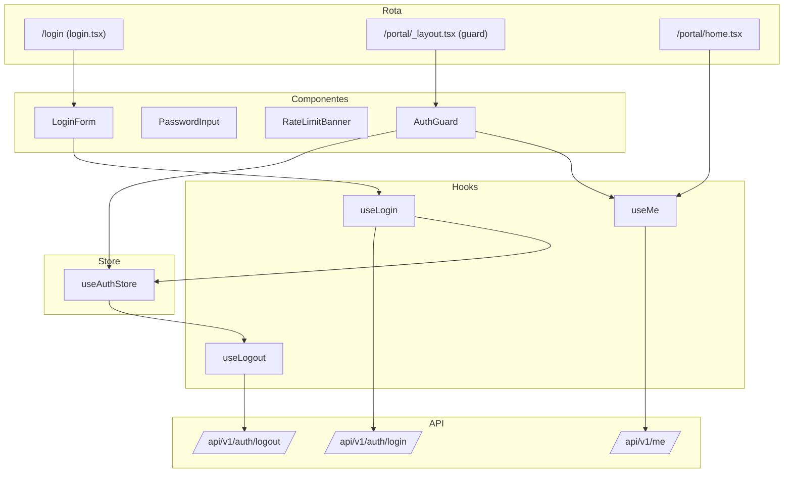

Camadas:

- **Rota → Componente → Hook → Store → API client → Backend.**
- `AuthGuard` é o único consumidor direto de `useAuthStore` para decidir redirect; demais componentes leem via `useMe()` (que espelha o store).

### 1.4 Hooks TanStack Query

Arquivo: `resources/spa/src/api/hooks/use-auth.ts`.

#### 1.4.1 `useMe`

```ts
export function useMe() {
    return useQuery({
        queryKey: ['auth', 'me'],
        queryFn: async () => {
            const { data } = await api.get<SingleEnvelope<FormandoMeDto>>('/me');
            return toFormandoViewModel(data.data);
        },
        staleTime: 5 * 60 * 1000, // 5 min
        gcTime: 30 * 60 * 1000,
        retry: (count, err) => {
            if (err instanceof ApiError && err.status === 401) return false;
            return count < 1;
        },
        refetchOnWindowFocus: false,
    });
}
```

#### 1.4.2 `useLogin`

```ts
export function useLogin() {
    const qc = useQueryClient();
    const authStore = useAuthStore();

    return useMutation({
        mutationKey: ['auth', 'login'],
        mutationFn: async (input: { email: string; password: string; remember?: boolean }) => {
            await api.post('/auth/login', { ...input, mode: 'spa' });
            const { data } = await api.get<SingleEnvelope<FormandoMeDto>>('/me');
            return toFormandoViewModel(data.data);
        },
        onSuccess: (user) => {
            authStore.setUser(user);
            qc.setQueryData(['auth', 'me'], user);
        },
        onError: (err) => {
            if (err instanceof ApiError && err.status === 429) {
                authStore.setRateLimitNotice(err.retryAfter ?? 60);
            }
        },
    });
}
```

#### 1.4.3 `useLogout`

```ts
export function useLogout() {
    const qc = useQueryClient();
    const authStore = useAuthStore();
    return useMutation({
        mutationKey: ['auth', 'logout'],
        mutationFn: async () => {
            try {
                await api.post('/auth/logout');
            } catch {
                /* mesmo em erro limpamos o cliente */
            }
        },
        onSettled: () => {
            clearAllIdempotencyKeys();
            qc.clear();
            authStore.clear();
        },
    });
}
```

### 1.5 Store Zustand

Arquivo: `resources/spa/src/stores/auth-store.ts`. Ver [§3.2 de 08-API-INTEGRATION-CONTRACT](./08-API-INTEGRATION-CONTRACT.md#32-implementação-no-store) para implementação completa.

Interface consumida pela UI:

```ts
interface AuthState {
    user: FormandoViewModel | null;
    isAuthenticated: boolean;
    isHydrating: boolean;
    rateLimitUntilMs: number | null;
    // actions
    hydrate: () => Promise<void>;
    setUser: (u: FormandoViewModel) => void;
    clear: () => void;
    handleUnauthenticated: () => void;
    setRateLimitNotice: (seconds: number) => void;
}
```

Persistência:

- **Nada** é persistido em localStorage (cookie HttpOnly cuida da sessão).
- `rateLimitUntilMs` pode ser persistido em `sessionStorage` para sobreviver a reloads acidentais durante a janela de throttle.

### 1.6 Componentes principais

| Componente        | Caminho                                 | Props                    | Responsabilidade                                  |
| ----------------- | --------------------------------------- | ------------------------ | ------------------------------------------------- |
| `LoginPage`       | `routes/login.tsx`                      | —                        | Layout da página; consome `LoginForm`             |
| `LoginForm`       | `components/auth/login-form.tsx`        | `onSuccess?: () => void` | RHF + Zod + `useLogin`                            |
| `PasswordInput`   | `components/ui/password-input.tsx`      | `...InputProps`          | Input com toggle olho aberto/fechado              |
| `RateLimitBanner` | `components/auth/rate-limit-banner.tsx` | `untilMs: number`        | Contagem regressiva; esconde após expirar         |
| `AuthGuard`       | `components/shared/auth-guard.tsx`      | `children: ReactNode`    | Redireciona se `!isAuthenticated && !isHydrating` |
| `BootSpinner`     | `components/shared/boot-spinner.tsx`    | —                        | Exibido enquanto `isHydrating`                    |

### 1.7 Rotas TanStack Router

#### 1.7.1 `/login` (público)

```tsx
// resources/spa/src/routes/login.tsx
import { createFileRoute, redirect } from '@tanstack/react-router';
import { useAuthStore } from '@/stores/auth-store';
import { LoginPage } from '@/components/auth/login-page';

export const Route = createFileRoute('/login')({
    beforeLoad: () => {
        if (useAuthStore.getState().isAuthenticated) {
            throw redirect({ to: '/portal/home' });
        }
    },
    validateSearch: (s) => ({ redirect: typeof s.redirect === 'string' ? s.redirect : undefined }),
    component: LoginPage,
});
```

#### 1.7.2 `/portal/_layout.tsx` (guard)

```tsx
// resources/spa/src/routes/portal/_layout.tsx
import { createFileRoute, Outlet, redirect, useLocation } from '@tanstack/react-router';
import { useAuthStore } from '@/stores/auth-store';
import { AppShell } from '@/components/layout/app-shell';

export const Route = createFileRoute('/portal/_layout')({
    beforeLoad: () => {
        const s = useAuthStore.getState();
        if (s.isHydrating) return; // router aguarda
        if (!s.isAuthenticated) {
            throw redirect({
                to: '/login',
                search: { redirect: window.location.pathname + window.location.search },
            });
        }
    },
    component: function PortalLayout() {
        return (
            <AppShell>
                <Outlet />
            </AppShell>
        );
    },
});
```

### 1.8 Máquina de estados do auth

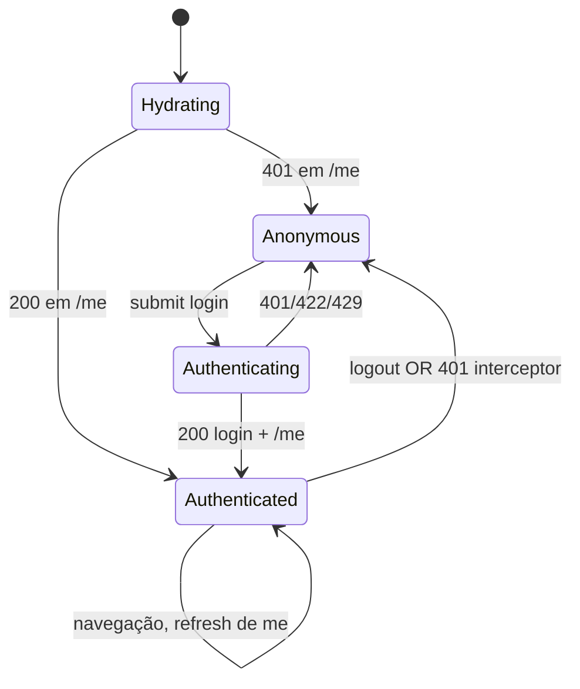

### 1.9 Edge cases

| Cenário                                         | Comportamento esperado                                                                          |
| ----------------------------------------------- | ----------------------------------------------------------------------------------------------- |
| Reload em `/portal/home` estando autenticado    | `hydrate` chama `/me`; cookie vigente → `isAuthenticated=true` sem nova tela de login.          |
| Reload em `/portal/home` com cookie expirado    | `/me` 401 → `isAuthenticated=false` → redirect `/login?redirect=/portal/home`.                  |
| Cookie expirado durante navegação (request 401) | Interceptor #4 chama `handleUnauthenticated` → limpa store + redirect com rota preservada.      |
| CSRF mismatch (419) em submit                   | Interceptor retry 1x após refazer `csrf-cookie`; se falhar 2x, toast + log técnico.             |
| Usuário loga em outra aba (logout da atual)     | Sem BroadcastChannel no MVP; a aba antiga descobrirá só na próxima request (401).               |
| 429 por excesso de tentativas de login          | `RateLimitBanner` mostra contagem regressiva; botão submit desativado; `setRateLimitNotice`.    |
| Rede cai durante submit                         | `ApiError(status=0, error='ServiceUnavailable')`; toast "Falha de rede. Tente novamente."       |
| Payload incorreto (422)                         | `handleApiError(err, { form })` popula `setError` nos campos.                                   |
| Usuário clica rápido no submit duas vezes       | Botão `disabled` durante `mutation.isPending`; fallback: mesma idempotência não se aplica aqui. |
| Hidratação lenta (`/me` demora 3s)              | `<BootSpinner>` renderiza até `isHydrating=false`.                                              |

### 1.10 Tratamento de erros específicos

| `error`               | HTTP | Tratamento                                                                    |
| --------------------- | ---- | ----------------------------------------------------------------------------- |
| `Unauthenticated`     | 401  | Em `/auth/login`: inline "Credenciais inválidas." Em outros: redirect.        |
| `ValidationError`     | 422  | `setError` em `email`/`password` via `details.fields`.                        |
| `RateLimitExceeded`   | 429  | Banner com contagem regressiva; botão desativado.                             |
| `TokenMismatch` ❓    | 419  | Retry 1x com novo csrf-cookie; se falhar, toast "Sessão expirou. Recarregue." |
| `InternalServerError` | 500  | Toast genérico com `request_id` truncado.                                     |

### 1.11 Dependências

- Backend: rotas `POST /auth/login`, `POST /auth/logout`, `GET /me`.
- Infra: CORS + Sanctum stateful configurados ([§10 de 08-API-INTEGRATION-CONTRACT](./08-API-INTEGRATION-CONTRACT.md#10-dependências-do-backend-blockers)).
- Stores: nenhum. É o primeiro módulo.
- Libs: `lib/idempotency.ts` (para `clearAllIdempotencyKeys` no logout).

### 1.12 Estratégia de testes

**Unit (Vitest):**

- `toFormandoViewModel` com variações de `nome` (1 palavra, 2 palavras, unicode, etc.).
- `handleUnauthenticated` → cover idempotência (não duplica redirect).

**Integration (Vitest + MSW):**

- `useLogin` sucesso → chama `/auth/login` + `/me` + popula store.
- `useLogin` 401 → não popula store; `isAuthenticated` permanece `false`.
- `useLogin` 429 → seta `rateLimitUntilMs`.
- `useLogout` → chama `/auth/logout`, limpa store, invalida queryCache.

**Component (RTL):**

- `<LoginForm>`: submit com campo vazio → mensagens Zod em PT-BR.
- `<LoginForm>`: submit com API 422 → `setError` aplicado no campo correspondente.
- `<AuthGuard>`: `isAuthenticated=false` → redirect; `isAuthenticated=true` → renderiza children.

**E2E (Playwright):**

- Happy path: `goto /login` → preenche → submit → redireciona para `/portal/home` → exibe nome do formando.
- Logout: clica menu perfil → "Sair" → redirect `/login`; tentar voltar à rota anterior mantém redirect.

### 1.13 KPIs

- **Tempo de login p95:** < 1.5s (rede local).
- **Taxa de sucesso primeira tentativa:** > 95%.
- **Taxa de 401 em navegação:** < 2% (expiração normal de cookie em sessões longas).

---

## 2. Módulo Wizard de Adesão

### 2.1 Objetivo

Conduzir o formando por **7 etapas** até a confirmação da adesão (contrato + pagamento inicial), com persistência local entre etapas e commit atômico ao fim.

### 2.2 Escopo

**In:**

- Navegação entre 7 etapas com estado persistido (`wizard-store` em sessionStorage).
- Validação por etapa via Zod + RHF.
- Simulação de parcelamento (etapa 4) chamando API.
- Commit final: cria adesão + inicia pagamento inicial (etapa 7).
- Retomada do wizard após reload / navegação para fora e volta.

**Out:**

- Edição de adesão após confirmada (tem tela própria em `/portal/home`).
- Cancelamento pós-confirmação (fluxo separado).

### 2.3 Arquitetura local

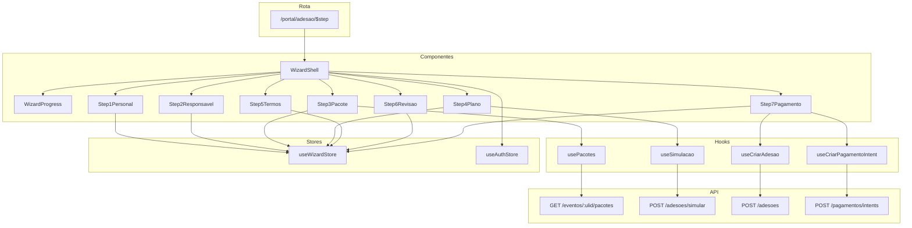

### 2.4 Hooks TanStack Query

#### 2.4.1 `usePacotes` — etapa 3 ❓

```ts
export function usePacotes(eventoUlid: string | null) {
    return useQuery({
        queryKey: ['pacotes', eventoUlid],
        enabled: !!eventoUlid,
        queryFn: async () => {
            // ❓ endpoint não existe; gap G1 em 08-API-INTEGRATION-CONTRACT
            const { data } = await api.get<{ data: PacoteDto[] }>(`/eventos/${eventoUlid}/pacotes`);
            return data.data.map(toPacoteViewModel);
        },
        staleTime: 10 * 60 * 1000,
    });
}
```

#### 2.4.2 `useSimulacao` — etapa 4 ❓

```ts
interface SimulacaoInput {
    pacoteUlid: string;
    qtdParcelas: number;
    metodoPrimeira: MetodoPagamento;
}

export function useSimulacao() {
    return useMutation({
        mutationFn: async (input: SimulacaoInput) => {
            // ❓ endpoint a especificar — gap G2
            const { data } = await api.post<SingleEnvelope<SimulacaoDto>>('/adesoes/simular', {
                pacote_ulid: input.pacoteUlid,
                qtd_parcelas: input.qtdParcelas,
                metodo_primeira: input.metodoPrimeira,
            });
            return toSimulacaoViewModel(data.data);
        },
    });
}
```

#### 2.4.3 `useCriarAdesao` — etapa 7 (commit) ❓

```ts
interface CriarAdesaoInput {
    eventoUlid: string;
    turmaUlid: string;
    pacoteUlid: string;
    plano: PlanoPagamento;
    responsavel: ResponsavelFinanceiro | null;
    aceitouTermos: boolean;
}

export function useCriarAdesao() {
    const qc = useQueryClient();
    return useMutation({
        mutationFn: async (input: CriarAdesaoInput) => {
            const scope = `adesao:criar:${input.eventoUlid}:${input.pacoteUlid}`;
            const key = getIdempotencyKey(scope);
            const { data } = await api.post<SingleEnvelope<AdesaoDto>>(
                '/adesoes',
                {
                    evento_ulid: input.eventoUlid,
                    turma_ulid: input.turmaUlid,
                    pacote_ulid: input.pacoteUlid,
                    plano: {
                        qtd_parcelas: input.plano.qtd_parcelas,
                        metodo_primeira_parcela: input.plano.metodo_primeira_parcela,
                        metodo_demais: input.plano.metodo_demais,
                        data_vencimento_dia: input.plano.data_vencimento_dia,
                    },
                    responsavel: input.responsavel,
                    aceitou_termos: input.aceitouTermos,
                },
                { headers: { 'X-Idempotency-Key': key } },
            );
            clearIdempotencyKey(scope);
            return toAdesaoViewModel(data.data);
        },
        onSuccess: (adesao) => {
            qc.invalidateQueries({ queryKey: ['me', 'adesoes'] });
            qc.invalidateQueries({ queryKey: ['extrato'] });
        },
    });
}
```

### 2.5 Store Zustand — `wizard-store.ts`

```ts
// resources/spa/src/stores/wizard-store.ts
import { create } from 'zustand';
import { persist, createJSONStorage } from 'zustand/middleware';
import type { MetodoPagamento } from '@/api/dto/pagamento';

type Step = 1 | 2 | 3 | 4 | 5 | 6 | 7;

export interface WizardFormData {
    step1?: {
        cpf: string;
        telefone: string;
        data_nascimento: string;
        turma_ulid: string;
    };
    step2?: {
        responsavel_mesmo: boolean;
        responsavel?: {
            nome: string;
            cpf: string;
            email: string;
            telefone: string;
        };
    };
    step3?: { pacote_ulid: string };
    step4?: {
        qtd_parcelas: number;
        metodo_primeira_parcela: MetodoPagamento;
        metodo_demais: MetodoPagamento;
        data_vencimento_dia: 1 | 5 | 10 | 15 | 20 | 25;
    };
    step5?: { aceitou_termos: boolean; aceitou_em: string };
    step6?: { revisado: boolean };
    step7?: { pagamento_intent_id: string };
}

interface WizardState {
    currentStep: Step;
    formData: WizardFormData;
    adesaoUlid: string | null; // preenchido após commit
    pagamentoIntentId: string | null;

    setStep: (s: Step) => void;
    next: () => void;
    prev: () => void;
    setStepData: <K extends keyof WizardFormData>(step: K, data: WizardFormData[K]) => void;
    setAdesaoUlid: (id: string) => void;
    reset: () => void;
}

export const useWizardStore = create<WizardState>()(
    persist(
        (set, get) => ({
            currentStep: 1,
            formData: {},
            adesaoUlid: null,
            pagamentoIntentId: null,

            setStep: (s) => set({ currentStep: s }),
            next: () => set((st) => ({ currentStep: Math.min(7, st.currentStep + 1) as Step })),
            prev: () => set((st) => ({ currentStep: Math.max(1, st.currentStep - 1) as Step })),
            setStepData: (step, data) => set((st) => ({ formData: { ...st.formData, [step]: data } })),
            setAdesaoUlid: (id) => set({ adesaoUlid: id }),
            reset: () => set({ currentStep: 1, formData: {}, adesaoUlid: null, pagamentoIntentId: null }),
        }),
        {
            name: 'wizard-adesao',
            storage: createJSONStorage(() => sessionStorage),
            version: 1,
            migrate: () => ({
                currentStep: 1,
                formData: {},
                adesaoUlid: null,
                pagamentoIntentId: null,
            }),
        },
    ),
);
```

### 2.6 Componentes principais

| Componente         | Props                        | Responsabilidade                                |
| ------------------ | ---------------------------- | ----------------------------------------------- |
| `WizardShell`      | `currentStep: Step`          | Layout + Progress + renderiza etapa ativa       |
| `WizardProgress`   | `current: Step; total: 7`    | Stepper visual                                  |
| `Step1Personal`    | `onNext: () => void`         | Form dados pessoais                             |
| `Step2Responsavel` | `onNext, onPrev`             | Form responsável financeiro                     |
| `Step3Pacote`      | `onNext, onPrev; eventoUlid` | Lista pacotes (useQuery) + seleção              |
| `Step4Plano`       | `onNext, onPrev`             | Plano + simulação + tabela de parcelas          |
| `Step5Termos`      | `onNext, onPrev`             | Leitura + checkbox termos                       |
| `Step6Revisao`     | `onNext, onPrev`             | Read-only de todos os dados + botão "Confirmar" |
| `Step7Pagamento`   | `onPrev`                     | Commit adesão + inicia pagamento + redireciona  |

### 2.7 Rota — `/portal/adesao/$step`

```tsx
// resources/spa/src/routes/portal/adesao/$step.tsx
import { createFileRoute, redirect } from '@tanstack/react-router';
import { useWizardStore } from '@/stores/wizard-store';
import { WizardShell } from '@/components/wizard/wizard-shell';

export const Route = createFileRoute('/portal/adesao/$step')({
    parseParams: ({ step }) => {
        const n = Number.parseInt(step, 10);
        if (![1, 2, 3, 4, 5, 6, 7].includes(n)) throw redirect({ to: '/portal/adesao/$step', params: { step: '1' } });
        return { step: n as 1 | 2 | 3 | 4 | 5 | 6 | 7 };
    },
    beforeLoad: ({ params }) => {
        const max = useWizardStore.getState().currentStep;
        if (params.step > max) {
            throw redirect({
                to: '/portal/adesao/$step',
                params: { step: String(max) as unknown as string },
            });
        }
    },
    component: function WizardRoute() {
        const { step } = Route.useParams();
        return <WizardShell currentStep={step} />;
    },
});
```

### 2.8 Máquina de estados do wizard

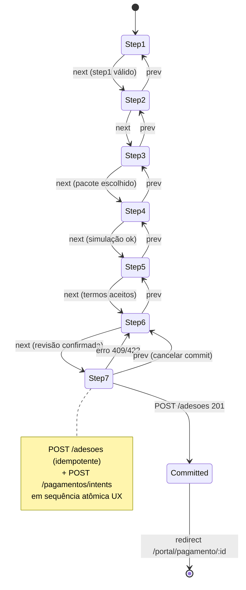

### 2.9 Edge cases

| Cenário                                                          | Comportamento                                                                                  |
| ---------------------------------------------------------------- | ---------------------------------------------------------------------------------------------- |
| Usuário fecha aba na etapa 4                                     | sessionStorage preserva; ao reabrir, wizard restaura de `wizard-adesao`.                       |
| Usuário faz logout no meio do wizard                             | `logout` chama `wizardStore.reset()` via efeito no auth-store.                                 |
| Usuário tenta acessar `/portal/adesao/7` direto (URL manipulada) | `beforeLoad` redireciona para `currentStep` atual.                                             |
| Pacote escolhido em 3 é descontinuado antes da etapa 7           | `POST /adesoes` retorna 409 `InvariantViolation`; exibir erro + voltar para 3.                 |
| 429 em `POST /adesoes/simular`                                   | Toast "Muitas tentativas"; botão "Simular" desativado por `retry_after`.                       |
| 409 `IdempotencyConflict` na etapa 7                             | Gerar nova key; se erro persistir, recomeçar wizard (reset).                                   |
| Rede cai durante commit                                          | Retry com mesma key (a key sobrevive em sessionStorage); UX: toast + botão "Tentar novamente". |
| Schema do wizard-store mudou (versão 1 → 2)                      | `migrate` reset (começa do zero — dados são de uma única sessão).                              |

### 2.10 Tratamento de erros

| `error`               | Contexto                             | UX                                                                 |
| --------------------- | ------------------------------------ | ------------------------------------------------------------------ |
| `ValidationError`     | Qualquer submit de etapa             | `setError` inline via `handleApiError(err, { form })`.             |
| `InvariantViolation`  | Pacote descontinuado, prazo expirado | Toast + voltar à etapa relevante (mapeado por campo).              |
| `IdempotencyConflict` | Commit etapa 7                       | Limpa key; se persistir, reset wizard + toast explicativo.         |
| `RateLimitExceeded`   | Simulação ou commit                  | Banner com contagem regressiva.                                    |
| `Unauthenticated`     | Qualquer hook                        | Interceptor redireciona → wizard state preservado (será retomado). |

### 2.11 Dependências

- Backend: `GET /eventos/{ulid}/pacotes` ❓, `POST /adesoes/simular` ❓, `POST /adesoes` ❓, `POST /pagamentos/intents` ✅.
- Stores: `useAuthStore` (para obter `formandoUlid` atual), `useWizardStore` (próprio).
- Libs: `lib/idempotency.ts`, `lib/money.ts` (formatar simulação), `lib/date.ts`.
- Outros módulos: módulo Pagamento recebe o `pagamento.id` após commit.

### 2.12 Estratégia de testes

**Unit (Vitest):**

- Zod schemas das 7 etapas (válido + inválido).
- `migrate` do wizard store com dados de versão antiga.
- Redutores `next`, `prev`, `setStepData`.

**Integration:**

- `useSimulacao` happy path.
- `useCriarAdesao` com idempotência (duas chamadas mesma key → um só recurso).

**Component (RTL):**

- `Step1Personal` com CPF inválido → mensagem Zod.
- `Step4Plano` simulação → tabela de parcelas com valores formatados.
- `Step7Pagamento`: commit ok → redireciona; commit erro → volta.

**E2E (Playwright):**

- Happy path completo das 7 etapas.
- Cenário de retomada: fechar aba em etapa 3, reabrir, verificar que etapa 3 preserva dados.

### 2.13 KPIs

- **Taxa de conclusão do wizard (funnel):** tracking por etapa (Sentry breadcrumb).
- **Tempo médio por etapa:** p50 < 45s.
- **Taxa de abandono etapa 5 → 6:** < 15%.

---

## 3. Módulo Financeiro & Pagamento

### 3.1 Objetivo

Exibir extrato de parcelas com paginação infinita e permitir pagamento de parcelas pendentes via boleto/PIX/cartão, com polling de status até confirmação.

### 3.2 Escopo

**In:**

- Extrato cursor paginado (`GET /me/extrato`).
- Filtros (adesão, período) e ordenação.
- Tela de pagamento por parcela (`/portal/pagamento/$parcela_ulid`).
- Polling do status do pagamento com timeout.
- Exibição de QR PIX, linha digitável boleto, dados do cartão.
- Comprovante de pagamento (`GET /pagamentos/{ulid}` após `status=pago`).

**Out:**

- Dashboard KPI (tela `/portal/home` — consome viewmodels prontos).
- Cartão tokenizado — PCI scope, exige integração gateway F3+ ❓.

### 3.3 Arquitetura local

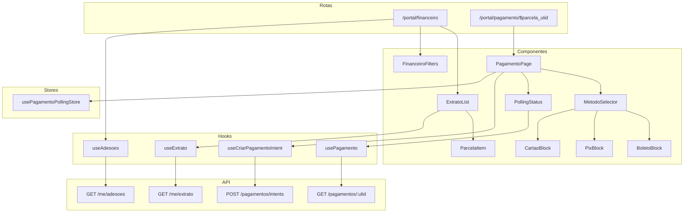

### 3.4 Hooks TanStack Query

#### 3.4.1 `useExtrato` (cursor infinite)

```ts
export interface ExtratoFilters {
    adesaoUlid?: string;
    periodoDe?: string;
    periodoAte?: string;
}

export function useExtrato(filters: ExtratoFilters = {}) {
    return useInfiniteQuery({
        queryKey: ['extrato', filters],
        initialPageParam: null as string | null,
        queryFn: async ({ pageParam }) => {
            const { data } = await api.get<CursorList<ExtratoItemDto>>('/me/extrato', {
                params: {
                    'page[cursor]': pageParam,
                    'page[size]': 50,
                    'filter[adesao_id]': filters.adesaoUlid,
                    'filter[periodo_de]': filters.periodoDe,
                    'filter[periodo_ate]': filters.periodoAte,
                    sort: '-data_movimento',
                },
            });
            return {
                ...data,
                data: data.data.map(toParcelaViewModel),
            };
        },
        getNextPageParam: (last) => last.meta.next_cursor,
        staleTime: 30_000,
    });
}
```

#### 3.4.2 `useCriarPagamentoIntent`

Ver [§6.5 de 08-API-INTEGRATION-CONTRACT](./08-API-INTEGRATION-CONTRACT.md#66-código-exemplo--use-pagamentots).

#### 3.4.3 `usePagamento` com polling controlado

```ts
const POLL_INTERVAL_MS = 2_000;
const POLL_MAX_MS = 10 * 60 * 1_000; // 10 min

export function usePagamento(pagamentoUlid: string | null) {
    const [startedAt] = useState(() => Date.now());

    return useQuery({
        queryKey: ['pagamento', pagamentoUlid],
        enabled: !!pagamentoUlid,
        queryFn: async () => {
            const { data } = await api.get<SingleEnvelope<PagamentoDto>>(`/pagamentos/${pagamentoUlid}`);
            return toPagamentoViewModel(data.data);
        },
        refetchInterval: (query) => {
            const vm = query.state.data;
            if (!vm) return POLL_INTERVAL_MS;
            if (vm.estaFinalizado) return false;
            if (Date.now() - startedAt > POLL_MAX_MS) return false; // timeout
            return POLL_INTERVAL_MS;
        },
        staleTime: 0,
    });
}
```

### 3.5 Store Zustand — `payment-polling-store.ts`

Opcional; o polling é controlado pelo React Query. A store serve apenas para **notificação UX** do timeout.

```ts
interface PollingNotice {
    pagamentoUlid: string;
    startedAt: number;
    timeoutMs: number;
}

interface PaymentPollingState {
    active: PollingNotice | null;
    start: (id: string) => void;
    clear: () => void;
    isExpired: () => boolean;
}
```

### 3.6 Componentes principais

| Componente          | Props                                   | Responsabilidade                               |
| ------------------- | --------------------------------------- | ---------------------------------------------- |
| `ExtratoList`       | `filters?: ExtratoFilters`              | Lista infinita com intersection observer       |
| `ParcelaItem`       | `item: ParcelaViewModel`                | Linha com badge + ação "Pagar"                 |
| `FinanceiroFilters` | `onChange: (f: ExtratoFilters) => void` | Seletor adesão + range de data                 |
| `PagamentoPage`     | `parcelaUlid: string`                   | Orquestra intent + polling + blocos por método |
| `MetodoSelector`    | `value; onChange`                       | Tabs: Boleto / PIX / Cartão                    |
| `BoletoBlock`       | `boleto: BoletoDto`                     | Linha digitável + botão copiar + PDF           |
| `PixBlock`          | `pix: PixDto; countdownMs`              | QR code + copia cola + contagem até expira     |
| `CartaoBlock`       | `onSubmit`                              | Form + máscara de cartão + tokenização gateway |
| `PollingStatus`     | `pagamento`                             | Badge animado: "Aguardando confirmação..."     |
| `ComprovanteCard`   | `pagamento`                             | Após `status=pago`: botão baixar PDF           |

### 3.7 Rotas

- `/portal/financeiro` → lista extrato.
- `/portal/pagamento/$parcela_ulid` → orquestra pagamento. Usa `isUlid` do `lib/ulid.ts` para validar param.

### 3.8 Máquina de estados do pagamento

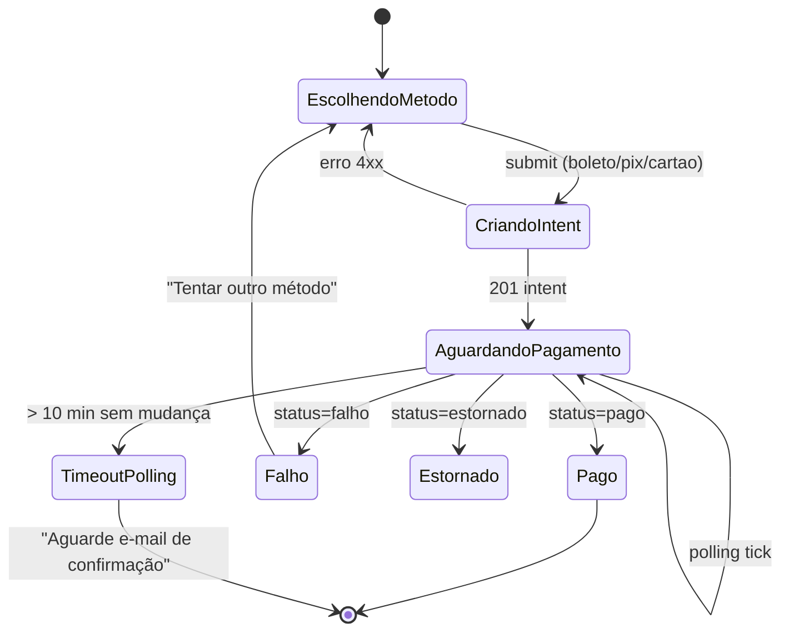

### 3.9 Edge cases

| Cenário                                           | Comportamento                                                              |
| ------------------------------------------------- | -------------------------------------------------------------------------- |
| Usuário clica "Pagar" 2x rápido                   | Idempotency key por `parcela_ulid` — mesma intent retornada.               |
| Polling ativo + fecha aba                         | Nada — próxima abertura vê status real via `GET /pagamentos/:ulid`.        |
| Gateway 5xx                                       | Toast "Gateway fora. Tente novamente."; intent fica `pendente`.            |
| `PagamentoDuplicado`                              | Redirecionar para `/portal/pagamento/<id_duplicado>` (id em `details`).    |
| QR PIX expirou (ex.: PIX com validade 30min)      | `PixDto.expira_em` do cliente < now → botão "Gerar novo QR" (nova intent). |
| Usuário troca método no meio                      | Nova intent com nova idempotency key (scope inclui `metodo` hash).         |
| Parcela é paga por webhook enquanto usuário vê QR | Polling detecta `status=pago` → exibe `<ComprovanteCard>`.                 |
| Parcela cancelada admin-side enquanto aberta      | Polling detecta `status=cancelado` → toast + voltar ao extrato.            |

### 3.10 Tratamento de erros

| `error`               | Origem                           | UX                                  |
| --------------------- | -------------------------------- | ----------------------------------- |
| `ValidationError`     | cartão: CVV inválido             | inline no form cartão               |
| `PagamentoDuplicado`  | `POST /intents`                  | Navegar para existente              |
| `GatewayIndisponivel` | `POST /intents` ou `GET :ulid`   | Toast + retry exponencial em GET    |
| `RateLimitExceeded`   | excesso de intents               | Banner + desativa "Gerar novo"      |
| `DomainError`         | regra servidor (parcela já paga) | Toast + redirect ao extrato         |
| `IdempotencyConflict` | scope corrompido                 | Limpa key; toast "Refaça a seleção" |

### 3.11 Dependências

- Backend: `GET /me/extrato` ✅, `POST /pagamentos/intents` ✅, `GET /pagamentos/{ulid}` ✅.
- Gateway: integração Itaú (boleto/PIX/cartão) — ❓ F3 fase final.
- Stores: `useAuthStore` (só leitura do user).
- Libs: `lib/idempotency.ts`, `lib/money.ts`, `lib/date.ts`.

### 3.12 Estratégia de testes

**Unit:**

- `toParcelaViewModel` com todos os `tipo` e `status`.
- `toPagamentoViewModel` cobrindo `estaFinalizado`, `deveFazerPolling`.

**Integration (MSW):**

- `useExtrato` → paginação incremental.
- `usePagamento` polling → simular tick 1, 2, N; após `pago`, polling cessa.
- `useCriarPagamentoIntent` → duas chamadas com mesma key → 1 POST.

**Component:**

- `<BoletoBlock>` clipboard (API de clipboard mockada).
- `<PixBlock>` contagem regressiva de expiração.

**E2E:**

- Financeiro → clica "Pagar" em parcela pendente → seleciona PIX → QR exibido → simular webhook via test API → polling atualiza → comprovante visível.

### 3.13 KPIs

- **Taxa de sucesso de intent em 1ª tentativa:** > 98%.
- **Tempo médio polling até `pago`:** p50 < 30s para PIX, p95 < 2min.
- **Taxa de conversão (intent → pago):** > 85% em PIX, > 70% em boleto em 7d.

---

## 4. Módulo Mapa de Mesas / Seating

### 4.1 Objetivo

Permitir ao formando escolher assento(s) interativamente num mapa 2D, com hold temporário de 5 min, confirmação, cancelamento e troca, tudo com idempotência.

### 4.2 Escopo

**In:**

- Mapa visual 2D (setores > mesas > assentos).
- Hold de 5 min com contagem regressiva reconciliada com servidor.
- Confirmação ou cancelamento antes de expirar.
- Troca de assento (atômica no servidor).
- Polling curto (5s) do mapa durante hold.
- Deltas com `?since=` para reduzir payload.

**Out:**

- WebSocket/Reverb real-time (postergado a F7 se necessário).
- Edição do layout do mapa (admin-side).

### 4.3 Arquitetura local

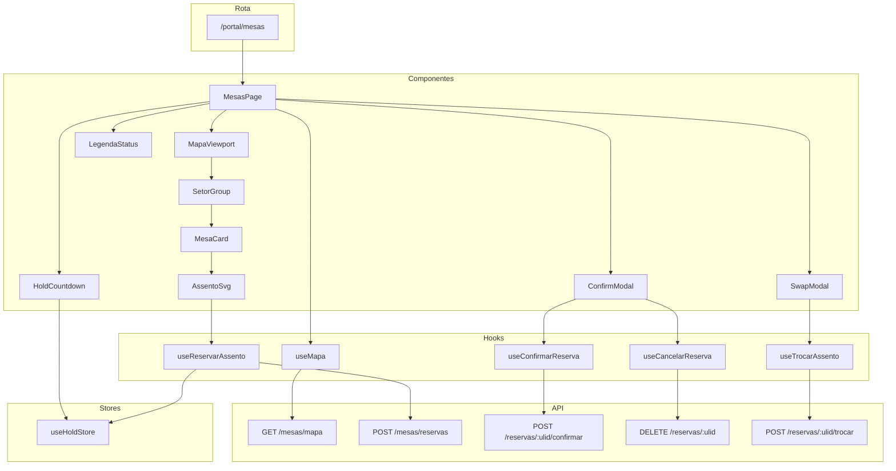

### 4.4 Hooks TanStack Query

#### 4.4.1 `useMapa` — snapshot + polling durante hold

```ts
export function useMapa(eventoUlid: string) {
    const hold = useHoldStore();
    const reservasDoUsuario = hold.reservasDoUsuario; // Set<assentoUlid>

    return useQuery({
        queryKey: ['mesas', eventoUlid],
        queryFn: async () => {
            const { data } = await api.get<SingleEnvelope<MapaMesasDto>>(`/eventos/${eventoUlid}/mesas/mapa`);
            return toMapaMesasViewModel(data.data, reservasDoUsuario);
        },
        refetchInterval: hold.isActive ? 5_000 : false,
        staleTime: 0,
    });
}
```

#### 4.4.2 `useReservarAssento`

Ver [§6.5 de 08-API-INTEGRATION-CONTRACT](./08-API-INTEGRATION-CONTRACT.md#65-código-exemplo--use-seatingts).

#### 4.4.3 `useConfirmarReserva`

```ts
export function useConfirmarReserva(eventoUlid: string) {
    const qc = useQueryClient();
    const hold = useHoldStore();
    return useMutation({
        mutationFn: async (reservaUlid: string) => {
            const { data } = await api.post<SingleEnvelope<ReservaAssentoDto>>(
                `/eventos/${eventoUlid}/mesas/reservas/${reservaUlid}/confirmar`,
            );
            return toReservaAssentoViewModel(data.data);
        },
        onSuccess: (reserva) => {
            hold.clearHold(reserva.id);
            qc.invalidateQueries({ queryKey: ['mesas', eventoUlid] });
        },
    });
}
```

#### 4.4.4 `useCancelarReserva`

```ts
export function useCancelarReserva(eventoUlid: string) {
    const qc = useQueryClient();
    const hold = useHoldStore();
    return useMutation({
        mutationFn: async (reservaUlid: string) => {
            await api.delete(`/eventos/${eventoUlid}/mesas/reservas/${reservaUlid}`);
            return reservaUlid;
        },
        onSuccess: (reservaUlid) => {
            hold.clearHold(reservaUlid);
            qc.invalidateQueries({ queryKey: ['mesas', eventoUlid] });
        },
    });
}
```

#### 4.4.5 `useTrocarAssento`

```ts
export function useTrocarAssento(eventoUlid: string) {
    const qc = useQueryClient();
    const hold = useHoldStore();
    return useMutation({
        mutationFn: async (input: { reservaUlid: string; destinoAssentoUlid: string }) => {
            const scope = `seating:trocar:${input.reservaUlid}:${input.destinoAssentoUlid}`;
            const key = getIdempotencyKey(scope);
            const { data } = await api.post<SingleEnvelope<ReservaAssentoDto>>(
                `/eventos/${eventoUlid}/mesas/reservas/${input.reservaUlid}/trocar`,
                { assento_destino_ulid: input.destinoAssentoUlid, origem: 'formando' },
                { headers: { 'X-Idempotency-Key': key } },
            );
            clearIdempotencyKey(scope);
            return toReservaAssentoViewModel(data.data);
        },
        onSuccess: (novaReserva) => {
            hold.replaceHold(novaReserva.id, novaReserva.holdExpiresAt!);
            qc.invalidateQueries({ queryKey: ['mesas', eventoUlid] });
        },
    });
}
```

### 4.5 Store Zustand — `hold-store.ts`

```ts
// resources/spa/src/stores/hold-store.ts
import { create } from 'zustand';

interface Hold {
    reservaUlid: string;
    assentoUlid: string;
    holdExpiresAt: string; // ISO servidor
}

interface HoldState {
    active: Hold | null;
    secondsRemaining: number;
    // derived
    isActive: boolean;
    reservasDoUsuario: Set<string>;
    // actions
    startHold: (reservaUlid: string, holdExpiresAtIso: string, assentoUlid: string) => void;
    replaceHold: (reservaUlid: string, holdExpiresAtIso: string | null) => void;
    clearHold: (reservaUlid: string) => void;
    tick: () => void;
    reconcile: () => void;
}

export const useHoldStore = create<HoldState>((set, get) => ({
    active: null,
    secondsRemaining: 0,
    isActive: false,
    reservasDoUsuario: new Set(),

    startHold: (reservaUlid, iso, assentoUlid) => {
        const expiresMs = new Date(iso).getTime();
        const seconds = Math.max(0, Math.floor((expiresMs - Date.now()) / 1000));
        set({
            active: { reservaUlid, assentoUlid, holdExpiresAt: iso },
            secondsRemaining: seconds,
            isActive: true,
            reservasDoUsuario: new Set([...get().reservasDoUsuario, assentoUlid]),
        });
    },

    replaceHold: (reservaUlid, iso) => {
        if (!iso) return;
        const current = get().active;
        if (!current || current.reservaUlid !== reservaUlid) return;
        const expiresMs = new Date(iso).getTime();
        const seconds = Math.max(0, Math.floor((expiresMs - Date.now()) / 1000));
        set({
            active: { ...current, holdExpiresAt: iso },
            secondsRemaining: seconds,
        });
    },

    clearHold: (reservaUlid) => {
        const current = get().active;
        const assentoUlid = current?.assentoUlid;
        if (current && current.reservaUlid === reservaUlid) {
            const next = new Set(get().reservasDoUsuario);
            if (assentoUlid) next.delete(assentoUlid);
            set({ active: null, secondsRemaining: 0, isActive: false, reservasDoUsuario: next });
        }
    },

    tick: () => {
        const { active } = get();
        if (!active) return;
        const expiresMs = new Date(active.holdExpiresAt).getTime();
        const seconds = Math.max(0, Math.floor((expiresMs - Date.now()) / 1000));
        set({ secondsRemaining: seconds });
        if (seconds === 0) set({ isActive: false });
    },

    reconcile: () => {
        get().tick();
    },
}));

// setInterval global de 1s para tick
if (typeof window !== 'undefined') {
    setInterval(() => useHoldStore.getState().tick(), 1000);
}
```

### 4.6 Componentes principais

| Componente      | Props                                | Responsabilidade                             |
| --------------- | ------------------------------------ | -------------------------------------------- |
| `MesasPage`     | `eventoUlid: string`                 | Orquestra mapa + hold countdown + modais     |
| `MapaViewport`  | `mapa: MapaMesasViewModel; onSelect` | SVG zoomável com setores                     |
| `SetorGroup`    | `setor: SetorViewModel`              | Agrupa mesas                                 |
| `MesaCard`      | `mesa: MesaViewModel; onSelect`      | Desenho de mesa + assentos                   |
| `AssentoSvg`    | `assento: AssentoViewModel; onClick` | Círculo interativo; cor por status           |
| `HoldCountdown` | —                                    | Lê `useHoldStore`; mostra mm:ss              |
| `ConfirmModal`  | `reservaUlid; onConfirm; onCancel`   | Botões "Confirmar" / "Cancelar"              |
| `SwapModal`     | `reservaAtualUlid; onPick`           | Seleção de novo assento                      |
| `LegendaStatus` | —                                    | Legendas: livre, hold, confirmada, bloqueada |

### 4.7 Rota — `/portal/mesas`

```tsx
export const Route = createFileRoute('/portal/mesas')({
    beforeLoad: () => {
        const eventoUlid = useAuthStore.getState().user?.eventoPrincipalUlid;
        if (!eventoUlid) throw redirect({ to: '/portal/home' });
    },
    component: MesasRoute,
});

function MesasRoute() {
    const eventoUlid = useAuthStore((s) => s.user?.eventoPrincipalUlid);
    if (!eventoUlid) return null;
    return <MesasPage eventoUlid={eventoUlid} />;
}
```

### 4.8 Máquina de estados do seating

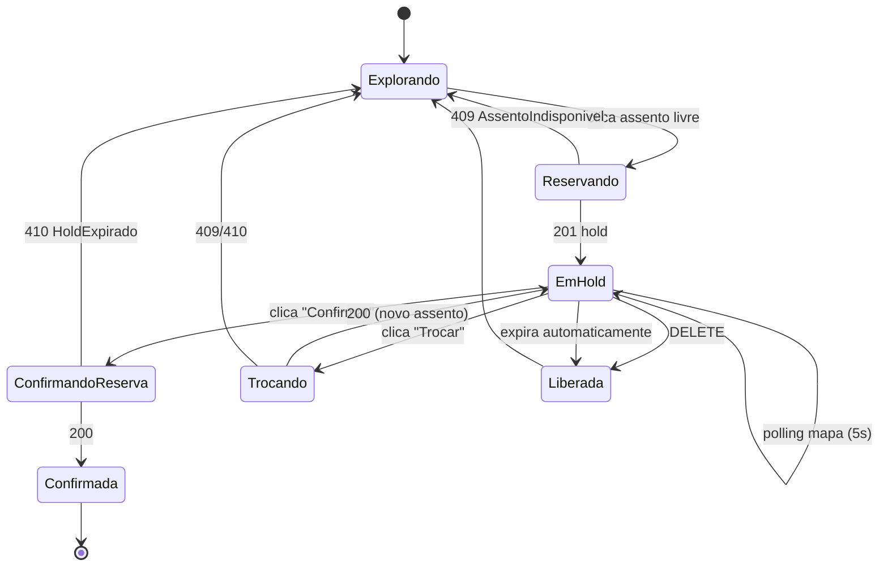

### 4.9 Edge cases

| Cenário                                                            | Comportamento                                                                                 |
| ------------------------------------------------------------------ | --------------------------------------------------------------------------------------------- |
| 2 usuários clicam no mesmo assento simultaneamente                 | Primeiro: 201 hold; segundo: 409 `AssentoIndisponivel` → refetch + UI fallback                |
| Hold expira durante o clique "Confirmar"                           | 410 `HoldExpirado` → modal "Tempo esgotou" + recarrega mapa                                   |
| Rede cai no meio do POST reservar                                  | Retry automático com mesma idempotency key; se servidor já criou, retorna mesma reserva       |
| Reload da página com hold ativo                                    | `hydrate` busca `/me` + `/me/reservas` (❓ endpoint) e reconstrói `hold-store`                |
| Usuário navega fora de `/portal/mesas` com hold ativo              | Store persiste em memória; ao voltar, timer reconcilia; polling para se rota muda             |
| Clock do cliente diferente do servidor                             | `secondsRemaining` é calculado pela diff com `hold_expires_at` do servidor (fonte de verdade) |
| Polling recebe assento "confirmada" por outro usuário              | Marca visual imediata + impede clique (interagivel=false)                                     |
| Troca com assento destino tomado no meio                           | 409 `AssentoIndisponivel` → mantém hold atual, mostra toast                                   |
| `IdempotencyConflict` em troca (scope mudou)                       | Limpa key; próxima tentativa cria novo scope                                                  |
| Hold chega a 0 seg na UI mas servidor ainda aceita confirm (drift) | UI bloqueia botão; se usuário insistir, servidor retorna 410 — consistente                    |

### 4.10 Tratamento de erros

| `error`               | Origem                  | UX                                                     |
| --------------------- | ----------------------- | ------------------------------------------------------ |
| `AssentoIndisponivel` | reservar/trocar         | Toast + refetch + re-habilita seleção                  |
| `HoldExpirado`        | confirmar/trocar        | Modal "Tempo esgotou"; limpar hold-store; refetch mapa |
| `CotaEsgotada`        | reservar (se aplicável) | Banner: "Sua cota de assentos está cheia"              |
| `IdempotencyConflict` | reservar/trocar         | Limpar key do scope; refazer                           |
| `RateLimitExceeded`   | múltiplas ações         | Desativar botões por `retry_after` segundos            |
| `Forbidden`           | reservar fora da janela | Banner: "Janela de reservas fechada"                   |

### 4.11 Dependências

- Backend: `GET /mesas/mapa`, `POST/DELETE/POST /mesas/reservas[:ulid][/confirmar|/trocar]` — todos ✅.
- Infra: `config.hold_ttl_seconds` vem do evento (✅).
- Stores: `useAuthStore` (eventoUlid), `useHoldStore` (próprio).
- Libs: `lib/idempotency.ts`, `lib/ulid.ts`, `lib/date.ts` (`secondsUntil`).
- Módulo Convites ❓: opcional — associar reserva a um convite (`convite_ulid`).

### 4.12 Estratégia de testes

**Unit:**

- `hold-store.tick` → decrementa corretamente; vai a 0 quando expira.
- `hold-store.replaceHold` → troca somente se `reservaUlid` bate.
- `toMapaMesasViewModel` → `reservasDoUsuario` marca `estaDoUsuario=true`.

**Integration:**

- `useReservarAssento` 201 → popula hold store.
- `useReservarAssento` 409 → store não muda; refetch dispara.
- `useConfirmarReserva` 410 → `clearHold` é chamado.
- Polling: simular 3 ticks com mudança de status → UI refleche.

**Component:**

- `<AssentoSvg>`: clique em livre → chama `onClick`; clique em ocupado → disabled.
- `<HoldCountdown>`: renderiza mm:ss; zero → estado expirado.

**E2E (Playwright):**

- Reservar → hold timer inicia → confirmar → status `confirmada`.
- Reservar → esperar expirar (mockar tempo) → tentar confirmar → 410 → modal.
- Troca: reservar A → trocar por B → A libera, B hold, novo timer.

### 4.13 KPIs

- **Taxa de conflito `AssentoIndisponivel`:** < 5% (se alto, considerar Reverb em F7).
- **Tempo p95 reservar → confirmar:** < 90s (operação tranquila dentro do hold).
- **Taxa de expiração de hold:** < 10% (sinal de UX confusa se alto).

---

## 5. Módulo RSVP Público

### 5.1 Objetivo

Permitir ao **convidado externo** (sem login) visualizar o convite e registrar presença (confirmo / recuso / tentativa) via token mágico enviado por e-mail/WhatsApp.

### 5.2 Escopo

**In:**

- Visualização do convite e detalhes do evento (`GET /convite/{token}`).
- Form de resposta (`POST /convite/{token}/rsvp`).
- Tratamento de token inválido/expirado/já usado.
- Rate limiting 10/min/IP.

**Out:**

- Edição de resposta (se `permite_edicao=true` na política do evento, a API já resolve — o cliente apenas tenta).
- Upload de foto, convidados adicionais.

### 5.3 Arquitetura local

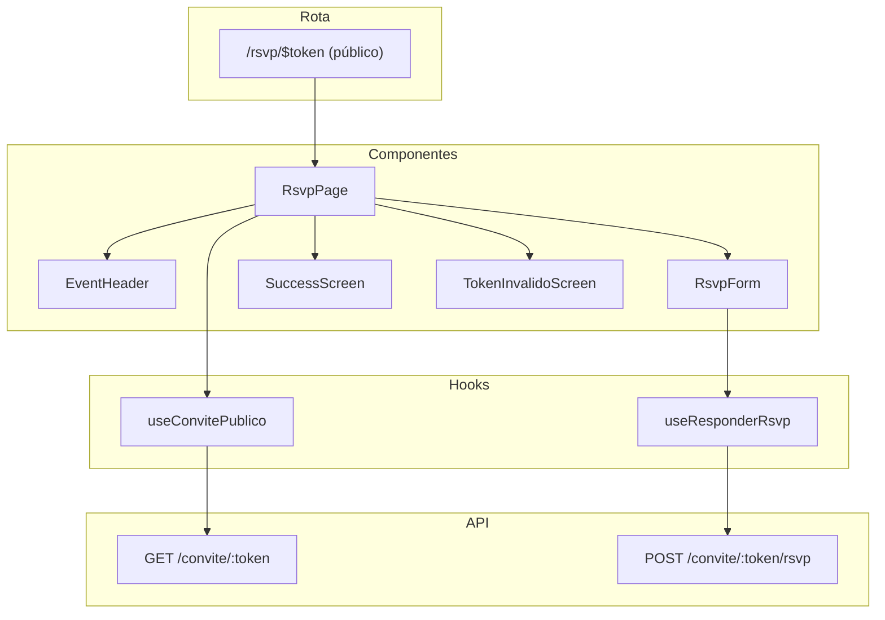

### 5.4 Hooks TanStack Query

#### 5.4.1 `useConvitePublico`

```ts
const TOKEN_REGEX = /^[a-f0-9]{64}$/i;

export function useConvitePublico(token: string | null) {
    return useQuery({
        queryKey: ['convite', token],
        enabled: !!token && TOKEN_REGEX.test(token ?? ''),
        queryFn: async () => {
            const { data } = await api.get<SingleEnvelope<ConvitePublicoDto>>(`/convite/${token}`);
            return toConvitePublicoViewModel(data.data);
        },
        staleTime: 0,
        retry: (count, err) => {
            if (err instanceof ApiError && [404, 429, 410].includes(err.status)) return false;
            return count < 1;
        },
    });
}
```

#### 5.4.2 `useResponderRsvp`

```ts
interface RsvpInput {
    token: string;
    resposta: 'confirmo' | 'recuso' | 'tentativa';
    nomeConfirmado: string;
    observacao?: string;
}

export function useResponderRsvp() {
    const qc = useQueryClient();
    return useMutation({
        mutationFn: async (input: RsvpInput) => {
            const { data } = await api.post<
                SingleEnvelope<{ convite: { id: string; status: string; confirmado_at: string | null } }>
            >(`/convite/${input.token}/rsvp`, {
                resposta: input.resposta,
                nome_confirmado: input.nomeConfirmado,
                observacao: input.observacao ?? null,
            });
            return data.data;
        },
        onSuccess: (_, input) => {
            qc.invalidateQueries({ queryKey: ['convite', input.token] });
        },
    });
}
```

### 5.5 Stores

Nenhum. A rota é totalmente stateless — cada sessão é um fluxo isolado.

### 5.6 Componentes principais

| Componente            | Props                         | Responsabilidade                                 |
| --------------------- | ----------------------------- | ------------------------------------------------ |
| `RsvpPage`            | `token: string`               | Orquestra loading / load / form / sucesso / erro |
| `EventHeader`         | `vm: ConvitePublicoViewModel` | Banner com nome do evento, data, local           |
| `RsvpForm`            | `token; onSuccess`            | Form de resposta (RHF + Zod)                     |
| `SuccessScreen`       | `resposta: string`            | "Obrigado! Presença confirmada."                 |
| `TokenInvalidoScreen` | —                             | "Link inválido ou expirado."                     |

### 5.7 Rota — `/rsvp/$token`

```tsx
// resources/spa/src/routes/rsvp/$token.tsx
import { createFileRoute } from '@tanstack/react-router';
import { RsvpPage } from '@/components/rsvp/rsvp-page';

const TOKEN_REGEX = /^[a-f0-9]{64}$/i;

export const Route = createFileRoute('/rsvp/$token')({
    parseParams: ({ token }) => {
        if (!TOKEN_REGEX.test(token)) return { token: '' }; // aciona TokenInvalidoScreen
        return { token };
    },
    component: RsvpRoute,
});

function RsvpRoute() {
    const { token } = Route.useParams();
    return <RsvpPage token={token} />;
}
```

### 5.8 Máquina de estados

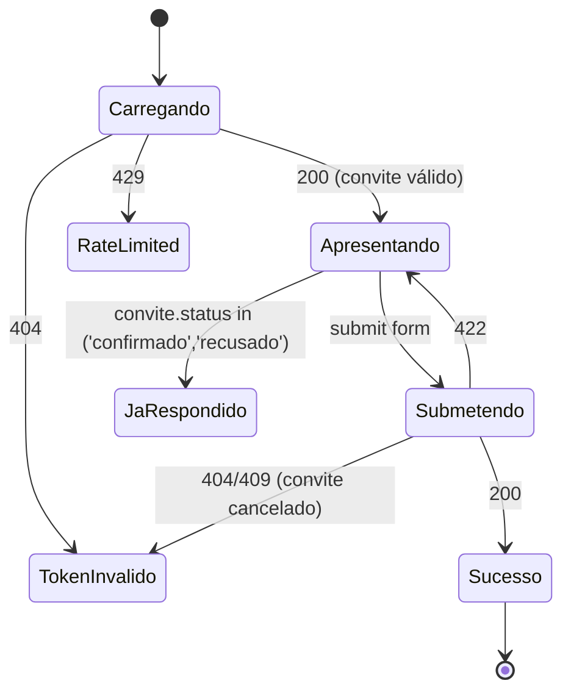

### 5.9 Edge cases

| Cenário                                                     | Comportamento                                               |
| ----------------------------------------------------------- | ----------------------------------------------------------- |
| Token com formato errado                                    | Rota renderiza `<TokenInvalidoScreen>` sem chamar API.      |
| Token válido mas convite cancelado (409 InvariantViolation) | Exibir mensagem: "Este convite foi cancelado."              |
| Convidado refaz RSVP (permite_edicao=true)                  | API aceita; cliente invalida query + mostra nova resposta.  |
| Convidado atinge 10/min rate limit                          | Banner "Muitas tentativas. Aguarde X s."; botão desativado. |
| Convidado fecha aba após 200                                | Sessão pública é ephemera; nada a preservar.                |
| Convidado abre link em navegador diferente                  | Mesmo fluxo; sem relação com session/auth.                  |
| Evento já encerrado (janela fecha_rsvp_at passou)           | Servidor retorna 409; cliente mostra "RSVP encerrado".      |

### 5.10 Tratamento de erros

| `error`              | HTTP | UX                                               |
| -------------------- | ---- | ------------------------------------------------ |
| `NotFound`           | 404  | `<TokenInvalidoScreen>` com "Verifique o link".  |
| `RateLimitExceeded`  | 429  | Banner com contador.                             |
| `InvariantViolation` | 409  | "Convite cancelado ou RSVP encerrado."           |
| `ValidationError`    | 422  | `setError` em `nome_confirmado` ou `observacao`. |

### 5.11 Dependências

- Backend: `GET /convite/{token}`, `POST /convite/{token}/rsvp` — ✅.
- Stores: nenhum.
- Libs: nenhuma específica.
- **Sem auth guard** — rota é pública.

### 5.12 Estratégia de testes

**Unit:**

- `toConvitePublicoViewModel` → `jaRespondeu` cobre todos os status.

**Integration:**

- `useConvitePublico` 404 → retry desativado; UI mostra token inválido.
- `useResponderRsvp` 422 → mapeia para `setError`.

**Component:**

- `<RsvpForm>`: submit com nome vazio → Zod erro inline.

**E2E:**

- Happy path: abrir link token válido → ver nome evento → confirmar → sucesso.
- Token inválido: abrir `/rsvp/abc` → ver tela de erro sem chamar API.

### 5.13 KPIs

- **Taxa de RSVP em 1 acesso:** > 90%.
- **Tempo médio carregamento:** < 1s.
- **404 rate:** < 3% (tokens vazados/alterados).

---

## 6. Módulo Convites & Cotas

### 6.1 Objetivo

Permitir ao formando emitir convites individuais ou em lote, gerenciar (editar, cancelar, reemitir, transferir), consultar cotas remanescentes e compartilhar links RSVP.

### 6.2 Escopo

**In:**

- Lista de convites emitidos com filtros (status, tipo, busca).
- Emissão individual (form simples).
- Emissão em lote (CSV upload ❓ ou coleção JSON).
- Polling de status do lote.
- Cancelamento, reemissão, transferência.
- Cotas consolidadas por evento (`GET /me/cotas`).
- Compartilhamento: link + QR code (❓ dependente de `token_publico` vir no resource).

**Out:**

- RSVP público (módulo separado §5).
- Analytics de abertura/confirmação em detalhes (dashboard admin-side).

### 6.3 Arquitetura local

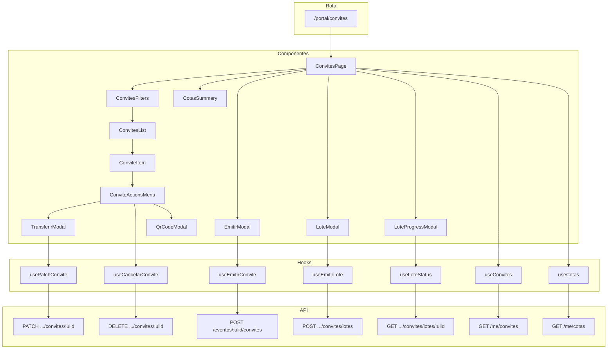

### 6.4 Hooks TanStack Query

#### 6.4.1 `useConvites` (cursor infinite)

```ts
export function useConvites(filters: ConvitesFilters = {}) {
    return useInfiniteQuery({
        queryKey: ['convites', filters],
        initialPageParam: null as string | null,
        queryFn: async ({ pageParam }) => {
            const { data } = await api.get<CursorList<ConviteDto>>('/me/convites', {
                params: {
                    'page[cursor]': pageParam,
                    'page[size]': 50,
                    'filter[status]': filters.status,
                    'filter[tipo]': filters.tipo,
                    'filter[search]': filters.search,
                    sort: '-created_at',
                },
            });
            return { ...data, data: data.data.map(toConviteViewModel) };
        },
        getNextPageParam: (last) => last.meta.next_cursor,
        staleTime: 30_000,
    });
}
```

#### 6.4.2 `useCotas`

```ts
export function useCotas() {
    return useQuery({
        queryKey: ['me', 'cotas'],
        queryFn: async () => {
            const { data } = await api.get<{ data: CotasPorEventoDto[] }>('/me/cotas');
            return data.data.map(toCotasEventoViewModel);
        },
        staleTime: 30_000,
    });
}
```

#### 6.4.3 `useEmitirConvite`

```ts
export function useEmitirConvite(eventoUlid: string) {
    const qc = useQueryClient();
    return useMutation({
        mutationFn: async (input: EmitirConviteInput) => {
            const { data } = await api.post<SingleEnvelope<ConviteDto>>(
                `/eventos/${eventoUlid}/convites`,
                {
                    tipo: input.tipo,
                    convidado: input.convidado,
                    origem_cota: input.origemCota,
                },
                { headers: { 'X-Idempotency-Key': crypto.randomUUID() } }, // recomendado
            );
            return toConviteViewModel(data.data);
        },
        onSuccess: () => {
            qc.invalidateQueries({ queryKey: ['convites'] });
            qc.invalidateQueries({ queryKey: ['me', 'cotas'] });
        },
    });
}
```

#### 6.4.4 `useEmitirLote` + `useLoteStatus`

```ts
export function useEmitirLote(eventoUlid: string) {
    return useMutation({
        mutationFn: async (convites: EmitirConviteInput[]) => {
            const scope = `convites:lote:${eventoUlid}:${hashItems(convites)}`;
            const key = getIdempotencyKey(scope);
            const { data } = await api.post<SingleEnvelope<LoteConvitesDto>>(
                `/eventos/${eventoUlid}/convites/lotes`,
                { convites: convites.map(toRequestShape) },
                { headers: { 'X-Idempotency-Key': key } },
            );
            clearIdempotencyKey(scope);
            return data.data;
        },
    });
}

export function useLoteStatus(eventoUlid: string, loteUlid: string | null) {
    return useQuery({
        queryKey: ['lote', eventoUlid, loteUlid],
        enabled: !!loteUlid,
        queryFn: async () => {
            const { data } = await api.get<SingleEnvelope<LoteConvitesDto>>(
                `/eventos/${eventoUlid}/convites/lotes/${loteUlid}`,
            );
            return data.data;
        },
        refetchInterval: (query) => {
            const d = query.state.data;
            if (!d) return 3_000;
            return ['concluido', 'falha_parcial', 'falha'].includes(d.status) ? false : 3_000;
        },
        staleTime: 0,
    });
}
```

#### 6.4.5 `usePatchConvite` + `useCancelarConvite`

```ts
export function usePatchConvite(eventoUlid: string) {
    const qc = useQueryClient();
    return useMutation({
        mutationFn: async (input: { conviteUlid: string; patch: ConvitePatch }) => {
            const { data } = await api.patch<SingleEnvelope<ConviteDto>>(
                `/eventos/${eventoUlid}/convites/${input.conviteUlid}`,
                input.patch,
            );
            return toConviteViewModel(data.data);
        },
        onSuccess: () => qc.invalidateQueries({ queryKey: ['convites'] }),
    });
}

export function useCancelarConvite(eventoUlid: string) {
    const qc = useQueryClient();
    return useMutation({
        mutationFn: async (conviteUlid: string) => {
            await api.delete(`/eventos/${eventoUlid}/convites/${conviteUlid}`);
            return conviteUlid;
        },
        onSuccess: () => {
            qc.invalidateQueries({ queryKey: ['convites'] });
            qc.invalidateQueries({ queryKey: ['me', 'cotas'] });
            qc.invalidateQueries({ queryKey: ['mesas'] }); // cascata: pode liberar assento
        },
    });
}
```

### 6.5 Stores

Nenhuma store dedicada — estado é server-owned + local em modais.

### 6.6 Componentes principais

| Componente           | Props                    | Responsabilidade                         |
| -------------------- | ------------------------ | ---------------------------------------- |
| `ConvitesPage`       | —                        | Orquestra tudo                           |
| `CotasSummary`       | `cotas: CotaViewModel[]` | Cartões com saldo                        |
| `ConvitesFilters`    | `onChange`               | Pills + busca                            |
| `ConvitesList`       | `pages`                  | Infinite scroll                          |
| `ConviteItem`        | `vm: ConviteViewModel`   | Card com status, ações                   |
| `ConviteActionsMenu` | `vm`                     | Dropdown: Editar/Cancelar/Reemitir/QR    |
| `EmitirModal`        | `eventoUlid; onClose`    | Form individual                          |
| `LoteModal`          | `eventoUlid; onClose`    | Upload CSV ou textarea de convites       |
| `LoteProgressModal`  | `loteUlid; eventoUlid`   | Barra de progresso (polling)             |
| `TransferirModal`    | `conviteUlid; onClose`   | Novo email/telefone                      |
| `QrCodeModal`        | `tokenPublico`           | Gera QR via lib `qrcode` ❓ (dependente) |

### 6.7 Rota — `/portal/convites`

Sem params. Guard herdado de `/portal/_layout`.

### 6.8 Máquina de estados do convite

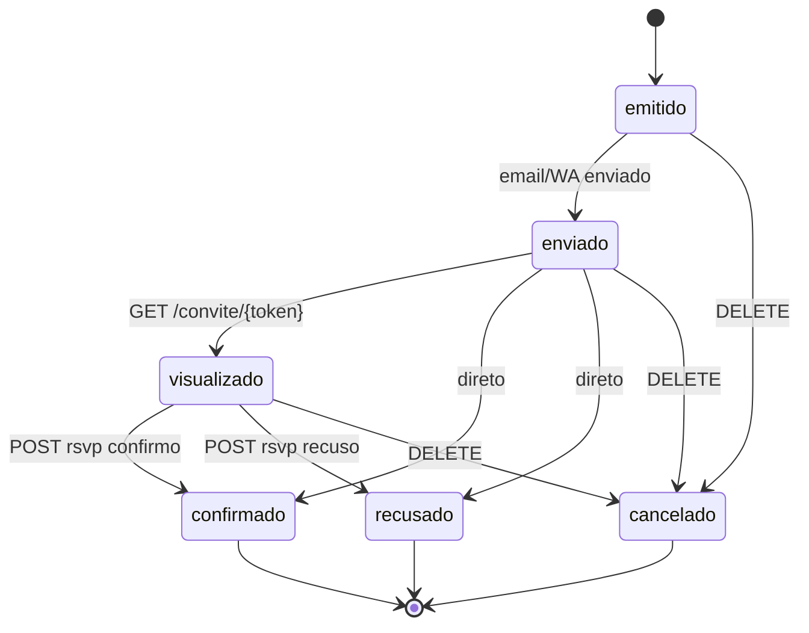

### 6.9 Edge cases

| Cenário                                              | Comportamento                                                                  |
| ---------------------------------------------------- | ------------------------------------------------------------------------------ |
| Emissão individual com `CotaEsgotada`                | Banner no modal + botão "Emitir" desativado.                                   |
| Lote com 300 convites; 12 falham por dados inválidos | `status=falha_parcial`; modal exibe lista das falhas.                          |
| Lote ainda `processando` quando usuário fecha modal  | Polling continua em background (query ativa); re-abrir modal mostra progresso. |
| Edição de convite já enviado                         | 409 `InvariantViolation` → toast "Use 'Transferir' para convites enviados."    |
| Cancelar convite com reserva de assento atrelada     | Servidor libera assento; cliente invalida `['mesas']`.                         |
| Reemitir com rate limit `convite` (10/min/user)      | Banner + desativa botão.                                                       |
| Share QR sem `token_publico` no resource             | Tela placeholder "Em breve"; botão desativado ❓.                              |

### 6.10 Tratamento de erros

| `error`              | UX                                         |
| -------------------- | ------------------------------------------ |
| `CotaEsgotada`       | Banner bloqueando form + link "Ver cotas". |
| `ValidationError`    | `setError` inline no form.                 |
| `InvariantViolation` | Toast com `message` + reload da lista.     |
| `RateLimitExceeded`  | Banner + contagem.                         |

### 6.11 Dependências

- Backend: todos os `/convites` ✅; `token_publico` no resource ❓.
- Stores: `useAuthStore` (eventoUlid).
- Libs: `qrcode` (npm) para QR code ❓; `lib/idempotency.ts`; `lib/ulid.ts`.
- Módulos: RSVP (gera link); Seating (convite pode estar atrelado a reserva).

### 6.12 Estratégia de testes

**Unit:**

- `toConviteViewModel` cobrindo todos os status.
- `toCotaViewModel`: limite null → `saldoLabel='ilimitado'`.

**Integration:**

- `useEmitirConvite` 201 → invalida convites e cotas.
- `useEmitirLote` 202 → cliente inicia polling com 3s.
- `useLoteStatus` polling termina ao `status='concluido'`.

**Component:**

- `<EmitirModal>` erro 409 CotaEsgotada → banner visível.
- `<LoteProgressModal>`: barra `qtd_processados / qtd_total`.

**E2E:**

- Emitir convite nominal → verificar na lista → cancelar → cota incrementa.
- Lote: submeter CSV com 10 convites → aguardar conclusão → verificar cada um.

### 6.13 KPIs

- **Taxa de entrega de convites no 1º envio:** > 95%.
- **Tempo médio para 1º RSVP:** tracking; target < 24h.
- **Taxa de falha em lotes:** < 3%.

---

## 7. Módulo Enquetes

### 7.1 Objetivo

Exibir enquetes abertas do evento, permitir voto (única ou múltipla) e exibir resultado quando público e encerrado.

### 7.2 Escopo

**In:**

- Lista de enquetes do evento (cursor ou length-aware).
- Detalhe com opções e estado "já votei".
- Submissão de voto com rate limit 3/min/user.
- Exibição do resultado quando `resultado_publico=true` e `status=encerrada`.
- Edição de voto quando `permite_edicao=true`.

**Out:**

- Criação de enquete (admin-side).
- Gráficos complexos (apenas barras simples).

### 7.3 Arquitetura local

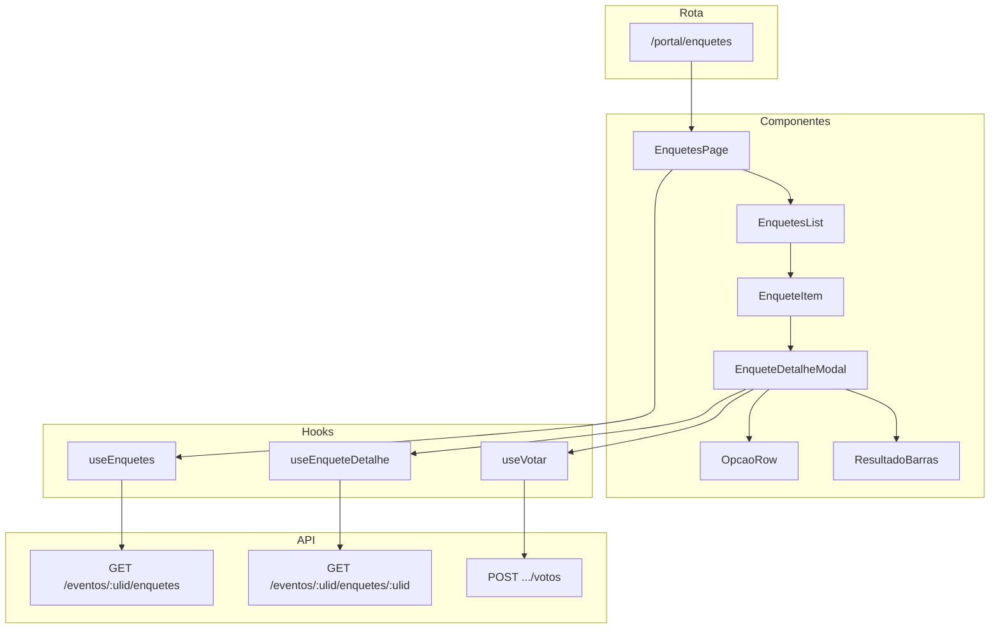

### 7.4 Hooks TanStack Query

#### 7.4.1 `useEnquetes`

```ts
export function useEnquetes(eventoUlid: string) {
    return useQuery({
        queryKey: ['enquetes', eventoUlid],
        queryFn: async () => {
            const { data } = await api.get<{ data: EnqueteListItemDto[] }>(`/eventos/${eventoUlid}/enquetes`, {
                params: { 'filter[status]': 'aberta,encerrada' },
            });
            return data.data.map(toEnqueteListItemViewModel);
        },
        staleTime: 5 * 60 * 1000,
    });
}
```

#### 7.4.2 `useEnqueteDetalhe`

```ts
export function useEnqueteDetalhe(eventoUlid: string, enqueteUlid: string | null) {
    return useQuery({
        queryKey: ['enquete', eventoUlid, enqueteUlid],
        enabled: !!enqueteUlid,
        queryFn: async () => {
            const { data } = await api.get<SingleEnvelope<EnqueteDetalheDto>>(
                `/eventos/${eventoUlid}/enquetes/${enqueteUlid}`,
            );
            return toEnqueteDetalheViewModel(data.data);
        },
        refetchInterval: (q) => {
            const d = q.state.data;
            if (!d) return false;
            return d.aberta ? 30_000 : false;
        },
        staleTime: 60_000,
    });
}
```

#### 7.4.3 `useVotar`

```ts
interface VotarInput {
    eventoUlid: string;
    enqueteUlid: string;
    tipo: 'unica' | 'multipla';
    opcaoUlid?: string;
    opcoesUlids?: string[];
    permiteEdicao: boolean;
}

export function useVotar() {
    const qc = useQueryClient();
    return useMutation({
        mutationFn: async (input: VotarInput) => {
            const headers: Record<string, string> = {};
            if (input.permiteEdicao) {
                // recomendado para edição idempotente
                const scope = `voto:${input.enqueteUlid}`;
                headers['X-Idempotency-Key'] = getIdempotencyKey(scope);
            }
            const payload =
                input.tipo === 'unica' ? { opcao_ulid: input.opcaoUlid } : { opcoes_ulids: input.opcoesUlids };
            const { data } = await api.post<SingleEnvelope<VotoDto>>(
                `/eventos/${input.eventoUlid}/enquetes/${input.enqueteUlid}/votos`,
                payload,
                { headers },
            );
            return data.data;
        },
        onSuccess: (_, input) => {
            qc.invalidateQueries({ queryKey: ['enquete', input.eventoUlid, input.enqueteUlid] });
            qc.invalidateQueries({ queryKey: ['enquetes', input.eventoUlid] });
        },
    });
}
```

### 7.5 Stores

Nenhuma.

### 7.6 Componentes principais

| Componente            | Props                              | Responsabilidade                   |
| --------------------- | ---------------------------------- | ---------------------------------- |
| `EnquetesPage`        | `eventoUlid`                       | Lista + modal                      |
| `EnquetesList`        | `items`                            | Cards                              |
| `EnqueteItem`         | `vm: EnqueteListItemViewModel`     | Card com status + badge "Já votei" |
| `EnqueteDetalheModal` | `eventoUlid; enqueteUlid; onClose` | Opções + submit + resultado        |
| `OpcaoRow`            | `opcao; selected; onSelect`        | Radio/checkbox por tipo            |
| `ResultadoBarras`     | `opcoes (com percentual)`          | Barras horizontais com %           |

### 7.7 Rota — `/portal/enquetes`

Guard herdado.

### 7.8 Máquina de estados da enquete (cliente)

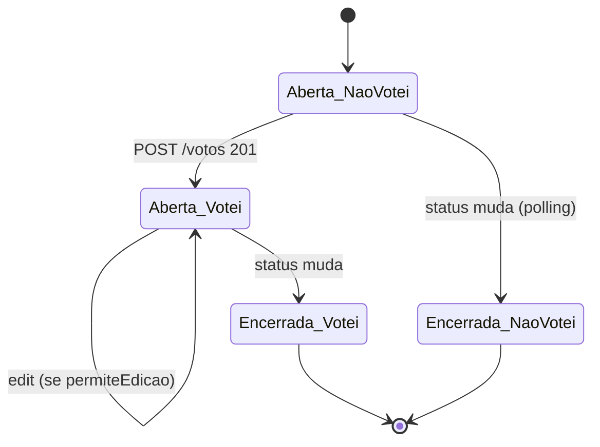

### 7.9 Edge cases

| Cenário                                             | Comportamento                                            |
| --------------------------------------------------- | -------------------------------------------------------- |
| Enquete encerra enquanto usuário está votando       | 409 `InvariantViolation` → modal "Enquete encerrada".    |
| Rate limit 3/min (usuário clica várias vezes)       | Banner com contagem regressiva.                          |
| Voto duplicado sem `permite_edicao`                 | 409 `DomainError` → toast "Você já votou nesta enquete." |
| Multipla sem seleção                                | Zod: "Selecione ao menos 1 opção".                       |
| Multipla com N opções excedendo limite (se existir) | ❓ o servidor valida — cliente não impõe limite.         |
| Resultado público mas enquete ainda aberta          | Resposta `resultado: null`; cliente não mostra barras.   |

### 7.10 Tratamento de erros

| `error`              | UX                               |
| -------------------- | -------------------------------- |
| `DomainError`        | Toast "Voto já registrado."      |
| `InvariantViolation` | Toast "Enquete não está aberta." |
| `RateLimitExceeded`  | Banner com `Retry-After`.        |
| `ValidationError`    | `setError` inline.               |

### 7.11 Dependências

- Backend: `/enquetes` ✅.
- Libs: `lib/idempotency.ts` (apenas se `permite_edicao=true`).
- Stores: `useAuthStore` (eventoUlid).

### 7.12 Estratégia de testes

**Unit:**

- `toEnqueteDetalheViewModel`: cálculo de `percentual` por opção.
- `temResultadoVisivel`: cobrir `resultado_publico` + `status`.

**Integration:**

- `useVotar` múltipla → serialize `opcoes_ulids`.
- Edição de voto com idempotency key.

**Component:**

- `<EnqueteDetalheModal>` aberta → opções clicáveis; encerrada → resultado.
- `<ResultadoBarras>` com 5 opções → renderiza barras proporcionais.

**E2E:**

- Votar em enquete única → recarregar → ver `Já votei`.
- Editar voto (se permitido) → novo voto substitui anterior.

### 7.13 KPIs

- **Taxa de voto em enquetes abertas:** > 60% do público elegível.
- **Tempo médio de voto:** < 30s após abrir modal.

---

## Apêndice A — Convenções transversais de testes

### A.1 Camadas

```
Unit (Vitest)     → pure functions (viewmodels, helpers, stores reducers)
Integration (MSW) → hooks TanStack Query com backend mockado
Component (RTL)   → render + user events
E2E (Playwright)  → happy path + cenários críticos end-to-end
```

### A.2 Estrutura de diretórios

```
resources/spa/
├── src/
│   └── ...
└── tests/
    ├── unit/
    │   ├── view-models/*.test.ts
    │   └── lib/*.test.ts
    ├── integration/
    │   ├── api-hooks/*.test.ts
    │   └── smoke/*.test.ts
    ├── component/
    │   └── *.test.tsx
    └── e2e/
        ├── auth.spec.ts
        ├── wizard.spec.ts
        ├── pagamento.spec.ts
        ├── seating.spec.ts
        ├── rsvp.spec.ts
        ├── convites.spec.ts
        └── enquetes.spec.ts
```

### A.3 Convenções gerais

- **MSW** para mock de API em unit/integration/component; Playwright usa servidor real (staging-like com seeds).
- **Nomenclatura:** `describe('useReservarAssento', ...)` → `it('reserva com 201 → popula hold-store')`.
- **Fixtures** por módulo em `tests/fixtures/<modulo>.ts`.
- **Cobertura mínima:** viewmodels 95%, hooks 85%, componentes 70% (linhas).
- **Retomada de testes:** cada suite roda em isolamento (sem estado residual de sessionStorage).

---

## Apêndice B — KPIs globais

| KPI                                      | Target              | Como medir          |
| ---------------------------------------- | ------------------- | ------------------- |
| Tempo até primeira interação (TTI)       | < 2.5s em 3G rápido | Lighthouse CI       |
| Tempo de hidratação (/me)                | p95 < 800ms         | Sentry transactions |
| Taxa de erros 4xx (excluindo 401/422)    | < 2%                | Sentry + request_id |
| Taxa de erros 5xx                        | < 0.5%              | Sentry              |
| Taxa de sucesso em idempotência (replay) | 100%                | Feature test em CI  |
| Lighthouse Acessibilidade                | ≥ 90                | CI                  |
| Lighthouse Performance                   | ≥ 85                | CI                  |

---

## Referências

- [`07-DATA-CONTRACTS-AND-VIEW-MODELS.md`](./07-DATA-CONTRACTS-AND-VIEW-MODELS.md) — ViewModels usados em cada seção.
- [`08-API-INTEGRATION-CONTRACT.md`](./08-API-INTEGRATION-CONTRACT.md) — client, interceptors, idempotência.
- [`api-contract.md`](../api/api-contract.md) — endpoints referenciados.
- [`api-conventions.md`](../api/api-conventions.md) — convenções transversais.
- [`error-envelope.md`](../api/error-envelope.md) — envelope único.
- [`PLANEJAMENTO_FRONTEND_REACT.md`](../prd/PLANEJAMENTO_FRONTEND_REACT.md) — documento-mestre.
