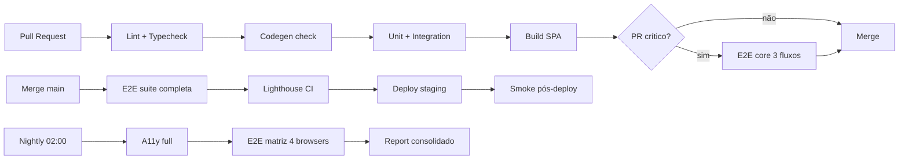

# QA e Estratégia de Testes — Portal SPA React

> **Escopo:** este documento define a estratégia oficial de testes para o SPA React 19 do Portal ArtFinal (`resources/spa/`). Complementa a estratégia QA geral do projeto (`docs/qa/qa-strategy.md`) trazendo particularidades do frontend (TanStack Query, MSW, Playwright, a11y, Web Vitals).
>
> **Legenda:** ✅ pronto / ❌ bloqueante / ❓ aberta / 🟡 parcial

---

## Sumário

1. [Visão geral e pirâmide de testes](#1-visão-geral-e-pirâmide-de-testes)
2. [Testes unitários (Vitest)](#2-testes-unitários-vitest)
3. [Testes de integração (Vitest + RTL + MSW)](#3-testes-de-integração-vitest--rtl--msw)
4. [Testes E2E (Playwright)](#4-testes-e2e-playwright)
5. [Smoke tests](#5-smoke-tests)
6. [Testes de acessibilidade](#6-testes-de-acessibilidade)
7. [Testes de performance (Lighthouse + Web Vitals)](#7-testes-de-performance-lighthouse--web-vitals)
8. [Matriz Feature × Teste](#8-matriz-feature--teste)
9. [Critérios de cobertura](#9-critérios-de-cobertura)
10. [Estratégia de mocks e fixtures](#10-estratégia-de-mocks-e-fixtures)
11. [Pipeline CI/CD de testes](#11-pipeline-cicd-de-testes)
12. [Riscos de regressão](#12-riscos-de-regressão)
13. [Plano Playwright detalhado](#13-plano-playwright-detalhado)
14. [Plano Lighthouse detalhado](#14-plano-lighthouse-detalhado)
15. [Definition of Done (QA)](#15-definition-of-done-qa)
16. [Responsabilidades e governança](#16-responsabilidades-e-governança)
17. [Anexos](#17-anexos)

---

## 1. Visão geral e pirâmide de testes

### 1.1 Filosofia

A estratégia frontend segue três princípios:

1. **Fail fast** — o teste mais barato (unit) roda primeiro e cobre a maior parte do que pode quebrar.
2. **Confiança progressiva** — integração prova que hooks + componentes + API contract funcionam juntos; E2E prova o fluxo real do usuário.
3. **Automação é obrigação** — nenhum teste manual aparece em DoD. Teste manual é exploratório, não regressivo.

### 1.2 Pirâmide alvo

```
          ┌───────────────────┐
          │   E2E (Playwright)│  ≈ 5%   — 7 fluxos críticos, 1×/PR crítico + nightly
          │                   │
          ├───────────────────┤
          │ Integração        │  ≈ 25%  — componentes + hooks + MSW, 1×/PR
          │ (Vitest + RTL)    │
          ├───────────────────┤
          │ Unitários         │  ≈ 70%  — libs, stores, schemas, hooks puros, 1×/PR
          │ (Vitest)          │
          └───────────────────┘
```

A meta de distribuição **não é dogma** — o importante é que um bug típico seja pego pelo teste mais barato capaz de pegá-lo. Teste unit que depende de 6 mocks virou teste de integração; promover.

### 1.3 Stack completa

| Camada            | Ferramenta                              | Versão mínima | Uso                                   |
| ----------------- | --------------------------------------- | ------------- | ------------------------------------- |
| Runner            | **Vitest**                              | 2.x           | unit + integration                    |
| DOM               | **@testing-library/react**              | 16.x          | queries acessíveis                    |
| DOM matchers      | **@testing-library/jest-dom**           | 6.x           | `toBeVisible`, `toHaveAccessibleName` |
| API mock          | **MSW (Mock Service Worker)**           | 2.x           | intercepta `fetch`/Axios em unit+int  |
| E2E               | **@playwright/test**                    | 1.47+         | fluxos ponta-a-ponta                  |
| A11y automatizada | **@axe-core/playwright** + **jest-axe** | latest        | WCAG 2.1 AA                           |
| Performance       | **@lhci/cli** (Lighthouse CI)           | 0.13+         | LCP/CLS/TBT/bundle                    |
| Visual regression | (opcional) Playwright snapshots         | —             | F7+, apenas componentes estáveis      |
| Coverage          | **@vitest/coverage-v8**                 | 2.x           | v8-native, sem instrumentação babel   |
| Seed              | Factory backend + `artisan db:seed`     | —             | estado conhecido nos E2E              |

### 1.4 Ambientes de teste

| Ambiente       | URL                             | Banco        | Dados        | Uso                                 |
| -------------- | ------------------------------- | ------------ | ------------ | ----------------------------------- |
| **local**      | `http://localhost`              | pg local     | `DevSeeder`  | dev + unit + int                    |
| **CI**         | ephemeral container             | pg in-memory | `TestSeeder` | todo PR                             |
| **staging**    | `https://staging.portalart.app` | pg staging   | snapshot     | E2E nightly + smoke pós-deploy      |
| **production** | `https://portalart.app`         | pg prod      | real         | smoke + Web Vitals (apenas leitura) |

---

## 2. Testes unitários (Vitest)

### 2.1 Escopo

Testes unitários cobrem **funções puras e módulos sem efeito colateral observável**:

- `src/lib/**` — helpers (money, date, ulid, idempotency, cursor, slug)
- `src/stores/**` — stores Zustand (lógica de estado isolada)
- `src/forms/**/*.schema.ts` — schemas Zod
- `src/api/errors.ts` — classe `ApiError` e parser de envelope
- `src/api/interceptors.ts` — interceptors individuais (mocando Axios)
- Hooks **puros** (sem React Query / sem DOM) — ex: `useCountdown`, `useDebounce`

Unit **não toca** na renderização de componentes complexos; isso é integração.

### 2.2 Cobertura alvo

| Pasta                  | Threshold mínimo | Justificativa                 |
| ---------------------- | ---------------- | ----------------------------- |
| `src/lib/`             | **80%**          | núcleo; impacta todo o app    |
| `src/stores/`          | **70%**          | lógica de estado              |
| `src/forms/*.schema`   | **85%**          | regra de validação é contrato |
| `src/api/errors`       | **90%**          | parsing de erro é crítico     |
| `src/hooks/` (puros)   | **60%**          | muitos são triviais           |
| `src/components/` (UI) | sem threshold    | cobrir via integração         |

O **global target** é **≥ 70%** com tendência crescente por sprint. Regressão acima de 2p.p. em PR bloqueia merge (ver §11).

### 2.3 Padrões de escrita

**Nome em PT-BR, AAA, descritivo:**

```ts
// src/lib/__tests__/money.test.ts
import { describe, it, expect } from 'vitest';
import { formatBRL, parseToCents } from '../money';

describe('formatBRL', () => {
    it('formata 150099 centavos como "R$ 1.500,99"', () => {
        // Arrange
        const cents = 150099;

        // Act
        const result = formatBRL(cents);

        // Assert
        expect(result).toBe('R$ 1.500,99');
    });

    it('formata 0 centavos como "R$ 0,00"', () => {
        expect(formatBRL(0)).toBe('R$ 0,00');
    });

    it('rejeita valor negativo com throw', () => {
        expect(() => formatBRL(-1)).toThrow('valor negativo não permitido');
    });
});

describe('parseToCents', () => {
    it.each([
        ['R$ 1.500,99', 150099],
        ['1500,99', 150099],
        ['1500.99', 150099],
        ['0,01', 1],
    ])('converte %s em %i centavos', (input, expected) => {
        expect(parseToCents(input)).toBe(expected);
    });
});
```

**Convenção `describe`:** nome do símbolo exportado. **Convenção `it`:** começar com verbo no presente indicativo em PT-BR (`formata`, `rejeita`, `retorna`, `calcula`).

### 2.4 Exemplo — store Zustand

```ts
// src/stores/__tests__/auth-store.test.ts
import { describe, it, expect, beforeEach } from 'vitest';
import { useAuthStore } from '../auth-store';

describe('authStore', () => {
    beforeEach(() => {
        useAuthStore.setState({ user: null, isAuthenticated: false });
    });

    it('login atualiza user e isAuthenticated', () => {
        const fakeUser = { ulid: '01HX...', nome: 'Fulano', email: 'a@b.com' };

        useAuthStore.getState().login(fakeUser);

        expect(useAuthStore.getState().user).toEqual(fakeUser);
        expect(useAuthStore.getState().isAuthenticated).toBe(true);
    });

    it('logout limpa estado', () => {
        useAuthStore.setState({ user: { ulid: 'x', nome: 'y', email: 'z' }, isAuthenticated: true });

        useAuthStore.getState().logout();

        expect(useAuthStore.getState().user).toBeNull();
        expect(useAuthStore.getState().isAuthenticated).toBe(false);
    });
});
```

### 2.5 Exemplo — schema Zod

```ts
// src/forms/__tests__/login.schema.test.ts
import { describe, it, expect } from 'vitest';
import { loginSchema } from '../login.schema';

describe('loginSchema', () => {
    it('aceita payload válido', () => {
        const result = loginSchema.safeParse({ email: 'a@b.com', senha: '12345678' });
        expect(result.success).toBe(true);
    });

    it('rejeita email inválido com mensagem em PT-BR', () => {
        const result = loginSchema.safeParse({ email: 'invalid', senha: '12345678' });
        expect(result.success).toBe(false);
        if (!result.success) {
            expect(result.error.issues[0]?.message).toContain('e-mail');
        }
    });

    it('rejeita senha com menos de 8 caracteres', () => {
        const result = loginSchema.safeParse({ email: 'a@b.com', senha: '123' });
        expect(result.success).toBe(false);
    });
});
```

### 2.6 Exemplo — idempotency

```ts
// src/lib/__tests__/idempotency.test.ts
describe('getOrCreateIdempotencyKey', () => {
    beforeEach(() => sessionStorage.clear());

    it('cria key nova quando não existe para o contexto', () => {
        const key = getOrCreateIdempotencyKey('pagamento:01HX123');
        expect(key).toMatch(/^[0-9a-f]{8}-[0-9a-f]{4}/);
    });

    it('reutiliza key existente para o mesmo contexto', () => {
        const key1 = getOrCreateIdempotencyKey('pagamento:01HX123');
        const key2 = getOrCreateIdempotencyKey('pagamento:01HX123');
        expect(key1).toBe(key2);
    });

    it('gera keys distintas para contextos diferentes', () => {
        const keyA = getOrCreateIdempotencyKey('pagamento:01HX123');
        const keyB = getOrCreateIdempotencyKey('pagamento:01HX456');
        expect(keyA).not.toBe(keyB);
    });
});
```

### 2.7 O que **não** testar em unit

- Componentes React que fazem fetch — usar integração
- Efeitos de TanStack Query — usar integração
- Navegação do TanStack Router — usar E2E
- Visual / posicionamento CSS — usar snapshots ou inspeção manual

---

## 3. Testes de integração (Vitest + RTL + MSW)

### 3.1 Escopo

Testes de integração provam que **um pedaço significativo da UI** funciona contra uma API mockada:

- Componentes de formulário (`LoginForm`, `WizardEtapa3`, `EmitirConviteForm`)
- Telas completas renderizadas via `MemoryRouter` do TanStack Router
- Hooks que usam `useQuery` / `useMutation`
- Fluxos de error boundary (401 → redirect, 409 → toast, 422 → mensagens inline)

### 3.2 Setup (`vitest.config.ts`)

```ts
// resources/spa/vitest.config.ts
import { defineConfig } from 'vitest/config';
import react from '@vitejs/plugin-react';
import path from 'node:path';

export default defineConfig({
    plugins: [react()],
    test: {
        environment: 'jsdom',
        globals: true,
        setupFiles: ['./tests/setup.ts'],
        include: ['src/**/*.test.{ts,tsx}', 'src/**/__tests__/**/*.{ts,tsx}'],
        coverage: {
            provider: 'v8',
            reporter: ['text', 'json', 'html', 'lcov'],
            thresholds: {
                lines: 70,
                functions: 70,
                branches: 65,
                statements: 70,
                'src/lib/**': { lines: 80, branches: 75 },
                'src/stores/**': { lines: 70 },
                'src/forms/**/*.schema.ts': { lines: 85 },
            },
            exclude: ['src/api/types.gen.ts', 'src/main.tsx', '**/*.stories.tsx'],
        },
    },
    resolve: {
        alias: { '@': path.resolve(__dirname, './src') },
    },
});
```

### 3.3 Setup (`tests/setup.ts`)

```ts
import '@testing-library/jest-dom/vitest';
import { afterAll, afterEach, beforeAll } from 'vitest';
import { server } from './mocks/server';

// MSW
beforeAll(() => server.listen({ onUnhandledRequest: 'error' }));
afterEach(() => server.resetHandlers());
afterAll(() => server.close());

// Limpa sessionStorage entre testes (idempotency, etc.)
afterEach(() => {
    sessionStorage.clear();
    localStorage.clear();
});
```

### 3.4 MSW handlers

```ts
// tests/mocks/handlers.ts
import { http, HttpResponse } from 'msw';

const API = 'http://localhost/api/v1';

export const handlers = [
    // GET /sanctum/csrf-cookie
    http.get('/sanctum/csrf-cookie', () => new HttpResponse(null, { status: 204 })),

    // POST /api/v1/auth/login
    http.post(`${API}/auth/login`, async ({ request }) => {
        const body = (await request.json()) as { email: string; senha: string };
        if (body.email === 'bloq@teste.com') {
            return HttpResponse.json(
                {
                    type: 'https://portalart.app/errors/forbidden',
                    title: 'Acesso negado',
                    status: 403,
                    detail: 'Usuário bloqueado',
                    request_id: 'req_test',
                },
                { status: 403 },
            );
        }
        if (body.senha !== '12345678') {
            return HttpResponse.json(
                {
                    type: 'https://portalart.app/errors/unauthorized',
                    title: 'Credenciais inválidas',
                    status: 401,
                    detail: 'E-mail ou senha incorretos',
                    request_id: 'req_test',
                },
                { status: 401 },
            );
        }
        return HttpResponse.json({
            data: { user: { ulid: '01HX123', nome: 'Teste', email: body.email } },
        });
    }),

    // GET /api/v1/me
    http.get(`${API}/me`, () =>
        HttpResponse.json({
            data: { user: { ulid: '01HX123', nome: 'Teste', email: 'a@b.com' } },
        }),
    ),

    // Fallback: a rota catch-all do SPA precisa retornar 404 JSON para não conflitar
];
```

Handlers específicos são **sobrescritos por teste** quando necessário:

```ts
import { server } from '../mocks/server';
import { http, HttpResponse } from 'msw';

it('trata 500 renderizando fallback', () => {
    server.use(
        http.get('/api/v1/me', () => HttpResponse.json({ title: 'Erro interno', status: 500 }, { status: 500 })),
    );
    // ...
});
```

### 3.5 Wrapper de render com providers

```tsx
// tests/utils/render-with-providers.tsx
import { render, type RenderOptions } from '@testing-library/react';
import { QueryClient, QueryClientProvider } from '@tanstack/react-query';
import { TamaguiProvider } from 'tamagui';
import config from '@/tamagui.config';
import { type ReactElement } from 'react';

export function renderWithProviders(ui: ReactElement, opts?: RenderOptions) {
    const queryClient = new QueryClient({
        defaultOptions: {
            queries: { retry: false, staleTime: 0, gcTime: 0 },
            mutations: { retry: false },
        },
    });
    return render(
        <TamaguiProvider config={config} defaultTheme="light">
            <QueryClientProvider client={queryClient}>{ui}</QueryClientProvider>
        </TamaguiProvider>,
        opts,
    );
}
```

### 3.6 Exemplo — LoginForm

```tsx
// src/components/auth/__tests__/LoginForm.test.tsx
import { describe, it, expect } from 'vitest';
import { screen, waitFor } from '@testing-library/react';
import userEvent from '@testing-library/user-event';
import { renderWithProviders } from '../../../../tests/utils/render-with-providers';
import { LoginForm } from '../LoginForm';

describe('LoginForm', () => {
    it('submete login com sucesso e aciona onSuccess', async () => {
        const user = userEvent.setup();
        const onSuccess = vi.fn();
        renderWithProviders(<LoginForm onSuccess={onSuccess} />);

        await user.type(screen.getByLabelText(/e-?mail/i), 'a@b.com');
        await user.type(screen.getByLabelText(/senha/i), '12345678');
        await user.click(screen.getByRole('button', { name: /entrar/i }));

        await waitFor(() => expect(onSuccess).toHaveBeenCalled());
    });

    it('exibe erro "Credenciais inválidas" em 401', async () => {
        const user = userEvent.setup();
        renderWithProviders(<LoginForm onSuccess={vi.fn()} />);

        await user.type(screen.getByLabelText(/e-?mail/i), 'a@b.com');
        await user.type(screen.getByLabelText(/senha/i), 'errada11');
        await user.click(screen.getByRole('button', { name: /entrar/i }));

        expect(await screen.findByRole('alert')).toHaveTextContent(/credenciais inválidas/i);
    });

    it('exibe erros inline quando validação Zod falha', async () => {
        const user = userEvent.setup();
        renderWithProviders(<LoginForm onSuccess={vi.fn()} />);

        await user.click(screen.getByRole('button', { name: /entrar/i }));

        expect(await screen.findByText(/e-?mail.*obrigatório/i)).toBeInTheDocument();
        expect(screen.getByText(/senha.*obrigatório/i)).toBeInTheDocument();
    });

    it('desabilita submit durante mutação em voo', async () => {
        const user = userEvent.setup();
        renderWithProviders(<LoginForm onSuccess={vi.fn()} />);

        await user.type(screen.getByLabelText(/e-?mail/i), 'a@b.com');
        await user.type(screen.getByLabelText(/senha/i), '12345678');
        const btn = screen.getByRole('button', { name: /entrar/i });
        await user.click(btn);
        expect(btn).toBeDisabled();
    });
});
```

### 3.7 Smoke por rota

Para cada rota do app, um teste "renderiza sem erro":

```tsx
it.each([
    ['/login', LoginPage],
    ['/portal/home', HomePage],
    ['/portal/financeiro', FinanceiroPage],
    ['/portal/mesas', MesasPage],
])('renderiza %s sem crash', (_path, Component) => {
    expect(() => renderWithProviders(<Component />)).not.toThrow();
});
```

---

## 4. Testes E2E (Playwright)

### 4.1 Config

```ts
// resources/spa/playwright.config.ts
import { defineConfig, devices } from '@playwright/test';

export default defineConfig({
    testDir: './tests/e2e',
    timeout: 30_000,
    expect: { timeout: 5_000 },
    fullyParallel: true,
    retries: process.env.CI ? 2 : 0,
    workers: process.env.CI ? 4 : undefined,
    reporter: [['html'], ['junit', { outputFile: 'playwright-report/junit.xml' }]],
    use: {
        baseURL: process.env.E2E_BASE_URL ?? 'http://localhost',
        trace: 'on-first-retry',
        screenshot: 'only-on-failure',
        video: 'retain-on-failure',
        locale: 'pt-BR',
        timezoneId: 'America/Sao_Paulo',
    },
    projects: [
        { name: 'chromium-desktop', use: { ...devices['Desktop Chrome'] } },
        { name: 'webkit-desktop', use: { ...devices['Desktop Safari'] } },
        { name: 'mobile-chrome', use: { ...devices['Pixel 7'] } },
        { name: 'mobile-safari', use: { ...devices['iPhone 14'] } },
    ],
    webServer: process.env.CI
        ? undefined
        : {
              command: 'npm run dev',
              url: 'http://localhost:5173',
              reuseExistingServer: true,
          },
});
```

### 4.2 Seed e storage state

Antes da suite rodar, o backend é resetado:

```bash
# tests/e2e/global-setup.ts
php artisan migrate:fresh --seed --seeder=E2ETestSeeder
```

O `E2ETestSeeder` cria:

- 2 formandos `testa@portalart.app` / `testb@portalart.app` (senha `senha12345`)
- 1 turma de teste com mapa de mesas 10x10
- 1 pacote ativo para wizard
- 1 evento com RSVP habilitado

Depois, login via API e salvar cookie:

```ts
// tests/e2e/auth.setup.ts
import { test as setup } from '@playwright/test';

setup('autentica como formando A', async ({ request }) => {
    await request.get('/sanctum/csrf-cookie');
    await request.post('/api/v1/auth/login', {
        data: { email: 'testa@portalart.app', senha: 'senha12345' },
    });
    await request.storageState({ path: 'tests/e2e/.auth/formando-a.json' });
});
```

### 4.3 Os 7 fluxos críticos

| #   | ID      | Fluxo                                     | Complexidade | Roda em              |
| --- | ------- | ----------------------------------------- | ------------ | -------------------- |
| 1   | E2E-001 | Login → home                              | Baixa        | PR + nightly         |
| 2   | E2E-002 | Login inválido → erro                     | Baixa        | PR + nightly         |
| 3   | E2E-003 | Wizard adesão 7 etapas completas          | Alta         | PR crítico + nightly |
| 4   | E2E-004 | Pagar parcela (boleto) + polling          | Média        | PR crítico + nightly |
| 5   | E2E-005 | Emitir convite → RSVP público             | Média        | nightly              |
| 6   | E2E-006 | Mapa mesas → hold → confirmar             | Alta         | PR crítico + nightly |
| 7   | E2E-007 | Mapa mesas → hold expira → fluxo reinicia | Alta         | nightly              |

#### E2E-001 — Happy path login

```ts
// tests/e2e/auth.spec.ts
import { test, expect } from '@playwright/test';

test('E2E-001: login redireciona para /portal/home', async ({ page }) => {
    await page.goto('/login');
    await page.getByLabel(/e-?mail/i).fill('testa@portalart.app');
    await page.getByLabel(/senha/i).fill('senha12345');
    await page.getByRole('button', { name: /entrar/i }).click();

    await expect(page).toHaveURL(/\/portal\/home/);
    await expect(page.getByRole('heading', { name: /olá/i })).toBeVisible();
});
```

#### E2E-003 — Wizard adesão

```ts
test('E2E-003: wizard completo do início ao resumo', async ({ page }) => {
    await page.goto('/portal/adesao/1');
    // Etapa 1 — formando
    await page.getByLabel(/cpf/i).fill('111.444.777-35');
    await page.getByLabel(/nome/i).fill('Fulano Teste');
    await page.getByRole('button', { name: /próximo/i }).click();

    // Etapa 2 — responsável
    await page.getByLabel(/responsável/i).fill('Responsável Teste');
    await page.getByRole('button', { name: /próximo/i }).click();

    // Etapas 3..6 — pacote, extras, pagamento, termos
    // ...

    // Etapa 7 — revisão
    await expect(page.getByText(/resumo da adesão/i)).toBeVisible();
    await page.getByRole('button', { name: /confirmar adesão/i }).click();

    await expect(page).toHaveURL(/\/portal\/financeiro/);
    await expect(page.getByText(/adesão confirmada/i)).toBeVisible();
});
```

#### E2E-006 — Mapa mesas com hold

```ts
test('E2E-006: seleciona assento, mantém hold e confirma', async ({ page }) => {
    await page.goto('/portal/mesas');
    await page.getByTestId('mesa-3-cadeira-4').click();

    await expect(page.getByTestId('hold-countdown')).toBeVisible();
    await expect(page.getByTestId('hold-countdown')).toContainText(/\d{1,2}:\d{2}/);

    await page.getByRole('button', { name: /confirmar assento/i }).click();
    await expect(page.getByText(/assento confirmado/i)).toBeVisible();
});
```

#### E2E-007 — Hold expira

```ts
test('E2E-007: hold expira e fluxo reinicia', async ({ page }) => {
    await page.goto('/portal/mesas');
    await page.getByTestId('mesa-3-cadeira-5').click();

    // Avança relógio do servidor via endpoint admin de teste
    await page.request.post('/api/v1/testing/advance-time', { data: { seconds: 310 } });

    // Tenta confirmar após expiração
    await page.getByRole('button', { name: /confirmar assento/i }).click();

    await expect(page.getByRole('alert')).toContainText(/hold expirou/i);
    await expect(page.getByTestId('mesa-3-cadeira-5')).toHaveAttribute('data-state', 'disponivel');
});
```

### 4.4 Page Objects

```ts
// tests/e2e/pages/LoginPage.ts
import { type Page, type Locator } from '@playwright/test';

export class LoginPage {
    readonly email: Locator;
    readonly senha: Locator;
    readonly submit: Locator;
    readonly alert: Locator;

    constructor(private page: Page) {
        this.email = page.getByLabel(/e-?mail/i);
        this.senha = page.getByLabel(/senha/i);
        this.submit = page.getByRole('button', { name: /entrar/i });
        this.alert = page.getByRole('alert');
    }

    async goto() {
        await this.page.goto('/login');
    }

    async login(email: string, senha: string) {
        await this.email.fill(email);
        await this.senha.fill(senha);
        await this.submit.click();
    }
}
```

Regras para Page Objects:

- 1 arquivo por rota (`LoginPage`, `HomePage`, `WizardPage`, `MesasPage`…)
- Locators com queries acessíveis (`getByRole`, `getByLabel`)
- `data-testid` **apenas** quando semântica não bastar (canvas, drag handles)
- Nunca expõe `page.locator(...)` cru em testes

### 4.5 Tracing e artefatos

- `trace: 'on-first-retry'` — captura apenas quando falha (evita trace gigante em CI bom)
- `screenshot: 'only-on-failure'` — idem
- `video: 'retain-on-failure'` — útil para flaky debugging
- Upload de `playwright-report/` como artifact no CI (retenção 30 dias)

---

## 5. Smoke tests

### 5.1 Definição

Smoke = **checa que nada fundamental quebrou** em < 60s. Não substitui E2E. Roda pós-deploy e em cada PR.

### 5.2 Script

```ts
// tests/smoke/smoke.spec.ts
import { test, expect } from '@playwright/test';

const ROUTES = [
    '/',
    '/login',
    '/portal/home',
    '/portal/financeiro',
    '/portal/convites',
    '/portal/mesas',
    '/portal/extras',
    '/portal/enquetes',
    '/portal/perfil',
];

for (const route of ROUTES) {
    test(`smoke ${route} responde 200 sem erro console`, async ({ page }) => {
        const consoleErrors: string[] = [];
        page.on('console', (msg) => msg.type() === 'error' && consoleErrors.push(msg.text()));

        const resp = await page.goto(route);
        expect(resp?.status()).toBeLessThan(400);
        await page.waitForLoadState('networkidle');
        expect(consoleErrors, `Console errors em ${route}`).toEqual([]);
    });
}
```

### 5.3 Comando

```json
// package.json
"scripts": {
  "smoke": "playwright test tests/smoke --project=chromium-desktop --reporter=line"
}
```

### 5.4 Onde roda

- Pós-deploy staging (gate obrigatório)
- Pós-deploy produção (comum)
- PR: somente em PRs que mexem em router/providers/main.tsx

---

## 6. Testes de acessibilidade

### 6.1 Padrão alvo

**WCAG 2.1 nível AA.** Critérios específicos obrigatórios:

- 1.4.3 Contrast (AA)
- 2.1.1 Keyboard
- 2.4.3 Focus order
- 2.4.7 Focus visible
- 3.3.1 Error identification
- 3.3.3 Error suggestion
- 4.1.2 Name, role, value
- 4.1.3 Status messages

### 6.2 A11y em integração (jest-axe)

```tsx
// src/components/auth/__tests__/LoginForm.a11y.test.tsx
import { axe, toHaveNoViolations } from 'jest-axe';
expect.extend(toHaveNoViolations);

it('LoginForm não tem violações AA', async () => {
    const { container } = renderWithProviders(<LoginForm onSuccess={() => {}} />);
    const results = await axe(container, { runOnly: ['wcag2a', 'wcag2aa'] });
    expect(results).toHaveNoViolations();
});
```

### 6.3 A11y em E2E (axe-core/playwright)

```ts
import AxeBuilder from '@axe-core/playwright';

test('a11y: /portal/home sem violações críticas', async ({ page }) => {
    await page.goto('/portal/home');
    const results = await new AxeBuilder({ page })
        .withTags(['wcag2a', 'wcag2aa'])
        .disableRules(['color-contrast-enhanced']) // AAA
        .analyze();
    expect(results.violations).toEqual([]);
});
```

### 6.4 Rotas auditadas

| Rota                          | Frequência | Gate                                |
| ----------------------------- | ---------- | ----------------------------------- |
| `/login`                      | Todo PR    | bloqueia se violação AA             |
| `/portal/home`                | Todo PR    | bloqueia                            |
| `/portal/adesao/$step` (1..7) | Nightly    | bloqueia                            |
| `/portal/financeiro`          | Todo PR    | bloqueia                            |
| `/portal/pagamento/$ulid`     | Nightly    | bloqueia                            |
| `/portal/convites`            | Nightly    | bloqueia                            |
| `/portal/mesas`               | Nightly    | bloqueia (com ressalva para canvas) |
| `/portal/extras`              | Nightly    | bloqueia                            |
| `/portal/enquetes`            | Nightly    | bloqueia                            |
| `/portal/perfil`              | Nightly    | bloqueia                            |
| `/rsvp/$token`                | Todo PR    | bloqueia                            |

### 6.5 Checklist manual

Executado na sprint de polish (F7) e sempre que um componente novo é liberado:

- [ ] Navegação só com teclado do `/login` até confirmação de assento
- [ ] Foco visível em todos os elementos interativos
- [ ] Ordem de tab segue leitura natural
- [ ] Leitor de tela (NVDA/VoiceOver) anuncia alertas de erro
- [ ] Campos com erro têm `aria-invalid="true"` e `aria-describedby`
- [ ] Modais prendem foco (focus trap)
- [ ] Skip link para conteúdo principal
- [ ] Toast tem `role="status"` ou `role="alert"` apropriado
- [ ] Imagens têm `alt` significativo (ou `alt=""` decorativas)

---

## 7. Testes de performance (Lighthouse + Web Vitals)

### 7.1 Budgets

| Métrica               | Alvo mobile | Alvo desktop | Gate                     |
| --------------------- | ----------- | ------------ | ------------------------ |
| LCP                   | ≤ 2.5 s     | ≤ 1.8 s      | ❌ bloqueia em regressão |
| CLS                   | ≤ 0.1       | ≤ 0.1        | ❌ bloqueia              |
| INP                   | ≤ 200 ms    | ≤ 100 ms     | 🟡 alerta                |
| TBT                   | ≤ 200 ms    | ≤ 100 ms     | ❌ bloqueia              |
| FCP                   | ≤ 1.8 s     | ≤ 1.0 s      | 🟡 alerta                |
| Bundle gzip (initial) | ≤ 250 KB    | ≤ 250 KB     | ❌ bloqueia              |
| Score Performance     | ≥ 90        | ≥ 95         | ❌ bloqueia              |
| Score Accessibility   | ≥ 95        | ≥ 95         | ❌ bloqueia              |
| Score Best Practices  | ≥ 95        | ≥ 95         | 🟡 alerta                |
| Score SEO             | ≥ 95        | ≥ 95         | 🟡 alerta                |

### 7.2 Lighthouse CI

```json
// .lighthouserc.json
{
    "ci": {
        "collect": {
            "url": [
                "http://localhost/login",
                "http://localhost/portal/home",
                "http://localhost/portal/financeiro",
                "http://localhost/portal/mesas"
            ],
            "numberOfRuns": 3,
            "settings": { "preset": "mobile" }
        },
        "assert": {
            "assertions": {
                "categories:performance": ["error", { "minScore": 0.9 }],
                "categories:accessibility": ["error", { "minScore": 0.95 }],
                "first-contentful-paint": ["warn", { "maxNumericValue": 1800 }],
                "largest-contentful-paint": ["error", { "maxNumericValue": 2500 }],
                "cumulative-layout-shift": ["error", { "maxNumericValue": 0.1 }],
                "total-blocking-time": ["error", { "maxNumericValue": 200 }]
            }
        },
        "upload": { "target": "temporary-public-storage" }
    }
}
```

### 7.3 Web Vitals em produção

`web-vitals` pacote → envia para endpoint backend `/api/v1/telemetry/web-vitals` (implementar em F7). Dashboard simples em Pulse.

---

## 8. Matriz Feature × Teste

| Feature / módulo                | Unit | Int | E2E | A11y | Perf | Coverage alvo | Owner      |
| ------------------------------- | ---- | --- | --- | ---- | ---- | ------------- | ---------- |
| Auth — login/logout/me          | ✅   | ✅  | ✅  | ✅   | 🟡   | 85%           | Sq Auth    |
| Auth — interceptors 401/419     | ✅   | ✅  | ✅  | —    | —    | 90%           | Sq Auth    |
| Wizard — etapa 1 (formando)     | ✅   | ✅  | ✅  | ✅   | —    | 75%           | Sq Adesão  |
| Wizard — etapa 2 (responsável)  | ✅   | ✅  | ✅  | ✅   | —    | 75%           | Sq Adesão  |
| Wizard — etapa 3 (pacote)       | ✅   | ✅  | ✅  | ✅   | —    | 75%           | Sq Adesão  |
| Wizard — etapa 4 (extras)       | ✅   | ✅  | ✅  | ✅   | —    | 70%           | Sq Adesão  |
| Wizard — etapa 5 (pagamento)    | ✅   | ✅  | ✅  | ✅   | —    | 80%           | Sq Adesão  |
| Wizard — etapa 6 (termos)       | ✅   | ✅  | ✅  | ✅   | —    | 70%           | Sq Adesão  |
| Wizard — etapa 7 (resumo)       | ✅   | ✅  | ✅  | ✅   | —    | 70%           | Sq Adesão  |
| Financeiro — extrato            | ✅   | ✅  | ✅  | ✅   | ✅   | 75%           | Sq Financ. |
| Financeiro — cursor pagination  | ✅   | ✅  | —   | —    | —    | 85%           | Sq Financ. |
| Pagamento — criar intent boleto | ✅   | ✅  | ✅  | ✅   | —    | 85%           | Sq Financ. |
| Pagamento — PIX                 | ✅   | ✅  | 🟡  | ✅   | —    | 85%           | Sq Financ. |
| Pagamento — Cartão              | ✅   | ✅  | 🟡  | ✅   | —    | 85%           | Sq Financ. |
| Pagamento — polling status      | ✅   | ✅  | ✅  | —    | —    | 85%           | Sq Financ. |
| Pagamento — idempotência        | ✅   | ✅  | ✅  | —    | —    | 90%           | Sq Financ. |
| Mesas — render mapa             | 🟡   | ✅  | ✅  | 🟡   | ✅   | 60%           | Sq Mesas   |
| Mesas — hold timer              | ✅   | ✅  | ✅  | —    | —    | 90%           | Sq Mesas   |
| Mesas — confirmar assento       | ✅   | ✅  | ✅  | ✅   | —    | 85%           | Sq Mesas   |
| Mesas — trocar assento          | ✅   | ✅  | 🟡  | ✅   | —    | 80%           | Sq Mesas   |
| Convites — emitir               | ✅   | ✅  | ✅  | ✅   | —    | 80%           | Sq Conv.   |
| Convites — transferir           | ✅   | ✅  | 🟡  | ✅   | —    | 75%           | Sq Conv.   |
| RSVP — confirmar (público)      | ✅   | ✅  | ✅  | ✅   | ✅   | 80%           | Sq Conv.   |
| Enquetes — votar                | ✅   | ✅  | 🟡  | ✅   | —    | 75%           | Sq Eng.    |
| Enquetes — resultados           | ✅   | ✅  | —   | ✅   | —    | 70%           | Sq Eng.    |
| Perfil — editar                 | ✅   | ✅  | —   | ✅   | —    | 70%           | Sq Auth    |
| Extras — catálogo + comprar     | ✅   | ✅  | —   | ✅   | —    | 70%           | Sq Financ. |

Legenda: ✅ obrigatório / 🟡 desejável / — não aplicável.

---

## 9. Critérios de cobertura

### 9.1 Thresholds no CI

O `vitest.config.ts` já declara (ver §3.2). Em PR, Vitest falha se:

- Cobertura global **abaixo de 70%**
- Cobertura **regrediu mais de 2 p.p.** em relação ao `main`
- Cobertura de pasta crítica (auth, pagamento) **abaixo do threshold** da pasta

### 9.2 Relatório

- `coverage/` gerado no CI
- Upload para artifact (retenção 14 dias)
- Opcional (F7+): integração com Codecov

### 9.3 Exceções permitidas

`src/api/types.gen.ts` — arquivo gerado, não contar. `src/main.tsx` — boot, não contar. Stories/fixtures — excluídas.

### 9.4 Evitando métricas vazias

Cobertura de linha **não é verdade absoluta**. Revisar também:

- `branches` — garante ramos de if testados
- `functions` — funções exportadas sem caller em teste = suspeito
- Mutantes (opcional em F7+: Stryker)

---

## 10. Estratégia de mocks e fixtures

### 10.1 Regra de ouro

| Camada             | Mockar?          | Por quê                                    |
| ------------------ | ---------------- | ------------------------------------------ |
| API (rede)         | **Sim** (MSW)    | isola do backend; determinismo             |
| Tempo (clock)      | **Sim** (vitest) | hold timer, countdowns                     |
| Storage            | **Não**          | usar storage real (`sessionStorage` limpo) |
| Axios instance     | **Não**          | testar o real com MSW atrás                |
| TanStack Query     | **Não**          | testar o real                              |
| Zustand store      | **Não**          | testar o real                              |
| Libs (money, date) | **Não**          | testar o real                              |
| Componentes filhos | **Raramente**    | apenas quando ruído domina                 |

### 10.2 Fixtures

`tests/fixtures/` contém:

- `users.ts` — 3 usuários de teste (`formandoA`, `formandoB`, `admin`)
- `eventos.ts` — 1 evento base com turma, mapa, pacote
- `mesas.ts` — mapa de mesas JSON
- `parcelas.ts` — 12 parcelas mensais
- `convites.ts` — 3 cotas pré-emitidas

Factory functions:

```ts
export const makeUser = (overrides: Partial<User> = {}): User => ({
    ulid: '01HXTEST000000000000000000',
    nome: 'Usuário Teste',
    email: 'teste@portalart.app',
    ...overrides,
});
```

### 10.3 Faker

Para dados aleatórios em testes específicos (stress, pagination):

```ts
import { faker } from '@faker-js/faker/locale/pt_BR';
faker.seed(42); // determinismo
const nome = faker.person.fullName();
```

---

## 11. Pipeline CI/CD de testes

### 11.1 Fluxo por evento



### 11.2 Gates de merge

| Gate                       | Bloqueia?   | Onde roda  |
| -------------------------- | ----------- | ---------- |
| ESLint                     | ❌ bloqueia | PR         |
| Typecheck (`tsc --noEmit`) | ❌ bloqueia | PR         |
| `codegen:check` (diff)     | ❌ bloqueia | PR         |
| Unit ≥ 70% global          | ❌ bloqueia | PR         |
| Integration passa          | ❌ bloqueia | PR         |
| Build sem erro             | ❌ bloqueia | PR         |
| E2E core (3 fluxos)        | ❌ bloqueia | PR crítico |
| Lighthouse Perf ≥ 90       | ❌ bloqueia | merge main |
| A11y sem violação AA       | ❌ bloqueia | merge main |
| Smoke staging              | ❌ bloqueia | pós-deploy |
| E2E completo (7 fluxos)    | 🟡 alerta   | nightly    |

### 11.3 GitHub Actions (esqueleto)

```yaml
# .github/workflows/spa-tests.yml
name: SPA Tests
on:
    pull_request:
        paths: ['resources/spa/**', 'docs/api/openapi-skeleton.yaml']
    push: { branches: [main] }
jobs:
    quality:
        runs-on: ubuntu-latest
        defaults: { run: { working-directory: resources/spa } }
        steps:
            - uses: actions/checkout@v4
            - uses: actions/setup-node@v4
              with: { node-version: '20', cache: 'npm', cache-dependency-path: resources/spa/package-lock.json }
            - run: npm ci
            - run: npm run lint
            - run: npm run typecheck
            - run: npm run codegen:check
            - run: npm run test -- --coverage
            - uses: actions/upload-artifact@v4
              with: { name: coverage, path: resources/spa/coverage }

    e2e-core:
        needs: quality
        if: contains(github.event.pull_request.labels.*.name, 'critical')
        runs-on: ubuntu-latest
        # ... setup Laravel, seed, npm run test:e2e:core
```

### 11.4 Nightly

Cron `0 2 * * *` (02:00 BRT):

- E2E suite completa em 4 browsers
- A11y em todas as rotas protegidas
- Lighthouse em produção
- Relatório consolidado em Slack/Linear

---

## 12. Riscos de regressão

### 12.1 Seating (mesas)

**Risco:** mudanças concorrentes quebram invariantes (2 usuários na mesma cadeira).
**Mitigação:**

- E2E-006 + E2E-007 obrigatórios em PR que mexa em `/mesas`
- Teste de carga semanal: 50 usuários tentando a mesma cadeira → 1 ganha
- Monitor de `Conflict 409` em produção (alerta se > 1%)

### 12.2 Idempotency

**Risco:** key reutilizada em contexto errado → cobrança duplicada ou ignorada.
**Mitigação:**

- Unit test em `getOrCreateIdempotencyKey` com 10+ cenários
- Integration: reset de sessionStorage entre testes
- E2E-004: retry manual do botão não cria 2 pagamentos

### 12.3 Hold timer drift

**Risco:** cliente usa relógio local desalinhado → mostra tempo errado.
**Mitigação:**

- Lib `useHoldTimer(holdExpiresAt)` recebe ISO do servidor e tick local apenas para UI
- E2E-007 valida comportamento quando o servidor considera expirado
- Sync de relógio via header `Date` do response

### 12.4 Cursor pagination

**Risco:** backend muda shape do `next_cursor` → infinite-load quebra silenciosamente.
**Mitigação:**

- Typescript strict → qualquer mudança no openapi quebra compile
- Teste integration de `useInfiniteQuery` verifica campos obrigatórios
- Contrato de `cursor: string \| null` é imutável sem deprecation

### 12.5 Codegen desatualizado

**Risco:** types.gen.ts stale → falso verde local.
**Mitigação:**

- `codegen:check` no CI falha se diff
- Pre-commit hook opcional: `npm run codegen` se `openapi-skeleton.yaml` alterou

### 12.6 Dependências que quebram (React 19, TanStack v1)

**Risco:** upgrade menor quebra runtime.
**Mitigação:**

- Renovate com `groupMajorUpdates: false`
- E2E nightly pega regressão dentro de 24h
- Rollback automático se smoke falha

---

## 13. Plano Playwright detalhado

### 13.1 Projetos

| Projeto            | Device         | Viewport | Uso            |
| ------------------ | -------------- | -------- | -------------- |
| `chromium-desktop` | Desktop Chrome | 1280×720 | default, smoke |
| `webkit-desktop`   | Desktop Safari | 1280×720 | compat macOS   |
| `mobile-chrome`    | Pixel 7        | 412×915  | mobile-first   |
| `mobile-safari`    | iPhone 14      | 390×844  | compat iOS     |

### 13.2 Estrutura

```
tests/e2e/
├── .auth/                         ← storage states (gitignored)
├── pages/                         ← Page Objects
│   ├── LoginPage.ts
│   ├── HomePage.ts
│   ├── WizardPage.ts
│   ├── FinanceiroPage.ts
│   ├── PagamentoPage.ts
│   ├── MesasPage.ts
│   ├── ConvitesPage.ts
│   └── RsvpPage.ts
├── fixtures/
│   └── test-data.ts
├── setup/
│   ├── global-setup.ts           ← seed backend
│   ├── global-teardown.ts
│   └── auth.setup.ts             ← storage states
├── auth.spec.ts                   ← E2E-001, E2E-002
├── wizard-adesao.spec.ts          ← E2E-003
├── pagamento.spec.ts              ← E2E-004
├── convite-rsvp.spec.ts           ← E2E-005
├── mesas-hold.spec.ts             ← E2E-006, E2E-007
└── smoke.spec.ts                  ← smoke
```

### 13.3 Convenções de locator

```ts
// ✅ BOM
page.getByRole('button', { name: /entrar/i });
page.getByLabel(/e-?mail/i);
page.getByText(/credenciais inválidas/i);

// 🟡 ACEITÁVEL (quando role/label não servem)
page.getByTestId('mesa-3-cadeira-4');

// ❌ EVITAR
page.locator('.btn-primary');
page.locator('div > span:nth-child(2)');
```

### 13.4 Retries e flaky

- CI: `retries: 2`
- Local: `retries: 0` (forçar estabilidade)
- Teste flaky 3x seguidas → abrir issue `tipo:flaky` no Linear, quarentenar com `test.fixme`

### 13.5 Paralelismo

- `fullyParallel: true`
- `workers: 4` no CI
- Cada worker tem banco isolado (schema separado) — backend Laravel deve suportar via `DB_DATABASE_SUFFIX=_worker_N`

---

## 14. Plano Lighthouse detalhado

### 14.1 Rotas auditadas

| Rota                 | Mobile | Desktop | Score mínimo Perf  |
| -------------------- | ------ | ------- | ------------------ |
| `/login`             | ✅     | ✅      | 95                 |
| `/portal/home`       | ✅     | ✅      | 90                 |
| `/portal/financeiro` | ✅     | ✅      | 88                 |
| `/portal/mesas`      | ✅     | ✅      | 85 (canvas pesado) |
| `/rsvp/<token>`      | ✅     | ✅      | 92                 |

### 14.2 Autenticação

Lighthouse CI não faz login por padrão. Opções:

1. **Rotas públicas** (`/login`, `/rsvp/<token>`) — rodar diretamente
2. **Rotas protegidas** — injetar cookie via `puppeteerScript`:

```js
// lhci-auth.js
module.exports = async (browser, context) => {
    const page = await browser.newPage();
    await page.goto(`${context.url}/login`);
    await page.type('input[name=email]', 'testa@portalart.app');
    await page.type('input[name=senha]', 'senha12345');
    await page.click('button[type=submit]');
    await page.waitForNavigation();
    await page.close();
};
```

### 14.3 Budgets por asset

```json
{
    "resourceSizes": [
        { "resourceType": "script", "budget": 250 },
        { "resourceType": "stylesheet", "budget": 50 },
        { "resourceType": "image", "budget": 200 },
        { "resourceType": "total", "budget": 600 }
    ]
}
```

### 14.4 Relatório por PR

GitHub Action comenta na PR:

```
## 🔍 Lighthouse Report
| Rota            | Performance | A11y | LCP   | CLS   |
|-----------------|-------------|------|-------|-------|
| /login          | 95 ✅       | 100 ✅ | 1.2s  | 0.02  |
| /portal/home    | 91 ✅       | 98 ✅  | 2.1s  | 0.05  |
| /portal/mesas   | 82 ⚠️       | 95 ✅  | 2.8s  | 0.08  |
```

---

## 15. Definition of Done (QA)

Um PR só entra em `main` com **todos** os itens abaixo:

- [ ] **Testes unitários** passam (`npm run test`)
- [ ] **Cobertura** não regrediu > 2 p.p. global
- [ ] **Cobertura** ≥ threshold em pastas críticas (auth, pagamento, lib)
- [ ] **Testes de integração** passam
- [ ] **Typecheck** sem erro (`npm run typecheck`)
- [ ] **Lint** sem erro (`npm run lint`)
- [ ] **Codegen** em dia (`npm run codegen:check`)
- [ ] **Build** produz artifact (`npm run build`)
- [ ] **E2E core** passa (se PR crítico: auth, pagamento, mesas, wizard)
- [ ] **A11y** sem nova violação AA nas páginas tocadas
- [ ] **Lighthouse** mantido (se mudou rota pública ou asset global)
- [ ] **Smoke** passa em staging
- [ ] **Changelog** atualizado (se mudou contrato ou UX)
- [ ] **Revisão** de 1+ par

Uma feature entra em release com:

- [ ] DoD acima + revisão QA
- [ ] Fluxo manual exploratório em staging
- [ ] Monitoramento configurado (Web Vitals se UX crítico)

---

## 16. Responsabilidades e governança

| Papel            | Responsabilidades                                                                |
| ---------------- | -------------------------------------------------------------------------------- |
| **QA Lead**      | Manter este doc vivo, validar matriz, revisar E2E, aprovar DoD                   |
| **Dev Frontend** | Escrever unit + integration, manter cobertura, rodar smoke local antes de push   |
| **Tech Lead FE** | Aprovar arquitetura de mocks, revisar novos Page Objects, bloquear PR sem testes |
| **DevOps**       | CI/CD pipeline, gates, artefatos, retenção                                       |
| **Product**      | Ajudar priorizar fluxos E2E, definir critérios de aceite                         |

### 16.1 Quando pedir ajuda do QA

- Feature toca 3+ módulos
- Muda contrato de API
- Impacto potencial em pagamento / seating (zero tolerância a bug)
- Migração de dependência major
- Refactor de stores ou Query client

### 16.2 Revisão de testes no PR

- Revisor verifica **o que cada teste prova** (não só que passa)
- Testes que apenas "não quebram" são rejeitados
- Cobertura ≠ qualidade — pedir assertion adicional se fraca

---

## 17. Anexos

### 17.1 Comandos rápidos

```bash
# Unit + int
cd resources/spa && npm run test
npm run test -- --watch
npm run test -- --coverage
npm run test -- src/components/auth      # filter

# E2E
npm run test:e2e                         # full local
npm run test:e2e -- --project=chromium-desktop
npm run test:e2e -- --ui                 # modo interativo
npm run test:e2e -- --grep "E2E-003"

# Smoke
npm run smoke

# A11y
npm run test:a11y                        # integration a11y
npm run test:e2e -- --grep "a11y:"

# Lighthouse
npm run lhci
```

### 17.2 Links úteis

- [Vitest docs](https://vitest.dev)
- [Testing Library queries](https://testing-library.com/docs/queries/about)
- [MSW docs](https://mswjs.io)
- [Playwright best practices](https://playwright.dev/docs/best-practices)
- [axe-core rules](https://dequeuniversity.com/rules/axe)

### 17.3 Referências internas

- [SAD](./05-FRONTEND-SAD.md)
- [Technical Design §4 — módulos críticos](./09-TECHNICAL-DESIGN-CRITICAL-MODULES.md)
- [Dev Setup](./11-DEV-SETUP-AND-ENGINEERING-STANDARDS.md)
- [Runbook Frontend](./12-RUNBOOK-FRONTEND.md)
- [Open Questions](./14-OPEN-QUESTIONS-AND-BACKEND-BLOCKERS.md)
- [QA geral do projeto](../qa/qa-strategy.md)
- [Test plan geral](../qa/test-plan.md)
- [Cenários críticos QA](../qa/critical-scenarios.md)
- [NFR tests](../qa/nfr-tests.md)

### 17.4 Glossário

| Termo             | Definição                                                             |
| ----------------- | --------------------------------------------------------------------- |
| **Unit**          | Teste de 1 função/módulo isolado                                      |
| **Integration**   | Teste de componente + hooks + API mockada                             |
| **E2E**           | Teste end-to-end com navegador real                                   |
| **Smoke**         | Checagem rápida de "não está quebrado"                                |
| **Flaky**         | Teste que passa às vezes e falha às vezes sem causa determinística    |
| **Happy path**    | Caminho feliz, tudo dá certo                                          |
| **Sad path**      | Caminho de erro esperado (credenciais erradas, timeout, 500)          |
| **MSW**           | Mock Service Worker — intercepta HTTP em runtime                      |
| **Page Object**   | Classe que encapsula locators e ações de uma rota                     |
| **Storage state** | Cookies + localStorage serializados, usados para autenticar rápido    |
| **Web Vitals**    | Core Web Vitals — LCP, CLS, INP                                       |
| **Budget**        | Limite numérico (tamanho, tempo, score) que não pode ser ultrapassado |

### 17.5 Histórico

| Data       | Versão | Autor        | Mudança                                       |
| ---------- | ------ | ------------ | --------------------------------------------- |
| 2026-04-18 | 1.0.0  | Agente QA/FE | Versão inicial — pirâmide, matriz, gates, DoD |
