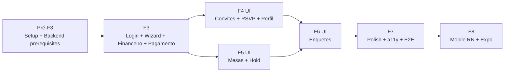
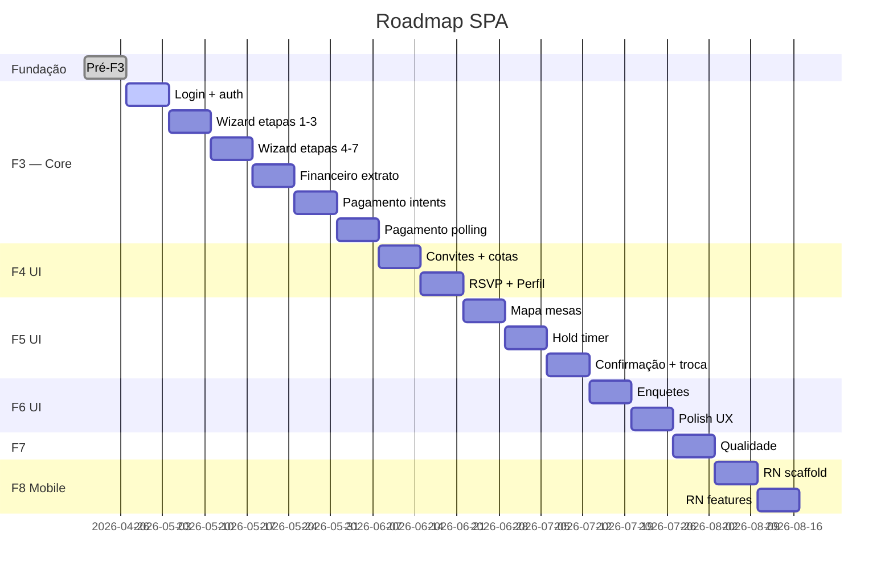

# Roadmap de Implementação — Portal SPA React

> **O que é:** detalhamento sprint-a-sprint de como o SPA React será construído, da fundação (Pré-F3) até o lançamento mobile (F8). Referencia o [Planejamento FE](../prd/PLANEJAMENTO_FRONTEND_REACT.md) e o [Roadmap geral](../prd/ROADMAP.md) do projeto.

---

## Sumário

1. [Visão geral](#1-visão-geral)
2. [Pré-F3 — setup obrigatório](#2-pré-f3--setup-obrigatório)
3. [F3 — core do usuário (SP 4–9, 34 SP)](#3-f3--core-do-usuário)
4. [F4 UI — engajamento pós-adesão (SP 10–11, 12 SP)](#4-f4-ui--engajamento-pós-adesão)
5. [F5 UI — seating crítico (SP 15–17, 14 SP)](#5-f5-ui--seating-crítico)
6. [F6 UI — refinamento (SP 18–19, 12 SP)](#6-f6-ui--refinamento)
7. [F7 — polish e qualidade (SP 24, 5 SP)](#7-f7--polish-e-qualidade)
8. [F8 — mobile (SP 25–26, 34 SP)](#8-f8--mobile)
9. [Quick wins por fase](#9-quick-wins-por-fase)
10. [Blockers por fase](#10-blockers-por-fase)
11. [Riscos por sprint](#11-riscos-por-sprint)
12. [Milestones macro](#12-milestones-macro)
13. [Sequência recomendada após documentação](#13-sequência-recomendada-após-documentação)
14. [Anexos](#14-anexos)

---

## 1. Visão geral

### 1.1 Timeline

| Fase       | Sprints   | SP  | Duração   | Entregas macro                                 |
| ---------- | --------- | --- | --------- | ---------------------------------------------- |
| **Pré-F3** | fim da F2 | —   | 1 sprint  | Setup SPA + backend prerequisites              |
| **F3**     | SP 4–9    | 34  | 6 sprints | Login + wizard + home + financeiro + pagamento |
| **F4 UI**  | SP 10–11  | 12  | 2 sprints | Convites + RSVP + perfil + extras              |
| **F5 UI**  | SP 15–17  | 14  | 3 sprints | Mapa mesas + hold + confirmação                |
| **F6 UI**  | SP 18–19  | 12  | 2 sprints | Enquetes + refinamentos                        |
| **F7**     | SP 24     | 5   | 1 sprint  | Polish + a11y AA + E2E full                    |
| **F8**     | SP 25–26  | 34  | 2 sprints | RN + Expo + token auth                         |
| **Total**  |           | 111 |           |                                                |

### 1.2 Dependências entre fases



F4 e F5 podem rodar em paralelo se houver 2 squads. F6 depende de ambos.

### 1.3 Gantt simplificado



---

## 2. Pré-F3 — setup obrigatório

**Duração:** 1 sprint (7 dias)
**SP:** não contabilizado (fundação)
**Squad:** Frontend + Backend (1 dev cada)

### 2.1 Objetivo

Terminar a sprint com **auth flow funcionando end-to-end**:

```
GET /sanctum/csrf-cookie → POST /api/v1/auth/login → GET /api/v1/me → /portal/home renderiza
```

### 2.2 Tarefas — Frontend

| #     | Tarefa                                                               | Estimativa | Owner  |
| ----- | -------------------------------------------------------------------- | ---------- | ------ |
| FE-01 | Criar `resources/spa/package.json` com deps completas                | 2 h        | Dev FE |
| FE-02 | Criar `resources/spa/vite.config.ts` com React + TanStack plugin     | 2 h        | Dev FE |
| FE-03 | Criar `resources/spa/tsconfig.json` com `strict` + `noUnchecked...`  | 1 h        | Dev FE |
| FE-04 | Criar `src/main.tsx` com ReactDOM.createRoot + Providers             | 2 h        | Dev FE |
| FE-05 | Criar `src/app/providers.tsx` (QueryClient, TamaguiProvider, Router) | 3 h        | Dev FE |
| FE-06 | Criar `tamagui.config.ts` mínimo (tokens de cor, fontes)             | 3 h        | Dev FE |
| FE-07 | Integrar `openapi-typescript` no `package.json` + script codegen     | 1 h        | Dev FE |
| FE-08 | Gerar primeiro `types.gen.ts` a partir do skeleton                   | 1 h        | Dev FE |
| FE-09 | Criar `src/api/client.ts` com Axios + 4 interceptors                 | 6 h        | Dev FE |
| FE-10 | Criar `src/stores/auth-store.ts` (Zustand)                           | 2 h        | Dev FE |
| FE-11 | Criar rota `/login` (TanStack Router file-based)                     | 3 h        | Dev FE |
| FE-12 | Criar `LoginForm` com RHF + Zod + `useLogin` hook                    | 4 h        | Dev FE |
| FE-13 | Criar rota `/portal/home` (placeholder com `useMe`)                  | 2 h        | Dev FE |
| FE-14 | Configurar Vitest + RTL + MSW + setup.ts                             | 3 h        | Dev FE |
| FE-15 | Smoke test automatizado csrf → login → me                            | 2 h        | Dev FE |
| FE-16 | README do `resources/spa/` com comandos                              | 1 h        | Dev FE |
| FE-17 | Configurar ESLint + Prettier + Husky + lint-staged                   | 3 h        | Dev FE |
| FE-18 | Configurar GitHub Actions CI (lint+typecheck+test+build)             | 3 h        | DevOps |

### 2.3 Tarefas — Backend (blockers)

| #     | Tarefa                                                                                                          | Estimativa | Owner  |
| ----- | --------------------------------------------------------------------------------------------------------------- | ---------- | ------ |
| BE-01 | Publicar `config/cors.php` com `supports_credentials: true` + allowed_headers (X-Request-Id, X-Idempotency-Key) | 2 h        | Dev BE |
| BE-02 | Configurar `config/sanctum.php` com stateful domains                                                            | 1 h        | Dev BE |
| BE-03 | Criar `routes/portal.php` com catch-all → `spa.blade.php`                                                       | 2 h        | Dev BE |
| BE-04 | Criar `resources/views/spa.blade.php` com `@viteReactRefresh` + `@vite(['resources/spa/src/main.tsx'])`         | 1 h        | Dev BE |
| BE-05 | Criar `Api\V1\AuthController@login`                                                                             | 3 h        | Dev BE |
| BE-06 | Criar `Api\V1\AuthController@me`                                                                                | 2 h        | Dev BE |
| BE-07 | Criar `Api\V1\AuthController@logout`                                                                            | 1 h        | Dev BE |
| BE-08 | Middleware global de request_id + logging                                                                       | 3 h        | Dev BE |
| BE-09 | Middleware de error envelope (Problem+JSON)                                                                     | 3 h        | Dev BE |
| BE-10 | Seed `E2ETestSeeder` com 2 formandos + 1 evento                                                                 | 2 h        | Dev BE |

### 2.4 Checklist pré-F3 (Apêndice A do planejamento)

Deve passar **todos** antes de iniciar F3:

- [ ] Instalar todas as dependências (React 19, TS 5, TanStack, Zustand, RHF, Zod, Axios, Tamagui, openapi-typescript)
- [ ] Criar `resources/spa/vite.config.ts` separado do admin
- [ ] Criar `resources/spa/tsconfig.json` com `strict` + `noUncheckedIndexedAccess`
- [ ] Criar `resources/spa/src/main.tsx`
- [ ] Criar `resources/views/spa.blade.php`
- [ ] Catch-all em `routes/portal.php`
- [ ] CORS e Sanctum configurados
- [ ] `Api\V1\AuthController` com login/me/logout
- [ ] `types.gen.ts` gerado
- [ ] `src/api/client.ts` com interceptors (csrf, auth, idempotency, 401/419)
- [ ] `src/stores/auth-store.ts`
- [ ] Vitest + RTL + MSW configurados
- [ ] Smoke test: `csrf-cookie → login → me` passando

### 2.5 Critério de saída

1. `npm run quality` verde
2. Smoke test `csrf → login → me` passa em 1ª tentativa
3. Navegação manual: `/login` → preencher → `/portal/home` renderiza usuário
4. TypeScript zero erro em `strict`
5. CI pipeline rodando em PR

### 2.6 Deliverable

PR ou série de PRs com label `pre-f3-setup`, rebase em `main`, aprovado por tech lead.

---

## 3. F3 — core do usuário

**Sprints:** SP 4 → SP 9 (6 sprints)
**SP:** 34
**Entregas macro:** autenticação + wizard de adesão (7 etapas) + dashboard home + extrato financeiro + pagamento (boleto/PIX/cartão)

### 3.1 Breakdown por sprint

#### SP 4 — Auth + Home (5 SP)

**Entregas:**

- Finalização `LoginForm` com todos estados (loading, error, esqueci-senha placeholder)
- `RequireAuth` guard component
- `/portal/home` com KPIs (saldo, próxima parcela, convites)
- Hook `useMe` estável

**Endpoints backend:**

- ✅ `POST /api/v1/auth/login`
- ✅ `GET /api/v1/me`
- ✅ `POST /api/v1/auth/logout`
- ❓ `GET /api/v1/me/home-summary` (agregado: saldo, próxima parcela, convites pendentes) — **confirmar shape**

**DoD:**

- E2E-001 e E2E-002 verdes
- a11y AA em `/login` e `/portal/home`

#### SP 5 — Wizard etapas 1-3 (6 SP)

**Entregas:**

- `src/routes/portal/adesao.$step.tsx` com 7 etapas
- Store `wizard-store.ts` com `sessionStorage` persist
- Etapa 1 (formando), Etapa 2 (responsável), Etapa 3 (seleção de pacote)

**Endpoints backend:**

- ❓ `GET /api/v1/eventos/{ulid}/pacotes` — listar pacotes disponíveis
- ❓ `POST /api/v1/eventos/{ulid}/adesoes/rascunho` — salvar rascunho (opcional)

**DoD:**

- Navegação forward/back sem perder dados
- Validação Zod em cada etapa
- `sessionStorage` sobrevive a F5

#### SP 6 — Wizard etapas 4-7 (6 SP)

**Entregas:**

- Etapa 4 (extras opcionais)
- Etapa 5 (seleção de modalidade pagamento)
- Etapa 6 (termos — aceite obrigatório)
- Etapa 7 (resumo + confirmação)
- Submit final cria adesão

**Endpoints backend:**

- ❓ `POST /api/v1/eventos/{ulid}/adesoes` — criar adesão com idempotency key

**DoD:**

- E2E-003 (wizard completo) verde
- Retry do submit final é idempotente

#### SP 7 — Financeiro extrato (6 SP)

**Entregas:**

- `/portal/financeiro` com tabela de parcelas
- Cursor pagination (useInfiniteQuery)
- Filtros (status, mês)
- Link para tela de pagamento

**Endpoints backend:**

- ❓ `GET /api/v1/me/extrato?cursor=...&limit=...&status=...` — **confirmar shape do envelope**

**DoD:**

- Scroll infinito funcional
- Performance: 1000+ parcelas sem travamento
- Lighthouse ≥ 90 em `/portal/financeiro`

#### SP 8 — Pagamento intents (6 SP)

**Entregas:**

- `/portal/pagamento/$parcela_ulid`
- Criar intent para boleto / PIX / cartão
- Exibir instruções (boleto PDF, QR code PIX, form cartão)

**Endpoints backend:**

- ❓ `POST /api/v1/pagamentos/intents` com `X-Idempotency-Key`
- ❓ `GET /api/v1/pagamentos/{ulid}` para status

**DoD:**

- Idempotência validada (2 cliques = 1 intent)
- Cartão via tokenização (nunca guardar dados)

#### SP 9 — Pagamento polling + finalização (5 SP)

**Entregas:**

- Polling do status (3s interval, timeout 10 min)
- UI de "aguardando confirmação"
- Tratamento de sucesso / expiração / falha
- Emissão de comprovante (PDF)

**Endpoints backend:**

- ❓ `GET /api/v1/pagamentos/{ulid}` — retornar status em tempo real

**DoD:**

- E2E-004 verde (login → pagar parcela → status pago)
- Polling para ao detectar estado final

### 3.2 Endpoints consolidados F3

| Método | Path                             | Owner BE  | Status  |
| ------ | -------------------------------- | --------- | ------- |
| GET    | `/sanctum/csrf-cookie`           | framework | ✅      |
| POST   | `/api/v1/auth/login`             | BE-05     | ❌ bloq |
| GET    | `/api/v1/me`                     | BE-06     | ❌ bloq |
| POST   | `/api/v1/auth/logout`            | BE-07     | ❌ bloq |
| GET    | `/api/v1/me/home-summary`        | novo      | ❓      |
| GET    | `/api/v1/me/eventos`             | planejado | ❓      |
| GET    | `/api/v1/me/adesoes`             | planejado | ❓      |
| GET    | `/api/v1/eventos/{ulid}/pacotes` | novo      | ❓      |
| POST   | `/api/v1/eventos/{ulid}/adesoes` | planejado | ❓      |
| GET    | `/api/v1/me/extrato`             | planejado | ❓      |
| POST   | `/api/v1/pagamentos/intents`     | planejado | ❓      |
| GET    | `/api/v1/pagamentos/{ulid}`      | planejado | ❓      |

### 3.3 Milestone F3

**M2 — Adesão completa**: formando loga, faz adesão inteira, acompanha extrato, paga parcela. E2E do fluxo verde em 3 browsers.

---

## 4. F4 UI — engajamento pós-adesão

**Sprints:** SP 10 → SP 11 (2 sprints)
**SP:** 12
**Entregas macro:** carteira de convites (emitir/transferir) + RSVP público + perfil + extras

### 4.1 Breakdown

#### SP 10 — Convites + RSVP (6 SP)

**Entregas:**

- `/portal/convites` listando cotas e convidados atuais
- Modal "Emitir convite" com QR code / link copiável
- Modal "Transferir cota" (entre formandos — se permitido)
- `/rsvp/$token` rota pública (sem auth)
- Form de RSVP: presença (sim/não) + acompanhantes + restrições alimentares

**Endpoints backend:**

- ❓ `GET /api/v1/me/convites`
- ❓ `POST /api/v1/eventos/{ulid}/convites` (emitir)
- ❓ `POST /api/v1/eventos/{ulid}/convites/{ulid}/transferir`
- ❓ `GET /api/v1/convite/{token}` (público, sem auth)
- ❓ `POST /api/v1/convite/{token}/confirmar` (público)

**DoD:**

- E2E-005 verde (emitir → RSVP)
- Link RSVP funciona em incógnito

#### SP 11 — Perfil + Extras (6 SP)

**Entregas:**

- `/portal/perfil` — editar dados pessoais, telefone, endereço
- Upload de foto (avatar)
- Troca de senha (form separado)
- `/portal/extras` — catálogo de produtos extras (ex: foto adicional, DVD)
- Carrinho simples + checkout (reutiliza fluxo de pagamento)

**Endpoints backend:**

- ❓ `GET /api/v1/me/perfil`
- ❓ `PUT /api/v1/me/perfil`
- ❓ `POST /api/v1/me/senha` (troca senha)
- ❓ `GET /api/v1/eventos/{ulid}/extras/catalogo`
- ❓ `POST /api/v1/me/extras/compras` (idempotente)

**DoD:**

- Dados persistem após F5
- a11y AA em formulários de perfil
- Upload de avatar < 2 MB com preview

### 4.2 Milestone F4

**M3 parcial — engajamento**: formando emite convite, convidado confirma presença, formando compra extra.

---

## 5. F5 UI — seating crítico

**Sprints:** SP 15 → SP 17 (3 sprints)
**SP:** 14
**Entregas macro:** mapa interativo de mesas + hold timer + confirmação + troca + idempotência completa

> F5 é o módulo **mais sensível** do portal. Concorrência + invariantes + UX em tempo real.

### 5.1 Breakdown

#### SP 15 — Mapa de mesas (5 SP)

**Entregas:**

- `/portal/mesas` com render de mapa (canvas ou SVG)
- Estados visuais: disponível, reservada (outros), minha reserva, em hold
- Tooltip/modal de info ao hover
- Polling 5s do mapa (considerar websocket em F8)

**Endpoints backend:**

- ❓ `GET /api/v1/eventos/{ulid}/mesas/mapa`
- ❓ `GET /api/v1/eventos/{ulid}/mesas/estado` (leve, para polling)

**DoD:**

- Rende 100+ mesas sem travamento
- Zoom + pan funcionais (mobile + desktop)

#### SP 16 — Hold timer + confirmação (5 SP)

**Entregas:**

- Clicar em cadeira → `POST /mesas/holds` → hold ativo 5 min
- Countdown visível e preciso (servidor-driven)
- Botão "Confirmar assento" → `POST /mesas/confirmar` com idempotency
- Estado "hold expirado" → retomar fluxo

**Endpoints backend:**

- ❓ `POST /api/v1/eventos/{ulid}/mesas/holds` (TTL 5 min no servidor)
- ❓ `DELETE /api/v1/eventos/{ulid}/mesas/holds/{hold_id}` (liberar)
- ❓ `POST /api/v1/eventos/{ulid}/mesas/confirmar` (X-Idempotency-Key)

**Invariantes:**

- Uma cadeira não pode ter 2 holds ativos simultâneos
- Confirmação expirada falha com 410 Gone
- Race condition resolvida no DB (unique index + transaction)

**DoD:**

- E2E-006 verde
- E2E-007 verde (expira e reinicia)
- Teste de carga: 50 usuários na mesma cadeira → 1 ganha

#### SP 17 — Troca + refinamentos (4 SP)

**Entregas:**

- Trocar de assento (solicitar, validar, confirmar)
- Listar histórico de mudanças
- Ícones e feedback visual (confetti ao confirmar)

**Endpoints backend:**

- ❓ `POST /api/v1/eventos/{ulid}/mesas/trocar`
- ❓ `GET /api/v1/me/assentos/historico`

**DoD:**

- Troca atômica (libera antigo + reserva novo na mesma transação)

### 5.2 Riscos F5

- Hold drift cliente/servidor (mitigado com tick local do ISO do servidor)
- Concorrência de 2 usuários na mesma cadeira (mitigado por DB + idempotency)
- Performance do canvas com 500+ cadeiras (mitigado com virtualização)

### 5.3 Milestone F5

**M3 completo — seating**: 2 usuários concorrentes tentam mesma cadeira; exatamente 1 confirma; outro vê atualização em tempo real.

---

## 6. F6 UI — refinamento

**Sprints:** SP 18 → SP 19 (2 sprints)
**SP:** 12
**Entregas macro:** enquetes + notificações in-app + polish UX geral

### 6.1 Breakdown

#### SP 18 — Enquetes (6 SP)

**Entregas:**

- `/portal/enquetes` lista enquetes abertas/fechadas
- Votar (com validação de janela temporal)
- Ver resultados (se permitido)
- Múltipla escolha + resposta única

**Endpoints backend:**

- ❓ `GET /api/v1/eventos/{ulid}/enquetes`
- ❓ `GET /api/v1/eventos/{ulid}/enquetes/{ulid}`
- ❓ `POST /api/v1/eventos/{ulid}/enquetes/{ulid}/votos` (idempotente)
- ❓ `GET /api/v1/eventos/{ulid}/enquetes/{ulid}/resultados`

**DoD:**

- Janela temporal respeitada (server-driven)
- 1 voto por usuário por enquete

#### SP 19 — Polish UX (6 SP)

**Entregas:**

- Skeletons em todas telas com loading
- Toasts consistentes (sucesso, erro, info)
- Transições (view transitions API onde suportado)
- Copys revisados em PT-BR
- Tema escuro (se decidido — ver [14-OPEN-QUESTIONS](./14-OPEN-QUESTIONS-AND-BACKEND-BLOCKERS.md))

**DoD:**

- Cada rota tem loading state definido
- Erro genérico nunca aparece — sempre mensagem acionável

### 6.2 Milestone F6

**M4 parcial — produto completo**: formando tem todas funcionalidades esperadas do portal.

---

## 7. F7 — polish e qualidade

**Sprints:** SP 24 (1 sprint)
**SP:** 5
**Entregas macro:** a11y WCAG AA, performance Lighthouse ≥ 90, E2E full, observabilidade

### 7.1 Breakdown

**Tarefas:**

1. **A11y audit** (1.5 SP)
    - Rodar axe em todas 11 rotas
    - Corrigir todas violações AA
    - Testar com NVDA + VoiceOver
    - Keyboard-only navigation testada

2. **Performance** (1.5 SP)
    - Lighthouse em todas rotas-chave ≥ 90 Perf
    - Bundle ≤ 250 KB gzip inicial
    - Lazy load rotas pesadas (mesas, wizard)
    - Otimizar imagens (WebP, lazy)

3. **E2E full** (1 SP)
    - Playwright suite completa (7 fluxos)
    - Rodar em 4 browsers (chromium, webkit, mobile-chrome, mobile-safari)
    - Nightly configurado

4. **Observabilidade** (1 SP)
    - Web Vitals em produção
    - Sentry (ou equivalente)
    - Dashboard em Pulse com métricas FE

### 7.2 Milestone F7

**M4 — release-ready**: SPA pronto para produção com qualidade de software confiável.

---

## 8. F8 — mobile

**Sprints:** SP 25 → SP 26 (2 sprints)
**SP:** 34
**Entregas macro:** React Native app reutilizando código do SPA (Tamagui compartilhado)

### 8.1 Estratégia

- **Monorepo:** `resources/spa/` continua; `mobile/` nova pasta
- **Shared:** `lib/`, `stores/`, `api/`, `forms/` reutilizados via workspace npm
- **Tamagui v2:** componentes compartilhados entre web e native (props idênticas)
- **Auth:** token Bearer (ADR-0003 do backend define modelo para mobile)
- **Endpoints:** mesmos do web

### 8.2 Breakdown

#### SP 25 — Scaffold RN (15 SP)

- Expo SDK 53 init
- Tamagui + theme setup
- TanStack Router nativo
- TanStack Query reutilizado
- Axios com token auth
- Login + home + extrato (read-only)

#### SP 26 — Features core (19 SP)

- Wizard adesão mobile
- Pagamento (boleto copiável, PIX QR)
- Mapa mesas (nativo, com gesto de pinch-zoom)
- Notificações push (Expo Notifications)
- Build TestFlight + Play Internal

### 8.3 Milestone F8

**M5 — mobile MVP**: app publicado em TestFlight/Play Internal com 5+ features principais.

---

## 9. Quick wins por fase

### F3

- 🎯 **Skeletons consistentes** — todos os `isLoading` mostram skeleton do conteúdo, não spinner genérico
- 🎯 **Copy-to-clipboard do link de pagamento** — facilita compartilhar com responsável
- 🎯 **Formato de moeda em tempo real** — input mask com R$ visível enquanto digita

### F4

- 🎯 **Copy-to-clipboard do link RSVP** — com toast "copiado!"
- 🎯 **WhatsApp share** — botão que gera link `wa.me/?text=...`
- 🎯 **Preview do avatar** antes do upload

### F5

- 🎯 **Toast "hold expirando em 30s"** — alerta proativo
- 🎯 **Highlight do assento escolhido** em pulso verde
- 🎯 **"Ver minha mesa"** — centralizar câmera do mapa

### F6

- 🎯 **Confetti ao votar** (pequeno humor / gamificação)
- 🎯 **Histórico de votos** em modal
- 🎯 **Contagem regressiva** para fim da enquete

### F7

- 🎯 **Dark mode** (opcional, via toggle)
- 🎯 **Offline indicator** (quando Axios detecta `!navigator.onLine`)
- 🎯 **"Erro? Copie o ID"** — botão ao lado de erros, copia request_id

### F8

- 🎯 **Biometria opcional** (FaceID / fingerprint) ao abrir app
- 🎯 **Notificação push** ao confirmar pagamento

---

## 10. Blockers por fase

| Fase   | Blocker                                                       | Owner        | Prioridade         |
| ------ | ------------------------------------------------------------- | ------------ | ------------------ |
| Pré-F3 | `config/cors.php` publicado                                   | Dev BE       | ❌ crítico         |
| Pré-F3 | `config/sanctum.php` stateful domains                         | Dev BE       | ❌ crítico         |
| Pré-F3 | `routes/portal.php` catch-all → `spa.blade.php`               | Dev BE       | ❌ crítico         |
| Pré-F3 | `spa.blade.php` criado com @vite                              | Dev BE       | ❌ crítico         |
| Pré-F3 | `Api\V1\AuthController` (login/me/logout)                     | Dev BE       | ❌ crítico         |
| Pré-F3 | `openapi-skeleton.yaml` cobre auth endpoints                  | Tech Lead BE | ❌ crítico         |
| F3     | `GET /api/v1/me/extrato` com cursor pagination                | Dev BE       | ❌ bloqueia SP 7   |
| F3     | `POST /api/v1/pagamentos/intents` com idempotency             | Dev BE       | ❌ bloqueia SP 8   |
| F3     | Gateway Itaú sandbox disponível                               | Dev BE       | ❌ bloqueia SP 8-9 |
| F3     | Shape de `/eventos/{ulid}/pacotes` + wizard                   | Dev BE       | ❌ bloqueia SP 5   |
| F4     | Endpoints `/me/convites`, `/convite/{token}` públicos         | Dev BE       | ❌ bloqueia SP 10  |
| F4     | Design: link RSVP com QR code ou apenas URL?                  | Product/UX   | ❓ aberta          |
| F5     | `POST /mesas/holds` atômico no DB                             | Dev BE       | ❌ bloqueia SP 16  |
| F5     | Shape do mapa (`GET /mesas/mapa`) — JSON leve ou pesado?      | Dev BE       | ❓ aberta          |
| F5     | Decisão realtime: polling vs WebSocket                        | Tech Lead    | ❓ aberta          |
| F6     | Enquetes: janela aberta/fechada no server?                    | Dev BE       | ❓ aberta          |
| F7     | Sentry / LogRocket: ferramenta escolhida?                     | Tech Lead    | ❓ aberta          |
| F8     | Tamagui v2 maturidade em RN com Expo SDK 53 (validar 2026-Q2) | Tech Lead FE | ❓ aberta          |

Detalhamento completo em [14-OPEN-QUESTIONS-AND-BACKEND-BLOCKERS.md](./14-OPEN-QUESTIONS-AND-BACKEND-BLOCKERS.md).

---

## 11. Riscos por sprint

### SP 4–6 (F3 inicial)

- **Sanctum + CORS podem demorar a estabilizar.** Mitigação: Pré-F3 dedicado a isso.
- **Codegen dessincronizado.** Mitigação: `codegen:check` no CI desde SP 4.

### SP 7–9 (financeiro + pagamento)

- **Gateway sandbox instável.** Mitigação: MSW mock em dev; Playwright usa sandbox quando possível.
- **Polling agressivo** sobrecarrega servidor. Mitigação: interval 3s, timeout 10 min, backoff em erro.

### SP 15–17 (seating)

- **Concorrência de holds.** Mitigação: TD detalhado em [09 §4](./09-TECHNICAL-DESIGN-CRITICAL-MODULES.md) + E2E-006/007.
- **Canvas performance.** Mitigação: virtualização + `will-change: transform`.
- **Drift de timer.** Mitigação: servidor é fonte; cliente só tick.

### SP 18–19 (enquetes + polish)

- **Escopo crescente** em polish. Mitigação: freeze de escopo no SP 18 meio.

### SP 24 (F7)

- **Muitos a11y fixes atrasam.** Mitigação: rodar axe toda sprint, não acumular.

### SP 25–26 (F8)

- **Tamagui v2 em RN recente.** Mitigação: validar POC na primeira semana; fallback para `react-native-paper` se travar.
- **Build para lojas** leva dias (revisão Apple). Mitigação: começar upload no SP 25.

---

## 12. Milestones macro

| Marco | Nome                              | Quando     | Critério                                                         |
| ----- | --------------------------------- | ---------- | ---------------------------------------------------------------- |
| M1    | Pré-F3 done — "primeiro login OK" | fim Pré-F3 | smoke csrf → login → me verde                                    |
| M2    | F3 done — "adesão completa"       | fim SP 9   | E2E-003 + E2E-004 verdes em 3 browsers                           |
| M3    | F5 done — "mapa mesas completo"   | fim SP 17  | E2E-006 + E2E-007 verdes, concorrência resolvida                 |
| M4    | F7 done — "release-ready"         | fim SP 24  | a11y AA, Lighthouse ≥ 90, E2E full verde, observabilidade ligada |
| M5    | F8 done — "mobile MVP"            | fim SP 26  | app em TestFlight + Play Internal com 5 features                 |

Cada marco é **gate de release**: não passa sem todas evidências.

---

## 13. Sequência recomendada após documentação

Ordem prática de ataque:

### Fase 0 — preparação (1-2 dias)

1. **Revisar blockers backend** em [14-OPEN-QUESTIONS](./14-OPEN-QUESTIONS-AND-BACKEND-BLOCKERS.md). Criar issues no Plane para cada ❌.
2. **Validar planejamento** com tech lead BE. Alinhar quem faz o quê no Pré-F3.
3. **Publicar spec OpenAPI** ao menos para auth + `/me` endpoints.

### Fase 1 — Pré-F3 (1 sprint)

4. **Executar checklist Pré-F3** (§2.4). Cada item vira issue no Plane.
5. **Backend:** BE-01 a BE-10 em paralelo com Frontend.
6. **Frontend:** FE-01 a FE-18.
7. **Smoke test** em par (BE + FE) ao final da sprint.

### Fase 2 — F3 (6 sprints)

8. **Iniciar F3 pelo login** — já coberto na Pré-F3, apenas finalizar UX e testes.
9. **Wizard adesão** — começar por etapas 1-3, fluxo básico; etapas 4-7 depois.
10. **Financeiro** — desenvolvido **em paralelo** ao wizard se houver 2 devs FE.
11. **Pagamento** depende do wizard concluído (formando precisa ter adesão). Iniciar SP 8.

### Fase 3 — F4 + F5 (em paralelo se possível, 5 sprints)

12. **F4 (convites + perfil)** pode rodar em paralelo a **F5 (mesas)** se houver 2 squads.
13. Se 1 squad: ordem F4 → F5 (convites antes de mesas, pois UX mais simples).

### Fase 4 — F6 (2 sprints)

14. **Enquetes + polish.** Gate de entrada: F5 done.

### Fase 5 — F7 (1 sprint)

15. **Audit a11y** feito por QA dedicado (ou tech lead FE + acessibilidade checklist).
16. **Lighthouse CI** ligado desde SP 4, mas aqui se garante ≥ 90 em todas rotas.
17. **Nightly E2E** ligado.

### Fase 6 — F8 (2 sprints)

18. **SP 25**: scaffold RN + 3 features leitura (login, home, extrato).
19. **SP 26**: features interativas (wizard reduzido, pagamento, mesas) + build lojas.

### Indicadores de saúde por fase

- **Velocity sprint** dentro de ±15% do target
- **Coverage** crescente ou estável
- **Bugs em produção (prod incidents)** = 0 nas primeiras 72h após deploy
- **PRs sem revisão em 48h** = 0
- **Testes flaky** ≤ 2% da suite

---

## 14. Anexos

### 14.1 Mapeamento sprint ↔ módulo

| Sprint | Módulo principal     | Rotas tocadas                  |
| ------ | -------------------- | ------------------------------ |
| Pré-F3 | infra + auth         | /, /login, /portal/home        |
| SP 4   | auth + home          | /login, /portal/home           |
| SP 5   | wizard 1-3           | /portal/adesao/1-3             |
| SP 6   | wizard 4-7           | /portal/adesao/4-7             |
| SP 7   | financeiro           | /portal/financeiro             |
| SP 8   | pagamento intents    | /portal/pagamento/$ulid        |
| SP 9   | pagamento polling    | /portal/pagamento/$ulid        |
| SP 10  | convites + RSVP      | /portal/convites, /rsvp/$token |
| SP 11  | perfil + extras      | /portal/perfil, /portal/extras |
| SP 15  | mapa mesas           | /portal/mesas                  |
| SP 16  | hold + confirmação   | /portal/mesas                  |
| SP 17  | troca + refinamentos | /portal/mesas                  |
| SP 18  | enquetes             | /portal/enquetes               |
| SP 19  | polish UX            | todas                          |
| SP 24  | qualidade + a11y     | todas                          |
| SP 25  | mobile scaffold      | (mobile)                       |
| SP 26  | mobile features      | (mobile)                       |

### 14.2 Definição de "feature crítica"

Feature que, se quebrar, gera:

- Perda de dinheiro (pagamento, cobrança duplicada)
- Perda de confiança (seating duplicado, convite inválido)
- Bloqueio de fluxo principal (login, wizard)

Lista:

- Auth (login, logout, me)
- Wizard adesão completo
- Pagamento (intent + polling + comprovante)
- Mesas (hold + confirmar + trocar)
- Convites (emitir + RSVP)

**Toda feature crítica** tem cobertura E2E obrigatória em PR.

### 14.3 Links cruzados

- [SAD](./05-FRONTEND-SAD.md)
- [Technical Design](./09-TECHNICAL-DESIGN-CRITICAL-MODULES.md)
- [QA Strategy](./10-QA-TEST-STRATEGY.md)
- [Dev Setup](./11-DEV-SETUP-AND-ENGINEERING-STANDARDS.md)
- [Runbook](./12-RUNBOOK-FRONTEND.md)
- [Open Questions](./14-OPEN-QUESTIONS-AND-BACKEND-BLOCKERS.md)
- [Planejamento FE](../prd/PLANEJAMENTO_FRONTEND_REACT.md)
- [Planejamento BE](../prd/PLANEJAMENTO_BACKEND_APIV1.md)
- [Roadmap geral](../prd/ROADMAP.md)
- [Api contract](../api/api-contract.md)

### 14.4 Histórico

| Data       | Versão | Autor        | Mudança                                                     |
| ---------- | ------ | ------------ | ----------------------------------------------------------- |
| 2026-04-18 | 1.0.0  | Agente QA/FE | Versão inicial — Pré-F3 a F8, breakdown, milestones, riscos |
