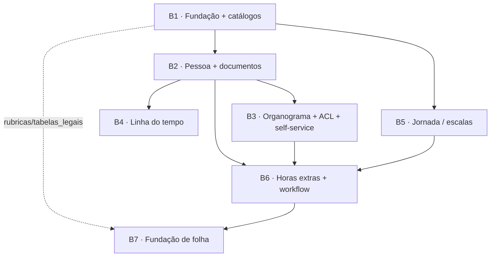

# 02 — Blueprint da Fase 1

Relacionados: [01](01-modelo-de-dominio.md) (fonte de verdade de schema) · [03](03-cadastro-pessoa-documentos.md) · [05](05-organograma-acl-hierarquica.md) · [07](07-jornada-horas-extras-folha.md) · [08](08-arquitetura-tecnica.md) · [ADR-0015](../../../architecture/adrs/ADR-0015-modulos-pacotes-composer.md) · [ADR-RH-002](adrs/ADR-RH-002-fronteira-enum-vs-catalogo.md)

> **O que este documento é.** O plano de execução da Fase 1 do módulo de RH, decomposto em **7 blocos/ondas** (épicos internos), entregáveis de forma incremental. Cada bloco lista objetivo, entregas, tabelas/enums (sempre referenciando os nomes do [01](01-modelo-de-dominio.md)), permissões `rh.*`, telas Livewire, dependências e _Definition of Done_ (DoD).
>
> **O que este documento não é.** Não redefine schema — qualquer divergência de coluna/enum/tabela é resolvida **primeiro no [01](01-modelo-de-dominio.md)**. Não detalha mecânica de organograma/ACL, linha do tempo, jornada/HE/folha — isso vive em [05](05-organograma-acl-hierarquica.md), [06](06-linha-do-tempo.md) e [07](07-jornada-horas-extras-folha.md). A arquitetura técnica transversal (camadas, services, snapshots) é o [08](08-arquitetura-tecnica.md).
>
> Pacote: `ht2ml/extensao-rh` · namespace `HT2ML\Rh\` · `packages/extensao-rh/` · views `rh::` · **aditivo ao core** (nunca edita o boilerplate — [ADR-0015](../../../architecture/adrs/ADR-0015-modulos-pacotes-composer.md)).

---

## 0. Premissas e convenções de execução

Aplicáveis a **todos** os blocos (herdadas do core e do [01 §0](01-modelo-de-dominio.md)):

- **Geração via gerador, não à mão.** Bootstrap do pacote com `php artisan make:extensao Rh`; cada recurso CRUD com `php artisan make:modulo <Recurso> --module=Rh --tenant`. O gerador emite migration, factory, model (`BelongsToEmpresa` + `Auditavel`), enum de status, DTO `readonly`, `Rules`, Actions `execute()`, Policy (registrada no provider), Livewire **Index/Form/Table** (PowerGrid), views (`rh::`), teste Pest, e injeta permissões em `config/rh.php` (agregadas a `config('access.modules')['negocio']`) + item de menu na seção `negocio` + rotas via `ModuleRegistry`. Depois do gerador, **customiza-se** a migration (colunas/índices/FKs do [01](01-modelo-de-dominio.md)), o model (relações, casts, `atributosNaoAuditados()`), as `Rules` e as Actions.
- **Multi-tenant** — toda tabela de negócio e catálogo tenant usa `HT2ML\Core\Models\Concerns\BelongsToEmpresa` (global scope `empresa` + auto-fill no `creating`); `unique` sempre por empresa (`Rule::unique()->where('empresa_id', …)` **+** índice único parcial `WHERE deleted_at IS NULL`).
- **Lixeira** — models de negócio implementam `HT2ML\Core\Models\Contracts\UsaSoftDeletes` (`SoftDeletes`); as Tables usam `HT2ML\Core\Livewire\Concerns\ComLixeira` (3 permissões por recurso: `deletar`→lixeira, `restaurar`, `excluir_permanente`→force-delete). Exceções append-only (`funcionario_funcao`, `escala_dias`, `escala_funcionario`, `funcionario_eventos`, `horas_extras`) **não** têm `deleted_at` — ver coluna "lixeira?" de cada bloco.
- **Enums backed** (ADR-0010) — `packages/extensao-rh/src/Enums/`; coluna `VARCHAR` + **CHECK constraint** Postgres + cast no model. Lista canônica em [01 §4](01-modelo-de-dominio.md).
- **Permissões** — a **lista canônica é [01 §10](01-modelo-de-dominio.md)** (fonte de verdade; este doc referencia-a, não a redefine). Padrão `rh.<recurso_snake_plural>.<acao>` (prefixo `rh.` obrigatório — [ADR-0015](../../../architecture/adrs/ADR-0015-modulos-pacotes-composer.md)). Ações CRUD padrão: `listar`, `criar`, `editar`, `deletar`, `restaurar`, `excluir_permanente`. Permissões especiais (ex.: `rh.funcionarios.ver_todos`, `rh.funcionarios.ver_dados_sensiveis`, `rh.afastamentos.ver_cid`, `rh.horas_extras.{aprovar,ver_valores}`) são adicionadas à mão em `config/rh.php`. Recursos com verbo próprio (`horas_extras`: `lancar/aprovar/estornar/marcar_paga/ver_valores`; `eventos`: `registrar`) seguem **exatamente** os slugs de [01 §10](01-modelo-de-dominio.md).
- **Qualidade (gate de cada bloco)** — `./vendor/bin/pint`, `npx prettier --write packages/extensao-rh/`, `./vendor/bin/phpstan analyse` (level 6, sem warnings), `php artisan test` (verde). Após migrar/instalar: `php artisan migrate && php artisan access:sync && php artisan cache:clear`.
- **DoD comum a todo recurso** (além do específico de cada bloco): migration idempotente com índices/FKs/CHECKs do [01](01-modelo-de-dominio.md); factory realista; model com traits/casts/relações/`atributosNaoAuditados()`; Policy mapeando as `rh.*`; lixeira onde aplicável; telas Index/Form/Table funcionais (sem `<select>` nativo — usar `x-shared.select-search`); testes Pest (CRUD + tenant scope + policy + regras de negócio); Pint/Prettier/PHPStan/test verdes.

---

## 1. Mapa de blocos (épicos internos da Fase 1)

| #      | Bloco                                                            | Foco                                                                           | Esforço | Doc de detalhe                                |
| ------ | ---------------------------------------------------------------- | ------------------------------------------------------------------------------ | ------- | --------------------------------------------- |
| **B1** | Fundação do pacote + catálogos                                   | Casca do pacote, wiring core, 6 catálogos tenant + provisionamento por empresa | **G**   | este doc · [01 §5](01-modelo-de-dominio.md)   |
| **B2** | Cadastro de pessoa + documentos                                  | `funcionarios` + 5 filhas + documentos via `Anexo`                             | **G**   | [03](03-cadastro-pessoa-documentos.md)        |
| **B3** | Organograma + ACL hierárquica + vínculo AdminUser + self-service | `gestor_id`, escopo recursivo, `admin_user_id`, portal do colaborador          | **M**   | [05](05-organograma-acl-hierarquica.md)       |
| **B4** | Linha do tempo                                                   | `funcionario_eventos` (append-only) + `funcionario_afastamentos`               | **M**   | [06](06-linha-do-tempo.md)                    |
| **B5** | Jornada/escalas                                                  | `escalas`, `escala_dias`, `escala_funcionario`                                 | **M**   | [07](07-jornada-horas-extras-folha.md)        |
| **B6** | Horas extras + workflow                                          | `horas_extras`, cálculo, máquina de estados de aprovação                       | **M**   | [07](07-jornada-horas-extras-folha.md)        |
| **B7** | Fundação de folha                                                | `rubricas`, `tabelas_legais`, ponte HE→rubrica                                 | **P**   | [07 §Folha](07-jornada-horas-extras-folha.md) |

> _Esforço relativo:_ **P** = pequeno · **M** = médio · **G** = grande. B1 é grande pela infraestrutura (wiring + 6 catálogos + provisionamento idempotente + seeds). B7 é pequeno por ser **fundação** (modelagem + seed, sem apuração).

### 1.1 Status de implementação (B1–B7)

Estado **real** do pacote `packages/extensao-rh` nesta data — verificado no repositório próprio do pacote (3 commits: base do módulo, lixeira, select de cargo). Legenda: ✅ existe · 🟡 parcial · ❌ não iniciado. Serve para o dev saber o que **expandir** vs **criar do zero**; **não** substitui o DoD de cada bloco (que continua sendo o critério de pronto).

| Bloco  | Item                                                                                           | Status | Observação                                                                                                                   |
| ------ | ---------------------------------------------------------------------------------------------- | ------ | ---------------------------------------------------------------------------------------------------------------------------- |
| —      | Casca do pacote (bootstrap + wiring no `RhServiceProvider`)                                    | 🟡     | pacote existe, instalado por symlink, rotas/menu/permissões mescladas; **provisionamento de catálogos ainda não**            |
| **B1** | `departamentos` (model `Departamento`, `StatusDepartamento`, lixeira)                          | ✅     | catálogo hierárquico no ar; conferir `responsavel_funcionario_id` + CHECK self-relation do [01 §A1](01-modelo-de-dominio.md) |
| **B1** | `funcoes`, `tipos_documento`, `tipos_afastamento`, `escalas`, `rubricas`, `fator_horas_extras` | ❌     | 5 catálogos + 1 fino ainda não criados                                                                                       |
| **B1** | `ProvisionarCatalogosRh` + gancho de criação de empresa + seed `tabelas_legais`                | ❌     | sem provisionamento por empresa ainda                                                                                        |
| **B2** | `funcionarios` (tabela base, `StatusFuncionario`, lixeira, select de cargo)                    | 🟡     | núcleo mínimo existe; faltam grupo **PCD**, demais colunas eSocial-ready e `dados_personalizados`                            |
| **B2** | 5 filhas (contatos, endereços, bancário, dependentes, documentos) + documentos via `Anexo`     | ❌     | nenhuma filha criada                                                                                                         |
| **B2** | Campos personalizados (fundação) · storage endurecido (`rh_privado`) · docs em lote/ZIP+tag    | ❌     | incrementos da revisão ([10](10-campos-personalizados.md) · [03 §8](03-cadastro-pessoa-documentos.md))                       |
| **B3** | Organograma (`gestor_id`/CTE), `funcionario_funcao`, vínculo `admin_user_id`, self-service     | ❌     | colunas `gestor_id`/`admin_user_id` ainda não estão na migration base de `funcionarios`                                      |
| **B4** | `funcionario_eventos` (append-only) + `funcionario_afastamentos`                               | ❌     | —                                                                                                                            |
| **B5** | `escala_dias`, `escala_funcionario`                                                            | ❌     | dependem do cabeçalho `escalas` (B1, ainda ❌)                                                                               |
| **B6** | `horas_extras` + cálculo + máquina de estados                                                  | ❌     | —                                                                                                                            |
| **B7** | `rubricas` (uso pleno) + `tabelas_legais` + ponte HE→rubrica                                   | ❌     | —                                                                                                                            |

> **Leitura:** o caminho crítico `B1 → B2 → B3` está **apenas começado** — há a casca + 1 catálogo + a base do funcionário. O próximo passo natural é **completar B1** (5 catálogos restantes + provisionamento) e **expandir B2** (grupo PCD, filhas, eSocial-ready), mantendo verdes os testes de intenção (`FuncionarioCargoTest`, `RhLixeiraTest`). As pendências bloqueantes de cada bloco estão consolidadas em [13 §2](13-rastreabilidade-e-pendencias.md).

---

## 2. Diagrama de dependências entre blocos



Leitura em texto (quem precisa de quem):

- **B1** não depende de nada — é o pré-requisito de todos (cria o pacote, o wiring e os 6 catálogos).
- **B2** depende de **B1** (precisa de `departamentos`, `funcoes`, `tipos_documento` para os selects e do pacote instalado).
- **B3** depende de **B2** (organograma é sobre `funcionarios.gestor_id`; vínculo é `funcionarios.admin_user_id`).
- **B4** depende de **B2** (eventos/afastamentos são de um funcionário; afastamento usa `tipos_afastamento` de B1).
- **B5** depende de **B1** (`escalas`/`escala_dias` são catálogo de B1; `escala_funcionario` precisa de **B2** para atribuir).
- **B6** depende de **B2 + B5 + B3** (HE é de um funcionário, sobre uma escala/regime, aprovada pela cadeia do organograma).
- **B7** depende de **B1** (`rubricas`/`tabelas_legais` semeadas em B1) e de **B6** (ponte "HE aprovada → rubrica").

---

## 3. Ordem recomendada

**Caminho crítico:** `B1 → B2 → B3` (sequencial — cada um destrava o próximo). A partir de `funcionarios` (B2), abrem-se três frentes paralelizáveis:

```
B1 ──> B2 ──> B3
        │
        ├──> B4   (linha do tempo — independente de B3/B5)
        └──> B5 ──> B6 ──> B7
```

- Faça **B1 → B2 → B3** primeiro (núcleo navegável: cadastro + organograma + login do colaborador).
- **B4** pode rodar em paralelo a B3/B5 logo após B2 (só precisa de `funcionarios` + `tipos_afastamento`).
- A trilha de folha é **B5 → B6 → B7**, nessa ordem (escala alimenta o cálculo da HE; HE aprovada alimenta a rubrica).
- **B7** fecha a Fase 1 (depende de B6).

Sequência linear sugerida para execução solo: **B1 → B2 → B3 → B4 → B5 → B6 → B7**.

---

## 4. Os blocos em detalhe

### B1 — Fundação do pacote + catálogos `[G]`

**Objetivo.** Erguer a casca do pacote `ht2ml/extensao-rh` integrada ao core de forma **aditiva** (zero edição do boilerplate — [ADR-0015](../../../architecture/adrs/ADR-0015-modulos-pacotes-composer.md)) e entregar os **6 catálogos tenant** que destravam o cadastro de pessoa (B2) e a folha (B5/B7), com **provisionamento idempotente por empresa**.

**Entregas.**

1. **Bootstrap do pacote** — `php artisan make:extensao Rh` cria `packages/extensao-rh/` (src, database, resources, routes, tests, `config/rh.php`, `RhServiceProvider`) e registra o path repository. `composer require "ht2ml/extensao-rh:@dev"` (symlink) para desenvolver dentro do boilerplate.
2. **Wiring ao core** (no `RhServiceProvider`, gerado pelo stub — apenas se completa):
    - **Rotas** — `register()` chama `HT2ML\Core\Support\Modules\ModuleRegistry::routes(...)` que dá `require` em `packages/extensao-rh/routes/admin.php` **dentro** do grupo autenticado `/admin` (herda prefixo `/admin`, name `admin.` e middleware tenant/2FA/inatividade).
    - **Permissões** — `boot()` faz merge de `config('rh.permissoes')` em `config('access.modules')['negocio']`, para que `access:sync`, a matriz de acesso e o `RolePermissionSeeder` enxerguem as `rh.*`.
    - **Menu** — `boot()` faz merge de `config('rh.menu')` nos itens da seção `negocio` de `config('admin-menu')` (keys estáveis → personalização do cliente no banco sobrevive ao update).
    - **Livewire/Policy** — registrados explicitamente no `boot()` do provider (`Livewire::component(...)`, `Gate::policy(...)`) conforme cada recurso é gerado.
3. **6 catálogos tenant** (gerados com `make:modulo <Recurso> --module=Rh --tenant`), conforme [01 §3 Bloco A](01-modelo-de-dominio.md):
    - `departamentos` (model `Departamento`) — hierárquico (`departamento_pai_id` self, CHECK `departamento_pai_id <> id`), `responsavel_funcionario_id` nullable.
    - `funcoes` (model `Funcao`) — vocabulário N:N (líder/preposto/…); o pivot `funcionario_funcao` é entregue em **B3** (precisa de `funcionarios`).
    - `tipos_documento` (model **`TipoDocumentoRh`** — nome de classe deliberadamente distinto do enum `HT2ML\Documentos\Enums\TipoDocumento` do core) — com flags `exige_*`, `sensivel_lgpd`.
    - `tipos_afastamento` (model `TipoAfastamento`) — híbrido com flags eSocial (`remunerado`, `conta_como_falta`, `suspende_contrato`, `exige_atestado`, `codigo_esocial`).
    - `escalas` (model `Escala`) — cabeçalho da jornada (cria também a casca; os `escala_dias` editáveis vivem em **B5**).
    - `rubricas` (model `Rubrica`) — proventos/descontos com incidências (`incide_inss/fgts/irrf`, `natureza`); usada de fato em **B6/B7**.
4. **Action `ProvisionarCatalogosRh`** — análoga a `HT2ML\Core\Actions\Admin\Menu\AplicarMenuPadraoAction` (idempotente, `firstOrCreate` por `(empresa_id, codigo|nome)`). Semeia, **por empresa**, os catálogos com os defaults do [01 §5](01-modelo-de-dominio.md): `tipos_documento` (RG, CPF, CTPS, PIS/PASEP, Título, Reservista, CNH, etc.), `tipos_afastamento` (códigos eSocial tab. 18), `funcoes` (Líder, Preposto, …), `departamentos` (hierárquico: Financeiro → Contas a Pagar/Receber, …), `escalas` + `escala_dias` (44h, 40h, 12x36 Diurno/Noturno, Estágio 6h, 30h), `rubricas` (Salário Base, HE 50%/100%, Adicional Noturno, DSR, INSS, IRRF, FGTS, VT, Salário-Família). Disparada na **criação de empresa** (gancho do core) e idempotente em reexecução.
5. **Seeds/integração** — `tabelas_legais` (referência por vigência) nasce como seed do pacote (B7 consome). Hook de provisionamento no ciclo de criação de empresa; comando/seed de re-provisionamento para empresas já existentes.

**Tabelas/enums envolvidos** ([01](01-modelo-de-dominio.md)): tabelas `departamentos`, `funcoes`, `tipos_documento`, `tipos_afastamento`, `escalas`, `rubricas` (+ casca de `escala_dias`); enums `TipoEscala`, `NaturezaRubrica`, `DiaSemana` (usado pelos `escala_dias` semeados).

**Permissões `rh.*`** (por catálogo, padrão CRUD + lixeira):
`rh.departamentos.{listar,criar,editar,deletar,restaurar,excluir_permanente}` · `rh.funcoes.{…}` · `rh.tipos_documento.{…}` · `rh.tipos_afastamento.{…}` · `rh.escalas.{…}` · `rh.rubricas.{…}`.

**Telas (Livewire Index/Form/Table — PowerGrid).** Para cada catálogo: `IndexDepartamento`/`FormDepartamento`/`DepartamentoTable` (e equivalentes para `Funcao`, `TipoDocumentoRh`, `TipoAfastamento`, `Escala`, `Rubrica`), com views `rh::`. `DepartamentoTable` exibe a árvore (pai → filhos) ou coluna "departamento pai".

**Dependências.** Nenhuma (raiz). Pré-requisito de todos os demais blocos.

**Critérios de pronto (DoD).**

- [ ] `make:extensao Rh` rodado; pacote instalado via path repository (symlink) e carregando (`/admin` responde com rotas do módulo).
- [ ] `RhServiceProvider`: rotas via `ModuleRegistry`; permissões mescladas em `config('access.modules')`; menu mesclado na seção `negocio`; Livewire/Policies registradas.
- [ ] 6 migrations dos catálogos (com índices/uniques parciais/CHECKs do [01](01-modelo-de-dominio.md)) + factories.
- [ ] Models com `BelongsToEmpresa` + `SoftDeletes`/`UsaSoftDeletes` + `Auditavel` + casts; `Departamento` com self-relation; `TipoDocumentoRh` nomeado para não colidir com o core.
- [ ] Policies dos 6 catálogos mapeando as `rh.*`; lixeira (`ComLixeira`) nas 6 Tables.
- [ ] `ProvisionarCatalogosRh` idempotente (teste: 2 execuções ⇒ contagem estável); disparada na criação de empresa; seed de `tabelas_legais`.
- [ ] Telas Index/Form/Table dos 6 catálogos funcionais (sem `<select>` nativo).
- [ ] Testes Pest: CRUD + tenant scope + idempotência do provisionamento + seeds aplicam os defaults do [01 §5](01-modelo-de-dominio.md).
- [ ] `access:sync` reconhece todas as `rh.*`; `cache:clear` após instalação.
- [ ] Pint + Prettier + PHPStan + test verdes.

---

### B2 — Cadastro de pessoa + documentos `[G]`

**Objetivo.** Entregar o **agregado-raiz** `funcionarios` (dados pessoais + contratação, eSocial-ready) com suas filhas (contatos, endereços, dados bancários, dependentes) e a gestão de **documentos** reaproveitando o `Anexo` polimórfico do core.

**Entregas.**

1. **`funcionarios`** (model `Funcionario`) — núcleo conforme [01 §3 B1](01-modelo-de-dominio.md): dados pessoais (com PII em `atributosNaoAuditados()` = `cpf`, `rg`, `pis_pasep`, `nome_mae`, `nome_pai` **+ o grupo PCD**) + contratação; FKs atuais `departamento_id`, `cargo_id` (referência CBO global), `filial_id`, `cargo_nivel` (cache); `salario_base_centavos` (INTEGER, centavos); uniques parciais `(empresa_id, cpf)`, `(empresa_id, matricula)`, `(empresa_id, admin_user_id)`. _As colunas `admin_user_id`/`gestor_id` existem na tabela desde já (FK nullable), mas sua **mecânica** é B3._
    - **Grupo PCD/Deficiência (eSocial-ready, dado de saúde — LGPD art. 11):** colunas nullable `def_fisica`, `def_visual`, `def_auditiva`, `def_mental`, `def_intelectual`, `reabilitado_readaptado`, `beneficiario_cota`, `observacao_pcd` ([01 §3 B1](01-modelo-de-dominio.md)) — **mesmo rigor do `cid`**: em `atributosNaoAuditados()` + permissão dedicada `rh.funcionarios.ver_dados_sensiveis` (UI oculta sem ela). Cobertura eSocial em [ADR-RH-006](adrs/ADR-RH-006-cobertura-esocial-dados-sensiveis-saude.md).
    - **`codCateg` eSocial:** **sem coluna nova** — método `TipoVinculo::codCategEsocial(): ?int` ([01 §4.1](01-modelo-de-dominio.md)) deriva a categoria do trabalhador (S-2200) do vínculo.
2. **Filhas** (cada uma `--tenant`, FK `funcionario_id` cascade), conforme [01 §3 B2–B6](01-modelo-de-dominio.md):
    - `funcionario_contatos` (emails/telefones discriminados; enums `TipoContato`, `TipoTelefone`; unique parcial de `principal` por tipo).
    - `funcionario_enderecos` (FKs `municipio_id`/`pais_id`/`tipo_logradouro_id` de referência; enum `TipoEndereco`; unique parcial de `principal`).
    - `funcionario_dados_bancarios` (FK `banco_id`; enums `TipoContaBancaria`, `Titularidade`, `TipoChavePix`; `conta`/`pix_chave` fora de auditoria, `encrypted` recomendado).
    - `funcionario_dependentes` (enum `GrauParentesco`, `Sexo`; flags `dependente_ir/salario_familia/plano_saude`; `cpf` fora de auditoria; alvo de `Anexo`).
    - `funcionario_documentos` (metadados; FK `tipo_documento_id`→`tipos_documento` restrict, `anexo_id`→`anexos` nullOnDelete; `numero` fora de auditoria; índice `data_validade` para relatório "a vencer").
3. **Enums** novos ([01 §4](01-modelo-de-dominio.md)): `StatusFuncionario`, `Sexo`, `EstadoCivil`, `Escolaridade`, `RacaCor`, `TipoVinculo` (`geraFgts()`/`temCarteira()`/**`codCategEsocial(): ?int`** — [01 §4.1](01-modelo-de-dominio.md)), `RegimeTrabalho` (`baseCalculoHoraExtra()`), `TipoContaBancaria`, `Titularidade`, `TipoChavePix` (`validaFormato()`), `TipoContato`, `TipoTelefone`, `TipoEndereco`, `GrauParentesco`.
4. **Documentos via `Anexo`** — `funcionario_documentos.anexo_id` aponta para `HT2ML\Core\Models\Anexo` (`anexavel_type = Funcionario`); upload em disco **privado** + URL assinada (foto idem, `foto_caminho`). Detalhe em [03](03-cadastro-pessoa-documentos.md).
5. **Form com abas** — formulário grande do funcionário dividido em abas (`aba(...)` no gerador): Dados pessoais · Contratação · Contatos · Endereços · Bancário · Dependentes · Documentos.
6. **Incrementos desta revisão (aditivos a B2):**
    - **Campos personalizados (fundação)** — `campos_personalizados` ([01 §A11](01-modelo-de-dominio.md)) + coluna `funcionarios.dados_personalizados` + enum `TipoCampoPersonalizado` + trait `TemCamposPersonalizados` + tela de definições + aba "Personalizados" no `FormFuncionario`. **Fundação reutilizável** (candidata a promoção ao core — [ADR-RH-008](adrs/ADR-RH-008-campos-personalizados.md)). Detalhe em [10](10-campos-personalizados.md).
    - **Documentos em lote/ZIP + detecção por tag** — multi-upload, extração de `.zip` por job, classificação por padrão no nome, bandeja de não-classificados ([03 §8.5/§8.6](03-cadastro-pessoa-documentos.md)). **Faseamento (idêntico em [09 §1.1](09-roadmap-fases.md)):** o **multi-upload** entra na **Fase 1** (B2); o **ZIP** e a **detecção por tag** são fatiados como incremento **1.x**.
    - **Storage endurecido** — disco `rh_privado`, layout não-adivinhável, download por Policy + URL assinada, retenção; ajuste **aditivo** no `GerenciadorAnexos` (parametrizar disco, default `public` preservado) — [03 §8.3](03-cadastro-pessoa-documentos.md) / [ADR-RH-009](adrs/ADR-RH-009-armazenamento-seguro-documentos.md).

**Tabelas/enums envolvidos** ([01](01-modelo-de-dominio.md)): `funcionarios`, `funcionario_contatos`, `funcionario_enderecos`, `funcionario_dados_bancarios`, `funcionario_dependentes`, `funcionario_documentos`; reaproveita `anexos`, `cargos`, `bancos`, `paises`, `municipios`, `estados`, `tipos_logradouro`. Enums listados acima.

**Permissões `rh.*`** (canônicas em [01 §10](01-modelo-de-dominio.md)).
`rh.funcionarios.{listar,criar,editar,deletar,restaurar,excluir_permanente}` (CRUD + lixeira) **+ `rh.funcionarios.ver_dados_sensiveis`** (grupo PCD — dado de saúde, separado do CRUD). As filhas são geridas **dentro** do form do funcionário, sob as permissões de `funcionarios` (não geram CRUD/menu próprios). `rh.documentos.{…}` se o cliente exigir gestão de documentos como tela separada (opcional; default: aba do funcionário).

**Telas (Livewire Index/Form/Table).** `IndexFuncionario` / `FormFuncionario` (multi-aba, com sub-componentes/repeaters para filhas) / `FuncionarioTable` (PowerGrid: nome, matrícula, cargo, departamento, status badge, filtros por status/departamento/cargo, lixeira). Tela/aba de **documentos** com upload (`Anexo`).

**Dependências.** **B1** (catálogos `departamentos`/`funcoes`/`tipos_documento` para os selects; pacote instalado). Destrava **B3, B4, B6**.

**Critérios de pronto (DoD).**

- [ ] Migrations de `funcionarios` (inclui o **grupo PCD** nullable: `def_*`, `reabilitado_readaptado`, `beneficiario_cota`, `observacao_pcd`) + 5 filhas (índices/uniques parciais/CHECKs do [01 §3](01-modelo-de-dominio.md): `gestor_id <> id`, `data_demissao >= data_admissao`, etc.); factories realistas (CPF/PIS válidos, vínculos coerentes).
- [ ] `Funcionario` + filhas com traits, casts, relações (`hasMany` filhas, `belongsTo` referências), `atributosNaoAuditados()` por model (PII).
- [ ] 14 enums de B2 com `label()`/`options()`/`variant()` e métodos de lógica indicados (incl. `TipoVinculo::codCategEsocial()` — [01 §4.1](01-modelo-de-dominio.md)); CHECK constraints nas colunas.
- [ ] FormRequest/`Rules` com `unique` por tenant (CPF/matrícula) e validações (CPF, PIS, PIX por tipo).
- [ ] Documentos via `Anexo` em disco privado + URL assinada; foto privada.
- [ ] Policy `FuncionarioPolicy` (`rh.funcionarios.*` + `ver_dados_sensiveis`); grupo PCD em `atributosNaoAuditados()` e oculto sem `ver_dados_sensiveis`; lixeira na Table.
- [ ] Telas Index/Form (abas)/Table funcionais; sub-edição de filhas no form (sem `<select>` nativo).
- [ ] Testes Pest: CRUD; tenant scope; unique por empresa; PII fora do diff de auditoria; upload/serve privado de documento.
- [ ] **Campos personalizados (fundação):** `campos_personalizados` + `dados_personalizados` + trait + tela de definições + aba; validação dinâmica fundida no `FuncionarioRules` ([10](10-campos-personalizados.md)).
- [ ] **Documentos em lote/ZIP + tag** (§8.5/§8.6) e **storage endurecido** (`rh_privado`, download por Policy — [ADR-RH-009](adrs/ADR-RH-009-armazenamento-seguro-documentos.md)).
- [ ] Pint + Prettier + PHPStan + test verdes.

---

### B3 — Organograma + ACL hierárquica + vínculo AdminUser + self-service `[M]`

**Objetivo.** Transformar `funcionarios` numa **árvore organizacional** (`gestor_id`) e ligá-la à ACL: cada gestor enxerga **sua subárvore**; o funcionário liga-se opcionalmente a um `AdminUser` (1:1) que ganha um **portal do colaborador** (self-service). Mecânica completa em [05](05-organograma-acl-hierarquica.md) e [ADR-RH-001](adrs/ADR-RH-001-funcionario-agregado-e-vinculo-adminuser.md).

**Entregas.**

1. **Organograma de pessoas** — uso efetivo de `funcionarios.gestor_id` (FK self, nullOnDelete, CHECK anti-auto-referência já em B2); validação de **ciclo** profundo na Action de atribuição de gestor (não-trivial além do CHECK de nível 1).
2. **Pivot `funcionario_funcao`** ([01 §3 A3](01-modelo-de-dominio.md)) — N:N com vigência (`inicio`/`fim`, sem soft-delete; encerra via `fim`); liga `funcionarios`↔`funcoes` (de B1).
3. **Escopo hierárquico** — trait `VisivelNaHierarquia` (no model `Funcionario`) + serviço `EscopoOrganograma` que resolve a **subárvore recursiva** do gestor logado (CTE recursiva sobre `(empresa_id, gestor_id)` — índice já previsto no [01 §7](01-modelo-de-dominio.md)). Quem **não** tem `rh.funcionarios.ver_todos` vê apenas a própria subárvore + a si.
4. **Vínculo `funcionarios.admin_user_id`** (1:1, `UNIQUE(empresa_id, admin_user_id)` parcial — coluna já em B2) — FK mora no pacote; `AdminUser` ganha a relação inversa `funcionario(): HasOne` por método no model do pacote (**sem migration no core**). Resolução "qual funcionário sou eu" no [05](05-organograma-acl-hierarquica.md).
5. **Self-service (portal do colaborador)** — telas read-only/restritas onde o `AdminUser` vinculado vê os próprios dados (perfil, contatos, documentos, afastamentos, escala, HE), sob a permissão `rh.self.ver`.

**Tabelas/enums envolvidos** ([01](01-modelo-de-dominio.md)): `funcionarios` (`gestor_id`, `admin_user_id`, `cargo_nivel`), `funcionario_funcao` (pivot), `funcoes` (de B1); reaproveita `admin_users` (core). Sem enum novo.

**Permissões `rh.*`.**
`rh.funcionarios.ver_todos` (bypass do escopo de subárvore) · `rh.organograma.ver` (visualização do organograma) · `rh.funcoes_funcionario.{atribuir,encerrar}` (gestão do pivot) · `rh.self.ver` (portal do colaborador).

**Telas (Livewire Index/Form/Table).** `OrganogramaView` (árvore navegável); gestão de **funções do funcionário** (atribuir/encerrar com vigência) como aba/painel no `FormFuncionario`; **Portal do colaborador** (`MeusDados` ou similar) — Index read-only escopado ao próprio `funcionario`. O `FuncionarioTable`/`IndexFuncionario` passam a **filtrar pela subárvore** quando faltar `rh.funcionarios.ver_todos`.

**Dependências.** **B2** (precisa de `funcionarios` e `admin_users`). Pré-requisito de **B6** (cadeia de aprovação da HE segue o organograma).

**Critérios de pronto (DoD).**

- [ ] Migration do pivot `funcionario_funcao` (unique `(funcionario_id, funcao_id, inicio)`, índices de vigência); FK `admin_user_id`/`gestor_id` confirmadas nullable + uniques/índices.
- [ ] `EscopoOrganograma` (CTE recursiva) + trait `VisivelNaHierarquia`; Action de atribuição de gestor com **detecção de ciclo em todas as profundidades** (nível 1 via CHECK `gestor_id <> id`; ciclo profundo via subárvore na Action — [05 §8.7](05-organograma-acl-hierarquica.md)).
- [ ] `AdminUser::funcionario()` (HasOne) adicionado **via model do pacote**, sem tocar o core; vínculo 1:1 com **unique parcial por empresa** (`(empresa_id, admin_user_id) WHERE deleted_at IS NULL`).
- [ ] Listagens de funcionário **escopadas pela subárvore** por padrão; `rh.funcionarios.ver_todos` libera visão global; **fail-closed** (sem vínculo e sem `ver_todos` → vê zero — [05 §2.4](05-organograma-acl-hierarquica.md)).
- [ ] **Tela `OrganogramaView` navegável** ([05 §10.1](05-organograma-acl-hierarquica.md)): árvore **expand/collapse**; **drag-para-reposicionar** sempre via a Action anti-ciclo (nunca grava `gestor_id` direto); **busca** (funcionário/cargo/gestor/"setor") + **filtros** (empresa/filial/departamento/centro de custo/situação); **detecção** de vagos/funcionários sem vínculo/departamentos sem responsável (§10.1.4); item 🔴 a componentizar no catálogo Inspinia.
- [ ] Portal do colaborador (self-service) read-only escopado ao `funcionario` do `AdminUser` logado (`rh.self.ver`).
- [ ] Policy estende com `ver_todos`/`self`/organograma; testes dos **3 eixos** (tenant **AND** RBAC **AND** organograma): gestor A não vê subárvore de B; colaborador só vê a si; `ver_todos` vê a empresa.
- [ ] **Segurança/auditoria** ([05 §11.2](05-organograma-acl-hierarquica.md)): mover/definir gestor exige `rh.funcionarios.editar` + alvo na subárvore; mudanças registradas em `activity_log` + evento de transferência na linha do tempo; estrutura passada reconstruível por data.
- [ ] Testes Pest **na suíte Postgres** ([08 §7](08-arquitetura-tecnica.md)): subárvore recursiva (CTE `WITH RECURSIVE`), rejeição de ciclo de gestor (profundo); vínculo único por empresa (índice parcial); self-service negado a terceiros. _(CTE não roda em SQLite — `@group postgres`.)_
- [ ] Pint + Prettier + PHPStan + test verdes.

---

### B4 — Linha do tempo `[M]`

**Objetivo.** Registrar a **história funcional** do colaborador de forma **append-only** (`funcionario_eventos`) e gerir **afastamentos** (`funcionario_afastamentos`), atualizando as colunas "atuais" de `funcionarios` na mesma transação. Detalhe em [06](06-linha-do-tempo.md).

**Entregas.**

1. **`funcionario_eventos`** ([01 §3 C1](01-modelo-de-dominio.md)) — append-only (**sem `deleted_at`**; correção = evento de estorno), com `snapshot_anterior`/`snapshot_novo` (JSONB, ADR-0009), `salario_centavos`/`salario_anterior_centavos`, `cargo_id`/`departamento_id`/`filial_id` (estado novo) e `registrado_por_admin_user_id`. A **Action de registro** grava o evento **e** atualiza as colunas atuais em `funcionarios` (cargo/departamento/filial/salário/`cargo_nivel`) numa transação.
2. **`funcionario_afastamentos`** ([01 §3 C2](01-modelo-de-dominio.md)) — FK `tipo_afastamento_id`→`tipos_afastamento` (B1) restrict; `cid` (**dado de saúde, LGPD art. 11** — `encrypted` + fora de auditoria + permissão dedicada); `dias` cache; CHECK `data_fim_efetiva >= data_inicio`; alvo de `Anexo` (atestado).
3. **Enum** `TipoEventoFuncional` ([01 §4](01-modelo-de-dominio.md)) com `afetaSalario()`/`afetaLotacao()` (dirige quais colunas o evento atualiza).
4. **Timeline** — visualização cronológica unificada (eventos + início/fim de afastamento) na ficha do funcionário.
5. **Fundação de ausências (fronteira de fase).** As tabelas `atestados` ([01 §C3](01-modelo-de-dominio.md)) e `ocorrencias` ([01 §C4](01-modelo-de-dominio.md)) + enums `StatusAtestado`/`OrigemAtestado`/`TipoOcorrencia` estão **definidas em [01](01-modelo-de-dominio.md)** como fundação aditiva. A **entrega de ausências da Fase 1 é o afastamento + anexo + flags** (itens 1–2); o **atestado como workflow**, as **faltas/ocorrências** e o **abono** são **Fase 2** ([12](12-ausencias-faltas-atestados-afastamentos.md) / [ADR-RH-010](adrs/ADR-RH-010-atestados-workflow-e-ausencias.md)) — suas migrations+telas entram lá, sem reescrever B4.

**Tabelas/enums envolvidos** ([01](01-modelo-de-dominio.md)): `funcionario_eventos`, `funcionario_afastamentos`; enum `TipoEventoFuncional`; reaproveita `tipos_afastamento` (B1), `cargos`/`departamentos`/`filiais`/`anexos`/`admin_users`.

**Permissões `rh.*`** (canônicas em [01 §10](01-modelo-de-dominio.md)).
`rh.eventos.{listar,registrar}` (append-only — sem editar/excluir; estorno é novo evento; `registrar` ≡ "criar") · `rh.afastamentos.{listar,criar,editar,deletar,restaurar,excluir_permanente}` (UI rotula `criar`="registrar", `editar`="encerrar") · **`rh.afastamentos.ver_cid`** (acesso ao dado de saúde — separado do CRUD).

**Telas (Livewire Index/Form/Table).** `EventoTimeline` (lista append-only por funcionário) + `FormEvento` (registrar promoção/transferência/alteração salarial/…); `IndexAfastamento`/`FormAfastamento`/`AfastamentoTable` (com lixeira; `cid` oculto sem `rh.afastamentos.ver_cid`). Timeline embutida como aba do `FormFuncionario`.

**Dependências.** **B2** (eventos/afastamentos são de um `funcionario`); **B1** (`tipos_afastamento`). Independente de B3/B5 — paralelizável.

**Critérios de pronto (DoD).**

- [ ] Migration de `funcionario_eventos` (**sem `deleted_at`**, JSONB, índices `(funcionario_id, data_evento)`) e `funcionario_afastamentos` (com `deleted_at`, CHECK de datas, `cid` `encrypted`); factories.
- [ ] Action de evento transacional: grava evento + atualiza colunas atuais de `funcionarios` conforme `afetaSalario()`/`afetaLotacao()`.
- [ ] `cid` fora de auditoria + `encrypted`; oculto na UI sem `rh.afastamentos.ver_cid`.
- [ ] Eventos sem rota de edição/exclusão (append-only); estorno modelado como novo evento.
- [ ] Anexo (atestado) em afastamento; lixeira só em afastamentos.
- [ ] Policies (`rh.eventos.*`, `rh.afastamentos.*`, `ver_cid`); testes Pest: append-only respeitado, snapshot correto, atualização de coluna atual, `cid` protegido.
- [ ] Pint + Prettier + PHPStan + test verdes.

---

### B5 — Jornada/escalas `[M]`

**Objetivo.** Completar o catálogo de **escalas** com seus **dias/turnos** editáveis e atribuir escalas a funcionários **com histórico de vigência**, fornecendo a base de cálculo do valor-hora para a HE (B6). Detalhe em [07](07-jornada-horas-extras-folha.md).

**Entregas.**

1. **`escalas`** (cabeçalho de B1) — edição completa: `tipo` (enum `TipoEscala`), `carga_semanal_minutos` (cache conferido na escrita), `horas_mensais_divisor` (default 220 — base do valor-hora).
2. **`escala_dias`** ([01 §3 A7](01-modelo-de-dominio.md)) — 1 linha por dia×turno; enum `DiaSemana` (int, ISO 1=segunda) + CHECK 1..7; `ordem_turno`, `eh_folga`, `entrada`/`saida` (TIME; `saida<entrada` ⇒ cruza meia-noite); unique `(escala_id, dia_semana, ordem_turno)`; CHECK `eh_folga OR (entrada IS NOT NULL AND saida IS NOT NULL)`. **Sem `deleted_at`** (filha do cabeçalho). Intervalo (almoço) = lacuna entre turnos do mesmo dia.
3. **`escala_funcionario`** ([01 §3 A8](01-modelo-de-dominio.md)) — atribuição com vigência (`vigencia_inicio`/`vigencia_fim`); **sem `deleted_at`**; índice parcial `UNIQUE (funcionario_id) WHERE vigencia_fim IS NULL` (no máx. uma escala vigente); regra de **não-sobreposição** validada na Action.
4. **Cálculo de carga** — Action/serviço que computa `carga_semanal_minutos` a partir dos `escala_dias` e cacheia no cabeçalho.

**Tabelas/enums envolvidos** ([01](01-modelo-de-dominio.md)): `escalas`, `escala_dias`, `escala_funcionario`; enums `TipoEscala`, `DiaSemana`; reaproveita `funcionarios` (B2).

**Permissões `rh.*`.**
`rh.escalas.{listar,criar,editar,deletar,restaurar,excluir_permanente}` (cabeçalho; os `escala_dias` são editados dentro do form da escala) · `rh.escala_funcionario.{atribuir,encerrar}` (atribuição/encerramento de vigência).

**Telas (Livewire Index/Form/Table).** `IndexEscala`/`FormEscala` (editor de **dias/turnos** embutido — grade 7 dias × turnos) / `EscalaTable`; atribuição de escala ao funcionário (com vigência) como aba/painel no `FormFuncionario` ou tela dedicada `EscalaFuncionarioForm`.

**Dependências.** **B1** (cabeçalho `escalas` + casca `escala_dias`); **B2** (para `escala_funcionario`). Pré-requisito de **B6**.

**Critérios de pronto (DoD).**

- [ ] Migrations `escala_dias` (**sem `deleted_at`**, unique e CHECKs de turno) e `escala_funcionario` (**sem `deleted_at`**, unique parcial de vigência aberta); factories.
- [ ] Editor de dias×turnos no form da escala; cálculo/cache de `carga_semanal_minutos`.
- [ ] Action de atribuição valida **não-sobreposição** e "uma vigente por funcionário".
- [ ] Policies (`rh.escalas.*`, `rh.escala_funcionario.*`); lixeira só no cabeçalho `escalas`.
- [ ] Testes Pest: travessia de meia-noite, folga sem horário, unique de turno, sobreposição de vigência rejeitada, carga calculada. O teste do **índice único parcial** `UNIQUE (funcionario_id) WHERE vigencia_fim IS NULL` exige **Postgres** (`@group postgres` — [08 §7](08-arquitetura-tecnica.md)); SQLite não impõe o índice parcial.
- [ ] Pint + Prettier + PHPStan + test verdes.

---

### B6 — Horas extras + workflow `[M]`

**Objetivo.** Lançar **horas extras**, **calcular** valor com snapshot imutável e gerir o **workflow de aprovação** (máquina de estados) seguindo a cadeia do organograma (B3). Fórmula e workflow em [07](07-jornada-horas-extras-folha.md).

**Entregas.**

1. **`horas_extras`** ([01 §3 D1](01-modelo-de-dominio.md)) — `minutos` (INTEGER, CHECK `> 0`); `tipo` (enum `TipoHoraExtra`); `rubrica_id`→`rubricas` (ponte p/ folha, nullOnDelete); `status` (enum `StatusHoraExtra`); snapshots **congelados na aprovação**: `percentual_aplicado_bps` (basis points), `valor_hora_base_centavos`, `valor_calculado_centavos`, `snapshot_calculo` (JSONB, ADR-0009); `lancado_por`/`aprovado_por_admin_user_id`, `aprovado_em`, `motivo_rejeicao`. **Sem `deleted_at`** (cancelamento = status).
2. **Enums** `TipoHoraExtra` (`fatorPadraoBps(): int`, `adicionalNoturno(): bool`) e `StatusHoraExtra` (`isFinal()`, variant) — [01 §4](01-modelo-de-dominio.md). Override de fator por empresa via catálogo **`fator_horas_extras`** ([01 §A10](01-modelo-de-dominio.md)); o CRUD/tela desse catálogo é **incremento opcional deste bloco** (permissões `rh.fator_horas_extras.*`), resolução de precedência em [07 §3.3](07-jornada-horas-extras-folha.md).
3. **Cálculo** — Action/serviço que deriva `valor_hora_base_centavos` do salário/escala (regime via `RegimeTrabalho::baseCalculoHoraExtra()` e `horas_mensais_divisor` da escala), aplica `fatorPadraoBps` (com override por empresa), grava `valor_calculado_centavos` e a memória em `snapshot_calculo` (imutável após aprovação).
4. **Máquina de estados** — transições `rascunho → lancada → (aprovada | rejeitada) → paga` e `cancelada`; `aprovada`/`paga`/`rejeitada`/`cancelada` finais conforme `isFinal()`. Aprovação restrita ao gestor na cadeia (B3) com a permissão dedicada.

**Tabelas/enums envolvidos** ([01](01-modelo-de-dominio.md)): `horas_extras`; enums `TipoHoraExtra`, `StatusHoraExtra`; reaproveita `funcionarios` (B2), `escalas`/`escala_funcionario` (B5), `rubricas` (B1), `admin_users` (B3).

**Permissões `rh.*`** (canônicas em [01 §10](01-modelo-de-dominio.md)).
`rh.horas_extras.{listar,lancar,aprovar,estornar,marcar_paga,ver_valores}`. (Sem `deletar`/lixeira — ciclo por status.) Mapeamento dos verbos: `lancar` cobre criar/editar enquanto `rascunho`/`lancada` **e** cancelar nesse estágio; `aprovar` cobre **aprovar e rejeitar**; `ver_valores` separa "ver que houve HE" de "ver quanto custou". Máquina de estados e mapeamento completo em [07 §5](07-jornada-horas-extras-folha.md).

**Telas (Livewire Index/Form/Table).** `IndexHoraExtra`/`FormHoraExtra` (lançamento com cálculo em tempo real) / `HoraExtraTable` (PowerGrid: funcionário, data, minutos, tipo, status badge, valor; filtros por status/funcionário/período; ações de aprovar/rejeitar/cancelar conforme estado e permissão). Fila de **aprovação** do gestor (escopada à subárvore).

**Dependências.** **B2** (funcionário), **B5** (escala/regime para a base de cálculo), **B3** (cadeia de aprovação). Pré-requisito de **B7** (ponte HE→rubrica).

**Critérios de pronto (DoD).**

- [ ] Migration de `horas_extras` (**sem `deleted_at`**, CHECK `minutos > 0`, índices `(empresa_id, funcionario_id, data)`/`(empresa_id, status)`); factory cobrindo cada status.
- [ ] Enums `TipoHoraExtra`/`StatusHoraExtra` com lógica (`fatorPadraoBps`, `isFinal`); override de fator por empresa.
- [ ] Cálculo com snapshot **imutável** (valores/fator congelados na aprovação; recálculo não altera HE aprovada).
- [ ] Máquina de estados implementada (transições válidas; estados finais); aprovação restrita à cadeia do organograma + `rh.horas_extras.aprovar`.
- [ ] `rubrica_id` populável (ponte p/ folha); Policy com as ações de workflow.
- [ ] Testes Pest: cálculo por tipo/regime; transições válidas e inválidas; imutabilidade do snapshot pós-aprovação; aprovação negada fora da cadeia/sem permissão. A asserção sobre o **`snapshot_calculo` JSONB** roda na **suíte Postgres** ([08 §7](08-arquitetura-tecnica.md)).
- [ ] Pint + Prettier + PHPStan + test verdes.

---

### B7 — Fundação de folha `[P]`

**Objetivo.** Estabelecer a **fundação** da folha: catálogo de `rubricas` plenamente utilizável e `tabelas_legais` (INSS/IRRF/salário-família) por vigência, fechando a ponte **HE aprovada → rubrica**. **Não há apuração** na Fase 1 — só modelagem + seed + ligação. Fronteira em [07 §Folha](07-jornada-horas-extras-folha.md).

**Entregas.**

1. **`rubricas`** (de B1, agora em uso real) — `natureza` (enum `NaturezaRubrica`), incidências (`incide_inss/fgts/irrf`), `codigo_esocial`, `referencia_he_tipo` (mapeia `TipoHoraExtra` → rubrica).
2. **`tabelas_legais`** ([01 §"Referência de apoio à folha"](01-modelo-de-dominio.md)) — referência **global por vigência** (`vigencia_inicio`/`vigencia_fim` + `tipo` ∈ {inss, irrf, salario_familia} + payload JSONB de faixas/alíquotas). Nasce como **seed do pacote**, atualizável por competência.
3. **Ponte HE → rubrica** — ligação de `horas_extras.rubrica_id` à `rubricas` via `referencia_he_tipo`/`TipoHoraExtra` (HE aprovada referencia a rubrica correta de provento); consumo efetivo (apuração) fica para fase futura.
4. **Seed das rubricas e tabelas legais** — já provisionadas por empresa em B1 (`rubricas`) + seed nacional de `tabelas_legais` da competência vigente.

**Tabelas/enums envolvidos** ([01](01-modelo-de-dominio.md)): `rubricas`, `tabelas_legais`; enums `NaturezaRubrica`, `TipoHoraExtra` (ponte); reaproveita `horas_extras` (B6).

**Permissões `rh.*`.**
`rh.rubricas.{listar,criar,editar,deletar,restaurar,excluir_permanente}` (definidas em B1; aqui completam-se as flags/incidências) · `rh.tabelas_legais.{listar,ver}` (referência — leitura; manutenção por competência via seed/admin).

**Telas (Livewire Index/Form/Table).** `FormRubrica` evoluído (incidências + `referencia_he_tipo` + `codigo_esocial`); consulta de `tabelas_legais` (`IndexTabelaLegal` read-only por vigência/tipo). Sem tela de apuração na Fase 1.

**Dependências.** **B1** (`rubricas`/`tabelas_legais` semeadas) e **B6** (HE aprovada referencia rubrica). Fecha a Fase 1.

**Critérios de pronto (DoD).**

- [ ] `rubricas` com `natureza`/incidências/`referencia_he_tipo`/`codigo_esocial` completos; seed por empresa idempotente (de B1).
- [ ] Migration + seed de `tabelas_legais` (vigência + tipo + payload JSONB da competência vigente).
- [ ] Ponte HE→rubrica: HE aprovada referencia a rubrica de provento correta via `referencia_he_tipo`.
- [ ] Consulta read-only de `tabelas_legais`; Policy de `rubricas`/`tabelas_legais`.
- [ ] Testes Pest: seed de rubricas/tabelas legais aplica defaults; resolução HE→rubrica; vigência correta da tabela legal por competência.
- [ ] Pint + Prettier + PHPStan + test verdes.

---

## 5. Tabela de rastreio (bloco → tabelas → permissões → doc)

| Bloco  | Tabelas/casca ([01](01-modelo-de-dominio.md))                                                                                                                    | Enums novos                                                                                                                                                                                                                  | Permissões `rh.*` (núcleo)                                                                                                                 | Doc de detalhe                                                                                                      |
| ------ | ---------------------------------------------------------------------------------------------------------------------------------------------------------------- | ---------------------------------------------------------------------------------------------------------------------------------------------------------------------------------------------------------------------------- | ------------------------------------------------------------------------------------------------------------------------------------------ | ------------------------------------------------------------------------------------------------------------------- |
| **B1** | `departamentos`, `funcoes`, `tipos_documento`, `tipos_afastamento`, `escalas`, `rubricas` (+ casca `escala_dias`); seed `tabelas_legais`                         | `TipoEscala`, `NaturezaRubrica`, `DiaSemana`                                                                                                                                                                                 | `rh.{departamentos,funcoes,tipos_documento,tipos_afastamento,escalas,rubricas}.{listar,criar,editar,deletar,restaurar,excluir_permanente}` | este doc · [01 §5](01-modelo-de-dominio.md)                                                                         |
| **B2** | `funcionarios`, `funcionario_contatos`, `funcionario_enderecos`, `funcionario_dados_bancarios`, `funcionario_dependentes`, `funcionario_documentos` (+ `anexos`) | `StatusFuncionario`, `Sexo`, `EstadoCivil`, `Escolaridade`, `RacaCor`, `TipoVinculo`, `RegimeTrabalho`, `TipoContaBancaria`, `Titularidade`, `TipoChavePix`, `TipoContato`, `TipoTelefone`, `TipoEndereco`, `GrauParentesco` | `rh.funcionarios.{listar,criar,editar,deletar,restaurar,excluir_permanente}` + `ver_dados_sensiveis` (PCD) (+ `rh.documentos.*` opcional)  | [03](03-cadastro-pessoa-documentos.md)                                                                              |
| **B3** | `funcionarios` (`gestor_id`, `admin_user_id`, `cargo_nivel`), `funcionario_funcao` (pivot)                                                                       | —                                                                                                                                                                                                                            | `rh.funcionarios.ver_todos`, `rh.organograma.ver`, `rh.funcoes_funcionario.{atribuir,encerrar}`, `rh.self.ver`                             | [05](05-organograma-acl-hierarquica.md) · [ADR-RH-001](adrs/ADR-RH-001-funcionario-agregado-e-vinculo-adminuser.md) |
| **B4** | `funcionario_eventos` (append-only), `funcionario_afastamentos`                                                                                                  | `TipoEventoFuncional`                                                                                                                                                                                                        | `rh.eventos.{listar,registrar}`, `rh.afastamentos.{listar,criar,editar,deletar,restaurar,excluir_permanente}`, `rh.afastamentos.ver_cid`   | [06](06-linha-do-tempo.md)                                                                                          |
| **B5** | `escala_dias`, `escala_funcionario` (ambos sem `deleted_at`)                                                                                                     | `TipoEscala`, `DiaSemana` (em uso)                                                                                                                                                                                           | `rh.escalas.{listar,criar,editar,deletar,restaurar,excluir_permanente}`, `rh.escala_funcionario.{atribuir,encerrar}`                       | [07](07-jornada-horas-extras-folha.md)                                                                              |
| **B6** | `horas_extras` (sem `deleted_at`)                                                                                                                                | `TipoHoraExtra`, `StatusHoraExtra`                                                                                                                                                                                           | `rh.horas_extras.{listar,lancar,aprovar,estornar,marcar_paga,ver_valores}` (+ `rh.fator_horas_extras.*` opcional)                          | [07](07-jornada-horas-extras-folha.md)                                                                              |
| **B7** | `rubricas` (em uso), `tabelas_legais`                                                                                                                            | `NaturezaRubrica`, `TipoHoraExtra` (ponte)                                                                                                                                                                                   | `rh.rubricas.{…}` (de B1), `rh.tabelas_legais.{listar,ver}`                                                                                | [07 §Folha](07-jornada-horas-extras-folha.md)                                                                       |

> Cobertura: os 7 blocos cobrem as **20 tabelas-núcleo** do [01 §9](01-modelo-de-dominio.md) (10 catálogos tenant em B1/B3/B5/B6/B7 — inclui `fator_horas_extras` · 6 do funcionário em B2 · 2 de histórico em B4 · 1 operacional em B6 · 1 referência de folha em B7) e os 20 enums do [01 §4](01-modelo-de-dominio.md). As demais tabelas do modelo — `campos_personalizados` (incremento de B2), `atestados`/`ocorrencias` (fundação da Fase 2, criadas já na Fase 1) e as opcionais `centros_custo`/`importacoes` — mais os 4 enums de [01 §4.2](01-modelo-de-dominio.md) completam o total de **25 tabelas e 24 enums** registrado no [01 §9](01-modelo-de-dominio.md). O **grupo PCD** e o **`codCateg`** ([01 §4.1](01-modelo-de-dominio.md)) são aditivos cadastrais em B2 (colunas/método, sem tabela nova). O vínculo ACL não é tabela própria — vive em `funcionarios.admin_user_id` (B2 cria a coluna, B3 dá a mecânica).

---

## 6. Riscos e pontos de atenção transversais

- **Colisão de nomes com o core** — model `TipoDocumentoRh` (não `TipoDocumento`, que é enum fiscal do core); prefixo `rh.` obrigatório em **toda** permissão.
- **Não editar o core** — rotas/permissões/menu/Livewire/Policies do RH entram **só** por merge em runtime no `RhServiceProvider` ([ADR-0015](../../../architecture/adrs/ADR-0015-modulos-pacotes-composer.md)). O vínculo `AdminUser::funcionario()` é adicionado por model do pacote, sem migration no boilerplate.
- **Cache pós-instalação** — menu e ACL são cacheados; rodar `php artisan access:sync && php artisan cache:clear` após instalar/atualizar o pacote e após cada bloco que adiciona permissões.
- **Provisionamento idempotente** — `ProvisionarCatalogosRh` deve ser seguro em reexecução (`firstOrCreate`) e cobrir empresas pré-existentes (comando/seed de re-provisionamento), não só novas.
- **LGPD** — PII fora de auditoria (`atributosNaoAuditados()`), `cid`/financeiro `encrypted`, foto/documentos em disco **privado** + URL assinada, permissão dedicada `rh.afastamentos.ver_cid` ([01 §8](01-modelo-de-dominio.md)).
- **Imutabilidade de snapshots** — `funcionario_eventos` e `horas_extras` aprovadas não se editam; correção é evento novo / mudança de status (ADR-0009).
- **Desnormalização "atual" vs histórico** — colunas atuais em `funcionarios` (cargo/departamento/filial/salário/`cargo_nivel`) são **cache**; a verdade temporal está em `funcionario_eventos` (a Action de evento atualiza ambos na mesma transação).

---

## 7. Incrementos desta revisão e fronteira pós-Fase 1

Os 7 temas trazidos pelo cliente nesta revisão se dividem entre **incremento da Fase 1** (endurecem/estendem o cadastro da pessoa, sobre B2/B3, **sem** mudar o caminho crítico B1→B2→B3) e **pós-Fase 1** (têm workflow/cálculo próprio):

| Tema (revisão)                                             | Fase 1?                                                                       | Onde                                                                                                                  |
| ---------------------------------------------------------- | ----------------------------------------------------------------------------- | --------------------------------------------------------------------------------------------------------------------- |
| Campos personalizados (no funcionário)                     | **Sim** — incremento de B2                                                    | [10](10-campos-personalizados.md) · [ADR-RH-008](adrs/ADR-RH-008-campos-personalizados.md)                            |
| Proteção/armazenamento de documentos                       | **Sim** — endurece B2                                                         | [03 §8.3](03-cadastro-pessoa-documentos.md) · [ADR-RH-009](adrs/ADR-RH-009-armazenamento-seguro-documentos.md)        |
| Documentos em lote/ZIP + tag                               | **Sim** — incremento de B2 (multi-upload na Fase 1; ZIP/tag = incremento 1.x) | [03 §8.5/§8.6](03-cadastro-pessoa-documentos.md)                                                                      |
| Acesso do funcionário (portal — dados/documentos próprios) | **Sim** — B3 (self-service)                                                   | [05 §9](05-organograma-acl-hierarquica.md)                                                                            |
| Exportação de funcionários                                 | **Sim (parcial)** — export da listagem já em B2 (PowerGrid)                   | [11 §6.1](11-importacao-exportacao.md)                                                                                |
| Importação de funcionários (multi-aba)                     | **Não** — pós-Fase 1                                                          | [11](11-importacao-exportacao.md)                                                                                     |
| Atestado com workflow                                      | **Não** — Fase 2 (tabela definida em [01](01-modelo-de-dominio.md))           | [12](12-ausencias-faltas-atestados-afastamentos.md) · [ADR-RH-010](adrs/ADR-RH-010-atestados-workflow-e-ausencias.md) |
| Faltas/ocorrências + atestados + afastamentos              | **Não** — Fase 2 (afastamento base é B4)                                      | [12](12-ausencias-faltas-atestados-afastamentos.md) · [09 §3](09-roadmap-fases.md)                                    |

> A regra: o que **endurece/estende o cadastro da pessoa** (campos personalizados, storage, docs em lote, self-service de dados/documentos) é **incremento da Fase 1** sobre B2/B3. O que tem **workflow/cálculo próprio** (importação em lote, atestado, faltas, abono, INSS) é **pós-Fase 1**, alinhado ao [09](09-roadmap-fases.md) (Fase 2 — "Gestão de ausências e tempo"). Como as tabelas novas já vivem em [01](01-modelo-de-dominio.md) (aditivas — [01 §6](01-modelo-de-dominio.md)), entrar nessas fases é **migration + telas**, sem reescrever a fundação nem o caminho crítico.
