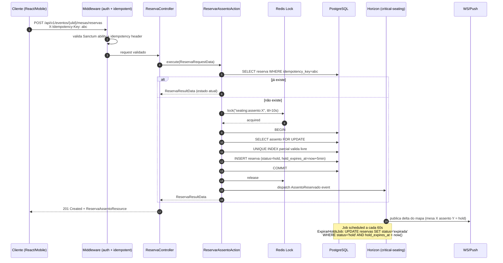

# Planejamento Técnico Executável — Backend API v1

> **Versão:** 1.0.0
> **Data:** 2026-04-17
> **Status:** Proposta técnica pronta para aprovação e início de F1
> **Base:** `PRD_v4.md`, `ARQUITETURA_DETALHADA.md`, `REGRAS_NEGOCIO.md`, `SEGURANCA.md`, `PERFORMANCE.md`, `ROADMAP.md`
> **Audiência:** Engenharia Laravel, arquitetura, QA, SRE
> **Objetivo:** Documento único, executável, que descreve ESTRUTURA, CÓDIGO DE REFERÊNCIA, DADOS, CONCORRÊNCIA, SEGURANÇA, TESTES e CRONOGRAMA suficientes para iniciar F1 sem ambiguidade.

---

## Sumário

- [0. Princípios não negociáveis](#0-princípios-não-negociáveis)
- [1. Estrutura de diretórios e namespaces](#1-estrutura-de-diretórios-e-namespaces)
- [2. Camada HTTP — API v1](#2-camada-http--api-v1)
- [3. Actions e DTOs](#3-actions-e-dtos)
- [4. Modelo de dados e migrations](#4-modelo-de-dados-e-migrations)
- [5. Concorrência e transações](#5-concorrência-e-transações)
- [6. Autenticação e autorização](#6-autenticação-e-autorização)
- [7. Filas e Horizon](#7-filas-e-horizon)
- [8. Integrações externas](#8-integrações-externas)
- [9. Cache e performance](#9-cache-e-performance)
- [10. Estratégia de testes](#10-estratégia-de-testes)
- [11. Segurança (checklist executável)](#11-segurança-checklist-executável)
- [12. Observabilidade](#12-observabilidade)
- [13. Snapshots e governança de dados](#13-snapshots-e-governança-de-dados)
- [14. Cronograma de implementação](#14-cronograma-de-implementação)
- [15. SPEC-010 — Adesão pública via código do contrato](#15-spec-010--adesão-pública-via-código-do-contrato)
- [Apêndice A — Checklist pré-F1](#apêndice-a--checklist-pré-f1)
- [Apêndice B — Perguntas pendentes a produto](#apêndice-b--perguntas-pendentes-a-produto)
- [Apêndice C — Diagrama ER textual](#apêndice-c--diagrama-er-textual)
- [Apêndice D — Anti-patterns proibidos](#apêndice-d--anti-patterns-proibidos)

---

## 0. Princípios não negociáveis

1. **Monólito modular Laravel 13.** Sem microservices no horizonte MVP.
2. **API-first obrigatória.** `api/v1` é a interface oficial para React web e React Native. Admin interno em Blade/Livewire compartilha **actions e domínio**, nunca controllers.
3. **Core independente da camada HTTP.** Toda regra vive em `Actions/`, `Services/`, `Data/`, `Enums/` e `Models/`. Controllers são finos, validação mora em `FormRequest`.
4. **Idempotência obrigatória** em pagamentos, reservas e webhooks.
5. **Concorrência é first-class concern** em seating e pagamentos: unique parcial no banco + Redis lock + idempotency key + transação curta.
6. **Snapshots imutáveis** em adesão concluída, pagamento, convite emitido, reserva confirmada, voto, pedido extra pago.
7. **`declare(strict_types=1)` obrigatório** em 100% dos arquivos PHP. Type hints e return types em todos os métodos.
8. **ULID público, BIGINT interno.** IDs sequenciais nunca aparecem em URL, token ou resposta da API.
9. **Auditoria append-only** via `spatie/laravel-activitylog`. Nunca `DELETE` em `activity_log`.
10. **Nenhum dado de cartão armazenado.** Apenas tokens do provedor.

---

## 1. Estrutura de diretórios e namespaces

### 1.1 Árvore completa proposta (`app/`)

```text
app/
├── Actions/
│   ├── Adesao/
│   │   ├── CriarAdesaoAction.php
│   │   ├── ConfirmarAdesaoAction.php
│   │   ├── CancelarAdesaoAction.php
│   │   └── GerarParcelasAction.php
│   ├── Convites/
│   │   ├── EmitirConviteAction.php
│   │   ├── ReemitirConviteAction.php
│   │   ├── TransferirConviteAction.php
│   │   ├── CancelarConviteAction.php
│   │   └── EmitirLoteConvitesAction.php
│   ├── Rsvp/
│   │   ├── RegistrarRsvpAction.php
│   │   └── AlterarRsvpAction.php
│   ├── Seating/
│   │   ├── ReservarAssentoAction.php
│   │   ├── ConfirmarAssentoAction.php
│   │   ├── LiberarAssentoAction.php
│   │   ├── ExpirarHoldAssentoAction.php
│   │   └── TrocarAssentoAction.php
│   ├── Extras/
│   │   ├── CriarPedidoExtraAction.php
│   │   ├── AprovarPedidoExtraAction.php
│   │   ├── ConfirmarPagamentoExtraAction.php
│   │   └── EstornarPedidoExtraAction.php
│   ├── Pagamentos/
│   │   ├── IniciarPagamentoAction.php
│   │   └── ProcessarWebhookPagamentoAction.php
│   ├── Enquetes/
│   │   ├── PublicarEnqueteAction.php
│   │   ├── EncerrarEnqueteAction.php
│   │   └── RegistrarVotoAction.php
│   └── Eventos/
│       ├── PublicarEventoAction.php
│       └── AtualizarJanelasEventoAction.php
├── Data/
│   ├── Adesao/
│   │   ├── NovaAdesaoData.php
│   │   └── AdesaoResultData.php
│   ├── Convites/
│   │   ├── NovoConviteData.php
│   │   └── ConviteResultData.php
│   ├── Seating/
│   │   ├── ReservaRequestData.php
│   │   └── ReservaResultData.php
│   ├── Extras/
│   │   ├── PedidoExtraData.php
│   │   └── PedidoExtraResultData.php
│   ├── Pagamentos/
│   │   ├── PagamentoIntentData.php
│   │   └── WebhookPayloadData.php
│   └── Api/
│       └── PaginatedResponseData.php
├── Enums/
│   ├── Adesao/StatusAdesao.php
│   ├── Convites/{StatusConvite,TipoConvite}.php
│   ├── Rsvp/StatusRsvp.php
│   ├── Seating/StatusReserva.php
│   ├── Extras/StatusPedidoExtra.php
│   ├── Pagamentos/StatusPagamento.php
│   ├── Enquetes/{TipoEnquete,StatusEnquete}.php
│   └── Shared/{PerfilAtor,OrigemAtor}.php
├── Events/
│   ├── Adesao/{AdesaoConfirmada,AdesaoCancelada}.php
│   ├── Convites/{ConviteEmitido,ConviteCancelado,ConviteTransferido}.php
│   ├── Rsvp/RsvpRegistrado.php
│   ├── Seating/{AssentoReservado,AssentoConfirmado,AssentoLiberado,HoldExpirado}.php
│   ├── Extras/{PedidoExtraPago,PedidoExtraEstornado}.php
│   ├── Pagamentos/{PagamentoConfirmado,PagamentoFalhou}.php
│   ├── Cadastro/EventoAtualizado.php
│   ├── Acesso/PermissaoAlterada.php
│   └── Enquetes/{EnqueteAberta,EnqueteEncerrada,VotoRegistrado}.php
├── Exceptions/
│   ├── Domain/{DomainException,InvariantViolationException}.php
│   ├── Seating/{AssentoIndisponivelException,HoldExpiradoException}.php
│   ├── Cota/CotaEsgotadaException.php
│   └── Pagamento/WebhookInvalidoException.php
├── Http/
│   ├── Api/
│   │   └── V1/
│   │       ├── Controllers/
│   │       │   ├── Auth/{LoginController,LogoutController,MeController}.php
│   │       │   ├── Convite/{ConviteController,LoteConviteController,AcessoConviteController}.php
│   │       │   ├── Rsvp/RsvpController.php
│   │       │   ├── Seating/{MapaController,ReservaController}.php
│   │       │   ├── Extras/{CatalogoExtrasController,PedidoExtraController}.php
│   │       │   ├── Pagamentos/PagamentoController.php
│   │       │   ├── Enquetes/{EnqueteController,VotoController}.php
│   │       │   └── Eventos/{EventoPublicoController,FormandoMeController}.php
│   │       ├── Requests/
│   │       │   └── <espelho de Controllers>/*.php
│   │       └── Resources/
│   │           └── <espelho de Controllers>/*.php
│   ├── Webhook/
│   │   └── Controllers/PagamentoWebhookController.php
│   ├── Web/
│   │   ├── Admin/Controllers/
│   │   │   ├── Auth/LoginController.php
│   │   │   ├── DashboardController.php
│   │   │   ├── Cadastros/{OrganizacaoController,InstituicaoController,CursoController,TurmaController,EventoController}.php
│   │   │   ├── Comercial/{PacoteController,ProdutoController,AdesaoController,ParcelaController}.php
│   │   │   ├── Convites/{CotaController,LoteConviteController,ConviteController}.php
│   │   │   ├── Seating/{MapaMesaController,MesaController}.php
│   │   │   ├── Extras/{ProdutoExtraController,PedidoExtraController}.php
│   │   │   ├── Enquetes/EnqueteController.php
│   │   │   └── Relatorios/RelatorioController.php
│   │   └── Shared/Controllers/HealthController.php
│   └── Middleware/
│       ├── AdminAuthenticate.php
│       ├── EnsureSanctumAbility.php
│       ├── ResolveConviteToken.php
│       ├── AttachRequestId.php
│       ├── IdempotencyKeyGuard.php
│       └── RateLimitByActor.php
├── Jobs/
│   ├── Notifications/{EnviarConviteEmailJob,NotificarPushJob,EnviarReminderRsvpJob}.php
│   ├── Webhooks/ProcessarWebhookPagamentoJob.php
│   ├── Exports/{GerarRelatorioExcelJob,GerarExtratoFinanceiroJob}.php
│   ├── Pdf/GerarComprovantePagamentoJob.php
│   ├── Seating/{ExpirarHoldsJob,PublicarAtualizacaoMapaJob}.php
│   └── Bulk/EmitirLoteConvitesJob.php
├── Listeners/
│   ├── Adesao/EmitirCotaConvitesAoConfirmarAdesao.php
│   ├── Convites/EnviarEmailConviteAoEmitir.php
│   ├── Pagamentos/LiberarEfeitosAoConfirmarPagamento.php
│   ├── Seating/InvalidarCacheMapaAoReservar.php
│   └── Enquetes/NotificarAbertura.php
├── Models/
│   ├── Acesso/{AdminUser,ComissaoUser,PortalUser,ConvidadoAccessToken}.php
│   ├── Cadastro/{Organizacao,Instituicao,Curso,Turma,Evento,TurmaEvento}.php
│   ├── Comercial/{Pacote,Produto,Adesao,AdesaoProduto,Parcela,Pagamento}.php
│   ├── Convites/{LoteConvite,Convite,RsvpHistorico,CotaRegra}.php
│   ├── Seating/{MapaMesa,Setor,Mesa,Assento,ReservaAssento,ReservaHistorico}.php
│   ├── Extras/{ProdutoExtra,PedidoExtra,PedidoExtraItem}.php
│   ├── Enquetes/{Enquete,OpcaoEnquete,Voto}.php
│   ├── Comunicacao/{TemplateNotificacao,Notificacao,NotificacaoEntrega}.php
│   └── Webhook/WebhookEvento.php
├── Observers/
│   ├── ConviteObserver.php
│   ├── ReservaAssentoObserver.php
│   ├── PagamentoObserver.php
│   └── AdesaoObserver.php
├── Policies/
│   ├── EventoPolicy.php
│   ├── AdesaoPolicy.php
│   ├── ConvitePolicy.php
│   ├── MapaMesaPolicy.php
│   ├── ReservaAssentoPolicy.php
│   ├── PedidoExtraPolicy.php
│   ├── EnquetePolicy.php
│   └── RelatorioPolicy.php
├── Providers/
│   ├── AppServiceProvider.php
│   ├── AuthServiceProvider.php           (NOVO)
│   ├── DomainEventServiceProvider.php    (NOVO: lig. Events→Listeners)
│   ├── GatewayServiceProvider.php        (NOVO: bind PaymentGatewayContract)
│   ├── HorizonServiceProvider.php
│   └── RateLimiterServiceProvider.php    (NOVO: limiters nomeados)
├── Services/
│   ├── Gateway/
│   │   ├── Contracts/PaymentGatewayContract.php
│   │   ├── Drivers/{ItauGateway,StubGateway}.php
│   │   ├── Saloon/
│   │   │   ├── Connectors/ItauConnector.php
│   │   │   ├── Requests/{CriarCobrancaRequest,ConsultarCobrancaRequest}.php
│   │   │   └── Responses/CobrancaResponse.php
│   │   └── GatewayManager.php
│   ├── Storage/{PrivateFilesystem,SignedUrlService}.php
│   ├── Messaging/{EmailService,PushService}.php
│   ├── Seating/{HoldService,DisponibilidadeService}.php
│   ├── Cotas/CotaCalculator.php
│   ├── Money/MoneyFormatter.php
│   └── Audit/AuditLogger.php
├── Support/
│   ├── Concerns/{HasUlid,HasSnapshot}.php
│   ├── Ulid.php
│   └── CorrelationContext.php
└── Livewire/
    ├── Admin/<componentes Blade>
    └── Portal/<legado — remoção na F3, substituído por React>
```

### 1.2 Regras de namespace (prevenção de dependências circulares)

- `Actions\<Contexto>` pode depender de: `Data\<Contexto>`, `Data\Shared`, `Models\*`, `Services\*`, `Events\*`, `Enums\*`, `Exceptions\*`.
- `Actions\<Contexto>` **não pode** depender de `Http\*`, `Livewire\*`, `Jobs\*`.
- `Jobs\*` depende **apenas** de `Actions\*` e `Services\*` (orquestração). Nunca de `Http\*`.
- `Http\Api\V1\Controllers\*` e `Http\Web\Admin\Controllers\*` dependem **apenas** de `Actions\*`, `Data\*`, `Http\*\Requests\*`, `Http\*\Resources\*`, `Policies\*`.
- `Listeners\*` orquestra jobs, **não contém regra** — delega a `Actions\*`.
- `Models\*` não importa `Actions\*`. Pode importar `Enums\*`, `Observers\*`.

### 1.3 Pest Architecture Tests (exigidos)

```php
test('actions não acoplam HTTP')
    ->expect('App\Actions')
    ->not->toUse(['Illuminate\Http\Request', 'Illuminate\Http\Response', 'Illuminate\Http\JsonResponse']);

test('strict types em todo PHP')
    ->expect('App')
    ->toUseStrictTypes();

test('controllers api v1 são finos')
    ->expect('App\Http\Api\V1\Controllers')
    ->toOnlyUse([
        'App\Actions',
        'App\Data',
        'App\Http\Api\V1\Requests',
        'App\Http\Api\V1\Resources',
        'App\Policies',
        'App\Enums',
        'Illuminate\Http',
        'Illuminate\Routing',
    ]);

test('models não importam actions')
    ->expect('App\Models')
    ->not->toUse('App\Actions');
```

---

## 2. Camada HTTP — API v1

### 2.1 Registro de rotas em `bootstrap/app.php`

```php
<?php

declare(strict_types=1);

use App\Http\Middleware\AttachRequestId;
use Illuminate\Foundation\Application;
use Illuminate\Foundation\Configuration\Exceptions;
use Illuminate\Foundation\Configuration\Middleware;

return Application::configure(basePath: dirname(__DIR__))
    ->withRouting(
        web: __DIR__ . '/../routes/web.php',
        commands: __DIR__ . '/../routes/console.php',
        health: '/up',
        then: function (): void {
            \Route::middleware('web')->group(base_path('routes/admin.php'));
            \Route::middleware('web')->group(base_path('routes/portal.php'));
            \Route::prefix('api/v1')
                ->middleware('api')
                ->name('api.v1.')
                ->group(base_path('routes/api/v1.php'));
            \Route::prefix('webhooks')
                ->middleware('webhook')
                ->name('webhook.')
                ->group(base_path('routes/webhook.php'));
        },
    )
    ->withMiddleware(function (Middleware $middleware): void {
        // SPA via Sanctum: habilita EnsureFrontendRequestsAreStateful no grupo api.
        // Sem isso, $request->session() no grupo api é nulo e o fluxo SPA quebra.
        $middleware->statefulApi();

        $middleware->alias([
            'admin.auth'        => App\Http\Middleware\AdminAuthenticate::class,
            'convite.token'     => App\Http\Middleware\ResolveConviteToken::class,
            'ability'           => App\Http\Middleware\EnsureSanctumAbility::class,
            'idempotent'        => App\Http\Middleware\IdempotencyKeyGuard::class,
            'throttle.actor'    => App\Http\Middleware\RateLimitByActor::class,
        ]);
        $middleware->appendToGroup('api', [
            AttachRequestId::class,
            'throttle:api',
        ]);
        $middleware->appendToGroup('webhook', [
            AttachRequestId::class,
            // sem CSRF; assinatura HMAC validada no controller
        ]);
    })
    ->withExceptions(function (Exceptions $exceptions): void {
        // handlers em App\Exceptions\Handler (customizados na F1)
    })
    ->create();
```

### 2.2 `routes/api/v1.php` — esqueleto completo

```php
<?php

declare(strict_types=1);

use App\Http\Api\V1\Controllers\Auth\LoginController;
use App\Http\Api\V1\Controllers\Auth\LogoutController;
use App\Http\Api\V1\Controllers\Auth\MeController;
use App\Http\Api\V1\Controllers\Convite\AcessoConviteController;
use App\Http\Api\V1\Controllers\Convite\ConviteController;
use App\Http\Api\V1\Controllers\Convite\LoteConviteController;
use App\Http\Api\V1\Controllers\Enquetes\EnqueteController;
use App\Http\Api\V1\Controllers\Enquetes\VotoController;
use App\Http\Api\V1\Controllers\Eventos\EventoPublicoController;
use App\Http\Api\V1\Controllers\Eventos\FormandoMeController;
use App\Http\Api\V1\Controllers\Extras\CatalogoExtrasController;
use App\Http\Api\V1\Controllers\Extras\PedidoExtraController;
use App\Http\Api\V1\Controllers\Pagamentos\PagamentoController;
use App\Http\Api\V1\Controllers\Rsvp\RsvpController;
use App\Http\Api\V1\Controllers\Seating\MapaController;
use App\Http\Api\V1\Controllers\Seating\ReservaController;
use Illuminate\Support\Facades\Route;

// --- Público / token de convite ---
Route::prefix('convite/{token}')
    ->middleware(['convite.token', 'throttle:convite'])
    ->group(function (): void {
        Route::get('/',      [AcessoConviteController::class, 'show'])->name('convite.show');
        Route::post('rsvp',  [RsvpController::class,         'store'])->name('convite.rsvp.store');
    });

// --- Auth ---
Route::prefix('auth')->group(function (): void {
    Route::post('login',  LoginController::class)->middleware('throttle:login')->name('auth.login');
    Route::post('logout', LogoutController::class)->middleware('auth:sanctum')->name('auth.logout');
});

// --- Autenticado (formando / comissão / admin via sanctum) ---
Route::middleware('auth:sanctum')->group(function (): void {
    Route::get('me', MeController::class)->name('me');

    // Contexto do formando logado
    Route::prefix('me')->name('me.')->group(function (): void {
        Route::get('eventos',       [FormandoMeController::class, 'eventos']);
        Route::get('adesoes',       [FormandoMeController::class, 'adesoes']);
        Route::get('convites',      [FormandoMeController::class, 'convites']);
        Route::get('cotas',         [FormandoMeController::class, 'cotas']);
        Route::get('extrato',       [FormandoMeController::class, 'extrato']);
    });

    // Eventos públicos (somente leitura por formando/comissão com acesso)
    Route::get('eventos/{evento:ulid}', [EventoPublicoController::class, 'show'])->name('eventos.show');

    // Convites — gestão pelo formando
    Route::prefix('eventos/{evento:ulid}/convites')->name('convites.')->group(function (): void {
        Route::get('/',                 [ConviteController::class, 'index']);
        Route::post('/',                [ConviteController::class, 'store'])->middleware('throttle.actor:convite');
        Route::patch('{convite:ulid}',  [ConviteController::class, 'update']);
        Route::delete('{convite:ulid}', [ConviteController::class, 'destroy']);

        // Bulk emission — async (202 + status_url). Job: EmitirLoteConvitesJob (§7.3).
        Route::post('lotes',                [LoteConviteController::class, 'store'])
            ->middleware('idempotent')
            ->name('lotes.store');
        Route::get('lotes/{lote:ulid}',     [LoteConviteController::class, 'show'])
            ->name('lotes.show');
    });

    // Seating
    Route::prefix('eventos/{evento:ulid}/mesas')->name('seating.')->group(function (): void {
        // GET /mesas/mapa                       → snapshot completo
        // GET /mesas/mapa?since=<iso8601_or_cursor> → apenas reservas com updated_at > since
        // (mesma rota, comportamento via query param — ver §2.14).
        Route::get('mapa',                       [MapaController::class, 'show']);
        Route::post('reservas',                  [ReservaController::class, 'store'])
            ->middleware(['idempotent', 'throttle.actor:seating']);
        Route::post('reservas/{reserva:ulid}/confirmar', [ReservaController::class, 'confirmar']);
        Route::delete('reservas/{reserva:ulid}',         [ReservaController::class, 'destroy']);
        Route::post('reservas/{reserva:ulid}/trocar',    [ReservaController::class, 'trocar'])
            ->middleware('idempotent');
    });

    // Extras
    Route::prefix('eventos/{evento:ulid}/extras')->name('extras.')->group(function (): void {
        Route::get('catalogo',        [CatalogoExtrasController::class, 'index']);
        Route::post('pedidos',        [PedidoExtraController::class, 'store'])->middleware('idempotent');
        Route::get('pedidos/{pedido:ulid}', [PedidoExtraController::class, 'show']);
    });

    // Pagamentos (iniciar intent — confirmação real via webhook)
    Route::prefix('pagamentos')->name('pagamentos.')->group(function (): void {
        Route::post('intents',              [PagamentoController::class, 'store'])->middleware('idempotent');
        Route::get('{pagamento:ulid}',      [PagamentoController::class, 'show']);
    });

    // Enquetes
    Route::prefix('eventos/{evento:ulid}/enquetes')->name('enquetes.')->group(function (): void {
        Route::get('/',                 [EnqueteController::class, 'index']);
        Route::get('{enquete:ulid}',    [EnqueteController::class, 'show']);
        Route::post('{enquete:ulid}/votos', [VotoController::class, 'store'])
            ->middleware('throttle.actor:voto');
    });
});
```

### 2.3 Estratégia de versionamento

- **Prefixo `api/v1`** desde o dia 1. Todo cliente externo consome a versão explícita.
- **Breaking change → `api/v2`.** Cria-se novo diretório `Http\Api\V2\*` reaproveitando as mesmas actions/DTOs; apenas controllers, requests e resources mudam. Actions são fonte única de verdade.
- **Mudança não-breaking → fica em `v1`.** Novos campos são adicionados em Resources via `$this->when()`.
- **Política de deprecação (RFC 8594).** Endpoints deprecados retornam três headers em toda resposta:

    ```
    Deprecation: true
    Sunset: Wed, 31 Dec 2026 23:59:59 GMT
    Link: <https://api.portalartfinal.com.br/api/v2/recurso>; rel="successor-version"
    ```

    - **Notice mínimo:** 90 dias entre primeiro `Deprecation: true` e a data do `Sunset`.
    - **Fonte autoritativa:** `docs/api/CHANGELOG.md` (criado em F1) lista cada endpoint deprecado, motivo, data de sunset e successor.
    - **Após `Sunset`**, a rota retorna `410 Gone` com payload conforme contrato §2.11 e `error: 'EndpointSunset'`.

### 2.4 Form Request (exemplo real)

```php
<?php

declare(strict_types=1);

namespace App\Http\Api\V1\Requests\Seating;

use App\Enums\Seating\OrigemReserva;
use Illuminate\Foundation\Http\FormRequest;
use Illuminate\Validation\Rule;

final class ReservarAssentoRequest extends FormRequest
{
    public function authorize(): bool
    {
        return $this->user()?->can('reservar', $this->route('evento')) ?? false;
    }

    /** @return array<string, mixed> */
    public function rules(): array
    {
        return [
            'assento_ulid'    => ['required', 'string', 'size:26'],
            'convite_ulid'    => ['nullable', 'string', 'size:26'],
            'origem'          => ['required', Rule::enum(OrigemReserva::class)],
            'observacao'      => ['nullable', 'string', 'max:500'],
        ];
    }

    public function messages(): array
    {
        return [
            'assento_ulid.size' => 'Identificador de assento inválido.',
        ];
    }
}
```

### 2.5 Resource com campos condicionais

```php
<?php

declare(strict_types=1);

namespace App\Http\Api\V1\Resources\Seating;

use App\Models\Seating\ReservaAssento;
use Illuminate\Http\Request;
use Illuminate\Http\Resources\Json\JsonResource;

/** @mixin ReservaAssento */
final class ReservaAssentoResource extends JsonResource
{
    /** @return array<string, mixed> */
    public function toArray(Request $request): array
    {
        return [
            'id'              => $this->ulid,
            'status'          => $this->status->value,
            'mesa'            => [
                'id'     => $this->mesa->ulid,
                'numero' => $this->mesa->numero,
            ],
            'assento'         => [
                'id'     => $this->assento->ulid,
                'numero' => $this->assento->numero,
            ],
            'hold_expires_at' => $this->whenNotNull($this->hold_expires_at?->toIso8601String()),
            'confirmado_at'   => $this->whenNotNull($this->confirmado_at?->toIso8601String()),
            'idempotency_key' => $this->when(
                $request->user()?->can('debug', $this->resource) === true,
                $this->idempotency_key,
            ),
            'links'           => [
                'self'      => route('api.v1.seating.show', [$this->evento, $this]),
                'confirmar' => $this->status->isHold()
                    ? route('api.v1.seating.confirmar', [$this->evento, $this])
                    : null,
            ],
        ];
    }
}
```

**Regra de HATEOAS (decisão all-in, minimalista):**

1. **Toda Resource** retorna chave `links` com no mínimo `{ "self": "<url>" }`.
2. **Resources de state-machine** (`Reserva`, `PedidoExtra`, `Adesao`, `Convite`) também retornam ações **condicionais** baseadas no estado atual: `confirmar`, `cancelar`, `pagar`, `transferir`, `estornar`. Ação não disponível → `null` (não omitir a chave).
3. **Resources de leitura pura** (catálogos, lookups) só `self`.
4. **Coleções** (`*Resource::collection(...)`) usam `meta.links` de paginação (§2.6), não duplicam `links` por item além do `self`.

### 2.6 Paginação

**Envelope canônico** — toda listagem retorna o mesmo shape, sem exceção:

```json
{
    "data": [{ "id": "01J5K...", "...": "..." }],
    "meta": {
        "per_page": 50,
        "next_cursor": "eyJpZCI6MTIzfQ",
        "prev_cursor": null
    },
    "links": {
        "self": "https://api.portalartfinal.com.br/api/v1/eventos/01J.../convites?page%5Bcursor%5D=...",
        "next": "https://api.portalartfinal.com.br/api/v1/eventos/01J.../convites?page%5Bcursor%5D=eyJpZCI6MTIzfQ",
        "prev": null
    }
}
```

**Cursor-based** em listagens grandes e mutáveis (convites, reservas, votos, pagamentos, notificações):

```php
$convites = QueryBuilder::for(Convite::class)              // ver §2.14
    ->forEvento($evento)
    ->allowedFilters(['status', AllowedFilter::partial('search', 'convidado_nome')])
    ->allowedSorts(['created_at', 'codigo'])
    ->defaultSort('-created_at')
    ->cursorPaginate($request->integer('page.size', 50));

return ConviteResource::collection($convites)->additional([
    'meta' => ['per_page' => $convites->perPage()],
]);
```

**Length-aware offset** apenas em tabelas pequenas e estáveis (catálogo de produtos, enquetes do evento, setores do mapa). O envelope acima continua valendo, com `meta.total`, `meta.current_page`, `meta.last_page` adicionais.

### 2.7 IDs públicos

- `ulid CHAR(26)` único em todos os modelos expostos externamente.
- Binding em rota via `{convite:ulid}` → resolve pelo campo `ulid`, não por `id`.
- Trait `App\Support\Concerns\HasUlid` atribui na criação:

    ```php
    <?php
    declare(strict_types=1);
    namespace App\Support\Concerns;

    use App\Support\Ulid;

    trait HasUlid
    {
        protected static function bootHasUlid(): void
        {
            static::creating(function ($model): void {
                if (empty($model->ulid)) {
                    $model->ulid = Ulid::generate();
                }
            });
        }

        public function getRouteKeyName(): string
        {
            return 'ulid';
        }
    }
    ```

### 2.8 Headers obrigatórios

| Header              | Direção | Papel                                                                |
| ------------------- | ------- | -------------------------------------------------------------------- |
| `X-Request-Id`      | req/res | Gerado pelo middleware `AttachRequestId` se ausente. Injeta em logs. |
| `X-Correlation-Id`  | req/res | Propagado entre webhooks e jobs.                                     |
| `X-Idempotency-Key` | req     | Obrigatório em `POST` de reservas, pedidos extras e pagamentos.      |
| `X-API-Deprecation` | res     | Presente só em endpoints deprecados.                                 |

### 2.9 Middleware `IdempotencyKeyGuard`

Exige `X-Idempotency-Key` em POSTs sensíveis e rejeita colisão com payload diferente dentro de 24h:

```php
<?php

declare(strict_types=1);

namespace App\Http\Middleware;

use Closure;
use Illuminate\Http\Request;
use Illuminate\Support\Facades\Cache;
use Symfony\Component\HttpFoundation\Response;

final class IdempotencyKeyGuard
{
    public function handle(Request $request, Closure $next): Response
    {
        $key = trim((string) $request->header('X-Idempotency-Key'));
        if ($key === '' || strlen($key) > 80) {
            return response()->json(['error' => 'X-Idempotency-Key obrigatório'], 400);
        }

        $routeName = $request->route()?->getName() ?? $request->path();
        $cacheKey = "idem:{$request->user()?->getAuthIdentifier()}:{$routeName}:{$key}";
        $fingerprint = hash('sha256', $request->method() . '|' . $routeName . '|' . $request->getContent());

        $existing = Cache::get($cacheKey);
        if ($existing !== null && $existing !== $fingerprint) {
            return response()->json(['error' => 'idempotency_key reutilizada com payload diferente'], 409);
        }
        Cache::put($cacheKey, $fingerprint, now()->addDay());

        return $next($request);
    }
}
```

Actions ainda mantêm seu próprio `firstOrCreate` por `idempotency_key` no banco — o middleware é defesa em camadas, não substituto.

> **Detalhe:** `$cacheKey` inclui `route()->getName()`. Sem isso, a mesma `X-Idempotency-Key` usada contra `reservas.store` e `pedidos.store` colide e o middleware responde 409 falso.

### 2.10 Rate limiting por contexto

`app/Providers/RateLimiterServiceProvider.php`:

```php
<?php

declare(strict_types=1);

namespace App\Providers;

use Illuminate\Cache\RateLimiting\Limit;
use Illuminate\Http\Request;
use Illuminate\Support\Facades\RateLimiter;
use Illuminate\Support\ServiceProvider;

final class RateLimiterServiceProvider extends ServiceProvider
{
    public function boot(): void
    {
        RateLimiter::for('api', fn (Request $r): Limit => Limit::perMinute(120)->by(
            $r->user()?->id ?? $r->ip(),
        ));

        RateLimiter::for('login', fn (Request $r): Limit => Limit::perMinute(5)
            ->by($r->input('email') . '|' . $r->ip()));

        RateLimiter::for('convite', fn (Request $r): Limit => Limit::perMinute(10)->by($r->ip()));

        RateLimiter::for('seating', fn (Request $r): Limit => Limit::perMinute(5)
            ->by((string) ($r->user()?->id ?? $r->ip())));

        RateLimiter::for('voto', fn (Request $r): Limit => Limit::perMinute(3)
            ->by((string) ($r->user()?->id ?? $r->ip())));

        RateLimiter::for('webhook', fn (Request $r): Limit => Limit::perMinute(600)->by($r->ip()));
    }
}
```

### 2.11 Contrato de erro padrão

Toda resposta de erro da API segue um envelope único. Sem isso, cliente React/RN trata N formatos.

**Schema:**

```json
{
    "error": "ValidationError",
    "message": "Dados de entrada inválidos.",
    "details": {
        "fields": {
            "email": ["O campo email é obrigatório."]
        }
    },
    "request_id": "01J5K2N7QMHV1FJZ8H0PR3RV9C",
    "timestamp": "2026-04-17T14:32:11Z"
}
```

**Mapeamento `Throwable → HTTP code`:**

| Exceção                                                               | Código | `error`               |
| --------------------------------------------------------------------- | ------ | --------------------- |
| `Illuminate\Auth\AuthenticationException`                             | 401    | `Unauthenticated`     |
| `Illuminate\Auth\Access\AuthorizationException`                       | 403    | `Forbidden`           |
| `Illuminate\Validation\ValidationException`                           | 422    | `ValidationError`     |
| `Illuminate\Database\Eloquent\ModelNotFoundException`                 | 404    | `NotFound`            |
| `Symfony\Component\HttpKernel\Exception\NotFoundHttpException`        | 404    | `NotFound`            |
| `Symfony\Component\HttpKernel\Exception\TooManyRequestsHttpException` | 429    | `RateLimitExceeded`   |
| `App\Exceptions\Domain\InvariantViolationException`                   | 409    | `InvariantViolation`  |
| `App\Exceptions\Seating\AssentoIndisponivelException`                 | 409    | `AssentoIndisponivel` |
| `App\Exceptions\Seating\HoldExpiradoException`                        | 410    | `HoldExpirado`        |
| `App\Exceptions\Cota\CotaEsgotadaException`                           | 409    | `CotaEsgotada`        |
| `App\Exceptions\Pagamento\WebhookInvalidoException`                   | 400    | `WebhookInvalido`     |
| Não tratada (`Throwable`)                                             | 500    | `InternalServerError` |

**Implementação no `bootstrap/app.php` (`->withExceptions(...)`):**

```php
use Illuminate\Auth\AuthenticationException;
use Illuminate\Auth\Access\AuthorizationException;
use Illuminate\Database\Eloquent\ModelNotFoundException;
use Illuminate\Http\Request;
use Illuminate\Validation\ValidationException;
use Symfony\Component\HttpKernel\Exception\NotFoundHttpException;
use Symfony\Component\HttpKernel\Exception\TooManyRequestsHttpException;

->withExceptions(function (\Illuminate\Foundation\Configuration\Exceptions $exceptions): void {
    $exceptions->render(function (\Throwable $e, Request $request) {
        if (! $request->is('api/*', 'webhooks/*')) {
            return null; // mantém comportamento padrão para web/admin
        }

        [$code, $errorKey] = match (true) {
            $e instanceof AuthenticationException                              => [401, 'Unauthenticated'],
            $e instanceof AuthorizationException                               => [403, 'Forbidden'],
            $e instanceof ValidationException                                  => [422, 'ValidationError'],
            $e instanceof ModelNotFoundException,
            $e instanceof NotFoundHttpException                                => [404, 'NotFound'],
            $e instanceof TooManyRequestsHttpException                         => [429, 'RateLimitExceeded'],
            $e instanceof \App\Exceptions\Domain\InvariantViolationException   => [409, 'InvariantViolation'],
            $e instanceof \App\Exceptions\Seating\AssentoIndisponivelException => [409, 'AssentoIndisponivel'],
            $e instanceof \App\Exceptions\Seating\HoldExpiradoException        => [410, 'HoldExpirado'],
            $e instanceof \App\Exceptions\Cota\CotaEsgotadaException           => [409, 'CotaEsgotada'],
            $e instanceof \App\Exceptions\Pagamento\WebhookInvalidoException   => [400, 'WebhookInvalido'],
            default                                                            => [500, 'InternalServerError'],
        };

        return response()->json([
            'error'      => $errorKey,
            'message'    => app()->isProduction() && $code === 500
                ? 'Erro interno. Veja request_id nos logs.'
                : $e->getMessage(),
            'details'    => $e instanceof ValidationException ? ['fields' => $e->errors()] : null,
            'request_id' => $request->header('X-Request-Id'),
            'timestamp'  => now()->toIso8601String(),
        ], $code);
    });
});
```

### 2.12 Documentação OpenAPI (Scramble)

**Decisão:** `dedoc/scramble` — gera spec OpenAPI 3.x automaticamente a partir de FormRequests, Resources e route attributes. Zero anotação PHPDoc manual.

**Setup:**

```bash
composer require dedoc/scramble
php artisan vendor:publish --provider="Dedoc\Scramble\ScrambleServiceProvider"
```

`config/scramble.php`:

```php
return [
    'api_path'   => 'api/v1',
    'api_domain' => null,
    'info' => [
        'title'       => 'ArtFinal API',
        'version'     => '1.0.0',
        'description' => 'API pública da Plataforma de Gestão de Formaturas.',
    ],
    'middleware' => ['web', 'auth:admin'], // gate em prod via gate Spatie 'docs.api.view'
    'extensions' => [],
];
```

**Acesso:**

- `GET /docs/api` — UI Stoplight (default Scramble)
- `GET /docs/api.json` — spec OpenAPI 3.x bruta para clients gerados (orval, openapi-typescript)
- Em produção, restrito a admin via gate.

**Alternativa rejeitada:** `darkaonline/l5-swagger` exige anotações `@OA\*` em cada controller — viola o princípio "core independente da camada HTTP" (Apêndice D §1) e cresce em manutenção.

### 2.13 Tabela de status HTTP por padrão de endpoint

Referência única para todos os controllers. Casos não listados → fallback do envelope §2.11.

| Padrão                                        | Sucesso                                   | Erro do cliente                                                   | Erro do servidor |
| --------------------------------------------- | ----------------------------------------- | ----------------------------------------------------------------- | ---------------- |
| `GET /<recurso>` (single)                     | 200                                       | 401 / 403 / 404                                                   | 500              |
| `GET /<recurso>` (list)                       | 200 (lista pode ser vazia)                | 401 / 403 / 422 (filtro inválido)                                 | 500              |
| `POST /<recurso>` (síncrono)                  | 201 + `Location`                          | 400 / 401 / 403 / 409 / 422 / 429                                 | 500              |
| `POST /<recurso>` (assíncrono)                | 202 + `status_url` no body                | 400 / 401 / 403 / 422                                             | 500              |
| `PATCH /<recurso>/{id}`                       | 200 (com body) ou 204                     | 401 / 403 / 404 / 409 / 422                                       | 500              |
| `PUT /<recurso>/{id}` (replace)               | 200 ou 204                                | 401 / 403 / 404 / 422                                             | 500              |
| `DELETE /<recurso>/{id}`                      | 204                                       | 401 / 403 / 404 / 409 (em uso)                                    | 500              |
| `POST /<recurso>/{id}/<acao>` (state-machine) | 200 (com novo estado)                     | 400 (transição inválida) / 401 / 403 / 404 / 409 / 422            | 500              |
| Webhook recebido                              | 202 (aceito) ou 200 (`already_processed`) | 400 (payload) / 401 (assinatura)                                  | 500              |
| Reserva de assento                            | 201 (hold criado)                         | 409 (assento ocupado) / 410 (hold expirou no confirm) / 422 / 429 | 500              |

**Regras gerais:**

1. **204** sempre que a resposta não acrescenta informação.
2. **201** inclui header `Location` apontando para o recurso criado.
3. **202** inclui `status_url` no body para polling de jobs assíncronos (ex.: bulk emission §2.2).
4. **409 vs 422:** 422 é "payload sintaticamente válido mas falha em regra de validação"; 409 é "estado do servidor impede a operação" (assento ocupado, idempotency colisão, duplicado).
5. **410 Gone** apenas para hold expirado e endpoint após `Sunset` (§2.3).

### 2.14 Convenção de filter, sort e page (JSON:API style)

Padrão único de query string em **toda** listagem:

```
GET /api/v1/eventos/{evento}/convites
    ?filter[status]=emitido,confirmado
    &filter[search]=maria
    &sort=-created_at,codigo
    &page[size]=50
    &page[cursor]=eyJpZCI6MTIzfQ
```

**Regras:**

- `filter[<campo>]=<valor>` — múltiplos valores separados por `,` (semântica OR no campo). Múltiplos `filter[*]` combinam em AND entre campos.
- `sort=<campo>` — ascendente; prefixo `-` para descendente; múltiplos separados por `,`.
- `page[size]` — máx 100, default 50. `page[cursor]` para cursor-based (default em listagens grandes).
- Campos permitidos por endpoint definidos no FormRequest correspondente (`AllowedFilter`, `allowedSorts`).
- Filtro/sort em campo não permitido → **422** com `error: 'ValidationError'` e `details.fields[<param>]`.

**Implementação recomendada:** `spatie/laravel-query-builder` (instalar em F1).

```php
use Spatie\QueryBuilder\AllowedFilter;
use Spatie\QueryBuilder\QueryBuilder;

$convites = QueryBuilder::for(Convite::class)
    ->forEvento($evento)
    ->allowedFilters([
        AllowedFilter::exact('status'),
        AllowedFilter::partial('search', 'convidado_nome'),
    ])
    ->allowedSorts(['created_at', 'codigo', 'status'])
    ->defaultSort('-created_at')
    ->cursorPaginate($request->integer('page.size', 50));

return ConviteResource::collection($convites);
```

### 2.15 ADR — Verbos em URL para state-machine transitions

**Decisão:** endpoints `POST /reservas/{id}/confirmar`, `/trocar`, `/cancelar`, `/aprovar`, `/estornar` ficam **autorizados** quando representam transição de estado em uma máquina de estados explícita.

**Justificativa:**

- Stripe (`/cancel`, `/capture`, `/refund`), GitHub (`/merge`, `/dismiss`), Atlassian seguem este padrão há anos.
- Alternativa `PATCH /reservas/{id}` com `{status: 'confirmada'}` permite ao cliente setar qualquer estado, fragilizando regra do servidor.
- Sub-recursos plurais (`POST /reservas/{id}/confirmations`) ficam estranhos em PT-BR e não acrescentam valor.

**Trade-off aceito:** viola o princípio "REST puro = só substantivos". Ganho em clareza e segurança de máquina de estados compensa.

**Restrição:** CRUD (criar, atualizar campos, deletar) **continua sem verbo na URL** — usar HTTP method semantics (POST/PATCH/DELETE no recurso).

**Lista das ações verbo-permitidas no MVP (atualizar quando novas surgirem):**

| Recurso          | Ações                                                                      |
| ---------------- | -------------------------------------------------------------------------- |
| `reservas`       | `confirmar`, `trocar`, `cancelar`                                          |
| `pedidos-extras` | `aprovar`, `cancelar`, `estornar`                                          |
| `adesoes`        | `confirmar`, `cancelar`                                                    |
| `convites`       | `reemitir`, `transferir`, `cancelar`                                       |
| `enquetes`       | `publicar`, `encerrar`                                                     |
| `pagamentos`     | `consultar` (idempotente, GET-like via POST p/ requerer `idempotency_key`) |

Qualquer ação fora desta tabela exige nota no PR + atualização da §2.15 antes do merge.

---

## 3. Actions e DTOs

### 3.1 Princípio

> Uma action = uma operação de domínio. Recebe DTO. Retorna DTO ou `void`. Emite Event. Nunca conhece HTTP.

### 3.2 Actions obrigatórias por contexto

| Contexto       | Actions                                                                                                                        |
| -------------- | ------------------------------------------------------------------------------------------------------------------------------ |
| **Adesão**     | `CriarAdesaoAction`, `ConfirmarAdesaoAction`, `CancelarAdesaoAction`, `GerarParcelasAction`                                    |
| **Convites**   | `EmitirConviteAction`, `ReemitirConviteAction`, `TransferirConviteAction`, `CancelarConviteAction`, `EmitirLoteConvitesAction` |
| **RSVP**       | `RegistrarRsvpAction`, `AlterarRsvpAction`                                                                                     |
| **Seating**    | `ReservarAssentoAction`, `ConfirmarAssentoAction`, `LiberarAssentoAction`, `ExpirarHoldAssentoAction`, `TrocarAssentoAction`   |
| **Extras**     | `CriarPedidoExtraAction`, `AprovarPedidoExtraAction`, `ConfirmarPagamentoExtraAction`, `EstornarPedidoExtraAction`             |
| **Pagamentos** | `IniciarPagamentoAction`, `ProcessarWebhookPagamentoAction`                                                                    |
| **Enquetes**   | `PublicarEnqueteAction`, `EncerrarEnqueteAction`, `RegistrarVotoAction`                                                        |
| **Eventos**    | `PublicarEventoAction`, `AtualizarJanelasEventoAction`                                                                         |

### 3.3 DTO com Spatie Laravel Data

```php
<?php

declare(strict_types=1);

namespace App\Data\Seating;

use App\Enums\Seating\OrigemReserva;
use Spatie\LaravelData\Data;

final class ReservaRequestData extends Data
{
    public function __construct(
        public readonly string $assentoUlid,
        public readonly ?string $conviteUlid,
        public readonly OrigemReserva $origem,
        public readonly string $idempotencyKey,
        public readonly int $atorId,
        public readonly string $atorTipo,
        public readonly ?string $observacao = null,
    ) {
    }
}
```

```php
<?php

declare(strict_types=1);

namespace App\Data\Seating;

use App\Enums\Seating\StatusReserva;
use Spatie\LaravelData\Data;

final class ReservaResultData extends Data
{
    public function __construct(
        public readonly string $reservaUlid,
        public readonly StatusReserva $status,
        public readonly string $mesaUlid,
        public readonly string $assentoUlid,
        public readonly ?string $holdExpiresAt,
        public readonly ?string $confirmadoAt,
    ) {
    }
}
```

### 3.4 Enum com label e cor

```php
<?php

declare(strict_types=1);

namespace App\Enums\Seating;

enum StatusReserva: string
{
    case Hold       = 'hold';
    case Confirmada = 'confirmada';
    case Cancelada  = 'cancelada';
    case Expirada   = 'expirada';
    case Bloqueada  = 'bloqueada';

    public function label(): string
    {
        return match ($this) {
            self::Hold       => 'Em espera',
            self::Confirmada => 'Confirmada',
            self::Cancelada  => 'Cancelada',
            self::Expirada   => 'Expirada',
            self::Bloqueada  => 'Bloqueada',
        };
    }

    public function color(): string
    {
        return match ($this) {
            self::Hold       => 'amber',
            self::Confirmada => 'emerald',
            self::Cancelada  => 'slate',
            self::Expirada   => 'orange',
            self::Bloqueada  => 'rose',
        };
    }

    public function isAtiva(): bool
    {
        return in_array($this, [self::Hold, self::Confirmada], strict: true);
    }

    public function isHold(): bool
    {
        return $this === self::Hold;
    }
}
```

**Obrigatório no Model correspondente** — sem `$casts` o enum não é hidratado e comparações com `->where('status', StatusReserva::Hold)` falham:

```php
// App\Models\Seating\ReservaAssento
use App\Enums\Seating\StatusReserva;
use App\Enums\Seating\OrigemReserva;

/** @var array<string, string> */
protected $casts = [
    'status'          => StatusReserva::class,
    'origem'          => OrigemReserva::class,
    'hold_expires_at' => 'datetime',
    'confirmado_at'   => 'datetime',
    'cancelado_at'    => 'datetime',
];
```

Mesmo padrão obrigatório para `Adesao::$casts['status' => StatusAdesao::class]`, `Convite::$casts['status' => StatusConvite::class]`, `Pagamento::$casts['status' => StatusPagamento::class]`, etc.

### 3.5 Action de referência — `ReservarAssentoAction`

Esta é a action **mais crítica** do sistema.

```php
<?php

declare(strict_types=1);

namespace App\Actions\Seating;

use App\Data\Seating\ReservaRequestData;
use App\Data\Seating\ReservaResultData;
use App\Enums\Seating\StatusReserva;
use App\Events\Seating\AssentoReservado;
use App\Exceptions\Seating\AssentoIndisponivelException;
use App\Models\Seating\Assento;
use App\Models\Seating\ReservaAssento;
use App\Services\Seating\DisponibilidadeService;
use App\Support\Ulid;
use Illuminate\Support\Facades\DB;
use Illuminate\Support\Facades\Cache;
use Illuminate\Support\Facades\Log;

final readonly class ReservarAssentoAction
{
    public const int HOLD_TTL_SECONDS = 300;

    public function __construct(
        private DisponibilidadeService $disponibilidade,
    ) {
    }

    /**
     * @throws AssentoIndisponivelException
     */
    public function execute(ReservaRequestData $data): ReservaResultData
    {
        // 1) Idempotência: se a mesma key já existe, devolve o estado atual.
        if ($existente = ReservaAssento::query()
            ->where('idempotency_key', $data->idempotencyKey)
            ->first()) {
            return $this->toResult($existente);
        }

        // 2) Lock curto por assento (Redis), com dead-lock timeout.
        $lock = Cache::lock("seating:assento:{$data->assentoUlid}", 10);

        return $lock->block(3, function () use ($data): ReservaResultData {
            return DB::transaction(function () use ($data): ReservaResultData {
                $assento = Assento::query()
                    ->where('ulid', $data->assentoUlid)
                    ->lockForUpdate()
                    ->firstOrFail();

                if (! $this->disponibilidade->estaLivre($assento)) {
                    Log::info('seating.reserva.indisponivel', [
                        'assento_ulid'    => $data->assentoUlid,
                        'idempotency_key' => $data->idempotencyKey,
                    ]);
                    throw new AssentoIndisponivelException($assento->ulid);
                }

                $reserva = ReservaAssento::create([
                    'ulid'             => Ulid::generate(),
                    'evento_id'        => $assento->mesa->evento_id,
                    'mesa_id'          => $assento->mesa_id,
                    'assento_id'       => $assento->id,
                    'convite_id'       => $this->resolveConviteId($data->conviteUlid),
                    'formando_id'      => $data->atorTipo === 'formando' ? $data->atorId : null,
                    'status'           => StatusReserva::Hold,
                    'origem'           => $data->origem,
                    'idempotency_key'  => $data->idempotencyKey,
                    'hold_expires_at'  => now()->addSeconds(self::HOLD_TTL_SECONDS),
                ]);

                AssentoReservado::dispatch($reserva->id);

                return $this->toResult($reserva);
            });
        });
    }

    private function resolveConviteId(?string $conviteUlid): ?int
    {
        if ($conviteUlid === null) {
            return null;
        }
        return \App\Models\Convites\Convite::query()
            ->where('ulid', $conviteUlid)
            ->value('id');
    }

    private function toResult(ReservaAssento $r): ReservaResultData
    {
        return new ReservaResultData(
            reservaUlid:   $r->ulid,
            status:        $r->status,
            mesaUlid:      $r->mesa->ulid,
            assentoUlid:   $r->assento->ulid,
            holdExpiresAt: $r->hold_expires_at?->toIso8601String(),
            confirmadoAt:  $r->confirmado_at?->toIso8601String(),
        );
    }
}
```

### 3.6 Controller fino consumindo a action

```php
<?php

declare(strict_types=1);

namespace App\Http\Api\V1\Controllers\Seating;

use App\Actions\Seating\ReservarAssentoAction;
use App\Data\Seating\ReservaRequestData;
use App\Enums\Seating\OrigemReserva;
use App\Http\Api\V1\Requests\Seating\ReservarAssentoRequest;
use App\Http\Api\V1\Resources\Seating\ReservaAssentoResource;
use App\Models\Cadastro\Evento;
use App\Models\Seating\ReservaAssento;
use Illuminate\Http\JsonResponse;

final class ReservaController
{
    public function store(
        Evento $evento,
        ReservarAssentoRequest $request,
        ReservarAssentoAction $action,
    ): JsonResponse {
        $user = $request->user();

        $result = $action->execute(new ReservaRequestData(
            assentoUlid:     $request->string('assento_ulid')->value(),
            conviteUlid:     $request->string('convite_ulid')->value() ?: null,
            origem:          OrigemReserva::from($request->string('origem')->value()),
            idempotencyKey:  (string) $request->header('X-Idempotency-Key'),
            atorId:          (int) $user->getAuthIdentifier(),
            // Resolve perfil via role Spatie; 'formando' é o default quando autenticado no portal.
            atorTipo:        $user->hasRole('comissao') ? 'comissao' : 'formando',
            observacao:      $request->string('observacao')->value() ?: null,
        ));

        $reserva = ReservaAssento::query()->where('ulid', $result->reservaUlid)->firstOrFail();

        return ReservaAssentoResource::make($reserva)
            ->response()
            ->setStatusCode(201);
    }
}
```

### 3.7 Contratos entre actions

- `ConfirmarPagamentoExtraAction` chama `EmitirLoteConvitesAction` internamente após marcar o pedido como `pago`. Ambos recebem/retornam DTOs.
- `ProcessarWebhookPagamentoAction` é **orquestrador** idempotente: decide entre `ConfirmarAdesaoAction`, `ConfirmarPagamentoExtraAction` e `EstornarPedidoExtraAction` com base no evento recebido.
- `CancelarConviteAction` dispara `LiberarAssentoAction` quando o convite tem reserva ativa.

---

## 4. Modelo de dados e migrations

### 4.1 Convenções de migration

- Toda tabela tem: `id BIGSERIAL`, `ulid CHAR(26) UNIQUE`, `created_at`, `updated_at`.
- Chaves estrangeiras são `BIGINT` + `ON DELETE RESTRICT` por padrão.
- Enums vivem em PHP (backed). No banco são `VARCHAR` + CHECK constraint ou coluna texto livre com índice.
- Snapshots comerciais ficam em `JSONB` em coluna `snapshot_json`.
- Valores monetários em `INTEGER` (centavos).
- Timezones sempre `TIMESTAMPTZ`.

### 4.2 Migrations por bounded context (ordem de execução)

#### Bloco A — Identidade e Acesso (F1)

1. `extend_admin_users_add_ulid_profile`
2. `create_comissao_users_table`
3. `create_convidado_access_tokens_table`
4. `create_personal_access_tokens_table` (Sanctum)

#### Bloco B — Cadastro (F1/F2)

5. `create_organizacoes_table`
6. `create_instituicoes_table`
7. `create_cursos_table`
8. `create_turmas_table`
9. `create_eventos_table`
10. `create_turma_evento_table`
11. `create_formandos_table`

#### Bloco C — Comercial e Adesão (F2)

12. `create_pacotes_table`
13. `create_produtos_table`
14. `create_adesoes_table`
15. `create_adesao_produtos_table`
16. `create_parcelas_table`
17. `create_pagamentos_table`

#### Bloco D — Convites e RSVP (F4)

18. `create_cotas_regras_table`
19. `create_lotes_convites_table`
20. `create_convites_table`
21. `create_rsvp_historico_table`

#### Bloco E — Seating (F5)

22. `create_mapas_mesas_table`
23. `create_setores_table`
24. `create_mesas_table`
25. `create_assentos_table`
26. `create_reservas_assentos_table`
27. `create_reservas_historico_table`

#### Bloco F — Extras e Pagamentos Operacionais (F6)

28. `create_produtos_extras_table`
29. `create_pedidos_extras_table`
30. `create_pedido_extra_itens_table`
31. `create_webhook_eventos_table`

#### Bloco G — Engajamento (F6)

32. `create_enquetes_table`
33. `create_opcoes_enquete_table`
34. `create_votos_table`

#### Bloco H — Comunicação (F4/F6)

35. `create_templates_notificacao_table`
36. `create_notificacoes_table`
37. `create_notificacao_entregas_table`

### 4.3 Migration exemplar — `reservas_assentos` (com todas as constraints críticas)

```php
<?php

declare(strict_types=1);

use Illuminate\Database\Migrations\Migration;
use Illuminate\Database\Schema\Blueprint;
use Illuminate\Support\Facades\DB;
use Illuminate\Support\Facades\Schema;

return new class extends Migration
{
    public function up(): void
    {
        Schema::create('reservas_assentos', function (Blueprint $table): void {
            $table->bigIncrements('id');
            $table->char('ulid', 26)->unique();

            $table->foreignId('evento_id')->constrained('eventos')->restrictOnDelete();
            $table->foreignId('mesa_id')->constrained('mesas')->restrictOnDelete();
            $table->foreignId('assento_id')->constrained('assentos')->restrictOnDelete();
            $table->foreignId('convite_id')->nullable()->constrained('convites')->nullOnDelete();
            $table->foreignId('formando_id')->nullable()->constrained('formandos')->nullOnDelete();

            $table->string('status', 20);       // hold|confirmada|cancelada|expirada|bloqueada
            $table->string('origem', 20);        // formando|comissao|admin|operacao
            $table->string('idempotency_key', 64);

            $table->timestampTz('hold_expires_at')->nullable();
            $table->timestampTz('confirmado_at')->nullable();
            $table->timestampTz('cancelado_at')->nullable();

            $table->string('cancelado_por_tipo', 30)->nullable();
            $table->unsignedBigInteger('cancelado_por_id')->nullable();
            $table->text('cancelamento_motivo')->nullable();

            $table->timestampsTz();

            $table->index(['evento_id', 'status']);
            $table->index(['mesa_id', 'status']);
            $table->index('hold_expires_at');    // usado pelo job de expiração
            $table->unique('idempotency_key');
        });

        // UNIQUE PARCIAL: apenas UMA reserva ativa (hold ou confirmada) por assento.
        DB::statement(<<<'SQL'
            CREATE UNIQUE INDEX reservas_assentos_ativa_por_assento
            ON reservas_assentos (assento_id)
            WHERE status IN ('hold', 'confirmada')
        SQL);

        // CHECK: hold_expires_at só faz sentido com status hold.
        DB::statement(<<<'SQL'
            ALTER TABLE reservas_assentos
            ADD CONSTRAINT reservas_assentos_hold_consistente
            CHECK (
                (status = 'hold' AND hold_expires_at IS NOT NULL AND confirmado_at IS NULL)
                OR (status = 'confirmada' AND confirmado_at IS NOT NULL)
                OR (status IN ('cancelada','expirada','bloqueada'))
            )
        SQL);

        // CHECK: valores válidos de status (defesa em profundidade além do enum PHP).
        DB::statement(<<<'SQL'
            ALTER TABLE reservas_assentos
            ADD CONSTRAINT reservas_assentos_status_valido
            CHECK (status IN ('hold','confirmada','cancelada','expirada','bloqueada'))
        SQL);
    }

    public function down(): void
    {
        Schema::dropIfExists('reservas_assentos');
    }
};
```

### 4.4 Migration — `convites` (com unique de código e token_hash)

```php
<?php

declare(strict_types=1);

use Illuminate\Database\Migrations\Migration;
use Illuminate\Database\Schema\Blueprint;
use Illuminate\Support\Facades\Schema;

return new class extends Migration
{
    public function up(): void
    {
        Schema::create('convites', function (Blueprint $table): void {
            $table->bigIncrements('id');
            $table->char('ulid', 26)->unique();

            $table->foreignId('evento_id')->constrained('eventos')->restrictOnDelete();
            $table->foreignId('formando_id')->constrained('formandos')->restrictOnDelete();
            $table->foreignId('lote_id')->nullable()->constrained('lotes_convites')->nullOnDelete();
            $table->foreignId('pedido_extra_id')->nullable()->constrained('pedidos_extras')->nullOnDelete();

            $table->string('codigo', 24);            // legível, curto, não enumerável
            $table->string('token_hash', 64);        // sha256(token_bruto)
            $table->string('tipo', 20);              // nominal|transferivel|cortesia|staff|extra
            $table->string('status', 20);            // rascunho|emitido|enviado|visualizado|confirmado|recusado|cancelado|inutilizado
            $table->boolean('is_extra')->default(false);

            $table->string('convidado_nome', 150)->nullable();
            $table->string('convidado_email', 150)->nullable();
            $table->string('convidado_telefone', 30)->nullable();

            $table->timestampTz('entregue_at')->nullable();
            $table->timestampTz('visualizado_at')->nullable();
            $table->timestampTz('confirmado_at')->nullable();
            $table->timestampTz('cancelado_at')->nullable();

            $table->jsonb('snapshot_regra')->nullable(); // cota, política, template no momento da emissão

            $table->timestampsTz();

            $table->unique('codigo');
            $table->unique('token_hash');
            $table->index(['evento_id', 'status']);
            $table->index(['formando_id', 'status']);
        });
    }

    public function down(): void
    {
        Schema::dropIfExists('convites');
    }
};
```

### 4.5 Migration — `webhook_eventos` (idempotência de webhook)

```php
<?php

declare(strict_types=1);

use Illuminate\Database\Migrations\Migration;
use Illuminate\Database\Schema\Blueprint;
use Illuminate\Support\Facades\Schema;

return new class extends Migration
{
    public function up(): void
    {
        Schema::create('webhook_eventos', function (Blueprint $table): void {
            $table->bigIncrements('id');
            $table->string('provider', 30);                     // itau, mock, etc
            $table->string('evento_tipo', 60);                  // pagamento.confirmado, pagamento.estornado
            $table->string('gateway_reference', 120);           // id único do evento no provedor
            $table->jsonb('payload');
            $table->string('assinatura_valida_hash', 128)->nullable();
            $table->string('status', 20)->default('recebido');  // recebido|processado|falhou|descartado
            $table->unsignedInteger('tentativas')->default(0);
            $table->text('ultimo_erro')->nullable();
            $table->timestampTz('recebido_at');
            $table->timestampTz('processado_at')->nullable();
            $table->timestampsTz();

            $table->unique(['provider', 'gateway_reference']);  // idempotência dura
            $table->index(['status', 'recebido_at']);
        });
    }

    public function down(): void
    {
        Schema::dropIfExists('webhook_eventos');
    }
};
```

### 4.6 Migration — `adesoes` (com snapshot comercial)

```php
Schema::create('adesoes', function (Blueprint $table): void {
    $table->bigIncrements('id');
    $table->char('ulid', 26)->unique();

    $table->foreignId('formando_id')->constrained('formandos')->restrictOnDelete();
    $table->foreignId('evento_id')->constrained('eventos')->restrictOnDelete();
    $table->foreignId('pacote_id')->constrained('pacotes')->restrictOnDelete();

    $table->string('status', 20); // rascunho|pendente_pagamento|ativa|cancelada|inadimplente|concluida

    $table->unsignedInteger('valor_total_centavos');
    $table->unsignedInteger('valor_entrada_centavos')->default(0);
    $table->unsignedSmallInteger('qtd_parcelas');

    $table->jsonb('snapshot_comercial');   // preço, desconto, termo, condição NO MOMENTO DA CONFIRMAÇÃO — imutável
    $table->string('termo_hash', 64)->nullable();
    $table->timestampTz('aceito_em')->nullable();
    $table->timestampTz('confirmada_at')->nullable();
    $table->timestampTz('cancelada_at')->nullable();
    $table->text('motivo_cancelamento')->nullable();

    $table->timestampsTz();

    $table->index(['formando_id', 'status']);
    $table->index(['evento_id', 'status']);
});

// Apenas UMA adesão ativa por formando+evento.
DB::statement(<<<'SQL'
    CREATE UNIQUE INDEX adesoes_ativa_por_formando_evento
    ON adesoes (formando_id, evento_id)
    WHERE status IN ('pendente_pagamento', 'ativa')
SQL);
```

### 4.7 Quando usar JSONB

| Uso                            | Justificativa                                                                                           |
| ------------------------------ | ------------------------------------------------------------------------------------------------------- |
| `eventos.config_json`          | Regras operacionais que variam por evento (overrides de hold TTL, política de cancelamento, mensagens). |
| `adesoes.snapshot_comercial`   | Dados comerciais congelados (preço, desconto, termo). Nunca consultado por WHERE.                       |
| `convites.snapshot_regra`      | Regra de cota aplicada no momento da emissão. Imutável.                                                 |
| `enquetes.regra_elegibilidade` | Regra declarativa (perfil mínimo, turma alvo, RSVP confirmado).                                         |
| `webhook_eventos.payload`      | Payload bruto para auditoria e re-processamento.                                                        |

### 4.8 Soft delete vs estados

- **Proibido soft delete** em: `adesoes`, `pagamentos`, `convites`, `reservas_assentos`, `pedidos_extras`, `votos`, `webhook_eventos`, `activity_log`. Essas são entidades transacionais; usa-se estado (`cancelada`, `estornada`, etc.).
- **Soft delete permitido** em: `produtos`, `pacotes`, `templates_notificacao`, `enquetes` (quando rascunho).

---

## 5. Concorrência e transações

### 5.1 Diagrama de sequência — reserva de assento



### 5.2 Confirmação do hold

```php
<?php

declare(strict_types=1);

namespace App\Actions\Seating;

use App\Enums\Seating\StatusReserva;
use App\Events\Seating\AssentoConfirmado;
use App\Exceptions\Seating\HoldExpiradoException;
use App\Models\Seating\ReservaAssento;
use Illuminate\Support\Facades\DB;

final readonly class ConfirmarAssentoAction
{
    public function execute(ReservaAssento $reserva): ReservaAssento
    {
        return DB::transaction(function () use ($reserva): ReservaAssento {
            $fresh = ReservaAssento::query()
                ->whereKey($reserva->id)
                ->lockForUpdate()
                ->firstOrFail();

            if ($fresh->status !== StatusReserva::Hold || $fresh->hold_expires_at->isPast()) {
                throw new HoldExpiradoException($fresh->ulid);
            }

            $fresh->update([
                'status'          => StatusReserva::Confirmada,
                'hold_expires_at' => null,
                'confirmado_at'   => now(),
            ]);

            AssentoConfirmado::dispatch($fresh->id);

            return $fresh;
        });
    }
}
```

### 5.3 Troca de assento — prevenção de deadlock

Regra: **sempre liberar antes de reservar**, em ordem fixa de `assento_id` ASC quando houver múltiplos.

```php
<?php

declare(strict_types=1);

namespace App\Actions\Seating;

use App\Data\Seating\ReservaRequestData;
use App\Models\Seating\ReservaAssento;
use Illuminate\Support\Facades\DB;

final readonly class TrocarAssentoAction
{
    public function __construct(
        private LiberarAssentoAction $liberar,
        private ReservarAssentoAction $reservar,
    ) {
    }

    public function execute(ReservaAssento $atual, ReservaRequestData $destino): ReservaAssento
    {
        return DB::transaction(function () use ($atual, $destino): ReservaAssento {
            // 1) libera o antigo (marca cancelada)
            $this->liberar->execute($atual, motivo: 'troca');
            // 2) tenta reservar o destino
            $resultado = $this->reservar->execute($destino);
            return ReservaAssento::query()->where('ulid', $resultado->reservaUlid)->firstOrFail();
        });
    }
}
```

### 5.4 Job de expiração — `ExpirarHoldsJob`

```php
<?php

declare(strict_types=1);

namespace App\Jobs\Seating;

use App\Enums\Seating\StatusReserva;
use App\Events\Seating\HoldExpirado;
use App\Models\Seating\ReservaAssento;
use Illuminate\Bus\Queueable;
use Illuminate\Contracts\Queue\ShouldQueue;
use Illuminate\Foundation\Queue\Queueable;
use Illuminate\Support\Facades\DB;

final class ExpirarHoldsJob implements ShouldQueue
{
    use Queueable;

    public int $tries = 1;
    public int $timeout = 120;

    public function __construct()
    {
        $this->onQueue('critical-seating');
    }

    public function handle(): void
    {
        $ids = ReservaAssento::query()
            ->where('status', StatusReserva::Hold)
            ->where('hold_expires_at', '<', now())
            ->limit(500)
            ->pluck('id');

        if ($ids->isEmpty()) {
            return;
        }

        DB::transaction(function () use ($ids): void {
            ReservaAssento::query()
                ->whereIn('id', $ids)
                ->update([
                    'status'          => StatusReserva::Expirada,
                    'hold_expires_at' => null,
                    'updated_at'      => now(),
                ]);
        });

        foreach ($ids as $id) {
            HoldExpirado::dispatch($id);
        }
    }
}
```

Scheduling em `routes/console.php`:

```php
use App\Jobs\Seating\ExpirarHoldsJob;
use Illuminate\Support\Facades\Schedule;

Schedule::job(new ExpirarHoldsJob())
    ->everyMinute()
    ->onOneServer()
    ->withoutOverlapping(5);
```

### 5.5 Webhook idempotente

`routes/webhook.php` declara o path com `{provider}`:

```php
<?php

declare(strict_types=1);

use App\Http\Webhook\Controllers\PagamentoWebhookController;
use Illuminate\Support\Facades\Route;

Route::post('pagamentos/{provider}', PagamentoWebhookController::class)
    ->where('provider', 'itau|mock')
    ->middleware('throttle:webhook')
    ->name('pagamentos.receive');
```

Controller:

```php
<?php

declare(strict_types=1);

namespace App\Http\Webhook\Controllers;

use App\Actions\Pagamentos\ProcessarWebhookPagamentoAction;
use App\Data\Pagamentos\WebhookPayloadData;
use App\Exceptions\Pagamento\WebhookInvalidoException;
use App\Models\Webhook\WebhookEvento;
use Illuminate\Http\JsonResponse;
use Illuminate\Http\Request;
use Illuminate\Support\Facades\DB;
use Illuminate\Support\Facades\Log;

final class PagamentoWebhookController
{
    public function __invoke(
        Request $request,
        string $provider,
        ProcessarWebhookPagamentoAction $action,
    ): JsonResponse {
        $payload   = $request->all();
        $assinatura = (string) $request->header('X-Signature', '');
        $reference = (string) ($payload['evento']['id'] ?? '');

        if ($reference === '') {
            throw new WebhookInvalidoException('referência ausente');
        }

        if (! $action->assinaturaValida($provider, $request->getContent(), $assinatura)) {
            Log::warning('webhook.assinatura_invalida', ['provider' => $provider, 'ref' => $reference]);
            return response()->json(['error' => 'invalid signature'], 401);
        }

        $evento = DB::transaction(function () use ($provider, $reference, $payload, $assinatura): WebhookEvento {
            return WebhookEvento::firstOrCreate(
                ['provider' => $provider, 'gateway_reference' => $reference],
                [
                    'evento_tipo'              => (string) ($payload['tipo'] ?? 'desconhecido'),
                    'payload'                  => $payload,
                    'assinatura_valida_hash'   => hash('sha256', $assinatura),
                    'status'                   => 'recebido',
                    'recebido_at'              => now(),
                ],
            );
        });

        if ($evento->status === 'processado') {
            return response()->json(['status' => 'already_processed'], 200);
        }

        // processamento assíncrono: job idempotente por id do evento
        \App\Jobs\Webhooks\ProcessarWebhookPagamentoJob::dispatch($evento->id);

        return response()->json(['status' => 'accepted'], 202);
    }
}
```

### 5.6 Regras gerais de transação

| Operação                          | Estratégia                                                                                                                     |
| --------------------------------- | ------------------------------------------------------------------------------------------------------------------------------ |
| Reserva de assento                | Redis lock por `assento_id` (10s) + `DB::transaction` + `lockForUpdate` em `assentos` + unique parcial em `reservas_assentos`. |
| Confirmação de adesão             | `DB::transaction` com update condicional `WHERE status = 'pendente_pagamento'`.                                                |
| Gravação de pagamento via webhook | `firstOrCreate` em `webhook_eventos` (unique em `gateway_reference`) + job `dispatch` pós-transação com `afterCommit()`.       |
| Emissão em lote de convites       | `chunk` de 500 em `DB::transaction` por lote; rollback parcial é aceitável pois idempotency key é por convite.                 |
| Voto                              | `unique(enquete_id, ator_tipo, ator_id)` + `upsert` quando `permite_edicao = true`.                                            |

### 5.7 Reconciliação

Job scheduled `ReconciliarPagamentosJob` (fila `webhooks`, a cada 15 min):

1. Lista pagamentos com `status IN ('pendente','autorizado')` há > 60 min.
2. Consulta gateway via `PaymentGatewayContract::consultar($reference)`.
3. Se divergente, cria evento interno (não aplica efeito direto — repassa ao `ProcessarWebhookPagamentoAction` como fosse webhook).

---

## 6. Autenticação e autorização

### 6.1 Guards

`config/auth.php`:

```php
'guards' => [
    'web'     => ['driver' => 'session', 'provider' => 'users'],
    'admin'   => ['driver' => 'session', 'provider' => 'admins'],
    'portal'  => ['driver' => 'session', 'provider' => 'portals'],   // legado, removido na F3
    'sanctum' => ['driver' => 'sanctum', 'provider' => 'portals'],   // SPA + mobile
    'convite' => ['driver' => 'convite', 'provider' => null],         // custom, resolve por token
],

'providers' => [
    'users'    => ['driver' => 'eloquent', 'model' => App\Models\User::class],
    'admins'   => ['driver' => 'eloquent', 'model' => App\Models\Acesso\AdminUser::class],
    'portals'  => ['driver' => 'eloquent', 'model' => App\Models\Acesso\PortalUser::class],
    'comissao' => ['driver' => 'eloquent', 'model' => App\Models\Acesso\ComissaoUser::class],
],
```

Observação: a infraestrutura atual usa `PortalUser` como modelo do formando. O guard `sanctum` usa o mesmo provider; o perfil (formando vs comissão) é resolvido por `Role` Spatie + coluna `tipo` em `portal_users`.

**Obrigatório em modelos autenticáveis que usam Spatie Permission fora do guard `web`:**

```php
// App\Models\Acesso\PortalUser
use Spatie\Permission\Traits\HasRoles;

final class PortalUser extends \Illuminate\Foundation\Auth\User
{
    use HasRoles;
    use \Laravel\Sanctum\HasApiTokens;

    // Sem isso, hasRole()/can() checam o guard 'web' (default) e falham silenciosamente.
    protected string $guard_name = 'sanctum';
}

// App\Models\Acesso\AdminUser já usa guard 'admin':
protected string $guard_name = 'admin';
```

E em `config/permission.php`:

```php
'guard_names' => ['web', 'admin', 'sanctum'],
```

### 6.2 Sanctum SPA

`.env` (acrescentar):

```dotenv
SANCTUM_STATEFUL_DOMAINS=portalartfinal.com.br,app.portalartfinal.com.br,localhost:3000
SESSION_DOMAIN=.portalartfinal.com.br
SESSION_SECURE_COOKIE=true
SESSION_SAME_SITE=lax
```

Fluxo SPA:

1. Cliente chama `GET /sanctum/csrf-cookie`.
2. Cliente chama `POST /api/v1/auth/login` com `email` + `password`.
3. Resposta seta cookie `laravel_session` (HttpOnly, Secure, SameSite=lax).
4. Requests subsequentes enviam o cookie automaticamente.

Mobile:

1. `POST /api/v1/auth/login` com `email`, `password`, `device_name`.
2. Retorna `access_token` + `abilities`.
3. Cliente mobile envia `Authorization: Bearer <token>` em todas as requests subsequentes.

```php
<?php

declare(strict_types=1);

namespace App\Http\Api\V1\Controllers\Auth;

use App\Http\Api\V1\Requests\Auth\LoginRequest;
use Illuminate\Http\JsonResponse;
use Illuminate\Support\Facades\Auth;

final class LoginController
{
    public function __invoke(LoginRequest $request): JsonResponse
    {
        if (! Auth::guard('portal')->attempt($request->credentials(), remember: $request->boolean('remember'))) {
            // 401 Unauthenticated, não 422. Falha de credencial é AuthN, não validação.
            // Envelope conforme §2.11 será aplicado pelo Handler global.
            throw new \Illuminate\Auth\AuthenticationException('Credenciais inválidas.');
        }

        $user = Auth::guard('portal')->user();

        // Contrato explícito: FormRequest valida mode in:spa,token. Sem default silencioso.
        $mode = $request->string('mode')->value();

        if ($mode === 'spa') {
            $request->session()->regenerate();
            return response()->json([
                'status' => 'ok',
                'user'   => ['id' => $user->ulid, 'email' => $user->email],
            ]);
        }

        // mode=token → mobile/integração. device_name obrigatório validado no FormRequest.
        $deviceName = $request->string('device_name')->value();
        $abilities  = $user->getAllPermissions()->pluck('name')->all();
        $token      = $user->createToken($deviceName, $abilities);

        return response()->json([
            'access_token' => $token->plainTextToken,
            'abilities'    => $abilities,
            'user'         => ['id' => $user->ulid, 'email' => $user->email],
        ]);
    }
}
```

### 6.3 Token mágico de convite

Geração criptográfica em `EmitirConviteAction`:

```php
$tokenBruto = bin2hex(random_bytes(32));       // 64 chars; ~256 bits de entropia
$tokenHash  = hash('sha256', $tokenBruto);

$convite = Convite::create([
    // ...
    'token_hash' => $tokenHash,
    'codigo'     => Str::upper(Str::random(10)), // só para leitura humana
]);

// $tokenBruto vai apenas para o email/link, nunca persistido.
$linkConvite = route('api.v1.convite.show', ['token' => $tokenBruto]);
```

Middleware `ResolveConviteToken`:

```php
<?php

declare(strict_types=1);

namespace App\Http\Middleware;

use App\Models\Convites\Convite;
use Closure;
use Illuminate\Http\Request;
use Symfony\Component\HttpFoundation\Response;

final class ResolveConviteToken
{
    public function handle(Request $request, Closure $next): Response
    {
        $token = (string) $request->route('token', '');
        if (strlen($token) !== 64) {
            return response()->json(['error' => 'token inválido'], 404);
        }

        $hash = hash('sha256', $token);
        $convite = Convite::query()
            ->where('token_hash', $hash)
            ->whereNotIn('status', ['cancelado', 'inutilizado'])
            ->first();

        if ($convite === null) {
            return response()->json(['error' => 'convite não encontrado ou revogado'], 404);
        }

        $request->attributes->set('convite', $convite);
        return $next($request);
    }
}
```

### 6.4 Policies — exemplo `ReservaAssentoPolicy`

```php
<?php

declare(strict_types=1);

namespace App\Policies;

use App\Models\Acesso\PortalUser;
use App\Models\Cadastro\Evento;
use App\Models\Seating\ReservaAssento;

final class ReservaAssentoPolicy
{
    public function reservar(PortalUser $user, Evento $evento): bool
    {
        if (! $evento->janelaSeatingAberta()) {
            return false;
        }
        return $user->formandos()->where('evento_id', $evento->id)->exists()
            || $user->hasRole('comissao');
    }

    public function confirmar(PortalUser $user, ReservaAssento $reserva): bool
    {
        // PortalUser tem HasMany Formando (1 por evento/turma); checa dono via relação.
        return $user->formandos()->whereKey($reserva->formando_id)->exists()
            || $user->can('admin.seating.manage');
    }

    public function delete(PortalUser $user, ReservaAssento $reserva): bool
    {
        return $this->confirmar($user, $reserva);
    }
}
```

**Distinção HTTP 401 vs 403** (referenciada pelo contrato §2.11):

| Cenário                                                                   | Exceção                   | Código                  |
| ------------------------------------------------------------------------- | ------------------------- | ----------------------- |
| Sem header `Authorization` / cookie de sessão; ou token inválido/expirado | `AuthenticationException` | **401** Unauthenticated |
| Autenticado, mas Policy nega acesso ao recurso                            | `AuthorizationException`  | **403** Forbidden       |
| Autenticado, recurso não existe (ou existe mas Policy esconde)            | `ModelNotFoundException`  | **404** NotFound        |

> Nunca retornar 403 quando o cliente sequer está autenticado — isso vaza a existência do endpoint para anônimos.

### 6.5 Barreira comissão vs admin

- **Comissão nunca herda admin.** Criar role Spatie `comissao` com permissões explícitas (`comissao.convites.view`, `comissao.rsvp.view`, `comissao.enquetes.manage`). Em hipótese alguma atribuir `admin.*`.
- **Bloqueio em middleware:** grupos de rotas `admin.php` usam `middleware(['admin.auth', 'role:admin'])`; grupos da API que expõem dados de turma para comissão usam `middleware(['auth:sanctum', 'role:comissao|formando'])`.
- **Scope por evento:** policies checam `user->eventosAutorizados()->contains($evento->id)` — comissão só vê seu evento.

---

## 7. Filas e Horizon

### 7.1 Filas

| Fila               | Concurrency | Retry                    | Timeout | Conteúdo                                       |
| ------------------ | ----------- | ------------------------ | ------- | ---------------------------------------------- |
| `default`          | 10          | 3                        | 90s     | Jobs operacionais genéricos                    |
| `notifications`    | 20          | 5 (backoff exp 10s–300s) | 60s     | E-mail, push, SMS                              |
| `webhooks`         | 6           | 5 (backoff exp 5s–600s)  | 120s    | Processamento de webhook                       |
| `exports`          | 2           | 2                        | 600s    | Exports Excel/CSV, PDFs pesados                |
| `critical-seating` | 4           | 1                        | 30s     | Expiração de hold, publicação de delta de mapa |

### 7.2 `config/horizon.php` (trecho completo)

```php
<?php

declare(strict_types=1);

return [
    'domain' => env('HORIZON_DOMAIN'),
    'path'   => env('HORIZON_PATH', 'horizon'),
    'use'    => 'default',
    'prefix' => env('HORIZON_PREFIX', 'portalartfinal_horizon:'),
    'middleware' => ['web', 'auth:admin'],

    'waits' => [
        'redis:default'          => 60,
        'redis:notifications'    => 60,
        'redis:webhooks'         => 30,
        'redis:exports'          => 600,
        'redis:critical-seating' => 10,
    ],

    'trim' => ['recent' => 60, 'pending' => 60, 'completed' => 120, 'recent_failed' => 10080, 'failed' => 10080, 'monitored' => 10080],

    'defaults' => [
        'supervisor-default' => [
            'connection'  => 'redis',
            'queue'       => ['default', 'notifications'],
            'balance'     => 'auto',
            'maxProcesses'=> 20,
            'minProcesses'=> 3,
            'memory'      => 192,
            'tries'       => 3,
            'timeout'     => 90,
        ],
        'supervisor-webhooks' => [
            'connection'  => 'redis',
            'queue'       => ['webhooks'],
            'balance'     => 'simple',
            'maxProcesses'=> 6,
            'minProcesses'=> 2,
            'memory'      => 192,
            'tries'       => 5,
            'timeout'     => 120,
        ],
        'supervisor-exports' => [
            'connection'  => 'redis',
            'queue'       => ['exports'],
            'balance'     => 'simple',
            'maxProcesses'=> 2,
            'minProcesses'=> 1,
            'memory'      => 512,
            'tries'       => 2,
            'timeout'     => 600,
        ],
        'supervisor-seating' => [
            'connection'  => 'redis',
            'queue'       => ['critical-seating'],
            'balance'     => 'simple',
            'maxProcesses'=> 4,
            'minProcesses'=> 2,
            'memory'      => 128,
            'tries'       => 1,
            'timeout'     => 30,
        ],
    ],

    'environments' => [
        'production' => [
            'supervisor-default'  => ['maxProcesses' => 20, 'balanceMaxShift' => 1, 'balanceCooldown' => 3],
            'supervisor-webhooks' => ['maxProcesses' => 6],
            'supervisor-exports'  => ['maxProcesses' => 2],
            'supervisor-seating'  => ['maxProcesses' => 4],
        ],
        'local' => [
            'supervisor-default'  => ['maxProcesses' => 3],
            'supervisor-webhooks' => ['maxProcesses' => 2],
            'supervisor-exports'  => ['maxProcesses' => 1],
            'supervisor-seating'  => ['maxProcesses' => 2],
        ],
    ],
];
```

### 7.3 Jobs obrigatórios

| Job                            | Fila               | Retry | Contexto                                                          |
| ------------------------------ | ------------------ | ----- | ----------------------------------------------------------------- |
| `EnviarConviteEmailJob`        | `notifications`    | 5     | Dispara após `ConviteEmitido`. Template renderizado com snapshot. |
| `EnviarReminderRsvpJob`        | `notifications`    | 5     | Scheduled: convites `enviados` há > 3 dias sem RSVP.              |
| `NotificarPushJob`             | `notifications`    | 3     | Push via Expo para mobile.                                        |
| `ProcessarWebhookPagamentoJob` | `webhooks`         | 5     | Consome `webhook_eventos` em `status=recebido`.                   |
| `ReconciliarPagamentosJob`     | `webhooks`         | 1     | Scheduled a cada 15 min.                                          |
| `EmitirLoteConvitesJob`        | `default`          | 3     | Emissão em lote (chunks de 500).                                  |
| `GerarRelatorioExcelJob`       | `exports`          | 2     | Export pesado. Resultado em S3 privado + link assinado.           |
| `GerarComprovantePagamentoJob` | `default`          | 3     | DomPDF + upload privado.                                          |
| `ExpirarHoldsJob`              | `critical-seating` | 1     | Scheduled `everyMinute`.                                          |
| `PublicarAtualizacaoMapaJob`   | `critical-seating` | 1     | Reverb/WebSockets delta push.                                     |

### 7.4 Retry policy padrão

```php
public int $tries = 5;

public function backoff(): array
{
    return [10, 30, 90, 300, 600]; // segundos
}

public function failed(\Throwable $e): void
{
    \Log::error('job.failed', [
        'job' => static::class,
        'error' => $e->getMessage(),
        'trace' => $e->getTraceAsString(),
    ]);
    // Horizon já move para failed_jobs; nada mais a fazer.
}
```

### 7.5 Dead Letter Queue

Laravel Horizon mantém a tabela `failed_jobs` como DLQ natural. Alerta Sentry dispara quando `count > 5 em 5 min` por classe.

---

## 8. Integrações externas

### 8.1 `PaymentGatewayContract`

```php
<?php

declare(strict_types=1);

namespace App\Services\Gateway\Contracts;

use App\Data\Pagamentos\PagamentoIntentData;
use App\Data\Pagamentos\WebhookPayloadData;

interface PaymentGatewayContract
{
    public function criarCobranca(PagamentoIntentData $intent): string; // retorna gateway_reference

    public function consultar(string $gatewayReference): WebhookPayloadData;

    public function assinaturaValida(string $rawPayload, string $signatureHeader): bool;
}
```

### 8.2 Driver Saloon — `ItauGateway`

```php
<?php

declare(strict_types=1);

namespace App\Services\Gateway\Drivers;

use App\Data\Pagamentos\PagamentoIntentData;
use App\Data\Pagamentos\WebhookPayloadData;
use App\Services\Gateway\Contracts\PaymentGatewayContract;
use App\Services\Gateway\Saloon\Connectors\ItauConnector;
use App\Services\Gateway\Saloon\Requests\CriarCobrancaRequest;
use App\Services\Gateway\Saloon\Requests\ConsultarCobrancaRequest;

final readonly class ItauGateway implements PaymentGatewayContract
{
    public function __construct(private ItauConnector $connector, private string $webhookSecret)
    {
    }

    public function criarCobranca(PagamentoIntentData $intent): string
    {
        $resp = $this->connector->send(new CriarCobrancaRequest($intent));
        return (string) $resp->json('cobranca.id');
    }

    public function consultar(string $gatewayReference): WebhookPayloadData
    {
        $resp = $this->connector->send(new ConsultarCobrancaRequest($gatewayReference));
        return WebhookPayloadData::from($resp->json());
    }

    public function assinaturaValida(string $rawPayload, string $signatureHeader): bool
    {
        $esperado = hash_hmac('sha256', $rawPayload, $this->webhookSecret);
        return hash_equals($esperado, $signatureHeader);
    }
}
```

### 8.3 Binding em `GatewayServiceProvider`

```php
<?php

declare(strict_types=1);

namespace App\Providers;

use App\Services\Gateway\Contracts\PaymentGatewayContract;
use App\Services\Gateway\Drivers\{ItauGateway, StubGateway};
use App\Services\Gateway\Saloon\Connectors\ItauConnector;
use Illuminate\Support\ServiceProvider;

final class GatewayServiceProvider extends ServiceProvider
{
    public function register(): void
    {
        $this->app->bind(PaymentGatewayContract::class, function (): PaymentGatewayContract {
            return match (config('gateway.driver')) {
                'itau'  => new ItauGateway(
                    connector:     new ItauConnector(config('gateway.itau.base_url'), config('gateway.itau.token')),
                    webhookSecret: config('gateway.itau.webhook_secret'),
                ),
                default => new StubGateway(),
            };
        });
    }
}
```

### 8.4 Storage S3 com URL assinada

`config/filesystems.php` já terá `s3` disponível após instalar `league/flysystem-aws-s3-v3`.

```php
<?php

declare(strict_types=1);

namespace App\Services\Storage;

use Illuminate\Contracts\Filesystem\Filesystem;
use Illuminate\Support\Facades\Storage;

final class SignedUrlService
{
    public function __construct(private readonly string $disk = 's3-private')
    {
    }

    public function uploadPrivado(string $path, string $content, string $mime): string
    {
        Storage::disk($this->disk)->put($path, $content, ['visibility' => 'private', 'ContentType' => $mime]);
        return $path;
    }

    public function urlAssinada(string $path, int $ttlSeconds = 300): string
    {
        /** @var \Illuminate\Filesystem\AwsS3V3Adapter $adapter */
        $adapter = Storage::disk($this->disk);
        return $adapter->temporaryUrl($path, now()->addSeconds($ttlSeconds));
    }
}
```

### 8.5 E-mail

`Mail::to($convidado->email)->queue(new ConvitePresencaMail($convite))` na action `EmitirConviteAction` — sempre queued, fila `notifications`.

---

## 9. Cache e performance

### 9.1 O que cachear

| Chave                            | Backend                           | TTL                   | Invalida em                                             |
| -------------------------------- | --------------------------------- | --------------------- | ------------------------------------------------------- |
| `evento:{ulid}:config`           | Redis (tag `evento:{id}`)         | 30 min                | `EventoAtualizado`                                      |
| `evento:{id}:contadores:rsvp`    | Redis (tag `evento:{id}`, `rsvp`) | 60s                   | `RsvpRegistrado`, `ConviteEmitido`, `ConviteCancelado`  |
| `evento:{id}:mapa:leitura`       | Redis (tag `evento:{id}`, `mapa`) | 5 min OU event-driven | `AssentoReservado`, `AssentoConfirmado`, `HoldExpirado` |
| `enquete:{id}:resultado:publico` | Redis (tag `enquete:{id}`)        | 1 min                 | `VotoRegistrado`, `EnqueteEncerrada`                    |
| `lookup:produtos:evento:{id}`    | Redis                             | 30 min                | atualização de `Produto` via Observer                   |
| `permissions:user:{id}`          | Redis (tag `user:{id}`)           | 10 min                | `PermissaoAlterada`                                     |

### 9.2 O que **nunca** cachear

- Disponibilidade final de assento durante disputa — sempre ler do DB dentro da transação.
- Status financeiro imediatamente após `PagamentoConfirmado` — TTL zero ou bypass.
- Dados sensíveis pessoais em cache compartilhado.

### 9.3 Emitindo `PermissaoAlterada`

Spatie Permission **não dispara** evento automático. Para que o cache `permissions:user:{id}` invalide, observe os modelos de role/permission:

```php
// App\Providers\AuthServiceProvider::boot()
\Spatie\Permission\Models\Role::observe(\App\Observers\SpatiePermissionObserver::class);
\Spatie\Permission\Models\Permission::observe(\App\Observers\SpatiePermissionObserver::class);

// E na associação pivô role_has_permissions / model_has_roles: escute via evento
// 'eloquent.pivotAttached: ...' ou use \Spatie\Permission\Events\RoleAttached se disponível.
```

```php
<?php

declare(strict_types=1);

namespace App\Observers;

use App\Events\Acesso\PermissaoAlterada;

final class SpatiePermissionObserver
{
    public function saved(object $model): void
    {
        PermissaoAlterada::dispatch(class_basename($model), $model->getKey());
    }

    public function deleted(object $model): void
    {
        PermissaoAlterada::dispatch(class_basename($model), $model->getKey());
    }
}
```

Listener invalidador:

```php
\Event::listen(\App\Events\Acesso\PermissaoAlterada::class, function (): void {
    \Cache::tags(['permissions'])->flush();
    app(\Spatie\Permission\PermissionRegistrar::class)->forgetCachedPermissions();
});
```

### 9.4 Invalidação orientada a evento (domínio)

Listener:

```php
<?php

declare(strict_types=1);

namespace App\Listeners\Seating;

use App\Events\Seating\AssentoReservado;
use App\Events\Seating\HoldExpirado;
use Illuminate\Contracts\Queue\ShouldQueue;
use Illuminate\Support\Facades\Cache;

final class InvalidarCacheMapaAoReservar implements ShouldQueue
{
    public string $queue = 'critical-seating';

    public function handle(AssentoReservado|HoldExpirado $event): void
    {
        $reserva = \App\Models\Seating\ReservaAssento::find($event->reservaId);
        if ($reserva === null) return;
        Cache::tags(["evento:{$reserva->evento_id}", 'mapa'])->flush();
    }
}
```

### 9.5 N+1 — guard rails

- `Model::preventLazyLoading()` em dev/staging (`AppServiceProvider::boot`).
- Em todo controller/resource de listagem: eager explicit (`with(['mesa.evento', 'convite.formando'])`).
- `larastan` configurado com `checkModelProperties: true`.

### 9.6 Paginação obrigatória

Regra: nenhum endpoint de listagem retorna array ilimitado. `$per_page` é query-param validado (max 100).

---

## 10. Estratégia de testes

### 10.1 Cobertura esperada

| Contexto           | Feature | Unit    | Arch | Concorrência       |
| ------------------ | ------- | ------- | ---- | ------------------ |
| Identidade/Acesso  | sim     | —       | sim  | —                  |
| Adesão             | sim     | sim     | —    | —                  |
| Convites           | sim     | sim     | —    | —                  |
| RSVP               | sim     | sim     | —    | —                  |
| **Seating**        | **sim** | **sim** | —    | **sim (crítico)**  |
| Extras             | sim     | sim     | —    | —                  |
| Pagamentos/Webhook | sim     | sim     | —    | sim (idempotência) |
| Enquetes           | sim     | sim     | —    | —                  |

### 10.2 Feature test — reserva concorrente

```php
<?php

declare(strict_types=1);

use App\Actions\Seating\ReservarAssentoAction;
use App\Data\Seating\ReservaRequestData;
use App\Enums\Seating\OrigemReserva;
use App\Enums\Seating\StatusReserva;
use App\Exceptions\Seating\AssentoIndisponivelException;
use App\Models\Seating\Assento;
use App\Models\Seating\ReservaAssento;

it('impede duas reservas ativas no mesmo assento', function (): void {
    $assento = Assento::factory()->create();

    $input = fn (string $k) => new ReservaRequestData(
        assentoUlid:    $assento->ulid,
        conviteUlid:    null,
        origem:         OrigemReserva::Formando,
        idempotencyKey: $k,
        atorId:         1,
        atorTipo:       'formando',
    );

    $action = app(ReservarAssentoAction::class);

    $action->execute($input('key-A'));

    expect(fn () => $action->execute($input('key-B')))
        ->toThrow(AssentoIndisponivelException::class);

    expect(ReservaAssento::query()
        ->where('assento_id', $assento->id)
        ->whereIn('status', [StatusReserva::Hold, StatusReserva::Confirmada])
        ->count())->toBe(1);
});

it('é idempotente quando a mesma idempotency_key é reutilizada', function (): void {
    $assento = Assento::factory()->create();
    $action = app(ReservarAssentoAction::class);

    $input = new ReservaRequestData(
        assentoUlid:    $assento->ulid,
        conviteUlid:    null,
        origem:         OrigemReserva::Formando,
        idempotencyKey: 'same-key',
        atorId:         1,
        atorTipo:       'formando',
    );

    $a = $action->execute($input);
    $b = $action->execute($input);

    expect($a->reservaUlid)->toBe($b->reservaUlid);
    expect(ReservaAssento::query()->where('assento_id', $assento->id)->count())->toBe(1);
});
```

### 10.3 Teste de concorrência real (processos paralelos)

`tests/Feature/Seating/ConcorrenciaTest.php`:

```php
it('apenas uma de N requisições simultâneas vence', function (): void {
    $assento = \App\Models\Seating\Assento::factory()->create();
    $action  = app(\App\Actions\Seating\ReservarAssentoAction::class);

    $inputs = collect(range(1, 8))->map(fn (int $i) => new \App\Data\Seating\ReservaRequestData(
        assentoUlid:    $assento->ulid,
        conviteUlid:    null,
        origem:         \App\Enums\Seating\OrigemReserva::Formando,
        idempotencyKey: "k-$i",
        atorId:         $i,
        atorTipo:       'formando',
    ));

    $sucesso = 0;
    $falha   = 0;

    $inputs->each(function ($i) use ($action, &$sucesso, &$falha): void {
        try {
            $action->execute($i);
            $sucesso++;
        } catch (\App\Exceptions\Seating\AssentoIndisponivelException) {
            $falha++;
        }
    });

    expect($sucesso)->toBe(1);
    expect($falha)->toBe(7);
});
```

> Nota: o teste acima simula serialização; teste **real** paralelo usa `pcntl_fork` OU roda em CI com múltiplos workers Pest (`--parallel`), verificando pela unique parcial do banco.

### 10.4 Webhook — idempotência

```php
it('não aplica pagamento duas vezes para o mesmo gateway_reference', function (): void {
    $pedido = \App\Models\Extras\PedidoExtra::factory()->pendente()->create();
    $payload = ['tipo' => 'pagamento.confirmado', 'evento' => ['id' => 'gw-123'], 'pedido_ulid' => $pedido->ulid];

    $this->withHeader('X-Signature', hash_hmac('sha256', json_encode($payload), config('gateway.itau.webhook_secret')))
         ->postJson('/webhooks/pagamentos/itau', $payload)
         ->assertAccepted();

    $this->withHeader('X-Signature', hash_hmac('sha256', json_encode($payload), config('gateway.itau.webhook_secret')))
         ->postJson('/webhooks/pagamentos/itau', $payload)
         ->assertOk()
         ->assertJson(['status' => 'already_processed']);

    expect(\App\Models\Webhook\WebhookEvento::count())->toBe(1);
    expect($pedido->fresh()->status->value)->toBe('pago');
});
```

### 10.5 Arch tests (Pest)

```php
arch('controllers não contêm regra de negócio')
    ->expect('App\Http\Api\V1\Controllers')
    ->not->toUse(['Illuminate\Support\Facades\DB'])
    ->ignoring('App\Http\Api\V1\Controllers\Debug');

arch('policies nos namespaces corretos')
    ->expect('App\Policies')->toExtend(null)->toHaveSuffix('Policy');

arch('actions com execute() público')
    ->expect('App\Actions')->toHaveMethod('execute');
```

### 10.6 Factories e seeders

- Uma factory por model em `database/factories/<Contexto>/<Model>Factory.php`.
- States nomeados: `ativo`, `expirado`, `hold`, `confirmada`, `cancelada`.
- Seeder de dev: `DevelopmentSeeder` cria 1 organização, 1 instituição, 2 cursos, 3 turmas, 1 evento com mapa 10 mesas × 8 assentos, 20 formandos, cotas, 50 convites, algumas reservas em estados variados.

### 10.7 Prioridade de cobertura (obrigatório antes do merge)

1. Concorrência de assento (§10.2, §10.3).
2. Idempotência de webhook (§10.4).
3. Cálculo de cota (`CotaCalculator`).
4. Emissão de convite extra após pagamento confirmado.
5. Elegibilidade de enquete.

---

## 11. Segurança (checklist executável)

### 11.1 Entrada

- [ ] `FormRequest` em TODA rota que aceita input (100% de cobertura).
- [ ] Nunca `$request->all()` em update; sempre `$request->validated()`.
- [ ] `Rule::enum(...)` para campos enumerados.
- [ ] `max` em strings; `decimal:2` ou `integer` em money (centavos).

### 11.2 SQL

- [ ] Sempre Eloquent/Query Builder. Raw queries só com `DB::raw` + binding explícito.
- [ ] `whereRaw('... = ?', [$id])` jamais `whereRaw("... = $id")`.

### 11.3 Autenticação e autorização

- [ ] 4 guards configurados (`admin`, `sanctum`, `convite`, `web` legado).
- [ ] Sanctum stateful domains em `.env` de produção.
- [ ] Policy em todo recurso exposto: `Evento`, `Adesao`, `Convite`, `MapaMesa`, `ReservaAssento`, `PedidoExtra`, `Enquete`, `Relatorio`.
- [ ] Middleware `role:` + `permission:` Spatie nas rotas críticas.

### 11.4 Rate limiting

- [ ] `login`: 5/min por email+IP.
- [ ] `convite`: 10/min por IP (rota pública do token).
- [ ] `seating`: 5/min por usuário.
- [ ] `voto`: 3/min por usuário.
- [ ] `webhook`: 600/min por IP (mais permissivo, com proteção por HMAC).
- [ ] `api` global: 120/min por ator.

### 11.5 Webhooks

- [ ] Assinatura HMAC validada antes de persistir.
- [ ] `unique(provider, gateway_reference)` em `webhook_eventos`.
- [ ] Replay protection via `recebido_at < now()-24h` descartado.
- [ ] Nunca aplicar efeito fora de `firstOrCreate` + job pós-commit.

### 11.6 Tokens de convite

- [ ] `bin2hex(random_bytes(32))` — nunca `Str::random` para produção.
- [ ] Apenas `sha256(token)` persistido; bruto só em e-mail.
- [ ] Token revogável via `status=cancelado|inutilizado`.
- [ ] Nunca aparece em logs, responses, URLs de erro.

### 11.7 Uploads

- [ ] Validar MIME real (`ext/mime_type`, não apenas extensão).
- [ ] Gerar nome server-side (`Ulid::generate() . '.' . ext`).
- [ ] Storage privado (`s3-private`) + URL assinada com TTL ≤ 5 min.
- [ ] Tamanho máximo por tipo.

### 11.8 Logs

- [ ] Mascarar: tokens (`token` → `***`), CPF (`12345678900` → `123.***.*89-00`), cartão (nunca).
- [ ] Formato JSON com `request_id`, `actor_type`, `actor_id`, `evento_id`, `correlation_id`.
- [ ] Nível `info` para operações de negócio, `warning` para validação, `error` para exceção não tratada.

### 11.9 Headers

```php
// Via middleware ou Nginx
'Strict-Transport-Security' => 'max-age=31536000; includeSubDomains',
'Content-Security-Policy'   => "default-src 'self'; script-src 'self' 'unsafe-inline' ...",
'X-Frame-Options'           => 'DENY',
'X-Content-Type-Options'    => 'nosniff',
'Referrer-Policy'           => 'strict-origin-when-cross-origin',
'Permissions-Policy'        => 'geolocation=(), camera=(), microphone=()',
```

### 11.10 LGPD

- [ ] Coleta mínima: só campos do convidado marcados como `required` pela regra de negócio.
- [ ] Export pseudonimizado: nomes encurtados, emails mascarados, CPFs hash.
- [ ] Retenção configurável por evento (`config.retencao_dias`).
- [ ] Job `AnonimizarDadosPosEventoJob` 90 dias pós-evento.
- [ ] Endpoint `DELETE /api/v1/me` (soft-delete + anonimização).

---

## 12. Observabilidade

### 12.1 Logs estruturados

`config/logging.php` — canal `stack` com `stderr` + JSON:

```php
'api' => [
    'driver' => 'stack',
    'channels' => ['stderr'],
    'replace_placeholders' => true,
],
'stderr' => [
    'driver'    => 'monolog',
    'level'     => env('LOG_LEVEL', 'debug'),
    'handler'   => StreamHandler::class,
    'formatter' => \Monolog\Formatter\JsonFormatter::class,
    'formatter_with' => ['batchMode' => \Monolog\Formatter\JsonFormatter::BATCH_MODE_NEWLINES],
    'with'      => ['stream' => 'php://stderr'],
    'processors' => [\App\Logging\CorrelationProcessor::class],
],
```

`CorrelationProcessor` injeta `request_id`, `actor_*` em todo record.

### 12.2 Métricas

- **Pulse** para: slow queries, cache miss ratio, exceptions, slow jobs, slow outgoing requests. Dashboard em `/pulse`, gate restrito a admins.
- **Horizon** para filas: `/horizon`, mesmo gate.
- **Sentry** para error tracking em produção; sample rate 100% de exceções; performance monitoring 10%.

### 12.3 Alertas

| Alerta                | Condição                                       | Canal             |
| --------------------- | ---------------------------------------------- | ----------------- |
| Webhook falha massiva | > 10 falhas em 5 min no mesmo provider         | Slack + Sentry    |
| Conflito de assento   | > 20 `AssentoIndisponivelException`/min        | Slack             |
| Fila travada          | `pending` em `critical-seating` > 50 por 2 min | Slack + pagerduty |
| 5xx endpoint crítico  | taxa > 1% em janela de 5 min                   | Pager             |
| Rate limit estourando | > 100 rate-limit responses/min                 | Slack             |

### 12.4 Tracing funcional

Adicionar coluna `correlation_id` em: `convites`, `rsvp_historico`, `reservas_assentos`, `pedidos_extras`, `pagamentos`, `webhook_eventos`. Preenchida no primeiro contato externo e propagada.

Query de reconstrução:

```sql
SELECT 'convite' AS tipo, codigo AS ref, created_at FROM convites WHERE correlation_id = :c
UNION ALL
SELECT 'rsvp', convite_id::text, created_at FROM rsvp_historico WHERE correlation_id = :c
UNION ALL
SELECT 'reserva', ulid, created_at FROM reservas_assentos WHERE correlation_id = :c
UNION ALL
SELECT 'pedido_extra', ulid, created_at FROM pedidos_extras WHERE correlation_id = :c
UNION ALL
SELECT 'pagamento', ulid, created_at FROM pagamentos WHERE correlation_id = :c
ORDER BY created_at;
```

---

## 13. Snapshots e governança de dados

### 13.1 Matriz dados mestres vs transacionais

| Mestre (mutável)                                                                                                                                           | Transacional (imutável após confirmação)                                                                                                                                                                               |
| ---------------------------------------------------------------------------------------------------------------------------------------------------------- | ---------------------------------------------------------------------------------------------------------------------------------------------------------------------------------------------------------------------- |
| `eventos`, `turmas`, `produtos`, `pacotes`, `cotas_regras`, `templates_notificacao`, `enquetes` em rascunho, `mapas_mesas`, `setores`, `mesas`, `assentos` | `adesoes` (após `ativa`), `parcelas`, `pagamentos`, `convites` (após `emitido`), `rsvp_historico`, `reservas_assentos` (após `confirmada`), `votos`, `pedidos_extras` (após `pago`), `webhook_eventos`, `activity_log` |

### 13.2 Estratégia de snapshot

- **Quando tirar:** no momento exato em que a entidade transacional transiciona para estado confirmado (`Adesao::ativa`, `Convite::emitido`, `ReservaAssento::confirmada`, `PedidoExtra::pago`).
- **O que capturar:** preço, desconto, termo, regra de cota, política de cancelamento, nome comercial do produto, composição da mesa/assento, texto do termo aceito.
- **Onde guardar:** coluna `JSONB` no próprio registro transacional (`snapshot_comercial`, `snapshot_regra`).
- **Hash do termo:** `termo_hash = sha256(termo_html)` para comprovação em disputa.

### 13.3 Retenção e anonimização

| Dado                        | Retenção padrão                | Ação pós-prazo                                                          |
| --------------------------- | ------------------------------ | ----------------------------------------------------------------------- |
| `activity_log`              | 2 anos                         | Arquivar em S3 (parquet) + truncar                                      |
| `webhook_eventos`           | 1 ano                          | Arquivar + truncar                                                      |
| Dados pessoais de convidado | 90 dias após `data_evento`     | Anonimizar (nome → `Convidado Anonimizado #N`, email/telefone → `NULL`) |
| Pagamentos e adesões        | 5 anos (compliance financeira) | Mantém                                                                  |

Job: `AnonimizarDadosPosEventoJob` scheduled semanalmente.

---

## 14. Cronograma de implementação

### Visão geral

| Fase   | Objetivo                                    |  SP | Dependências | Status de pronto                                                                  |
| ------ | ------------------------------------------- | --: | ------------ | --------------------------------------------------------------------------------- |
| **F1** | Fundação de domínio e API-ready             |  34 | —            | `api/v1` publicada; guards operacionais; migrations A+B; policies base            |
| **F2** | Admin estrutural                            |  40 | F1           | CRUD organização/instituição/curso/turma/evento/pacote/produto; dashboard inicial |
| **F3** | Cliente web React (valida API)              |  34 | F1, F2       | SPA consome `api/v1`; auth SPA Sanctum funcional; dashboard formando              |
| **F4** | Convites e RSVP                             |  28 | F1–F3        | Emissão, envio, token, RSVP, contadores. Cobertura ≥ 80%                          |
| **F5** | Seating                                     |  34 | F4           | Hold 5min, unique parcial, job de expiração, testes de concorrência verdes        |
| **F6** | Extras + pagamentos operacionais + enquetes |  34 | F5           | Catálogo, pedido, webhook idempotente, emissão derivada, enquetes                 |
| **F7** | Hardening e observabilidade                 |  21 | F6           | Sentry, Pulse dashboards, alertas, audit, LGPD                                    |
| **F8** | Mobile MVP                                  |  34 | F5 (mínimo)  | RN app: login, carteira, RSVP, seating simplificado, push                         |

**Marco MVP executivo:** fim de F5.
**Marco MVP comercial:** fim de F6.

### F1 — Fundação (34 SP)

**Entregas:**

- Instalação de pacotes faltantes: `laravel/sanctum`, `spatie/laravel-data`, `saloonphp/laravel-plugin`, `sentry/sentry-laravel`, `league/flysystem-aws-s3-v3`, `laravellegends/pt-br-validator`, `spatie/laravel-medialibrary`.
- Ajustes em `config/auth.php` (guards `sanctum`, `convite`) e `config/sanctum.php`.
- `routes/api/v1.php` e `routes/webhook.php` criados com skeleton.
- Middlewares: `AttachRequestId`, `ResolveConviteToken`, `EnsureSanctumAbility`, `IdempotencyKeyGuard`, `RateLimitByActor`.
- Namespaces e pastas por bounded context (`.gitkeep` em vazios).
- `RateLimiterServiceProvider`, `GatewayServiceProvider`, `DomainEventServiceProvider`, `AuthServiceProvider` criados e registrados.
- Migrations blocos A + B (identidade e cadastro).
- Models base `Organizacao`, `Instituicao`, `Curso`, `Turma`, `Evento`, `Formando`.
- Trait `HasUlid`, classe `Support\Ulid`, `CorrelationContext`.
- Pest architecture tests (`arch`).
- CI: `pint`, `phpstan`, `pest`, `prettier` em GitHub Actions.

**Critérios de aceite:**

- `php artisan test --compact` passa 100%.
- `./vendor/bin/phpstan analyse --level=6` sem erros.
- `GET /api/v1/me` retorna 401 sem token e 200 com Sanctum válido.
- `POST /api/v1/convite/{token}/rsvp` resolve token via middleware custom.

### F2 — Admin estrutural (40 SP)

- Login admin + reset + MFA opcional.
- CRUD `Organizacao`, `Instituicao`, `Curso`, `Turma`, `Evento` (Livewire + Inspinia).
- CRUD `Pacote`, `Produto`, `AdesaoComercial`.
- Gestão de usuários + ACL Spatie.
- Dashboard inicial com KPIs.

**Aceite:** admin opera ciclo completo de cadastro; comissão e admin têm separação clara de permissões.

### F3 — Cliente web React (34 SP)

- Setup do React (fora deste monorepo ou em `resources/spa/`, a decidir por produto).
- Auth via Sanctum SPA (csrf-cookie + login cookie).
- Dashboard do formando, extrato, carteira de convites (mock).
- Design system mínimo compartilhável.

**Aceite:** formando consegue logar e ver seu estado a partir de dados reais da API.

### F4 — Convites e RSVP (28 SP)

- Migrations bloco D.
- Actions `EmitirConviteAction`, `EmitirLoteConvitesAction`, `CancelarConviteAction`, `TransferirConviteAction`.
- Action `RegistrarRsvpAction`, `AlterarRsvpAction`.
- Token criptográfico (bin2hex random_bytes 32).
- Jobs `EnviarConviteEmailJob`, `EnviarReminderRsvpJob`.
- Resources e Controllers API.
- UI admin (Livewire) e UI formando (React) para listagem/emissão.

**Aceite:** emissão em lote de 500 convites ≤ 60s; RSVP público funcional; contadores atualizados.

### F5 — Seating (34 SP) — fase crítica

- Migrations bloco E.
- Actions `ReservarAssentoAction`, `ConfirmarAssentoAction`, `LiberarAssentoAction`, `ExpirarHoldAssentoAction`, `TrocarAssentoAction`.
- Serviços `HoldService`, `DisponibilidadeService`.
- Job `ExpirarHoldsJob` (everyMinute).
- Cache de mapa + invalidação por evento.
- Reverb/WebSockets para delta do mapa (opcional; polling também serve).
- UI admin de desenho do mapa.
- UI cliente do mapa (React) com hold visual + timer.
- **Testes de concorrência obrigatórios.**

**Aceite:** 0% de conflito em 1.000 tentativas simultâneas (teste de carga). P95 de reserva ≤ 700ms.

### F6 — Extras, pagamentos e enquetes (34 SP)

- Migrations blocos F + G.
- Saloon connector Itaú + driver.
- `IniciarPagamentoAction`, `ProcessarWebhookPagamentoAction`, `ProcessarWebhookPagamentoJob`, `ReconciliarPagamentosJob`.
- Actions de extras.
- Enquetes + votação.

**Aceite:** webhook reprocessado 10× não dobra efeito; pedido extra pago emite convites derivados em ≤ 30s; voto único por ator.

### F7 — Hardening e observabilidade (21 SP)

- Sentry + Pulse dashboards custom.
- Alertas configurados.
- Policy LGPD + job de anonimização.
- Relatórios finais (Excel + PDF).
- Audit completo (cobertura ≥ 95% dos eventos críticos).

### F8 — Mobile (34 SP)

- Expo Router + TanStack Query.
- Login + storage seguro de token.
- Carteira de convites + RSVP.
- Seating simplificado (somente confirmar assento previamente reservado).
- Push via Expo Notifications.

---

## 15. SPEC-010 — Adesão pública via código do contrato

> **Detalhamento completo em:** [`docs/features/SPEC-010-adesao-publica-codigo-contrato.md`](../features/SPEC-010-adesao-publica-codigo-contrato.md) · plano executável: [`docs/superpowers/plans/2026-04-19-adesao-publica-codigo-contrato-plan.md`](../superpowers/plans/2026-04-19-adesao-publica-codigo-contrato-plan.md)
> **Contexto do projeto:** [`docs/META/PROJECT-STATUS.md`](../META/PROJECT-STATUS.md) — `status: desenvolvimento`, breaking changes permitidos.
> **Inversão de modelo:** ver [`SPEC-F-001 v0.3.0`](../features/foundation/SPEC-F-001-contrato-e-turma.md) — `Contrato hasMany Turmas`, código público vive em `contratos.codigo_acesso`.

Habilita formandos novos a iniciar adesão **sem login prévio** usando um código humano-legível do **contrato** (ex: `ARTFINAL-USP-MED-2026`). O fluxo público inclui escolha de curso + período (turma) dentro do contrato e escolha de pacote da categoria `formatura`. Comita atomicamente na etapa final criando `PortalUser + Formando + Adesao + Parcelas + AceiteTermo`.

### 15.1 Pacotes Composer (Pre-Gate 0)

| Pacote                                          | Versão  | Finalidade                                                           |
| ----------------------------------------------- | ------- | -------------------------------------------------------------------- |
| `laravel/sanctum`                               | `^4.0`  | Autenticação API — modo SPA (cookie) + modo token (auto-login 15min) |
| `firebase/php-jwt`                              | `^6.10` | `draft_token` JWT HS256 TTL 48h + `jti` em Redis para revogação      |
| `saloonphp/saloon` + `saloonphp/laravel-plugin` | `^3.0`  | HTTP client tipado para gateway Itaú (F-009)                         |

### 15.2 Endpoints públicos (sob `/api/v1/adesao/publico/`)

| Método | Rota                         | Auth                                         | Rate limit | Propósito                                                                                                                      |
| ------ | ---------------------------- | -------------------------------------------- | ---------- | ------------------------------------------------------------------------------------------------------------------------------ |
| `GET`  | `/{codigo-contrato}`         | nenhuma                                      | 10/min/IP  | Resolve contrato por código; retorna `contrato + turmas_disponiveis + pacotes_formatura + condicoes_pagamento + termo_vigente` |
| `POST` | `/{codigo-contrato}/iniciar` | nenhuma                                      | 5/min/IP   | Recebe `tipo_solicitante, cpf_formando, turma_ulid, pacote_ulid`; emite `draft_token` (CPF novo) ou `409 MustLogin`            |
| `POST` | `/simular`                   | `X-Adesao-Draft-Token`                       | 20/min/IP  | Simulação usando `condicoes_pagamento` do contrato (F-005) e `CalcularPlanoParcelasAction` (F-006)                             |
| `POST` | `/commit`                    | `X-Adesao-Draft-Token` + `X-Idempotency-Key` | 3/min/IP   | Commit atômico; cria entidades + auto_login_token Sanctum (15min)                                                              |

Bloco admin correspondente:

| Método   | Rota                                                     | Propósito                                 |
| -------- | -------------------------------------------------------- | ----------------------------------------- |
| `PATCH`  | `/api/v1/admin/contratos/{contrato:ulid}/codigo-acesso`  | Define/gera `codigo_acesso` do contrato   |
| `DELETE` | `/api/v1/admin/contratos/{contrato:ulid}/codigo-acesso`  | Remove código (desabilita adesão pública) |
| `PATCH`  | `/api/v1/admin/contratos/{contrato:ulid}/adesao-publica` | Liga/desliga `adesao_publica_ativa`       |

### 15.3 Claims do `draft_token` (JWT HS256)

```json
{
    "sub": "adesao_draft",
    "contrato_ulid": "01J...",
    "turma_ulid": "01J...", // preenchido após step 1 (escolher curso+período)
    "pacote_ulid": "01J...", // preenchido após step 2 (escolher pacote formatura)
    "tipo_solicitante": "proprio | responsavel",
    "cpf_hash": "sha256(cpf_formando)",
    "iat": 0,
    "exp": 0,
    "jti": "01J..."
}
```

Segredo: `DRAFT_TOKEN_SECRET` (separado de `APP_KEY`). Revogação via Redis set `draft_token:revoked:{jti}`. Middleware `ValidateDraftTokenBindings` garante que `cpf_hash` do payload de commit coincide com claim do token (anti-swap).

### 15.4 Alterações no schema (delta vs F-001)

- `contratos`: adicionar `codigo_acesso VARCHAR(32) UNIQUE` (CITEXT), `adesao_publica_ativa BOOLEAN DEFAULT TRUE`. Índice funcional `UPPER(codigo_acesso)`.
- `turmas`: adicionar `contrato_id BIGINT FK NOT NULL`; remover `codigo_acesso`, `adesao_publica_ativa`.
- `pacotes`: adicionar `categoria VARCHAR(30) NOT NULL DEFAULT 'formatura'` + CHECK `categoria IN ('formatura','extra')`.
- `adesoes`: `contrato_id FK NOT NULL`, `turma_id FK NOT NULL`, `portal_user_id FK NULLABLE`, `origem_adesao VARCHAR(30) DEFAULT 'autenticada'`, `draft_token_hash CHAR(64) NULLABLE`. Remover `evento_id` (acesso via `contrato.evento_id`).

### 15.5 Enums novos (em `app/Enums/Adesao/`)

```php
enum OrigemAdesao: string {
    case AUTENTICADA             = 'autenticada';
    case PUBLICA_CODIGO_CONTRATO = 'publica_codigo_contrato';
    case ADMIN_MANUAL            = 'admin_manual';
}

enum TipoSolicitante: string {
    case PROPRIO     = 'proprio';      // formando cadastra a si mesmo
    case RESPONSAVEL = 'responsavel';  // pai/mãe/responsável cadastra o formando
}
```

---

## Apêndice A — Checklist pré-F1

Antes de abrir a primeira PR de F1, confirme:

1.  [ ] Pacotes Composer instalados (sanctum, spatie/data, saloonphp, sentry, flysystem-s3, pt-br-validator, medialibrary, **dedoc/scramble**, **spatie/laravel-query-builder**).
2.  [ ] `config/auth.php` com guards `sanctum` e `convite`.
3.  [ ] `config/sanctum.php` publicado e `SANCTUM_STATEFUL_DOMAINS` em `.env.example`.
4.  [ ] `config/cors.php` publicado com origins corretos.
5.  [ ] `bootstrap/app.php` registra `routes/api/v1.php` e `routes/webhook.php` + `->withExceptions()` com handler global do contrato §2.11.
6.  [ ] Pastas por bounded context criadas com `.gitkeep`.
7.  [ ] `pint.json` passando em 100% dos arquivos.
8.  [ ] `phpstan.neon` em level 6 passando.
9.  [ ] Pest configurado com `arch`, `Feature`, `Unit`.
10. [ ] `RateLimiterServiceProvider` registrado em `bootstrap/providers.php`.
11. [ ] `GatewayServiceProvider` e `AuthServiceProvider` registrados.
12. [ ] Hook pre-commit (Husky + lint-staged) rodando pint + prettier.
13. [ ] Issue no Plane criada e vinculada à PR.
14. [ ] **Spec OpenAPI gerada via Scramble** validada (`GET /docs/api.json` retorna spec íntegro; UI em `/docs/api` carrega).
15. [ ] **`docs/api/CHANGELOG.md`** criado (placeholder para política de deprecação §2.3).
16. [ ] Handler global testado: `GET /api/v1/me` sem auth retorna **401** com envelope §2.11; `POST` em rota proibida por Policy retorna **403**; payload inválido retorna **422** com `details.fields`.

---

## Apêndice B — Perguntas pendentes a produto

Registradas no PRD v4 §13. O backend propõe defaults seguros; cada um é **revisável com produto** antes de tornar-se irreversível.

| #   | Pergunta                                    | Default proposto                                                                      | Impacto se mudar                                                                                                                         |
| --- | ------------------------------------------- | ------------------------------------------------------------------------------------- | ---------------------------------------------------------------------------------------------------------------------------------------- |
| 1   | Convidado compra extras direto?             | **Não.** Apenas formando/responsável.                                                 | Se sim: criar guard `convite` com ability `extras.buy` + fluxo checkout anônimo (requer validação adicional de identidade e compliance). |
| 2   | Comissão aprova extras e trocas de assento? | **Não por default.** Permission explícita `comissao.extras.approve` só se habilitado. | Baixo: só ajusta role Spatie.                                                                                                            |
| 3   | Múltiplos salões/mapas por evento?          | **Um mapa por evento** no MVP.                                                        | Médio: migration `mapas_mesas.evento_id` hoje é FK simples; vira `HasMany`. Afeta UI admin.                                              |
| 4   | Multi-evento por formando no mesmo período? | **Sim histórico, apenas uma adesão ativa por evento**.                                | Baixo: unique parcial já previsto.                                                                                                       |
| 5   | SLA > 99,5%?                                | **99,5%.** Infra atual (single region + Horizon + Redis) aguenta.                     | Alto: se > 99,9% exige multi-AZ, leitura em réplica, DR drills.                                                                          |

---

## Apêndice C — Diagrama ER textual

```text
Organizacao (ulid, nome)
  └──< Instituicao (ulid, organizacao_id, nome)
         └──< Turma (ulid, instituicao_id, curso_id, codigo)
                 ├──< Formando (ulid, turma_id, portal_user_id)
                 │       ├──< Adesao (ulid, formando_id, evento_id, status, snapshot_comercial)
                 │       │       ├──< AdesaoProduto (adesao_id, produto_id, qtd)
                 │       │       ├──< Parcela (adesao_id, numero, valor_centavos, vencimento, status)
                 │       │       │       └──< Pagamento (parcela_id, gateway_reference, status)
                 │       │       └── [unique parcial: apenas 1 por formando+evento em ativa/pendente]
                 │       └──< PedidoExtra (ulid, formando_id, evento_id, status, snapshot)
                 │                └──< PedidoExtraItem
                 └──< TurmaEvento (N:N) >── Evento
                                                (ulid, slug, data_evento, timezone,
                                                 abre_rsvp_at, abre_mesas_at, fecha_mesas_at,
                                                 config_json)
                                                ├──< LoteConvite (evento_id, lote_numero, qtd)
                                                │       └──< Convite (ulid, formando_id, lote_id,
                                                │                     codigo, token_hash, tipo, status,
                                                │                     snapshot_regra)
                                                │              └──< RsvpHistorico (convite_id, status, at)
                                                ├──< MapaMesa (evento_id, nome)
                                                │       └──< Setor (mapa_id, nome)
                                                │              └──< Mesa (setor_id, numero, capacidade)
                                                │                     └──< Assento (mesa_id, numero)
                                                │                            └──< ReservaAssento (ulid,
                                                │                                 evento_id, mesa_id, assento_id,
                                                │                                 convite_id, formando_id,
                                                │                                 status, idempotency_key,
                                                │                                 hold_expires_at, confirmado_at)
                                                │                                 [unique parcial: 1 ativa por assento]
                                                ├──< ProdutoExtra (evento_id, nome, preco_centavos,
                                                │                  estoque_tipo, estoque_qtd)
                                                ├──< Enquete (ulid, evento_id, tipo, status,
                                                │              abre_at, fecha_at, regra_elegibilidade)
                                                │       └──< OpcaoEnquete
                                                │              └──< Voto (enquete_id, opcao_id, ator_tipo, ator_id)
                                                │                     [unique(enquete_id, ator_tipo, ator_id) se !permite_edicao]
                                                └──< Notificacao (evento_id, template_id, payload, status)

WebhookEvento (provider, gateway_reference UNIQUE, payload, status, recebido_at)

AdminUser, ComissaoUser, PortalUser (Sanctum) via spatie/laravel-permission
ActivityLog (append-only via spatie/laravel-activitylog)
```

---

## Apêndice D — Anti-patterns proibidos

Os 10 anti-patterns abaixo vêm do prompt original do user e são reforçados por este documento. Qualquer PR que violar um deles deve ser bloqueada em review:

1. ❌ **Regra de negócio em Controller.** → Sempre `Actions/`.
2. ❌ **Confiar no frontend** para disponibilidade de assento, cota ou pagamento. → Re-validar no commit.
3. ❌ **Webhook sem HMAC e sem idempotência.** → `webhook_eventos` + `firstOrCreate`.
4. ❌ **IDs numéricos sequenciais na API pública.** → ULID em `route-model-binding`.
5. ❌ **Dados de cartão em DB.** → Apenas `gateway_reference`.
6. ❌ **Cache escondendo query ruim.** → `preventLazyLoading` em dev + phpstan.
7. ❌ **Export síncrono em request web.** → `exports` queue + link S3 assinado.
8. ❌ **Admin com lógica paralela à API.** → Mesma action consumida pelos dois lados.
9. ❌ **Estado transacional como boolean.** → Enum PHP 8.1+ com label, color, isXxx().
10. ❌ **Token de convite em logs/responses.** → Apenas `token_hash` persistido; mascaramento em logs.

---

**Próximo passo:** ao aprovar este documento, abrir issue no Plane `[F1] Fundação backend API v1` com os 13 itens do Apêndice A como checklist, e iniciar as migrations do bloco A + B em PR separada.
