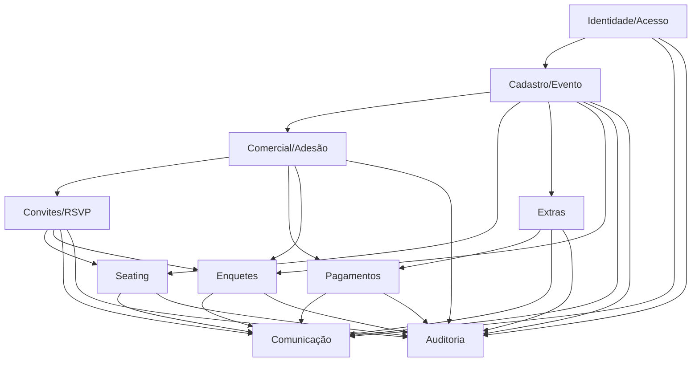

# PRD Expandido — Portal ArtFinal v2 (Backend API v1)

> PRD organizado por **bounded context**, com regras, user stories, critérios de aceite em formato Given/When/Then, invariantes, estados/transições e dependências entre módulos.
> Fontes: [`PRD_v4.md`](../prd/PRD_v4.md), [`PLANEJAMENTO_BACKEND_APIV1.md`](../prd/PLANEJAMENTO_BACKEND_APIV1.md), [`REGRAS_NEGOCIO.md`](../prd/REGRAS_NEGOCIO.md).
> Documentos irmãos: [Brief](./PROJECT_BRIEF.md) · [User flows](./user-flows.md) · [Jornadas](./journeys-personas.md) · [Telas macro](./macro-screens.md) · [SRS](./SRS.md).

---

## Sumário

- [1. Identidade e Acesso](#1-identidade-e-acesso)
- [2. Cadastro Acadêmico e Evento](#2-cadastro-acadêmico-e-evento)
- [3. Comercial e Adesão](#3-comercial-e-adesão)
- [4. Convites e RSVP](#4-convites-e-rsvp)
- [5. Seating](#5-seating)
- [6. Extras e Cobrança Operacional](#6-extras-e-cobrança-operacional)
- [7. Pagamentos](#7-pagamentos)
- [8. Enquetes e Votações](#8-enquetes-e-votações)
- [9. Comunicação e Notificações](#9-comunicação-e-notificações)
- [10. Auditoria e Governança](#10-auditoria-e-governança)
- [11. Dependências entre contextos](#11-dependências-entre-contextos)

---

## 1. Identidade e Acesso

### 1.1 Objetivo

Prover autenticação e autorização segregadas por canal (admin, comissão, formando, convidado) com policies granulares, suportando Sanctum para SPA/mobile e tokens curtos revogáveis para convite.

### 1.2 Entidades envolvidas

`AdminUser`, `ComissaoUser`, `PortalUser`, `ConvidadoAccessToken`, `personal_access_tokens` (Sanctum), roles/permissions via `spatie/laravel-permission`.

### 1.3 Regras de negócio

1. Cada guard tem base de usuários independente; guards nunca se misturam (`auth:admin`, `auth:sanctum`).
2. Convidado **não cria conta**; acessa exclusivamente via `token` do convite, hash SHA-256, revogável, com TTL curto.
3. Rate limit `login` → 5 req/min por `email+IP`; `convite` → 10 req/min por IP; `voto` → 3 req/min por ator.
4. Toda autorização passa por Policy (`EventoPolicy`, `AdesaoPolicy`, `ConvitePolicy`, `MapaMesaPolicy`, `ReservaAssentoPolicy`, `PedidoExtraPolicy`, `EnquetePolicy`, `RelatorioPolicy`).
5. Token Sanctum inclui abilities (`convite:read`, `reserva:write`, `pagamento:create`, etc.).
6. Admin e comissão podem ter acesso multi-evento; formando é vinculado a turma/evento via `Formando`.

### 1.4 User stories

- **US-ACC-01** — Como **formando**, quero fazer login com e-mail e senha no SPA, para acessar minha carteira de convites e extrato.
- **US-ACC-02** — Como **convidado**, quero abrir o link de convite recebido por e-mail, para confirmar presença sem criar conta.
- **US-ACC-03** — Como **admin**, quero revogar um token de convidado comprometido, para invalidar acessos indevidos.
- **US-ACC-04** — Como **admin**, quero atribuir roles a usuários de comissão, para limitar o que cada pessoa pode editar.
- **US-ACC-05** — Como **comissão**, quero acessar o dashboard de múltiplos eventos que administro, para operar todas as turmas em um só lugar.
- **US-ACC-06** — Como **mobile user**, quero fazer login via token Sanctum, para manter a sessão entre aberturas do app.

### 1.5 Critérios de aceite (Given/When/Then)

- **CA-ACC-01**
  Given um formando com credenciais válidas
  When envia `POST /api/v1/auth/login`
  Then recebe `200` + token Sanctum com `abilities` do perfil e cookie CSRF se for SPA.
- **CA-ACC-02**
  Given 5 tentativas de login falhas no mesmo `email+IP` em 1 min
  When envia a 6ª tentativa
  Then recebe `429 RateLimitExceeded`.
- **CA-ACC-03**
  Given um token de convite revogado
  When acessa `GET /api/v1/convite/{token}`
  Then recebe `404 NotFound` (nunca expor que o token existia).
- **CA-ACC-04**
  Given usuário sem role adequada
  When acessa um endpoint administrativo
  Then recebe `403 Forbidden`.

### 1.6 Invariantes

- Toda requisição autenticada tem `request_id` gerado por middleware.
- Nenhum endpoint exige autenticação **e** também aceita token de convite simultaneamente (são fluxos distintos).
- Senhas sempre com bcrypt ≥ 12; nunca logadas.

### 1.7 Estados e transições — Sessão

| Estado          | Transição via                                 | Próximo estado  |
| --------------- | --------------------------------------------- | --------------- |
| `anonymous`     | `POST /auth/login`                            | `authenticated` |
| `authenticated` | `POST /auth/logout` ou expiração do token     | `anonymous`     |
| `authenticated` | revogação admin (`DELETE /admin/tokens/{id}`) | `revoked`       |

### 1.8 Dependências

- Depende de **nada** (é fundação).
- **Bloqueia**: todos os demais contextos (nenhuma API autenticada sem Identidade).

---

## 2. Cadastro Acadêmico e Evento

### 2.1 Objetivo

Modelar a estrutura organizacional (Organização → Instituição → Curso → Turma) e posicionar **Evento** como agregado central operacional do v4.

### 2.2 Entidades

`Organizacao`, `Instituicao`, `Curso`, `Turma`, `Evento`, `TurmaEvento` (pivô), `Formando`.

### 2.3 Regras de negócio

1. Turma pertence a uma Instituição e um Curso; Evento pode reunir 1..N Turmas (pivô `TurmaEvento`).
2. Evento possui `data_evento`, `timezone`, `abre_rsvp_at`, `abre_mesas_at`, `fecha_mesas_at`, `config_json`.
3. Toda alteração de janela operacional é auditada e dispara `EventoAtualizado`.
4. Evento não pode ser excluído se tiver convites, reservas ou pagamentos — usar inativação.
5. Formando pertence a **uma** turma; vínculo com evento é derivado pela turma + pivô.
6. Um formando só pode ter **uma adesão ativa por evento** (Apêndice B: decisão pendente sobre multi-evento simultâneo).

### 2.4 User stories

- **US-CAD-01** — Como **admin**, quero cadastrar uma instituição com CNPJ e dados de contato, para segregar turmas por cliente.
- **US-CAD-02** — Como **admin**, quero criar um evento vinculando uma ou mais turmas, para operar formaturas conjuntas.
- **US-CAD-03** — Como **admin**, quero configurar as janelas de RSVP e seating, para liberar funcionalidades na hora certa.
- **US-CAD-04** — Como **admin**, quero importar formandos em lote por CSV, para acelerar o onboarding.
- **US-CAD-05** — Como **formando**, quero ver os dados do meu evento (local, data, cronograma), para me planejar.
- **US-CAD-06** — Como **admin**, quero publicar um evento quando estiver pronto, para liberar a jornada aos formandos.

### 2.5 Critérios de aceite

- **CA-CAD-01**
  Given um evento em rascunho
  When admin chama `POST /admin/eventos/{id}/publicar`
  Then o status muda para `publicado` e `EventoPublicado` é disparado.
- **CA-CAD-02**
  Given `abre_mesas_at` no futuro
  When formando tenta acessar `POST /eventos/{id}/mesas/reservas`
  Then recebe `409 InvariantViolation` com mensagem "Janela de seleção não aberta".
- **CA-CAD-03**
  Given um evento com reservas ativas
  When admin tenta excluir o evento
  Then recebe `409` e a ação é bloqueada.

### 2.6 Invariantes

- `abre_rsvp_at ≤ abre_mesas_at ≤ fecha_mesas_at ≤ data_evento` (validação de coerência).
- Timezone do evento é fixo; todas as janelas são persistidas em UTC e renderizadas no tz do evento.

### 2.7 Estados — Evento

| Estado      | Transição via                             | Próximo estado |
| ----------- | ----------------------------------------- | -------------- |
| `rascunho`  | `PublicarEventoAction`                    | `publicado`    |
| `publicado` | `AtualizarJanelasEventoAction`            | `publicado`    |
| `publicado` | fim automático (após `data_evento + 30d`) | `encerrado`    |
| `publicado` | admin com justificativa                   | `cancelado`    |

### 2.8 Dependências

- Depende de **Identidade**.
- **Bloqueia**: Comercial, Convites, Seating, Extras, Enquetes (todos precisam de Evento).

---

## 3. Comercial e Adesão

### 3.1 Objetivo

Gerir pacotes comerciais, produtos adicionais, programações de valor, parcelamento e pagamento base, preservando snapshots imutáveis no momento da confirmação.

### 3.2 Entidades

`Pacote`, `Produto`, `Adesao`, `AdesaoProduto`, `Parcela`, `Pagamento`.

### 3.3 Regras de negócio

1. Adesão confirma a contratação comercial do formando para um evento (**uma ativa por contexto**).
2. Adesão possui **snapshot** em `snapshot_comercial` (JSONB) com: preço, desconto, termo, condição no momento da confirmação.
3. Alterações posteriores em preço ou pacote **não retroagem** sobre adesões concluídas.
4. Parcelas são geradas por `GerarParcelasAction` a partir de pacote + entrada + quantidade de parcelas.
5. Valores monetários em `INTEGER centavos` — nunca float.
6. Pagamento base (parcela) segue o mesmo domínio de [Pagamentos §7](#7-pagamentos).
7. Adesão pode ter múltiplos produtos adicionais (pivô `AdesaoProduto`).

### 3.4 User stories

- **US-COM-01** — Como **admin**, quero criar pacotes com valor, qtde de parcelas e produtos inclusos, para ofertar aos formandos.
- **US-COM-02** — Como **formando**, quero ver os pacotes disponíveis no meu evento, para escolher aderir.
- **US-COM-03** — Como **formando**, quero contratar um pacote parcelado, para financiar a adesão.
- **US-COM-04** — Como **responsável financeiro**, quero ver todas as parcelas em aberto, para pagar.
- **US-COM-05** — Como **admin**, quero consultar inadimplentes e notificar, para reduzir inadimplência.
- **US-COM-06** — Como **admin**, quero cancelar uma adesão com justificativa, para encerrar vínculo comercial.

### 3.5 Critérios de aceite

- **CA-COM-01**
  Given formando sem adesão no evento
  When envia `POST /api/v1/eventos/{id}/adesoes` com pacote válido
  Then recebe `201` com adesão em `pendente_pagamento` e parcelas geradas.
- **CA-COM-02**
  Given adesão confirmada
  When admin altera o preço do pacote
  Then a adesão do formando mantém `snapshot_comercial` imutável.
- **CA-COM-03**
  Given formando com adesão `ativa`
  When tenta criar segunda adesão no mesmo evento
  Then recebe `409 InvariantViolation`.

### 3.6 Invariantes

- `sum(parcelas.valor_centavos) = adesao.valor_total_centavos - adesao.valor_entrada_centavos`.
- `adesao.snapshot_comercial` é gravado **uma única vez** na transição para `ativa` ou `pendente_pagamento`.

### 3.7 Estados — Adesão

| Estado               | Transição via                                  | Próximo estado       |
| -------------------- | ---------------------------------------------- | -------------------- |
| `rascunho`           | `CriarAdesaoAction`                            | `pendente_pagamento` |
| `pendente_pagamento` | `ConfirmarAdesaoAction` (pagamento confirmado) | `ativa`              |
| `pendente_pagamento` | admin ou expiração                             | `cancelada`          |
| `ativa`              | todas parcelas pagas                           | `concluida`          |
| `ativa`              | atraso > X dias em parcela                     | `inadimplente`       |
| `inadimplente`       | pagamento regularizado                         | `ativa`              |
| qualquer             | `CancelarAdesaoAction` (admin)                 | `cancelada`          |

### 3.8 Dependências

- Depende de **Identidade**, **Cadastro**.
- **Bloqueia**: Convites (cota derivada de adesão ativa), Seating (elegibilidade do formando).

---

## 4. Convites e RSVP

### 4.1 Objetivo

Tratar convites como entidade operacional de primeira classe, com cota calculada, emissão unitária e em lote, RSVP com funil completo e token revogável.

### 4.2 Entidades

`CotaRegra`, `LoteConvite`, `Convite`, `RsvpHistorico`.

### 4.3 Regras de negócio — Cota

1. Composição: `cota_base + cota_bonus + cota_extra - cota_reservada`.
2. Fórmula de disponibilidade: `cota_total - convites_emitidos_ativos - convites_reservados`.
3. Cancelar convite pode ou não devolver cota (configurável por evento).
4. Transferir convite **não altera** cota.
5. Convite pago e já utilizado **não retorna** automaticamente à cota.
6. Convite extra aprovado mas **não pago** não gera direito operacional.

### 4.4 Regras — Convite

1. Tipos: `nominal`, `transferivel`, `cortesia`, `staff`, `extra`.
2. Código público legível (24 chars) + `token_hash` SHA-256 de um token bruto (32 bytes aleatórios).
3. Convite precisa estar ao menos em `emitido` para ser acessível externamente.
4. Token pode ser **revogado** (libera novo token se reemissão).
5. Convite `cancelado` não participa de RSVP nem seating.
6. Convite `confirmado` pode ser pré-requisito para seating (configurável).
7. Convite extra herda vínculo com `PedidoExtra` (`pedido_extra_id`).

### 4.5 Regras — RSVP

1. RSVP sempre vinculado a um convite.
2. Convite pode existir sem RSVP confirmado.
3. Respostas alteráveis até fechamento da janela (`abre_rsvp_at .. fecha_rsvp_at`).
4. Alteração gera `RsvpHistorico` com ator, data e motivo.
5. Se evento exigir confirmação para seating, apenas `confirmado` conta como elegível.

### 4.6 User stories

- **US-CNV-01** — Como **formando**, quero ver minha cota disponível por evento, para planejar convites.
- **US-CNV-02** — Como **formando**, quero emitir um convite nominal informando nome e e-mail do convidado, para enviar o link.
- **US-CNV-03** — Como **formando**, quero emitir um lote de 30 convites por planilha, para economizar tempo.
- **US-CNV-04** — Como **convidado**, quero acessar meu convite pelo link recebido, para ver o evento.
- **US-CNV-05** — Como **convidado**, quero confirmar presença em menos de 2 minutos, sem criar conta.
- **US-CNV-06** — Como **formando**, quero transferir um convite não usado para outro convidado, para reaproveitar.
- **US-CNV-07** — Como **formando**, quero reemitir um convite (novo token) quando o convidado perder o link, para mantê-lo funcional.
- **US-CNV-08** — Como **admin**, quero cancelar um convite com justificativa, para resolver exceções.
- **US-CNV-09** — Como **comissão**, quero ver taxa de RSVP por turma, para monitorar o funil.

### 4.7 Critérios de aceite

- **CA-CNV-01**
  Given formando com cota disponível = 3
  When emite 4 convites em uma operação
  Then recebe `409 CotaEsgotada` e nenhum convite é persistido.
- **CA-CNV-02**
  Given `POST /api/v1/eventos/{id}/convites/lotes` com 200 itens
  When executado
  Then retorna `202 Accepted` com `status_url` e o job `EmitirLoteConvitesJob` processa em ≤ 5 min.
- **CA-CNV-03**
  Given convite em `emitido` com token válido
  When convidado acessa `GET /api/v1/convite/{token}`
  Then registra `visualizado_at` e dispara atualização de status para `visualizado`.
- **CA-CNV-04**
  Given janela de RSVP fechada
  When convidado envia `POST /api/v1/convite/{token}/rsvp`
  Then recebe `409 InvariantViolation`.
- **CA-CNV-05**
  Given convite `cancelado`
  When admin tenta transferi-lo
  Then recebe `409` e a transferência é bloqueada.

### 4.8 Invariantes

- `convites.codigo` e `convites.token_hash` são UNIQUE no banco.
- `cota_calculada >= 0` em qualquer momento.
- Transferência não duplica convite — atualiza `convidado_*` e registra no log.

### 4.9 Estados — Convite

| Estado         | Transição via                 | Próximo estado |
| -------------- | ----------------------------- | -------------- |
| `rascunho`     | `EmitirConviteAction`         | `emitido`      |
| `emitido`      | e-mail entregue               | `enviado`      |
| `enviado`      | convidado abre link           | `visualizado`  |
| `visualizado`  | `RegistrarRsvpAction` (sim)   | `confirmado`   |
| `visualizado`  | `RegistrarRsvpAction` (não)   | `recusado`     |
| qualquer ativo | `CancelarConviteAction`       | `cancelado`    |
| qualquer ativo | usado no dia do evento        | `inutilizado`  |
| `confirmado`   | `AlterarRsvpAction` (reabrir) | `visualizado`  |

### 4.10 Estados — RSVP

| Estado       | Transição         | Próximo estado             |
| ------------ | ----------------- | -------------------------- |
| `pendente`   | ação do convidado | `confirmado` \| `recusado` |
| `confirmado` | nova resposta     | `confirmado` \| `recusado` |
| `pendente`   | fim da janela     | `expirado`                 |

### 4.11 Dependências

- Depende de **Identidade**, **Cadastro**, **Comercial** (cota deriva de adesão).
- **Bloqueia**: **Seating** (confirmação pode ser pré-requisito), **Comunicação** (templates de convite).

---

## 5. Seating

### 5.1 Objetivo

Entregar mapa de mesas com **concorrência real** (hold + confirmação transacional), impedindo duplicidade de reserva mesmo com múltiplos clientes tentando simultaneamente.

### 5.2 Entidades

`MapaMesa`, `Setor`, `Mesa`, `Assento`, `ReservaAssento`, `ReservaHistorico`.

### 5.3 Regras de concorrência (críticas)

1. **UNIQUE parcial**: `CREATE UNIQUE INDEX ... ON reservas_assentos (assento_id) WHERE status IN ('hold','confirmada')`.
2. Toda tentativa carrega `X-Idempotency-Key`; se já existe, devolve o estado atual.
3. Lock Redis por assento (`seating:assento:{ulid}`, TTL 10s, timeout 3s).
4. Transação curta: `SELECT ... FOR UPDATE` no assento → validar disponibilidade → `INSERT reserva`.
5. Hold expira em 5 min (`HOLD_TTL_SECONDS = 300`); job `ExpirarHoldsJob` varre e transiciona para `expirada`.
6. Confirmação final valida novamente disponibilidade dentro da transação.

### 5.4 Regras de negócio

1. Evento opera em modalidade: `assento_individual` (default MVP), `bloco_de_assentos`, `mesa_inteira`.
2. Formando não pode reservar mais assentos que sua disponibilidade operacional (cota de seating).
3. Convite cancelado **invalida** reserva associada (via `CancelarConviteAction` → `LiberarAssentoAction`), salvo override admin.
4. Troca de assento após confirmação exige: liberação do antigo + validação do destino + log.
5. Admin pode bloquear mesa/assento (`status = bloqueada`).
6. Comissão só edita mapa se tiver permissão explícita.
7. Fora da janela (`abre_mesas_at/fecha_mesas_at`): apenas admin/operação podem alterar.

### 5.5 User stories

- **US-SEA-01** — Como **formando**, quero visualizar o mapa do salão com assentos disponíveis, para escolher onde sentar.
- **US-SEA-02** — Como **formando**, quero reservar um assento com hold de 5 minutos, para ter tempo de concluir a escolha.
- **US-SEA-03** — Como **formando**, quero confirmar meu assento antes do hold expirar, para garantir a reserva.
- **US-SEA-04** — Como **formando**, quero liberar um assento selecionado antes de confirmar, para trocar de ideia.
- **US-SEA-05** — Como **formando**, quero trocar meu assento confirmado por outro disponível, para reorganizar minha mesa.
- **US-SEA-06** — Como **convidado com RSVP confirmado**, quero selecionar meu assento (se permitido), para ter conforto.
- **US-SEA-07** — Como **admin**, quero bloquear mesas para staff/operação, para reservar espaço técnico.
- **US-SEA-08** — Como **admin**, quero forçar troca de assento entre reservas confirmadas com justificativa, para resolver exceções.
- **US-SEA-09** — Como **sistema**, quero expirar holds não confirmados automaticamente, para liberar assentos.

### 5.6 Critérios de aceite

- **CA-SEA-01** (critical)
  Given 100 clientes tentando reservar o mesmo assento simultaneamente
  When todos chamam `POST /eventos/{id}/mesas/reservas`
  Then exatamente **1** recebe `201 Created`; os outros recebem `409 AssentoIndisponivel`.
- **CA-SEA-02**
  Given reserva em `hold` com `hold_expires_at < now()`
  When job `ExpirarHoldsJob` executa
  Then reserva transiciona para `expirada` e UNIQUE parcial libera o assento.
- **CA-SEA-03**
  Given reserva em `hold`
  When cliente chama `POST /reservas/{id}/confirmar` antes do expire
  Then status vira `confirmada` e `confirmado_at` é setado.
- **CA-SEA-04**
  Given reserva em `hold` com `hold_expires_at` passado
  When cliente chama confirmar
  Then recebe `410 HoldExpirado`.
- **CA-SEA-05**
  Given mesma `X-Idempotency-Key` reutilizada
  When cliente repete `POST /reservas`
  Then recebe `201` com a reserva anterior (idempotência de banco).
- **CA-SEA-06**
  Given cliente envia `X-Idempotency-Key` já usada **com payload diferente**
  When envia a 2ª requisição
  Then recebe `409 IdempotencyConflict`.
- **CA-SEA-07**
  Given janela de mesas fechada
  When formando tenta reservar
  Then recebe `409 InvariantViolation`.

### 5.7 Invariantes

- Em qualquer momento, **no máximo uma** reserva `hold`+`confirmada` ativa por `assento_id` (garantido por UNIQUE parcial).
- `hold_expires_at IS NOT NULL ⇔ status = hold` (CHECK constraint).
- `confirmado_at IS NOT NULL ⇔ status = confirmada` (CHECK constraint).

### 5.8 Estados — ReservaAssento

| Estado       | Transição via                         | Próximo estado            |
| ------------ | ------------------------------------- | ------------------------- |
| (criação)    | `ReservarAssentoAction`               | `hold`                    |
| `hold`       | `ConfirmarAssentoAction`              | `confirmada`              |
| `hold`       | `LiberarAssentoAction` ou expiração   | `cancelada` \| `expirada` |
| `confirmada` | `TrocarAssentoAction` (libera antigo) | `cancelada`               |
| `confirmada` | admin com justificativa               | `cancelada`               |
| qualquer     | admin bloqueia mesa/assento           | `bloqueada`               |

### 5.9 Dependências

- Depende de **Identidade**, **Cadastro**, **Convites/RSVP** (quando evento exige confirmação).
- **Bloqueia**: nada direto, mas é **pré-requisito do MVP executivo**.

---

## 6. Extras e Cobrança Operacional

### 6.1 Objetivo

Fechar o ciclo: catálogo → elegibilidade → aprovação (se aplicável) → pagamento → emissão operacional derivada.

### 6.2 Entidades

`ProdutoExtra`, `PedidoExtra`, `PedidoExtraItem`.

### 6.3 Regras de negócio

1. Produto extra tem: preço, janela (`abre_at/fecha_at`), regra de elegibilidade, estoque.
2. Modalidades de estoque: `ilimitado`, `por_evento`, `por_lote`, `por_formando`.
3. Pedido extra pode exigir **aprovação** (flag `requer_aprovacao`) antes do checkout.
4. Apenas pedido em `pago` emite convites/libera recurso.
5. Estorno pode invalidar convites ainda não utilizados (`inutilizar` antes de ação do convidado).
6. Admin pode gerar pagamento manual com justificativa (log).
7. Pedido `expirado` se não pago dentro da janela configurada.

### 6.4 User stories

- **US-EXT-01** — Como **admin**, quero cadastrar produtos extras (convite extra, upgrade mesa, kit), para monetizar.
- **US-EXT-02** — Como **formando**, quero ver o catálogo de extras disponíveis no meu evento, para comprar.
- **US-EXT-03** — Como **formando**, quero iniciar pedido de 2 convites extras, para convidar mais pessoas.
- **US-EXT-04** — Como **formando**, quero pagar por PIX/boleto/cartão, para concluir o pedido.
- **US-EXT-05** — Como **formando**, quero receber os convites extras automaticamente após pagamento, sem intervenção manual.
- **US-EXT-06** — Como **admin**, quero aprovar ou rejeitar pedidos que exigem decisão prévia, com justificativa.
- **US-EXT-07** — Como **admin**, quero estornar um pedido e invalidar convites não utilizados, para resolver exceções.

### 6.5 Critérios de aceite

- **CA-EXT-01**
  Given produto extra com estoque esgotado
  When formando envia `POST /eventos/{id}/extras/pedidos`
  Then recebe `409 CotaEsgotada`.
- **CA-EXT-02**
  Given pedido `aguardando_pagamento` e webhook `pagamento.confirmado`
  When webhook é processado
  Then `ConfirmarPagamentoExtraAction` transiciona para `pago` e `EmitirLoteConvitesAction` é chamada.
- **CA-EXT-03**
  Given pedido `requer_aprovacao = true` criado
  When formando envia
  Then status vira `pendente_aprovacao` e não aparece opção de pagar até admin aprovar.
- **CA-EXT-04**
  Given pedido `pago` com 2 convites emitidos, 0 utilizados
  When admin estorna
  Then os 2 convites ficam `inutilizado` e pedido vira `estornado`.

### 6.6 Invariantes

- Convite extra tem sempre `pedido_extra_id` preenchido.
- `PedidoExtra.valor_total_centavos = sum(itens.valor_unitario * qtde)`.

### 6.7 Estados — PedidoExtra

| Estado                 | Transição via                               | Próximo estado         |
| ---------------------- | ------------------------------------------- | ---------------------- |
| `rascunho`             | `CriarPedidoExtraAction` (requer aprovação) | `pendente_aprovacao`   |
| `rascunho`             | `CriarPedidoExtraAction` (automático)       | `aguardando_pagamento` |
| `pendente_aprovacao`   | `AprovarPedidoExtraAction`                  | `aguardando_pagamento` |
| `pendente_aprovacao`   | admin rejeita                               | `cancelado`            |
| `aguardando_pagamento` | webhook `pagamento.confirmado`              | `pago`                 |
| `aguardando_pagamento` | expira janela                               | `expirado`             |
| `aguardando_pagamento` | admin cancela                               | `cancelado`            |
| `pago`                 | `EstornarPedidoExtraAction`                 | `estornado`            |

### 6.8 Dependências

- Depende de **Identidade**, **Cadastro**, **Pagamentos**.
- **Bloqueia**: **Convites** (emissão derivada de extra pago).

---

## 7. Pagamentos

### 7.1 Objetivo

Orquestrar intents de pagamento, webhooks idempotentes e integração com gateway externo (Itaú MVP, arquitetura agnóstica).

### 7.2 Entidades

`Pagamento`, `WebhookEvento`.

### 7.3 Regras de negócio

1. Webhook externo **não pode aplicar efeito duas vezes** — UNIQUE por `(provider, gateway_reference)`.
2. Falha de comunicação **não implica** falha de pagamento sem reconciliação explícita.
3. Status de pagamento impacta: `Adesao`, `PedidoExtra`, emissão de convite extra.
4. Toda mudança de estado grava evento (`PagamentoConfirmado`, `PagamentoFalhou`).
5. Assinatura HMAC do webhook é validada no controller; inválida → `400 WebhookInvalido`.
6. Webhook não assinado corretamente vai para tabela `webhook_eventos.status = descartado`.
7. Nenhum dado de cartão armazenado — apenas tokens do provedor.

### 7.4 User stories

- **US-PAG-01** — Como **formando**, quero iniciar pagamento de uma parcela e receber QR Code PIX, para pagar no app do banco.
- **US-PAG-02** — Como **formando**, quero que meu pagamento seja confirmado automaticamente, sem precisar mandar comprovante.
- **US-PAG-03** — Como **admin**, quero ver todos os webhooks recebidos e seu status de processamento, para auditar.
- **US-PAG-04** — Como **admin**, quero reprocessar um webhook que falhou, para recuperar operações perdidas.
- **US-PAG-05** — Como **sistema**, quero rejeitar webhooks com assinatura inválida, para evitar fraude.

### 7.5 Critérios de aceite

- **CA-PAG-01**
  Given webhook enviado duas vezes com mesmo `gateway_reference`
  When ambos chegam
  Then o segundo retorna `200 AlreadyProcessed` e nenhum efeito adicional é aplicado.
- **CA-PAG-02**
  Given webhook com assinatura inválida
  When chega
  Then retorna `400 WebhookInvalido` e é registrado como `descartado`.
- **CA-PAG-03**
  Given job de processamento falhando temporariamente
  When `ProcessarWebhookPagamentoJob` tenta 3x com backoff
  Then na falha persistente vai para `failed_jobs` com contexto completo.

### 7.6 Invariantes

- `webhook_eventos (provider, gateway_reference)` UNIQUE.
- Pagamento nunca retrocede: `pago → estornado` é permitido, mas não há volta a `pendente`.
- Estorno gera novo Pagamento vinculado (não altera o anterior).

### 7.7 Estados — Pagamento

| Estado         | Transição                | Próximo estado |
| -------------- | ------------------------ | -------------- |
| `criado`       | intent criado no gateway | `pendente`     |
| `pendente`     | webhook autorização      | `autorizado`   |
| `autorizado`   | webhook captura          | `pago`         |
| `pendente`     | webhook falha            | `falhou`       |
| `pago`         | estorno solicitado       | `estornado`    |
| qualquer ativo | cancelamento manual      | `cancelado`    |

### 7.8 Dependências

- Depende de **Identidade**, gateway externo.
- **Bloqueia**: Comercial (parcelas), Extras (pedidos).

---

## 8. Enquetes e Votações

### 8.1 Objetivo

Engajar formandos, comissão e convidados confirmados com votação auditável, janela temporal e cardinalidade configurável.

### 8.2 Entidades

`Enquete`, `OpcaoEnquete`, `Voto`.

### 8.3 Regras de negócio

1. Tipos suportados: `escolha_simples`, `multipla_escolha` (MVP); `ranqueamento` (futuro).
2. Elegibilidade configurável: `formando_ativo`, `comissao`, `convidado_confirmado`, `subconjunto`.
3. Cada ator elegível vota uma vez por enquete, salvo `permite_edicao=true`.
4. Voto fora da janela (`abre_at/fecha_at`) é rejeitado.
5. Se `permite_edicao=false`, primeiro voto fecha a ação do ator.
6. Resultado pode ser: `publico`, `parcial`, `admin_only`.
7. Voto sempre auditado com `ator`, `origem`, `timestamp`, `ip` (quando disponível).

### 8.4 User stories

- **US-ENQ-01** — Como **admin**, quero criar enquete de escolha simples com 4 opções, para votar em tema da festa.
- **US-ENQ-02** — Como **admin**, quero publicar a enquete e abrir janela de votação, para liberar aos eleitores.
- **US-ENQ-03** — Como **formando elegível**, quero votar em uma opção, para contribuir na decisão.
- **US-ENQ-04** — Como **formando**, quero ver o resultado parcial (se configurado), para saber o que os colegas preferem.
- **US-ENQ-05** — Como **admin**, quero encerrar uma enquete manualmente, para decretar o resultado.

### 8.5 Critérios de aceite

- **CA-ENQ-01**
  Given enquete com `permite_edicao=false` e ator já votou
  When tenta votar novamente
  Then recebe `409 InvariantViolation`.
- **CA-ENQ-02**
  Given janela de votação fechada
  When ator envia voto
  Then recebe `409 InvariantViolation`.
- **CA-ENQ-03**
  Given enquete `admin_only`
  When formando consulta resultados
  Then recebe `403 Forbidden` para o campo `resultados`.

### 8.6 Invariantes

- `unique(enquete_id, ator_tipo, ator_id)` quando `permite_edicao=false`.
- `Voto.opcao_id` deve pertencer à `Enquete.id` (FK coerente).

### 8.7 Estados — Enquete

| Estado      | Transição                | Próximo estado |
| ----------- | ------------------------ | -------------- |
| `rascunho`  | `PublicarEnqueteAction`  | `publicada`    |
| `publicada` | fim da janela automático | `encerrada`    |
| `publicada` | `EncerrarEnqueteAction`  | `encerrada`    |
| `rascunho`  | admin cancela            | `cancelada`    |

### 8.8 Dependências

- Depende de **Identidade**, **Cadastro**, **Convites/RSVP** (quando elegibilidade é convidado confirmado).

---

## 9. Comunicação e Notificações

### 9.1 Objetivo

Emitir e-mails e push transacionais, registrar entregas, suportar reenvio e auditar canais.

### 9.2 Entidades

`TemplateNotificacao`, `Notificacao`, `NotificacaoEntrega`.

### 9.3 Regras de negócio

1. Notificação nunca substitui estado de domínio — é **efeito colateral**.
2. Reenvio permitido, mas auditado.
3. Canais: `email` (MVP), `push` (F8), `sms/whatsapp` (pós-MVP).
4. Templates versionados por chave + canal.
5. Gatilhos obrigatórios: convite emitido, RSVP pendente há X dias, RSVP confirmado, janela de mesas aberta, hold próximo de expirar, pagamento aprovado, compra extra aprovada, enquete aberta.

### 9.4 User stories

- **US-COMM-01** — Como **admin**, quero editar template de e-mail de convite com variáveis (`{{nome}}`, `{{link}}`), para personalizar.
- **US-COMM-02** — Como **admin**, quero ver status de entrega de cada notificação (enviado, entregue, falhou), para rastrear.
- **US-COMM-03** — Como **admin**, quero reenviar notificação para um convidado específico, com log.
- **US-COMM-04** — Como **sistema**, quero disparar reminder automático se RSVP está pendente há 3 dias, para aumentar taxa.

### 9.5 Critérios de aceite

- **CA-COMM-01**
  Given `ConviteEmitido` disparado
  When listener `EnviarEmailConviteAoEmitir` processa
  Then `Notificacao` é criada e `NotificacaoEntrega` reflete status do provedor.
- **CA-COMM-02**
  Given notificação com falha do provedor
  When admin clica em "Reenviar"
  Then nova entrega é criada mantendo histórico da anterior.

### 9.6 Dependências

- Depende de todos os contextos (é consumidor de eventos).

---

## 10. Auditoria e Governança

### 10.1 Objetivo

Garantir trilha append-only de ações críticas e preservar contexto histórico via snapshots.

### 10.2 Regras

1. `spatie/laravel-activitylog` audita: emissão/cancelamento/transferência de convite; confirmação/alteração de RSVP; criação/expiração/confirmação/cancelamento de reserva; aprovação/rejeição/cancelamento de pedido extra; baixa manual de pagamento; alteração administrativa após fechamento de janela.
2. Nunca `DELETE` em `activity_log`.
3. Snapshots obrigatórios: preço da adesão, termo aceito, regra de convite aplicada, condição de extra no momento da compra, composição da reserva confirmada.
4. `X-Request-Id` e `X-Correlation-Id` propagados entre requisições, webhooks e jobs.

### 10.3 Critérios de aceite

- **CA-AUD-01**
  Given qualquer ação auditável ocorre
  When consultamos `GET /admin/auditoria?subject_id=X`
  Then retornamos entrada com `causer`, `timestamp`, `attribute_changes` e `properties`.

### 10.4 Dependências

- Consumidor transversal de todos os contextos.

---

## 11. Dependências entre contextos

**Ordem mínima de implementação** (ver [Roadmap](../prd/ROADMAP.md)):
F1 Identidade + base Cadastro → F2 Cadastro completo + Comercial → F3 SPA → F4 Convites/RSVP → F5 Seating → F6 Extras + Pagamentos + Enquetes → F7 Hardening → F8 Mobile.

---

## 12. Referências cruzadas

- Ver fluxos detalhados em [`user-flows.md`](./user-flows.md).
- Ver jornadas e tabelas de experiência em [`journeys-personas.md`](./journeys-personas.md).
- Ver telas macro e estados em [`macro-screens.md`](./macro-screens.md).
- Ver requisitos formais e rastreabilidade em [`SRS.md`](./SRS.md).
- Ver planejamento executável em [`PLANEJAMENTO_BACKEND_APIV1.md`](../prd/PLANEJAMENTO_BACKEND_APIV1.md).
