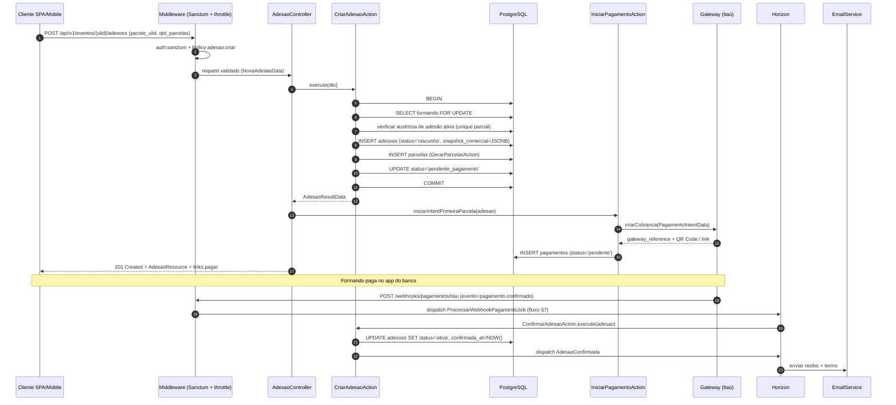
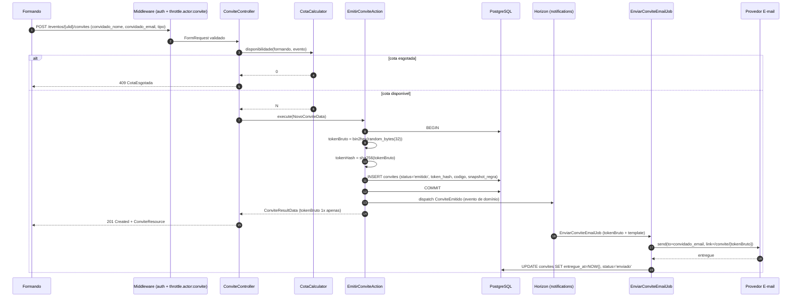
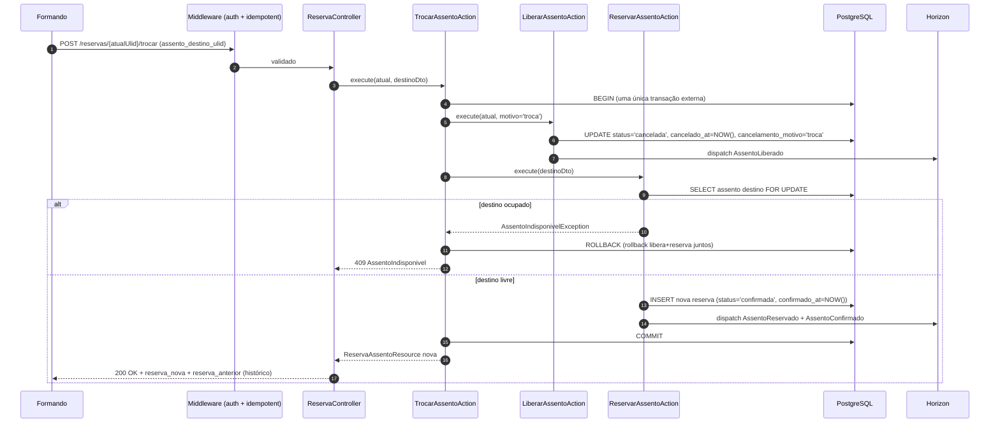
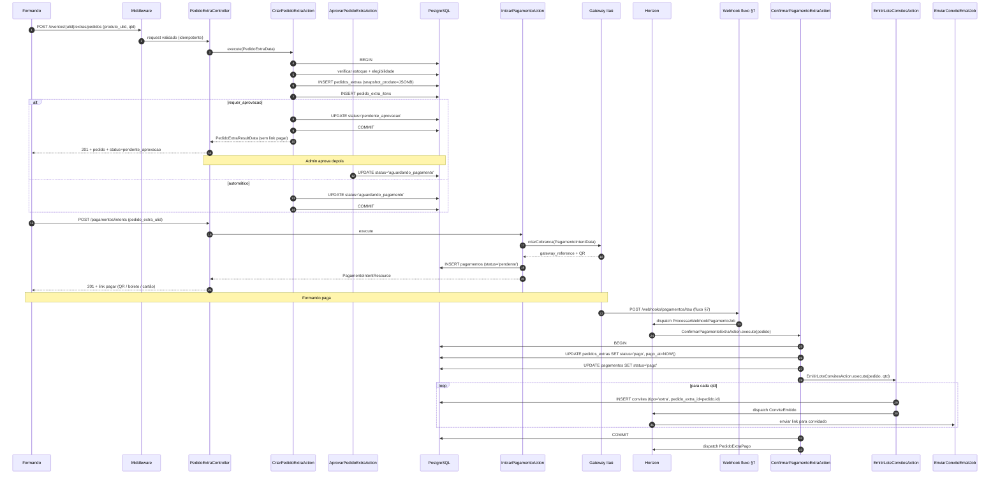
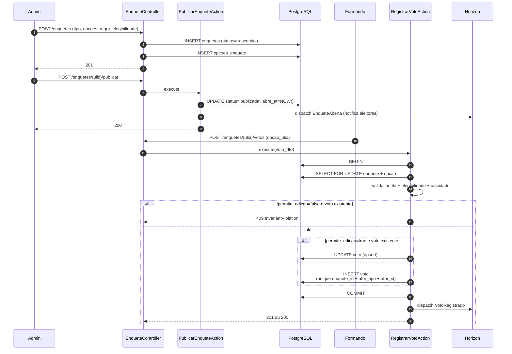
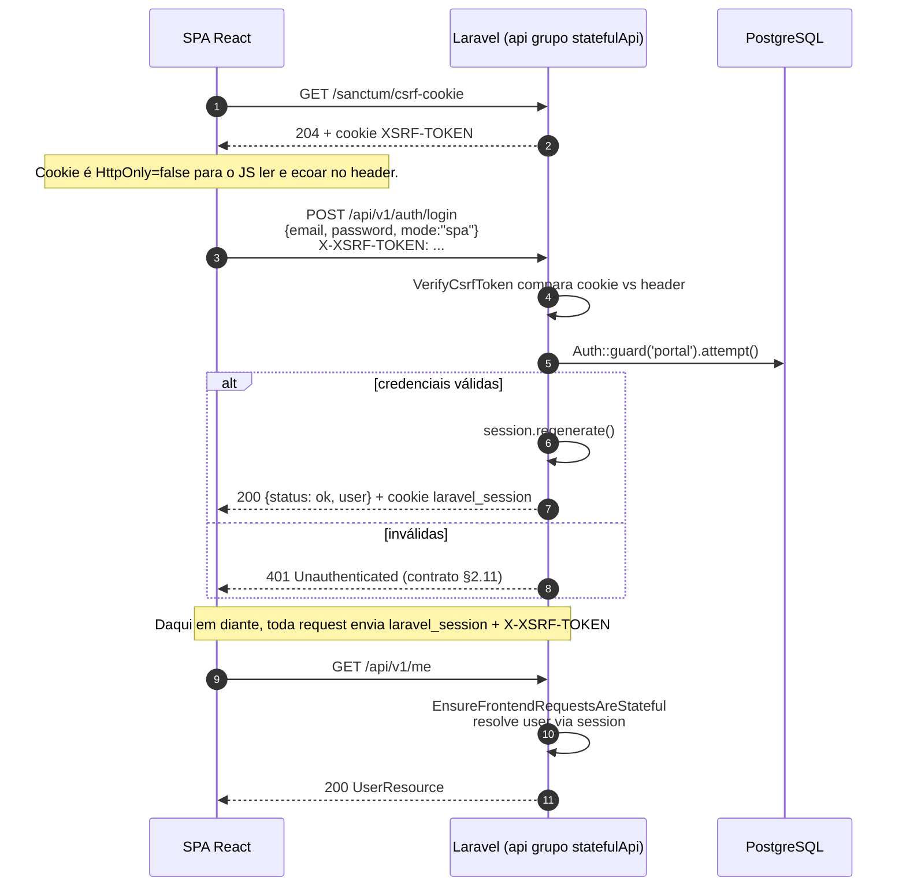
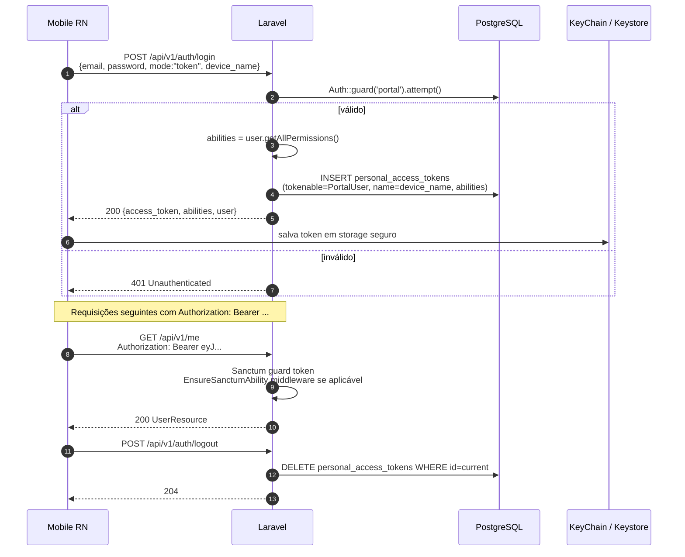
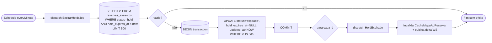
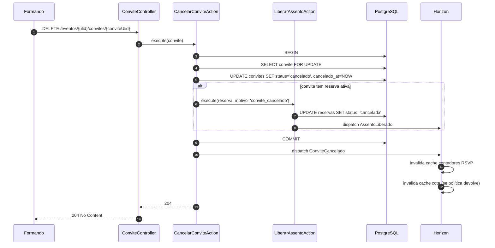

# User Flows — Portal ArtFinal v2

> Fluxos canônicos do backend API v1. Cada fluxo traz persona, pré-condições, passos numerados, pós-condições, caminhos alternativos e erros esperados. Todos os diagramas em **Mermaid** (`flowchart` e `sequenceDiagram`).
> Fontes: [`PLANEJAMENTO_BACKEND_APIV1.md`](../prd/PLANEJAMENTO_BACKEND_APIV1.md) (§2–§7), [`PRD_v4.md`](../prd/PRD_v4.md), [`REGRAS_NEGOCIO.md`](../prd/REGRAS_NEGOCIO.md).
> Documentos irmãos: [Brief](./PROJECT_BRIEF.md) · [PRD Expandido](./PRD_EXPANDED.md) · [Jornadas](./journeys-personas.md) · [Telas macro](./macro-screens.md) · [SRS](./SRS.md).

---

## Sumário

- [Convenções](#convenções)
- [1. Adesão comercial (formando contrata pacote e paga)](#1-adesão-comercial-formando-contrata-pacote-e-paga)
- [2. Emissão e envio de convite](#2-emissão-e-envio-de-convite)
- [3. RSVP via token mágico (rota pública)](#3-rsvp-via-token-mágico-rota-pública)
- [4. Reserva de assento (hold 5min + confirmação)](#4-reserva-de-assento-hold-5min--confirmação)
- [5. Troca de assento (bilateral, prevenção deadlock)](#5-troca-de-assento-bilateral-prevenção-deadlock)
- [6. Pedido extra + pagamento + emissão de convite derivado](#6-pedido-extra--pagamento--emissão-de-convite-derivado)
- [7. Webhook de pagamento (idempotente com HMAC)](#7-webhook-de-pagamento-idempotente-com-hmac)
- [8. Enquete e voto](#8-enquete-e-voto)
- [9. Login SPA via Sanctum](#9-login-spa-via-sanctum)
- [10. Login mobile (device_name → access_token)](#10-login-mobile-device_name--access_token)
- [11. Expiração de hold automática (job scheduled)](#11-expiração-de-hold-automática-job-scheduled)
- [12. Cancelamento de convite (com devolução de cota)](#12-cancelamento-de-convite-com-devolução-de-cota)

---

## Convenções

- Actor dos diagramas: `C` (cliente React/RN), `M` (middleware), `Ctl` (controller), `A` (action), `DB` (PostgreSQL), `Q` (Horizon), `L` (Redis lock), `G` (gateway externo), `W` (WebSocket/push), `Email` (Mail provider).
- Códigos HTTP seguem contrato §2.11 do planejamento (envelope único: `error`, `message`, `details`, `request_id`, `timestamp`).
- Todo POST crítico exige `X-Idempotency-Key` (§2.9).
- Todo webhook exige assinatura HMAC SHA-256 válida (§5.5).

---

## 1. Adesão comercial (formando contrata pacote e paga)

### 1.1 Persona

- **Formando** autenticado via Sanctum (SPA ou mobile).
- Opcionalmente um **Responsável financeiro** (mesmo formando com papel operacional distinto).

### 1.2 Pré-condições

1. Formando existe e está vinculado à turma e ao evento (§2 PRD Expandido).
2. Evento está `publicado` e janela de adesão aberta (`abre_rsvp_at` já passou ou adesão não depende dela).
3. Pacote está ativo e disponível para o evento.
4. Formando não possui adesão `ativa` ou `pendente_pagamento` no mesmo evento (invariante §3.6 PRD Expandido).

### 1.3 Fluxo principal



### 1.4 Pós-condições

- Linha em `adesoes` com `status = ativa` e `snapshot_comercial` imutável.
- N linhas em `parcelas` cujo somatório `sum(valor_centavos) = valor_total - valor_entrada` (invariante §3.6 PRD Expandido).
- Pelo menos 1 linha em `pagamentos` com `status = pago` para a primeira parcela/entrada.
- E-mail com recibo enviado via fila `notifications`.
- Event `AdesaoConfirmada` publicado (liberando cota de convites §4 PRD Expandido).

### 1.5 Caminhos alternativos

| #   | Gatilho                                    | Resultado                                                                        |
| --- | ------------------------------------------ | -------------------------------------------------------------------------------- |
| A1  | Pacote inativo                             | `422 ValidationError` no FormRequest                                             |
| A2  | Adesão ativa pré-existente no mesmo evento | `409 InvariantViolation`                                                         |
| A3  | Janela de adesão fechada                   | `409 InvariantViolation` com mensagem "Janela de adesão não aberta"              |
| A4  | Falha no gateway ao criar intent           | Adesão fica em `pendente_pagamento`; cliente recebe `202` e pode retentar intent |
| A5  | Formando abandona antes de pagar           | Job expira adesão após janela configurada → `cancelada`                          |

### 1.6 Erros esperados

- `401 Unauthenticated` — sem token Sanctum.
- `403 Forbidden` — Policy bloqueia criação (ex.: formando não pertence ao evento).
- `409 InvariantViolation` — adesão ativa já existe.
- `422 ValidationError` — payload inválido.
- `429 RateLimitExceeded` — excedeu limite `api` (120/min).

---

## 2. Emissão e envio de convite

### 2.1 Persona

- **Formando** ou **Comissão** com permissão `convites.emitir`.

### 2.2 Pré-condições

1. Adesão `ativa` do formando (ou comissão com escopo do evento).
2. Cota disponível > 0 (`cota_total - convites_emitidos_ativos - convites_reservados >= 1`).
3. Evento em janela operacional de convites.

### 2.3 Fluxo principal



### 2.4 Pós-condições

- `convites` com `token_hash` persistido, **nunca o token bruto**.
- `codigo` UNIQUE gravado para leitura humana (até 24 chars).
- Evento `ConviteEmitido` publicado (permite invalidar cache de contadores e iniciar job de reminder).
- Quando e-mail entregue: `status = enviado`, `entregue_at` preenchido.

### 2.5 Caminhos alternativos

| #   | Gatilho               | Resultado                                                                |
| --- | --------------------- | ------------------------------------------------------------------------ |
| A1  | Cota esgotada         | `409 CotaEsgotada`                                                       |
| A2  | Janela fechada        | `409 InvariantViolation`                                                 |
| A3  | Falha SMTP            | `NotificacaoEntrega` com `status = falhou`; retry 5x backoff exponencial |
| A4  | Emissão em lote > 200 | Cai para rota `POST /convites/lotes` com `202 Accepted` + `status_url`   |

### 2.6 Erros esperados

- `401 / 403 / 409 / 422 / 429` (padrão).

---

## 3. RSVP via token mágico (rota pública)

### 3.1 Persona

- **Convidado anônimo**, sem cadastro, acessando link enviado por e-mail ou WhatsApp.

### 3.2 Pré-condições

1. Convite em `emitido`, `enviado` ou `visualizado`.
2. Janela de RSVP aberta (`abre_rsvp_at <= now() <= fecha_rsvp_at`).
3. Token bruto não revogado; hash existe no DB.

### 3.3 Fluxo principal

```mermaid
flowchart TD
    Start([Convidado clica link<br/>/api/v1/convite/TOKEN]) --> Mw{Middleware<br/>ResolveConviteToken}
    Mw -->|token inválido ou tamanho != 64| E404[404 NotFound]
    Mw -->|hash não encontrado| E404
    Mw -->|convite revogado| E404
    Mw -->|ok| Show[GET /convite/TOKEN<br/>AcessoConviteController.show]
    Show --> UpdViz[UPDATE convites SET visualizado_at=NOW()<br/>status='visualizado' se estava 'enviado']
    UpdViz --> Render[Retorna dados do evento + convidado<br/>+ janela RSVP aberta?]
    Render --> Janela{Janela RSVP aberta?}
    Janela -->|não| RO[Retorna read-only<br/>flag rsvp_aberto=false]
    Janela -->|sim| Form[Cliente exibe form confirmar/recusar]
    Form --> Post[POST /convite/TOKEN/rsvp<br/>resposta=confirmado\|recusado]
    Post --> Act[RegistrarRsvpAction]
    Act --> Tx[(DB transaction)]
    Tx --> UpdConv[UPDATE convites SET status=confirmado/recusado]
    UpdConv --> InsHist[INSERT rsvp_historico<br/>ator=convidado, resposta, ip, ua]
    InsHist --> Ev[dispatch RsvpRegistrado]
    Ev --> Resp[200 OK + proximos_passos]
    Resp --> End([Fim])
    E404 --> End
```

### 3.4 Pós-condições

- `convites.status` transiciona `visualizado → confirmado` ou `visualizado → recusado`.
- `rsvp_historico` ganha linha append-only com `ator_tipo = convidado`, `ip`, `user_agent`, `timestamp`.
- Contador de RSVP invalida cache `evento:{id}:contadores:rsvp`.
- Evento `RsvpRegistrado` dispara listeners (comunicação, elegibilidade de enquete).

### 3.5 Caminhos alternativos

| #   | Gatilho                                               | Resultado                                                 |
| --- | ----------------------------------------------------- | --------------------------------------------------------- |
| A1  | Janela fechada                                        | `409 InvariantViolation`                                  |
| A2  | Convite já `confirmado` e `permite_alteracao = false` | `409`                                                     |
| A3  | Reabertura (troca de resposta)                        | `RsvpHistorico` ganha nova linha, não atualiza a anterior |
| A4  | Rate limit IP                                         | `429 RateLimitExceeded` (10/min no convite)               |

### 3.6 Erros esperados

- `404 NotFound` — token inválido/revogado (nunca revelar existência prévia).
- `409 InvariantViolation` — janela fechada.
- `429 RateLimitExceeded`.

---

## 4. Reserva de assento (hold 5min + confirmação)

### 4.1 Persona

- **Formando** ou **Convidado confirmado** (se política do evento permitir).

### 4.2 Pré-condições

1. Evento em janela de seating (`abre_mesas_at <= now() <= fecha_mesas_at`).
2. Ator elegível (formando com adesão `ativa`; ou convidado com RSVP `confirmado`).
3. `X-Idempotency-Key` presente e único nas últimas 24h.

### 4.3 Fluxo principal

```mermaid
sequenceDiagram
    autonumber
    participant C as Cliente
    participant M as Middleware (auth + idempotent + throttle.actor:seating)
    participant Ctl as ReservaController
    participant A as ReservarAssentoAction
    participant L as Redis Lock
    participant DB as PostgreSQL
    participant Q as Horizon (critical-seating)
    participant W as WebSocket/Reverb

    C->>M: POST /eventos/{ulid}/mesas/reservas<br/>X-Idempotency-Key: abc-uuid
    M->>M: Sanctum + Policy reservar(evento)
    M->>M: IdempotencyKeyGuard (sha256 do body)
    M->>Ctl: request validado (ReservaRequestData)
    Ctl->>A: execute(dto)
    A->>DB: SELECT reserva WHERE idempotency_key=abc
    alt idempotência hit
        A-->>Ctl: ReservaResultData (estado atual)
        Ctl-->>C: 201 Created (mesma reserva)
    else primeira vez
        A->>L: lock("seating:assento:{ulid}", ttl=10s, wait=3s)
        alt lock timeout
            L-->>A: timeout
            A-->>Ctl: 409 AssentoIndisponivel (contention)
        else lock obtido
            L-->>A: acquired
            A->>DB: BEGIN
            A->>DB: SELECT assento FOR UPDATE
            A->>DB: DisponibilidadeService.estaLivre()?
            alt indisponível
                A->>DB: ROLLBACK
                A->>L: release
                A-->>Ctl: 409 AssentoIndisponivel
            else livre
                A->>DB: INSERT reservas_assentos<br/>(status='hold', hold_expires_at=now+5min, idempotency_key)
                A->>DB: COMMIT (unique parcial valida)
                A->>L: release
                A->>Q: dispatch AssentoReservado
                A-->>Ctl: ReservaResultData
                Ctl-->>C: 201 Created + ReservaAssentoResource + links.confirmar
                Q->>W: publica delta mapa (assento=hold)
            end
        end
    end

    Note over C,W: Cliente tem 5 min para confirmar
    C->>M: POST /reservas/{ulid}/confirmar
    M->>Ctl: auth + Policy.confirmar
    Ctl->>A: ConfirmarAssentoAction
    A->>DB: BEGIN; SELECT reserva FOR UPDATE
    alt hold expirado (hold_expires_at < now())
        A-->>Ctl: 410 HoldExpirado
    else hold válido
        A->>DB: UPDATE status='confirmada', confirmado_at=NOW(), hold_expires_at=NULL
        A->>DB: COMMIT
        A->>Q: dispatch AssentoConfirmado
        A-->>Ctl: ReservaResultData
        Ctl-->>C: 200 OK
        Q->>W: publica delta (assento=confirmada)
    end
```

### 4.4 Pós-condições

- Exatamente **uma** reserva `hold` ou `confirmada` por `assento_id` (garantido por UNIQUE parcial `reservas_assentos_ativa_por_assento`).
- `activity_log` registra emissão com causer e propriedades (`mesa`, `assento`, `origem`).
- Cache `evento:{id}:mapa:leitura` invalidado via `InvalidarCacheMapaAoReservar`.

### 4.5 Caminhos alternativos

| #   | Gatilho                                   | Resultado                                                    |
| --- | ----------------------------------------- | ------------------------------------------------------------ |
| A1  | Outro cliente venceu o lock               | `409 AssentoIndisponivel`                                    |
| A2  | `X-Idempotency-Key` ausente ou > 80 chars | `400` do middleware                                          |
| A3  | Mesma key + payload diferente             | `409 idempotency_key reutilizada com payload diferente`      |
| A4  | Cliente não confirma em 5 min             | Job `ExpirarHoldsJob` transiciona para `expirada` (fluxo 11) |
| A5  | Janela fechada                            | `409 InvariantViolation`                                     |

### 4.6 Erros esperados

- `401 / 403 / 409 / 410 / 422 / 429` (contrato §2.11).

---

## 5. Troca de assento (bilateral, prevenção deadlock)

### 5.1 Persona

- **Formando** com reserva `confirmada` que deseja mudar de assento (dentro da janela); ou **Admin** forçando troca por exceção.

### 5.2 Pré-condições

1. Reserva atual em `confirmada` ou `hold`.
2. Assento de destino existe, está livre e na mesma janela operacional.
3. Janela de seating aberta (ou admin com papel `seating.manage`).

### 5.3 Fluxo principal

> **Prevenção de deadlock:** a action `TrocarAssentoAction` **sempre libera antes de reservar** e, quando houver múltiplos assentos envolvidos, adquire locks em ordem fixa `assento_id` ASC (§5.3 do planejamento).



### 5.4 Pós-condições

- Reserva antiga: `status = cancelada`, `cancelamento_motivo = 'troca'`.
- Reserva nova: `status = confirmada`, `confirmado_at` atual.
- `reservas_historico` registra: ator, `assento_origem`, `assento_destino`, motivo.
- Se rollback: nenhuma alteração persistida (antiga segue confirmada, destino intacto).

### 5.5 Caminhos alternativos

| #   | Gatilho                                    | Resultado                                                                                                                                           |
| --- | ------------------------------------------ | --------------------------------------------------------------------------------------------------------------------------------------------------- |
| A1  | Destino ocupado                            | Rollback completo; antiga preservada                                                                                                                |
| A2  | Admin força troca em reserva de outro ator | `activity_log` registra `causer_type=AdminUser` + justificativa obrigatória                                                                         |
| A3  | Troca entre dois formandos (swap)          | Exige orquestração em duas actions (liberação A + liberação B + reserva A→B + reserva B→A); pode ser feita como ação `swap` futura, **fora do MVP** |

### 5.6 Erros esperados

- `409 AssentoIndisponivel` no destino.
- `410 HoldExpirado` se reserva atual está em `hold` e hold expirou durante a troca.
- `403 Forbidden` — Policy nega (ator não é dono e não é admin).

---

## 6. Pedido extra + pagamento + emissão de convite derivado

### 6.1 Persona

- **Formando** comprando convite extra (ou upgrade de mesa, kit etc.).

### 6.2 Pré-condições

1. Produto extra ativo, dentro da janela, com estoque disponível.
2. Ator elegível pela regra de `elegibilidade_json` do produto.
3. Adesão do formando em `ativa`.

### 6.3 Fluxo principal



### 6.4 Pós-condições

- Pedido em `pago` com `snapshot_produto` congelado.
- N novos convites (`tipo = extra`) vinculados via `pedido_extra_id`.
- Estoque decrementado conforme modalidade (`por_evento`, `por_formando`, `por_lote`).

### 6.5 Caminhos alternativos

| #   | Gatilho                                   | Resultado                                                                                            |
| --- | ----------------------------------------- | ---------------------------------------------------------------------------------------------------- |
| A1  | Estoque esgotado                          | `409 CotaEsgotada` na criação                                                                        |
| A2  | `requer_aprovacao` e admin rejeita        | `status = cancelado`; nenhum convite emitido                                                         |
| A3  | Pagamento falha                           | Pedido permanece `aguardando_pagamento`; cliente pode refazer intent                                 |
| A4  | Pagamento expira (sem webhook em X horas) | Job `ExpirarPedidosExtrasJob` transiciona para `expirado`                                            |
| A5  | Admin estorna após `pago`                 | `EstornarPedidoExtraAction` marca pedido `estornado` e convites ainda não utilizados → `inutilizado` |

### 6.6 Erros esperados

- `401 / 403 / 409 / 422`.

---

## 7. Webhook de pagamento (idempotente com HMAC)

### 7.1 Persona

- **Sistema externo** (gateway Itaú/stub) enviando notificação server-to-server.

### 7.2 Pré-condições

1. Gateway tem URL configurada: `POST https://api.portalartfinal.com.br/webhooks/pagamentos/{provider}`.
2. `webhook_secret` compartilhado entre plataforma e gateway (usado em HMAC).
3. Rota sem CSRF (grupo `webhook` em `bootstrap/app.php`).

### 7.3 Fluxo principal

```mermaid
flowchart TD
    Start([POST /webhooks/pagamentos/provider]) --> ValidSig{HMAC<br/>sha256(raw_body, secret)<br/>== header X-Signature?}
    ValidSig -->|não| D401[Registra status=descartado<br/>retorna 401 invalid signature]
    ValidSig -->|sim| Ref{payload.evento.id presente?}
    Ref -->|não| E400[400 WebhookInvalido]
    Ref -->|sim| FOC[(firstOrCreate webhook_eventos<br/>UNIQUE provider+gateway_reference)]
    FOC --> Exists{Já existe<br/>status=processado?}
    Exists -->|sim| Dup[200 already_processed<br/>nenhum efeito novo]
    Exists -->|não| Disp[dispatch ProcessarWebhookPagamentoJob<br/>fila webhooks]
    Disp --> Acc[202 Accepted]
    Dup --> End([Fim])
    Acc --> End
    D401 --> End
    E400 --> End

    subgraph JobAsync [Processamento Assíncrono]
      direction TB
      J1[ProcessarWebhookPagamentoJob.handle]
      J2{payload.tipo?}
      J3[ConfirmarAdesaoAction]
      J4[ConfirmarPagamentoExtraAction]
      J5[EstornarPedidoExtraAction]
      J6[UPDATE webhook_eventos<br/>status=processado, processado_at=NOW]
      J7{exception?}
      J8[tries++, backoff exp<br/>5s..10min]
      J9[failed_jobs<br/>Sentry alert]

      J1 --> J2
      J2 -->|pagamento.confirmado adesão| J3
      J2 -->|pagamento.confirmado extra| J4
      J2 -->|pagamento.estornado| J5
      J3 --> J6
      J4 --> J6
      J5 --> J6
      J6 --> J7
      J7 -->|sim até 5x| J8
      J8 --> J1
      J7 -->|esgotou| J9
    end

    Disp -.-> J1
```

### 7.4 Pós-condições

- Linha UNIQUE em `webhook_eventos` para `(provider, gateway_reference)`.
- Se sucesso: `status = processado`, efeito aplicado uma única vez.
- Se falha transitória: até 5 retries com backoff `[10, 30, 90, 300, 600]` seg.
- Se falha permanente: `failed_jobs` + alerta Sentry (> 10 falhas/5 min).

### 7.5 Caminhos alternativos

| #   | Gatilho                 | Resultado                                                                             |
| --- | ----------------------- | ------------------------------------------------------------------------------------- |
| A1  | Assinatura inválida     | `401`, webhook registrado como `descartado`                                           |
| A2  | Reenvio idêntico        | `200 already_processed`, idempotência garantida                                       |
| A3  | Job falha 5x            | Move para `failed_jobs`; admin reprocessa via UI                                      |
| A4  | Reconciliação periódica | Job `ReconciliarPagamentosJob` (15 min) detecta divergência e repassa ao mesmo action |

### 7.6 Erros esperados

- `400 WebhookInvalido` — payload malformado.
- `401 Unauthenticated` — HMAC inválido.
- `429` — rate limit `webhook` (600/min por IP).

---

## 8. Enquete e voto

### 8.1 Persona

- **Admin/Comissão** cria e publica enquete.
- **Formando/Comissão/Convidado confirmado** (conforme `regra_elegibilidade`) vota.

### 8.2 Pré-condições

1. Enquete `publicada` e dentro da janela `abre_at .. fecha_at`.
2. Ator elegível pela `regra_elegibilidade` (JSONB declarativo).
3. Se `permite_edicao = false`: ator ainda não votou.

### 8.3 Fluxo principal — criação e voto



### 8.4 Pós-condições

- `votos` respeita `unique(enquete_id, ator_tipo, ator_id)` quando `permite_edicao = false`.
- Cache `enquete:{id}:resultado:publico` invalidado (TTL 1 min).
- Evento `VotoRegistrado` publicado.

### 8.5 Caminhos alternativos

| #   | Gatilho                      | Resultado                |
| --- | ---------------------------- | ------------------------ |
| A1  | Janela fechada               | `409 InvariantViolation` |
| A2  | Ator inelegível              | `403 Forbidden`          |
| A3  | Rate limit `voto` (3/min)    | `429`                    |
| A4  | Opção não pertence à enquete | `422 ValidationError`    |

### 8.6 Erros esperados

- `401 / 403 / 409 / 422 / 429`.

---

## 9. Login SPA via Sanctum

### 9.1 Persona

- **Formando** ou **Comissão** acessando o cliente React no navegador.

### 9.2 Pré-condições

1. Domínio do SPA listado em `SANCTUM_STATEFUL_DOMAINS`.
2. CORS configurado com `supports_credentials = true`.
3. Cookie de sessão com `SameSite=lax`, `Secure`, `HttpOnly`.

### 9.3 Fluxo principal



### 9.4 Pós-condições

- Sessão autenticada com cookie `laravel_session` (HttpOnly, Secure, SameSite=lax).
- Nenhum token bearer emitido.
- Toda API subsequente resolve `auth:sanctum` via sessão.

### 9.5 Caminhos alternativos

| #   | Gatilho                | Resultado                                    |
| --- | ---------------------- | -------------------------------------------- |
| A1  | CSRF ausente           | `419 PageExpired` (Laravel padrão)           |
| A2  | Credenciais erradas 6x | `429 RateLimitExceeded` (5/min por email+IP) |
| A3  | Conta bloqueada        | `403 Forbidden` com payload `AccountBlocked` |

### 9.6 Erros esperados

- `401 / 403 / 419 / 422 / 429`.

---

## 10. Login mobile (device_name → access_token)

### 10.1 Persona

- **Formando** no app React Native (F8).

### 10.2 Pré-condições

1. `mode = token` no FormRequest.
2. `device_name` obrigatório (ex.: "iPhone 14 de Maria").
3. Client envia `Accept: application/json`.

### 10.3 Fluxo principal



### 10.4 Pós-condições

- Linha em `personal_access_tokens` vinculada ao `PortalUser`.
- Token armazenado client-side em keychain/keystore (nunca em AsyncStorage puro).
- Logout revoga apenas o token atual (não todos os devices).

### 10.5 Caminhos alternativos

| #   | Gatilho                      | Resultado                                                           |
| --- | ---------------------------- | ------------------------------------------------------------------- |
| A1  | `device_name` ausente        | `422 ValidationError`                                               |
| A2  | Usuário revoga todos devices | admin `DELETE /admin/users/{id}/tokens` → todas sessões mobile caem |
| A3  | Token vazou                  | Admin revoga via Horizon + `revokeAllTokens()`                      |

### 10.6 Erros esperados

- `401 / 422 / 429`.

---

## 11. Expiração de hold automática (job scheduled)

### 11.1 Persona

- **Sistema** — job `ExpirarHoldsJob` em fila `critical-seating`, executado `everyMinute()`.

### 11.2 Pré-condições

1. Horizon rodando com supervisor `supervisor-seating`.
2. Schedule registrado em `routes/console.php`.

### 11.3 Fluxo



### 11.4 Pós-condições

- Reservas expiradas não ocupam mais o UNIQUE parcial (liberando o assento).
- Cache do mapa invalidado por evento.
- Delta WebSocket publicado (clientes veem assentos novamente disponíveis).

### 11.5 Caminhos alternativos

| #   | Gatilho              | Resultado                                     |
| --- | -------------------- | --------------------------------------------- |
| A1  | Job falha            | `tries=1`, sem retry; próxima execução em 60s |
| A2  | Nenhum hold expirado | Retorna cedo sem UPDATE                       |

### 11.6 Erros esperados

- Exceções capturadas e logadas; não propagam ao usuário.

---

## 12. Cancelamento de convite (com devolução de cota)

### 12.1 Persona

- **Formando** (cancela o próprio convite) ou **Admin** (exceção).

### 12.2 Pré-condições

1. Convite em estado ativo (`rascunho`, `emitido`, `enviado`, `visualizado`, `confirmado`).
2. Política `cancelar_devolve_cota` configurada no evento.

### 12.3 Fluxo



### 12.4 Pós-condições

- Convite `status = cancelado`; nunca mais acessível via token.
- Se havia reserva ativa, libera assento correspondente.
- Cota do formando atualizada conforme política.

### 12.5 Caminhos alternativos

| #   | Gatilho                                 | Resultado                                    |
| --- | --------------------------------------- | -------------------------------------------- |
| A1  | Convite já `inutilizado` (usado no dia) | `409 InvariantViolation`                     |
| A2  | Convite já `cancelado`                  | `204` idempotente (no-op)                    |
| A3  | Admin cancela convite de terceiros      | `activity_log` com justificativa obrigatória |

### 12.6 Erros esperados

- `401 / 403 / 404 / 409`.

---

## Mapa consolidado — fluxo por endpoint

| Fluxo                | Endpoint principal                                  | Método | Idempotente?                             | Webhook/Async?             |
| -------------------- | --------------------------------------------------- | ------ | ---------------------------------------- | -------------------------- |
| 1. Adesão            | `POST /api/v1/eventos/{ulid}/adesoes`               | POST   | Sim (unique parcial por formando+evento) | Webhook de pagamento       |
| 2. Emissão convite   | `POST /api/v1/eventos/{ulid}/convites`              | POST   | Parcial (cota)                           | E-mail queued              |
| 3. RSVP              | `POST /api/v1/convite/{token}/rsvp`                 | POST   | Sim (status)                             | —                          |
| 4. Reserva           | `POST /api/v1/eventos/{ulid}/mesas/reservas`        | POST   | Sim (X-Idempotency-Key + unique parcial) | WS delta                   |
| 5. Troca             | `POST /api/v1/reservas/{ulid}/trocar`               | POST   | Sim                                      | WS delta                   |
| 6. Pedido extra      | `POST /api/v1/eventos/{ulid}/extras/pedidos`        | POST   | Sim (idempotent)                         | Webhook + emissão derivada |
| 7. Webhook pagamento | `POST /webhooks/pagamentos/{provider}`              | POST   | Sim (unique provider+reference)          | Async job                  |
| 8. Voto              | `POST /api/v1/eventos/{ulid}/enquetes/{ulid}/votos` | POST   | Sim (unique ator+enquete)                | —                          |
| 9. Login SPA         | `POST /api/v1/auth/login`                           | POST   | Não                                      | —                          |
| 10. Login mobile     | `POST /api/v1/auth/login` (mode=token)              | POST   | Não                                      | —                          |
| 11. Expiração hold   | Scheduled `ExpirarHoldsJob`                         | —      | Sim                                      | Async job                  |
| 12. Cancelar convite | `DELETE /api/v1/eventos/{ulid}/convites/{ulid}`     | DELETE | Sim (status)                             | Libera reserva             |

---

## Referências cruzadas

- Regras de negócio detalhadas: [`../prd/REGRAS_NEGOCIO.md`](../prd/REGRAS_NEGOCIO.md).
- Contratos de endpoint, DTOs e status HTTP: [`../prd/PLANEJAMENTO_BACKEND_APIV1.md`](../prd/PLANEJAMENTO_BACKEND_APIV1.md) §2, §3, §5.
- Estados e invariantes: [`PRD_EXPANDED.md`](./PRD_EXPANDED.md).
- Jornadas por persona e telas: [`journeys-personas.md`](./journeys-personas.md), [`macro-screens.md`](./macro-screens.md).
- Requisitos formais e rastreabilidade: [`SRS.md`](./SRS.md).
