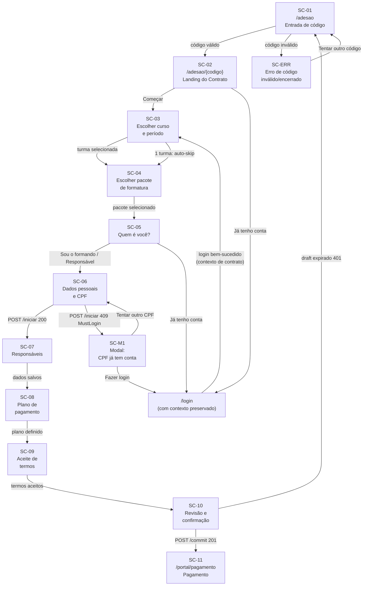

# Wireframe Spec — Adesão Pública via Código do Contrato

## 1. Contexto

**Objetivo da feature:** Permitir que um formando novo realize sua adesão a um pacote de formatura sem criar conta previamente, digitando um código humano-legível do contrato (ex: `ARTFINAL-USP-MED-2026`).

**Tipo de usuário:** Público anônimo (formando novo) OU responsável (pai/mãe) cadastrando um formando. Formandos com conta existente são redirecionados para login.

**Dispositivo primário:** Mobile-first (320px–428px base). Breakpoint tablet: 768px. Breakpoint desktop: 1024px+ (wizard centralizado, max-width 600px).

**Fluxo de entrada:**

- URL direta: `portalartfinal.com.br/adesao/ARTFINAL-USP-MED-2026`
- Ou formulário em `portalartfinal.com.br/adesao` onde digita o código

**Fluxo de saída:**

- Commit bem-sucedido → auto-login → `/portal/pagamento/:intent_id`
- CPF já tem conta → modal → `/login` (preservando contexto)
- Erro de código → mensagem inline + CTA "tente novamente"

---

## 2. Inventário de Telas

| #   | ID     | Nome                                  | Rota/URL                             | Tipo          |
| --- | ------ | ------------------------------------- | ------------------------------------ | ------------- |
| 1   | SC-01  | Entrada de código                     | `/adesao`                            | page          |
| 2   | SC-02  | Landing do Contrato                   | `/adesao/{codigo}`                   | page          |
| 3   | SC-03  | Escolher curso e período              | `/adesao/{codigo}?step=turma`        | wizard-step   |
| 4   | SC-04  | Escolher pacote de formatura          | `/adesao/{codigo}?step=pacote`       | wizard-step   |
| 5   | SC-05  | Quem é você?                          | `/adesao/{codigo}?step=solicitante`  | wizard-step   |
| 6   | SC-06  | Dados pessoais e CPF                  | `/adesao/{codigo}?step=dados`        | wizard-step   |
| 7   | SC-07  | Responsáveis                          | `/adesao/{codigo}?step=responsaveis` | wizard-step   |
| 8   | SC-08  | Plano de pagamento                    | `/adesao/{codigo}?step=pagamento`    | wizard-step   |
| 9   | SC-09  | Aceite de termos                      | `/adesao/{codigo}?step=termos`       | wizard-step   |
| 10  | SC-10  | Revisão e confirmação                 | `/adesao/{codigo}?step=revisao`      | wizard-step   |
| 11  | SC-11  | Pagamento pós-adesão                  | `/portal/pagamento/:intent_id`       | page (portal) |
| 12  | SC-M1  | Modal: CPF já tem conta               | (overlay sobre SC-06)                | modal         |
| 13  | SC-M2  | Modal: Contrato inválido/desabilitado | (overlay sobre SC-01 ou SC-02)       | modal/inline  |
| 14  | SC-ERR | Estado sem turmas disponíveis         | `/adesao/{codigo}` bloqueada         | error state   |

---

## 3. Especificação por Tela

---

### SC-01 — Entrada de código

**Propósito:** Formando digita o código do contrato para iniciar sua adesão.

**Ator:** Público anônimo
**Estado de entrada:** Nenhum dado carregado. Página pública, sem auth.
**Estado de saída:** Código validado → navega para SC-02 (`/adesao/{codigo}`)

#### Layout

```
┌───────────────────────────┐
│  LOGO PortalArtFinal      │
├───────────────────────────┤
│                           │
│  [Ilustração ou arte      │
│   representando formatura]│
│                           │
│  Título:                  │
│  "Digite o código da      │
│   sua turma"              │
│                           │
│  Subtítulo:               │
│  "Você recebeu o código   │
│   da comissão por         │
│   WhatsApp ou e-mail."    │
│                           │
│  ┌───────────────────┐    │
│  │ ARTFINAL-USP-...  │    │   ← input código (maiúsculas automáticas)
│  └───────────────────┘    │
│                           │
│  [Botão] "Continuar" ►    │   ← CTA primário
│                           │
│  "Já tenho conta"         │   ← link secundário → /login
│                           │
└───────────────────────────┘
```

#### Componentes

| ID  | Componente      | Tipo           | Dados exibidos                       | Interação                                             |
| --- | --------------- | -------------- | ------------------------------------ | ----------------------------------------------------- |
| C1  | Logo            | imagem         | logo PortalArtFinal                  | nenhuma                                               |
| C2  | Ilustração hero | imagem         | arte visual de formatura             | nenhuma                                               |
| C3  | Título          | heading h1     | "Digite o código da sua turma"       | nenhuma                                               |
| C4  | Subtítulo       | paragraph      | instrução sobre de onde vem o código | nenhuma                                               |
| C5  | Input código    | text input     | placeholder: `ARTFINAL-USP-MED-2026` | digitação — auto-uppercase, regex `^[A-Z0-9-]{4,32}$` |
| C6  | Botão Continuar | button primary | "Continuar"                          | clique → valida + navega                              |
| C7  | Link login      | link           | "Já tenho conta"                     | clique → `/login`                                     |

#### Dados da API

```
Nenhuma chamada na renderização inicial.
Ao clicar "Continuar": navega para /adesao/{codigo} que dispara GET /api/v1/adesao/publico/{codigo}
```

#### CTAs

| Botão/Link | Rótulo           | Ação                               | Destino                  |
| ---------- | ---------------- | ---------------------------------- | ------------------------ |
| Primário   | "Continuar"      | valida formato localmente + navega | SC-02 `/adesao/{codigo}` |
| Secundário | "Já tenho conta" | navega                             | `/login`                 |

#### Estados da Tela

| Estado           | Quando ocorre                       | O que muda no layout                                                     |
| ---------------- | ----------------------------------- | ------------------------------------------------------------------------ |
| Inicial          | página carregada                    | formulário em branco, botão habilitado                                   |
| Formato inválido | usuário digita caracteres proibidos | mensagem inline "Código deve conter letras maiúsculas, números e hífens" |
| Loading          | após clicar "Continuar"             | botão com spinner, input disabled                                        |

#### Validações visíveis ao usuário

- Código: obrigatório, mínimo 4 e máximo 32 caracteres
- Caracteres permitidos: `A-Z`, `0-9`, `-` (hífen)
- Mensagem: "Código inválido. Use apenas letras maiúsculas, números e hífens."

#### Notas para o designer

- Input deve converter automaticamente para maiúsculas ao digitar (CSS `text-transform: uppercase` + JS)
- Fonte do input: monoespaçada para facilitar leitura do código
- Em mobile: teclado sugerido pode ser `inputmode="text"` com autocomplete off
- Cor de fundo: tema claro/branco — tela pública de entrada
- Sem header de navegação complexo — apenas logo e minimalismo

---

### SC-02 — Landing do Contrato

**Propósito:** Exibir informações do contrato validado e convidar o formando a iniciar o wizard.

**Ator:** Público anônimo
**Estado de entrada:** `GET /api/v1/adesao/publico/{codigo}` retornou 200 com dados do contrato
**Estado de saída:** Usuário clica "Começar minha adesão" → SC-03

#### Layout

```
┌───────────────────────────┐
│  ← Voltar   LOGO          │
├───────────────────────────┤
│                           │
│  [Chip/Badge]: MEDICINA   │   ← categoria do contrato
│                           │
│  Título grande:           │
│  "Formatura Medicina      │
│   USP 2026"               │
│                           │
│  ┌──────────────────┐     │
│  │ 🏛  Instituição  │     │   ← card info contrato
│  │     USP          │     │
│  ├──────────────────┤     │
│  │ 📅 Adesões até  │     │
│  │    30 Jun 2026   │     │
│  └──────────────────┘     │
│                           │
│  [Divisor]                │
│                           │
│  "O que você vai          │
│   escolher:"              │
│                           │
│  ✓ Curso e período        │
│  ✓ Pacote de formatura    │
│  ✓ Plano de pagamento     │
│                           │
│  [Botão] "Começar         │
│   minha adesão" ►         │   ← CTA primário
│                           │
│  "Já tenho conta" →       │   ← link
│                           │
└───────────────────────────┘
```

#### Componentes

| ID  | Componente      | Tipo           | Dados exibidos                          | Interação                           |
| --- | --------------- | -------------- | --------------------------------------- | ----------------------------------- |
| C1  | Header mínimo   | nav            | logo + botão voltar                     | voltar → SC-01                      |
| C2  | Badge categoria | chip           | `contrato.categoria`                    | nenhuma                             |
| C3  | Título contrato | heading h1     | `contrato.nome`                         | nenhuma                             |
| C4  | Card info       | card           | instituição, data_fim_adesao            | nenhuma                             |
| C5  | Lista de etapas | ul             | etapas do que o formando vai configurar | nenhuma                             |
| C6  | Botão Começar   | button primary | "Começar minha adesão"                  | clique → SC-03                      |
| C7  | Link login      | link           | "Já tenho conta"                        | clique → `/login?contrato={codigo}` |

#### Dados da API

```
GET /api/v1/adesao/publico/{codigo}
Retorna:
  contrato: { ulid, codigo_acesso, nome, status, data_fim_adesao,
               exige_responsavel_*, instituicao }
  turmas_disponiveis: [{ ulid, curso, ano_formatura, semestre_formatura, rotulo }]
  pacotes_formatura: [{ ulid, nome, preco_vigente_centavos, beneficios }]
  condicoes_pagamento: [...]
  termo_vigente: { ulid, versao }

Dados carregados aqui, armazenados na store para uso em etapas posteriores.
```

#### CTAs

| Botão/Link | Rótulo                 | Ação                | Destino                    |
| ---------- | ---------------------- | ------------------- | -------------------------- |
| Primário   | "Começar minha adesão" | inicia wizard       | SC-03 (step=turma)         |
| Voltar     | "← Voltar"             | navega              | SC-01                      |
| Secundário | "Já tenho conta"       | navega com contexto | `/login?contrato={codigo}` |

#### Estados da Tela

| Estado                    | Quando ocorre                    | O que muda no layout                                                   |
| ------------------------- | -------------------------------- | ---------------------------------------------------------------------- |
| Loading                   | aguardando GET /publico/{codigo} | skeleton nos campos título, instituição, data                          |
| Sucesso                   | dados carregados                 | conteúdo real exibido                                                  |
| Código inválido (404)     | contrato não encontrado          | estado de erro inline (ver SC-M2)                                      |
| Adesão desabilitada (403) | `adesao_publica_ativa=false`     | mensagem "Adesões encerradas neste contrato" + CTA "Contatar comissão" |
| Contrato encerrado (403)  | `data_fim_adesao < hoje`         | mensagem "Prazo encerrado em DD/MM/AAAA"                               |

#### Notas para o designer

- Data de encerramento: exibir com urgência se < 7 dias restantes (badge vermelho "X dias restantes")
- Instituição com logo/avatar se disponível
- A lista de "o que você vai escolher" serve como preview de esforço — tranquiliza o formando
- Card info em fundo levemente contrastado para destacar dados principais

---

### SC-03 — Escolher curso e período

**Propósito:** Formando seleciona qual turma (combinação de curso + ano + semestre) pertence dentro do contrato.

**Ator:** Público anônimo
**Estado de entrada:** Dados do contrato carregados (SC-02). `turmas_disponiveis[]` disponível na store.
**Estado de saída:** `turma_ulid` persistido na store → avança para SC-04

> **OQ-NOVA-1 (SPEC-010 §9):** Se `turmas_disponiveis.length === 1`, a UI pode pular automaticamente esta etapa (pré-selecionar e avançar), exibindo apenas confirmação visual.

#### Layout

```
┌───────────────────────────┐
│  ← Voltar                 │
│  ─────── Passo 1 de 8 ─── │   ← barra de progresso
├───────────────────────────┤
│                           │
│  Título:                  │
│  "Qual é o seu curso      │
│   e período?"             │
│                           │
│  Subtítulo:               │
│  "Selecione a turma que   │
│   você pertence dentro    │
│   do contrato             │
│   [nome do contrato]."    │
│                           │
│  ┌──────────────────────┐ │
│  │ ○ Medicina USP 2026/1│ │   ← opção turma (radio card)
│  └──────────────────────┘ │
│  ┌──────────────────────┐ │
│  │ ● Medicina USP 2026/2│ │   ← opção selecionada
│  └──────────────────────┘ │
│                           │
│  [Botão] "Continuar" ►    │   ← habilitado apenas se 1 selecionado
│                           │
└───────────────────────────┘
```

#### Componentes

| ID  | Componente         | Tipo            | Dados exibidos                                                        | Interação                |
| --- | ------------------ | --------------- | --------------------------------------------------------------------- | ------------------------ |
| C1  | Barra de progresso | progress bar    | "Passo 1 de 8"                                                        | nenhuma                  |
| C2  | Título + subtítulo | heading h2 + p  | instrução + nome do contrato                                          | nenhuma                  |
| C3  | Cards de turma     | radio card list | `turma.rotulo` por item                                               | seleção única (click)    |
| C4  | Detalhe turma      | subtext no card | `turma.curso.nome`, `turma.ano_formatura`, `turma.semestre_formatura` | nenhuma                  |
| C5  | Botão Continuar    | button primary  | "Continuar"                                                           | clique → valida + avança |

#### Dados da API

```
Nenhuma chamada nesta etapa.
Dados de turmas_disponiveis[] já estão na store (carregados no SC-02).
```

#### CTAs

| Botão/Link | Rótulo      | Ação                                  | Destino |
| ---------- | ----------- | ------------------------------------- | ------- |
| Primário   | "Continuar" | persiste turma_ulid na store + avança | SC-04   |
| Voltar     | "← Voltar"  | navega                                | SC-02   |

#### Estados da Tela

| Estado      | Quando ocorre                     | O que muda no layout                                                                                   |
| ----------- | --------------------------------- | ------------------------------------------------------------------------------------------------------ |
| Sem seleção | nenhuma turma escolhida           | botão "Continuar" desabilitado (opacity 50%)                                                           |
| Com seleção | turma clicada                     | card destaca com borda colorida + ícone check, botão habilitado                                        |
| Auto-skip   | `turmas_disponiveis.length === 1` | turma pré-selecionada, toast "Turma Medicina USP 2026/1 selecionada automaticamente", avança após 1.5s |

#### Validações visíveis ao usuário

- Seleção obrigatória: botão permanece inativo até selecionar
- Se 0 opções disponíveis (caso de erro): exibido estado SC-ERR

#### Notas para o designer

- Card de turma: layout horizontal — nome em destaque (bold) + semestre/ano em cinza menor
- Estado selecionado: borda brand-primary + check icon + background levemente colorido
- Máximo esperado de turmas por contrato: 4-6 (scroll vertical se necessário)
- Barra de progresso: 8 passos no total para o wizard completo

---

### SC-04 — Escolher pacote de formatura

**Propósito:** Formando seleciona 1 pacote da categoria `formatura` disponível no contrato.

**Ator:** Público anônimo
**Estado de entrada:** `turma_ulid` na store. `pacotes_formatura[]` disponível na store.
**Estado de saída:** `pacote_ulid` persistido na store → avança para SC-05

#### Layout

```
┌───────────────────────────┐
│  ← Voltar                 │
│  ─────── Passo 2 de 8 ─── │
├───────────────────────────┤
│                           │
│  Título:                  │
│  "Escolha seu pacote      │
│   de formatura"           │
│                           │
│  ┌──────────────────────┐ │
│  │ Pacote Premium        │ │   ← card pacote
│  │ R$ 15.000,00          │ │
│  │ ─────────────────     │ │
│  │ ✓ Jantar              │ │   ← benefícios
│  │ ✓ Open bar            │ │
│  │ ✓ Fotos oficiais      │ │
│  │            ○ Selecionar│ │   ← radio implícito
│  └──────────────────────┘ │
│                           │
│  ┌──────────────────────┐ │
│  │ Pacote Essencial      │ │
│  │ R$ 9.500,00           │ │
│  │ ─────────────────     │ │
│  │ ✓ Jantar              │ │
│  │ ✓ Fotos oficiais      │ │
│  │            ○ Selecionar│ │
│  └──────────────────────┘ │
│                           │
│  [Botão] "Continuar" ►    │
│                           │
└───────────────────────────┘
```

#### Componentes

| ID  | Componente          | Tipo                | Dados exibidos                                                                    | Interação                                 |
| --- | ------------------- | ------------------- | --------------------------------------------------------------------------------- | ----------------------------------------- |
| C1  | Barra de progresso  | progress bar        | "Passo 2 de 8"                                                                    | nenhuma                                   |
| C2  | Título              | heading h2          | instrução                                                                         | nenhuma                                   |
| C3  | Cards de pacote     | radio card list     | `pacote.nome`, `pacote.preco_vigente_centavos` (formatado), `pacote.beneficios[]` | seleção única (clique no card)            |
| C4  | Badge de preço      | destaque            | preço formatado em R$                                                             | nenhuma                                   |
| C5  | Lista de benefícios | ul com ícones check | `pacote.beneficios`                                                               | nenhuma                                   |
| C6  | Botão Continuar     | button primary      | "Continuar"                                                                       | habilitado apenas se 1 pacote selecionado |

#### Dados da API

```
Nenhuma chamada nesta etapa.
Dados de pacotes_formatura[] já estão na store (carregados no SC-02).
Preço formatado: preco_vigente_centavos / 100 → R$ 15.000,00
```

#### CTAs

| Botão/Link | Rótulo      | Ação                                   | Destino |
| ---------- | ----------- | -------------------------------------- | ------- |
| Primário   | "Continuar" | persiste pacote_ulid na store + avança | SC-05   |
| Voltar     | "← Voltar"  | navega                                 | SC-03   |

#### Estados da Tela

| Estado       | Quando ocorre                    | O que muda no layout                                 |
| ------------ | -------------------------------- | ---------------------------------------------------- |
| Sem seleção  | nenhum pacote escolhido          | botão desabilitado                                   |
| Selecionado  | pacote clicado                   | card selecionado com borda + check + destaque de cor |
| Pacote único | `pacotes_formatura.length === 1` | pacote pré-selecionado, botão habilitado diretamente |

#### Notas para o designer

- Preço em destaque: fonte maior, peso bold, cor brand
- Benefícios: ícone check colorido + texto (não bullets simples)
- Possível "selos" visuais: "Mais popular", "Mais completo" (dados do contrato se disponíveis)
- Scroll vertical se houver >3 pacotes
- Pacotes `categoria='extra'` nunca aparecem aqui — filtro aplicado no backend

---

### SC-05 — Quem é você?

**Propósito:** Distinguir se o solicitante é o próprio formando ou um responsável (pai/mãe) cadastrando outra pessoa.

**Ator:** Público anônimo
**Estado de entrada:** `turma_ulid` e `pacote_ulid` na store
**Estado de saída:** `tipo_solicitante` persistido na store → avança para SC-06

#### Layout

```
┌───────────────────────────┐
│  ← Voltar                 │
│  ─────── Passo 3 de 8 ─── │
├───────────────────────────┤
│                           │
│  Título:                  │
│  "Quem está fazendo       │
│   a adesão?"              │
│                           │
│  ┌──────────────────────┐ │
│  │ 🎓  Sou o próprio    │ │   ← opção A (radio card)
│  │     formando         │ │
│  └──────────────────────┘ │
│                           │
│  ┌──────────────────────┐ │
│  │ 👨‍👧  Estou cadastrando │ │   ← opção B (radio card)
│  │     outra pessoa     │ │
│  │     (filho/a,        │ │
│  │     dependente)      │ │
│  └──────────────────────┘ │
│                           │
│  ─── ou ───               │
│                           │
│  "Já tenho conta →        │   ← link login com contexto
│   Fazer login"            │
│                           │
│  [Botão] "Continuar" ►    │
│                           │
└───────────────────────────┘
```

#### Componentes

| ID  | Componente         | Tipo           | Dados exibidos                                   | Interação                                                                   |
| --- | ------------------ | -------------- | ------------------------------------------------ | --------------------------------------------------------------------------- |
| C1  | Barra de progresso | progress bar   | "Passo 3 de 8"                                   | nenhuma                                                                     |
| C2  | Título             | heading h2     | "Quem está fazendo a adesão?"                    | nenhuma                                                                     |
| C3  | Card opção A       | radio card     | ícone formando + "Sou o próprio formando"        | clique → `tipo_solicitante='proprio'`                                       |
| C4  | Card opção B       | radio card     | ícone família + "Estou cadastrando outra pessoa" | clique → `tipo_solicitante='responsavel'`                                   |
| C5  | Divisor "ou"       | hr + label     | "ou"                                             | visual                                                                      |
| C6  | Link login         | link           | "Já tenho conta → Fazer login"                   | clique → `/login?contrato={codigo}&turma={turma_ulid}&pacote={pacote_ulid}` |
| C7  | Botão Continuar    | button primary | "Continuar"                                      | habilitado após seleção                                                     |

#### CTAs

| Botão/Link | Rótulo        | Ação                               | Destino                   |
| ---------- | ------------- | ---------------------------------- | ------------------------- |
| Primário   | "Continuar"   | persiste tipo_solicitante + avança | SC-06                     |
| Login      | "Fazer login" | navega com contexto preservado     | `/login` com query params |
| Voltar     | "← Voltar"    | navega                             | SC-04                     |

#### Estados da Tela

| Estado              | Quando ocorre                           | O que muda no layout               |
| ------------------- | --------------------------------------- | ---------------------------------- |
| Sem seleção         | página aberta                           | botão desabilitado                 |
| Opção A selecionada | clicou "Sou o próprio formando"         | card A destacado, botão habilitado |
| Opção B selecionada | clicou "Estou cadastrando outra pessoa" | card B destacado, botão habilitado |

#### Notas para o designer

- Ícones grandes e amigáveis nos cards — esta etapa cria empatia, não deve ser árida
- "Fazer login" deve ser discreto mas encontrável — não é o caminho principal
- Cards em tamanho grande, fácil de tocar em mobile

---

### SC-06 — Dados pessoais e CPF

**Propósito:** Coletar dados do formando (e do solicitante se `tipo_solicitante='responsavel'`); validar CPF contra base de usuários existentes.

**Ator:** Público anônimo
**Estado de entrada:** `tipo_solicitante` na store
**Estado de saída:** `POST /iniciar` retorna `draft_token` → avança para SC-07 | OU → Modal SC-M1 (CPF já existe)

#### Layout (modo `tipo_solicitante='proprio'`)

```
┌───────────────────────────┐
│  ← Voltar                 │
│  ─────── Passo 4 de 8 ─── │
├───────────────────────────┤
│                           │
│  Título:                  │
│  "Seus dados pessoais"    │
│                           │
│  ┌───────────────────┐    │
│  │ Nome completo *   │    │   ← input text
│  └───────────────────┘    │
│                           │
│  ┌───────────────────┐    │
│  │ CPF *             │    │   ← input com máscara 000.000.000-00
│  └───────────────────┘    │
│                           │
│  ┌───────────────────┐    │
│  │ Data de nascimento│    │   ← date picker / input DD/MM/AAAA
│  └───────────────────┘    │
│                           │
│  ┌───────────────────┐    │
│  │ E-mail *          │    │   ← input email
│  └───────────────────┘    │
│                           │
│  ┌───────────────────┐    │
│  │ Telefone *        │    │   ← input com máscara +55 (11) 00000-0000
│  └───────────────────┘    │
│                           │
│  [Botão] "Continuar" ►    │
│                           │
└───────────────────────────┘
```

#### Layout adicional (modo `tipo_solicitante='responsavel'`)

Após os dados do formando, exibe seção adicional:

```
│  ── Seus dados (responsável) ──    │
│                                     │
│  ┌──────────────────────────────┐  │
│  │ Seu nome completo *          │  │
│  └──────────────────────────────┘  │
│  ┌──────────────────────────────┐  │
│  │ Seu CPF *                    │  │
│  └──────────────────────────────┘  │
│  ┌──────────────────────────────┐  │
│  │ Seu e-mail *                 │  │
│  └──────────────────────────────┘  │
│  ┌──────────────────────────────┐  │
│  │ Seu telefone *               │  │
│  └──────────────────────────────┘  │
│  ┌──────────────────────────────┐  │
│  │ Vínculo com o formando *     │  │   ← select: mãe/pai/avó/avô/cônjuge/outro
│  └──────────────────────────────┘  │
```

#### Componentes

| ID  | Componente         | Tipo                   | Dados exibidos                                     | Interação              |
| --- | ------------------ | ---------------------- | -------------------------------------------------- | ---------------------- |
| C1  | Barra de progresso | progress bar           | "Passo 4 de 8"                                     | nenhuma                |
| C2  | Seção formando     | fieldset               | campos do formando                                 | digitação              |
| C3  | Input nome         | text                   | label "Nome completo"                              | digitação              |
| C4  | Input CPF          | text + máscara         | label "CPF", máscara `000.000.000-00`              | digitação              |
| C5  | Input data nasc    | date                   | label "Data de nascimento"                         | seleção                |
| C6  | Input email        | email                  | label "E-mail"                                     | digitação              |
| C7  | Input telefone     | tel + máscara          | label "Telefone", máscara nacional                 | digitação              |
| C8  | Seção solicitante  | fieldset (condicional) | visível apenas se `tipo_solicitante='responsavel'` | digitação              |
| C9  | Select vínculo     | select                 | mãe / pai / avó / avô / cônjuge / outro            | seleção                |
| C10 | Botão Continuar    | button primary         | "Continuar"                                        | clique → POST /iniciar |

#### Dados da API

```
POST /api/v1/adesao/publico/{codigo}/iniciar
Body: {
  tipo_solicitante: "proprio" | "responsavel",
  cpf_formando: "123.456.789-09",
  turma_ulid: "01J...",
  pacote_ulid: "01J..."
}

Response 200: { draft_token, expires_at }  → avança para SC-07
Response 409 MustLogin: { error: "MustLogin", details.login_hint }  → abre SC-M1
Response 422: { error: "ValidationError", details.fields }  → erros inline
```

#### CTAs

| Botão/Link | Rótulo      | Ação          | Destino                        |
| ---------- | ----------- | ------------- | ------------------------------ |
| Primário   | "Continuar" | POST /iniciar | SC-07 (sucesso) ou SC-M1 (409) |
| Voltar     | "← Voltar"  | navega        | SC-05                          |

#### Estados da Tela

| Estado            | Quando ocorre            | O que muda no layout                            |
| ----------------- | ------------------------ | ----------------------------------------------- |
| Preenchimento     | campos em branco         | botão desabilitado até obrigatórios preenchidos |
| Loading           | aguardando POST /iniciar | botão com spinner, todos inputs disabled        |
| Erro de validação | 422 da API               | erro inline sob cada campo afetado              |
| CPF existente     | 409 MustLogin            | abre modal SC-M1 (botão sem erro inline aqui)   |
| Sucesso           | 200 draft_token          | armazena token na store, navega para SC-07      |

#### Validações visíveis ao usuário

- Nome: obrigatório, mínimo 3 chars
- CPF: obrigatório, formato `000.000.000-00`, validação módulo 11
- Data de nascimento: obrigatório, formato DD/MM/AAAA
- E-mail: obrigatório, formato válido
- Telefone: obrigatório, formato brasileiro

#### Notas para o designer

- CPF: campo mais sensível — validação em tempo real (módulo 11) com feedback visual antes de submeter
- Máscara automática no CPF e telefone ao digitar
- Seção do solicitante (modo responsável) aparece separada por divisor visual com label "Seus dados"
- Em modo responsável: label do primeiro fieldset muda para "Dados do formando" vs apenas "Seus dados"
- Teclado numérico no CPF: `inputmode="numeric"`

---

### SC-07 — Responsáveis

**Propósito:** Definir responsável cadastral e responsável financeiro (podem ser o formando, o solicitante ou outra pessoa).

**Ator:** Solicitante (wizard ativo, draft_token válido)
**Estado de entrada:** `draft_token` na store (store em sessionStorage)
**Estado de saída:** Dados de responsáveis salvos na store → avança para SC-08

#### Layout

```
┌───────────────────────────┐
│  ← Voltar                 │
│  ─────── Passo 5 de 8 ─── │
├───────────────────────────┤
│                           │
│  Título:                  │
│  "Responsáveis"           │
│                           │
│  ── Responsável cadastral─┤
│                           │
│  Quem será o responsável  │
│  pelo cadastro?           │
│                           │
│  ○ O próprio formando     │
│  ○ Quem está preenchendo  │   ← (o solicitante)
│     (Maria Silva)         │
│  ○ Outra pessoa           │
│                           │
│  [Se "Outra pessoa":      │
│   exibe campos adicionais]│
│                           │
│  ── Responsável financeiro┤
│                           │
│  Quem será o responsável  │
│  financeiro?              │
│                           │
│  ○ O próprio formando     │
│  ○ Quem está preenchendo  │
│     (Maria Silva)         │
│  ○ Outra pessoa           │
│                           │
│  [Se "Outra pessoa":      │
│   campos adicionais]      │
│                           │
│  [Botão] "Continuar" ►    │
│                           │
└───────────────────────────┘
```

#### Componentes

| ID  | Componente             | Tipo           | Dados exibidos                                | Interação                                 |
| --- | ---------------------- | -------------- | --------------------------------------------- | ----------------------------------------- |
| C1  | Barra de progresso     | progress bar   | "Passo 5 de 8"                                | nenhuma                                   |
| C2  | Seção resp. cadastral  | fieldset       | 3 opções radio + condicional de campos        | seleção                                   |
| C3  | Seção resp. financeiro | fieldset       | 3 opções radio + condicional de campos        | seleção                                   |
| C4  | Campos "Outra pessoa"  | text inputs    | nome, CPF, email, telefone da terceira pessoa | digitação (aparece se radio=outra_pessoa) |
| C5  | Botão Continuar        | button primary | "Continuar"                                   | habilitado após ambas seleções            |

#### Dados da API

```
Nenhuma chamada nesta etapa.
Dados salvos na store Zustand para uso no commit final.
Header X-Adesao-Draft-Token obrigatório a partir daqui em chamadas futuras.
```

#### CTAs

| Botão/Link | Rótulo      | Ação                    | Destino |
| ---------- | ----------- | ----------------------- | ------- |
| Primário   | "Continuar" | persiste dados na store | SC-08   |
| Voltar     | "← Voltar"  | navega                  | SC-06   |

#### Estados da Tela

| Estado               | Quando ocorre                | O que muda no layout                         |
| -------------------- | ---------------------------- | -------------------------------------------- |
| Opção "Outra pessoa" | radio selecionado            | exibe fieldset com campos da terceira pessoa |
| Incompleto           | campos obrigatórios faltando | botão desabilitado                           |

#### Notas para o designer

- Rótulo dinâmico: se solicitante=próprio formando, opção "Quem está preenchendo" mostra o nome do próprio formando
- Os dois responsáveis podem ser a mesma pessoa — o backend lida com isso
- Expansão de campos ao selecionar "Outra pessoa": animação suave, não colaps

---

### SC-08 — Plano de pagamento

**Propósito:** Formando escolhe método de pagamento, quantidade de parcelas, dia de vencimento e opcionalmente um cupom. Simulação em tempo real via API.

**Ator:** Solicitante (draft_token válido)
**Estado de entrada:** `draft_token` + `pacote_ulid` + `turma_ulid` na store
**Estado de saída:** Dados do plano persistidos na store → avança para SC-09

#### Layout

```
┌───────────────────────────┐
│  ← Voltar                 │
│  ─────── Passo 6 de 8 ─── │
├───────────────────────────┤
│                           │
│  Título:                  │
│  "Como você quer pagar?"  │
│                           │
│  ── 1ª parcela via ───────┤
│  ○ PIX     ○ Boleto  ○ Cartão
│                           │
│  ── Demais parcelas via ──┤  ← oculto se qtd=1 ou PIX
│  ○ Boleto   ○ Cartão      │
│                           │
│  ── Quantidade ───────────┤
│  [Slider ou select 1–12]  │
│                           │
│  ── Vencimento ───────────┤
│  [Select dia 1–28]        │
│                           │
│  ── Cupom ────────────────┤
│  ┌─────────────────────┐  │
│  │ Código de desconto  │  │   ← opcional
│  └─────────────────────┘  │
│                           │
│  ═══ Simulação ════════════│
│                           │
│  Valor total: R$ 13.500   │   ← em tempo real
│  Desconto: -10% (PIX)     │
│  Parcelas: 1x R$ 13.500   │
│  Vencimento: dia 5        │
│                           │
│  [Botão] "Continuar" ►    │
│                           │
└───────────────────────────┘
```

#### Componentes

| ID  | Componente              | Tipo             | Dados exibidos                              | Interação                           |
| --- | ----------------------- | ---------------- | ------------------------------------------- | ----------------------------------- |
| C1  | Barra de progresso      | progress bar     | "Passo 6 de 8"                              | nenhuma                             |
| C2  | Radio método 1ª parcela | radio group      | PIX / Boleto / Cartão                       | seleção — filtra opções de "demais" |
| C3  | Radio método demais     | radio group      | Boleto / Cartão (PIX sempre bloqueado aqui) | visível se parcelas > 1 e 1ª ≠ PIX  |
| C4  | Seletor parcelas        | select ou slider | valores: 1–12 (filtrado por método)         | seleção → dispara simulação         |
| C5  | Seletor vencimento      | select           | dia 1 ao 28                                 | seleção → dispara simulação         |
| C6  | Input cupom             | text             | placeholder "Código de desconto"            | digitação → botão "Aplicar"         |
| C7  | Card simulação          | card resumo      | total, desconto, parcelas, vencimento       | atualiza em tempo real              |
| C8  | Botão Continuar         | button primary   | "Continuar"                                 | avança para SC-09                   |

#### Dados da API

```
POST /api/v1/adesao/publico/simular
Header: X-Adesao-Draft-Token: {draft_token}
Body: {
  turma_ulid, pacote_ulid,
  qtd_parcelas, metodo_primeira_parcela,
  metodo_demais, data_vencimento_dia, cupom
}
Disparado com debounce de 600ms após cada mudança nos campos.

Regras de negócio por método (validadas antes de chamar a API):
- PIX: força qtd_parcelas=1 automaticamente
- Cartão: força qtd_parcelas >= 2 (bloqueia opção "1x")
- metodo_demais=pix: bloqueado sempre (nunca exibido)
```

#### CTAs

| Botão/Link | Rótulo      | Ação                    | Destino |
| ---------- | ----------- | ----------------------- | ------- |
| Primário   | "Continuar" | persiste plano na store | SC-09   |
| Voltar     | "← Voltar"  | navega                  | SC-07   |

#### Estados da Tela

| Estado               | Quando ocorre            | O que muda no layout                                                       |
| -------------------- | ------------------------ | -------------------------------------------------------------------------- |
| Carregando simulação | aguardando POST /simular | card simulação com skeleton/spinner                                        |
| PIX selecionado      | método=pix               | qtd_parcelas travado em 1, "demais parcelas" oculto, desconto -10% exibido |
| Cartão selecionado   | método=cartão            | opção "1x" removida do seletor de parcelas                                 |
| Cupom inválido       | API rejeita              | mensagem inline "Cupom inválido ou expirado"                               |
| Cupom válido         | API aceita               | desconto do cupom somado + feedback visual "Cupom aplicado ✓"              |
| Erro de combinação   | método inválido          | mensagem inline explicando a restrição                                     |

#### Validações visíveis ao usuário

- PIX: "PIX só está disponível para pagamento à vista (1 parcela)"
- Cartão: "Cartão de crédito requer mínimo 2 parcelas"
- PIX nas demais parcelas: esta opção simplesmente não aparece no radio "Demais parcelas"

#### Notas para o designer

- Card de simulação: âncora visual da tela — deve ser sempre visível (sticky no bottom antes do botão em mobile)
- Valores sempre em Reais com centavos (R$ 13.500,00 — nunca R$ 13.500)
- Regras de método: implementar via disable/hide de opções — não via mensagem de erro
- Slider de parcelas: mais intuitivo que select em mobile, mas testar usabilidade

---

### SC-09 — Aceite de termos

**Propósito:** Formando lê e aceita os termos do contrato (versão vigente).

**Ator:** Solicitante (draft_token válido)
**Estado de entrada:** `termo_vigente.ulid` e `termo_vigente.versao` na store
**Estado de saída:** `aceitou_termos=true` persistido na store → avança para SC-10

#### Layout

```
┌───────────────────────────┐
│  ← Voltar                 │
│  ─────── Passo 7 de 8 ─── │
├───────────────────────────┤
│                           │
│  Título:                  │
│  "Termos e condições"     │
│                           │
│  Versão: v2026-01         │
│                           │
│  ┌──────────────────────┐ │
│  │                      │ │
│  │ [Texto dos termos    │ │   ← scroll interno, altura máx fixada
│  │  do contrato]        │ │
│  │                      │ │
│  │ (scroll ↓)           │ │
│  └──────────────────────┘ │
│                           │
│  □ Li e aceito os termos  │   ← checkbox (habilitado apenas após scroll até o fim)
│    e condições acima      │
│                           │
│  [Botão] "Aceitar e       │
│   continuar" ►            │   ← habilitado após checkbox marcado
│                           │
└───────────────────────────┘
```

#### Componentes

| ID  | Componente         | Tipo           | Dados exibidos                                 | Interação                             |
| --- | ------------------ | -------------- | ---------------------------------------------- | ------------------------------------- |
| C1  | Barra de progresso | progress bar   | "Passo 7 de 8"                                 | nenhuma                               |
| C2  | Label versão       | text           | `termo_vigente.versao`                         | nenhuma                               |
| C3  | Área de termos     | scrollable div | conteúdo do termo (carregado via API ou embed) | scroll                                |
| C4  | Checkbox aceite    | checkbox       | "Li e aceito os termos"                        | clique → habilita botão               |
| C5  | Botão aceitar      | button primary | "Aceitar e continuar"                          | habilitado apenas se checkbox marcado |

#### Dados da API

```
[ESTIMADO] GET /api/v1/adesao/publico/termo/{ulid}
Retorna o conteúdo HTML/Markdown do termo vigente.
Header: X-Adesao-Draft-Token (opcional aqui, mas enviado pelo interceptor)
```

#### CTAs

| Botão/Link | Rótulo                | Ação                            | Destino |
| ---------- | --------------------- | ------------------------------- | ------- |
| Primário   | "Aceitar e continuar" | persiste aceite + ulid do termo | SC-10   |
| Voltar     | "← Voltar"            | navega                          | SC-08   |

#### Estados da Tela

| Estado              | Quando ocorre                   | O que muda no layout                                                 |
| ------------------- | ------------------------------- | -------------------------------------------------------------------- |
| Sem scroll completo | usuário não leu até o fim       | checkbox desabilitado (ou com tooltip "Role até o fim para aceitar") |
| Lido + sem aceite   | scroll completo, checkbox vazio | botão desabilitado                                                   |
| Aceito              | checkbox marcado                | botão habilitado                                                     |

#### Notas para o designer

- Forçar leitura via scroll é opcional — decisão de UX do produto (pode ou não implementar)
- Botão "Baixar PDF dos termos" como link secundário (útil para guardar cópia)
- Versão do termo exibida com clareza — auditoria

---

### SC-10 — Revisão e confirmação

**Propósito:** Mostrar resumo completo de tudo que foi escolhido, checkpoint antes do commit atômico irreversível.

**Ator:** Solicitante (draft_token válido)
**Estado de entrada:** Todos os dados da store preenchidos (contrato + turma + pacote + dados pessoais + responsáveis + plano + aceite)
**Estado de saída:** `POST /commit` → 201 + auto-login → SC-11 (pagamento)

#### Layout

```
┌───────────────────────────┐
│  ← Voltar                 │
│  ─────── Passo 8 de 8 ─── │
├───────────────────────────┤
│                           │
│  Título:                  │
│  "Tudo certo! Revise      │
│   sua adesão"             │
│                           │
│  ┌──────────────────────┐ │
│  │ CONTRATO             │ │   ← seção colapsável
│  │ Formatura Medicina   │ │
│  │ USP 2026             │ │
│  │                      │ │
│  │ CURSO E PERÍODO      │ │
│  │ Medicina USP 2026/2  │ │
│  │                      │ │
│  │ PACOTE               │ │
│  │ Pacote Premium       │ │
│  └──────────────────────┘ │
│                           │
│  ┌──────────────────────┐ │
│  │ SEUS DADOS           │ │
│  │ João Silva           │ │
│  │ CPF: 123.456.789-09  │ │
│  │ joao@email.com       │ │
│  └──────────────────────┘ │
│                           │
│  ┌──────────────────────┐ │
│  │ PAGAMENTO            │ │
│  │ 1ª parcela: PIX      │ │
│  │ Total: R$ 13.500,00  │ │
│  │ 1x de R$ 13.500,00   │ │
│  │ Vencimento: dia 5    │ │
│  └──────────────────────┘ │
│                           │
│  ┌──────────────────────┐ │
│  │ TERMOS               │ │
│  │ ✓ Aceitos (v2026-01) │ │
│  └──────────────────────┘ │
│                           │
│  [Botão] "Confirmar       │
│   minha adesão" ►         │   ← CTA final, peso visual máximo
│                           │
│  Após confirmar, você     │
│  será redirecionado para  │
│  o pagamento.             │
│                           │
└───────────────────────────┘
```

#### Componentes

| ID  | Componente          | Tipo                  | Dados exibidos                                      | Interação                                |
| --- | ------------------- | --------------------- | --------------------------------------------------- | ---------------------------------------- |
| C1  | Barra de progresso  | progress bar          | "Passo 8 de 8" (completo)                           | nenhuma                                  |
| C2  | Card contrato       | card resumo           | nome do contrato, turma escolhida, pacote escolhido | nenhuma (ou link "Editar" → volta etapa) |
| C3  | Card dados pessoais | card resumo           | nome, CPF mascarado, email                          | nenhuma                                  |
| C4  | Card pagamento      | card resumo           | método, total, parcelas, vencimento                 | nenhuma                                  |
| C5  | Card termos         | card resumo           | versão aceita + ✓                                   | nenhuma                                  |
| C6  | Botão confirmar     | button primary grande | "Confirmar minha adesão"                            | clique → POST /commit                    |
| C7  | Texto de apoio      | paragraph             | aviso sobre redirecionamento                        | nenhuma                                  |

#### Dados da API

```
POST /api/v1/adesao/publico/commit
Header: X-Adesao-Draft-Token: {draft_token}
Header: X-Idempotency-Key: {uuid gerado no frontend}
Header: X-Request-Id: {uuid}
Body: { contrato_ulid, turma_ulid, pacote_ulid, formando, solicitante,
         responsavel_cadastro, responsavel_financeiro, plano, aceitou_termos,
         termo_contrato_ulid }

Response 201: { adesao, auto_login_token, auto_login_expires_at, pagamento_intent }
→ armazena Sanctum token, navega para /portal/pagamento/:intent_id
```

#### CTAs

| Botão/Link          | Rótulo                   | Ação                         | Destino         |
| ------------------- | ------------------------ | ---------------------------- | --------------- |
| Primário            | "Confirmar minha adesão" | POST /commit                 | SC-11 (sucesso) |
| Voltar              | "← Voltar"               | navega                       | SC-09           |
| Editar (secundário) | "Editar" por seção       | navega para etapa específica | SC-03 a SC-09   |

#### Estados da Tela

| Estado                    | Quando ocorre           | O que muda no layout                                                      |
| ------------------------- | ----------------------- | ------------------------------------------------------------------------- |
| Normal                    | tudo preenchido         | botão habilitado                                                          |
| Loading                   | aguardando POST /commit | botão com spinner + overlay suave na tela ("Criando sua adesão...")       |
| Erro genérico             | falha na API            | toast de erro + botão habilitado para tentar novamente                    |
| Termo desatualizado (409) | versão do termo mudou   | modal pedindo para aceitar nova versão                                    |
| CPF já registrado (409)   | race condition          | abre SC-M1                                                                |
| Draft expirado (401)      | token expirou (>48h)    | toast "Sua sessão expirou. Comece novamente." + botão "Recomeçar" → SC-01 |

#### Notas para o designer

- Botão "Confirmar" é o mais importante do fluxo — tamanho e cor devem refletir isso
- CPF exibido mascarado: `123.***.***-09` — não mostrar completo na revisão
- Links "Editar" por seção: discreta, mas encontrável — formando pode querer ajustar algo
- Overlay de loading: feedback claro de "estamos criando sua adesão" para evitar double-click

---

### SC-11 — Pagamento pós-adesão

**Propósito:** Primeira parcela do pagamento após adesão concretizada. Formando está agora autenticado via auto_login_token.

**Ator:** Formando autenticado (Sanctum session, auto_login_token de 15min)
**Estado de entrada:** `pagamento_intent.id` da resposta do commit; Sanctum token na session
**Estado de saída:** Pagamento processado → `/portal/home`

#### Layout

```
┌───────────────────────────┐
│  PORTAL ARTFINAL          │   ← header portal logado
│  [Avatar] João Silva      │
├───────────────────────────┤
│                           │
│  🎉 Adesão confirmada!    │   ← celebração — importante para engajamento
│                           │
│  Título:                  │
│  "Agora é só pagar        │
│   a 1ª parcela"           │
│                           │
│  ┌──────────────────────┐ │
│  │ Valor: R$ 13.500,00  │ │
│  │ Via: PIX             │ │
│  │ Vencimento: hoje     │ │
│  └──────────────────────┘ │
│                           │
│  [QR Code PIX]            │   ← se método=pix
│  [Chave PIX para copiar]  │
│  [Botão] "Copiar código"  │
│                           │
│  ── ou ───                │
│  [Link boleto para baixar]│  ← se método=boleto
│  [Botão] "Baixar boleto"  │
│                           │
│  [Link] "Pagar depois →   │   ← link discreto
│   Ir para Início"         │
│                           │
└───────────────────────────┘
```

> Esta tela é parte do módulo de Pagamento (SPEC-003) — wireframe completo será detalhado no WIREFRAME-SPEC-003. Aqui exibido por completude do fluxo.

---

### SC-M1 — Modal: CPF já tem conta (MustLogin)

**Propósito:** Informar ao usuário que o CPF informado já possui conta, e convidá-lo a fazer login.

**Ator:** Público anônimo (tentou submeter SC-06 com CPF existente)
**Estado de entrada:** Resposta 409 MustLogin com `login_hint` mascarado
**Estado de saída:** Clique "Fazer login" → `/login?contrato={codigo}&turma={turma_ulid}&pacote={pacote_ulid}`

#### Layout

```
┌─────────────────────────────┐
│         ×                   │   ← fechar (fecha modal, volta SC-06)
│                             │
│  🔐                         │   ← ícone lock
│                             │
│  "Este CPF já tem conta"    │   ← título do modal
│                             │
│  "Parece que você já tem    │
│   uma conta no portal.      │
│   Seu acesso está vinculado │
│   ao e-mail:                │
│   j***@gmail.com"           │   ← login_hint mascarado
│                             │
│  [Botão] "Fazer login" ►    │   ← CTA primário
│                             │
│  "Não é você? Tente outro   │   ← link secundário
│   CPF"                      │
│                             │
└─────────────────────────────┘
```

#### Componentes

| ID  | Componente        | Tipo           | Dados exibidos                | Interação                      |
| --- | ----------------- | -------------- | ----------------------------- | ------------------------------ |
| C1  | Ícone             | ícone          | 🔐 ou ícone pessoa            | nenhuma                        |
| C2  | Título            | heading        | "Este CPF já tem conta"       | nenhuma                        |
| C3  | Mensagem          | paragraph      | login_hint mascarado          | nenhuma                        |
| C4  | Botão login       | button primary | "Fazer login"                 | clique → `/login` com contexto |
| C5  | Link tentar outro | link           | "Não é você? Tente outro CPF" | fecha modal, volta input CPF   |

#### Notas para o designer

- Modal com overlay escuro no fundo (não tela cheia)
- login_hint: formato `j***@gmail.com` — nunca revelar email completo
- Botão fechar (×) leva de volta ao SC-06 para corrigir o CPF

---

### SC-M2 — Estado de erro: código inválido ou contrato indisponível

**Propósito:** Informar claramente que o código não existe, está desabilitado, ou o contrato está encerrado.

**Ator:** Público anônimo (acessou URL ou digitou código inválido)

#### Variantes

**404 — Código não encontrado:**

```
┌───────────────────────────┐
│  Erro                     │
│  ─────────────────────    │
│  "Código não encontrado"  │
│                           │
│  "Verifique o código que  │
│   você recebeu da         │
│   comissão da sua turma." │
│                           │
│  [Botão] "Tentar novamente│
│   com outro código"       │
└───────────────────────────┘
```

**403 — Adesões encerradas:**

```
┌───────────────────────────┐
│  "Adesões encerradas"     │
│                           │
│  "O prazo de adesão para  │
│   [Nome do Contrato]      │
│   encerrou em 30/06/2026."│
│                           │
│  "Entre em contato com a  │
│   comissão para mais      │
│   informações."           │
│                           │
│  [Botão] "Tentar outro    │
│   código"                 │
└───────────────────────────┘
```

**412 — Sem turmas disponíveis (SC-ERR):**

```
┌───────────────────────────┐
│  "Contrato sem turmas"    │
│                           │
│  "Este contrato ainda não │
│   tem turmas disponíveis. │
│   Contate a comissão para │
│   mais informações."      │
│                           │
│  [Botão] "Tentar outro    │
│   código"                 │
└───────────────────────────┘
```

---

## 4. Fluxo de Navegação



---

## 5. Design Tokens Aplicáveis

| Token                      | Uso nesta feature                                          |
| -------------------------- | ---------------------------------------------------------- |
| `--color-brand-primary`    | botões primários, links ativos, borda card selecionado     |
| `--color-brand-secondary`  | badges de categoria do contrato                            |
| `--color-surface-card`     | cards de seleção (turmas, pacotes, seções de revisão)      |
| `--color-surface-page`     | fundo geral das telas públicas                             |
| `--color-semantic-error`   | mensagens de validação, erros inline                       |
| `--color-semantic-success` | feedback de cupom válido, termos aceitos                   |
| `--color-semantic-warning` | badge "X dias restantes" em datas próximas do encerramento |
| `--color-text-primary`     | títulos e labels                                           |
| `--color-text-secondary`   | subtítulos, instruções, hints                              |
| `--color-text-muted`       | versão do termo, dados mascarados (CPF)                    |
| `--spacing-wizard-step`    | padding interno de cada etapa do wizard                    |
| `--border-radius-card`     | cards de seleção de turma e pacote                         |

---

## 6. Componentes React Existentes a Reutilizar

| Componente          | Localização (estimado)                            | Uso nesta feature                                        |
| ------------------- | ------------------------------------------------- | -------------------------------------------------------- |
| `<WizardShell>`     | `components/wizard/wizard-shell.tsx`              | container de todas as etapas (mode='publico')            |
| `<WizardProgress>`  | `components/wizard/`                              | barra de progresso 8 passos                              |
| `<FormField>`       | `components/ui/`                                  | inputs com label, erro e máscara                         |
| `<RadioCard>`       | `components/ui/`                                  | cards de seleção única (turma, pacote, tipo_solicitante) |
| `<PacoteCard>`      | `components/wizard/escolher-pacote-step.tsx`      | card de pacote com benefícios                            |
| `<SimulacaoCard>`   | `components/wizard/`                              | resumo em tempo real do pagamento                        |
| `<MustLoginDialog>` | `components/adesao-publica/must-login-dialog.tsx` | modal CPF já tem conta                                   |
| `<ErrorPage>`       | `components/ui/`                                  | telas de erro padronizadas (SC-ERR)                      |

---

## 7. Escopo Fora deste Wireframe

- **Categoria `extra`** (convites, mesas premium): não aparece no wizard público — apenas no portal autenticado pós-adesão. Aguardar SPEC futura.
- **Tela de ativação de senha**: o email pós-commit inclui link `/ativar-conta/:token` — wireframe será parte de SPEC-001 (Auth).
- **Tela de cancelamento "não fui eu"**: `/cancelar-adesao/:token` — wireframe parte de SPEC-010 fase 2.
- **Área de pagamento completa**: `/portal/pagamento/:intent_id` — wireframe em WIREFRAME-SPEC-003.
- **Admin: gestão do `codigo_acesso`**: tela admin, wireframe em WIREFRAME-SPEC-011 (Admin: gestão de Contratos).

---

## 8. Checklist para Claude Design

- [x] Todas as 14 telas do §2 foram especificadas no §3
- [x] Cada wizard step tem: barra de progresso, layout, componentes, CTAs, estados
- [x] O fluxo de navegação (§4) conecta todas as telas incluindo modais e erros
- [x] Nenhuma tela órfã (todas têm entrada e saída)
- [x] Estados de loading/error/empty especificados em cada tela
- [x] Mobile-first confirmado (portal = mobile-first)
- [x] Modais documentados (CPF existente, erro de código)
- [x] Regras de pagamento por método (PIX/boleto/cartão) documentadas em SC-08
- [x] CPF mascarado na revisão (SC-10) documentado
- [x] Auto-skip de turma única documentado (SC-03)

---

_Gerado automaticamente pelo skill `wireframe-spec` a partir de SPEC-010 v2.0.0._
_Para implementar: consultar `docs/superpowers/plans/2026-04-19-adesao-publica-codigo-contrato-plan.md`._
